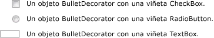

# BulletDecorator
<xref:System.Windows.Controls.Primitives.BulletDecorator>tiene dos propiedades de contenido: <xref:System.Windows.Controls.Primitives.BulletDecorator.Bullet%2A> y <xref:System.Windows.Controls.Decorator.Child%2A>. El <xref:System.Windows.Controls.Primitives.BulletDecorator.Bullet%2A> propiedad define el <xref:System.Windows.UIElement> a usar como viñeta. El <xref:System.Windows.Controls.Decorator.Child%2A> propiedad define un <xref:System.Windows.UIElement> que alinea visualmente con la viñeta.  
  
 En la siguiente ilustración se muestra ejemplos de controles que utilizan un <xref:System.Windows.Controls.Primitives.BulletDecorator>.  
  
   
  
## Referencia  
 <xref:System.Windows.Controls.Primitives.BulletDecorator>
