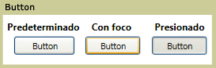

# Botón
A <xref:System.Windows.Controls.Button> control responde a los proporcionados por el usuario desde un mouse, teclado, lápiz, o cualquier otro dispositivo de entrada y genera un <xref:System.Windows.Controls.Primitives.ButtonBase.Click> eventos. A <xref:System.Windows.Controls.Button> es básico [!INCLUDE[TLA#tla_ui](../../../../includes/tlasharptla-ui-md.md)] componente que puede incluir contenido simple, como texto y también puede contener contenido complejo, como imágenes y <xref:System.Windows.Controls.Panel> controles.  
  
   
  
## En esta sección  
 [Crear un botón que tenga una imagen](../../../../docs/framework/wpf/controls/how-to-create-a-button-that-has-an-image.md)  
  
## Referencia  
 <xref:System.Windows.Controls.Button>  
 <xref:System.Windows.Controls.Primitives.ButtonBase>  
 <xref:System.Windows.Controls.RadioButton>  
 <xref:System.Windows.Controls.Primitives.RepeatButton>
