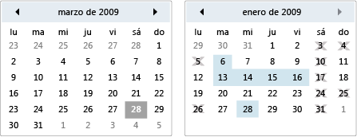

# Calendario
Un calendario permite al usuario seleccionar una fecha mediante un calendario visual.  
  
 Un <xref:System.Windows.Controls.Calendar> control puede usarse por sí solo o como parte de la lista desplegable un <xref:System.Windows.Controls.DatePicker> control. Para obtener más información, consulta <xref:System.Windows.Controls.DatePicker>.  
  
 La siguiente ilustración muestra dos <xref:System.Windows.Controls.Calendar> controla, uno con selecciones y fechas no disponibles y otro sin.  
  
   
Controles de calendario  
  
 En la tabla siguiente proporciona información acerca de las tareas que se suelen asociar el <xref:System.Windows.Controls.Calendar>.  
  
|Tarea|Implementación|  
|----------|--------------------|  
|Especifique las fechas que no se pueden seleccionar.|Utilice la propiedad <xref:System.Windows.Controls.Calendar.BlackoutDates%2A>.|  
|Tiene la <xref:System.Windows.Controls.Calendar> mostrar un mes, un año completo o una década.|Establecer el <xref:System.Windows.Controls.Calendar.DisplayMode%2A> propiedad al mes, año o década.|  
|Especifique si el usuario puede seleccionar una fecha, un intervalo de fechas o varios intervalos de fechas.|Use el <xref:System.Windows.Controls.Calendar.SelectionMode%2A>.|  
|Especifique el intervalo de fechas que el <xref:System.Windows.Controls.Calendar> muestra.|Use la <xref:System.Windows.Controls.Calendar.DisplayDateStart%2A> y <xref:System.Windows.Controls.Calendar.DisplayDateEnd%2A> propiedades.|  
|Especifique si se resalta la fecha actual.|Utilice la propiedad <xref:System.Windows.Controls.Calendar.IsTodayHighlighted%2A>. De forma predeterminada, <xref:System.Windows.Controls.Calendar.IsTodayHighlighted%2A> es `true`.|  
|Cambiar el tamaño de la <xref:System.Windows.Controls.Calendar>.|Use un <xref:System.Windows.Controls.Viewbox> o establecer el <xref:System.Windows.FrameworkElement.LayoutTransform%2A> propiedad a un <xref:System.Windows.Media.ScaleTransform>. Tenga en cuenta que si establece la <xref:System.Windows.FrameworkElement.Width%2A> y <xref:System.Windows.FrameworkElement.Height%2A> las propiedades de un <xref:System.Windows.Controls.Calendar>, el calendario real no cambia su tamaño.|  
  
 El <xref:System.Windows.Controls.Calendar> control proporciona navegación básica mediante el mouse o teclado. En la tabla siguiente se resume la navegación mediante el teclado.  
  
|Combinación de teclas|<xref:System.Windows.Controls.Calendar.DisplayMode%2A>|Acción|  
|---------------------|-----------------------------------------------------------------------------------------------------------------------------------------------------------|------------|  
|FLECHA|<xref:System.Windows.Controls.CalendarMode.Month>|Los cambios del <xref:System.Windows.Controls.Calendar.SelectedDate%2A> propiedad si el <xref:System.Windows.Controls.Calendar.SelectionMode%2A> propiedad no está establecida en <xref:System.Windows.Controls.CalendarSelectionMode.None>.|  
|FLECHA|<xref:System.Windows.Controls.CalendarMode.Year>|Cambia el mes de la <xref:System.Windows.Controls.Calendar.DisplayDate%2A> propiedad. Tenga en cuenta que el <xref:System.Windows.Controls.Calendar.SelectedDate%2A> no cambia.|  
|FLECHA|<xref:System.Windows.Controls.CalendarMode.Decade>|Cambia el año de la <xref:System.Windows.Controls.Calendar.DisplayDate%2A>. Tenga en cuenta que el <xref:System.Windows.Controls.Calendar.SelectedDate%2A> no cambia.|  
|MAYÚS + FLECHA|<xref:System.Windows.Controls.CalendarMode.Month>|Si <xref:System.Windows.Controls.Calendar.SelectionMode%2A> no está establecido en <xref:System.Windows.Controls.CalendarSelectionMode.SingleDate> o <xref:System.Windows.Controls.CalendarSelectionMode.None>, amplía el intervalo de fechas seleccionados.|  
|INICIO|<xref:System.Windows.Controls.CalendarMode.Month>|Los cambios del <xref:System.Windows.Controls.Calendar.SelectedDate%2A> al primer día del mes actual.|  
|INICIO|<xref:System.Windows.Controls.CalendarMode.Year>|Cambia el mes de la <xref:System.Windows.Controls.Calendar.DisplayDate%2A> al primer mes del año. El <xref:System.Windows.Controls.Calendar.SelectedDate%2A> no cambia.|  
|INICIO|<xref:System.Windows.Controls.CalendarMode.Decade>|Cambia el año de la <xref:System.Windows.Controls.Calendar.DisplayDate%2A> para el primer año de la década. El <xref:System.Windows.Controls.Calendar.SelectedDate%2A> no cambia.|  
|FIN|<xref:System.Windows.Controls.CalendarMode.Month>|Los cambios del <xref:System.Windows.Controls.Calendar.SelectedDate%2A> al último día del mes actual.|  
|FIN|<xref:System.Windows.Controls.CalendarMode.Year>|Cambia el mes de la <xref:System.Windows.Controls.Calendar.DisplayDate%2A> para el último mes del año. El <xref:System.Windows.Controls.Calendar.SelectedDate%2A> no cambia.|  
|FIN|<xref:System.Windows.Controls.CalendarMode.Decade>|Cambia el año de la <xref:System.Windows.Controls.Calendar.DisplayDate%2A> para el último año de la década. El <xref:System.Windows.Controls.Calendar.SelectedDate%2A> no cambia.|  
|CTRL+FLECHA ARRIBA|Cualquiera|Cambia al siguiente mayor <xref:System.Windows.Controls.Calendar.DisplayMode%2A>. Si <xref:System.Windows.Controls.Calendar.DisplayMode%2A> ya está <xref:System.Windows.Controls.CalendarMode.Decade>, ninguna acción.|  
|CTRL+FLECHA ABAJO|Cualquiera|Se activa en el siguiente más pequeños <xref:System.Windows.Controls.Calendar.DisplayMode%2A>. Si <xref:System.Windows.Controls.Calendar.DisplayMode%2A> ya está <xref:System.Windows.Controls.CalendarMode.Month>, ninguna acción.|  
|Barra espaciadora o ENTRAR|<xref:System.Windows.Controls.CalendarMode.Year> o <xref:System.Windows.Controls.CalendarMode.Decade>|Modificadores <xref:System.Windows.Controls.Calendar.DisplayMode%2A> a la <xref:System.Windows.Controls.CalendarMode.Month> o <xref:System.Windows.Controls.CalendarMode.Year> representado por el elemento con foco.|  
  
## Vea también
- [Controles](../../../../docs/framework/wpf/controls/index.md)
- [Aplicar estilos y plantillas](../../../../docs/framework/wpf/controls/styling-and-templating.md)
