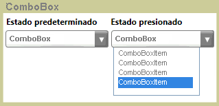

# ComboBox
El <xref:System.Windows.Controls.ComboBox> control presenta a los usuarios con una lista de opciones. La lista se muestran y oculta como el control se expande y se contrae. En su estado predeterminado, la lista está contraída, mostrar sólo una opción. El usuario hace clic en un botón para ver una lista completa de opciones.  
  
 La siguiente ilustración muestra un <xref:System.Windows.Controls.ComboBox> en diferentes Estados.  
  
   
Contraído y expandido  
  
## En esta sección  
 [Cómo: obtener un elemento ComboBoxItem](http://msdn.microsoft.com/library/8a0d2622-64b6-41fc-bf80-9669a1eacb53)  
  
## Referencia  
 <xref:System.Windows.Controls.ComboBox>
