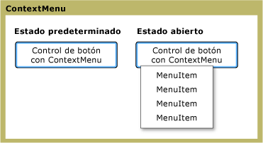

# ContextMenu
El <xref:System.Windows.Controls.ContextMenu> permite un control para mostrar un <xref:System.Windows.Controls.Menu> que es específico para el contexto del control. Normalmente, el <xref:System.Windows.Controls.ContextMenu> se expone en el [!INCLUDE[TLA#tla_ui](../../../../includes/tlasharptla-ui-md.md)] mediante el botón secundario del mouse o mediante el botón de menú del teclado.  
  
 La ilustración siguiente muestra un <xref:System.Windows.Controls.ContextMenu> en dos estados diferentes: el estado predeterminado y el estado abierto. En el estado de forma predeterminada, el control se contrae. Cuando se presiona el botón secundario del mouse sobre el elemento primario del menú, el control se expande y muestra los elementos de menú.  
  
   
ContextMenu en diferentes Estados  
  
## En esta sección  
 [Información general sobre ContextMenu](../../../../docs/framework/wpf/controls/contextmenu-overview.md)  
  
## Referencia  
 <xref:System.Windows.Controls.ContextMenu>  
  
## Secciones relacionadas
