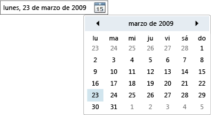

# DatePicker
El control <xref:System.Windows.Controls.DatePicker> permite al usuario seleccionar una fecha escribiéndola en un campo de texto o utilizando un control <xref:System.Windows.Controls.Calendar> desplegable.  
  
 En la siguiente ilustración se muestra un control <xref:System.Windows.Controls.DatePicker>.  
  
   
Control DatePicker  
  
 Muchas de las propiedades de <xref:System.Windows.Controls.DatePicker> sirven para administrar su objeto <xref:System.Windows.Controls.Calendar> integrado y funcionan del mismo modo que la propiedad equivalente de <xref:System.Windows.Controls.Calendar>.  En concreto, las propiedades <xref:System.Windows.Controls.DatePicker.IsTodayHighlighted%2A?displayProperty=fullName>, <xref:System.Windows.Controls.DatePicker.FirstDayOfWeek%2A?displayProperty=fullName>, <xref:System.Windows.Controls.DatePicker.BlackoutDates%2A?displayProperty=fullName>, <xref:System.Windows.Controls.DatePicker.DisplayDateStart%2A?displayProperty=fullName>, <xref:System.Windows.Controls.DatePicker.DisplayDateEnd%2A?displayProperty=fullName>, <xref:System.Windows.Controls.DatePicker.DisplayDate%2A?displayProperty=fullName> y <xref:System.Windows.Controls.DatePicker.SelectedDate%2A?displayProperty=fullName> funcionan del mismo modo que las propiedades de <xref:System.Windows.Controls.Calendar> equivalentes.  Para obtener más información, vea <xref:System.Windows.Controls.Calendar>.  
  
 Los usuarios pueden escribir directamente una fecha en un campo de texto, que establece la propiedad <xref:System.Windows.Controls.DatePicker.Text%2A>.  Si <xref:System.Windows.Controls.DatePicker> no puede convertir la cadena escrita en una fecha válida, se generará el evento <xref:System.Windows.Controls.DatePicker.DateValidationError>.  De forma predeterminada, esto provoca una excepción, pero un controlador de eventos de <xref:System.Windows.Controls.DatePicker.DateValidationError> puede establecer la propiedad <xref:System.Windows.Controls.DatePickerDateValidationErrorEventArgs.ThrowException%2A> en `false` y evitar que se genere la excepción.  
  
## Vea también  
 [Controles](../../../../docs/framework/wpf/controls/index.md)   
 [Aplicar estilos y plantillas](../../../../docs/framework/wpf/controls/styling-and-templating.md)