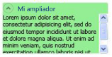

# Información general sobre el control ExpanderExpander Overview
Un <xref:System.Windows.Controls.Expander> control proporciona una manera de proporcionar contenido en un área ampliable que se parece a una ventana e incluye un encabezado.An <xref:System.Windows.Controls.Expander> control provides a way to provide content in an expandable area that resembles a window and includes a header.  
  
  
   
## Crear un control Expander simpleCreating a Simple Expander  
 En el ejemplo siguiente se muestra cómo crear un sencillo <xref:System.Windows.Controls.Expander> control.The following example shows how to create a simple <xref:System.Windows.Controls.Expander> control. Este ejemplo se crea un <xref:System.Windows.Controls.Expander> que parece que la ilustración anterior.This example creates an <xref:System.Windows.Controls.Expander> that looks like the previous illustration.  
  
 [!code-xaml[ExpanderExample#2](../../../../samples/snippets/csharp/VS_Snippets_Wpf/ExpanderExample/CSharp/Page1.xaml#2)]  
  
 El <xref:System.Windows.Controls.ContentControl.Content%2A> y <xref:System.Windows.Controls.HeaderedContentControl.Header%2A> de un <xref:System.Windows.Controls.Expander> también puede incluir contenido complejo, como <xref:System.Windows.Controls.RadioButton> y <xref:System.Windows.Controls.Image> objetos.The <xref:System.Windows.Controls.ContentControl.Content%2A> and <xref:System.Windows.Controls.HeaderedContentControl.Header%2A> of an <xref:System.Windows.Controls.Expander> can also contain complex content, such as <xref:System.Windows.Controls.RadioButton> and <xref:System.Windows.Controls.Image> objects.  
  
   
## Establecer la dirección del área de contenido de expansiónSetting the Direction of the Expanding Content Area  
 Puede establecer el área de contenido de un <xref:System.Windows.Controls.Expander> control para expandir en una de las cuatro direcciones (<xref:System.Windows.Controls.ExpandDirection.Down>, <xref:System.Windows.Controls.ExpandDirection.Up>, <xref:System.Windows.Controls.ExpandDirection.Left>, o <xref:System.Windows.Controls.ExpandDirection.Right>) mediante el uso de la <xref:System.Windows.Controls.ExpandDirection> propiedad.You can set the content area of an <xref:System.Windows.Controls.Expander> control to expand in one of four directions (<xref:System.Windows.Controls.ExpandDirection.Down>, <xref:System.Windows.Controls.ExpandDirection.Up>, <xref:System.Windows.Controls.ExpandDirection.Left>, or <xref:System.Windows.Controls.ExpandDirection.Right>) by using the <xref:System.Windows.Controls.ExpandDirection> property. Cuando se contrae el área de contenido, solo el <xref:System.Windows.Controls.Expander> <xref:System.Windows.Controls.HeaderedContentControl.Header%2A> y su botón de alternancia aparece.When the content area is collapsed, only the <xref:System.Windows.Controls.Expander><xref:System.Windows.Controls.HeaderedContentControl.Header%2A> and its toggle button appear. Un <xref:System.Windows.Controls.Button> control que muestra una flecha se utiliza como un botón de alternancia para expandir o contraer el área de contenido.A <xref:System.Windows.Controls.Button> control that displays a directional arrow is used as a toggle button to expand or collapse the content area. Expandido, el <xref:System.Windows.Controls.Expander> intenta mostrar todo su contenido en un área de la ventana.When expanded, the <xref:System.Windows.Controls.Expander> tries to display all of its content in a window-like area.  
  
   
## Controlar el tamaño de un control Expander en un panelControlling the Size of an Expander in a Panel  
 Si un <xref:System.Windows.Controls.Expander> control está dentro de un control de diseño que hereda de <xref:System.Windows.Controls.Panel>, como <xref:System.Windows.Controls.StackPanel>, no se especifica un <xref:System.Windows.FrameworkElement.Height%2A> en el <xref:System.Windows.Controls.Expander> cuando el <xref:System.Windows.Controls.Expander.ExpandDirection%2A> propiedad está establecida en <xref:System.Windows.Controls.ExpandDirection.Down> o <xref:System.Windows.Controls.ExpandDirection.Up>.If an <xref:System.Windows.Controls.Expander> control is inside a layout control that inherits from <xref:System.Windows.Controls.Panel>, such as <xref:System.Windows.Controls.StackPanel>, do not specify a <xref:System.Windows.FrameworkElement.Height%2A> on the <xref:System.Windows.Controls.Expander> when the <xref:System.Windows.Controls.Expander.ExpandDirection%2A> property is set to <xref:System.Windows.Controls.ExpandDirection.Down> or <xref:System.Windows.Controls.ExpandDirection.Up>. De igual forma, no especifique un <xref:System.Windows.FrameworkElement.Width%2A> en el <xref:System.Windows.Controls.Expander> cuando el <xref:System.Windows.Controls.Expander.ExpandDirection%2A> propiedad está establecida en <xref:System.Windows.Controls.ExpandDirection.Left> o <xref:System.Windows.Controls.ExpandDirection.Right>.Similarly, do not specify a <xref:System.Windows.FrameworkElement.Width%2A> on the <xref:System.Windows.Controls.Expander> when the <xref:System.Windows.Controls.Expander.ExpandDirection%2A> property is set to <xref:System.Windows.Controls.ExpandDirection.Left> or <xref:System.Windows.Controls.ExpandDirection.Right>.  
  
 Cuando se define una dimensión de tamaño en un <xref:System.Windows.Controls.Expander> control en la dirección que se muestra el contenido expandido, el <xref:System.Windows.Controls.Expander> toma el control del área que se utiliza en el contenido y muestra un borde alrededor de ella.When you set a size dimension on an <xref:System.Windows.Controls.Expander> control in the direction that the expanded content is displayed, the <xref:System.Windows.Controls.Expander> takes control of the area that is used by the content and displays a border around it. El borde se muestra aunque el contenido se contraiga.The border shows even when the content is collapsed. Para establecer el tamaño del área de contenido expandido, establezca las dimensiones de tamaño del contenido de la <xref:System.Windows.Controls.Expander>, o si desea desplazar la capacidad, en el <xref:System.Windows.Controls.ScrollViewer> que incluye el contenido.To set the size of the expanded content area, set size dimensions on the content of the <xref:System.Windows.Controls.Expander>, or if you want scrolling capability, on the <xref:System.Windows.Controls.ScrollViewer> that encloses the content.  
  
 Cuando un <xref:System.Windows.Controls.Expander> control es el último elemento en una <xref:System.Windows.Controls.DockPanel>, [!INCLUDE[TLA#tla_winclient](../../../../includes/tlasharptla-winclient-md.md)] establece automáticamente el <xref:System.Windows.Controls.Expander> dimensiones en el área restante de la <xref:System.Windows.Controls.DockPanel>.When an <xref:System.Windows.Controls.Expander> control is the last element in a <xref:System.Windows.Controls.DockPanel>, [!INCLUDE[TLA#tla_winclient](../../../../includes/tlasharptla-winclient-md.md)] automatically sets the <xref:System.Windows.Controls.Expander> dimensions to equal the remaining area of the <xref:System.Windows.Controls.DockPanel>. Para evitar que este comportamiento predeterminado, establezca el <xref:System.Windows.Controls.DockPanel.LastChildFill%2A> propiedad en el <xref:System.Windows.Controls.DockPanel> el objeto a `false`, o asegúrese de que el <xref:System.Windows.Controls.Expander> no es el último elemento en un <xref:System.Windows.Controls.DockPanel>.To prevent this default behavior, set the <xref:System.Windows.Controls.DockPanel.LastChildFill%2A> property on the <xref:System.Windows.Controls.DockPanel> object to `false`, or make sure that the <xref:System.Windows.Controls.Expander> is not the last element in a <xref:System.Windows.Controls.DockPanel>.  
  
   
## Crear contenido desplazableCreating Scrollable Content  
 Si el contenido es demasiado grande para el tamaño del área de contenido, puede ajustar el contenido de un <xref:System.Windows.Controls.Expander> en un <xref:System.Windows.Controls.ScrollViewer> con el fin de proporcionar contenido desplazable.If the content is too large for the size of the content area, you can wrap the content of an <xref:System.Windows.Controls.Expander> in a <xref:System.Windows.Controls.ScrollViewer> in order to provide scrollable content. El <xref:System.Windows.Controls.Expander> control no proporciona automáticamente la capacidad de desplazamiento.The <xref:System.Windows.Controls.Expander> control does not automatically provide scrolling capability. La siguiente ilustración muestra un <xref:System.Windows.Controls.Expander> control que contiene un <xref:System.Windows.Controls.ScrollViewer> control.The following illustration shows an <xref:System.Windows.Controls.Expander> control that contains a <xref:System.Windows.Controls.ScrollViewer> control.  
  
 **Control Expander en un control ScrollViewer****Expander in a ScrollViewer**  
  
   
  
 Cuando coloca un <xref:System.Windows.Controls.Expander> controlar en un <xref:System.Windows.Controls.ScrollViewer>, establezca el <xref:System.Windows.Controls.ScrollViewer> dimensión propiedad que corresponde a la dirección en la que el <xref:System.Windows.Controls.Expander> contenido se abre en el tamaño de la <xref:System.Windows.Controls.Expander> área de contenido.When you place an <xref:System.Windows.Controls.Expander> control in a <xref:System.Windows.Controls.ScrollViewer>, set the <xref:System.Windows.Controls.ScrollViewer> dimension property that corresponds to the direction in which the <xref:System.Windows.Controls.Expander> content opens to the size of the <xref:System.Windows.Controls.Expander> content area. Por ejemplo, si establece la <xref:System.Windows.Controls.Expander.ExpandDirection%2A> propiedad en el <xref:System.Windows.Controls.Expander> a <xref:System.Windows.Controls.ExpandDirection.Down> (se abre el área de contenido hacia abajo), establezca el <xref:System.Windows.FrameworkElement.Height%2A> propiedad en el <xref:System.Windows.Controls.ScrollViewer> control a la altura requerida para el área de contenido.For example, if you set the <xref:System.Windows.Controls.Expander.ExpandDirection%2A> property on the <xref:System.Windows.Controls.Expander> to <xref:System.Windows.Controls.ExpandDirection.Down> (the content area opens down), set the <xref:System.Windows.FrameworkElement.Height%2A> property on the <xref:System.Windows.Controls.ScrollViewer> control to the required height for the content area. Si se establece en su lugar, la dimensión de altura en el contenido en Sí, <xref:System.Windows.Controls.ScrollViewer> no reconoce este valor y por lo tanto, no proporciona contenido desplazable.If you instead set the height dimension on the content itself, <xref:System.Windows.Controls.ScrollViewer> does not recognize this setting and therefore, does not provide scrollable content.  
  
 En el ejemplo siguiente se muestra cómo crear un <xref:System.Windows.Controls.Expander> control de contenido complejo que contiene un <xref:System.Windows.Controls.ScrollViewer> control.The following example shows how to create an <xref:System.Windows.Controls.Expander> control that has complex content and that contains a <xref:System.Windows.Controls.ScrollViewer> control. Este ejemplo se crea un <xref:System.Windows.Controls.Expander> que es similar de la ilustración al principio de esta sección.This example creates an <xref:System.Windows.Controls.Expander> that is like the illustration at the beginning of this section.  
  
 [!code-csharp[ExpanderRichContent#1](../../../../samples/snippets/csharp/VS_Snippets_Wpf/ExpanderRichContent/CSharp/Window1.xaml.cs#1)]
 [!code-vb[ExpanderRichContent#1](../../../../samples/snippets/visualbasic/VS_Snippets_Wpf/ExpanderRichContent/VisualBasic/Window1.xaml.vb#1)]
 [!code-xaml[ExpanderRichContent#1](../../../../samples/snippets/csharp/VS_Snippets_Wpf/ExpanderRichContent/CSharp/Window1.xaml#1)]  
  
   
## Usar propiedades de alineaciónUsing the Alignment Properties  
 Puede alinear el contenido estableciendo la <xref:System.Windows.Controls.Control.HorizontalContentAlignment%2A> y <xref:System.Windows.Controls.Control.VerticalContentAlignment%2A> propiedades en el <xref:System.Windows.Controls.Expander> control.You can align content by setting the <xref:System.Windows.Controls.Control.HorizontalContentAlignment%2A> and <xref:System.Windows.Controls.Control.VerticalContentAlignment%2A> properties on the <xref:System.Windows.Controls.Expander> control. Al establecer estas propiedades, la alineación se aplica al encabezado y también al contenido ampliado.When you set these properties, the alignment applies to the header and also to the expanded content.  
  
## Vea tambiénSee Also  
 <xref:System.Windows.Controls.Expander>  
 <xref:System.Windows.Controls.ExpandDirection>  
 [Temas de procedimientosHow-to Topics](../../../../docs/framework/wpf/controls/expander-how-to-topics.md)
