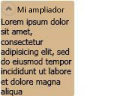

# Expander
Un <xref:System.Windows.Controls.Expander> permite a un usuario ver un encabezado y expanda ese encabezado para ver más detalles o contraer una sección hasta un encabezado.  
  
 La ilustración siguiente proporciona un ejemplo de este control en su posición expandida.  
  
   
Expander (control)  
  
## En esta sección  
 [Información general sobre el control Expander](../../../../docs/framework/wpf/controls/expander-overview.md)  
 [Temas "Cómo..."](../../../../docs/framework/wpf/controls/expander-how-to-topics.md)  
  
## Referencia  
 <xref:System.Windows.Controls.Expander>  
  
## Secciones relacionadas
