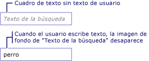

# Cómo: Agregar una marca de agua a un TextBoxHow to: Add a Watermark to a TextBox
En el ejemplo siguiente se muestra cómo facilitar el uso de un <xref:System.Windows.Controls.TextBox> , mostrando una imagen de fondo explicativa dentro de la <xref:System.Windows.Controls.TextBox> hasta que el usuario escribe texto, momento en que se quita la imagen.The following example shows how to aid usability of a <xref:System.Windows.Controls.TextBox> by displaying an explanatory background image inside of the <xref:System.Windows.Controls.TextBox> until the user inputs text, at which point the image is removed. Además, la imagen de fondo se restaura de nuevo si el usuario quita su entrada.In addition, the background image is restored again if the user removes their input. Vea la ilustración siguiente.See illustration below.  
  
   
  
> [!NOTE]
>  El motivo de una imagen de fondo se utiliza en este ejemplo en su lugar, a continuación, simplemente manipular el <xref:System.Windows.Controls.TextBox.Text%2A> propiedad de <xref:System.Windows.Controls.TextBox>, es que una imagen de fondo no interfiera con el enlace de datos.The reason a background image is used in this example rather then simply manipulating the <xref:System.Windows.Controls.TextBox.Text%2A> property of <xref:System.Windows.Controls.TextBox>, is that a background image will not interfere with data binding.  
  
## EjemploExample  
 [!code-xaml[TextBoxMiscSnippets_snip#TextBoxBackgroundExampleWholePage](../../../../samples/snippets/csharp/VS_Snippets_Wpf/TextBoxMiscSnippets_snip/csharp/textbox_with_background_image.xaml#textboxbackgroundexamplewholepage)]  
  
 [!code-csharp[TextBoxMiscSnippets_snip#TextBoxBackgroundCodeExampleWholePage](../../../../samples/snippets/csharp/VS_Snippets_Wpf/TextBoxMiscSnippets_snip/csharp/textbox_with_background_image.xaml.cs#textboxbackgroundcodeexamplewholepage)]
 [!code-vb[TextBoxMiscSnippets_snip#TextBoxBackgroundCodeExampleWholePage](../../../../samples/snippets/visualbasic/VS_Snippets_Wpf/TextBoxMiscSnippets_snip/visualbasic/textbox_with_background_image.xaml.vb#textboxbackgroundcodeexamplewholepage)]  
  
## Vea tambiénSee Also  
 [Información general sobre TextBoxTextBox Overview](../../../../docs/framework/wpf/controls/textbox-overview.md)  
 [RichTextBox Overview](../../../../docs/framework/wpf/controls/richtextbox-overview.md) (Introducción a RichTextBox)[RichTextBox Overview](../../../../docs/framework/wpf/controls/richtextbox-overview.md)
