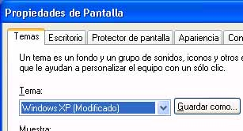

# EtiquetaLabel
<xref:System.Windows.Controls.Label> controles suelen proporcionan información en el [!INCLUDE[TLA#tla_ui](../../../../includes/tlasharptla-ui-md.md)].<xref:System.Windows.Controls.Label> controls usually provide information in the [!INCLUDE[TLA#tla_ui](../../../../includes/tlasharptla-ui-md.md)].  Históricamente, un <xref:System.Windows.Controls.Label> sólo contenía texto, sin embargo, dado el <xref:System.Windows.Controls.Label> que se distribuye con [!INCLUDE[TLA#tla_winclient](../../../../includes/tlasharptla-winclient-md.md)] es un <xref:System.Windows.Controls.ContentControl>, puede contener cualquier texto o un <xref:System.Windows.UIElement>.Historically, a <xref:System.Windows.Controls.Label> has contained only text, but because the <xref:System.Windows.Controls.Label> that ships with [!INCLUDE[TLA#tla_winclient](../../../../includes/tlasharptla-winclient-md.md)] is a <xref:System.Windows.Controls.ContentControl>, it can contain either text or a <xref:System.Windows.UIElement>.  
  
 Un <xref:System.Windows.Controls.Label> proporciona compatibilidad funcional y visual para las claves de acceso.A <xref:System.Windows.Controls.Label> provides both functional and visual support for access keys. Con frecuencia se utiliza para habilitar el acceso rápido mediante teclado a los controles como un <xref:System.Windows.Controls.TextBox>.It is frequently used to enable quick keyboard access to controls such as a <xref:System.Windows.Controls.TextBox>. Para asignar un <xref:System.Windows.Controls.Label> a una <xref:System.Windows.Controls.Control>, establezca el <xref:System.Windows.Controls.Label.Target%2A?displayProperty=nameWithType> propiedad al control que debe obtener el foco cuando el usuario presiona la tecla de acceso.To assign a <xref:System.Windows.Controls.Label> to a <xref:System.Windows.Controls.Control>, set the <xref:System.Windows.Controls.Label.Target%2A?displayProperty=nameWithType> property to the control that should get focus when the user presses the access key.  
  
 La siguiente imagen muestra un <xref:System.Windows.Controls.Label> "Temas" que tenga como destino un <xref:System.Windows.Controls.ComboBox>.The following image shows a <xref:System.Windows.Controls.Label> "Themes" that targets a <xref:System.Windows.Controls.ComboBox>.  Cuando el usuario presiona, el <xref:System.Windows.Controls.ComboBox> recibe el foco.When the user presses , the <xref:System.Windows.Controls.ComboBox> receives focus.  Para obtener más información, consulte [Cómo: establecer la propiedad de destino de una etiqueta](http://msdn.microsoft.com/library/b24c6977-ebcb-4855-a9bb-3fd4435af8f8).For more information, see [How to: Set the Target Property of a Label](http://msdn.microsoft.com/library/b24c6977-ebcb-4855-a9bb-3fd4435af8f8).  
  
   
  
## En esta secciónIn This Section  
 [Cómo: Establecer la propiedad Target de un control LabelHow to: Set the Target Property of a Label](http://msdn.microsoft.com/library/b24c6977-ebcb-4855-a9bb-3fd4435af8f8)  
  
## ReferenciaReference  
 <xref:System.Windows.Controls.Label>
