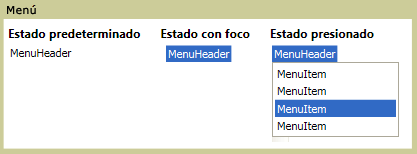

# Menú
Un <xref:System.Windows.Controls.Menu> es un control que permite organizar jerárquicamente los elementos asociados a comandos o controladores de eventos. Cada <xref:System.Windows.Controls.Menu> puede contener varios <xref:System.Windows.Controls.MenuItem> controles. Cada <xref:System.Windows.Controls.MenuItem> puede invocar un comando o invocar un `Click` controlador de eventos. Un <xref:System.Windows.Controls.MenuItem> también puede tener varios <xref:System.Windows.Controls.MenuItem> elementos como elementos secundarios, que constituyen un submenú.  
  
 La ilustración siguiente muestra los tres estados diferentes de un control de menú. El estado predeterminado es cuando no hay ningún dispositivo como un puntero del mouse se sitúe sobre el <xref:System.Windows.Controls.Menu>. El estado del foco se produce cuando el puntero del mouse se mantiene sobre el <xref:System.Windows.Controls.Menu> y el estado presionado se produce cuando se hace clic en un botón del mouse sobre el <xref:System.Windows.Controls.Menu>.  
  
   
Menús en diferentes Estados  
  
## En esta sección  
 [Información general sobre menús](menu-overview.md)  
  
## Referencia  
 <xref:System.Windows.Controls.Menu>  
  <xref:System.Windows.Controls.MenuItem>  
  <xref:System.Windows.Controls.Primitives.MenuBase>  
  <xref:System.Windows.Controls.ContextMenu>  
  
## Secciones relacionadas
