# Posición de un control Popup
Un <xref:System.Windows.Controls.Primitives.Popup> control muestra el contenido en una ventana independiente que flota sobre una aplicación. Puede especificar la posición de un <xref:System.Windows.Controls.Primitives.Popup> relativa a un control, el mouse o la pantalla mediante el uso de la <xref:System.Windows.Controls.Primitives.Popup.PlacementTarget%2A>, <xref:System.Windows.Controls.Primitives.Popup.Placement%2A>, <xref:System.Windows.Controls.Primitives.Popup.PlacementRectangle%2A>, <xref:System.Windows.Controls.Primitives.Popup.HorizontalOffset%2A>, y <xref:System.Windows.Controls.Primitives.Popup.VerticalOffset%2A> propiedades.  Estas propiedades trabajan juntos para proporcionar flexibilidad para especificar la posición de la <xref:System.Windows.Controls.Primitives.Popup>.  
  
> [!NOTE]
>  El <xref:System.Windows.Controls.ToolTip> y <xref:System.Windows.Controls.ContextMenu> clases también definen estas cinco propiedades y se comportan de forma similar.  
  

  
   
## Posicionamiento del elemento Popup  
 La colocación de un <xref:System.Windows.Controls.Primitives.Popup> puede ser relativa a un <xref:System.Windows.UIElement> o a toda la pantalla.  El ejemplo siguiente crea cuatro <xref:System.Windows.Controls.Primitives.Popup> controles que son relativas a un <xref:System.Windows.UIElement>: en este caso, una imagen. Todos los <xref:System.Windows.Controls.Primitives.Popup> controles tienen la <xref:System.Windows.Controls.Primitives.Popup.PlacementTarget%2A> propiedad establecida en `image1`, pero cada <xref:System.Windows.Controls.Primitives.Popup> tiene un valor diferente para la propiedad de colocación.  
  
 [!code-xaml[PopupPositionSnippet#3](../../../../samples/snippets/csharp/VS_Snippets_Wpf/PopupPositionSnippet/CS/Window1.xaml#3)]  
  
 La siguiente ilustración muestra la imagen y el <xref:System.Windows.Controls.Primitives.Popup> controles  
  
   
Imagen con cuatro controles Popup  
  
 Este sencillo ejemplo muestra cómo establecer el <xref:System.Windows.Controls.Primitives.Popup.PlacementTarget%2A> y <xref:System.Windows.Controls.Primitives.Popup.Placement%2A> propiedades, pero mediante el <xref:System.Windows.Controls.Primitives.Popup.PlacementRectangle%2A>, <xref:System.Windows.Controls.Primitives.Popup.HorizontalOffset%2A>, y <xref:System.Windows.Controls.Primitives.Popup.VerticalOffset%2A> propiedades, debe tener un mayor control sobre la ubicación donde el <xref:System.Windows.Controls.Primitives.Popup> se coloca.  
  
   
## Definiciones de términos: la anatomía de un elemento Popup  
 Los siguientes términos son útiles para comprender cómo la <xref:System.Windows.Controls.Primitives.Popup.PlacementTarget%2A>, <xref:System.Windows.Controls.Primitives.Popup.Placement%2A>, <xref:System.Windows.Controls.Primitives.Popup.PlacementRectangle%2A>, <xref:System.Windows.Controls.Primitives.Popup.HorizontalOffset%2A>, y <xref:System.Windows.Controls.Primitives.Popup.VerticalOffset%2A> propiedades se relacionan entre sí y el <xref:System.Windows.Controls.Primitives.Popup>:  
  
-   Objeto de destino  
  
-   Área de destino  
  
-   Origen de destino  
  
-   Punto de alineación del elemento Popup  
  
 Estos términos proporcionan una manera cómoda para hacer referencia a distintos aspectos de la <xref:System.Windows.Controls.Primitives.Popup> y el control que está asociado.  
  
### Objeto de destino  
 El *objeto de destino* es el elemento que el <xref:System.Windows.Controls.Primitives.Popup> está asociado. Si el <xref:System.Windows.Controls.Primitives.Popup.PlacementTarget%2A> propiedad está establecida, especifica el objeto de destino.  Si <xref:System.Windows.Controls.Primitives.Popup.PlacementTarget%2A> no está establecida y el <xref:System.Windows.Controls.Primitives.Popup> tiene un elemento primario, el elemento primario es el objeto de destino.  Si no hay ningún <xref:System.Windows.Controls.Primitives.Popup.PlacementTarget%2A> valor y ningún elemento primario, no hay ningún objeto de destino y el <xref:System.Windows.Controls.Primitives.Popup> se coloca respecto a la pantalla.  
  
 En el ejemplo siguiente se crea un <xref:System.Windows.Controls.Primitives.Popup> que es el elemento secundario de un <xref:System.Windows.Controls.Canvas>.  El ejemplo no se establece la <xref:System.Windows.Controls.Primitives.Popup.PlacementTarget%2A> propiedad en el <xref:System.Windows.Controls.Primitives.Popup>. El valor predeterminado de <xref:System.Windows.Controls.Primitives.Popup.Placement%2A> es <xref:System.Windows.Controls.Primitives.PlacementMode.Bottom?displayProperty=nameWithType>, por lo que <xref:System.Windows.Controls.Primitives.Popup> aparece debajo de la <xref:System.Windows.Controls.Canvas>.  
  
 [!code-xaml[PopupPositionSnippet#1](../../../../samples/snippets/csharp/VS_Snippets_Wpf/PopupPositionSnippet/CS/Window1.xaml#1)]  
  
 La siguiente ilustración muestra que el <xref:System.Windows.Controls.Primitives.Popup> se coloca respecto a la <xref:System.Windows.Controls.Canvas>.  
  
   
Control Popup sin PlacementTarget  
  
 En el ejemplo siguiente se crea un <xref:System.Windows.Controls.Primitives.Popup> que es el elemento secundario de un <xref:System.Windows.Controls.Canvas>, pero esta vez el <xref:System.Windows.Controls.Primitives.Popup.PlacementTarget%2A> está establecido en `ellipse1`, por lo que el elemento emergente aparece debajo de la <xref:System.Windows.Shapes.Ellipse>.  
  
 [!code-xaml[PopupPositionSnippet#2](../../../../samples/snippets/csharp/VS_Snippets_Wpf/PopupPositionSnippet/CS/Window1.xaml#2)]  
  
 La siguiente ilustración muestra que el <xref:System.Windows.Controls.Primitives.Popup> se coloca respecto a la <xref:System.Windows.Shapes.Ellipse>.  
  
   
Control Popup con PlacementTarget  
  
> [!NOTE]
>  Para <xref:System.Windows.Controls.ToolTip>, el valor predeterminado de <xref:System.Windows.Controls.Primitives.Popup.Placement%2A> es <xref:System.Windows.Controls.Primitives.PlacementMode.Mouse>.  Para <xref:System.Windows.Controls.ContextMenu>, el valor predeterminado de <xref:System.Windows.Controls.Primitives.Popup.Placement%2A> es <xref:System.Windows.Controls.Primitives.PlacementMode.MousePoint>. Estos valores se explican más adelante, en "Trabajo en conjunto de las propiedades".  
  
### Área de destino  
 El *área de destino* es el área en la pantalla que el <xref:System.Windows.Controls.Primitives.Popup> es relativa. En los ejemplos anteriores, el <xref:System.Windows.Controls.Primitives.Popup> se alinea con los límites del objeto de destino, pero en algunos casos, el <xref:System.Windows.Controls.Primitives.Popup> se alinea con otros límites, incluso si la <xref:System.Windows.Controls.Primitives.Popup> tiene un objeto de destino.  Si el <xref:System.Windows.Controls.Primitives.Popup.PlacementRectangle%2A> propiedad está establecida, el área de destino es diferente de los límites del objeto de destino.  
  
 En el ejemplo siguiente se crean dos <xref:System.Windows.Controls.Canvas> objetos, cada uno que contenga un <xref:System.Windows.Shapes.Rectangle> y un <xref:System.Windows.Controls.Primitives.Popup>.  En ambos casos, el destino de objetos para el <xref:System.Windows.Controls.Primitives.Popup> es el <xref:System.Windows.Controls.Canvas>. El <xref:System.Windows.Controls.Primitives.Popup> en la primera <xref:System.Windows.Controls.Canvas> tiene la <xref:System.Windows.Controls.Primitives.Popup.PlacementRectangle%2A> establecido, con su <xref:System.Windows.Rect.X%2A>, <xref:System.Windows.Rect.Y%2A>, <xref:System.Windows.Rect.Width%2A>, y <xref:System.Windows.Rect.Height%2A> propiedades establecidas en 50, 50, 50 y 100, respectivamente. El <xref:System.Windows.Controls.Primitives.Popup> en el segundo <xref:System.Windows.Controls.Canvas> no tiene el <xref:System.Windows.Controls.Primitives.Popup.PlacementRectangle%2A> establecido.  Como resultado, la primera <xref:System.Windows.Controls.Primitives.Popup> se encuentra debajo de la <xref:System.Windows.Controls.Primitives.Popup.PlacementRectangle%2A> y el segundo <xref:System.Windows.Controls.Primitives.Popup> se coloca bajo el <xref:System.Windows.Controls.Canvas>. Cada <xref:System.Windows.Controls.Canvas> también contiene un <xref:System.Windows.Shapes.Rectangle> que tiene los mismos límites como el <xref:System.Windows.Controls.Primitives.Popup.PlacementRectangle%2A> para la primera <xref:System.Windows.Controls.Primitives.Popup>.  Tenga en cuenta que el <xref:System.Windows.Controls.Primitives.Popup.PlacementRectangle%2A> no crea un elemento visible en la aplicación; en el ejemplo se crea un <xref:System.Windows.Shapes.Rectangle> para representar el <xref:System.Windows.Controls.Primitives.Popup.PlacementRectangle%2A>.  
  
 [!code-xaml[PopupPositionSnippet#4](../../../../samples/snippets/csharp/VS_Snippets_Wpf/PopupPositionSnippet/CS/Window1.xaml#4)]  
  
 En la ilustración siguiente se muestra el resultado del ejemplo anterior.  
  
   
Elemento emergente con y sin PlacementRectangle  
  
### Origen de destino y punto de alineación del elemento Popup  
 El *origen de destino* y el *punto de alineación del elemento Popup* son puntos de referencia en el área de destino y el elemento emergente, respectivamente, que se usan para posicionamiento. Puede usar el <xref:System.Windows.Controls.Primitives.Popup.HorizontalOffset%2A> y <xref:System.Windows.Controls.Primitives.Popup.VerticalOffset%2A> propiedades que se va a desplazar la ventana emergente del área de destino.  El <xref:System.Windows.Controls.Primitives.Popup.HorizontalOffset%2A> y <xref:System.Windows.Controls.Primitives.Popup.VerticalOffset%2A> están en relación con el origen de destino y el punto de alineación emergente. El valor de la <xref:System.Windows.Controls.Primitives.Popup.Placement%2A> propiedad determina dónde se encuentran el punto de alineación de origen y el elemento emergente de destino.  
  
 En el ejemplo siguiente se crea un <xref:System.Windows.Controls.Primitives.Popup> y establece el <xref:System.Windows.Controls.Primitives.Popup.HorizontalOffset%2A> y <xref:System.Windows.Controls.Primitives.Popup.VerticalOffset%2A> propiedades a 20.  El <xref:System.Windows.Controls.Primitives.Popup.Placement%2A> propiedad está establecida en <xref:System.Windows.Controls.Primitives.PlacementMode.Bottom> (valor predeterminado), por lo tanto, el origen de destino es la esquina inferior izquierda del área de destino y el punto de alineación emergente es la esquina superior izquierda de la <xref:System.Windows.Controls.Primitives.Popup>.  
  
 [!code-xaml[PopupPositionSnippet#5](../../../../samples/snippets/csharp/VS_Snippets_Wpf/PopupPositionSnippet/CS/Window1.xaml#5)]  
  
 En la ilustración siguiente se muestra el resultado del ejemplo anterior.  
  
 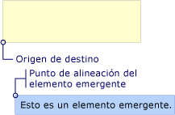  
Control Popup con HorizontalOffset y VerticalOffset  
  
   
## Trabajo en conjunto de las propiedades  
 Los valores de <xref:System.Windows.Controls.Primitives.Popup.PlacementTarget%2A>, <xref:System.Windows.Controls.Primitives.Popup.PlacementRectangle%2A>, y <xref:System.Windows.Controls.Primitives.Popup.Placement%2A> deben tenerse en cuenta conjuntamente para averiguar el área de destino correcto, el origen de destino y el punto de alineación emergente.  Por ejemplo, si el valor de <xref:System.Windows.Controls.Primitives.Popup.Placement%2A> es <xref:System.Windows.Controls.Primitives.PlacementMode.Mouse>, no hay ningún objeto de destino, el <xref:System.Windows.Controls.Primitives.Popup.PlacementRectangle%2A> se omite, y el área de destino es los límites del puntero del mouse. Por otro lado, si <xref:System.Windows.Controls.Primitives.Popup.Placement%2A> es <xref:System.Windows.Controls.Primitives.PlacementMode.Bottom>, <xref:System.Windows.Controls.Primitives.Popup.PlacementTarget%2A> o primario determina el objeto de destino y <xref:System.Windows.Controls.Primitives.Popup.PlacementRectangle%2A> determina el área de destino.  
  
 En la tabla siguiente se describe el objeto de destino, el área de destino, el origen de destino y el punto de alineación emergente e indica si <xref:System.Windows.Controls.Primitives.Popup.PlacementTarget%2A> y <xref:System.Windows.Controls.Primitives.Popup.PlacementRectangle%2A> se usan para cada <xref:System.Windows.Controls.Primitives.PlacementMode> valor de enumeración.  
  
|PlacementMode|Objeto de destino|Área de destino|Origen de destino|Punto de alineación del elemento Popup|  
|-------------------|-------------------|-----------------|-------------------|---------------------------|  
|<xref:System.Windows.Controls.Primitives.PlacementMode.Absolute>|No es aplicable. <xref:System.Windows.Controls.Primitives.Popup.PlacementTarget%2A> se omite.|La pantalla, o <xref:System.Windows.Controls.Primitives.Popup.PlacementRectangle%2A> si se establece.  El <xref:System.Windows.Controls.Primitives.Popup.PlacementRectangle%2A> es relativa a la pantalla.|La esquina superior izquierda del área de destino.|La esquina superior izquierda de la <xref:System.Windows.Controls.Primitives.Popup>.|  
|<xref:System.Windows.Controls.Primitives.PlacementMode.AbsolutePoint>|No es aplicable. <xref:System.Windows.Controls.Primitives.Popup.PlacementTarget%2A> se omite.|La pantalla, o <xref:System.Windows.Controls.Primitives.Popup.PlacementRectangle%2A> si se establece.  El <xref:System.Windows.Controls.Primitives.Popup.PlacementRectangle%2A> es relativa a la pantalla.|La esquina superior izquierda del área de destino.|La esquina superior izquierda de la <xref:System.Windows.Controls.Primitives.Popup>.|  
|<xref:System.Windows.Controls.Primitives.PlacementMode.Bottom>|<xref:System.Windows.Controls.Primitives.Popup.PlacementTarget%2A> o primario.|El objeto de destino, o <xref:System.Windows.Controls.Primitives.Popup.PlacementRectangle%2A> si se establece.  El <xref:System.Windows.Controls.Primitives.Popup.PlacementRectangle%2A> es relativa al objeto de destino.|La esquina inferior izquierda del área de destino.|La esquina superior izquierda de la <xref:System.Windows.Controls.Primitives.Popup>.|  
|<xref:System.Windows.Controls.Primitives.PlacementMode.Center>|<xref:System.Windows.Controls.Primitives.Popup.PlacementTarget%2A> o primario.|El objeto de destino, o <xref:System.Windows.Controls.Primitives.Popup.PlacementRectangle%2A> si se establece.  El <xref:System.Windows.Controls.Primitives.Popup.PlacementRectangle%2A> es relativa al objeto de destino.|El centro del área de destino.|El centro de la <xref:System.Windows.Controls.Primitives.Popup>.|  
|<xref:System.Windows.Controls.Primitives.PlacementMode.Custom>|<xref:System.Windows.Controls.Primitives.Popup.PlacementTarget%2A> o primario.|El objeto de destino, o <xref:System.Windows.Controls.Primitives.Popup.PlacementRectangle%2A> si se establece.  El <xref:System.Windows.Controls.Primitives.Popup.PlacementRectangle%2A> es relativa al objeto de destino.|Definido por el <xref:System.Windows.Controls.Primitives.CustomPopupPlacementCallback>.|Definido por el <xref:System.Windows.Controls.Primitives.CustomPopupPlacementCallback>.|  
|<xref:System.Windows.Controls.Primitives.PlacementMode.Left>|<xref:System.Windows.Controls.Primitives.Popup.PlacementTarget%2A> o primario.|El objeto de destino, o <xref:System.Windows.Controls.Primitives.Popup.PlacementRectangle%2A> si se establece.  El <xref:System.Windows.Controls.Primitives.Popup.PlacementRectangle%2A> es relativa al objeto de destino.|La esquina superior izquierda del área de destino.|La esquina superior derecha de la <xref:System.Windows.Controls.Primitives.Popup>.|  
|<xref:System.Windows.Controls.Primitives.PlacementMode.Mouse>|No es aplicable. <xref:System.Windows.Controls.Primitives.Popup.PlacementTarget%2A> se omite.|Los límites del puntero del mouse. <xref:System.Windows.Controls.Primitives.Popup.PlacementRectangle%2A> se omite.|La esquina inferior izquierda del área de destino.|La esquina superior izquierda de la <xref:System.Windows.Controls.Primitives.Popup>.|  
|<xref:System.Windows.Controls.Primitives.PlacementMode.MousePoint>|No es aplicable. <xref:System.Windows.Controls.Primitives.Popup.PlacementTarget%2A> se omite.|Los límites del puntero del mouse. <xref:System.Windows.Controls.Primitives.Popup.PlacementRectangle%2A> se omite.|La esquina superior izquierda del área de destino.|La esquina superior izquierda de la <xref:System.Windows.Controls.Primitives.Popup>.|  
|<xref:System.Windows.Controls.Primitives.PlacementMode.Relative>|<xref:System.Windows.Controls.Primitives.Popup.PlacementTarget%2A> o primario.|El objeto de destino, o <xref:System.Windows.Controls.Primitives.Popup.PlacementRectangle%2A> si se establece.  El <xref:System.Windows.Controls.Primitives.Popup.PlacementRectangle%2A> es relativa al objeto de destino.|La esquina superior izquierda del área de destino.|La esquina superior izquierda de la <xref:System.Windows.Controls.Primitives.Popup>.|  
|<xref:System.Windows.Controls.Primitives.PlacementMode.RelativePoint>|<xref:System.Windows.Controls.Primitives.Popup.PlacementTarget%2A> o primario.|El objeto de destino, o <xref:System.Windows.Controls.Primitives.Popup.PlacementRectangle%2A> si se establece.  El <xref:System.Windows.Controls.Primitives.Popup.PlacementRectangle%2A> es relativa al objeto de destino.|La esquina superior izquierda del área de destino.|La esquina superior izquierda de la <xref:System.Windows.Controls.Primitives.Popup>.|  
|<xref:System.Windows.Controls.Primitives.PlacementMode.Right>|<xref:System.Windows.Controls.Primitives.Popup.PlacementTarget%2A> o primario.|El objeto de destino, o <xref:System.Windows.Controls.Primitives.Popup.PlacementRectangle%2A> si se establece.  El <xref:System.Windows.Controls.Primitives.Popup.PlacementRectangle%2A> es relativa al objeto de destino.|La esquina superior derecha del área de destino.|La esquina superior izquierda de la <xref:System.Windows.Controls.Primitives.Popup>.|  
|<xref:System.Windows.Controls.Primitives.PlacementMode.Top>|<xref:System.Windows.Controls.Primitives.Popup.PlacementTarget%2A> o primario.|El objeto de destino, o <xref:System.Windows.Controls.Primitives.Popup.PlacementRectangle%2A> si se establece.  El <xref:System.Windows.Controls.Primitives.Popup.PlacementRectangle%2A> es relativa al objeto de destino.|La esquina superior izquierda del área de destino.|La esquina inferior izquierda de la <xref:System.Windows.Controls.Primitives.Popup>.|  
  
 Las siguientes ilustraciones muestran el <xref:System.Windows.Controls.Primitives.Popup>, seleccione el área de destino, el origen de destino y la alineación del elemento popup para cada <xref:System.Windows.Controls.Primitives.PlacementMode> valor. En cada figura, el área de destino está en amarillo y el <xref:System.Windows.Controls.Primitives.Popup> es azul.  
  
 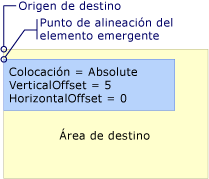  
La ubicación es Absolute o AbsolutePoint  
  
 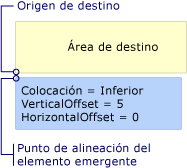  
La ubicación es Bottom  
  
 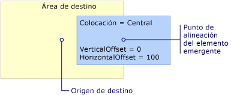  
La ubicación es Center  
  
   
La ubicación es Left  
  
 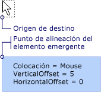  
La ubicación es Mouse  
  
 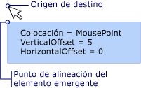  
La ubicación es MousePoint  
  
   
La ubicación es Relative o RelativePoint  
  
 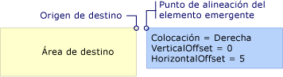  
La ubicación es Right  
  
 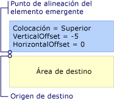  
La ubicación es Top  
  
   
## Cuando el elemento emergente llega al borde de la pantalla  
 Por motivos de seguridad, un <xref:System.Windows.Controls.Primitives.Popup> no pueden estar ocultos por el borde de una pantalla. Una de las tres operaciones siguientes se produce cuando el <xref:System.Windows.Controls.Primitives.Popup> encuentra un borde de la pantalla:  
  
-   El elemento emergente se realinea a lo largo del borde de la pantalla que podría oscurecer el <xref:System.Windows.Controls.Primitives.Popup>.  
  
-   El elemento emergente usa un punto de alineación del elemento Popup distinto.  
  
-   El elemento emergente usa un origen de destino y un punto de alineación del elemento Popup distintos.  
  
 Estas opciones se describen más adelante en esta sección.  
  
 El comportamiento de la <xref:System.Windows.Controls.Primitives.Popup> cuando encuentra un borde de la pantalla depende del valor de la <xref:System.Windows.Controls.Primitives.Popup.Placement%2A> propiedad y que el elemento emergente encuentra el borde de la pantalla. En la tabla siguiente se resume el comportamiento cuando el <xref:System.Windows.Controls.Primitives.Popup> encuentra un borde de la pantalla para cada <xref:System.Windows.Controls.Primitives.PlacementMode> valor.  
  
|PlacementMode|Borde superior|Borde inferior|Borde izquierdo|Borde derecho|  
|-------------------|--------------|-----------------|---------------|----------------|  
|<xref:System.Windows.Controls.Primitives.PlacementMode.Absolute>|Se alinea con el borde superior.|Se alinea con el borde inferior.|Se alinea con el borde izquierdo.|Se alinea con el borde derecho.|  
|<xref:System.Windows.Controls.Primitives.PlacementMode.AbsolutePoint>|Se alinea con el borde superior.|El punto de alineación del elemento popup cambia a la esquina inferior izquierda de la <xref:System.Windows.Controls.Primitives.Popup>.|Se alinea con el borde izquierdo.|El punto de alineación del elemento popup cambia a la esquina superior derecha de la <xref:System.Windows.Controls.Primitives.Popup>.|  
|<xref:System.Windows.Controls.Primitives.PlacementMode.Bottom>|Se alinea con el borde superior.|El origen de destino cambia a la esquina superior izquierda del área de destino y el punto de alineación del elemento popup cambia a la esquina inferior izquierda de la <xref:System.Windows.Controls.Primitives.Popup>.|Se alinea con el borde izquierdo.|Se alinea con el borde derecho.|  
|<xref:System.Windows.Controls.Primitives.PlacementMode.Center>|Se alinea con el borde superior.|Se alinea con el borde inferior.|Se alinea con el borde izquierdo.|Se alinea con el borde derecho.|  
|<xref:System.Windows.Controls.Primitives.PlacementMode.Left>|Se alinea con el borde superior.|Se alinea con el borde inferior.|El origen de destino cambia a la esquina superior derecha del área de destino y el punto de alineación del elemento popup cambia a la esquina superior izquierda de la <xref:System.Windows.Controls.Primitives.Popup>.|Se alinea con el borde derecho.|  
|<xref:System.Windows.Controls.Primitives.PlacementMode.Mouse>|Se alinea con el borde superior.|El origen de destino cambia a la esquina superior izquierda del área de destino (los límites del puntero del mouse) y el punto de alineación del elemento popup cambia a la esquina inferior izquierda de la <xref:System.Windows.Controls.Primitives.Popup>.|Se alinea con el borde izquierdo.|Se alinea con el borde derecho.|  
|<xref:System.Windows.Controls.Primitives.PlacementMode.MousePoint>|Se alinea con el borde superior.|El punto de alineación del elemento popup cambia a la esquina inferior izquierda de la <xref:System.Windows.Controls.Primitives.Popup>.|Se alinea con el borde izquierdo.|El punto de alineación del elemento Popup cambia a la esquina superior derecha del elemento emergente.|  
|<xref:System.Windows.Controls.Primitives.PlacementMode.Relative>|Se alinea con el borde superior.|Se alinea con el borde inferior.|Se alinea con el borde izquierdo.|Se alinea con el borde derecho.|  
|<xref:System.Windows.Controls.Primitives.PlacementMode.RelativePoint>|Se alinea con el borde superior.|El punto de alineación del elemento popup cambia a la esquina inferior izquierda de la <xref:System.Windows.Controls.Primitives.Popup>.|Se alinea con el borde izquierdo.|El punto de alineación del elemento Popup cambia a la esquina superior derecha del elemento emergente.|  
|<xref:System.Windows.Controls.Primitives.PlacementMode.Right>|Se alinea con el borde superior.|Se alinea con el borde inferior.|Se alinea con el borde izquierdo.|El origen de destino cambia a la esquina superior izquierda del área de destino y el punto de alineación del elemento popup cambia a la esquina superior derecha de la <xref:System.Windows.Controls.Primitives.Popup>.|  
|<xref:System.Windows.Controls.Primitives.PlacementMode.Top>|El origen de destino cambia a la esquina inferior izquierda del área de destino y el punto de alineación del elemento popup cambia a la esquina superior izquierda de la <xref:System.Windows.Controls.Primitives.Popup>. De hecho, es la misma que cuando <xref:System.Windows.Controls.Primitives.Popup.Placement%2A> es <xref:System.Windows.Controls.Primitives.PlacementMode.Bottom>.|Se alinea con el borde inferior.|Se alinea con el borde izquierdo.|Se alinea con el borde derecho.|  
  
### Alineación con el bode de la pantalla  
 Un <xref:System.Windows.Controls.Primitives.Popup> puede alinear con el borde de la pantalla cambia su posición así que toda la <xref:System.Windows.Controls.Primitives.Popup> está visible en la pantalla.  Cuando esto ocurre, la distancia entre el punto de alineación de origen y el elemento emergente de destino puede diferir de los valores de <xref:System.Windows.Controls.Primitives.Popup.HorizontalOffset%2A> y <xref:System.Windows.Controls.Primitives.Popup.VerticalOffset%2A>. Cuando <xref:System.Windows.Controls.Primitives.Popup.Placement%2A> es <xref:System.Windows.Controls.Primitives.PlacementMode.Absolute>, <xref:System.Windows.Controls.Primitives.PlacementMode.Center>, o <xref:System.Windows.Controls.Primitives.PlacementMode.Relative>, el <xref:System.Windows.Controls.Primitives.Popup> se alinea con cada borde de la pantalla.  Por ejemplo, supongamos que un <xref:System.Windows.Controls.Primitives.Popup> tiene <xref:System.Windows.Controls.Primitives.Popup.Placement%2A> establecido en <xref:System.Windows.Controls.Primitives.PlacementMode.Relative> y <xref:System.Windows.Controls.Primitives.Popup.VerticalOffset%2A> establecido en 100.  Si el borde inferior de la pantalla oculta la totalidad o parte de la <xref:System.Windows.Controls.Primitives.Popup>, el <xref:System.Windows.Controls.Primitives.Popup> cambia de posición a lo largo del borde inferior de la pantalla y la distancia vertical entre el origen de destino y el elemento emergente, el punto de alineación es inferior a 100. Esto se muestra en la siguiente ilustración.  
  
 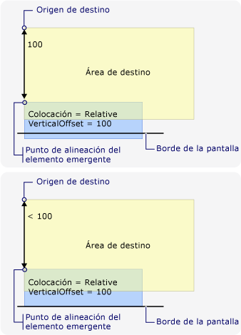  
El control Popup se alinea con el borde de la pantalla  
  
### Cambio del punto de alineación del elemento Popup  
 Si <xref:System.Windows.Controls.Primitives.Popup.Placement%2A> es <xref:System.Windows.Controls.Primitives.PlacementMode.AbsolutePoint>, <xref:System.Windows.Controls.Primitives.PlacementMode.RelativePoint>, o <xref:System.Windows.Controls.Primitives.PlacementMode.MousePoint>, el punto de alineación del elemento popup cambia cuando el elemento emergente encuentra el borde inferior o derecho de la pantalla.  
  
 La siguiente ilustración muestra que cuando el borde inferior de la pantalla oculta la totalidad o parte de la <xref:System.Windows.Controls.Primitives.Popup>, el punto de alineación emergente es la esquina inferior izquierda de la <xref:System.Windows.Controls.Primitives.Popup>.  
  
 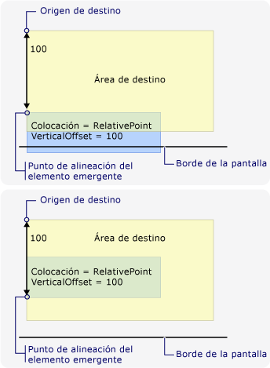  
El elemento emergente encuentra el borde inferior de la pantalla y cambia el punto de alineación del elemento Popup  
  
 La siguiente ilustración muestra que, cuando el <xref:System.Windows.Controls.Primitives.Popup> está oculto por el borde derecho de la pantalla, el punto de alineación emergente es la esquina superior derecha de la <xref:System.Windows.Controls.Primitives.Popup>.  
  
 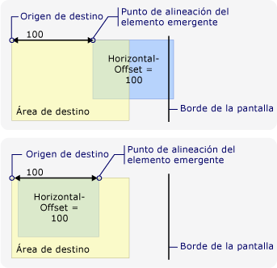  
El elemento emergente encuentra el borde derecho de la pantalla y cambia el punto de alineación del elemento Popup  
  
 Si el <xref:System.Windows.Controls.Primitives.Popup> detecta los bordes inferior y derecho de la pantalla, el punto de alineación emergente es la esquina inferior derecha de la <xref:System.Windows.Controls.Primitives.Popup>.  
  
### Cambio del origen de destino y el punto de alineación del elemento Popup  
 Cuando <xref:System.Windows.Controls.Primitives.Popup.Placement%2A> es <xref:System.Windows.Controls.Primitives.PlacementMode.Bottom>, <xref:System.Windows.Controls.Primitives.PlacementMode.Left>, <xref:System.Windows.Controls.Primitives.PlacementMode.Mouse>, <xref:System.Windows.Controls.Primitives.PlacementMode.Right>, o <xref:System.Windows.Controls.Primitives.PlacementMode.Top>, cambio de punto de la alineación de origen y el elemento emergente de destino si se encuentra un borde de la pantalla determinado.  El borde de la pantalla que hace que la posición cambie depende el <xref:System.Windows.Controls.Primitives.PlacementMode> valor.  
  
 La siguiente ilustración muestra que, cuando <xref:System.Windows.Controls.Primitives.Popup.Placement%2A> es <xref:System.Windows.Controls.Primitives.PlacementMode.Bottom> y <xref:System.Windows.Controls.Primitives.Popup> encuentra el borde inferior de la pantalla, el origen de destino es la esquina superior izquierda del área de destino y el punto de alineación emergente es la esquina inferior izquierda de la <xref:System.Windows.Controls.Primitives.Popup>.  
  
 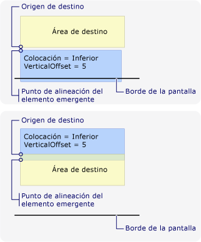  
La ubicación es Bottom y el elemento emergente encuentra el borde inferior de la pantalla.  
  
 La siguiente ilustración muestra que, cuando <xref:System.Windows.Controls.Primitives.Popup.Placement%2A> es <xref:System.Windows.Controls.Primitives.PlacementMode.Left> y <xref:System.Windows.Controls.Primitives.Popup> encuentra el borde izquierdo de la pantalla, el origen de destino es la esquina superior derecha del área de destino y el punto de alineación emergente es la esquina superior izquierda de la <xref:System.Windows.Controls.Primitives.Popup>.  
  
 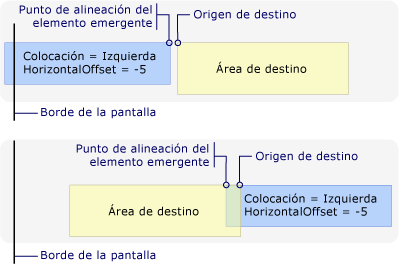  
La ubicación es Left y el elemento emergente encuentra el borde izquierdo de la pantalla.  
  
 La siguiente ilustración muestra que, cuando <xref:System.Windows.Controls.Primitives.Popup.Placement%2A> es <xref:System.Windows.Controls.Primitives.PlacementMode.Right> y <xref:System.Windows.Controls.Primitives.Popup> encuentra el borde derecho de la pantalla, el origen de destino es la esquina superior izquierda del área de destino y el punto de alineación emergente es la esquina superior derecha de la <xref:System.Windows.Controls.Primitives.Popup>.  
  
 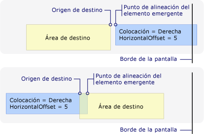  
La ubicación es Right y el elemento emergente encuentra el borde derecho de la pantalla.  
  
 La siguiente ilustración muestra que, cuando <xref:System.Windows.Controls.Primitives.Popup.Placement%2A> es <xref:System.Windows.Controls.Primitives.PlacementMode.Top> y <xref:System.Windows.Controls.Primitives.Popup> encuentra el borde superior de la pantalla, el origen de destino es la esquina inferior izquierda del área de destino y el punto de alineación emergente es la esquina superior izquierda de la <xref:System.Windows.Controls.Primitives.Popup>.  
  
 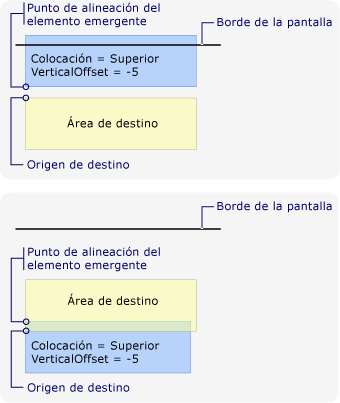  
La ubicación es Top y el elemento emergente encuentra el borde superior de la pantalla.  
  
 La siguiente ilustración muestra que, cuando <xref:System.Windows.Controls.Primitives.Popup.Placement%2A> es <xref:System.Windows.Controls.Primitives.PlacementMode.Mouse> y <xref:System.Windows.Controls.Primitives.Popup> encuentra el borde inferior de la pantalla, el origen de destino es la esquina superior izquierda del área de destino (los límites del puntero del mouse) y la alineación del elemento popup punto es la esquina inferior izquierda de la <xref:System.Windows.Controls.Primitives.Popup>.  
  
 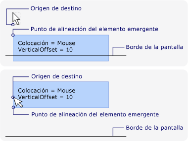  
La ubicación es Mouse y el elemento emergente encuentra el borde inferior de la pantalla.  
  
### Personalización de la ubicación del elemento Popup  
 Puede personalizar el punto de alineación de origen y el elemento emergente de destino estableciendo el <xref:System.Windows.Controls.Primitives.Popup.Placement%2A> propiedad <xref:System.Windows.Controls.Primitives.PlacementMode.Custom>. A continuación, defina un <xref:System.Windows.Controls.Primitives.CustomPopupPlacementCallback> delegado que devuelve un conjunto de puntos de selección de ubicación posibles y los ejes principales (en orden de preferencia) para el <xref:System.Windows.Controls.Primitives.Popup>. El punto que muestra la mayor parte de la <xref:System.Windows.Controls.Primitives.Popup> está seleccionada.  La posición de la <xref:System.Windows.Controls.Primitives.Popup> se ajusta automáticamente si el <xref:System.Windows.Controls.Primitives.Popup> está oculto por el borde de la pantalla. Para ver un ejemplo, consulte cómo [especificar una posición emergente personalizada](../../../../docs/framework/wpf/controls/how-to-specify-a-custom-popup-position.md).  
  
## Vea también  
 [Ejemplo de colocación del control Popup](https://go.microsoft.com/fwlink/?LinkID=160032)
