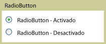

# RadioButton
<xref:System.Windows.Controls.RadioButton>controles suelen agruparse para ofrecer a los usuarios una sola opción entre varias opciones; se puede seleccionar solo un botón a la vez.  
  
 En la siguiente ilustración muestra un ejemplo de un <xref:System.Windows.Controls.RadioButton> control.  
  
   
Control RadioButton típico  
  
## Referencia  
 <xref:System.Windows.Controls.Primitives.ToggleButton>  
  
## Secciones relacionadas
