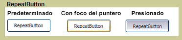

# RepeatButton
El <xref:System.Windows.Controls.Primitives.RepeatButton> es similar a un <xref:System.Windows.Controls.Button>. Sin embargo, <xref:System.Windows.Controls.Primitives.RepeatButton> elementos le permiten controlar cuándo y cómo el <xref:System.Windows.Controls.Primitives.ButtonBase.Click> se produce el evento.  
  
 El gráfico siguiente muestra un ejemplo de los tres estados de un control de botones de repetición, de forma predeterminada, PointerFocused y presionada. El primer botón muestra el estado predeterminado de la <xref:System.Windows.Controls.Primitives.RepeatButton>. El segundo muestra cómo se cambia la apariencia del botón cuando el puntero del mouse se sitúa sobre el botón, y recibe el foco. El último botón muestra el aspecto de la <xref:System.Windows.Controls.Primitives.RepeatButton> cuando el usuario presiona el botón del mouse sobre el control.  
  
   
RepeatButton típico  
  
## En esta sección  
  
## Referencia  
 <xref:System.Windows.Controls.Primitives.RepeatButton>  
  
## Secciones relacionadas
