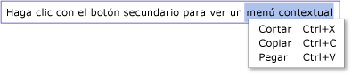

# Información general sobre el control RichTextBox

El <xref:System.Windows.Controls.RichTextBox> control permite mostrar o editar el contenido del flujo, como párrafos, imágenes, tablas, etc. En este tema se presenta la <xref:System.Windows.Controls.TextBox> clase y se proporcionan ejemplos de cómo usarla en [!INCLUDE[TLA#tla_xaml](../../../../includes/tlasharptla-xaml-md.md)] y C#.

## ¿TextBox o RichTextBox?

<xref:System.Windows.Controls.RichTextBox>Y <xref:System.Windows.Controls.TextBox> permiten a los usuarios editar texto, sin embargo, los dos controles se usan en escenarios diferentes. Una <xref:System.Windows.Controls.RichTextBox> es una opción mejor cuando es necesario que el usuario edite texto con formato, imágenes, tablas u otro contenido enriquecido. Por ejemplo, la edición de un documento, artículo o blog que requiera formato, imágenes, etc., se consigue mejor mediante <xref:System.Windows.Controls.RichTextBox> . Una <xref:System.Windows.Controls.TextBox> requiere menos recursos del sistema <xref:System.Windows.Controls.RichTextBox> y es ideal cuando solo es necesario editar texto sin formato (es decir, el uso en formularios). Vea [información general](textbox-overview.md) sobre el cuadro de texto para obtener más información sobre <xref:System.Windows.Controls.TextBox> . En la tabla siguiente se resumen las características principales de <xref:System.Windows.Controls.TextBox> y <xref:System.Windows.Controls.RichTextBox> .

|Control|Revisión ortográfica en tiempo real|Menú contextual|Comandos de formato como <xref:System.Windows.Documents.EditingCommands.ToggleBold%2A> (CTR + B)|<xref:System.Windows.Documents.FlowDocument>contenido como imágenes, párrafos, tablas, etc.|
|-------------|------------------------------|------------------|------------------------------------------------------------------------------------------------------------------------------------------------------------------------------------------------------|--------------------------------------------------------------------------------------------------------------------------------------------------------------------------------------------------|
|<xref:System.Windows.Controls.TextBox>|Sí|Sí|No|No.|
|<xref:System.Windows.Controls.RichTextBox>|Sí|Sí|Sí|Sí|

> [!NOTE]
> Aunque no <xref:System.Windows.Controls.TextBox> admite comandos relacionados con el formato como <xref:System.Windows.Documents.EditingCommands.ToggleBold%2A> (CTR + B), muchos comandos básicos son compatibles con ambos controles, como <xref:System.Windows.Documents.EditingCommands.MoveToLineEnd%2A> .

Las características de la tabla anterior se detallan más adelante.

## Creación de RichTextBox

En el código siguiente se muestra cómo crear un <xref:System.Windows.Controls.RichTextBox> que un usuario pueda editar contenido enriquecido en.

[!code-xaml[RichTextBoxMiscSnippets_snip#BasicRichTextBoxExampleWholePage](~/samples/snippets/csharp/VS_Snippets_Wpf/RichTextBoxMiscSnippets_snip/CSharp/BasicRichTextBoxExample.xaml#basicrichtextboxexamplewholepage)]

En concreto, el contenido editado en un <xref:System.Windows.Controls.RichTextBox> es contenido dinámico. El contenido dinámico puede incluir muchos tipos de elementos, como texto con formato, imágenes, listas y tablas. Consulte [Información general sobre documentos dinámicos](../advanced/flow-document-overview.md) para ver información detallada sobre los documentos dinámicos. Para incluir contenido dinámico, un <xref:System.Windows.Controls.RichTextBox> hospeda un <xref:System.Windows.Documents.FlowDocument> objeto que, a su vez, contiene el contenido modificable. Para mostrar el contenido dinámico en un <xref:System.Windows.Controls.RichTextBox> , el código siguiente muestra cómo crear un <xref:System.Windows.Controls.RichTextBox> con un párrafo y un texto en negrita.

[!code-xaml[RichTextBoxMiscSnippets_snip#RichTextBoxWithContentExampleWholePage](~/samples/snippets/csharp/VS_Snippets_Wpf/RichTextBoxMiscSnippets_snip/CSharp/RichTextBoxWithContentExample.xaml#richtextboxwithcontentexamplewholepage)]

[!code-csharp[RichTextBoxMiscSnippets_procedural_snip#BasicRichTextBoxWithContentCodeOnlyExample](~/samples/snippets/csharp/VS_Snippets_Wpf/RichTextBoxMiscSnippets_procedural_snip/CSharp/BasicRichTextBoxWithContentExample.cs#basicrichtextboxwithcontentcodeonlyexample)]
[!code-vb[RichTextBoxMiscSnippets_procedural_snip#BasicRichTextBoxWithContentCodeOnlyExample](~/samples/snippets/visualbasic/VS_Snippets_Wpf/RichTextBoxMiscSnippets_procedural_snip/visualbasic/basicrichtextboxwithcontentexample.vb#basicrichtextboxwithcontentcodeonlyexample)]

En la siguiente ilustración se muestra cómo se representa este ejemplo.

Los elementos como <xref:System.Windows.Documents.Paragraph> y <xref:System.Windows.Documents.Bold> determinan cómo aparece el contenido dentro de <xref:System.Windows.Controls.RichTextBox> . Cuando un usuario edita <xref:System.Windows.Controls.RichTextBox> el contenido, cambia este contenido dinámico. Para más información sobre las características del contenido dinámico y cómo trabajar con él, consulte [Información general sobre documentos dinámicos](../advanced/flow-document-overview.md).

> [!NOTE]
> El contenido dinámico dentro de no se <xref:System.Windows.Controls.RichTextBox> comporta exactamente igual que el contenido dinámico contenido en otros controles. Por ejemplo, no hay ninguna columna en <xref:System.Windows.Controls.RichTextBox> y, por lo tanto, no hay ningún comportamiento de cambio de tamaño automático. Además, las características integradas, como la búsqueda, el modo de visualización, la navegación de páginas y el zoom, no están disponibles en <xref:System.Windows.Controls.RichTextBox> .

## Revisión ortográfica en tiempo real

Puede habilitar la revisión ortográfica en tiempo real en un <xref:System.Windows.Controls.TextBox> o <xref:System.Windows.Controls.RichTextBox> . Cuando se activa la revisión ortográfica, aparece una línea roja debajo de las palabras con errores de ortografía (consulte la siguiente imagen).

Consulte [Cómo habilitar el corrector ortográfico en un control de edición de texto](how-to-enable-spell-checking-in-a-text-editing-control.md) para más información sobre cómo activar la revisión ortográfica.

## Menú contextual

De forma predeterminada, <xref:System.Windows.Controls.TextBox> y <xref:System.Windows.Controls.RichTextBox> tienen un menú contextual que aparece cuando un usuario hace clic con el botón secundario dentro del control. El menú contextual permite al usuario cortar, copiar o pegar (consulte la siguiente ilustración).

Puede crear su propio menú contextual personalizado para invalidar el predeterminado. Consulte [Colocar un menú contextual personalizado en un control RichTextBox](how-to-position-a-custom-context-menu-in-a-richtextbox.md) para más información.

## Editar comandos

Los comandos de edición permiten a los usuarios dar formato al contenido editable dentro de <xref:System.Windows.Controls.RichTextBox> . Además de los comandos de edición básicos, <xref:System.Windows.Controls.RichTextBox> incluye comandos de formato que <xref:System.Windows.Controls.TextBox> no admite. Por ejemplo, al editar en un <xref:System.Windows.Controls.RichTextBox> , un usuario podría presionar CTR + B para alternar el formato de texto en negrita. Vea <xref:System.Windows.Documents.EditingCommands> para obtener una lista completa de los comandos disponibles. Además de usar métodos abreviados de teclado, puede enlazar los comandos a otros controles como botones. En el siguiente ejemplo, se muestra cómo crear una herramienta de la barra sencilla que contiene botones que el usuario puede usar para cambiar el formato de texto.

[!code-xaml[RichTextBox_InputPanel_snip#RichTextBoxWithToolBarExampleWholePage](~/samples/snippets/csharp/VS_Snippets_Wpf/RichTextBox_InputPanel_snip/CS/Window1.xaml#richtextboxwithtoolbarexamplewholepage)]

En la siguiente ilustración, se muestra cómo se representa este ejemplo.

## Detección de cambios de contenido

Normalmente, el <xref:System.Windows.Controls.Primitives.TextBoxBase.TextChanged> evento se debe usar para detectar siempre que el texto de un <xref:System.Windows.Controls.TextBox> o <xref:System.Windows.Controls.RichTextBox> cambie en lugar <xref:System.Windows.UIElement.KeyDown> de como cabría esperar. Consulte [Detect When Text in a TextBox Has Changed](how-to-detect-when-text-in-a-textbox-has-changed.md) (Detectar cuándo cambia el texto en un control TextBox) para ver un ejemplo.

## Guardar, cargar e imprimir contenido de un control RichTextBox

En el ejemplo siguiente se muestra cómo guardar el contenido de un <xref:System.Windows.Controls.RichTextBox> en un archivo, cargar el contenido de nuevo en <xref:System.Windows.Controls.RichTextBox> e imprimir el contenido. A continuación, se muestra el marcado para el ejemplo.

[!code-xaml[RichTextBoxMiscSnippets_snip#SaveLoadPrintRTBExampleWholePage](~/samples/snippets/csharp/VS_Snippets_Wpf/RichTextBoxMiscSnippets_snip/CSharp/SaveLoadPrintRTB.xaml#saveloadprintrtbexamplewholepage)]

A continuación, se muestra el código subyacente para el ejemplo.

[!code-csharp[RichTextBoxMiscSnippets_snip#SaveLoadPrintRTBCodeExampleWholePage](~/samples/snippets/csharp/VS_Snippets_Wpf/RichTextBoxMiscSnippets_snip/CSharp/SaveLoadPrintRTB.xaml.cs#saveloadprintrtbcodeexamplewholepage)]
[!code-vb[RichTextBoxMiscSnippets_snip#SaveLoadPrintRTBCodeExampleWholePage](~/samples/snippets/visualbasic/VS_Snippets_Wpf/RichTextBoxMiscSnippets_snip/VisualBasic/SaveLoadPrintRTB.xaml.vb#saveloadprintrtbcodeexamplewholepage)]

## Consulte también

- [Temas "Cómo..."](richtextbox-how-to-topics.md)
- [Información general sobre TextBox](textbox-overview.md)
