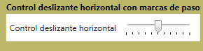

# SliderSlider
El <xref:System.Windows.Controls.Slider> permite seleccionar entre una gama de valores moviendo un <xref:System.Windows.Controls.Primitives.Thumb> a lo largo de un <xref:System.Windows.Controls.Primitives.Track>.The <xref:System.Windows.Controls.Slider> allows you select from a range of values by moving a <xref:System.Windows.Controls.Primitives.Thumb> along a <xref:System.Windows.Controls.Primitives.Track>.  
  
 La siguiente ilustración muestra un ejemplo de una horizontal <xref:System.Windows.Controls.Slider> control.The following illustration shows an example of a horizontal <xref:System.Windows.Controls.Slider> control.  
  
   
  
## En esta secciónIn This Section  
 [Personalizar las marcas de paso en un control SliderCustomize the Ticks on a Slider](how-to-customize-the-ticks-on-a-slider.md)  
  
## ReferenciaReference  
 <xref:System.Windows.Controls.Slider>  
  <xref:System.Windows.Controls.Primitives.Track>  
  <xref:System.Windows.Controls.Primitives.Thumb>
