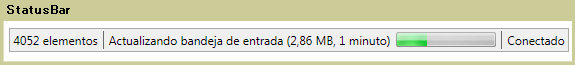

# StatusBar
Un <xref:System.Windows.Controls.Primitives.StatusBar> es un área horizontal en la parte inferior de una ventana donde una aplicación puede mostrar información de estado.  
  
 La siguiente ilustración muestra un ejemplo de un <xref:System.Windows.Controls.Primitives.StatusBar>.  
  
   
  
## En esta sección  
  
## Referencia  
 <xref:System.Windows.Controls.Primitives.StatusBar>  
  <xref:System.Windows.Controls.Primitives.StatusBarItem>  
  
## Secciones relacionadas
