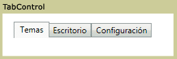

# TabControlTabControl
<xref:System.Windows.Controls.TabControl> elementos mostrar contenido en discretas páginas puede tener acceso seleccionando la ficha adecuada. Cada pestaña contiene un <xref:System.Windows.Controls.TabItem>.<xref:System.Windows.Controls.TabControl> elements display content on discrete pages accessed by selecting the appropriate tab. Each tab contains a <xref:System.Windows.Controls.TabItem>.  
  
 La siguiente ilustración muestra un <xref:System.Windows.Controls.TabControl>.The following illustration shows a <xref:System.Windows.Controls.TabControl>.  
  
   
TabControl típicoTypical TabControl  
  
## ReferenciaReference  
 <xref:System.Windows.Controls.TabControl>  
  <xref:System.Windows.Controls.TabItem>  
  
## Secciones relacionadasRelated Sections
