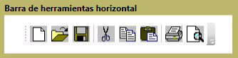
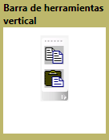

# ToolBar
El <xref:System.Windows.Controls.ToolBar> control es un contenedor para un grupo de comandos o controles que suelen estar relacionados en su función.  
  
 Las ilustraciones siguientes muestran horizontal y vertical <xref:System.Windows.Controls.ToolBar> controles.  
  
   
Barra de herramientas horizontal  
  
   
Barra de herramientas vertical  
  
## En esta sección  
 [Información general sobre controles ToolBar](../../../../docs/framework/wpf/controls/toolbar-overview.md)  
  [Aplicar estilo a controles en un elemento toolbar](../../../../docs/framework/wpf/controls/how-to-style-controls-on-a-toolbar.md)  
  
## Referencia  
 <xref:System.Windows.Controls.ToolBar>  
  <xref:System.Windows.Controls.ToolBarTray>  
  
## Secciones relacionadas
