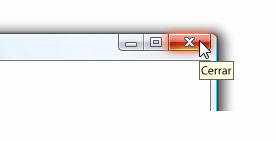

# Información sobre herramientasToolTip
Una información sobre herramientas es una pequeña ventana emergente que aparece cuando un usuario pausa el puntero del mouse sobre un elemento, por ejemplo, como en un <xref:System.Windows.Controls.Button>.A tooltip is a small pop-up window that appears when a user pauses the mouse pointer over an element, such as over a <xref:System.Windows.Controls.Button>.  
  
 La ilustración siguiente muestra un puntero que señala a la **cerrar**<xref:System.Windows.Controls.Button>, lo que le muestra su identificación <xref:System.Windows.Controls.ToolTip>.The following illustration shows a mouse pointer that points to the **Close**<xref:System.Windows.Controls.Button>, which then displays its identifying <xref:System.Windows.Controls.ToolTip>.  
  
 Botón cerrar con su información sobre herramientas muestraClose button with its tooltip displayed  
  
   
  
## En esta secciónIn This Section  
 [Información general de información sobre herramientasToolTip Overview](../../../../docs/framework/wpf/controls/tooltip-overview.md)  
  [Temas "Cómo..."How-to Topics](../../../../docs/framework/wpf/controls/tooltip-how-to-topics.md)  
  
## ReferenciaReference  
 <xref:System.Windows.Controls.ToolTip>  
  <xref:System.Windows.Controls.ToolTipService>  
  <xref:System.Windows.Controls.Primitives.Popup>  
  
## Secciones relacionadasRelated Sections  
 [Información general sobre el control PopupPopup Overview](../../../../docs/framework/wpf/controls/popup-overview.md)  
  [Temas "Cómo..."How-to Topics](../../../../docs/framework/wpf/controls/popup-how-to-topics.md)
