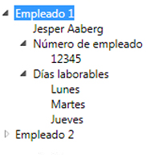

# TreeViewTreeView
El <xref:System.Windows.Controls.TreeView> control muestra información en una estructura jerárquica con nodos contraíbles.The <xref:System.Windows.Controls.TreeView> control displays information in a hierarchical structure by using collapsible nodes.  
  
 En la siguiente ilustración es un ejemplo de un <xref:System.Windows.Controls.TreeView> control anidadas <xref:System.Windows.Controls.TreeViewItem> controles.The following illustration is an example of a <xref:System.Windows.Controls.TreeView> control that has nested <xref:System.Windows.Controls.TreeViewItem> controls.  
  
   
  
## En esta secciónIn This Section  
 [Introducción a TreeViewTreeView Overview](../../../../docs/framework/wpf/controls/treeview-overview.md)  
 [Temas "Cómo..."How-to Topics](../../../../docs/framework/wpf/controls/treeview-how-to-topics.md)  
  
## ReferenciaReference  
 <xref:System.Windows.Controls.TreeView>  
  <xref:System.Windows.Controls.TreeViewItem>  
  
## Secciones relacionadasRelated Sections  
 [Información general sobre el enlace de datosData Binding Overview](../../../../docs/framework/wpf/data/data-binding-overview.md)  
  [Información general sobre plantillas de datosData Templating Overview](../../../../docs/framework/wpf/data/data-templating-overview.md)
