# Tutorial: Crear un botón mediante Microsoft Expression BlendWalkthrough: Create a Button by Using Microsoft Expression Blend

Este tutorial le guiará por el proceso de creación de un botón personalizado de WPF mediante Microsoft Expression Blend.This walkthrough steps you through the process of creating a WPF customized button using Microsoft Expression Blend.

> [!IMPORTANT]
> Microsoft Expression Blend genera [!INCLUDE[TLA#tla_xaml](../../../../includes/tlasharptla-xaml-md.md)] que se compilan para crear el programa ejecutable.Microsoft Expression Blend works by generating [!INCLUDE[TLA#tla_xaml](../../../../includes/tlasharptla-xaml-md.md)] that is then compiled to make the executable program. Si prefiere trabajar con XAML directamente, hay otro tutorial que crea la misma aplicación que esta con XAML con Visual Studio en lugar de Blend.If you would rather work with XAML directly, there is another walkthrough that creates the same application as this one using XAML with Visual Studio rather than Blend. Para obtener más información [, vea crear un botón mediante XAML](walkthrough-create-a-button-by-using-xaml.md) .See [Create a Button by Using XAML](walkthrough-create-a-button-by-using-xaml.md) for more information.

En la ilustración siguiente se muestra el botón personalizado que creará.The following illustration shows the customized button that you will create.

## Convertir una forma en un botónConvert a Shape to a Button

En la primera parte de este tutorial, creará la apariencia personalizada del botón personalizado.In the first part of this walkthrough you create the custom look of the custom button. Para ello, primero debe convertir un rectángulo en un botón.To do this, you first convert a rectangle to a button. A continuación, agregue formas adicionales a la plantilla del botón, creando un botón de aspecto más complejo.You then add additional shapes to the template of the button, creating a more complex looking button. ¿Por qué no empezar con un botón normal y personalizarlo?Why not start with a regular button and customize it? Dado que un botón tiene una funcionalidad integrada que no necesita; en el caso de los botones personalizados, es más fácil empezar con un rectángulo.Because a button has built-in functionality that you do not need; for custom buttons, it is easier to start with a rectangle.

### Para crear un nuevo proyecto en Expression BlendTo create a new project in Expression Blend

1. Iniciar Expression Blend.Start Expression Blend. (Haga clic en **Inicio**, seleccione **todos los programas**, elija **Microsoft Expression**y, a continuación, haga clic en **Microsoft Expression Blend**).(Click **Start**, point to **All Programs**, point to **Microsoft Expression**, and then click **Microsoft Expression Blend**.)

2. Maximice la aplicación si es necesario.Maximize the application if needed.

3. En el menú **Archivo**, haga clic en **Nuevo proyecto**.On the **File** menu, click **New Project**.

4. Seleccione **aplicación estándar (. exe)** .Select **Standard Application (.exe)**.

5. Asigne un nombre al proyecto `CustomButton` y presione **Aceptar**.Name the project `CustomButton` and press **OK**.

En este momento tiene un proyecto de WPF en blanco.At this point you have a blank WPF project. Puede presionar F5 para ejecutar la aplicación.You can press F5 to run the application. Como cabría esperar, la aplicación solo se compone de una ventana en blanco.As you might expect, the application consists of only a blank window. A continuación, se crea un rectángulo redondeado y se convierte en un botón.Next, you create a rounded rectangle and convert it into a button.

### Para convertir un rectángulo en un botónTo convert a Rectangle to a Button

1. **Establezca la propiedad fondo de la ventana en negro:** Seleccione la ventana, haga clic en la **pestaña propiedades**y establezca la propiedad <xref:System.Windows.Controls.Control.Background%2A> en `Black`.**Set the Window Background property to black:** Select the Window, click the **Properties Tab**, and set the <xref:System.Windows.Controls.Control.Background%2A> property to `Black`.

    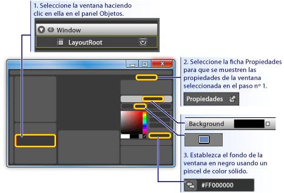

2. **Dibuja un rectángulo aproximadamente el tamaño de un botón en la ventana:** Seleccione la herramienta rectángulo en el panel de herramientas de la izquierda y arrastre el rectángulo a la ventana.**Draw a rectangle approximately the size of a button on the Window:** Select the rectangle tool on the left-hand tool panel and drag the rectangle onto the Window.

    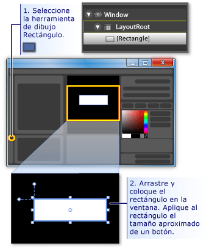

3. **Redondear las esquinas del rectángulo:** Arrastre los puntos de control del rectángulo o establezca directamente las propiedades <xref:System.Windows.Shapes.Rectangle.RadiusX%2A> y <xref:System.Windows.Shapes.Rectangle.RadiusY%2A>.**Round out the corners of the rectangle:** Either drag the control points of the rectangle or directly set the <xref:System.Windows.Shapes.Rectangle.RadiusX%2A> and <xref:System.Windows.Shapes.Rectangle.RadiusY%2A> properties. Establezca los valores de <xref:System.Windows.Shapes.Rectangle.RadiusX%2A> y <xref:System.Windows.Shapes.Rectangle.RadiusY%2A> en 20.Set the values of <xref:System.Windows.Shapes.Rectangle.RadiusX%2A> and <xref:System.Windows.Shapes.Rectangle.RadiusY%2A> to 20.

    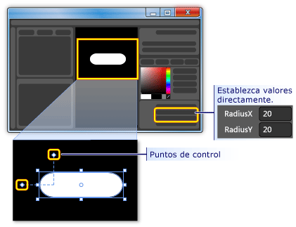

4. **Cambie el rectángulo a un botón:** Seleccione el rectángulo.**Change the rectangle into a button:** Select the rectangle. En el menú **herramientas** , haga clic en el **botón crear**.On the **Tools** menu, click **Make Button**.

    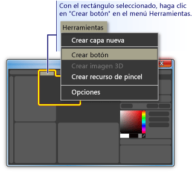

5. **Especifique el ámbito del estilo o la plantilla:** Aparece un cuadro de diálogo como el siguiente.**Specify the scope of the style/template:** A dialog box like the following appears.

    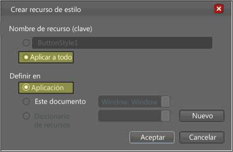

    En **nombre de recurso (clave)** , seleccione **aplicar a todo**.For **Resource name (Key)**, select **Apply to all**.  Esto hará que el estilo y la plantilla de botón resultantes se apliquen a todos los objetos que son botones.This will make the resulting style and button template apply to all objects that are buttons. **En definir en**, seleccione **aplicación**.For **Define in**, select **Application**. Esto hará que el estilo y la plantilla de botón resultantes tengan el ámbito en toda la aplicación.This will make the resulting style and button template have scope over the entire application. Al establecer los valores de estos dos cuadros, el estilo de botón y la plantilla se aplican a todos los botones de la aplicación completa y cualquier botón que se cree en la aplicación usará de forma predeterminada esta plantilla.When you set the values in these two boxes, the button style and template apply to all buttons within the entire application and any button you create in the application will, by default, use this template.

## Editar la plantilla de botónEdit the Button Template

Ahora tiene un rectángulo que se ha cambiado a un botón.You now have a rectangle that has been changed to a button. En esta sección, modificará la plantilla del botón y personalizará aún más su aspecto.In this section, you'll modify the template of the button and further customize how it looks.

### Para editar la plantilla de botón para cambiar la apariencia del botónTo edit the button template to change the button appearance

1. **Vaya a Editar vista de plantilla:** Para personalizar aún más el aspecto de nuestro botón, es necesario editar la plantilla de botón.**Go into edit template view:** To further customize the look of our button, we need to edit the button template. Esta plantilla se creó cuando se convirtió el rectángulo en un botón.This template was created when we converted the rectangle into a button. Para editar la plantilla de botón, haga clic con el botón derecho en el botón y seleccione **Editar partes de control (plantilla)** y, a continuación, **Editar plantilla**.To edit the button template, right-click the button and select **Edit Control Parts (Template)** and then **Edit Template**.

    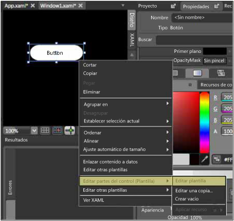

    En el editor de plantillas, observe que el botón ahora está separado en un <xref:System.Windows.Shapes.Rectangle> y en el <xref:System.Windows.Controls.ContentPresenter>.In the template editor, notice that the button is now separated into a <xref:System.Windows.Shapes.Rectangle> and the <xref:System.Windows.Controls.ContentPresenter>. El <xref:System.Windows.Controls.ContentPresenter> se usa para presentar el contenido dentro del botón (por ejemplo, la cadena "Button").The <xref:System.Windows.Controls.ContentPresenter> is used to present content within the button (for example, the string "Button"). Tanto el rectángulo como el <xref:System.Windows.Controls.ContentPresenter> se colocan dentro de un <xref:System.Windows.Controls.Grid>.Both the rectangle and <xref:System.Windows.Controls.ContentPresenter> are laid out inside of a <xref:System.Windows.Controls.Grid>.

    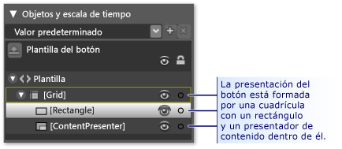

2. **Cambie los nombres de los componentes de la plantilla:** Haga clic con el botón secundario en el rectángulo en el inventario de plantillas, cambie el nombre de la <xref:System.Windows.Shapes.Rectangle> de "[Rectangle]" a "outerRectangle" y cambie "[ContentPresenter]" por "myContentPresenter".**Change the names of the template components:** Right-click the rectangle in the template inventory, change the <xref:System.Windows.Shapes.Rectangle> name from "[Rectangle]" to "outerRectangle", and change "[ContentPresenter]" to "myContentPresenter".

    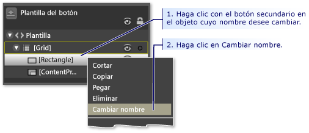

3. **Modifique el rectángulo para que esté vacío dentro de (como un anillo):** Seleccione **outerRectangle** y establezca <xref:System.Windows.Shapes.Shape.Fill%2A> en "transparente" y <xref:System.Windows.Shapes.Shape.StrokeThickness%2A> en 5.**Alter the rectangle so that it is empty inside (like a donut):** Select **outerRectangle** and set <xref:System.Windows.Shapes.Shape.Fill%2A> to "Transparent" and <xref:System.Windows.Shapes.Shape.StrokeThickness%2A> to 5.

    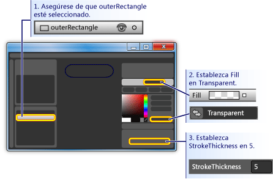

    A continuación, establezca el <xref:System.Windows.Shapes.Shape.Stroke%2A> en el color de lo que sea la plantilla.Then set the <xref:System.Windows.Shapes.Shape.Stroke%2A> to the color of whatever the template will be. Para ello, haga clic en el cuadro blanco pequeño situado junto a **Stroke**, seleccione **CustomExpression**y escriba "{background TemplateBinding}" en el cuadro de diálogo.To do this, click the small white box next to **Stroke**, select **CustomExpression**, and type "{TemplateBinding Background}" in the dialog box.

    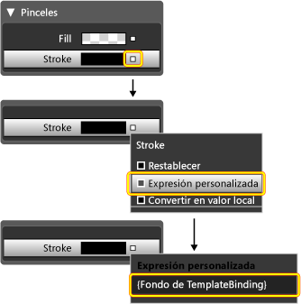

4. **Cree un rectángulo interno:** Ahora, cree otro rectángulo (asígnele el nombre "innerRectangle") y colóquelo simétricamente en el interior de **outerRectangle** .**Create an inner rectangle:** Now, create another rectangle (name it "innerRectangle") and position it symmetrically on the inside of **outerRectangle** . Para este tipo de trabajo, es probable que desee hacer zoom para aumentar el tamaño del botón en el área de edición.For this kind of work, you will probably want to zoom to make the button larger in the editing area.

    > [!NOTE]
    > El rectángulo podría tener una apariencia diferente a la de la ilustración (por ejemplo, podría tener esquinas redondeadas).Your rectangle might look different than the one in the figure (for example, it might have rounded corners).

    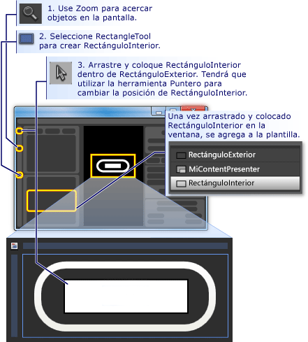

5. **Mueva ContentPresenter a la parte superior:** En este punto, es posible que el texto "Button" no sea visible más.**Move ContentPresenter to the top:** At this point, it is possible that the text "Button" will not be visible any longer. Si es así, esto se debe a que **innerRectangle** está en la parte superior de **myContentPresenter**.If this is so, this is because **innerRectangle** is on top of the **myContentPresenter**. Para solucionarlo, arrastre **myContentPresenter** debajo de **innerRectangle**.To fix this, drag **myContentPresenter** below **innerRectangle**. Cambie la posición de los rectángulos y **myContentPresenter** para que tengan un aspecto similar al siguiente.Reposition rectangles and **myContentPresenter** to look similar to below.

    > [!NOTE]
    > También puede colocar **myContentPresenter** en la parte superior haciendo clic con el botón derecho en él y presionando **enviar hacia delante**.Alternatively, you can also position **myContentPresenter** on top by right-clicking it and pressing **Send Forward**.

    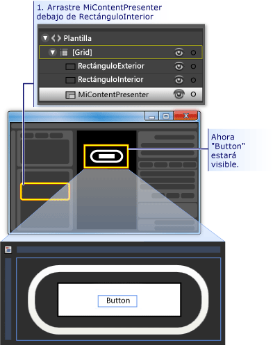

6. **Cambiar el aspecto de innerRectangle:** Establezca los valores de <xref:System.Windows.Shapes.Rectangle.RadiusX%2A>, <xref:System.Windows.Shapes.Rectangle.RadiusY%2A>y <xref:System.Windows.Shapes.Shape.StrokeThickness%2A> en 20.**Change the look of innerRectangle:** Set the <xref:System.Windows.Shapes.Rectangle.RadiusX%2A>, <xref:System.Windows.Shapes.Rectangle.RadiusY%2A>, and <xref:System.Windows.Shapes.Shape.StrokeThickness%2A> values to 20. Además, establezca el <xref:System.Windows.Shapes.Shape.Fill%2A> en el fondo de la plantilla mediante la expresión personalizada "{background TemplateBinding}") y establezca <xref:System.Windows.Shapes.Shape.Stroke%2A> en "transparent".In addition, set the <xref:System.Windows.Shapes.Shape.Fill%2A> to the background of the template using the custom expression "{TemplateBinding Background}" ) and set <xref:System.Windows.Shapes.Shape.Stroke%2A> to "transparent". Tenga en cuenta que los valores para los <xref:System.Windows.Shapes.Shape.Fill%2A> y <xref:System.Windows.Shapes.Shape.Stroke%2A> de **innerRectangle** son los opuestos a los de **outerRectangle**.Notice that the settings for the <xref:System.Windows.Shapes.Shape.Fill%2A> and <xref:System.Windows.Shapes.Shape.Stroke%2A> of **innerRectangle** are the opposite of those for **outerRectangle**.

    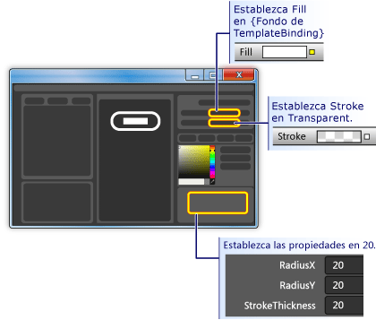

7. **Agregar una capa de cristal en la parte superior:** La parte final de la personalización de la apariencia del botón es agregar una capa de cristal en la parte superior.**Add a glass layer on top:** The final piece of customizing the look of the button is to add a glass layer on top. Esta capa de cristal está formada por un tercer rectángulo.This glass layer consists of a third rectangle. Dado que el cristal cubre todo el botón, el rectángulo de cristal es similar en dimensiones al **outerRectangle**.Because the glass will cover the entire button, the glass rectangle is similar in dimensions to the **outerRectangle**. Por lo tanto, cree el rectángulo simplemente haciendo una copia de **outerRectangle**.Therefore, create the rectangle by simply making a copy of the **outerRectangle**. Resalte **outerRectangle** y use Ctrl + C y Ctrl + V para hacer una copia.Highlight **outerRectangle** and use CTRL+C and CTRL+V to make a copy. Asigne a este nuevo rectángulo el nombre "glassCube".Name this new rectangle "glassCube".

8. **Cambie la posición de glassCube si es necesario:** Si **glassCube** no está ya situado para que cubra todo el botón, arrástrelo a la posición.**Reposition glassCube if necessary:** If **glassCube** is not already positioned so that it covers the entire button, drag it into position.

9. **Proporcione a glassCube una forma ligeramente diferente que outerRectangle:** Cambie las propiedades de **glassCube**.**Give glassCube a slightly different shape than outerRectangle:** Change the properties of **glassCube**. Para empezar, cambie las propiedades <xref:System.Windows.Shapes.Rectangle.RadiusX%2A> y <xref:System.Windows.Shapes.Rectangle.RadiusY%2A> a 10 y el <xref:System.Windows.Shapes.Shape.StrokeThickness%2A> a 2.Start off by changing the <xref:System.Windows.Shapes.Rectangle.RadiusX%2A> and <xref:System.Windows.Shapes.Rectangle.RadiusY%2A> properties to 10 and the <xref:System.Windows.Shapes.Shape.StrokeThickness%2A> to 2.

    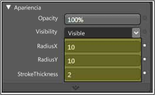

10. **Haga que glassCube tenga el aspecto de cristal:** Establezca el <xref:System.Windows.Shapes.Shape.Fill%2A> en un aspecto de vidrio con un degradado lineal que sea 75% opaco y alterne entre el color blanco y el transparente en 6 intervalos de aproximadamente espaciados uniformemente.**Make glassCube look like glass:** Set the <xref:System.Windows.Shapes.Shape.Fill%2A> to a glassy look by  using a linear gradient that is 75% opaque and alternates between the color White and Transparent over 6 approximately evenly spaced intervals. Este es el conjunto de delimitadores de degradado:This is what to set the gradient stops to:

    - Detención de degradado 1: blanco con valor alfa de 75%Gradient Stop 1: White with Alpha value of 75%

    - Delimitador de degradado 2: transparenteGradient Stop 2: Transparent

    - Detención de degradado 3: blanco con valor alfa de 75%Gradient Stop 3: White with Alpha value of 75%

    - Detención de degradado 4: transparenteGradient Stop 4: Transparent

    - Detención de degradado 5: blanco con valor alfa de 75%Gradient Stop 5: White with Alpha value of 75%

    - Detención de degradado 6: transparenteGradient Stop 6: Transparent

    Esto crea un aspecto de cristal "ondulado".This creates a "wavy" glass look.

    

11. **Ocultar la capa de cristal:** Ahora que ve el aspecto de la capa de cristal, vaya al **Panel apariencia** del **panel Propiedades** y establezca la opacidad en 0% para ocultarla.**Hide the glass layer:** Now that you see what the glassy layer looks like, go into the **Appearance pane** of the **Properties panel** and set the Opacity to 0% to hide it. En las secciones posteriores, usaremos desencadenadores de propiedad y eventos para mostrar y manipular la capa de cristal.In the sections ahead, we'll use property triggers and events to show and manipulate the glass layer.

    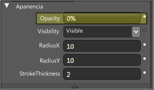

## Personalizar el comportamiento del botónCustomize the Button Behavior

En este punto, ha personalizado la presentación del botón mediante la edición de su plantilla, pero el botón no reacciona a las acciones del usuario como hacen los botones típicos (por ejemplo, cambiar la apariencia al pasar el puntero del mouse, recibir el foco y hacer clic). Los dos procedimientos siguientes muestran cómo compilar comportamientos como estos en el botón personalizado.At this point, you have customized the presentation of the button by editing its template, but the button does not react to user actions as typical buttons do (for example, changing appearance upon mouse-over, receiving focus, and clicking.) The next two procedures show how to build behaviors like these into the custom button. Comenzaremos con desencadenadores de propiedades simples y, a continuación, agregaremos desencadenadores de eventos y animaciones.We'll start with simple property triggers, and then add event triggers and animations.

### Para establecer los desencadenadores de propiedadTo set property triggers

1. **Cree un nuevo desencadenador de propiedad:** Con **glassCube** seleccionado, haga clic en **+ propiedad** en el panel **desencadenadores** (vea la figura que sigue al paso siguiente).**Create a new property trigger:** With **glassCube** selected, click **+ Property** in the **Triggers** panel (see the figure that follows the next step). Esto crea un desencadenador de propiedad con un desencadenador de propiedad predeterminado.This creates a property trigger with a default property trigger.

2. **Convierta IsMouseOver en la propiedad utilizada por el desencadenador:** Cambie la propiedad a <xref:System.Windows.UIElement.IsMouseOver%2A>.**Make IsMouseOver the property used by the trigger:** Change the property to <xref:System.Windows.UIElement.IsMouseOver%2A>. Esto hace que el desencadenador de propiedad se active cuando se `true` la propiedad <xref:System.Windows.UIElement.IsMouseOver%2A> (cuando el usuario señala el botón con el mouse).This makes the property trigger activate when the <xref:System.Windows.UIElement.IsMouseOver%2A> property is `true` (when the user points to the button with the mouse).

    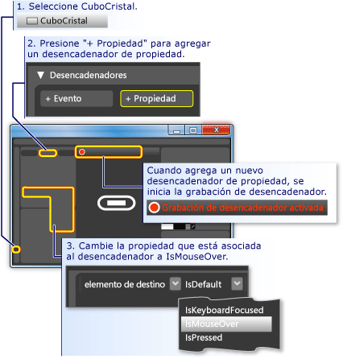

3. **IsMouseOver desencadena la opacidad del 100% para glassCube:** Observe que la **grabación del desencadenador está activada** (vea la ilustración anterior).**IsMouseOver triggers opacity of 100% for glassCube:** Notice that the **Trigger recording is on** (see the preceding figure). Esto significa que cualquier cambio que realice en los valores de propiedad de **glassCube** mientras la grabación está activado se convertirá en una acción que tiene lugar cuando se `true`<xref:System.Windows.UIElement.IsMouseOver%2A>.This means that any changes you make to the property values of **glassCube** while recording is on will become an action that takes place when <xref:System.Windows.UIElement.IsMouseOver%2A> is `true`. Durante la grabación, cambie el <xref:System.Windows.UIElement.Opacity%2A> de **glassCube** a 100%.While recording, change the <xref:System.Windows.UIElement.Opacity%2A> of **glassCube** to 100%.

    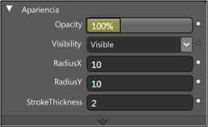

    Ahora ha creado su primer desencadenador de propiedad.You have now created your first property trigger. Observe que en el **Panel desencadenadores** del editor se ha registrado el <xref:System.Windows.UIElement.Opacity%2A> que se va a cambiar a 100%.Notice that the **Triggers panel** of the editor has recorded the <xref:System.Windows.UIElement.Opacity%2A> being changed to 100%.

    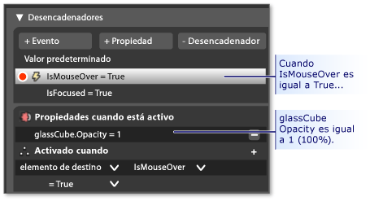

    Presione F5 para ejecutar la aplicación y mueva el puntero del mouse sobre el botón y desactívelo.Press F5 to run the application, and move the mouse pointer over and off the button. Debería ver que la capa de cristal aparece al pasar el puntero del mouse por encima del botón y desaparece cuando el puntero sale.You should see the glass layer appear when you mouse-over the button and disappear when the pointer leaves.

4. Los **desencadenadores IsMouseOver cambian el valor del trazo:** Vamos a asociar algunas otras acciones con el desencadenador de <xref:System.Windows.UIElement.IsMouseOver%2A>.**IsMouseOver triggers stroke value change:** Let's associate some other actions with the <xref:System.Windows.UIElement.IsMouseOver%2A> trigger. Mientras continúa la grabación, cambie la selección de **glassCube** a **outerRectangle**.While recording continues, switch your selection from **glassCube** to **outerRectangle**. A continuación, establezca el <xref:System.Windows.Shapes.Shape.Stroke%2A> de **outerRectangle** en la expresión personalizada de "{DynamicResource {x:Static SystemColors. HighlightBrushKey}}".Then set the <xref:System.Windows.Shapes.Shape.Stroke%2A> of **outerRectangle** to the custom expression of "{DynamicResource {x:Static SystemColors.HighlightBrushKey}}". Esto establece el <xref:System.Windows.Shapes.Shape.Stroke%2A> en el color de resaltado típico utilizado por los botones.This sets the <xref:System.Windows.Shapes.Shape.Stroke%2A> to the typical highlight color used by buttons. Presione F5 para ver el efecto al pasar el puntero sobre el botón.Press F5 to see the effect when you mouse over the button.

    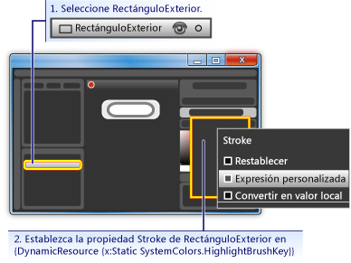

5. **IsMouseOver desencadena texto borroso:** Vamos a asociar una acción más al desencadenador de la propiedad <xref:System.Windows.UIElement.IsMouseOver%2A>.**IsMouseOver triggers blurry text:** Let's associate one more action to the <xref:System.Windows.UIElement.IsMouseOver%2A> property trigger. Haga que el contenido del botón parezca un poco borroso cuando aparezca el cristal sobre él.Make the content of the button appear a little blurry when the glass appears over it. Para ello, podemos aplicar un desenfoque <xref:System.Windows.Media.Effects.BitmapEffect> a la <xref:System.Windows.Controls.ContentPresenter> (**myContentPresenter**).To do this, we can apply a blur <xref:System.Windows.Media.Effects.BitmapEffect> to the <xref:System.Windows.Controls.ContentPresenter> (**myContentPresenter**).

    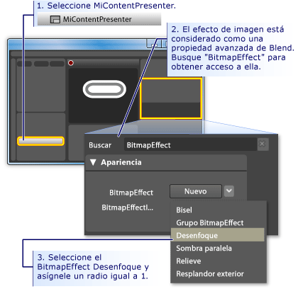

    > [!NOTE]
    > Para devolver el **panel Propiedades** a lo que estaba antes de que realizara la búsqueda <xref:System.Windows.Media.Effects.BitmapEffect>, borre el texto del **cuadro de búsqueda**.To return the **Properties panel** back to what it was before you did the search for <xref:System.Windows.Media.Effects.BitmapEffect>, clear the text from the **Search box**.

    En este punto, se ha usado un desencadenador de propiedad con varias acciones asociadas para crear el comportamiento de resaltado cuando el puntero del Mouse entra y sale del área de botón.At this point, we have used a property trigger with several associated actions to create highlighting behavior for when the mouse pointer enters and leaves the button area. Otro comportamiento típico de un botón es resaltar cuando tiene el foco (como después de hacer clic en él).Another typical behavior for a button is to highlight when it has focus (as after it is clicked). Podemos agregar este comportamiento agregando otro desencadenador de propiedad para la propiedad <xref:System.Windows.UIElement.IsFocused%2A>.We can add such behavior by adding another property trigger for the <xref:System.Windows.UIElement.IsFocused%2A> property.

6. **Crear desencadenador de propiedad para IsFocused:** Con el mismo procedimiento que para <xref:System.Windows.UIElement.IsMouseOver%2A> (vea el primer paso de esta sección), cree otro desencadenador de propiedad para la propiedad <xref:System.Windows.UIElement.IsFocused%2A>.**Create property trigger for IsFocused:** Using the same procedure as for <xref:System.Windows.UIElement.IsMouseOver%2A> (see the first step of this section), create another property trigger for the <xref:System.Windows.UIElement.IsFocused%2A> property. Mientras la **grabación del desencadenador está activada**, agregue las siguientes acciones al desencadenador:While **Trigger recording is on**, add the following actions to the trigger:

    - **glassCube** obtiene un <xref:System.Windows.UIElement.Opacity%2A> del 100%.**glassCube** gets an <xref:System.Windows.UIElement.Opacity%2A> of 100%.

    - **outerRectangle** obtiene un valor de expresión personalizada <xref:System.Windows.Shapes.Shape.Stroke%2A> de "{DynamicResource {x:Static SystemColors. HighlightBrushKey}}".**outerRectangle** gets a <xref:System.Windows.Shapes.Shape.Stroke%2A> custom expression value of "{DynamicResource {x:Static SystemColors.HighlightBrushKey}}".

Como paso final de este tutorial, agregaremos animaciones al botón.As the final step in this walkthrough, we will add animations to the button. Los eventos desencadenarán estas animaciones, en concreto, los eventos <xref:System.Windows.UIElement.MouseEnter> y <xref:System.Windows.Controls.Primitives.ButtonBase.Click>.These animations will be triggered by events—specifically, the <xref:System.Windows.UIElement.MouseEnter> and <xref:System.Windows.Controls.Primitives.ButtonBase.Click> events.

### Para usar desencadenadores de eventos y animaciones para agregar interactividadTo use event triggers and animations to add interactivity

1. **Cree un desencadenador de evento MouseEnter:** Agregue un nuevo desencadenador de eventos y seleccione <xref:System.Windows.UIElement.MouseEnter> como el evento que se va a usar en el desencadenador.**Create a MouseEnter Event Trigger:** Add a new event trigger and select <xref:System.Windows.UIElement.MouseEnter> as the event to use in the trigger.

     

2. **Cree una escala de tiempo de animación:** A continuación, asocie una escala de tiempo de animación al evento <xref:System.Windows.UIElement.MouseEnter>.**Create an animation timeline:** Next, associate an animation timeline to the <xref:System.Windows.UIElement.MouseEnter> event.

    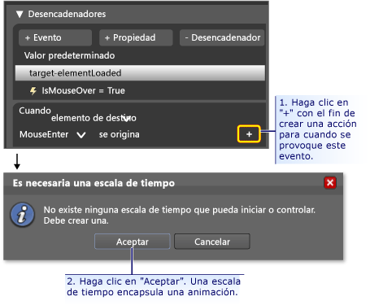

    Después de hacer clic en **Aceptar** para crear una nueva escala de tiempo, aparece un **Panel de escala** de tiempo y la "grabación de escala de tiempo está activada" está visible en el panel de diseño.After you press **OK** to create a new timeline, a **Timeline Panel** appears and "Timeline recording is on" is visible in the design panel. Esto significa que podemos empezar a grabar los cambios de propiedad en la escala de tiempo (animar los cambios de propiedad).This means we can start recording property changes in the timeline (animate property changes).

    > [!NOTE]
    > Es posible que tenga que cambiar el tamaño de la ventana o los paneles para ver la pantalla.You may need to resize your window and/or panels to see the display.

    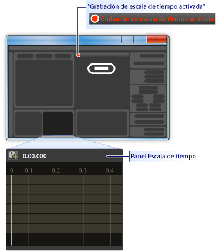

3. **Cree un fotograma clave:** Para crear una animación, seleccione el objeto que desea animar, cree dos o más fotogramas clave en la escala de tiempo y, para esos fotogramas clave, establezca los valores de propiedad entre los que desea que se interpole la animación.**Create a keyframe:** To create an animation, select the object you want to animate, create two or more keyframes on the timeline, and for those keyframes, set the property values you want the animation to interpolate between. La siguiente ilustración le guía a través de la creación de un fotograma clave.The following figure guides you through the creation of a keyframe.

    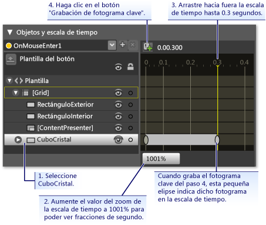

4. **Reducir glassCube en este fotograma clave:** Con el segundo fotograma clave seleccionado, reduzca el tamaño del **glassCube** al 90% de su tamaño completo con la **transformación tamaño**.**Shrink glassCube at this keyframe:** With the second keyframe selected, shrink the size of the **glassCube** to 90% of its full size using the **Size Transform**.

    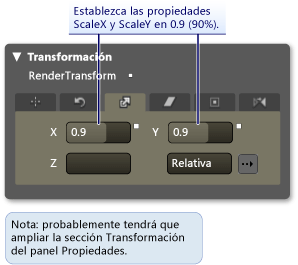

    Presione F5 para ejecutar la aplicación.Press F5 to run the application. Mueva el puntero del mouse sobre el botón.Move the mouse pointer over the button. Observe que la capa de cristal se reduce en la parte superior del botón.Notice that the glass layer shrinks on top of the button.

5. **Cree otro desencadenador de eventos y asocie una animación diferente con él:** Vamos a agregar una animación más.**Create another Event Trigger and associate a different animation with it:** Let's add one more animation. Use un procedimiento similar al que usó para crear la animación del desencadenador de evento anterior:Use a similar procedure to what you used to create the previous event trigger animation:

    1. Cree un nuevo desencadenador de eventos mediante el evento <xref:System.Windows.Controls.Primitives.ButtonBase.Click>.Create a new event trigger using the <xref:System.Windows.Controls.Primitives.ButtonBase.Click> event.

    2. Asociar una nueva escala de tiempo al evento <xref:System.Windows.Controls.Primitives.ButtonBase.Click>.Associate a new timeline with the <xref:System.Windows.Controls.Primitives.ButtonBase.Click> event.

        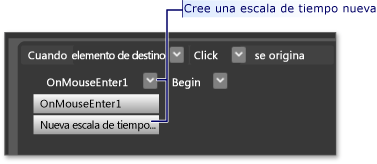

    3. Para esta escala de tiempo, cree dos fotogramas clave, uno en 0,0 segundos y el segundo en 0,3 segundos.For this timeline, create two keyframes, one at 0.0 seconds and the second one at 0.3 seconds.

    4. Con el fotograma clave en 0,3 segundos resaltado, establezca el **ángulo de giro** de la transformación en 360 grados.With the keyframe at 0.3 seconds highlighted, set the **Rotate Transform Angle** to 360 degrees.

        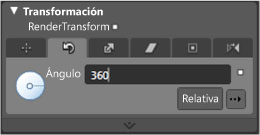

    5. Presione F5 para ejecutar la aplicación.Press F5 to run the application. Haga clic en el botón.Click the button. Observe que la capa de cristal gira en torno a.Notice that the glass layer spins around.

## ConclusiónConclusion

Ha completado un botón personalizado.You have completed a customized button. Lo hizo mediante una plantilla de botón que se aplicó a todos los botones de la aplicación.You did this using a button template that was applied to all buttons in the application. Si deja el modo de edición de plantillas (vea la ilustración siguiente) y crea más botones, verá que parecen y se comportan como su botón personalizado en lugar de como el botón predeterminado.If you leave the template editing mode (see the following figure) and create more buttons, you will see that they look and behave like your custom button rather than like the default button.

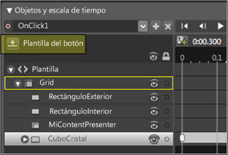

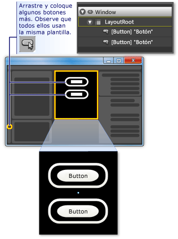

Presione F5 para ejecutar la aplicación.Press F5 to run the application. Haga clic en los botones y observe cómo se comportan de la misma manera.Click the buttons and notice how they all behave the same.

Recuerde que mientras estaba personalizando la plantilla, establezca la propiedad <xref:System.Windows.Shapes.Shape.Fill%2A> de **innerRectangle** y la propiedad <xref:System.Windows.Shapes.Shape.Stroke%2A> **outerRectangle** en el fondo de la plantilla ({fondo de TemplateBinding}).Remember that while you were customizing the template, you set the <xref:System.Windows.Shapes.Shape.Fill%2A> property of **innerRectangle** and the <xref:System.Windows.Shapes.Shape.Stroke%2A> property **outerRectangle** to the template background ({TemplateBinding Background}). Por este motivo, al establecer el color de fondo de los botones individuales, el fondo que establezca se utilizará para las propiedades correspondientes.Because of this, when you set the background color of the individual buttons, the background you set will be used for those respective properties. Intente cambiar el fondo ahora.Try changing the backgrounds now. En la siguiente ilustración, se usan degradados diferentes.In the following figure, different gradients are used. Por lo tanto, aunque una plantilla es útil para la personalización global de controles como Button, los controles con plantillas se pueden modificar para que tengan un aspecto diferente.Therefore, although a template is useful for overall customization of controls like button, controls with templates can still be modified to look different from each other.

En conclusión, en el proceso de personalización de una plantilla de botón, ha aprendido a hacer lo siguiente en Microsoft Expression Blend:In conclusion, in the process of customizing a button template you have learned how to do the following in Microsoft Expression Blend:

- Personalizar la apariencia de un control.Customize the look of a control.

- Establezca los desencadenadores de propiedad.Set property triggers. Los desencadenadores de propiedad son muy útiles, ya que se pueden usar en la mayoría de los objetos, no solo en los controles.Property triggers are very useful because they can be used on most objects, not just controls.

- Establezca desencadenadores de eventos.Set event triggers. Los desencadenadores de eventos son muy útiles, ya que se pueden usar en la mayoría de los objetos, no solo en los controles.Event triggers are very useful because they can be used on most objects, not just controls.

- Crear animaciones.Create animations.

- Varios: crear degradados, agregar BitmapEffects, usar transformaciones y establecer propiedades básicas de objetos.Miscellaneous: create gradients, add BitmapEffects, use transforms, and set basic properties of objects.

## Vea tambiénSee also

- [Crear un botón mediante el uso de XAMLCreate a Button by Using XAML](walkthrough-create-a-button-by-using-xaml.md)
- [Aplicar estilos y plantillasStyling and Templating](../../../desktop-wpf/fundamentals/styles-templates-overview.md)
- [Información general sobre animacionesAnimation Overview](../graphics-multimedia/animation-overview.md)
- [Información general sobre el dibujo con colores sólidos y degradadosPainting with Solid Colors and Gradients Overview](../graphics-multimedia/painting-with-solid-colors-and-gradients-overview.md)
- [Información general sobre efectos de imagenBitmap Effects Overview](../graphics-multimedia/bitmap-effects-overview.md)
