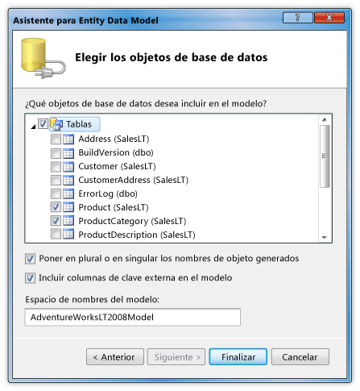

# Tutorial: Mostrar datos de una base de datos de SQL Server en un control DataGrid

En este tutorial, recuperará datos de una base de datos de SQL Server y mostrará los datos en un control <xref:System.Windows.Controls.DataGrid>. Use el Entity Framework ADO.NET para crear las clases de entidad que representan los datos y use LINQ para escribir una consulta que recupere los datos especificados de una clase de entidad.

## Prerequisites

Necesitará los componentes siguientes para completar este tutorial:

- Visual Studio.

- Acceso a una instancia en ejecución de SQL Server o SQL Server Express que tenga adjunta la base de datos de ejemplo AdventureWorks. Puede descargar la base de datos AdventureWorks desde [GitHub](https://github.com/Microsoft/sql-server-samples/releases).

## Crear clases de entidad

1. Cree un nuevo proyecto de aplicación de WPF en C#Visual Basic o y asígnele el nombre `DataGridSQLExample`.

2. En Explorador de soluciones, haga clic con el botón secundario en el proyecto, seleccione **Agregar**y, a continuación, seleccione **nuevo elemento**.

     Aparecerá el cuadro de diálogo Agregar nuevo elemento.

3. En el panel Plantillas instaladas, seleccione **datos** y, en la lista de plantillas, seleccione **ADO.NET Entity Data Model**.

     

4. Asigne un nombre al archivo `AdventureWorksModel.edmx` y, a continuación, haga clic en **Agregar**.

     Aparecerá el Asistente para Entity Data Model.

5. En la pantalla elegir contenido del modelo, seleccione **EF Designer desde base de datos** y, a continuación, haga clic en **siguiente**.

6. En la pantalla elegir la conexión de datos, proporcione la conexión a la base de datos de AdventureWorksLT2008. Para obtener más información, vea [cuadro de diálogo elegir la conexión de datos](https://docs.microsoft.com/previous-versions/dotnet/netframework-4.0/bb399244(v=vs.100)).

    Asegúrese de que el nombre es `AdventureWorksLT2008Entities` y de que la casilla **Guardar configuración de conexión de entidad en App. config como** está activada y, a continuación, haga clic en **siguiente**.

7. En la pantalla elegir los objetos de base de datos, expanda el nodo tablas y seleccione las tablas **Product** y **ProductCategory** .

     Puede generar clases de entidad para todas las tablas; sin embargo, en este ejemplo solo se recuperan datos de esas dos tablas.

     

8. Haga clic en **Finalizar**

     Las entidades Product y ProductCategory se muestran en Entity Designer.

     

## Recuperación y presentación de los datos

1. Abra el archivo MainWindow. Xaml.

2. Establezca la propiedad <xref:System.Windows.FrameworkElement.Width%2A> del <xref:System.Windows.Window> en 450.

3. En el editor XAML, agregue la siguiente etiqueta de <xref:System.Windows.Controls.DataGrid> entre las etiquetas `<Grid>` y `</Grid>` para agregar una <xref:System.Windows.Controls.DataGrid> denominada `dataGrid1`.

     [!code-xaml[DataGrid_SQL_EF_Walkthrough#3](~/samples/snippets/csharp/VS_Snippets_Wpf/DataGrid_SQL_EF_Walkthrough/CS/MainWindow.xaml#3)]

     

4. Seleccione <xref:System.Windows.Window>.

5. Con el editor de ventana Propiedades o XAML, cree un controlador de eventos para el <xref:System.Windows.Window> denominado `Window_Loaded` para el evento de <xref:System.Windows.FrameworkElement.Loaded>. Para obtener más información, vea [Cómo: crear un controlador de eventos simple](https://docs.microsoft.com/previous-versions/visualstudio/visual-studio-2010/bb675300(v=vs.100)).

     A continuación se muestra el código XAML de MainWindow. Xaml.

    > [!NOTE]
    > Si usa Visual Basic, en la primera línea de MainWindow. XAML, reemplace `x:Class="DataGridSQLExample.MainWindow"` por `x:Class="MainWindow"`.

     [!code-xaml[DataGrid_SQL_EF_Walkthrough#1](~/samples/snippets/csharp/VS_Snippets_Wpf/DataGrid_SQL_EF_Walkthrough/CS/MainWindow.xaml#1)]

6. Abra el archivo de código subyacente (MainWindow. Xaml. vb o MainWindow.xaml.cs) para el <xref:System.Windows.Window>.

7. Agregue el código siguiente para recuperar solo los valores específicos de las tablas combinadas y establecer la propiedad <xref:System.Windows.Controls.ItemsControl.ItemsSource%2A> de la <xref:System.Windows.Controls.DataGrid> en los resultados de la consulta.

     [!code-csharp[DataGrid_SQL_EF_Walkthrough#2](~/samples/snippets/csharp/VS_Snippets_Wpf/DataGrid_SQL_EF_Walkthrough/CS/MainWindow.xaml.cs#2)]
     [!code-vb[DataGrid_SQL_EF_Walkthrough#2](~/samples/snippets/visualbasic/VS_Snippets_Wpf/DataGrid_SQL_EF_Walkthrough/VB/MainWindow.xaml.vb#2)]

8. Ejecute el ejemplo.

     Debería ver un <xref:System.Windows.Controls.DataGrid> que muestra los datos.

     

## Consulte también

- <xref:System.Windows.Controls.DataGrid>
