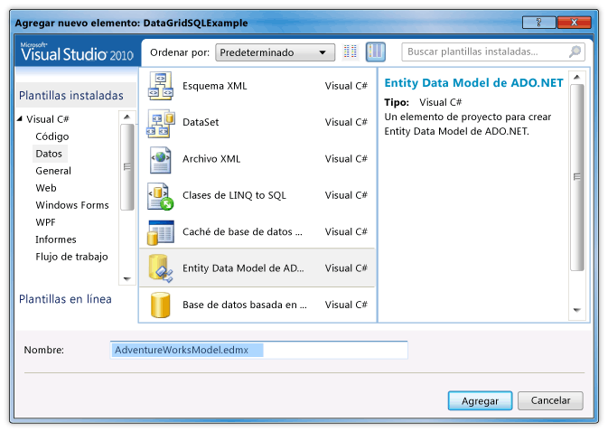
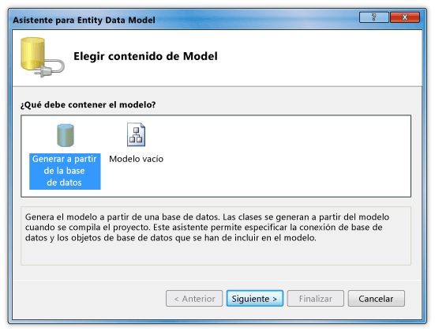
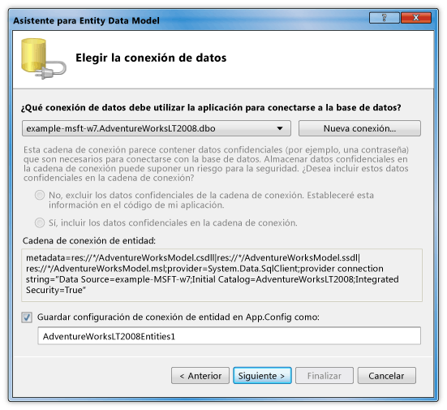

# Tutorial: Mostrar los datos de una base de datos de SQL Server en un control DataGrid
En este tutorial, recuperar datos de una base de datos de SQL Server y mostrar dichos datos en un <xref:System.Windows.Controls.DataGrid> control. Usar ADO.NET Entity Framework para crear las clases de entidad que representan los datos y usar LINQ para escribir una consulta que recupera los datos especificados de una clase de entidad.  
  
## Requisitos previos  
 Necesita los componentes siguientes para completar este tutorial:  
  
-   [!INCLUDE[vs_dev11_long](../../../../includes/vs-dev11-long-md.md)].  
  
-   Acceso a una instancia en ejecución de SQL Server o SQL Server Express que tenga adjunta la base de datos de ejemplo AdventureWorks. Puede descargar la base de datos de AdventureWorks desde el [GitHub](https://github.com/Microsoft/sql-server-samples/releases).  
  
### Para crear las clases de entidad  
  
1.  Crear un nuevo proyecto de aplicación WPF en Visual Basic o C# y asígnele el nombre `DataGridSQLExample`.  
  
2.  En el Explorador de soluciones, haga clic en el proyecto, seleccione **agregar**y, a continuación, seleccione **nuevo elemento**.  
  
     Aparecerá el cuadro de diálogo Agregar nuevo elemento.  
  
3.  En el panel Plantillas instaladas, seleccione **datos** y en la lista de plantillas, seleccione **modo de datos de entidad de ADO.NET**l.  
  
       
  
4.  Asignar nombre al archivo `AdventureWorksModel.edmx` y, a continuación, haga clic en **agregar**.  
  
     Aparecerá el Asistente para Entity Data Model.  
  
5.  En la pantalla Elegir contenido del modelo, seleccione **generar desde la base de datos** y, a continuación, haga clic en **siguiente**.  
  
       
  
6.  En la pantalla Elegir la conexión de datos, proporcione la conexión a la base de datos AdventureWorksLT2008. Para obtener más información, consulte [elija el cuadro de diálogo de conexión de datos](http://go.microsoft.com/fwlink/?LinkId=160190).  
  
       
  
7.  Asegúrese de que el nombre es `AdventureWorksLT2008Entities` y que la **Guardar configuración de conexión de entidad en App.Config como** casilla de verificación está seleccionada y, a continuación, haga clic en **siguiente**.  
  
8.  En la pantalla Elija los objetos de base de datos, expanda el nodo tablas y seleccione la **producto** y **ProductCategory** tablas.  
  
     También puede generar clases de entidad para todas las tablas; Sin embargo, en este ejemplo solo recuperar datos de esas dos tablas.  
  
       
  
9. Haga clic en **Finalizar**.  
  
     Las entidades Product y ProductCategory se muestran en el Diseñador de entidades.  
  
       
  
### Para recuperar y presentar los datos  
  
1.  Abra el archivo MainWindow.xaml.  
  
2.  Establecer el <xref:System.Windows.FrameworkElement.Width%2A> propiedad en la <xref:System.Windows.Window> a 450.  
  
3.  En el editor XAML, agregue el siguiente <xref:System.Windows.Controls.DataGrid> etiqueta entre el `<Grid>` y `</Grid>` etiquetas para agregar una <xref:System.Windows.Controls.DataGrid> denominado `dataGrid1`.  
  
     [!code-xaml[DataGrid_SQL_EF_Walkthrough#3](../../../../samples/snippets/csharp/VS_Snippets_Wpf/DataGrid_SQL_EF_Walkthrough/CS/MainWindow.xaml#3)]  
  
       
  
4.  Seleccione el control <xref:System.Windows.Window>.  
  
5.  Con la ventana Propiedades o el editor XAML, cree un controlador de eventos para el <xref:System.Windows.Window> denominado `Window_Loaded` para el <xref:System.Windows.FrameworkElement.Loaded> eventos. Para obtener más información, consulte [Cómo: crear un controlador de eventos Simple](http://msdn.microsoft.com/library/b1456e07-9dec-4354-99cf-18666b64f480).  
  
     A continuación muestra el código XAML de MainWindow.xaml.  
  
    > [!NOTE]
    >  Si utiliza Visual Basic, en la primera línea de MainWindow.xaml, reemplace `x:Class="DataGridSQLExample.MainWindow"` con `x:Class="MainWindow"`.  
  
     [!code-xaml[DataGrid_SQL_EF_Walkthrough#1](../../../../samples/snippets/csharp/VS_Snippets_Wpf/DataGrid_SQL_EF_Walkthrough/CS/MainWindow.xaml#1)]  
  
6.  Abra el archivo de código subyacente (MainWindow.xaml.vb o MainWindow.xaml.cs) para el <xref:System.Windows.Window>.  
  
7.  Agregue el código siguiente para recuperar solo los valores específicos de las tablas combinadas y establecer el <xref:System.Windows.Controls.ItemsControl.ItemsSource%2A> propiedad de la <xref:System.Windows.Controls.DataGrid> a los resultados de la consulta.  
  
     [!code-csharp[DataGrid_SQL_EF_Walkthrough#2](../../../../samples/snippets/csharp/VS_Snippets_Wpf/DataGrid_SQL_EF_Walkthrough/CS/MainWindow.xaml.cs#2)]
     [!code-vb[DataGrid_SQL_EF_Walkthrough#2](../../../../samples/snippets/visualbasic/VS_Snippets_Wpf/DataGrid_SQL_EF_Walkthrough/VB/MainWindow.xaml.vb#2)]  
  
8.  Ejecute el ejemplo.  
  
     Debería ver un <xref:System.Windows.Controls.DataGrid> que muestra los datos.  
  
       
  
## Pasos siguientes  
  
## Vea también  
 <xref:System.Windows.Controls.DataGrid>  
 [¿Cómo I: comenzar con Entity Framework en aplicaciones WPF?](http://go.microsoft.com/fwlink/?LinkId=159868)
