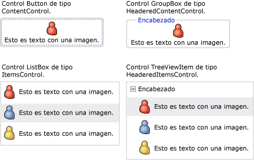
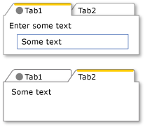
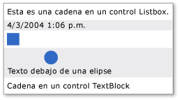

# Modelo de contenido de WPFWPF Content Model
[!INCLUDE[TLA#tla_winclient](../../../../includes/tlasharptla-winclient-md.md)] es una plataforma de presentación que proporciona muchos controles y tipos semejantes a controles cuyo propósito principal es mostrar diferentes tipos de contenido. is a presentation platform that provides many controls and control-like types whose primary purpose is to display different types of content. Para determinar qué control usar o de qué control derivar, debe entender los tipos de objetos que un control determinado puede mostrar mejor.To determine which control to use or which control to derive from, you should understand the kinds of objects a particular control can best display.  
  
 En este tema se resume el modelo de contenido para controles y tipos semejantes a controles en [!INCLUDE[TLA2#tla_winclient](../../../../includes/tla2sharptla-winclient-md.md)].This topic summarizes the content model for [!INCLUDE[TLA2#tla_winclient](../../../../includes/tla2sharptla-winclient-md.md)] control and control-like types. El modelo de contenido describe el contenido que se puede utilizar en un control.The content model describes what content can be used in a control. En este tema también se incluyen las propiedades de contenido para cada modelo de contenido.This topic also lists the content properties for each content model. Una propiedad de contenido es aquella que se utiliza para almacenar el contenido del objeto.A content property is a property that is used to store the content of the object.  
  
 
  
   
## Clases que incluyen contenido arbitrarioClasses That Contain Arbitrary Content  
 Algunos controles pueden contener un objeto de cualquier tipo, como una cadena, un <xref:System.DateTime> objeto, o un <xref:System.Windows.UIElement> que es un contenedor para elementos adicionales.Some controls can contain an object of any type, such as a string, a <xref:System.DateTime> object, or a <xref:System.Windows.UIElement> that is a container for additional items. Por ejemplo, un <xref:System.Windows.Controls.Button> puede contener una imagen y texto; o una <xref:System.Windows.Controls.CheckBox> puede contener el valor de <xref:System.DateTime.Now%2A?displayProperty=nameWithType>.For example, a <xref:System.Windows.Controls.Button> can contain an image and some text; or a <xref:System.Windows.Controls.CheckBox> can contain the value of <xref:System.DateTime.Now%2A?displayProperty=nameWithType>.  
  
 [!INCLUDE[TLA2#tla_winclient](../../../../includes/tla2sharptla-winclient-md.md)] tiene cuatro clases que pueden incluir contenido arbitrario. has four classes that can contain arbitrary content. En la tabla siguiente se enumera las clases que heredan de <xref:System.Windows.Controls.Control>.The following table lists the classes, which inherit from <xref:System.Windows.Controls.Control>.  
  
|Clase que incluye contenido arbitrarioClass that contains arbitrary content|ContenidoContent|  
|-------------------------------------------|-------------|  
|<xref:System.Windows.Controls.ContentControl>|Un único objeto arbitrario.A single arbitrary object.|  
|<xref:System.Windows.Controls.HeaderedContentControl>|Un encabezado y un único elemento; ambos son objetos arbitrarios.A header and a single item, both of which are arbitrary objects.|  
|<xref:System.Windows.Controls.ItemsControl>|Una colección de objetos arbitrarios.A collection of arbitrary objects.|  
|<xref:System.Windows.Controls.HeaderedItemsControl>|Un encabezado y una colección de elementos; todos ellos son objetos arbitrarios.A header and a collection of items, all of which are arbitrary objects.|  
  
 Los controles que heredan de estas clases pueden incluir el mismo tipo de contenido y tratarlo de la misma manera.Controls that inherit from these classes can contain the same type of content and treat the content in the same way. En la ilustración siguiente se muestra un control de cada modelo de contenido que incluye una imagen y texto.The following illustration shows one control from each content model that contains an image and some text.  
  
   
  
### Controles que incluyen un único objeto arbitrarioControls That Contain a Single Arbitrary Object  
 La <xref:System.Windows.Controls.ContentControl> clase contiene una parte única de contenido arbitrario.The <xref:System.Windows.Controls.ContentControl> class contains a single piece of arbitrary content. La propiedad content es <xref:System.Windows.Controls.ContentControl.Content%2A>.Its content property is <xref:System.Windows.Controls.ContentControl.Content%2A>. Los siguientes controles heredan de <xref:System.Windows.Controls.ContentControl> y utilizar su modelo de contenido:The following controls inherit from <xref:System.Windows.Controls.ContentControl> and use its content model:  
  
-   <xref:System.Windows.Controls.Button>  
  
-   <xref:System.Windows.Controls.Primitives.ButtonBase>  
  
-   <xref:System.Windows.Controls.CheckBox>  
  
-   <xref:System.Windows.Controls.ComboBoxItem>  
  
-   <xref:System.Windows.Controls.ContentControl>  
  
-   <xref:System.Windows.Controls.Frame>  
  
-   <xref:System.Windows.Controls.GridViewColumnHeader>  
  
-   <xref:System.Windows.Controls.GroupItem>  
  
-   <xref:System.Windows.Controls.Label>  
  
-   <xref:System.Windows.Controls.ListBoxItem>  
  
-   <xref:System.Windows.Controls.ListViewItem>  
  
-   <xref:System.Windows.Navigation.NavigationWindow>  
  
-   <xref:System.Windows.Controls.RadioButton>  
  
-   <xref:System.Windows.Controls.Primitives.RepeatButton>  
  
-   <xref:System.Windows.Controls.ScrollViewer>  
  
-   <xref:System.Windows.Controls.Primitives.StatusBarItem>  
  
-   <xref:System.Windows.Controls.Primitives.ToggleButton>  
  
-   <xref:System.Windows.Controls.ToolTip>  
  
-   <xref:System.Windows.Controls.UserControl>  
  
-   <xref:System.Windows.Window>  
  
 La siguiente ilustración muestra cuatro botones cuya <xref:System.Windows.Controls.ContentControl.Content%2A> se establece en una cadena, un <xref:System.DateTime> objeto, un <xref:System.Windows.Shapes.Rectangle>y un <xref:System.Windows.Controls.Panel> que contiene un <xref:System.Windows.Shapes.Ellipse> y <xref:System.Windows.Controls.TextBlock>.The following illustration shows four buttons whose <xref:System.Windows.Controls.ContentControl.Content%2A> is set to a string, a <xref:System.DateTime> object, a <xref:System.Windows.Shapes.Rectangle>, and a <xref:System.Windows.Controls.Panel> that contains an <xref:System.Windows.Shapes.Ellipse> and a <xref:System.Windows.Controls.TextBlock>.  
  
   
Cuatro botones con distintos tipos de contenidoFour buttons that have different types of content  
  
 Para obtener un ejemplo de cómo establecer el <xref:System.Windows.Controls.ContentControl.Content%2A> propiedad, vea <xref:System.Windows.Controls.ContentControl>.For an example of how to set the <xref:System.Windows.Controls.ContentControl.Content%2A> property, see <xref:System.Windows.Controls.ContentControl>.  
  
### Controles que incluyen un encabezado y un único objeto arbitrarioControls That Contain a Header and a Single Arbitrary Object  
 El <xref:System.Windows.Controls.HeaderedContentControl> clase hereda de <xref:System.Windows.Controls.ContentControl> y muestra el contenido con un encabezado.The <xref:System.Windows.Controls.HeaderedContentControl> class inherits from <xref:System.Windows.Controls.ContentControl> and displays content with a header. Hereda la propiedad de contenido, <xref:System.Windows.Controls.ContentControl.Content%2A>, de <xref:System.Windows.Controls.ContentControl> y define la <xref:System.Windows.Controls.HeaderedContentControl.Header%2A> propiedad que es del tipo <xref:System.Object>; por lo tanto, ambos pueden ser un objeto arbitrario.It inherits the content property, <xref:System.Windows.Controls.ContentControl.Content%2A>, from <xref:System.Windows.Controls.ContentControl> and defines the <xref:System.Windows.Controls.HeaderedContentControl.Header%2A> property that is of type <xref:System.Object>; therefore, both can be an arbitrary object.  
  
 Los siguientes controles heredan de <xref:System.Windows.Controls.HeaderedContentControl> y utilizar su modelo de contenido:The following controls inherit from <xref:System.Windows.Controls.HeaderedContentControl> and use its content model:  
  
-   <xref:System.Windows.Controls.Expander>  
  
-   <xref:System.Windows.Controls.GroupBox>  
  
-   <xref:System.Windows.Controls.TabItem>  
  
 En la siguiente ilustración se muestra dos <xref:System.Windows.Controls.TabItem> objetos.The following illustration shows two <xref:System.Windows.Controls.TabItem> objects. La primera <xref:System.Windows.Controls.TabItem> tiene <xref:System.Windows.UIElement> objetos como la <xref:System.Windows.Controls.HeaderedContentControl.Header%2A> y <xref:System.Windows.Controls.ContentControl.Content%2A>.The first <xref:System.Windows.Controls.TabItem> has <xref:System.Windows.UIElement> objects as the <xref:System.Windows.Controls.HeaderedContentControl.Header%2A> and the <xref:System.Windows.Controls.ContentControl.Content%2A>. El <xref:System.Windows.Controls.HeaderedContentControl.Header%2A> está establecido en un <xref:System.Windows.Controls.StackPanel> que contiene un <xref:System.Windows.Shapes.Ellipse> y <xref:System.Windows.Controls.TextBlock>.The <xref:System.Windows.Controls.HeaderedContentControl.Header%2A> is set to a <xref:System.Windows.Controls.StackPanel> that contains an <xref:System.Windows.Shapes.Ellipse> and a <xref:System.Windows.Controls.TextBlock>. El <xref:System.Windows.Controls.ContentControl.Content%2A> está establecido en un <xref:System.Windows.Controls.StackPanel> que contiene un <xref:System.Windows.Controls.TextBlock> y <xref:System.Windows.Controls.Label>.The <xref:System.Windows.Controls.ContentControl.Content%2A> is set to a <xref:System.Windows.Controls.StackPanel> that contains a <xref:System.Windows.Controls.TextBlock> and a <xref:System.Windows.Controls.Label>. El segundo <xref:System.Windows.Controls.TabItem> tiene una cadena el <xref:System.Windows.Controls.HeaderedContentControl.Header%2A> y un <xref:System.Windows.Controls.TextBlock> en el <xref:System.Windows.Controls.ContentControl.Content%2A>.The second <xref:System.Windows.Controls.TabItem> has a string in the <xref:System.Windows.Controls.HeaderedContentControl.Header%2A> and a <xref:System.Windows.Controls.TextBlock> in the <xref:System.Windows.Controls.ContentControl.Content%2A>.  
  
   
TabControl que usa tipos diferentes en la propiedad HeaderTabControl that uses different types in the Header property  
  
 Para obtener un ejemplo de cómo crear <xref:System.Windows.Controls.TabItem> los objetos, vea <xref:System.Windows.Controls.HeaderedContentControl>.For an example of how to create <xref:System.Windows.Controls.TabItem> objects, see <xref:System.Windows.Controls.HeaderedContentControl>.  
  
### Controles que incluyen una colección de objetos arbitrariosControls That Contain a Collection of Arbitrary Objects  
 El <xref:System.Windows.Controls.ItemsControl> clase hereda de <xref:System.Windows.Controls.Control> y puede contener varios elementos, como cadenas, objetos u otros elementos.The <xref:System.Windows.Controls.ItemsControl> class inherits from <xref:System.Windows.Controls.Control> and can contain multiple items, such as strings, objects, or other elements. Sus propiedades de contenido son <xref:System.Windows.Controls.ItemsControl.ItemsSource%2A> y <xref:System.Windows.Controls.ItemsControl.Items%2A>.Its content properties are <xref:System.Windows.Controls.ItemsControl.ItemsSource%2A> and <xref:System.Windows.Controls.ItemsControl.Items%2A>. <xref:System.Windows.Controls.ItemsControl.ItemsSource%2A> Normalmente se usa para rellenar la <xref:System.Windows.Controls.ItemsControl> con una colección de datos.<xref:System.Windows.Controls.ItemsControl.ItemsSource%2A> is typically used to populate the <xref:System.Windows.Controls.ItemsControl> with a data collection. Si no desea usar una colección para rellenar el <xref:System.Windows.Controls.ItemsControl>, puede agregar elementos mediante el <xref:System.Windows.Controls.ItemsControl.Items%2A> propiedad.If you do not want to use a collection to populate the <xref:System.Windows.Controls.ItemsControl>, you can add items by using the <xref:System.Windows.Controls.ItemsControl.Items%2A> property.  
  
 Los siguientes controles heredan de <xref:System.Windows.Controls.ItemsControl> y utilizar su modelo de contenido:The following controls inherit from <xref:System.Windows.Controls.ItemsControl> and use its content model:  
  
-   <xref:System.Windows.Controls.Menu>  
  
-   <xref:System.Windows.Controls.Primitives.MenuBase>  
  
-   <xref:System.Windows.Controls.ContextMenu>  
  
-   <xref:System.Windows.Controls.ComboBox>  
  
-   <xref:System.Windows.Controls.ItemsControl>  
  
-   <xref:System.Windows.Controls.ListBox>  
  
-   <xref:System.Windows.Controls.ListView>  
  
-   <xref:System.Windows.Controls.TabControl>  
  
-   <xref:System.Windows.Controls.TreeView>  
  
-   <xref:System.Windows.Controls.Primitives.Selector>  
  
-   <xref:System.Windows.Controls.Primitives.StatusBar>  
  
 La siguiente ilustración muestra un <xref:System.Windows.Controls.ListBox> que contiene estos tipos de elementos:The following illustration shows a <xref:System.Windows.Controls.ListBox> that contains these types of items:  
  
-   Una cadena.A string.  
  
-   Un objeto <xref:System.DateTime>.A <xref:System.DateTime> object.  
  
-   Objeto <xref:System.Windows.UIElement>.A <xref:System.Windows.UIElement>.  
  
-   A <xref:System.Windows.Controls.Panel> que contiene un <xref:System.Windows.Shapes.Ellipse> y <xref:System.Windows.Controls.TextBlock>.A <xref:System.Windows.Controls.Panel> that contains an <xref:System.Windows.Shapes.Ellipse> and a <xref:System.Windows.Controls.TextBlock>.  
  
   
ListBox con varios tipos de objetoListBox that contains multiple types of objects  
  
### Controles que incluyen un encabezado y una colección de objetos arbitrariosControls That Contain a Header and a Collection of Arbitrary Objects  
 El <xref:System.Windows.Controls.HeaderedItemsControl> clase hereda de <xref:System.Windows.Controls.ItemsControl> y pueden contener varios elementos, como cadenas, objetos, u otros elementos y un encabezado.The <xref:System.Windows.Controls.HeaderedItemsControl> class inherits from <xref:System.Windows.Controls.ItemsControl> and can contain multiple items, such as strings, objects, or other elements, and a header. Hereda el <xref:System.Windows.Controls.ItemsControl> contenido propiedades, <xref:System.Windows.Controls.ItemsControl.ItemsSource%2A>, y <xref:System.Windows.Controls.ItemsControl.Items%2A>, y define la <xref:System.Windows.Controls.HeaderedItemsControl.Header%2A> propiedad que puede ser un objeto arbitrario.It inherits the <xref:System.Windows.Controls.ItemsControl> content properties, <xref:System.Windows.Controls.ItemsControl.ItemsSource%2A>, and <xref:System.Windows.Controls.ItemsControl.Items%2A>, and it defines the <xref:System.Windows.Controls.HeaderedItemsControl.Header%2A> property that can be an arbitrary object.  
  
 Los siguientes controles heredan de <xref:System.Windows.Controls.HeaderedItemsControl> y utilizar su modelo de contenido:The following controls inherit from <xref:System.Windows.Controls.HeaderedItemsControl> and use its content model:  
  
-   <xref:System.Windows.Controls.MenuItem>  
  
-   <xref:System.Windows.Controls.ToolBar>  
  
-   <xref:System.Windows.Controls.TreeViewItem>  
  
   
## Clases que incluyen una colección de objetos UIElementClasses That Contain a Collection of UIElement Objects  
 El <xref:System.Windows.Controls.Panel> clase coloca y organiza secundarios <xref:System.Windows.UIElement> objetos.The <xref:System.Windows.Controls.Panel> class positions and arranges child <xref:System.Windows.UIElement> objects. La propiedad content es <xref:System.Windows.Controls.Panel.Children%2A>.Its content property is <xref:System.Windows.Controls.Panel.Children%2A>.  
  
 Las siguientes clases heredan de la <xref:System.Windows.Controls.Panel> clase y utilizar su modelo de contenido:The following classes inherit from the <xref:System.Windows.Controls.Panel> class and use its content model:  
  
-   <xref:System.Windows.Controls.Canvas>  
  
-   <xref:System.Windows.Controls.DockPanel>  
  
-   <xref:System.Windows.Controls.Grid>  
  
-   <xref:System.Windows.Controls.Primitives.TabPanel>  
  
-   <xref:System.Windows.Controls.Primitives.ToolBarOverflowPanel>  
  
-   <xref:System.Windows.Controls.Primitives.ToolBarPanel>  
  
-   <xref:System.Windows.Controls.Primitives.UniformGrid>  
  
-   <xref:System.Windows.Controls.StackPanel>  
  
-   <xref:System.Windows.Controls.VirtualizingPanel>  
  
-   <xref:System.Windows.Controls.VirtualizingStackPanel>  
  
-   <xref:System.Windows.Controls.WrapPanel>  
  
 Para más información, consulte [Información general sobre elementos Panel](../../../../docs/framework/wpf/controls/panels-overview.md).For more information, see [Panels Overview](../../../../docs/framework/wpf/controls/panels-overview.md).  
  
   
## Clases que afectan a la apariencia de un objeto UIElementClasses That Affect the Appearance of a UIElement  
 El <xref:System.Windows.Controls.Decorator> clase aplica efectos visuales en o en torno a un único elemento secundario <xref:System.Windows.UIElement>.The <xref:System.Windows.Controls.Decorator> class applies visual effects onto or around a single child <xref:System.Windows.UIElement>. La propiedad content es <xref:System.Windows.Controls.Decorator.Child%2A>.Its content property is <xref:System.Windows.Controls.Decorator.Child%2A>. Las siguientes clases heredan de <xref:System.Windows.Controls.Decorator> y utilizar su modelo de contenido:The following classes inherit from <xref:System.Windows.Controls.Decorator> and use its content model:  
  
-   <xref:System.Windows.Documents.AdornerDecorator>  
  
-   <xref:System.Windows.Controls.Border>  
  
-   <xref:System.Windows.Controls.Primitives.BulletDecorator>  
  
-   <xref:Microsoft.Windows.Themes.ButtonChrome>  
  
-   <xref:Microsoft.Windows.Themes.ClassicBorderDecorator>  
  
-   <xref:System.Windows.Controls.InkPresenter>  
  
-   <xref:Microsoft.Windows.Themes.ListBoxChrome>  
  
-   <xref:Microsoft.Windows.Themes.SystemDropShadowChrome>  
  
-   <xref:System.Windows.Controls.Viewbox>  
  
 La siguiente ilustración muestra un <xref:System.Windows.Controls.TextBox> que tiene (está decorado con) un <xref:System.Windows.Controls.Border> alrededor de ella.The following illustration shows a <xref:System.Windows.Controls.TextBox> that has (is decorated with) a <xref:System.Windows.Controls.Border> around it.  
  
   
TextBlock con bordeTextBlock that has a Border  
  
   
## Clases que proporcionan comentarios visuales sobre un objeto UIElementClasses That Provide Visual Feedback About a UIElement  
 La <xref:System.Windows.Documents.Adorner> clase proporciona indicaciones visuales a un usuario.The <xref:System.Windows.Documents.Adorner> class provides visual cues to a user. Por ejemplo, use un <xref:System.Windows.Documents.Adorner> para agregar controladores funcionales a los elementos o proporcionar información de estado sobre un control.For example, use an <xref:System.Windows.Documents.Adorner> to add functional handles to elements or provide state information about a control. La <xref:System.Windows.Documents.Adorner> clase proporciona un marco de trabajo para que pueda crear sus propios adornos.The <xref:System.Windows.Documents.Adorner> class provides a framework so that you can create your own adorners. [!INCLUDE[TLA2#tla_winclient](../../../../includes/tla2sharptla-winclient-md.md)] no proporciona ningún adorno implementado. does not provide any implemented adorners. Para más información, consulte [Información general sobre adornos](../../../../docs/framework/wpf/controls/adorners-overview.md).For more information, see [Adorners Overview](../../../../docs/framework/wpf/controls/adorners-overview.md).  
  
   
## Clases que permiten a los usuarios escribir textoClasses That Enable Users to Enter Text  
 WPF proporciona tres controles principales que permiten a los usuarios escribir texto.WPF provides three primary controls that enable users to enter text. Cada control muestra el texto de forma diferente.Each control displays the text differently. En la tabla siguiente, se muestran estos tres controles relacionados con el texto, sus funcionalidades cuando muestran texto y las propiedades que contienen el texto del control.The following table lists these three text-related controls, their capabilities when they display text, and their properties that contain the control's text.  
  
|ControlControl|El texto se muestra comoText is displayed as|Propiedad de contenidoContent property|  
|-------------|--------------------------|----------------------|  
|<xref:System.Windows.Controls.TextBox>|Texto sin formatoPlain text|<xref:System.Windows.Controls.TextBox.Text%2A>|  
|<xref:System.Windows.Controls.RichTextBox>|Texto con formatoFormatted text|<xref:System.Windows.Controls.RichTextBox.Document%2A>|  
|<xref:System.Windows.Controls.PasswordBox>|Texto oculto (se enmascaran los caracteres)Hidden text (characters are masked)|<xref:System.Windows.Controls.PasswordBox.Password%2A>|  
  
   
## Clases que muestran el textoClasses That Display Your Text  
 Se pueden usar varias clases para mostrar texto sin formato o con él.Several classes can be used to display plain or formatted text. Puede usar <xref:System.Windows.Controls.TextBlock> para mostrar pequeñas cantidades de texto.You can use <xref:System.Windows.Controls.TextBlock> to display small amounts of text. Si desea mostrar grandes cantidades de texto, use la <xref:System.Windows.Controls.FlowDocumentReader>, <xref:System.Windows.Controls.FlowDocumentPageViewer>, o <xref:System.Windows.Controls.FlowDocumentScrollViewer> controles.If you want to display large amounts of text, use the <xref:System.Windows.Controls.FlowDocumentReader>, <xref:System.Windows.Controls.FlowDocumentPageViewer>, or <xref:System.Windows.Controls.FlowDocumentScrollViewer> controls.  
  
 El <xref:System.Windows.Controls.TextBlock> tiene dos propiedades de contenido: <xref:System.Windows.Controls.TextBlock.Text%2A> y <xref:System.Windows.Controls.TextBlock.Inlines%2A>.The <xref:System.Windows.Controls.TextBlock> has two content properties: <xref:System.Windows.Controls.TextBlock.Text%2A> and <xref:System.Windows.Controls.TextBlock.Inlines%2A>. Cuando desea mostrar texto que usa un formato coherente, la <xref:System.Windows.Controls.TextBlock.Text%2A> propiedad suele ser la mejor opción.When you want to display text that uses consistent formatting, the <xref:System.Windows.Controls.TextBlock.Text%2A> property is often your best choice. Si tiene previsto utilizar un formato diferente en todo el texto, use la <xref:System.Windows.Controls.TextBlock.Inlines%2A> propiedad.If you plan to use different formatting throughout the text, use the <xref:System.Windows.Controls.TextBlock.Inlines%2A> property. El <xref:System.Windows.Controls.TextBlock.Inlines%2A> propiedad es una colección de <xref:System.Windows.Documents.Inline> objetos, que especifican cómo dar formato al texto.The <xref:System.Windows.Controls.TextBlock.Inlines%2A> property is a collection of <xref:System.Windows.Documents.Inline> objects, which specify how to format text.  
  
 La tabla siguiente muestra la propiedad de contenido para <xref:System.Windows.Controls.FlowDocumentReader>, <xref:System.Windows.Controls.FlowDocumentPageViewer>, y <xref:System.Windows.Controls.FlowDocumentScrollViewer> clases.The following table lists the content property for <xref:System.Windows.Controls.FlowDocumentReader>, <xref:System.Windows.Controls.FlowDocumentPageViewer>, and <xref:System.Windows.Controls.FlowDocumentScrollViewer> classes.  
  
|ControlControl|Propiedad de contenidoContent property|Tipo de propiedad de contenidoContent property type|  
|-------------|----------------------|---------------------------|  
|<xref:System.Windows.Controls.FlowDocumentPageViewer>|DocumentoDocument|<xref:System.Windows.Documents.IDocumentPaginatorSource>|  
|<xref:System.Windows.Controls.FlowDocumentReader>|DocumentoDocument|<xref:System.Windows.Documents.FlowDocument>|  
|<xref:System.Windows.Controls.FlowDocumentScrollViewer>|DocumentoDocument|<xref:System.Windows.Documents.FlowDocument>|  
  
 El <xref:System.Windows.Documents.FlowDocument> implementa la <xref:System.Windows.Documents.IDocumentPaginatorSource> interfaz; por lo tanto, todas las tres clases pueden tomar un <xref:System.Windows.Documents.FlowDocument> como contenido.The <xref:System.Windows.Documents.FlowDocument> implements the <xref:System.Windows.Documents.IDocumentPaginatorSource> interface; therefore, all three classes can take a <xref:System.Windows.Documents.FlowDocument> as content.  
  
   
## Clases que dan formato al textoClasses That Format Your Text  
 <xref:System.Windows.Documents.TextElement> y sus clases relacionadas que pueda dar formato al texto.<xref:System.Windows.Documents.TextElement> and its related classes allow you to format text. <xref:System.Windows.Documents.TextElement> objetos contienen y dar formato al texto en <xref:System.Windows.Controls.TextBlock> y <xref:System.Windows.Documents.FlowDocument> objetos.<xref:System.Windows.Documents.TextElement> objects contain and format text in <xref:System.Windows.Controls.TextBlock> and <xref:System.Windows.Documents.FlowDocument> objects. Los dos tipos principales de <xref:System.Windows.Documents.TextElement> objetos son <xref:System.Windows.Documents.Block> elementos y <xref:System.Windows.Documents.Inline> elementos.The two primary types of <xref:System.Windows.Documents.TextElement> objects are <xref:System.Windows.Documents.Block> elements and <xref:System.Windows.Documents.Inline> elements. Un <xref:System.Windows.Documents.Block> elemento representa un bloque de texto, por ejemplo, un párrafo o una lista.A <xref:System.Windows.Documents.Block> element represents a block of text, such as a paragraph or list. Un <xref:System.Windows.Documents.Inline> elemento representa una parte del texto en un bloque.An <xref:System.Windows.Documents.Inline> element represents a portion of text in a block. Muchos <xref:System.Windows.Documents.Inline> clases especifican el formato para el texto al que se aplica.Many <xref:System.Windows.Documents.Inline> classes specify formatting for the text to which they are applied. Cada <xref:System.Windows.Documents.TextElement> tiene su propio modelo de contenido.Each <xref:System.Windows.Documents.TextElement> has its own content model. Para más información, consulte [Información general sobre el modelo de contenido de TextElement](../../../../docs/framework/wpf/advanced/textelement-content-model-overview.md).For more information, see the [TextElement Content Model Overview](../../../../docs/framework/wpf/advanced/textelement-content-model-overview.md).  
  
## Vea tambiénSee Also  
 [AvanzadasAdvanced](../../../../docs/framework/wpf/advanced/index.md)
