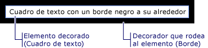

# Modelo de contenido de WPF
[!INCLUDE[TLA#tla_winclient](../../../../includes/tlasharptla-winclient-md.md)] es una plataforma de presentación que proporciona muchos controles y tipos semejantes a controles cuyo propósito principal es mostrar diferentes tipos de contenido. Para determinar qué control usar o de qué control derivar, debe entender los tipos de objetos que un control determinado puede mostrar mejor.  
  
 En este tema se resume el modelo de contenido para controles y tipos semejantes a controles en [!INCLUDE[TLA2#tla_winclient](../../../../includes/tla2sharptla-winclient-md.md)]. El modelo de contenido describe el contenido que se puede utilizar en un control. En este tema también se incluyen las propiedades de contenido para cada modelo de contenido. Una propiedad de contenido es aquella que se utiliza para almacenar el contenido del objeto.  

   
## Clases que incluyen contenido arbitrario  
 Algunos controles pueden contener un objeto de cualquier tipo, como una cadena, un objeto <xref:System.DateTime> o un <xref:System.Windows.UIElement> que sea un contenedor para elementos adicionales. Por ejemplo, un <xref:System.Windows.Controls.Button> puede contener una imagen y texto. o un <xref:System.Windows.Controls.CheckBox> puede contener el valor de <xref:System.DateTime.Now%2A?displayProperty=nameWithType>.  
  
 [!INCLUDE[TLA2#tla_winclient](../../../../includes/tla2sharptla-winclient-md.md)] tiene cuatro clases que pueden incluir contenido arbitrario. En la tabla siguiente se enumeran las clases, que heredan de <xref:System.Windows.Controls.Control>.  
  
|Clase que incluye contenido arbitrario|Contenido|  
|-------------------------------------------|-------------|  
|<xref:System.Windows.Controls.ContentControl>|Un único objeto arbitrario.|  
|<xref:System.Windows.Controls.HeaderedContentControl>|Un encabezado y un único elemento; ambos son objetos arbitrarios.|  
|<xref:System.Windows.Controls.ItemsControl>|Una colección de objetos arbitrarios.|  
|<xref:System.Windows.Controls.HeaderedItemsControl>|Un encabezado y una colección de elementos; todos ellos son objetos arbitrarios.|  
  
 Los controles que heredan de estas clases pueden incluir el mismo tipo de contenido y tratarlo de la misma manera. En la ilustración siguiente se muestra un control de cada modelo de contenido que contiene una imagen y texto:  
  
   
  
### Controles que incluyen un único objeto arbitrario  
 La clase <xref:System.Windows.Controls.ContentControl> contiene una sola parte de contenido arbitrario. Su propiedad de contenido es <xref:System.Windows.Controls.ContentControl.Content%2A>. Los siguientes controles heredan de <xref:System.Windows.Controls.ContentControl> y utilizan su modelo de contenido:  
  
- <xref:System.Windows.Controls.Button>  
  
- <xref:System.Windows.Controls.Primitives.ButtonBase>  
  
- <xref:System.Windows.Controls.CheckBox>  
  
- <xref:System.Windows.Controls.ComboBoxItem>  
  
- <xref:System.Windows.Controls.ContentControl>  
  
- <xref:System.Windows.Controls.Frame>  
  
- <xref:System.Windows.Controls.GridViewColumnHeader>  
  
- <xref:System.Windows.Controls.GroupItem>  
  
- <xref:System.Windows.Controls.Label>  
  
- <xref:System.Windows.Controls.ListBoxItem>  
  
- <xref:System.Windows.Controls.ListViewItem>  
  
- <xref:System.Windows.Navigation.NavigationWindow>  
  
- <xref:System.Windows.Controls.RadioButton>  
  
- <xref:System.Windows.Controls.Primitives.RepeatButton>  
  
- <xref:System.Windows.Controls.ScrollViewer>  
  
- <xref:System.Windows.Controls.Primitives.StatusBarItem>  
  
- <xref:System.Windows.Controls.Primitives.ToggleButton>  
  
- <xref:System.Windows.Controls.ToolTip>  
  
- <xref:System.Windows.Controls.UserControl>  
  
- <xref:System.Windows.Window>  
  
 En la siguiente ilustración se muestran cuatro botones cuyo <xref:System.Windows.Controls.ContentControl.Content%2A> está establecido en una cadena, un objeto <xref:System.DateTime>, un <xref:System.Windows.Shapes.Rectangle>y un <xref:System.Windows.Controls.Panel> que contiene un <xref:System.Windows.Shapes.Ellipse> y un <xref:System.Windows.Controls.TextBlock>:  
  
   
  
 Para obtener un ejemplo de cómo establecer la propiedad <xref:System.Windows.Controls.ContentControl.Content%2A>, vea <xref:System.Windows.Controls.ContentControl>.  
  
### Controles que incluyen un encabezado y un único objeto arbitrario  
 La clase <xref:System.Windows.Controls.HeaderedContentControl> hereda de <xref:System.Windows.Controls.ContentControl> y muestra el contenido con un encabezado. Hereda la propiedad de contenido, <xref:System.Windows.Controls.ContentControl.Content%2A>, de <xref:System.Windows.Controls.ContentControl> y define la propiedad <xref:System.Windows.Controls.HeaderedContentControl.Header%2A> que es de tipo <xref:System.Object>; por lo tanto, ambos pueden ser un objeto arbitrario.  
  
 Los siguientes controles heredan de <xref:System.Windows.Controls.HeaderedContentControl> y utilizan su modelo de contenido:  
  
- <xref:System.Windows.Controls.Expander>  
  
- <xref:System.Windows.Controls.GroupBox>  
  
- <xref:System.Windows.Controls.TabItem>  
  
 En la ilustración siguiente se muestran dos objetos <xref:System.Windows.Controls.TabItem>. La primera <xref:System.Windows.Controls.TabItem> tiene <xref:System.Windows.UIElement> objetos como <xref:System.Windows.Controls.HeaderedContentControl.Header%2A> y <xref:System.Windows.Controls.ContentControl.Content%2A>. La <xref:System.Windows.Controls.HeaderedContentControl.Header%2A> se establece en un <xref:System.Windows.Controls.StackPanel> que contiene un <xref:System.Windows.Shapes.Ellipse> y un <xref:System.Windows.Controls.TextBlock>. La <xref:System.Windows.Controls.ContentControl.Content%2A> se establece en un <xref:System.Windows.Controls.StackPanel> que contiene un <xref:System.Windows.Controls.TextBlock> y un <xref:System.Windows.Controls.Label>. El segundo <xref:System.Windows.Controls.TabItem> tiene una cadena en el <xref:System.Windows.Controls.HeaderedContentControl.Header%2A> y un <xref:System.Windows.Controls.TextBlock> en el <xref:System.Windows.Controls.ContentControl.Content%2A>.  
  
   
  
 Para obtener un ejemplo de cómo crear objetos de <xref:System.Windows.Controls.TabItem>, vea <xref:System.Windows.Controls.HeaderedContentControl>.  
  
### Controles que incluyen una colección de objetos arbitrarios  
 La clase <xref:System.Windows.Controls.ItemsControl> hereda de <xref:System.Windows.Controls.Control> y puede contener varios elementos, como cadenas, objetos u otros elementos. Sus propiedades de contenido se <xref:System.Windows.Controls.ItemsControl.ItemsSource%2A> y <xref:System.Windows.Controls.ItemsControl.Items%2A>. normalmente <xref:System.Windows.Controls.ItemsControl.ItemsSource%2A> se utiliza para rellenar el <xref:System.Windows.Controls.ItemsControl> con una colección de datos. Si no desea usar una colección para rellenar el <xref:System.Windows.Controls.ItemsControl>, puede agregar elementos mediante la propiedad <xref:System.Windows.Controls.ItemsControl.Items%2A>.  
  
 Los siguientes controles heredan de <xref:System.Windows.Controls.ItemsControl> y utilizan su modelo de contenido:  
  
- <xref:System.Windows.Controls.Menu>  
  
- <xref:System.Windows.Controls.Primitives.MenuBase>  
  
- <xref:System.Windows.Controls.ContextMenu>  
  
- <xref:System.Windows.Controls.ComboBox>  
  
- <xref:System.Windows.Controls.ItemsControl>  
  
- <xref:System.Windows.Controls.ListBox>  
  
- <xref:System.Windows.Controls.ListView>  
  
- <xref:System.Windows.Controls.TabControl>  
  
- <xref:System.Windows.Controls.TreeView>  
  
- <xref:System.Windows.Controls.Primitives.Selector>  
  
- <xref:System.Windows.Controls.Primitives.StatusBar>  
  
 En la ilustración siguiente se muestra una <xref:System.Windows.Controls.ListBox> que contiene estos tipos de elementos:  
  
- Una cadena.  
  
- Un objeto <xref:System.DateTime>.  
  
- Objeto <xref:System.Windows.UIElement>.  
  
- <xref:System.Windows.Controls.Panel> que contiene un <xref:System.Windows.Shapes.Ellipse> y un <xref:System.Windows.Controls.TextBlock>.  
  
   
  
### Controles que incluyen un encabezado y una colección de objetos arbitrarios  
 La clase <xref:System.Windows.Controls.HeaderedItemsControl> hereda de <xref:System.Windows.Controls.ItemsControl> y puede contener varios elementos, como cadenas, objetos u otros elementos, y un encabezado. Hereda las propiedades de contenido <xref:System.Windows.Controls.ItemsControl>, <xref:System.Windows.Controls.ItemsControl.ItemsSource%2A>y <xref:System.Windows.Controls.ItemsControl.Items%2A>, y define la propiedad <xref:System.Windows.Controls.HeaderedItemsControl.Header%2A> que puede ser un objeto arbitrario.  
  
 Los siguientes controles heredan de <xref:System.Windows.Controls.HeaderedItemsControl> y utilizan su modelo de contenido:  
  
- <xref:System.Windows.Controls.MenuItem>  
  
- <xref:System.Windows.Controls.ToolBar>  
  
- <xref:System.Windows.Controls.TreeViewItem>  
  
   
## Clases que incluyen una colección de objetos UIElement  
 La clase <xref:System.Windows.Controls.Panel> coloca y organiza los objetos <xref:System.Windows.UIElement> secundarios. Su propiedad de contenido es <xref:System.Windows.Controls.Panel.Children%2A>.  
  
 Las siguientes clases heredan de la clase <xref:System.Windows.Controls.Panel> y utilizan su modelo de contenido:  
  
- <xref:System.Windows.Controls.Canvas>  
  
- <xref:System.Windows.Controls.DockPanel>  
  
- <xref:System.Windows.Controls.Grid>  
  
- <xref:System.Windows.Controls.Primitives.TabPanel>  
  
- <xref:System.Windows.Controls.Primitives.ToolBarOverflowPanel>  
  
- <xref:System.Windows.Controls.Primitives.ToolBarPanel>  
  
- <xref:System.Windows.Controls.Primitives.UniformGrid>  
  
- <xref:System.Windows.Controls.StackPanel>  
  
- <xref:System.Windows.Controls.VirtualizingPanel>  
  
- <xref:System.Windows.Controls.VirtualizingStackPanel>  
  
- <xref:System.Windows.Controls.WrapPanel>  
  
 Para más información, consulte [Información general sobre elementos Panel](panels-overview.md).  
  
   
## Clases que afectan a la apariencia de un objeto UIElement  
 La clase <xref:System.Windows.Controls.Decorator> aplica efectos visuales a un solo <xref:System.Windows.UIElement>secundario o alrededor de él. Su propiedad de contenido es <xref:System.Windows.Controls.Decorator.Child%2A>. Las siguientes clases heredan de <xref:System.Windows.Controls.Decorator> y utilizan su modelo de contenido:  
  
- <xref:System.Windows.Documents.AdornerDecorator>  
  
- <xref:System.Windows.Controls.Border>  
  
- <xref:System.Windows.Controls.Primitives.BulletDecorator>  
  
- <xref:Microsoft.Windows.Themes.ButtonChrome>  
  
- <xref:Microsoft.Windows.Themes.ClassicBorderDecorator>  
  
- <xref:System.Windows.Controls.InkPresenter>  
  
- <xref:Microsoft.Windows.Themes.ListBoxChrome>  
  
- <xref:Microsoft.Windows.Themes.SystemDropShadowChrome>  
  
- <xref:System.Windows.Controls.Viewbox>  
  
 En la ilustración siguiente se muestra un <xref:System.Windows.Controls.TextBox> que tiene (se decora con) un <xref:System.Windows.Controls.Border> alrededor.  
  
   
TextBlock con borde  
  
   
## Clases que proporcionan comentarios visuales sobre un objeto UIElement  
 La clase <xref:System.Windows.Documents.Adorner> proporciona indicaciones visuales a un usuario. Por ejemplo, utilice un <xref:System.Windows.Documents.Adorner> para agregar controladores funcionales a los elementos o proporcionar información de estado sobre un control. La clase <xref:System.Windows.Documents.Adorner> proporciona un marco para que pueda crear sus propios adornos. [!INCLUDE[TLA2#tla_winclient](../../../../includes/tla2sharptla-winclient-md.md)] no proporciona ningún adorno implementado. Para más información, consulte [Información general sobre adornos](adorners-overview.md).  
  
   
## Clases que permiten a los usuarios escribir texto  
 WPF proporciona tres controles principales que permiten a los usuarios escribir texto. Cada control muestra el texto de forma diferente. En la tabla siguiente, se muestran estos tres controles relacionados con el texto, sus funcionalidades cuando muestran texto y las propiedades que contienen el texto del control.  
  
|Control|El texto se muestra como|Propiedad de contenido|  
|-------------|--------------------------|----------------------|  
|<xref:System.Windows.Controls.TextBox>|Texto sin formato|<xref:System.Windows.Controls.TextBox.Text%2A>|  
|<xref:System.Windows.Controls.RichTextBox>|Texto con formato|<xref:System.Windows.Controls.RichTextBox.Document%2A>|  
|<xref:System.Windows.Controls.PasswordBox>|Texto oculto (se enmascaran los caracteres)|<xref:System.Windows.Controls.PasswordBox.Password%2A>|  
  
   
## Clases que muestran el texto  
 Se pueden usar varias clases para mostrar texto sin formato o con él. Puede usar <xref:System.Windows.Controls.TextBlock> para mostrar pequeñas cantidades de texto. Si desea mostrar grandes cantidades de texto, utilice los controles <xref:System.Windows.Controls.FlowDocumentReader>, <xref:System.Windows.Controls.FlowDocumentPageViewer>o <xref:System.Windows.Controls.FlowDocumentScrollViewer>.  
  
 El <xref:System.Windows.Controls.TextBlock> tiene dos propiedades de contenido: <xref:System.Windows.Controls.TextBlock.Text%2A> y <xref:System.Windows.Controls.TextBlock.Inlines%2A>. Si desea mostrar texto que utiliza un formato coherente, la propiedad <xref:System.Windows.Controls.TextBlock.Text%2A> suele ser la mejor opción. Si piensa utilizar un formato diferente en todo el texto, use la propiedad <xref:System.Windows.Controls.TextBlock.Inlines%2A>. La propiedad <xref:System.Windows.Controls.TextBlock.Inlines%2A> es una colección de objetos <xref:System.Windows.Documents.Inline>, que especifican cómo dar formato al texto.  
  
 En la tabla siguiente se muestra la propiedad de contenido para las clases <xref:System.Windows.Controls.FlowDocumentReader>, <xref:System.Windows.Controls.FlowDocumentPageViewer>y <xref:System.Windows.Controls.FlowDocumentScrollViewer>.  
  
|Control|Propiedad de contenido|Tipo de propiedad de contenido|  
|-------------|----------------------|---------------------------|  
|<xref:System.Windows.Controls.FlowDocumentPageViewer>|Documento|<xref:System.Windows.Documents.IDocumentPaginatorSource>|  
|<xref:System.Windows.Controls.FlowDocumentReader>|Documento|<xref:System.Windows.Documents.FlowDocument>|  
|<xref:System.Windows.Controls.FlowDocumentScrollViewer>|Documento|<xref:System.Windows.Documents.FlowDocument>|  
  
 El <xref:System.Windows.Documents.FlowDocument> implementa la interfaz de <xref:System.Windows.Documents.IDocumentPaginatorSource>; por lo tanto, las tres clases pueden tomar un <xref:System.Windows.Documents.FlowDocument> como contenido.  
  
   
## Clases que dan formato al texto  
 <xref:System.Windows.Documents.TextElement> y sus clases relacionadas le permiten dar formato al texto. <xref:System.Windows.Documents.TextElement> objetos contienen y dan formato al texto de los objetos <xref:System.Windows.Controls.TextBlock> y <xref:System.Windows.Documents.FlowDocument>. Los dos tipos principales de objetos <xref:System.Windows.Documents.TextElement> son <xref:System.Windows.Documents.Block> elementos y <xref:System.Windows.Documents.Inline> elementos. Un elemento <xref:System.Windows.Documents.Block> representa un bloque de texto, como un párrafo o una lista. Un elemento <xref:System.Windows.Documents.Inline> representa una parte del texto de un bloque. Muchas clases de <xref:System.Windows.Documents.Inline> especifican el formato del texto al que se aplican. Cada <xref:System.Windows.Documents.TextElement> tiene su propio modelo de contenido. Para más información, consulte [Información general sobre el modelo de contenido de TextElement](../advanced/textelement-content-model-overview.md).  
  
## Vea también

- [Avanzadas](../advanced/index.md)
