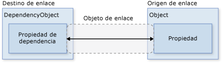
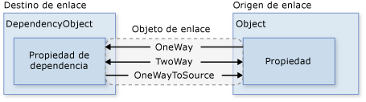
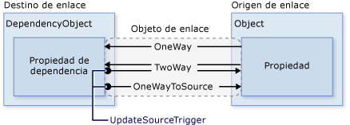
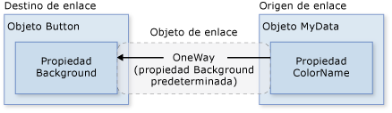
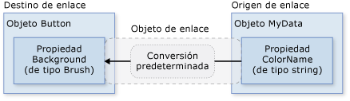
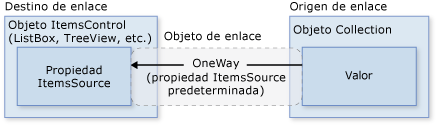

# <a name="data-binding-overview"></a><span data-ttu-id="382e6-102">Información general sobre el enlace de datos</span><span class="sxs-lookup"><span data-stu-id="382e6-102">Data Binding Overview</span></span>
<span data-ttu-id="382e6-103">El enlace de datos [!INCLUDE[TLA#tla_winclient](../../../../includes/tlasharptla-winclient-md.md)] proporciona una manera sencilla y coherente para que las aplicaciones presenten datos e interactúen con ellos.</span><span class="sxs-lookup"><span data-stu-id="382e6-103">[!INCLUDE[TLA#tla_winclient](../../../../includes/tlasharptla-winclient-md.md)] data binding provides a simple and consistent way for applications to present and interact with data.</span></span> <span data-ttu-id="382e6-104">Los elementos se pueden enlazar a datos desde una variedad de orígenes de datos en forma de objetos [!INCLUDE[TLA#tla_clr](../../../../includes/tlasharptla-clr-md.md)] y [!INCLUDE[TLA#tla_xml](../../../../includes/tlasharptla-xml-md.md)].</span><span class="sxs-lookup"><span data-stu-id="382e6-104">Elements can be bound to data from a variety of data sources in the form of [!INCLUDE[TLA#tla_clr](../../../../includes/tlasharptla-clr-md.md)] objects and [!INCLUDE[TLA#tla_xml](../../../../includes/tlasharptla-xml-md.md)].</span></span> <span data-ttu-id="382e6-105"><xref:System.Windows.Controls.ContentControl>Por ejemplo, <xref:System.Windows.Controls.Button> y <xref:System.Windows.Controls.ItemsControl>s como <xref:System.Windows.Controls.ListBox> y <xref:System.Windows.Controls.ListView> tiene funciones integradas para habilitar un estilo flexible de elementos de datos individuales o colecciones de elementos de datos.</span><span class="sxs-lookup"><span data-stu-id="382e6-105"><xref:System.Windows.Controls.ContentControl>s such as <xref:System.Windows.Controls.Button> and <xref:System.Windows.Controls.ItemsControl>s such as <xref:System.Windows.Controls.ListBox> and <xref:System.Windows.Controls.ListView> have built-in functionality to enable flexible styling of single data items or collections of data items.</span></span> <span data-ttu-id="382e6-106">Se pueden generar vistas de ordenación, filtrado ya agrupación encima de los datos.</span><span class="sxs-lookup"><span data-stu-id="382e6-106">Sort, filter, and group views can be generated on top of the data.</span></span>  
  
 <span data-ttu-id="382e6-107">La funcionalidad de enlace de datos de [!INCLUDE[TLA2#tla_winclient](../../../../includes/tla2sharptla-winclient-md.md)] presenta varias ventajas con respecto a los modelos tradicionales, como un mayor número de propiedades que admiten de forma inherente el enlace de datos, una representación flexible de los datos en la [!INCLUDE[TLA2#tla_ui](../../../../includes/tla2sharptla-ui-md.md)] y la separación bien definida de la lógica del negocio de [!INCLUDE[TLA2#tla_ui](../../../../includes/tla2sharptla-ui-md.md)].</span><span class="sxs-lookup"><span data-stu-id="382e6-107">The data binding functionality in [!INCLUDE[TLA2#tla_winclient](../../../../includes/tla2sharptla-winclient-md.md)] has several advantages over traditional models, including a broad range of properties that inherently support data binding, flexible [!INCLUDE[TLA2#tla_ui](../../../../includes/tla2sharptla-ui-md.md)] representation of data, and clean separation of business logic from [!INCLUDE[TLA2#tla_ui](../../../../includes/tla2sharptla-ui-md.md)].</span></span>  
  
 <span data-ttu-id="382e6-108">En este tema primero se explica los conceptos fundamentales para [!INCLUDE[TLA2#tla_winclient](../../../../includes/tla2sharptla-winclient-md.md)] enlace de datos y, a continuación, baje sobre el uso de la <xref:System.Windows.Data.Binding> clase y otras características de enlace de datos.</span><span class="sxs-lookup"><span data-stu-id="382e6-108">This topic first discusses concepts fundamental to [!INCLUDE[TLA2#tla_winclient](../../../../includes/tla2sharptla-winclient-md.md)] data binding and then goes into the usage of the <xref:System.Windows.Data.Binding> class and other features of data binding.</span></span>  
  
  
<a name="what_is_data_binding"></a>   
## <a name="what-is-data-binding"></a><span data-ttu-id="382e6-109">¿Qué es el enlace de datos?</span><span class="sxs-lookup"><span data-stu-id="382e6-109">What Is Data Binding?</span></span>  
 <span data-ttu-id="382e6-110">El enlace de datos es el proceso que establece una conexión entre la [!INCLUDE[TLA2#tla_ui](../../../../includes/tla2sharptla-ui-md.md)] de la aplicación y la lógica de negocios.</span><span class="sxs-lookup"><span data-stu-id="382e6-110">Data binding is the process that establishes a connection between the application [!INCLUDE[TLA2#tla_ui](../../../../includes/tla2sharptla-ui-md.md)] and business logic.</span></span> <span data-ttu-id="382e6-111">Si el enlace está configurado correctamente y los datos proporcionan las notificaciones adecuadas, al cambiar los valores de los datos, los elementos enlazados a los datos reflejarán de manera automática dichos cambios.</span><span class="sxs-lookup"><span data-stu-id="382e6-111">If the binding has the correct settings and the data provides the proper notifications, then, when the data changes its value, the elements that are bound to the data reflect changes automatically.</span></span> <span data-ttu-id="382e6-112">El enlace de datos también puede implicar la actualización automática de los datos que subyacen a una representación externa de los datos de un elemento, cuando esta representación cambia.</span><span class="sxs-lookup"><span data-stu-id="382e6-112">Data binding can also mean that if an outer representation of the data in an element changes, then the underlying data can be automatically updated to reflect the change.</span></span> <span data-ttu-id="382e6-113">Por ejemplo, si el usuario edita el valor de un <xref:System.Windows.Controls.TextBox> elemento, el valor de datos subyacente se actualiza automáticamente para reflejar ese cambio.</span><span class="sxs-lookup"><span data-stu-id="382e6-113">For example, if the user edits the value in a <xref:System.Windows.Controls.TextBox> element, the underlying data value is automatically updated to reflect that change.</span></span>  
  
 <span data-ttu-id="382e6-114">Un uso típico del enlace de datos es colocar los datos de configuración locales o de servidor en formularios o en otros controles de la [!INCLUDE[TLA2#tla_ui](../../../../includes/tla2sharptla-ui-md.md)].</span><span class="sxs-lookup"><span data-stu-id="382e6-114">A typical use of data binding is to place server or local configuration data into forms or other [!INCLUDE[TLA2#tla_ui](../../../../includes/tla2sharptla-ui-md.md)] controls.</span></span> <span data-ttu-id="382e6-115">En [!INCLUDE[TLA2#tla_winclient](../../../../includes/tla2sharptla-winclient-md.md)], este concepto se expande para incluir el enlace de un gran número de propiedades a una gran variedad de orígenes de datos.</span><span class="sxs-lookup"><span data-stu-id="382e6-115">In [!INCLUDE[TLA2#tla_winclient](../../../../includes/tla2sharptla-winclient-md.md)], this concept is expanded to include the binding of a broad range of properties to a variety of data sources.</span></span> <span data-ttu-id="382e6-116">En [!INCLUDE[TLA2#tla_winclient](../../../../includes/tla2sharptla-winclient-md.md)], las propiedades de dependencia de los elementos se pueden enlazar a objetos [!INCLUDE[TLA2#tla_clr](../../../../includes/tla2sharptla-clr-md.md)] (incluidos los objetos [!INCLUDE[TLA#tla_adonet](../../../../includes/tlasharptla-adonet-md.md)] u objetos asociados a propiedades web y servicios web) y datos [!INCLUDE[TLA2#tla_xml](../../../../includes/tla2sharptla-xml-md.md)].</span><span class="sxs-lookup"><span data-stu-id="382e6-116">In [!INCLUDE[TLA2#tla_winclient](../../../../includes/tla2sharptla-winclient-md.md)], dependency properties of elements can be bound to [!INCLUDE[TLA2#tla_clr](../../../../includes/tla2sharptla-clr-md.md)] objects (including [!INCLUDE[TLA#tla_adonet](../../../../includes/tlasharptla-adonet-md.md)] objects or objects associated with Web Services and Web properties) and [!INCLUDE[TLA2#tla_xml](../../../../includes/tla2sharptla-xml-md.md)] data.</span></span>  
  
 <span data-ttu-id="382e6-117">Para obtener un ejemplo de enlace de datos, examine la siguiente [!INCLUDE[TLA2#tla_ui](../../../../includes/tla2sharptla-ui-md.md)] de la aplicación [Data Binding Demo](http://go.microsoft.com/fwlink/?LinkID=163703):</span><span class="sxs-lookup"><span data-stu-id="382e6-117">For an example of data binding, take a look at the following application [!INCLUDE[TLA2#tla_ui](../../../../includes/tla2sharptla-ui-md.md)] from the [Data Binding Demo](http://go.microsoft.com/fwlink/?LinkID=163703):</span></span>  
  
 <span data-ttu-id="382e6-118"></span><span class="sxs-lookup"><span data-stu-id="382e6-118"></span></span>  
  
 <span data-ttu-id="382e6-119">El ejemplo anterior es la [!INCLUDE[TLA2#tla_ui](../../../../includes/tla2sharptla-ui-md.md)] de una aplicación que muestra una lista de artículos subastados.</span><span class="sxs-lookup"><span data-stu-id="382e6-119">The above is the [!INCLUDE[TLA2#tla_ui](../../../../includes/tla2sharptla-ui-md.md)] of an application that displays a list of auction items.</span></span> <span data-ttu-id="382e6-120">La aplicación muestra las características siguientes de enlace de datos:</span><span class="sxs-lookup"><span data-stu-id="382e6-120">The application demonstrates the following features of data binding:</span></span>  
  
-   <span data-ttu-id="382e6-121">El contenido de la <xref:System.Windows.Controls.ListBox> está enlazado a una colección de *AuctionItem* objetos.</span><span class="sxs-lookup"><span data-stu-id="382e6-121">The content of the <xref:System.Windows.Controls.ListBox> is bound to a collection of *AuctionItem* objects.</span></span> <span data-ttu-id="382e6-122">Un objeto *AuctionItem* tiene propiedades como *Description*, *StartPrice*, *StartDate*, *Category*, *SpecialFeatures*, etc.</span><span class="sxs-lookup"><span data-stu-id="382e6-122">An *AuctionItem* object has properties such as *Description*, *StartPrice*, *StartDate*, *Category*, *SpecialFeatures*, etc.</span></span>  
  
-   <span data-ttu-id="382e6-123">Los datos (*AuctionItem* objetos) aparece en el <xref:System.Windows.Controls.ListBox> tiene asignada una plantilla para que la descripción y el precio actual se muestran para cada elemento.</span><span class="sxs-lookup"><span data-stu-id="382e6-123">The data (*AuctionItem* objects) displayed in the <xref:System.Windows.Controls.ListBox> is templated so that the description and the current price are shown for each item.</span></span> <span data-ttu-id="382e6-124">Esto se realiza mediante un <xref:System.Windows.DataTemplate>.</span><span class="sxs-lookup"><span data-stu-id="382e6-124">This is done using a <xref:System.Windows.DataTemplate>.</span></span> <span data-ttu-id="382e6-125">Además, la apariencia de cada artículo depende del valor de *SpecialFeatures* del elemento *AuctionItem* que se muestra.</span><span class="sxs-lookup"><span data-stu-id="382e6-125">In addition, the appearance of each item depends on the *SpecialFeatures* value of the *AuctionItem* being displayed.</span></span> <span data-ttu-id="382e6-126">Si el valor de *SpecialFeatures* de *AuctionItem* es *Color*, el artículo tiene un borde azul.</span><span class="sxs-lookup"><span data-stu-id="382e6-126">If the *SpecialFeatures* value of the *AuctionItem* is *Color*, the item has a blue border.</span></span> <span data-ttu-id="382e6-127">Si el valor es *Highlight*, el artículo tiene un borde naranja y una estrella.</span><span class="sxs-lookup"><span data-stu-id="382e6-127">If the value is *Highlight*, the item has an orange border and a star.</span></span> <span data-ttu-id="382e6-128">En la sección [Plantillas de datos](#data_templating) se proporciona información sobre las plantillas de datos.</span><span class="sxs-lookup"><span data-stu-id="382e6-128">The [Data Templating](#data_templating) section provides information about data templating.</span></span>  
  
-   <span data-ttu-id="382e6-129">El usuario puede agrupar, filtrar u ordenar los datos mediante el <xref:System.Windows.Controls.CheckBox>es proporcionadas.</span><span class="sxs-lookup"><span data-stu-id="382e6-129">The user can group, filter, or sort the data using the <xref:System.Windows.Controls.CheckBox>es provided.</span></span> <span data-ttu-id="382e6-130">En la imagen anterior, "Group by category" y "Sort by category and date" <xref:System.Windows.Controls.CheckBox>es están seleccionadas.</span><span class="sxs-lookup"><span data-stu-id="382e6-130">In the image above, the "Group by category" and "Sort by category and date" <xref:System.Windows.Controls.CheckBox>es are selected.</span></span> <span data-ttu-id="382e6-131">Es posible que haya observado que los datos se agrupan en función de la categoría del producto, y el nombre de las categorías se muestra en orden alfabético.</span><span class="sxs-lookup"><span data-stu-id="382e6-131">You may have noticed that the data is grouped based on the category of the product, and the category name is in alphabetical order.</span></span> <span data-ttu-id="382e6-132">Aunque no se aprecia muy bien en la imagen, los artículos están ordenados también por fecha de inicio dentro de cada categoría.</span><span class="sxs-lookup"><span data-stu-id="382e6-132">It is difficult to notice from the image but the items are also sorted by the start date within each category.</span></span> <span data-ttu-id="382e6-133">Esto se realiza mediante una *vista de colección*.</span><span class="sxs-lookup"><span data-stu-id="382e6-133">This is done using a *collection view*.</span></span> <span data-ttu-id="382e6-134">En la sección [Enlace a colecciones](#binding_to_collections) se describen las vistas de colección.</span><span class="sxs-lookup"><span data-stu-id="382e6-134">The [Binding to Collections](#binding_to_collections) section discusses collection views.</span></span>  
  
-   <span data-ttu-id="382e6-135">Cuando el usuario selecciona un elemento, el <xref:System.Windows.Controls.ContentControl> muestra los detalles del elemento seleccionado.</span><span class="sxs-lookup"><span data-stu-id="382e6-135">When the user selects an item, the <xref:System.Windows.Controls.ContentControl> displays the details of the selected item.</span></span> <span data-ttu-id="382e6-136">Esto recibe el nombre de *escenario principal-detalle* .</span><span class="sxs-lookup"><span data-stu-id="382e6-136">This is called the *Master-Detail scenario*.</span></span> <span data-ttu-id="382e6-137">En la sección [Escenario principal-detalle](#master_detail_scenario) se proporciona información sobre este tipo de escenario de enlace.</span><span class="sxs-lookup"><span data-stu-id="382e6-137">The [Master-Detail Scenario](#master_detail_scenario) section provides information about this type of binding scenario.</span></span>  
  
-   <span data-ttu-id="382e6-138">El tipo de la *StartDate* propiedad es <xref:System.DateTime>, que devuelve una fecha que incluye el tiempo en milisegundos.</span><span class="sxs-lookup"><span data-stu-id="382e6-138">The type of the *StartDate* property is <xref:System.DateTime>, which returns a date that includes the time to the millisecond.</span></span> <span data-ttu-id="382e6-139">En esta aplicación, se ha utilizado un convertidor personalizado para que se muestre una cadena de fecha más corta.</span><span class="sxs-lookup"><span data-stu-id="382e6-139">In this application, a custom converter has been used so that a shorter date string is displayed.</span></span> <span data-ttu-id="382e6-140">En la sección [Conversión de datos](#data_conversion) se proporciona información sobre los convertidores.</span><span class="sxs-lookup"><span data-stu-id="382e6-140">The [Data Conversion](#data_conversion) section provides information about converters.</span></span>  
  
 <span data-ttu-id="382e6-141">Cuando el usuario hace clic en el botón *Add product*, se muestra el siguiente formulario:</span><span class="sxs-lookup"><span data-stu-id="382e6-141">When the user clicks the *Add Product* button, the following form comes up:</span></span>  
  
 <span data-ttu-id="382e6-142"></span><span class="sxs-lookup"><span data-stu-id="382e6-142"></span></span>  
  
 <span data-ttu-id="382e6-143">El usuario puede modificar los campos del formulario, obtener una vista previa de la lista de productos mediante la vista previa abreviada y los paneles de vista previa más detallada y, a continuación, hacer clic en *submit* para agregar la nueva lista de productos.</span><span class="sxs-lookup"><span data-stu-id="382e6-143">The user can edit the fields in the form, preview the product listing using the short preview and the more detailed preview panes, and then click *submit* to add the new product listing.</span></span> <span data-ttu-id="382e6-144">Todas las funciones de agrupación, filtrado y ordenación existentes se aplicarán a la nueva entrada.</span><span class="sxs-lookup"><span data-stu-id="382e6-144">Any existing grouping, filtering and sorting functionalities will apply to the new entry.</span></span> <span data-ttu-id="382e6-145">En este caso en concreto, el artículo especificado en la imagen anterior se mostrará como el segundo artículo dentro de la categoría *Computer*.</span><span class="sxs-lookup"><span data-stu-id="382e6-145">In this particular case, the item entered in the above image will be displayed as the second item within the *Computer* category.</span></span>  
  
 <span data-ttu-id="382e6-146">No se muestra en esta imagen es la lógica de validación que se proporcionan en el *Start Date* <xref:System.Windows.Controls.TextBox>.</span><span class="sxs-lookup"><span data-stu-id="382e6-146">Not shown in this image is the validation logic provided in the *Start Date* <xref:System.Windows.Controls.TextBox>.</span></span> <span data-ttu-id="382e6-147">Si el usuario escribe no válido fecha (un formato no válido o una fecha pasada), se notificará al usuario con un <xref:System.Windows.Controls.ToolTip> y un signo de exclamación rojo junto a la <xref:System.Windows.Controls.TextBox>.</span><span class="sxs-lookup"><span data-stu-id="382e6-147">If the user enters an invalid date (invalid formatting or a past date), the user will be notified with a <xref:System.Windows.Controls.ToolTip> and a red exclamation point next to the <xref:System.Windows.Controls.TextBox>.</span></span> <span data-ttu-id="382e6-148">En la sección [Validación de datos](#data_validation) se describe cómo crear lógica de validación.</span><span class="sxs-lookup"><span data-stu-id="382e6-148">The [Data Validation](#data_validation) section discusses how to create validation logic.</span></span>  
  
 <span data-ttu-id="382e6-149">Antes de abordar las diferentes características de enlace de datos citadas anteriormente, en la siguiente sección explicaremos los conceptos fundamentales imprescindibles para comprender el enlace de datos de [!INCLUDE[TLA2#tla_winclient](../../../../includes/tla2sharptla-winclient-md.md)].</span><span class="sxs-lookup"><span data-stu-id="382e6-149">Before going into the different features of data binding outlined above, we will first discuss in the next section the fundamental concepts that are critical to understanding [!INCLUDE[TLA2#tla_winclient](../../../../includes/tla2sharptla-winclient-md.md)] data binding.</span></span>  
  
## <a name="basic-data-binding-concepts"></a><span data-ttu-id="382e6-150">Conceptos básicos del enlace de datos</span><span class="sxs-lookup"><span data-stu-id="382e6-150">Basic Data Binding Concepts</span></span>  
  
 <span data-ttu-id="382e6-151">Independientemente del elemento que se vaya a enlazar y de la naturaleza del origen de datos, cada enlace sigue siempre el modelo que se muestra en la ilustración siguiente:</span><span class="sxs-lookup"><span data-stu-id="382e6-151">Regardless of what element you are binding and the nature of your data source, each binding always follows the model illustrated by the following figure:</span></span>  
  
 <span data-ttu-id="382e6-152"></span><span class="sxs-lookup"><span data-stu-id="382e6-152"></span></span>  
  
 <span data-ttu-id="382e6-153">Como se muestra en la ilustración anterior, el enlace de datos es esencialmente el puente entre el destino del enlace y el origen del enlace.</span><span class="sxs-lookup"><span data-stu-id="382e6-153">As illustrated by the above figure, data binding is essentially the bridge between your binding target and your binding source.</span></span> <span data-ttu-id="382e6-154">En la ilustración se muestran los siguientes conceptos fundamentales del enlace de datos de [!INCLUDE[TLA2#tla_winclient](../../../../includes/tla2sharptla-winclient-md.md)]:</span><span class="sxs-lookup"><span data-stu-id="382e6-154">The figure demonstrates the following fundamental [!INCLUDE[TLA2#tla_winclient](../../../../includes/tla2sharptla-winclient-md.md)] data binding concepts:</span></span>  
  
-   <span data-ttu-id="382e6-155">Normalmente, cada enlace tiene estos cuatro componentes: un objeto de destino del enlace, una propiedad de destino, un origen del enlace y una ruta de acceso al valor en el origen del enlace que se va a usar.</span><span class="sxs-lookup"><span data-stu-id="382e6-155">Typically, each binding has these four components: a binding target object, a target property, a binding source, and a path to the value in the binding source to use.</span></span> <span data-ttu-id="382e6-156">Por ejemplo, si desea enlazar el contenido de un <xref:System.Windows.Controls.TextBox> a la *nombre* propiedad de un *empleado* de objeto, el objeto de destino es el <xref:System.Windows.Controls.TextBox>, la propiedad de destino es el <xref:System.Windows.Controls.TextBox.Text%2A> propiedad, el valor para usar es *nombre*, y el objeto de origen es el *empleado* objeto.</span><span class="sxs-lookup"><span data-stu-id="382e6-156">For example, if you want to bind the content of a <xref:System.Windows.Controls.TextBox> to the *Name* property of an *Employee* object, your target object is the <xref:System.Windows.Controls.TextBox>, the target property is the <xref:System.Windows.Controls.TextBox.Text%2A> property, the value to use is *Name*, and the source object is the *Employee* object.</span></span>  
  
-   <span data-ttu-id="382e6-157">La propiedad de destino debe ser una propiedad de dependencia.</span><span class="sxs-lookup"><span data-stu-id="382e6-157">The target property must be a dependency property.</span></span> <span data-ttu-id="382e6-158">La mayoría <xref:System.Windows.UIElement> propiedades son propiedades de dependencia y la mayoría de las propiedades de dependencia, excepto las de solo lectura, admite el enlace de datos de forma predeterminada.</span><span class="sxs-lookup"><span data-stu-id="382e6-158">Most <xref:System.Windows.UIElement> properties are dependency properties and most dependency properties, except read-only ones, support data binding by default.</span></span> <span data-ttu-id="382e6-159">(Solo <xref:System.Windows.DependencyObject> pueden definir tipos de propiedades de dependencia y todos <xref:System.Windows.UIElement>s derivan de <xref:System.Windows.DependencyObject>.)</span><span class="sxs-lookup"><span data-stu-id="382e6-159">(Only <xref:System.Windows.DependencyObject> types can define dependency properties and all <xref:System.Windows.UIElement>s derive from <xref:System.Windows.DependencyObject>.)</span></span>  
  
-   <span data-ttu-id="382e6-160">Aunque no se especifica en la ilustración, hay que destacar que el objeto de origen de enlace no está restringido a ser un objeto [!INCLUDE[TLA2#tla_clr](../../../../includes/tla2sharptla-clr-md.md)] personalizado.</span><span class="sxs-lookup"><span data-stu-id="382e6-160">Although not specified in the figure, it should be noted that the binding source object is not restricted to being a custom [!INCLUDE[TLA2#tla_clr](../../../../includes/tla2sharptla-clr-md.md)] object.</span></span> <span data-ttu-id="382e6-161">El enlace de datos de [!INCLUDE[TLA2#tla_winclient](../../../../includes/tla2sharptla-winclient-md.md)] admite datos en forma de objetos [!INCLUDE[TLA2#tla_clr](../../../../includes/tla2sharptla-clr-md.md)] y [!INCLUDE[TLA2#tla_xml](../../../../includes/tla2sharptla-xml-md.md)].</span><span class="sxs-lookup"><span data-stu-id="382e6-161">[!INCLUDE[TLA2#tla_winclient](../../../../includes/tla2sharptla-winclient-md.md)] data binding supports data in the form of [!INCLUDE[TLA2#tla_clr](../../../../includes/tla2sharptla-clr-md.md)] objects and [!INCLUDE[TLA2#tla_xml](../../../../includes/tla2sharptla-xml-md.md)].</span></span> <span data-ttu-id="382e6-162">Para proporcionar algunos ejemplos, el origen de enlace puede ser un <xref:System.Windows.UIElement>, cualquier objeto de lista, un [!INCLUDE[TLA2#tla_clr](../../../../includes/tla2sharptla-clr-md.md)] objeto que está asociado a [!INCLUDE[TLA#tla_adonet](../../../../includes/tlasharptla-adonet-md.md)] datos o servicios Web o un valor XmlNode que contiene su [!INCLUDE[TLA2#tla_xml](../../../../includes/tla2sharptla-xml-md.md)] datos.</span><span class="sxs-lookup"><span data-stu-id="382e6-162">To provide some examples, your binding source may be a <xref:System.Windows.UIElement>, any list object, a [!INCLUDE[TLA2#tla_clr](../../../../includes/tla2sharptla-clr-md.md)] object that is associated with [!INCLUDE[TLA#tla_adonet](../../../../includes/tlasharptla-adonet-md.md)] data or Web Services, or an XmlNode that contains your [!INCLUDE[TLA2#tla_xml](../../../../includes/tla2sharptla-xml-md.md)] data.</span></span> <span data-ttu-id="382e6-163">Para más información, consulte [Binding Sources Overview](../../../../docs/framework/wpf/data/binding-sources-overview.md) (Introducción a los orígenes de enlace).</span><span class="sxs-lookup"><span data-stu-id="382e6-163">For more information, see [Binding Sources Overview](../../../../docs/framework/wpf/data/binding-sources-overview.md).</span></span>  
  
 <span data-ttu-id="382e6-164">Cuando consulte otros temas del software [!INCLUDE[TLA#tla_sdk](../../../../includes/tlasharptla-sdk-md.md)], es importante tener en cuenta que cuando establece un enlace, enlaza un destino de enlace *a* un origen de enlace.</span><span class="sxs-lookup"><span data-stu-id="382e6-164">As you read through other [!INCLUDE[TLA#tla_sdk](../../../../includes/tlasharptla-sdk-md.md)] topics, it is important to remember that when you are establishing a binding, you are binding a binding target *to* a binding source.</span></span> <span data-ttu-id="382e6-165">Por ejemplo, si se muestran algunos subyacente [!INCLUDE[TLA2#tla_xml](../../../../includes/tla2sharptla-xml-md.md)] datos en un <xref:System.Windows.Controls.ListBox> utiliza un enlace de datos, que va a enlazar la <xref:System.Windows.Controls.ListBox> a la [!INCLUDE[TLA2#tla_xml](../../../../includes/tla2sharptla-xml-md.md)] datos.</span><span class="sxs-lookup"><span data-stu-id="382e6-165">For example, if you are displaying some underlying [!INCLUDE[TLA2#tla_xml](../../../../includes/tla2sharptla-xml-md.md)] data in a <xref:System.Windows.Controls.ListBox> using data binding, you are binding your <xref:System.Windows.Controls.ListBox> to the [!INCLUDE[TLA2#tla_xml](../../../../includes/tla2sharptla-xml-md.md)] data.</span></span>  
  
 <span data-ttu-id="382e6-166">Para establecer un enlace, se utiliza la <xref:System.Windows.Data.Binding> objeto.</span><span class="sxs-lookup"><span data-stu-id="382e6-166">To establish a binding, you use the <xref:System.Windows.Data.Binding> object.</span></span> <span data-ttu-id="382e6-167">El resto de este tema describe muchos de los conceptos asociados a y algunas de las propiedades y el uso de la <xref:System.Windows.Data.Binding> objeto.</span><span class="sxs-lookup"><span data-stu-id="382e6-167">The rest of this topic discusses many of the concepts associated with and some of the properties and usage of the <xref:System.Windows.Data.Binding> object.</span></span>  
  
<a name="direction_of_data_flow"></a>   
### <a name="direction-of-the-data-flow"></a><span data-ttu-id="382e6-168">Dirección del flujo de datos</span><span class="sxs-lookup"><span data-stu-id="382e6-168">Direction of the Data Flow</span></span>  
 <span data-ttu-id="382e6-169">Como se mencionó anteriormente y como se indica en la flecha situada en la ilustración anterior, el flujo de datos de un enlace puede ir desde el destino de enlace al origen de enlace (por ejemplo, el valor de origen cambia cuando se edita el valor de un <xref:System.Windows.Controls.TextBox>) o desde el origen de enlace en el destino de enlace (por ejemplo, su <xref:System.Windows.Controls.TextBox> contenido se actualice con los cambios en el origen de enlace) si el origen de enlace proporciona la notificaciones adecuadas.</span><span class="sxs-lookup"><span data-stu-id="382e6-169">As mentioned previously and as indicated by the arrow in the figure above, the data flow of a binding can go from the binding target to the binding source (for example, the source value changes when a user edits the value of a <xref:System.Windows.Controls.TextBox>) and/or from the binding source to the binding target (for example, your <xref:System.Windows.Controls.TextBox> content gets updated with changes in the binding source) if the binding source provides the proper notifications.</span></span>  
  
 <span data-ttu-id="382e6-170">Tal vez desee que su aplicación permita que los usuarios cambien los datos y los propaguen al objeto de origen.</span><span class="sxs-lookup"><span data-stu-id="382e6-170">You may want your application to enable users to change the data and propagate it back to the source object.</span></span> <span data-ttu-id="382e6-171">O bien, no puede permitir a los usuarios actualizar los datos de origen.</span><span class="sxs-lookup"><span data-stu-id="382e6-171">Or you may not want to enable users to update the source data.</span></span> <span data-ttu-id="382e6-172">Puede controlar este comportamiento estableciendo el <xref:System.Windows.Data.Binding.Mode%2A> propiedad de su <xref:System.Windows.Data.Binding> objeto.</span><span class="sxs-lookup"><span data-stu-id="382e6-172">You can control this by setting the <xref:System.Windows.Data.Binding.Mode%2A> property of your <xref:System.Windows.Data.Binding> object.</span></span> <span data-ttu-id="382e6-173">En la ilustración siguiente se muestran los distintos tipos de flujo de datos:</span><span class="sxs-lookup"><span data-stu-id="382e6-173">The following figure illustrates the different types of data flow:</span></span>  
  
 <span data-ttu-id="382e6-174"></span><span class="sxs-lookup"><span data-stu-id="382e6-174"></span></span>  
  
-   <span data-ttu-id="382e6-175"><xref:System.Windows.Data.BindingMode.OneWay>enlace hace cambios en la propiedad de origen para actualizar automáticamente la propiedad de destino, pero los cambios en la propiedad de destino no se propagan a la propiedad de origen.</span><span class="sxs-lookup"><span data-stu-id="382e6-175"><xref:System.Windows.Data.BindingMode.OneWay> binding causes changes to the source property to automatically update the target property, but changes to the target property are not propagated back to the source property.</span></span> <span data-ttu-id="382e6-176">Este tipo de enlace es adecuado si el control que se está enlazando es implícitamente de solo lectura.</span><span class="sxs-lookup"><span data-stu-id="382e6-176">This type of binding is appropriate if the control being bound is implicitly read-only.</span></span> <span data-ttu-id="382e6-177">Por ejemplo, podría enlazar a un origen como un tablero de cotizaciones o quizás su propiedad de destino no tenga ninguna interfaz de control para realizar modificaciones, como un color de fondo enlazado a datos de una tabla.</span><span class="sxs-lookup"><span data-stu-id="382e6-177">For instance, you may bind to a source such as a stock ticker or perhaps your target property has no control interface provided for making changes, such as a data-bound background color of a table.</span></span> <span data-ttu-id="382e6-178">Si no es necesario supervisar los cambios de la propiedad de destino, el uso del modo de enlace <xref:System.Windows.Data.BindingMode.OneWay> evita la sobrecarga del modo de enlace <xref:System.Windows.Data.BindingMode.TwoWay>.</span><span class="sxs-lookup"><span data-stu-id="382e6-178">If there is no need to monitor the changes of the target property, using the <xref:System.Windows.Data.BindingMode.OneWay> binding mode avoids the overhead of the <xref:System.Windows.Data.BindingMode.TwoWay> binding mode.</span></span>  
  
-   <span data-ttu-id="382e6-179"><xref:System.Windows.Data.BindingMode.TwoWay>enlace hace cambios en la propiedad de origen o la propiedad de destino se actualice automáticamente la otra.</span><span class="sxs-lookup"><span data-stu-id="382e6-179"><xref:System.Windows.Data.BindingMode.TwoWay> binding causes changes to either the source property or the target property to automatically update the other.</span></span> <span data-ttu-id="382e6-180">Este tipo de enlace es adecuado para formularios modificables u otros escenarios [!INCLUDE[TLA2#tla_ui](../../../../includes/tla2sharptla-ui-md.md)] completamente interactivos.</span><span class="sxs-lookup"><span data-stu-id="382e6-180">This type of binding is appropriate for editable forms or other fully-interactive [!INCLUDE[TLA2#tla_ui](../../../../includes/tla2sharptla-ui-md.md)] scenarios.</span></span> <span data-ttu-id="382e6-181">Mayoría de las propiedades de forma predeterminada <xref:System.Windows.Data.BindingMode.OneWay> enlace, pero algunas propiedades de dependencia (normalmente propiedades de controles puede modificar el usuario, como el <xref:System.Windows.Controls.TextBox.Text%2A> propiedad de <xref:System.Windows.Controls.TextBox> y <xref:System.Windows.Controls.Primitives.ToggleButton.IsChecked%2A> propiedad de <xref:System.Windows.Controls.CheckBox>) predeterminado para <xref:System.Windows.Data.BindingMode.TwoWay> enlace.</span><span class="sxs-lookup"><span data-stu-id="382e6-181">Most properties default to <xref:System.Windows.Data.BindingMode.OneWay> binding, but some dependency properties (typically properties of user-editable controls such as the <xref:System.Windows.Controls.TextBox.Text%2A> property of <xref:System.Windows.Controls.TextBox> and the <xref:System.Windows.Controls.Primitives.ToggleButton.IsChecked%2A> property of <xref:System.Windows.Controls.CheckBox>) default to <xref:System.Windows.Data.BindingMode.TwoWay> binding.</span></span> <span data-ttu-id="382e6-182">Una manera de determinar mediante programación si una propiedad de dependencia se enlaza de forma predeterminada de modo unidireccional o bidireccional es obtener los metadatos de la propiedad mediante <xref:System.Windows.DependencyProperty.GetMetadata%2A> y luego comprobar el valor booleano de la propiedad <xref:System.Windows.FrameworkPropertyMetadata.BindsTwoWayByDefault%2A>.</span><span class="sxs-lookup"><span data-stu-id="382e6-182">A programmatic way to determine whether a dependency property binds one-way or two-way by default is to get the property metadata of the property using <xref:System.Windows.DependencyProperty.GetMetadata%2A> and then check the Boolean value of the <xref:System.Windows.FrameworkPropertyMetadata.BindsTwoWayByDefault%2A> property.</span></span>  
  
-   <span data-ttu-id="382e6-183"><xref:System.Windows.Data.BindingMode.OneWayToSource>es el inverso de <xref:System.Windows.Data.BindingMode.OneWay> enlace; actualiza la propiedad de origen cuando cambia la propiedad de destino.</span><span class="sxs-lookup"><span data-stu-id="382e6-183"><xref:System.Windows.Data.BindingMode.OneWayToSource> is the reverse of <xref:System.Windows.Data.BindingMode.OneWay> binding; it updates the source property when the target property changes.</span></span> <span data-ttu-id="382e6-184">Podría utilizar este tipo de enlace si, por ejemplo, solo necesita volver a evaluar el valor de origen de la [!INCLUDE[TLA2#tla_ui](../../../../includes/tla2sharptla-ui-md.md)].</span><span class="sxs-lookup"><span data-stu-id="382e6-184">One example scenario is if you only need to re-evaluate the source value from the [!INCLUDE[TLA2#tla_ui](../../../../includes/tla2sharptla-ui-md.md)].</span></span>  
  
-   <span data-ttu-id="382e6-185">No se muestra en la ilustración es <xref:System.Windows.Data.BindingMode.OneTime> enlace, lo que hace que la propiedad de origen para inicializar la propiedad de destino, pero no se propagan los cambios posteriores.</span><span class="sxs-lookup"><span data-stu-id="382e6-185">Not illustrated in the figure is <xref:System.Windows.Data.BindingMode.OneTime> binding, which causes the source property to initialize the target property, but subsequent changes do not propagate.</span></span> <span data-ttu-id="382e6-186">Esto significa que si el contexto de los datos sufre un cambio o el objeto del contexto de datos cambia, el cambio no se refleja en la propiedad de destino.</span><span class="sxs-lookup"><span data-stu-id="382e6-186">This means that if the data context undergoes a change or the object in the data context changes, then the change is not reflected in the target property.</span></span> <span data-ttu-id="382e6-187">Este tipo de enlace es adecuado si usa datos donde una instantánea del estado actual es adecuada para su uso o los datos son realmente estáticos.</span><span class="sxs-lookup"><span data-stu-id="382e6-187">This type of binding is appropriate if you are using data where either a snapshot of the current state is appropriate to use or the data is truly static.</span></span> <span data-ttu-id="382e6-188">Este tipo de enlace también es útil si quiere inicializar la propiedad de destino con algún valor de una propiedad de origen y no se conoce el contexto de datos de antemano.</span><span class="sxs-lookup"><span data-stu-id="382e6-188">This type of binding is also useful if you want to initialize your target property with some value from a source property and the data context is not known in advance.</span></span> <span data-ttu-id="382e6-189">Se trata básicamente de una forma más sencilla de enlace <xref:System.Windows.Data.BindingMode.OneWay> que ofrece un mejor rendimiento en casos donde el valor de origen no cambia.</span><span class="sxs-lookup"><span data-stu-id="382e6-189">This is essentially a simpler form of <xref:System.Windows.Data.BindingMode.OneWay> binding that provides better performance in cases where the source value does not change.</span></span>  
  
 <span data-ttu-id="382e6-190">Tenga en cuenta que para detectar los cambios del origen (aplicable a <xref:System.Windows.Data.BindingMode.OneWay> y <xref:System.Windows.Data.BindingMode.TwoWay> enlaces), el origen debe implementar un mecanismo de notificación de cambio de propiedad adecuado como <xref:System.ComponentModel.INotifyPropertyChanged>.</span><span class="sxs-lookup"><span data-stu-id="382e6-190">Note that to detect source changes (applicable to <xref:System.Windows.Data.BindingMode.OneWay> and <xref:System.Windows.Data.BindingMode.TwoWay> bindings), the source must implement a suitable property change notification mechanism such as <xref:System.ComponentModel.INotifyPropertyChanged>.</span></span> <span data-ttu-id="382e6-191">Vea [Implement Property Change Notification](../../../../docs/framework/wpf/data/how-to-implement-property-change-notification.md) para obtener un ejemplo de un <xref:System.ComponentModel.INotifyPropertyChanged> implementación.</span><span class="sxs-lookup"><span data-stu-id="382e6-191">See [Implement Property Change Notification](../../../../docs/framework/wpf/data/how-to-implement-property-change-notification.md) for an example of an <xref:System.ComponentModel.INotifyPropertyChanged> implementation.</span></span>  
  
 <span data-ttu-id="382e6-192">La <xref:System.Windows.Data.Binding.Mode%2A> página de propiedades proporciona más información sobre los modos de enlace y un ejemplo de cómo especificar la dirección de un enlace.</span><span class="sxs-lookup"><span data-stu-id="382e6-192">The <xref:System.Windows.Data.Binding.Mode%2A> property page provides more information about binding modes and an example of how to specify the direction of a binding.</span></span>  
  
<a name="what_triggers_source_updates"></a>   
### <a name="what-triggers-source-updates"></a><span data-ttu-id="382e6-193">Qué desencadena la actualización del origen</span><span class="sxs-lookup"><span data-stu-id="382e6-193">What Triggers Source Updates</span></span>  
 <span data-ttu-id="382e6-194">Enlaces que son <xref:System.Windows.Data.BindingMode.TwoWay> o <xref:System.Windows.Data.BindingMode.OneWayToSource> escucha de cambios en la propiedad de destino y propagarlos hacia el origen.</span><span class="sxs-lookup"><span data-stu-id="382e6-194">Bindings that are <xref:System.Windows.Data.BindingMode.TwoWay> or <xref:System.Windows.Data.BindingMode.OneWayToSource> listen for changes in the target property and propagate them back to the source.</span></span> <span data-ttu-id="382e6-195">Esto se conoce como el origen de la actualización.</span><span class="sxs-lookup"><span data-stu-id="382e6-195">This is known as updating the source.</span></span> <span data-ttu-id="382e6-196">Por ejemplo, puede modificar el texto de un control TextBox para cambiar el valor de origen subyacente.</span><span class="sxs-lookup"><span data-stu-id="382e6-196">For example, you may edit the text of a TextBox to change the underlying source value.</span></span> <span data-ttu-id="382e6-197">Como se describe en la última sección, la dirección del flujo de datos está determinada por el valor de la <xref:System.Windows.Data.Binding.Mode%2A> propiedad del enlace.</span><span class="sxs-lookup"><span data-stu-id="382e6-197">As described in the last section, the direction of the data flow is determined by the value of the <xref:System.Windows.Data.Binding.Mode%2A> property of the binding.</span></span>  
  
 <span data-ttu-id="382e6-198">Pero ¿se actualizará su valor de origen mientras edita el texto o después de terminar de editarlo y sacar el mouse fuera del control TextBox?</span><span class="sxs-lookup"><span data-stu-id="382e6-198">However, does your source value get updated while you are editing the text or after you finish editing the text and point your mouse away from the TextBox?</span></span> <span data-ttu-id="382e6-199">El <xref:System.Windows.Data.Binding.UpdateSourceTrigger%2A> propiedad del enlace determina qué desencadena la actualización del origen.</span><span class="sxs-lookup"><span data-stu-id="382e6-199">The <xref:System.Windows.Data.Binding.UpdateSourceTrigger%2A> property of the binding determines what triggers the update of the source.</span></span> <span data-ttu-id="382e6-200">Los puntos de las flechas derecha en la ilustración siguiente muestran la función de la <xref:System.Windows.Data.Binding.UpdateSourceTrigger%2A> propiedad:</span><span class="sxs-lookup"><span data-stu-id="382e6-200">The dots of the right arrows in the following figure illustrate the role of the <xref:System.Windows.Data.Binding.UpdateSourceTrigger%2A> property:</span></span>  
  
 <span data-ttu-id="382e6-201"></span><span class="sxs-lookup"><span data-stu-id="382e6-201"></span></span>  
  
 <span data-ttu-id="382e6-202">Si el <xref:System.Windows.Data.Binding.UpdateSourceTrigger%2A> valor es <xref:System.Windows.Data.UpdateSourceTrigger.PropertyChanged>, a continuación, el valor que señala la flecha derecha de <xref:System.Windows.Data.BindingMode.TwoWay> o <xref:System.Windows.Data.BindingMode.OneWayToSource> enlaces se actualiza en cuanto cambia la propiedad de destino.</span><span class="sxs-lookup"><span data-stu-id="382e6-202">If the <xref:System.Windows.Data.Binding.UpdateSourceTrigger%2A> value is <xref:System.Windows.Data.UpdateSourceTrigger.PropertyChanged>, then the value pointed to by the right arrow of <xref:System.Windows.Data.BindingMode.TwoWay> or the <xref:System.Windows.Data.BindingMode.OneWayToSource> bindings gets updated as soon as the target property changes.</span></span> <span data-ttu-id="382e6-203">Sin embargo, si la <xref:System.Windows.Data.Binding.UpdateSourceTrigger%2A> valor es <xref:System.Windows.Data.UpdateSourceTrigger.LostFocus>, a continuación, ese valor sólo se actualizará con el nuevo valor cuando la propiedad de destino pierde el foco.</span><span class="sxs-lookup"><span data-stu-id="382e6-203">However, if the <xref:System.Windows.Data.Binding.UpdateSourceTrigger%2A> value is <xref:System.Windows.Data.UpdateSourceTrigger.LostFocus>, then that value only gets updated with the new value when the target property loses focus.</span></span>  
  
 <span data-ttu-id="382e6-204">Similar a la <xref:System.Windows.Data.Binding.Mode%2A> propiedad, las propiedades de dependencia diferentes tienen diferentes predeterminado <xref:System.Windows.Data.Binding.UpdateSourceTrigger%2A> valores.</span><span class="sxs-lookup"><span data-stu-id="382e6-204">Similar to the <xref:System.Windows.Data.Binding.Mode%2A> property, different dependency properties have different default <xref:System.Windows.Data.Binding.UpdateSourceTrigger%2A> values.</span></span> <span data-ttu-id="382e6-205">El valor predeterminado de la mayoría de las propiedades de dependencia es <xref:System.Windows.Data.UpdateSourceTrigger.PropertyChanged>, mientras que la propiedad <xref:System.Windows.Controls.TextBox.Text%2A> tiene un valor predeterminado de <xref:System.Windows.Data.UpdateSourceTrigger.LostFocus>.</span><span class="sxs-lookup"><span data-stu-id="382e6-205">The default value for most dependency properties is <xref:System.Windows.Data.UpdateSourceTrigger.PropertyChanged>, while the <xref:System.Windows.Controls.TextBox.Text%2A> property has a default value of <xref:System.Windows.Data.UpdateSourceTrigger.LostFocus>.</span></span> <span data-ttu-id="382e6-206">Esto significa que las actualizaciones del origen suele producen cuando cambia la propiedad de destino, que es el adecuado para <xref:System.Windows.Controls.CheckBox>es y otros controles sencillos.</span><span class="sxs-lookup"><span data-stu-id="382e6-206">This means that source updates usually happen whenever the target property changes, which is fine for <xref:System.Windows.Controls.CheckBox>es and other simple controls.</span></span> <span data-ttu-id="382e6-207">Sin embargo, para los campos de texto, la actualización cada vez que se pulsa una tecla puede disminuir el rendimiento y deniega al usuario la oportunidad usual de retroceder y corregir los errores tipográficos antes confirmar el nuevo valor.</span><span class="sxs-lookup"><span data-stu-id="382e6-207">However, for text fields, updating after every keystroke can diminish performance and it denies the user the usual opportunity to backspace and fix typing errors before committing to the new value.</span></span> <span data-ttu-id="382e6-208">Por eso la <xref:System.Windows.Controls.TextBox.Text%2A> propiedad tiene un valor predeterminado de <xref:System.Windows.Data.UpdateSourceTrigger.LostFocus> en lugar de <xref:System.Windows.Data.UpdateSourceTrigger.PropertyChanged>.</span><span class="sxs-lookup"><span data-stu-id="382e6-208">That is why the <xref:System.Windows.Controls.TextBox.Text%2A> property has a default value of <xref:System.Windows.Data.UpdateSourceTrigger.LostFocus> instead of <xref:System.Windows.Data.UpdateSourceTrigger.PropertyChanged>.</span></span>  
  
 <span data-ttu-id="382e6-209">Consulte la <xref:System.Windows.Data.Binding.UpdateSourceTrigger%2A> página de propiedades para obtener información sobre cómo buscar el valor predeterminado <xref:System.Windows.Data.Binding.UpdateSourceTrigger%2A> valor de una propiedad de dependencia.</span><span class="sxs-lookup"><span data-stu-id="382e6-209">See the <xref:System.Windows.Data.Binding.UpdateSourceTrigger%2A> property page for information about how to find the default <xref:System.Windows.Data.Binding.UpdateSourceTrigger%2A> value of a dependency property.</span></span>  
  
 <span data-ttu-id="382e6-210">En la tabla siguiente proporciona un escenario de ejemplo para cada <xref:System.Windows.Data.Binding.UpdateSourceTrigger%2A> valor mediante el <xref:System.Windows.Controls.TextBox> como un ejemplo:</span><span class="sxs-lookup"><span data-stu-id="382e6-210">The following table provides an example scenario for each <xref:System.Windows.Data.Binding.UpdateSourceTrigger%2A> value using the <xref:System.Windows.Controls.TextBox> as an example:</span></span>  
  
|<span data-ttu-id="382e6-211">Valor UpdateSourceTrigger</span><span class="sxs-lookup"><span data-stu-id="382e6-211">UpdateSourceTrigger value</span></span>|<span data-ttu-id="382e6-212">Cuándo se actualiza el valor de origen</span><span class="sxs-lookup"><span data-stu-id="382e6-212">When the Source Value Gets Updated</span></span>|<span data-ttu-id="382e6-213">Escenario de ejemplo de TextBox</span><span class="sxs-lookup"><span data-stu-id="382e6-213">Example Scenario for TextBox</span></span>|  
|-------------------------------|----------------------------------------|----------------------------------|  
|<span data-ttu-id="382e6-214">LostFocus (valor predeterminado para <xref:System.Windows.Controls.TextBox.Text%2A?displayProperty=nameWithType>)</span><span class="sxs-lookup"><span data-stu-id="382e6-214">LostFocus (default for <xref:System.Windows.Controls.TextBox.Text%2A?displayProperty=nameWithType>)</span></span>|<span data-ttu-id="382e6-215">Cuando el control TextBox pierde el foco</span><span class="sxs-lookup"><span data-stu-id="382e6-215">When the TextBox control loses focus</span></span>|<span data-ttu-id="382e6-216">Un <xref:System.Windows.Controls.TextBox> que está asociado a la lógica de validación (consulte la sección de validación de datos)</span><span class="sxs-lookup"><span data-stu-id="382e6-216">A <xref:System.Windows.Controls.TextBox> that is associated with validation logic (see Data Validation section)</span></span>|  
|<span data-ttu-id="382e6-217">PropertyChanged</span><span class="sxs-lookup"><span data-stu-id="382e6-217">PropertyChanged</span></span>|<span data-ttu-id="382e6-218">A medida que escribe en el<xref:System.Windows.Controls.TextBox></span><span class="sxs-lookup"><span data-stu-id="382e6-218">As you type into the <xref:System.Windows.Controls.TextBox></span></span>|<span data-ttu-id="382e6-219"><xref:System.Windows.Controls.TextBox>controles de una ventana de salón de chat</span><span class="sxs-lookup"><span data-stu-id="382e6-219"><xref:System.Windows.Controls.TextBox> controls in a chat room window</span></span>|  
|<span data-ttu-id="382e6-220">Explicit</span><span class="sxs-lookup"><span data-stu-id="382e6-220">Explicit</span></span>|<span data-ttu-id="382e6-221">Cuando la aplicación llama<xref:System.Windows.Data.BindingExpression.UpdateSource%2A></span><span class="sxs-lookup"><span data-stu-id="382e6-221">When the application calls <xref:System.Windows.Data.BindingExpression.UpdateSource%2A></span></span>|<span data-ttu-id="382e6-222"><xref:System.Windows.Controls.TextBox>controles en un formulario modificable (actualiza los valores de origen solo cuando el usuario hace clic en el botón Enviar)</span><span class="sxs-lookup"><span data-stu-id="382e6-222"><xref:System.Windows.Controls.TextBox> controls in an editable form (updates the source values only when the user clicks the submit button)</span></span>|  
  
 <span data-ttu-id="382e6-223">Para ver un ejemplo, consulte [Controlar cuándo el texto de TextBox actualiza el origen](../../../../docs/framework/wpf/data/how-to-control-when-the-textbox-text-updates-the-source.md).</span><span class="sxs-lookup"><span data-stu-id="382e6-223">For an example, see [Control When the TextBox Text Updates the Source](../../../../docs/framework/wpf/data/how-to-control-when-the-textbox-text-updates-the-source.md).</span></span>  
  
<a name="creating_a_binding"></a>   
## <a name="creating-a-binding"></a><span data-ttu-id="382e6-224">Crear un enlace</span><span class="sxs-lookup"><span data-stu-id="382e6-224">Creating a Binding</span></span>  
  
 <span data-ttu-id="382e6-225">Para recapitulate algunos de los conceptos tratados en las secciones anteriores, establecer un enlace con el <xref:System.Windows.Data.Binding> objeto y cada enlace normalmente tiene cuatro componentes: destino, propiedad de destino, origen de enlace y una ruta de acceso de enlace con el valor de origen para usar.</span><span class="sxs-lookup"><span data-stu-id="382e6-225">To recapitulate some of the concepts discussed in the previous sections, you establish a binding using the <xref:System.Windows.Data.Binding> object, and each binding usually has four components: binding target, target property, binding source, and a path to the source value to use.</span></span> <span data-ttu-id="382e6-226">En esta sección describe cómo configurar un enlace.</span><span class="sxs-lookup"><span data-stu-id="382e6-226">This section discusses how to set up a binding.</span></span>  
  
 <span data-ttu-id="382e6-227">Considere el ejemplo siguiente, en el que el objeto de origen del enlace es una clase denominada *MyData* que se define en el espacio de nombres *SDKSample*.</span><span class="sxs-lookup"><span data-stu-id="382e6-227">Consider the following example, in which the binding source object is a class named *MyData* that is defined in the *SDKSample* namespace.</span></span> <span data-ttu-id="382e6-228">Para fines de demostración, la clase *MyData* tiene una propiedad de cadena denominada *ColorName*, cuyo valor se establece en "Red".</span><span class="sxs-lookup"><span data-stu-id="382e6-228">For demonstration purposes, *MyData* class has a string property named *ColorName*, of which the value is set to "Red".</span></span> <span data-ttu-id="382e6-229">Por lo tanto, este ejemplo genera un botón con un fondo rojo.</span><span class="sxs-lookup"><span data-stu-id="382e6-229">Thus, this example generates a button with a red background.</span></span>  
  
 [!code-xaml[BindNonTextProperty#1](../../../../samples/snippets/csharp/VS_Snippets_Wpf/BindNonTextProperty/CS/Page1.xaml#1)]  
  
 <span data-ttu-id="382e6-230">Para más información sobre la sintaxis de declaración de enlaces y ejemplos sobre cómo configurar un enlace en código, consulte [Información general sobre declaraciones de enlaces](../../../../docs/framework/wpf/data/binding-declarations-overview.md).</span><span class="sxs-lookup"><span data-stu-id="382e6-230">For more details on the binding declaration syntax and for examples of how to set up a binding in code, see [Binding Declarations Overview](../../../../docs/framework/wpf/data/binding-declarations-overview.md).</span></span>  
  
 <span data-ttu-id="382e6-231">Si aplicamos este ejemplo a nuestro diagrama básico, la ilustración resultante tendrá el siguiente aspecto.</span><span class="sxs-lookup"><span data-stu-id="382e6-231">If we apply this example to our basic diagram, the resulting figure looks like the following.</span></span> <span data-ttu-id="382e6-232">Se trata de un <xref:System.Windows.Data.BindingMode.OneWay> enlace porque la propiedad Background admite <xref:System.Windows.Data.BindingMode.OneWay> de enlace predeterminada.</span><span class="sxs-lookup"><span data-stu-id="382e6-232">This is a <xref:System.Windows.Data.BindingMode.OneWay> binding because the Background property supports <xref:System.Windows.Data.BindingMode.OneWay> binding by default.</span></span>  
  
 <span data-ttu-id="382e6-233"></span><span class="sxs-lookup"><span data-stu-id="382e6-233"></span></span>  
  
 <span data-ttu-id="382e6-234">Quizás se pregunte por qué esto funciona aunque el *ColorName* propiedad es de tipo cadena mientras el <xref:System.Windows.Controls.Control.Background%2A> propiedad es de tipo <xref:System.Windows.Media.Brush>.</span><span class="sxs-lookup"><span data-stu-id="382e6-234">You may wonder why this works even though the *ColorName* property is of type string while the <xref:System.Windows.Controls.Control.Background%2A> property is of type <xref:System.Windows.Media.Brush>.</span></span> <span data-ttu-id="382e6-235">Se ha aplicado la conversión predeterminada de tipos, que se explica en la sección [Conversión de datos](#data_conversion).</span><span class="sxs-lookup"><span data-stu-id="382e6-235">This is default type conversion at work and is discussed in the [Data Conversion](#data_conversion) section.</span></span>  
  
<a name="specifying_the_binding_source"></a>   
### <a name="specifying-the-binding-source"></a><span data-ttu-id="382e6-236">Especificación del origen de enlace</span><span class="sxs-lookup"><span data-stu-id="382e6-236">Specifying the Binding Source</span></span>  
 <span data-ttu-id="382e6-237">Observe que en el ejemplo anterior, el origen de enlace se especifica estableciendo el <xref:System.Windows.FrameworkElement.DataContext%2A> propiedad en el <xref:System.Windows.Controls.DockPanel> elemento.</span><span class="sxs-lookup"><span data-stu-id="382e6-237">Notice that in the previous example, the binding source is specified by setting the <xref:System.Windows.FrameworkElement.DataContext%2A> property on the <xref:System.Windows.Controls.DockPanel> element.</span></span> <span data-ttu-id="382e6-238">El <xref:System.Windows.Controls.Button> , a continuación, hereda la <xref:System.Windows.FrameworkElement.DataContext%2A> valor desde el <xref:System.Windows.Controls.DockPanel>, que es su elemento primario.</span><span class="sxs-lookup"><span data-stu-id="382e6-238">The <xref:System.Windows.Controls.Button> then inherits the <xref:System.Windows.FrameworkElement.DataContext%2A> value from the <xref:System.Windows.Controls.DockPanel>, which is its parent element.</span></span> <span data-ttu-id="382e6-239">Recordemos que el objeto de origen del enlace es uno de los cuatro componentes necesarios de un enlace.</span><span class="sxs-lookup"><span data-stu-id="382e6-239">To reiterate, the binding source object is one of the four necessary components of a binding.</span></span> <span data-ttu-id="382e6-240">Por tanto, si no se especifica el objeto de origen del enlace, el enlace no funcionará.</span><span class="sxs-lookup"><span data-stu-id="382e6-240">Therefore, without the binding source object being specified, the binding would do nothing.</span></span>  
  
 <span data-ttu-id="382e6-241">Hay varias formas de especificar el objeto de origen del enlace.</span><span class="sxs-lookup"><span data-stu-id="382e6-241">There are several ways to specify the binding source object.</span></span> <span data-ttu-id="382e6-242">Mediante el <xref:System.Windows.FrameworkElement.DataContext%2A> propiedad en un elemento primario es útil cuando se va a enlazar varias propiedades al mismo origen.</span><span class="sxs-lookup"><span data-stu-id="382e6-242">Using the <xref:System.Windows.FrameworkElement.DataContext%2A> property on a parent element is useful when you are binding multiple properties to the same source.</span></span> <span data-ttu-id="382e6-243">Sin embargo, a veces puede ser más adecuado especificar el origen del enlace en declaraciones de enlace individuales.</span><span class="sxs-lookup"><span data-stu-id="382e6-243">However, sometimes it may be more appropriate to specify the binding source on individual binding declarations.</span></span> <span data-ttu-id="382e6-244">En el ejemplo anterior, en lugar de utilizar el <xref:System.Windows.FrameworkElement.DataContext%2A> propiedad, puede especificar el origen de enlace estableciendo el <xref:System.Windows.Data.Binding.Source%2A> propiedad directamente en la declaración de enlace del botón, como en el ejemplo siguiente:</span><span class="sxs-lookup"><span data-stu-id="382e6-244">For the previous example, instead of using the <xref:System.Windows.FrameworkElement.DataContext%2A> property, you can specify the binding source by setting the <xref:System.Windows.Data.Binding.Source%2A> property directly on the binding declaration of the button, as in the following example:</span></span>  
  
 [!code-xaml[BindNonTextProperty#BackgroundBindingCompact](../../../../samples/snippets/csharp/VS_Snippets_Wpf/BindNonTextProperty/CS/Page2.xaml#backgroundbindingcompact)]  
  
 <span data-ttu-id="382e6-245">Distinto de establecer el <xref:System.Windows.FrameworkElement.DataContext%2A> propiedad en un elemento directamente, heredan el <xref:System.Windows.FrameworkElement.DataContext%2A> valor de un antecesor (por ejemplo, el botón en el primer ejemplo) y especificar explícitamente el origen de enlace estableciendo el <xref:System.Windows.Data.Binding.Source%2A> propiedad en el <xref:System.Windows.Data.Binding> (por ejemplo, el botón del último ejemplo), también puede usar el <xref:System.Windows.Data.Binding.ElementName%2A> propiedad o <xref:System.Windows.Data.Binding.RelativeSource%2A> propiedad para especificar el origen de enlace.</span><span class="sxs-lookup"><span data-stu-id="382e6-245">Other than setting the <xref:System.Windows.FrameworkElement.DataContext%2A> property on an element directly, inheriting the <xref:System.Windows.FrameworkElement.DataContext%2A> value from an ancestor (such as the button in the first example), and explicitly specifying the binding source by setting the <xref:System.Windows.Data.Binding.Source%2A> property on the <xref:System.Windows.Data.Binding> (such as the button the last example), you can also use the <xref:System.Windows.Data.Binding.ElementName%2A> property or the <xref:System.Windows.Data.Binding.RelativeSource%2A> property to specify the binding source.</span></span> <span data-ttu-id="382e6-246">El <xref:System.Windows.Data.Binding.ElementName%2A> propiedad es útil cuando se va a enlazar a otros elementos de la aplicación, como cuando se utiliza un control deslizante para ajustar el ancho de un botón.</span><span class="sxs-lookup"><span data-stu-id="382e6-246">The <xref:System.Windows.Data.Binding.ElementName%2A> property is useful when you are binding to other elements in your application, such as when you are using a slider to adjust the width of a button.</span></span> <span data-ttu-id="382e6-247">El <xref:System.Windows.Data.Binding.RelativeSource%2A> propiedad es útil cuando el enlace se especifica en un <xref:System.Windows.Controls.ControlTemplate> o <xref:System.Windows.Style>.</span><span class="sxs-lookup"><span data-stu-id="382e6-247">The <xref:System.Windows.Data.Binding.RelativeSource%2A> property is useful when the binding is specified in a <xref:System.Windows.Controls.ControlTemplate> or a <xref:System.Windows.Style>.</span></span> <span data-ttu-id="382e6-248">Para más información, consulte [Especificación del origen de enlace](../../../../docs/framework/wpf/data/how-to-specify-the-binding-source.md).</span><span class="sxs-lookup"><span data-stu-id="382e6-248">For more information, see [Specify the Binding Source](../../../../docs/framework/wpf/data/how-to-specify-the-binding-source.md).</span></span>  
  
<a name="specifying_the_path_to_the_value"></a>   
### <a name="specifying-the-path-to-the-value"></a><span data-ttu-id="382e6-249">Especificación de la ruta de acceso al valor</span><span class="sxs-lookup"><span data-stu-id="382e6-249">Specifying the Path to the Value</span></span>  
 <span data-ttu-id="382e6-250">Si el origen de enlace es un objeto, utilice el <xref:System.Windows.Data.Binding.Path%2A> propiedad para especificar el valor que se usará para el enlace.</span><span class="sxs-lookup"><span data-stu-id="382e6-250">If your binding source is an object, you use the <xref:System.Windows.Data.Binding.Path%2A> property to specify the value to use for your binding.</span></span> <span data-ttu-id="382e6-251">Si va a enlazar a [!INCLUDE[TLA2#tla_xml](../../../../includes/tla2sharptla-xml-md.md)] datos, use la <xref:System.Windows.Data.Binding.XPath%2A> propiedad para especificar el valor.</span><span class="sxs-lookup"><span data-stu-id="382e6-251">If you are binding to [!INCLUDE[TLA2#tla_xml](../../../../includes/tla2sharptla-xml-md.md)] data, you use the <xref:System.Windows.Data.Binding.XPath%2A> property to specify the value.</span></span> <span data-ttu-id="382e6-252">En algunos casos, puede ser aplicable a usar el <xref:System.Windows.Data.Binding.Path%2A> propiedad incluso si los datos [!INCLUDE[TLA2#tla_xml](../../../../includes/tla2sharptla-xml-md.md)].</span><span class="sxs-lookup"><span data-stu-id="382e6-252">In some cases, it may be applicable to use the <xref:System.Windows.Data.Binding.Path%2A> property even when your data is [!INCLUDE[TLA2#tla_xml](../../../../includes/tla2sharptla-xml-md.md)].</span></span> <span data-ttu-id="382e6-253">Por ejemplo, si desea tener acceso a la propiedad Name de un XmlNode devuelto (como resultado de una consulta XPath), debe utilizar el <xref:System.Windows.Data.Binding.Path%2A> propiedad además el <xref:System.Windows.Data.Binding.XPath%2A> propiedad.</span><span class="sxs-lookup"><span data-stu-id="382e6-253">For example, if you want to access the Name property of a returned XmlNode (as a result of an XPath query), you should use the <xref:System.Windows.Data.Binding.Path%2A> property in addition to the <xref:System.Windows.Data.Binding.XPath%2A> property.</span></span>  
  
 <span data-ttu-id="382e6-254">Para obtener información sobre la sintaxis y ejemplos, vea el <xref:System.Windows.Data.Binding.Path%2A> y <xref:System.Windows.Data.Binding.XPath%2A> páginas de propiedades.</span><span class="sxs-lookup"><span data-stu-id="382e6-254">For syntax information and examples, see the <xref:System.Windows.Data.Binding.Path%2A> and <xref:System.Windows.Data.Binding.XPath%2A> property pages.</span></span>  
  
 <span data-ttu-id="382e6-255">Tenga en cuenta que aunque hemos recalcado que el <xref:System.Windows.Data.Binding.Path%2A> con el valor para usar es uno de los cuatro componentes necesarios de un enlace, en los escenarios que se desea enlazar a un objeto completo, el valor para usar sería el mismo que el objeto de origen de enlace.</span><span class="sxs-lookup"><span data-stu-id="382e6-255">Note that although we have emphasized that the <xref:System.Windows.Data.Binding.Path%2A> to the value to use is one of the four necessary components of a binding, in the scenarios which you want to bind to an entire object, the value to use would be the same as the binding source object.</span></span> <span data-ttu-id="382e6-256">En esos casos, es aplicable para no especificar un <xref:System.Windows.Data.Binding.Path%2A>.</span><span class="sxs-lookup"><span data-stu-id="382e6-256">In those cases, it is applicable to not specify a <xref:System.Windows.Data.Binding.Path%2A>.</span></span> <span data-ttu-id="382e6-257">Considere el ejemplo siguiente:</span><span class="sxs-lookup"><span data-stu-id="382e6-257">Consider the following example:</span></span>  
  
 [!code-xaml[MasterDetail#EmptyBinding](../../../../samples/snippets/csharp/VS_Snippets_Wpf/MasterDetail/CSharp/Page1.xaml#emptybinding)]  
  
 <span data-ttu-id="382e6-258">En el ejemplo anterior se utiliza la sintaxis de enlace vacía: {Binding}.</span><span class="sxs-lookup"><span data-stu-id="382e6-258">The above example uses the empty binding syntax: {Binding}.</span></span> <span data-ttu-id="382e6-259">En este caso, el <xref:System.Windows.Controls.ListBox> hereda el objeto DataContext de un elemento de DockPanel primario (no se muestra en este ejemplo).</span><span class="sxs-lookup"><span data-stu-id="382e6-259">In this case, the <xref:System.Windows.Controls.ListBox> inherits the DataContext from a parent DockPanel element (not shown in this example).</span></span> <span data-ttu-id="382e6-260">Cuando no se especifica la ruta de acceso, el valor predeterminado es enlazar al objeto completo.</span><span class="sxs-lookup"><span data-stu-id="382e6-260">When the path is not specified, the default is to bind to the entire object.</span></span> <span data-ttu-id="382e6-261">En otras palabras, en este ejemplo, la ruta de acceso se ha omitido porque estamos enlazando la <xref:System.Windows.Controls.ItemsControl.ItemsSource%2A> propiedad al objeto completo.</span><span class="sxs-lookup"><span data-stu-id="382e6-261">In other words, in this example, the path has been left out because we are binding the <xref:System.Windows.Controls.ItemsControl.ItemsSource%2A> property to the entire object.</span></span> <span data-ttu-id="382e6-262">(Consulte la sección [Enlace a colecciones](#binding_to_collections) para obtener información detallada).</span><span class="sxs-lookup"><span data-stu-id="382e6-262">(See the [Binding to Collections](#binding_to_collections) section for an in-depth discussion.)</span></span>  
  
 <span data-ttu-id="382e6-263">Además del enlace a una colección, este escenario es útil también cuando se desea enlazar a un objeto completo en lugar de simplemente a una propiedad individual de un objeto.</span><span class="sxs-lookup"><span data-stu-id="382e6-263">Other than binding to a collection, this scenario is also useful when you want to bind to an entire object instead of just a single property of an object.</span></span> <span data-ttu-id="382e6-264">Por ejemplo, si el objeto de origen es de tipo string y simplemente desea enlazar a la propia cadena.</span><span class="sxs-lookup"><span data-stu-id="382e6-264">For example, if your source object is of type string and you simply want to bind to the string itself.</span></span> <span data-ttu-id="382e6-265">Otro escenario común es cuando se desea enlazar un elemento a un objeto con varias propiedades.</span><span class="sxs-lookup"><span data-stu-id="382e6-265">Another common scenario is when you want to bind an element to an object with several properties.</span></span>  
  
 <span data-ttu-id="382e6-266">Observe que puede ser necesario aplicar lógica personalizada para que los datos sean significativos para la propiedad de destino enlazada.</span><span class="sxs-lookup"><span data-stu-id="382e6-266">Note that you may need to apply custom logic so that the data is meaningful to your bound target property.</span></span> <span data-ttu-id="382e6-267">La lógica personalizada puede consistir en un convertidor personalizado (si no existe la conversión de tipos predeterminada).</span><span class="sxs-lookup"><span data-stu-id="382e6-267">The custom logic may be in the form of a custom converter (if default type conversion does not exist).</span></span> <span data-ttu-id="382e6-268">Consulte [Conversión de datos](#data_conversion) para obtener información sobre los convertidores.</span><span class="sxs-lookup"><span data-stu-id="382e6-268">See [Data Conversion](#data_conversion) for information about converters.</span></span>  
  
<a name="binding_bindingexpression"></a>   
### <a name="binding-and-bindingexpression"></a><span data-ttu-id="382e6-269">Binding and BindingExpression</span><span class="sxs-lookup"><span data-stu-id="382e6-269">Binding and BindingExpression</span></span>  
 <span data-ttu-id="382e6-270">Antes de entrar en otras características y usos de enlace de datos, sería útil para introducir el <xref:System.Windows.Data.BindingExpression> clase.</span><span class="sxs-lookup"><span data-stu-id="382e6-270">Before getting into other features and usages of data binding, it would be useful to introduce the <xref:System.Windows.Data.BindingExpression> class.</span></span> <span data-ttu-id="382e6-271">Como ha visto en las secciones anteriores, el <xref:System.Windows.Data.Binding> es la clase de alto nivel de la declaración de un enlace; el <xref:System.Windows.Data.Binding> clase proporciona muchas propiedades que le permiten especificar las características de un enlace.</span><span class="sxs-lookup"><span data-stu-id="382e6-271">As you have seen in previous sections, the <xref:System.Windows.Data.Binding> class is the high-level class for the declaration of a binding; the <xref:System.Windows.Data.Binding> class provides many properties that allow you to specify the characteristics of a binding.</span></span> <span data-ttu-id="382e6-272">Una clase relacionada, <xref:System.Windows.Data.BindingExpression>, es el objeto subyacente que mantiene la conexión entre el origen y el destino.</span><span class="sxs-lookup"><span data-stu-id="382e6-272">A related class, <xref:System.Windows.Data.BindingExpression>, is the underlying object that maintains the connection between the source and the target.</span></span> <span data-ttu-id="382e6-273">Un enlace contiene toda la información que se puede compartir entre varias expresiones de enlace.</span><span class="sxs-lookup"><span data-stu-id="382e6-273">A binding contains all the information that can be shared across several binding expressions.</span></span> <span data-ttu-id="382e6-274">A <xref:System.Windows.Data.BindingExpression> es una expresión de instancia que no se puede compartir y contiene toda la información de instancia de la <xref:System.Windows.Data.Binding>.</span><span class="sxs-lookup"><span data-stu-id="382e6-274">A <xref:System.Windows.Data.BindingExpression> is an instance expression that cannot be shared and contains all the instance information of the <xref:System.Windows.Data.Binding>.</span></span>  
  
 <span data-ttu-id="382e6-275">Por ejemplo, considere lo siguiente, donde *myDataObject* es una instancia de *MyData* (clase), *myBinding* es el origen <xref:System.Windows.Data.Binding> objeto y *MyData* clase es una clase definida que contiene una propiedad de cadena denominada *MyDataProperty*.</span><span class="sxs-lookup"><span data-stu-id="382e6-275">For example, consider the following, where *myDataObject* is an instance of *MyData* class, *myBinding* is the source <xref:System.Windows.Data.Binding> object, and *MyData* class is a defined class that contains a string property named *MyDataProperty*.</span></span> <span data-ttu-id="382e6-276">Este ejemplo enlaza el contenido de texto *mytext*, una instancia de <xref:System.Windows.Controls.TextBlock>a *MyDataProperty*.</span><span class="sxs-lookup"><span data-stu-id="382e6-276">This example binds the text content of *mytext*, an instance of <xref:System.Windows.Controls.TextBlock>, to *MyDataProperty*.</span></span>  
  
 [!code-csharp[CodeOnlyBinding#1](../../../../samples/snippets/csharp/VS_Snippets_Wpf/CodeOnlyBinding/CSharp/binding.cs#1)]
 [!code-vb[CodeOnlyBinding#1](../../../../samples/snippets/visualbasic/VS_Snippets_Wpf/CodeOnlyBinding/VisualBasic/App.vb#1)]  
  
 <span data-ttu-id="382e6-277">Puede usar el mismo objeto *myBinding* para crear otros enlaces.</span><span class="sxs-lookup"><span data-stu-id="382e6-277">You can use the same *myBinding* object to create other bindings.</span></span> <span data-ttu-id="382e6-278">Por ejemplo, puede usar el objeto *myBinding* para enlazar el contenido de texto de una casilla a *MyDataProperty*.</span><span class="sxs-lookup"><span data-stu-id="382e6-278">For example, you may use *myBinding* object to bind the text content of a check box to *MyDataProperty*.</span></span> <span data-ttu-id="382e6-279">En ese caso, habrá dos instancias de <xref:System.Windows.Data.BindingExpression> compartir el *myBinding* objeto.</span><span class="sxs-lookup"><span data-stu-id="382e6-279">In that scenario, there will be two instances of <xref:System.Windows.Data.BindingExpression> sharing the *myBinding* object.</span></span>  
  
 <span data-ttu-id="382e6-280">A <xref:System.Windows.Data.BindingExpression> objeto puede obtenerse con el valor devuelto de llamar al método <xref:System.Windows.Data.BindingOperations.GetBindingExpression%2A> en un objeto enlazado a datos.</span><span class="sxs-lookup"><span data-stu-id="382e6-280">A <xref:System.Windows.Data.BindingExpression> object can be obtained through the return value of calling <xref:System.Windows.Data.BindingOperations.GetBindingExpression%2A> on a data-bound object.</span></span> <span data-ttu-id="382e6-281">Los temas siguientes muestran algunos de los usos de la <xref:System.Windows.Data.BindingExpression> clase:</span><span class="sxs-lookup"><span data-stu-id="382e6-281">The following topics demonstrate some of the usages of the <xref:System.Windows.Data.BindingExpression> class:</span></span>  
  
-   [<span data-ttu-id="382e6-282">Obtener el objeto de enlace a partir de una propiedad de destino enlazada</span><span class="sxs-lookup"><span data-stu-id="382e6-282">Get the Binding Object from a Bound Target Property</span></span>](../../../../docs/framework/wpf/data/how-to-get-the-binding-object-from-a-bound-target-property.md)  
  
-   [<span data-ttu-id="382e6-283">Controlar cuándo el texto de TextBox actualiza el origen</span><span class="sxs-lookup"><span data-stu-id="382e6-283">Control When the TextBox Text Updates the Source</span></span>](../../../../docs/framework/wpf/data/how-to-control-when-the-textbox-text-updates-the-source.md)  
  
<a name="data_conversion"></a>   
## <a name="data-conversion"></a><span data-ttu-id="382e6-284">Conversión de datos</span><span class="sxs-lookup"><span data-stu-id="382e6-284">Data Conversion</span></span>  
 <span data-ttu-id="382e6-285">En el ejemplo anterior, el botón está en rojo porque su <xref:System.Windows.Controls.Control.Background%2A> propiedad se enlaza a una propiedad de cadena con el valor "Rojo".</span><span class="sxs-lookup"><span data-stu-id="382e6-285">In the previous example, the button is red because its <xref:System.Windows.Controls.Control.Background%2A> property is bound to a string property with the value "Red".</span></span> <span data-ttu-id="382e6-286">Esto funciona porque un convertidor de tipos está presente en el <xref:System.Windows.Media.Brush> tipo se debe convertir el valor de cadena a un <xref:System.Windows.Media.Brush>.</span><span class="sxs-lookup"><span data-stu-id="382e6-286">This works because a type converter is present on the <xref:System.Windows.Media.Brush> type to convert the string value to a <xref:System.Windows.Media.Brush>.</span></span>  
  
 <span data-ttu-id="382e6-287">Al agregar esta información a la ilustración de la sección [Creación de un enlace](#creating_a_binding), obtenemos el diagrama siguiente:</span><span class="sxs-lookup"><span data-stu-id="382e6-287">To add this information to the figure in the [Creating a Binding](#creating_a_binding) section, the diagram looks like the following:</span></span>  
  
 <span data-ttu-id="382e6-288"></span><span class="sxs-lookup"><span data-stu-id="382e6-288"></span></span>  
  
 <span data-ttu-id="382e6-289">Sin embargo, ¿qué ocurre si en lugar de tener una propiedad de tipo cadena, el objeto de origen de enlace tiene un *Color* propiedad de tipo <xref:System.Windows.Media.Color>?</span><span class="sxs-lookup"><span data-stu-id="382e6-289">However, what if instead of having a property of type string your binding source object has a *Color* property of type <xref:System.Windows.Media.Color>?</span></span> <span data-ttu-id="382e6-290">En ese caso, en orden para el enlace funcione se debe activar primero la *Color* valor de propiedad en algo que el <xref:System.Windows.Controls.Control.Background%2A> propiedad acepta.</span><span class="sxs-lookup"><span data-stu-id="382e6-290">In that case, in order for the binding to work you would need to first turn the *Color* property value into something that the <xref:System.Windows.Controls.Control.Background%2A> property accepts.</span></span> <span data-ttu-id="382e6-291">Debe crear un convertidor personalizado implementando la <xref:System.Windows.Data.IValueConverter> interfaz, como en el ejemplo siguiente:</span><span class="sxs-lookup"><span data-stu-id="382e6-291">You would need to create a custom converter by implementing the <xref:System.Windows.Data.IValueConverter> interface, as in the following example:</span></span>  
  
 [!code-csharp[ColorPicker_snip#16](../../../../samples/snippets/csharp/VS_Snippets_Wpf/ColorPicker_snip/CSharp/ColorPickerLib/ColorPicker.cs#16)]
 [!code-vb[ColorPicker_snip#16](../../../../samples/snippets/visualbasic/VS_Snippets_Wpf/ColorPicker_snip/visualbasic/colorpickerlib/colorpicker.vb#16)]  
  
 <span data-ttu-id="382e6-292">La <xref:System.Windows.Data.IValueConverter> página de referencia proporciona más información.</span><span class="sxs-lookup"><span data-stu-id="382e6-292">The <xref:System.Windows.Data.IValueConverter> reference page provides more information.</span></span>  
  
 <span data-ttu-id="382e6-293">Ahora que se ha utilizado el convertidor personalizado en lugar de la conversión predeterminada, nuestro diagrama presenta el siguiente aspecto:</span><span class="sxs-lookup"><span data-stu-id="382e6-293">Now the custom converter is used instead of default conversion, and our diagram looks like this:</span></span>  
  
 <span data-ttu-id="382e6-294"></span><span class="sxs-lookup"><span data-stu-id="382e6-294"></span></span>  
  
 <span data-ttu-id="382e6-295">Recordemos que las conversiones predeterminadas pueden estar disponibles si el tipo que se va a enlazar contiene convertidores de tipo.</span><span class="sxs-lookup"><span data-stu-id="382e6-295">To reiterate, default conversions may be available because of type converters that are present in the type being bound to.</span></span> <span data-ttu-id="382e6-296">Este comportamiento dependerá de los convertidores de tipos disponibles en el destino.</span><span class="sxs-lookup"><span data-stu-id="382e6-296">This behavior will depend on which type converters are available in the target.</span></span> <span data-ttu-id="382e6-297">Si no está seguro, cree su propio convertidor.</span><span class="sxs-lookup"><span data-stu-id="382e6-297">If in doubt, create your own converter.</span></span>  
  
 <span data-ttu-id="382e6-298">A continuación, se incluyen algunos escenarios típicos en los que sería lógico implementar un convertidor de datos:</span><span class="sxs-lookup"><span data-stu-id="382e6-298">Following are some typical scenarios where it makes sense to implement a data converter:</span></span>  
  
-   <span data-ttu-id="382e6-299">Los datos se muestran de forma diferente, dependiendo de la referencia cultural.</span><span class="sxs-lookup"><span data-stu-id="382e6-299">Your data should be displayed differently, depending on culture.</span></span> <span data-ttu-id="382e6-300">Por ejemplo, tal vez desee implementar un convertidor de monedas o un convertidor de fechas y horas del calendario en función de los valores o normas utilizados en una determinada referencia cultural.</span><span class="sxs-lookup"><span data-stu-id="382e6-300">For instance, you might want to implement a currency converter or a calendar date/time converter based on the values or standards used in a particular culture.</span></span>  
  
-   <span data-ttu-id="382e6-301">Los datos que se utilizan no están diseñados necesariamente para cambiar el valor textual de una propiedad, sino para cambiar otro valor, como el origen de una imagen, o el color o estilo del texto que se va a mostrar.</span><span class="sxs-lookup"><span data-stu-id="382e6-301">The data being used is not necessarily intended to change the text value of a property, but is instead intended to change some other value, such as the source for an image, or the color or style of the display text.</span></span> <span data-ttu-id="382e6-302">En este caso se pueden utilizar convertidores para convertir el enlace de una propiedad que tal vez no sea adecuada, como el enlace de un campo de texto a la propiedad Background de una celda de tabla.</span><span class="sxs-lookup"><span data-stu-id="382e6-302">Converters can be used in this instance by converting the binding of a property that might not seem to be appropriate, such as binding a text field to the Background property of a table cell.</span></span>  
  
-   <span data-ttu-id="382e6-303">Hay varios controles o varias propiedades de controles enlazados a los mismos datos.</span><span class="sxs-lookup"><span data-stu-id="382e6-303">More than one control or to multiple properties of controls are bound to the same data.</span></span> <span data-ttu-id="382e6-304">En ese caso, el enlace principal podría mostrar simplemente el texto, mientras que los otros enlaces controlan los aspectos de presentación, pero se sigue utilizando el mismo enlace como información de origen.</span><span class="sxs-lookup"><span data-stu-id="382e6-304">In this case, the primary binding might just display the text, whereas other bindings handle specific display issues but still use the same binding as source information.</span></span>  
  
-   <span data-ttu-id="382e6-305">Hasta ahora no ha analizamos <xref:System.Windows.Data.MultiBinding>, donde una propiedad de destino tiene una colección de enlaces.</span><span class="sxs-lookup"><span data-stu-id="382e6-305">So far we have not yet discussed <xref:System.Windows.Data.MultiBinding>, where a target property has a collection of bindings.</span></span> <span data-ttu-id="382e6-306">En el caso de un <xref:System.Windows.Data.MultiBinding>, utilizar un personalizado <xref:System.Windows.Data.IMultiValueConverter> para generar un valor final de los valores de los enlaces.</span><span class="sxs-lookup"><span data-stu-id="382e6-306">In the case of a <xref:System.Windows.Data.MultiBinding>, you use a custom <xref:System.Windows.Data.IMultiValueConverter> to produce a final value from the values of the bindings.</span></span> <span data-ttu-id="382e6-307">Por ejemplo, el color podría calcularse a partir de los valores de rojo, azul y verde, que pueden ser valores de los mismos o de diferentes objetos de origen del enlace.</span><span class="sxs-lookup"><span data-stu-id="382e6-307">For example, color may be computed from red, blue, and green values, which can be values from the same or different binding source objects.</span></span> <span data-ttu-id="382e6-308">Consulte la <xref:System.Windows.Data.MultiBinding> página de la clase de información y ejemplos.</span><span class="sxs-lookup"><span data-stu-id="382e6-308">See the <xref:System.Windows.Data.MultiBinding> class page for examples and information.</span></span>  
  
<a name="binding_to_collections"></a>   
## <a name="binding-to-collections"></a><span data-ttu-id="382e6-309">Enlace a colecciones</span><span class="sxs-lookup"><span data-stu-id="382e6-309">Binding to Collections</span></span>  
  
 <span data-ttu-id="382e6-310">Un objeto de origen del enlace se puede tratar como un objeto único cuyas propiedades contienen los datos, o como una recolección de datos de objetos polimórficos que suelen estar agrupados (como el resultado de una consulta a una base de datos).</span><span class="sxs-lookup"><span data-stu-id="382e6-310">A binding source object can be treated either as a single object of which the properties contain data or as a data collection of polymorphic objects that are often grouped together (such as the result of a query to a database).</span></span> <span data-ttu-id="382e6-311">Hasta ahora solo hemos explicado el enlace a objetos individuales, pero el enlace a una recolección de datos es un escenario común.</span><span class="sxs-lookup"><span data-stu-id="382e6-311">So far we've only discussed binding to single objects, however, binding to a data collection is a common scenario.</span></span> <span data-ttu-id="382e6-312">Por ejemplo, un escenario común es usar un <xref:System.Windows.Controls.ItemsControl> como un <xref:System.Windows.Controls.ListBox>, <xref:System.Windows.Controls.ListView>, o <xref:System.Windows.Controls.TreeView> para mostrar una recolección de datos, como en la aplicación se muestra en el [¿qué es el enlace de datos?](#what_is_data_binding) sección.</span><span class="sxs-lookup"><span data-stu-id="382e6-312">For example, a common scenario is to use an <xref:System.Windows.Controls.ItemsControl> such as a <xref:System.Windows.Controls.ListBox>, <xref:System.Windows.Controls.ListView>, or <xref:System.Windows.Controls.TreeView> to display a data collection, such as in the application shown in the [What Is Data Binding?](#what_is_data_binding) section.</span></span>  
  
 <span data-ttu-id="382e6-313">Afortunadamente, nuestro diagrama básico aún sigue siendo válido.</span><span class="sxs-lookup"><span data-stu-id="382e6-313">Fortunately, our basic diagram still applies.</span></span> <span data-ttu-id="382e6-314">Si va a enlazar un <xref:System.Windows.Controls.ItemsControl> en una colección, el diagrama siguiente aspecto:</span><span class="sxs-lookup"><span data-stu-id="382e6-314">If you are binding an <xref:System.Windows.Controls.ItemsControl> to a collection, the diagram looks like this:</span></span>  
  
 <span data-ttu-id="382e6-315"></span><span class="sxs-lookup"><span data-stu-id="382e6-315"></span></span>  
  
 <span data-ttu-id="382e6-316">Como se muestra en este diagrama, para enlazar un <xref:System.Windows.Controls.ItemsControl> a un objeto de colección, <xref:System.Windows.Controls.ItemsControl.ItemsSource%2A> propiedad es la propiedad que se va a usar.</span><span class="sxs-lookup"><span data-stu-id="382e6-316">As shown in this diagram, to bind an <xref:System.Windows.Controls.ItemsControl> to a collection object, <xref:System.Windows.Controls.ItemsControl.ItemsSource%2A> property is the property to use.</span></span> <span data-ttu-id="382e6-317">Puede pensar en <xref:System.Windows.Controls.ItemsControl.ItemsSource%2A> propiedad como el contenido de la <xref:System.Windows.Controls.ItemsControl>.</span><span class="sxs-lookup"><span data-stu-id="382e6-317">You can think of <xref:System.Windows.Controls.ItemsControl.ItemsSource%2A> property as the content of the <xref:System.Windows.Controls.ItemsControl>.</span></span> <span data-ttu-id="382e6-318">Tenga en cuenta que el enlace es <xref:System.Windows.Data.BindingMode.OneWay> porque el <xref:System.Windows.Controls.ItemsControl.ItemsSource%2A> admite la propiedad <xref:System.Windows.Data.BindingMode.OneWay> de enlace predeterminada.</span><span class="sxs-lookup"><span data-stu-id="382e6-318">Note that the binding is <xref:System.Windows.Data.BindingMode.OneWay> because the <xref:System.Windows.Controls.ItemsControl.ItemsSource%2A> property supports <xref:System.Windows.Data.BindingMode.OneWay> binding by default.</span></span>  
  
<a name="how_to_implement_collections"></a>   
### <a name="how-to-implement-collections"></a><span data-ttu-id="382e6-319">Implementación de colecciones</span><span class="sxs-lookup"><span data-stu-id="382e6-319">How to Implement Collections</span></span>  
 <span data-ttu-id="382e6-320">Es posible enumerar cualquier colección que implementa el <xref:System.Collections.IEnumerable> interfaz.</span><span class="sxs-lookup"><span data-stu-id="382e6-320">You can enumerate over any collection that implements the <xref:System.Collections.IEnumerable> interface.</span></span> <span data-ttu-id="382e6-321">Sin embargo, para configurar enlaces dinámicos para que las inserciones o eliminaciones en la colección de actualizan el [!INCLUDE[TLA2#tla_ui](../../../../includes/tla2sharptla-ui-md.md)] automáticamente, la colección debe implementar la <xref:System.Collections.Specialized.INotifyCollectionChanged> interfaz.</span><span class="sxs-lookup"><span data-stu-id="382e6-321">However, to set up dynamic bindings so that insertions or deletions in the collection update the [!INCLUDE[TLA2#tla_ui](../../../../includes/tla2sharptla-ui-md.md)] automatically, the collection must implement the <xref:System.Collections.Specialized.INotifyCollectionChanged> interface.</span></span> <span data-ttu-id="382e6-322">Esta interfaz expone un evento que debe provocarse siempre que se realicen cambios en la colección subyacente.</span><span class="sxs-lookup"><span data-stu-id="382e6-322">This interface exposes an event that should be raised whenever the underlying collection changes.</span></span>  
  
 [!INCLUDE[TLA2#tla_winclient](../../../../includes/tla2sharptla-winclient-md.md)]<span data-ttu-id="382e6-323">proporciona el <xref:System.Collections.ObjectModel.ObservableCollection%601> (clase), que es una implementación integrada de una recolección de datos que expone el <xref:System.Collections.Specialized.INotifyCollectionChanged> interfaz.</span><span class="sxs-lookup"><span data-stu-id="382e6-323"> provides the <xref:System.Collections.ObjectModel.ObservableCollection%601> class, which is a built-in implementation of a data collection that exposes the <xref:System.Collections.Specialized.INotifyCollectionChanged> interface.</span></span> <span data-ttu-id="382e6-324">Tenga en cuenta que para satisfacer por completo transferir valores de datos de objetos de origen a los destinos, cada objeto de la colección que admite propiedades enlazables también debe implementar la <xref:System.ComponentModel.INotifyPropertyChanged> interfaz.</span><span class="sxs-lookup"><span data-stu-id="382e6-324">Note that to fully support transferring data values from source objects to targets, each object in your collection that supports bindable properties must also implement the <xref:System.ComponentModel.INotifyPropertyChanged> interface.</span></span> <span data-ttu-id="382e6-325">Para más información, consulte [Binding Sources Overview](../../../../docs/framework/wpf/data/binding-sources-overview.md) (Introducción a los orígenes de enlace).</span><span class="sxs-lookup"><span data-stu-id="382e6-325">For more information, see [Binding Sources Overview](../../../../docs/framework/wpf/data/binding-sources-overview.md).</span></span>  
  
 <span data-ttu-id="382e6-326">Antes de implementar su propia colección, considere el uso de <xref:System.Collections.ObjectModel.ObservableCollection%601> o uno de la colección existente las clases, como <xref:System.Collections.Generic.List%601>, <xref:System.Collections.ObjectModel.Collection%601>, y <xref:System.ComponentModel.BindingList%601>, entre otros muchos.</span><span class="sxs-lookup"><span data-stu-id="382e6-326">Before implementing your own collection, consider using <xref:System.Collections.ObjectModel.ObservableCollection%601> or one of the existing collection classes, such as <xref:System.Collections.Generic.List%601>, <xref:System.Collections.ObjectModel.Collection%601>, and <xref:System.ComponentModel.BindingList%601>, among many others.</span></span> <span data-ttu-id="382e6-327">Si tiene un escenario avanzado y desea implementar su propia colección, considere la posibilidad de usar <xref:System.Collections.IList>, lo que proporciona una colección no genérica de objetos que puede tener acceso individualmente por índice y, por tanto, el mejor rendimiento.</span><span class="sxs-lookup"><span data-stu-id="382e6-327">If you have an advanced scenario and want to implement your own collection, consider using <xref:System.Collections.IList>, which provides a non-generic collection of objects that can be individually accessed by index and thus the best performance.</span></span>  
  
<a name="collection_views"></a>   
### <a name="collection-views"></a><span data-ttu-id="382e6-328">Vistas de colección</span><span class="sxs-lookup"><span data-stu-id="382e6-328">Collection Views</span></span>  
 <span data-ttu-id="382e6-329">Una vez el <xref:System.Windows.Controls.ItemsControl> está enlazado a una recolección de datos, puede que desee ordenar, filtrar o agrupar los datos.</span><span class="sxs-lookup"><span data-stu-id="382e6-329">Once your <xref:System.Windows.Controls.ItemsControl> is bound to a data collection, you may want to sort, filter, or group the data.</span></span> <span data-ttu-id="382e6-330">Para ello, use las vistas de colección, que son clases que implementan la <xref:System.ComponentModel.ICollectionView> interfaz.</span><span class="sxs-lookup"><span data-stu-id="382e6-330">To do that, you use collection views, which are classes that implement the <xref:System.ComponentModel.ICollectionView> interface.</span></span>  
  
  
#### <a name="what-are-collection-views"></a><span data-ttu-id="382e6-331">¿Qué son las vistas de colección?</span><span class="sxs-lookup"><span data-stu-id="382e6-331">What Are Collection Views?</span></span>  
 <span data-ttu-id="382e6-332">Una vista de colección es un nivel situado encima de la colección de origen del enlace, que le permite navegar y mostrar la colección de origen en función de las consultas de ordenación, filtrado y agrupación, sin tener que cambiar la propia colección de origen subyacente.</span><span class="sxs-lookup"><span data-stu-id="382e6-332">A collection view is a layer on top of a binding source collection that allows you to navigate and display the source collection based on sort, filter, and group queries, without having to change the underlying source collection itself.</span></span> <span data-ttu-id="382e6-333">Una vista de colección también contiene un puntero al elemento actual de la colección.</span><span class="sxs-lookup"><span data-stu-id="382e6-333">A collection view also maintains a pointer to the current item in the collection.</span></span> <span data-ttu-id="382e6-334">Si la colección de origen implementa la <xref:System.Collections.Specialized.INotifyCollectionChanged> de la interfaz, los cambios provocados por la <xref:System.Collections.Specialized.INotifyCollectionChanged.CollectionChanged> evento se propaga a las vistas.</span><span class="sxs-lookup"><span data-stu-id="382e6-334">If the source collection implements the <xref:System.Collections.Specialized.INotifyCollectionChanged> interface, the changes raised by the <xref:System.Collections.Specialized.INotifyCollectionChanged.CollectionChanged> event are propagated to the views.</span></span>  
  
 <span data-ttu-id="382e6-335">Dado que las vistas no cambian las colecciones de origen subyacente, cada colección de origen puede tener varias vistas asociadas.</span><span class="sxs-lookup"><span data-stu-id="382e6-335">Because views do not change the underlying source collections, each source collection can have multiple views associated with it.</span></span> <span data-ttu-id="382e6-336">Por ejemplo, puede tener una colección de objetos *Task*.</span><span class="sxs-lookup"><span data-stu-id="382e6-336">For example, you may have a collection of *Task* objects.</span></span> <span data-ttu-id="382e6-337">El uso de vistas le permite mostrar los mismos datos de formas diferentes.</span><span class="sxs-lookup"><span data-stu-id="382e6-337">With the use of views, you can display that same data in different ways.</span></span> <span data-ttu-id="382e6-338">Por ejemplo, en el lado izquierdo de la página es posible que desee mostrar las tareas ordenadas por prioridad y, en el lado derecho, agrupadas por área.</span><span class="sxs-lookup"><span data-stu-id="382e6-338">For example, on the left side of your page you may want to show tasks sorted by priority, and on the right side, grouped by area.</span></span>  
  
<a name="how_to_create_a_view"></a>   
#### <a name="how-to-create-a-view"></a><span data-ttu-id="382e6-339">Creación de una vista</span><span class="sxs-lookup"><span data-stu-id="382e6-339">How to Create a View</span></span>  
 <span data-ttu-id="382e6-340">Una manera de crear y utilizar una vista es crear directamente una instancia del objeto de vista y utilizar a continuación esa instancia como el origen del enlace.</span><span class="sxs-lookup"><span data-stu-id="382e6-340">One way to create and use a view is to instantiate the view object directly and then use it as the binding source.</span></span> <span data-ttu-id="382e6-341">Por ejemplo, considere la aplicación [Data Binding Demo](http://go.microsoft.com/fwlink/?LinkID=163703) que se muestra en la sección [¿Qué es el enlace de datos?](#what_is_data_binding).</span><span class="sxs-lookup"><span data-stu-id="382e6-341">For example, consider the [Data Binding Demo](http://go.microsoft.com/fwlink/?LinkID=163703) application shown in the [What Is Data Binding?](#what_is_data_binding) section.</span></span> <span data-ttu-id="382e6-342">Se implementa la aplicación de modo que la <xref:System.Windows.Controls.ListBox> enlaza a una vista a través de la recopilación de datos en lugar de la recopilación de datos directamente.</span><span class="sxs-lookup"><span data-stu-id="382e6-342">The application is implemented such that the <xref:System.Windows.Controls.ListBox> binds to a view over the data collection instead of the data collection directly.</span></span> <span data-ttu-id="382e6-343">El ejemplo siguiente se extrae de la aplicación [Data Binding Demo](http://go.microsoft.com/fwlink/?LinkID=163703).</span><span class="sxs-lookup"><span data-stu-id="382e6-343">The following example is extracted from the [Data Binding Demo](http://go.microsoft.com/fwlink/?LinkID=163703) application.</span></span> <span data-ttu-id="382e6-344">El <xref:System.Windows.Data.CollectionViewSource> clase es el [!INCLUDE[TLA#tla_xaml](../../../../includes/tlasharptla-xaml-md.md)] proxy de una clase que hereda de <xref:System.Windows.Data.CollectionView>.</span><span class="sxs-lookup"><span data-stu-id="382e6-344">The <xref:System.Windows.Data.CollectionViewSource> class is the [!INCLUDE[TLA#tla_xaml](../../../../includes/tlasharptla-xaml-md.md)] proxy of a class that inherits from <xref:System.Windows.Data.CollectionView>.</span></span> <span data-ttu-id="382e6-345">En este ejemplo concreto, la <xref:System.Windows.Data.CollectionViewSource.Source%2A> de la vista está enlazada a la *AuctionItems* colección (de tipo <xref:System.Collections.ObjectModel.ObservableCollection%601>) del objeto de aplicación actual.</span><span class="sxs-lookup"><span data-stu-id="382e6-345">In this particular example, the <xref:System.Windows.Data.CollectionViewSource.Source%2A> of the view is bound to the *AuctionItems* collection (of type <xref:System.Collections.ObjectModel.ObservableCollection%601>) of the current application object.</span></span>  
  
 [!code-xaml[DataBindingLab#WindowResources1](../../../../samples/snippets/csharp/VS_Snippets_Wpf/DataBindingLab/CSharp/MainWindow.xaml#windowresources1)]  
[!code-xaml[DataBindingLab#CollectionViewSource](../../../../samples/snippets/csharp/VS_Snippets_Wpf/DataBindingLab/CSharp/MainWindow.xaml#collectionviewsource)]  
[!code-xaml[DataBindingLab#WindowResources2](../../../../samples/snippets/csharp/VS_Snippets_Wpf/DataBindingLab/CSharp/MainWindow.xaml#windowresources2)]  
  
 <span data-ttu-id="382e6-346">El recurso *listingDataView* actúa como origen de enlace para los elementos de la aplicación, como el <xref:System.Windows.Controls.ListBox>:</span><span class="sxs-lookup"><span data-stu-id="382e6-346">The resource *listingDataView* then serves as the binding source for elements in the application, such as the <xref:System.Windows.Controls.ListBox>:</span></span>  
  
 [!code-xaml[DataBindingLab#Master1](../../../../samples/snippets/csharp/VS_Snippets_Wpf/DataBindingLab/CSharp/MainWindow.xaml#master1)]  
[!code-xaml[DataBindingLab#Master2](../../../../samples/snippets/csharp/VS_Snippets_Wpf/DataBindingLab/CSharp/MainWindow.xaml#master2)]  
  
 <span data-ttu-id="382e6-347">Para crear otra vista para la misma colección, puede crear otro <xref:System.Windows.Data.CollectionViewSource> instancia y asígnele otro `x:Key` nombre.</span><span class="sxs-lookup"><span data-stu-id="382e6-347">To create another view for the same collection, you can create another <xref:System.Windows.Data.CollectionViewSource> instance and give it a different `x:Key` name.</span></span>  
  
 <span data-ttu-id="382e6-348">La siguiente tabla muestra qué tipos de datos de vista se crean como la vista de colección predeterminada o por <xref:System.Windows.Data.CollectionViewSource> según el tipo de colección de origen.</span><span class="sxs-lookup"><span data-stu-id="382e6-348">The following table shows which view data types are created as the default collection view or by <xref:System.Windows.Data.CollectionViewSource> based on the source collection type.</span></span>  
  
|<span data-ttu-id="382e6-349">Tipo de colección de origen</span><span class="sxs-lookup"><span data-stu-id="382e6-349">Source collection type</span></span>|<span data-ttu-id="382e6-350">Tipo de vista de colección</span><span class="sxs-lookup"><span data-stu-id="382e6-350">Collection view type</span></span>|<span data-ttu-id="382e6-351">Notas</span><span class="sxs-lookup"><span data-stu-id="382e6-351">Notes</span></span>|  
|----------------------------|--------------------------|-----------|  
|<xref:System.Collections.IEnumerable>|<span data-ttu-id="382e6-352">Un tipo interno basado en<xref:System.Windows.Data.CollectionView></span><span class="sxs-lookup"><span data-stu-id="382e6-352">An internal type based on <xref:System.Windows.Data.CollectionView></span></span>|<span data-ttu-id="382e6-353">No se pueden agrupar los elementos.</span><span class="sxs-lookup"><span data-stu-id="382e6-353">Cannot group items.</span></span>|  
|<xref:System.Collections.IList>|<xref:System.Windows.Data.ListCollectionView>|<span data-ttu-id="382e6-354">Más rápido.</span><span class="sxs-lookup"><span data-stu-id="382e6-354">Fastest.</span></span>|  
|<xref:System.ComponentModel.IBindingList>|<xref:System.Windows.Data.BindingListCollectionView>||  
  
##### <a name="using-a-default-view"></a><span data-ttu-id="382e6-355">Uso de una vista predeterminada</span><span class="sxs-lookup"><span data-stu-id="382e6-355">Using a Default View</span></span>  
 <span data-ttu-id="382e6-356">Especificar una vista de colección como origen de enlace es una forma de crear y utilizar una vista de colección.</span><span class="sxs-lookup"><span data-stu-id="382e6-356">Specifying a collection view as a binding source is one way to create and use a collection view.</span></span> <span data-ttu-id="382e6-357">WPF también crea una vista de colección predeterminada para cada colección utilizada como origen de enlace.</span><span class="sxs-lookup"><span data-stu-id="382e6-357">WPF also creates a default collection view for every collection used as a binding source.</span></span> <span data-ttu-id="382e6-358">Si enlaza directamente a una colección, WPF enlaza a su vista predeterminada.</span><span class="sxs-lookup"><span data-stu-id="382e6-358">If you bind directly to a collection, WPF binds to its default view.</span></span> <span data-ttu-id="382e6-359">Tenga en cuenta que todos los enlaces a una misma colección comparten esta vista predeterminada, de modo que si se realiza un cambio en una vista predeterminada a través de un control enlazado o mediante código (como un cambio de ordenación o en el puntero de elemento actual, que se describe más adelante), este se refleja en el resto de los enlaces a la misma colección.</span><span class="sxs-lookup"><span data-stu-id="382e6-359">Note that this default view is shared by all bindings to the same collection, so a change made to a default view by one bound control or code (such as sorting or a change to the current item pointer, discussed later) is reflected in all other bindings to the same collection.</span></span>  
  
 <span data-ttu-id="382e6-360">Para obtener la vista predeterminada, se utiliza el <xref:System.Windows.Data.CollectionViewSource.GetDefaultView%2A> método.</span><span class="sxs-lookup"><span data-stu-id="382e6-360">To get the default view, you use the <xref:System.Windows.Data.CollectionViewSource.GetDefaultView%2A> method.</span></span> <span data-ttu-id="382e6-361">Para ver un ejemplo, consulte [Get the Default View of a Data Collection](../../../../docs/framework/wpf/data/how-to-get-the-default-view-of-a-data-collection.md) (Obtención de la vista predeterminada de una colección de datos).</span><span class="sxs-lookup"><span data-stu-id="382e6-361">For an example, see [Get the Default View of a Data Collection](../../../../docs/framework/wpf/data/how-to-get-the-default-view-of-a-data-collection.md).</span></span>  
  
##### <a name="collection-views-with-adonet-datatables"></a><span data-ttu-id="382e6-362">Vistas de colección con DataTables de ADO.NET</span><span class="sxs-lookup"><span data-stu-id="382e6-362">Collection Views with ADO.NET DataTables</span></span>  
 <span data-ttu-id="382e6-363">Para mejorar el rendimiento, vistas de colección para ADO.NET <xref:System.Data.DataTable> o <xref:System.Data.DataView> objetos delegan la ordenación y filtrado a la <xref:System.Data.DataView>.</span><span class="sxs-lookup"><span data-stu-id="382e6-363">To improve performance, collection views for ADO.NET <xref:System.Data.DataTable> or <xref:System.Data.DataView> objects delegate sorting and filtering to the <xref:System.Data.DataView>.</span></span> <span data-ttu-id="382e6-364">Esto hace que todas las vistas de colección del origen de datos compartan la ordenación y el filtrado.</span><span class="sxs-lookup"><span data-stu-id="382e6-364">This causes sorting and filtering to be shared across all collection views of the data source.</span></span> <span data-ttu-id="382e6-365">Para habilitar cada vista de colección ordenar y filtrar de forma independiente, inicialice cada vista de colección con su propio <xref:System.Data.DataView> objeto.</span><span class="sxs-lookup"><span data-stu-id="382e6-365">To enable each collection view to sort and filter independently, initialize each collection view with its own <xref:System.Data.DataView> object.</span></span>  
  
#### <a name="sorting"></a><span data-ttu-id="382e6-366">Ordenar</span><span class="sxs-lookup"><span data-stu-id="382e6-366">Sorting</span></span>  
 <span data-ttu-id="382e6-367">Como se mencionó anteriormente, las vistas pueden aplicar un criterio de ordenación a una colección.</span><span class="sxs-lookup"><span data-stu-id="382e6-367">As mentioned before, views can apply a sort order to a collection.</span></span> <span data-ttu-id="382e6-368">Cuando este criterio existe en la colección subyacente, los datos pueden o no tener un orden relevante inherente.</span><span class="sxs-lookup"><span data-stu-id="382e6-368">As it exists in the underlying collection, your data may or may not have a relevant, inherent order.</span></span> <span data-ttu-id="382e6-369">La vista de la colección le permite aplicar un orden o cambiar el orden predeterminado, en función de los criterios de comparación especificados.</span><span class="sxs-lookup"><span data-stu-id="382e6-369">The view over the collection allows you to impose an order, or change the default order, based on comparison criteria that you supply.</span></span> <span data-ttu-id="382e6-370">Como es una vista de datos basada en un cliente, podría ser habitual que el usuario quisiera ordenar las columnas de los datos de tabla por el valor correspondiente a la columna.</span><span class="sxs-lookup"><span data-stu-id="382e6-370">Because it is a client-based view of the data, a common scenario is that the user might want to sort columns of tabular data per the value that the column corresponds to.</span></span> <span data-ttu-id="382e6-371">Con las vistas, se puede aplicar esta ordenación controlada por el usuario, sin tener que realizar ningún cambio en la colección subyacente ni tener tampoco que volver a consultar el contenido de la colección.</span><span class="sxs-lookup"><span data-stu-id="382e6-371">Using views, this user-driven sort can be applied, again without making any changes to the underlying collection or even having to requery for the collection content.</span></span> <span data-ttu-id="382e6-372">Para ver un ejemplo, consulte [Clasificación de una columna GridView cuando se hace clic en un encabezado](../../../../docs/framework/wpf/controls/how-to-sort-a-gridview-column-when-a-header-is-clicked.md).</span><span class="sxs-lookup"><span data-stu-id="382e6-372">For an example, see [Sort a GridView Column When a Header Is Clicked](../../../../docs/framework/wpf/controls/how-to-sort-a-gridview-column-when-a-header-is-clicked.md).</span></span>  
  
 <span data-ttu-id="382e6-373">En el ejemplo siguiente se muestra la lógica de ordenación de la "Sort by category and date" <xref:System.Windows.Controls.CheckBox> de la aplicación [!INCLUDE[TLA2#tla_ui](../../../../includes/tla2sharptla-ui-md.md)] en el [¿qué es el enlace de datos?](#what_is_data_binding) sección:</span><span class="sxs-lookup"><span data-stu-id="382e6-373">The following example shows the sorting logic of the "Sort by category and date" <xref:System.Windows.Controls.CheckBox> of the application [!INCLUDE[TLA2#tla_ui](../../../../includes/tla2sharptla-ui-md.md)] in the [What Is Data Binding?](#what_is_data_binding) section:</span></span>  
  
 [!code-csharp[DataBindingLab#8](../../../../samples/snippets/csharp/VS_Snippets_Wpf/DataBindingLab/CSharp/MainWindow.xaml.cs#8)]
 [!code-vb[DataBindingLab#8](../../../../samples/snippets/visualbasic/VS_Snippets_Wpf/DataBindingLab/VisualBasic/MainWindow.xaml.vb#8)]  
  
#### <a name="filtering"></a><span data-ttu-id="382e6-374">Filtrado</span><span class="sxs-lookup"><span data-stu-id="382e6-374">Filtering</span></span>  
 <span data-ttu-id="382e6-375">Las vistas pueden aplicar también un filtro a una colección.</span><span class="sxs-lookup"><span data-stu-id="382e6-375">Views can also apply a filter to a collection.</span></span> <span data-ttu-id="382e6-376">Esto significa que aunque un elemento pueda existir en la colección, esta vista en concreto está destinada a mostrar únicamente determinado subconjunto de la colección completa.</span><span class="sxs-lookup"><span data-stu-id="382e6-376">This means that although an item might exist in the collection, this particular view is intended to show only a certain subset of the full collection.</span></span> <span data-ttu-id="382e6-377">Podría filtrar los datos en función de una condición.</span><span class="sxs-lookup"><span data-stu-id="382e6-377">You might filter on a condition in the data.</span></span> <span data-ttu-id="382e6-378">Por ejemplo, al igual que se realiza mediante la aplicación en el [¿qué es el enlace de datos?](#what_is_data_binding) sección, "Mostrar sólo ofertas" <xref:System.Windows.Controls.CheckBox> contiene lógica para filtrar los elementos cuyo costo es $25 o más.</span><span class="sxs-lookup"><span data-stu-id="382e6-378">For instance, as is done by the application in the [What Is Data Binding?](#what_is_data_binding) section, the "Show only bargains" <xref:System.Windows.Controls.CheckBox> contains logic to filter out items that cost $25 or more.</span></span> <span data-ttu-id="382e6-379">Se ejecuta el código siguiente para establecer *ShowOnlyBargainsFilter* como el <xref:System.Windows.Data.CollectionViewSource.Filter> controlador de eventos al que <xref:System.Windows.Controls.CheckBox> está seleccionado:</span><span class="sxs-lookup"><span data-stu-id="382e6-379">The following code is executed to set *ShowOnlyBargainsFilter* as the <xref:System.Windows.Data.CollectionViewSource.Filter> event handler when that <xref:System.Windows.Controls.CheckBox> is selected:</span></span>  
  
 [!code-csharp[DataBindingLab#10](../../../../samples/snippets/csharp/VS_Snippets_Wpf/DataBindingLab/CSharp/MainWindow.xaml.cs#10)]
 [!code-vb[DataBindingLab#10](../../../../samples/snippets/visualbasic/VS_Snippets_Wpf/DataBindingLab/VisualBasic/MainWindow.xaml.vb#10)]  
  
 <span data-ttu-id="382e6-380">El controlador de eventos *ShowOnlyBargainsFilter* se implementa del modo siguiente:</span><span class="sxs-lookup"><span data-stu-id="382e6-380">The *ShowOnlyBargainsFilter* event handler has the following implementation:</span></span>  
  
 [!code-csharp[DataBindingLab#5](../../../../samples/snippets/csharp/VS_Snippets_Wpf/DataBindingLab/CSharp/MainWindow.xaml.cs#5)]
 [!code-vb[DataBindingLab#5](../../../../samples/snippets/visualbasic/VS_Snippets_Wpf/DataBindingLab/VisualBasic/MainWindow.xaml.vb#5)]  
  
 <span data-ttu-id="382e6-381">Si está usando uno de los <xref:System.Windows.Data.CollectionView> clases directamente en lugar de <xref:System.Windows.Data.CollectionViewSource>, usaría el <xref:System.Windows.Data.CollectionView.Filter%2A> propiedad para especificar una devolución de llamada.</span><span class="sxs-lookup"><span data-stu-id="382e6-381">If you are using one of the <xref:System.Windows.Data.CollectionView> classes directly instead of <xref:System.Windows.Data.CollectionViewSource>, you would use the <xref:System.Windows.Data.CollectionView.Filter%2A> property to specify a callback.</span></span> <span data-ttu-id="382e6-382">Para ver un ejemplo, consulte [Filter Data in a View](../../../../docs/framework/wpf/data/how-to-filter-data-in-a-view.md) (Filtrado de datos en una vista).</span><span class="sxs-lookup"><span data-stu-id="382e6-382">For an example, see [Filter Data in a View](../../../../docs/framework/wpf/data/how-to-filter-data-in-a-view.md).</span></span>  
  
#### <a name="grouping"></a><span data-ttu-id="382e6-383">Agrupar</span><span class="sxs-lookup"><span data-stu-id="382e6-383">Grouping</span></span>  
 <span data-ttu-id="382e6-384">Salvo la clase interna que ve un <xref:System.Collections.IEnumerable> colección, todas las vistas de colección admiten la funcionalidad de agrupación, que permite al usuario para la partición de la colección en la vista de colección en grupos lógicos.</span><span class="sxs-lookup"><span data-stu-id="382e6-384">Except for the internal class that views an <xref:System.Collections.IEnumerable> collection, all collection views support the functionality of grouping, which allows the user to partition the collection in the collection view into logical groups.</span></span> <span data-ttu-id="382e6-385">Los grupos pueden ser explícitos, donde el usuario proporciona una lista de grupos, o implícitos, donde los grupos se generan dinámicamente en función de los datos.</span><span class="sxs-lookup"><span data-stu-id="382e6-385">The groups can be explicit, where the user supplies a list of groups, or implicit, where the groups are generated dynamically depending on the data.</span></span>  
  
 <span data-ttu-id="382e6-386">En el ejemplo siguiente se muestra la lógica de la "Group by category" <xref:System.Windows.Controls.CheckBox>:</span><span class="sxs-lookup"><span data-stu-id="382e6-386">The following example shows the logic of the "Group by category" <xref:System.Windows.Controls.CheckBox>:</span></span>  
  
 [!code-csharp[DataBindingLab#6](../../../../samples/snippets/csharp/VS_Snippets_Wpf/DataBindingLab/CSharp/MainWindow.xaml.cs#6)]
 [!code-vb[DataBindingLab#6](../../../../samples/snippets/visualbasic/VS_Snippets_Wpf/DataBindingLab/VisualBasic/MainWindow.xaml.vb#6)]  
  
 <span data-ttu-id="382e6-387">Para obtener otro ejemplo de agrupación, consulte [Group Items in a ListView That Implements a GridView](../../../../docs/framework/wpf/controls/how-to-group-items-in-a-listview-that-implements-a-gridview.md) (Agrupación de elementos en un control ListView que implemente un modo).</span><span class="sxs-lookup"><span data-stu-id="382e6-387">For another grouping example, see [Group Items in a ListView That Implements a GridView](../../../../docs/framework/wpf/controls/how-to-group-items-in-a-listview-that-implements-a-gridview.md).</span></span>  
  
#### <a name="current-item-pointers"></a><span data-ttu-id="382e6-388">Punteros de elemento actual</span><span class="sxs-lookup"><span data-stu-id="382e6-388">Current Item Pointers</span></span>  
 <span data-ttu-id="382e6-389">Las vistas admiten también la noción de elemento actual.</span><span class="sxs-lookup"><span data-stu-id="382e6-389">Views also support the notion of a current item.</span></span> <span data-ttu-id="382e6-390">Puede navegar por los objetos en una vista de colección.</span><span class="sxs-lookup"><span data-stu-id="382e6-390">You can navigate through the objects in a collection view.</span></span> <span data-ttu-id="382e6-391">A medida que navega por los objetos, mueve un puntero de elemento que le permite recuperar el objeto ubicado concretamente en esa posición en la colección.</span><span class="sxs-lookup"><span data-stu-id="382e6-391">As you navigate, you are moving an item pointer that allows you to retrieve the object that exists at that particular location in the collection.</span></span> <span data-ttu-id="382e6-392">Para ver un ejemplo, consulte [Navigate Through the Objects in a Data CollectionView](../../../../docs/framework/wpf/data/how-to-navigate-through-the-objects-in-a-data-collectionview.md) (Desplazamiento por los objetos de una colección de datos mediante CollectionView).</span><span class="sxs-lookup"><span data-stu-id="382e6-392">For an example, see [Navigate Through the Objects in a Data CollectionView](../../../../docs/framework/wpf/data/how-to-navigate-through-the-objects-in-a-data-collectionview.md).</span></span>  
  
 <span data-ttu-id="382e6-393">Dado que WPF solo se enlaza a una colección mediante una vista (una vista especificada por el usuario o la vista predeterminada de la colección), todos los enlaces a las colecciones tienen un puntero de elemento actual.</span><span class="sxs-lookup"><span data-stu-id="382e6-393">Because WPF binds to a collection only by using a view (either a view you specify, or the collection's default view), all bindings to collections have a current item pointer.</span></span> <span data-ttu-id="382e6-394">Al enlazar a una vista, el carácter de barra diagonal ("/") de un valor `Path` designa el elemento actual de la vista.</span><span class="sxs-lookup"><span data-stu-id="382e6-394">When binding to a view, the slash ("/") character in a `Path` value designates the current item of the view.</span></span> <span data-ttu-id="382e6-395">En el ejemplo siguiente, el contexto de datos es una vista de colección.</span><span class="sxs-lookup"><span data-stu-id="382e6-395">In the following example, the data context is a collection view.</span></span> <span data-ttu-id="382e6-396">La primera línea enlaza a la colección.</span><span class="sxs-lookup"><span data-stu-id="382e6-396">The first line binds to the collection.</span></span> <span data-ttu-id="382e6-397">La segunda línea enlaza al elemento actual de la colección.</span><span class="sxs-lookup"><span data-stu-id="382e6-397">The second line binds to the current item in the collection.</span></span> <span data-ttu-id="382e6-398">La tercera línea enlaza a la propiedad `Description` del elemento actual de la colección.</span><span class="sxs-lookup"><span data-stu-id="382e6-398">The third line binds to the `Description` property of the current item in the collection.</span></span>  
  
```xaml  
<Button Content="{Binding }" />  
<Button Content="{Binding Path=/}" />  
<Button Content="{Binding Path=/Description}" />   
```  
  
 <span data-ttu-id="382e6-399">La sintaxis de barra diagonal y propiedad también puede apilarse para recorrer una jerarquía de colecciones.</span><span class="sxs-lookup"><span data-stu-id="382e6-399">The slash and property syntax can also be stacked to traverse a hierarchy of collections.</span></span> <span data-ttu-id="382e6-400">En el ejemplo siguiente se enlaza al elemento actual de una colección denominada `Offices`, que es una propiedad del elemento actual de la colección de origen.</span><span class="sxs-lookup"><span data-stu-id="382e6-400">The following example binds to the current item of a collection named `Offices`, which is a property of the current item of the source collection.</span></span>  
  
```xaml  
<Button Content="{Binding /Offices/}" />  
```  
  
 <span data-ttu-id="382e6-401">Toda ordenación o filtrado que se aplique a la colección puede afectar al puntero del elemento actual.</span><span class="sxs-lookup"><span data-stu-id="382e6-401">The current item pointer can be affected by any sorting or filtering that is applied to the collection.</span></span> <span data-ttu-id="382e6-402">La ordenación conserva el puntero del elemento actual en el último elemento seleccionado, pero se reestructura la vista de colección a su alrededor.</span><span class="sxs-lookup"><span data-stu-id="382e6-402">Sorting preserves the current item pointer on the last item selected, but the collection view is now restructured around it.</span></span> <span data-ttu-id="382e6-403">(Quizás el elemento seleccionado estaba antes al principio de la lista, pero ahora puede que esté en alguna parte del medio). El filtrado conserva el elemento seleccionado si la selección permanece en la vista después del filtrado.</span><span class="sxs-lookup"><span data-stu-id="382e6-403">(Perhaps the selected item was at the beginning of the list before, but now the selected item might be somewhere in the middle.) Filtering preserves the selected item if that selection remains in view after the filtering.</span></span> <span data-ttu-id="382e6-404">De lo contrario, el puntero del elemento actual se establece en el primer elemento de la vista de colección filtrada.</span><span class="sxs-lookup"><span data-stu-id="382e6-404">Otherwise, the current item pointer is set to the first item of the filtered collection view.</span></span>  
  
<a name="master_detail_scenario"></a>   
#### <a name="master-detail-binding-scenario"></a><span data-ttu-id="382e6-405">Escenario de enlace principal-detalle</span><span class="sxs-lookup"><span data-stu-id="382e6-405">Master-Detail Binding Scenario</span></span>  
 <span data-ttu-id="382e6-406">La noción de elemento actual no es solo útil para la navegación de elementos en una colección, sino también para el escenario de enlace principal-detalle.</span><span class="sxs-lookup"><span data-stu-id="382e6-406">The notion of a current item is useful not only for navigation of items in a collection, but also for the master-detail binding scenario.</span></span> <span data-ttu-id="382e6-407">Considere de nuevo la [!INCLUDE[TLA2#tla_ui](../../../../includes/tla2sharptla-ui-md.md)] de aplicación de la sección [¿Qué es el enlace de datos?](#what_is_data_binding).</span><span class="sxs-lookup"><span data-stu-id="382e6-407">Consider the application [!INCLUDE[TLA2#tla_ui](../../../../includes/tla2sharptla-ui-md.md)] in the [What Is Data Binding?](#what_is_data_binding) section again.</span></span> <span data-ttu-id="382e6-408">En esa aplicación, la selección dentro de la <xref:System.Windows.Controls.ListBox> determina el contenido que se muestra en el <xref:System.Windows.Controls.ContentControl>.</span><span class="sxs-lookup"><span data-stu-id="382e6-408">In that application, the selection within the <xref:System.Windows.Controls.ListBox> determines the content shown in the <xref:System.Windows.Controls.ContentControl>.</span></span> <span data-ttu-id="382e6-409">Para colocar de otro modo, cuando un <xref:System.Windows.Controls.ListBox> elemento se selecciona, el <xref:System.Windows.Controls.ContentControl> muestra los detalles del elemento seleccionado.</span><span class="sxs-lookup"><span data-stu-id="382e6-409">To put it in another way, when a <xref:System.Windows.Controls.ListBox> item is selected, the <xref:System.Windows.Controls.ContentControl> shows the details of the selected item.</span></span>  
  
 <span data-ttu-id="382e6-410">Puede implementar el escenario principal-detalle simplemente con dos o más controles enlazados a la misma vista.</span><span class="sxs-lookup"><span data-stu-id="382e6-410">You can implement the master-detail scenario simply by having two or more controls bound to the same view.</span></span> <span data-ttu-id="382e6-411">El siguiente ejemplo de la [Demo de enlace de datos](http://go.microsoft.com/fwlink/?LinkID=163703) muestra el marcado de la <xref:System.Windows.Controls.ListBox> y <xref:System.Windows.Controls.ContentControl> que se ven en la aplicación [!INCLUDE[TLA2#tla_ui](../../../../includes/tla2sharptla-ui-md.md)] en el [¿qué es el enlace de datos?](#what_is_data_binding) sección:</span><span class="sxs-lookup"><span data-stu-id="382e6-411">The following example from the [Data Binding Demo](http://go.microsoft.com/fwlink/?LinkID=163703) shows the markup of the <xref:System.Windows.Controls.ListBox> and the <xref:System.Windows.Controls.ContentControl> you see on the application [!INCLUDE[TLA2#tla_ui](../../../../includes/tla2sharptla-ui-md.md)] in the [What Is Data Binding?](#what_is_data_binding) section:</span></span>  
  
 [!code-xaml[DataBindingLab#Master1](../../../../samples/snippets/csharp/VS_Snippets_Wpf/DataBindingLab/CSharp/MainWindow.xaml#master1)]  
[!code-xaml[DataBindingLab#Master2](../../../../samples/snippets/csharp/VS_Snippets_Wpf/DataBindingLab/CSharp/MainWindow.xaml#master2)]  
[!code-xaml[DataBindingLab#Detail](../../../../samples/snippets/csharp/VS_Snippets_Wpf/DataBindingLab/CSharp/MainWindow.xaml#detail)]  
  
 <span data-ttu-id="382e6-412">Observe que ambos controles están enlazados al mismo origen, el recurso estático *listingDataView* (consulte la definición de este recurso en la sección [Creación de una vista](#how_to_create_a_view)).</span><span class="sxs-lookup"><span data-stu-id="382e6-412">Notice that both of the controls are bound to the same source, the *listingDataView* static resource (see the definition of this resource in the [How to Create a View section](#how_to_create_a_view)).</span></span> <span data-ttu-id="382e6-413">Esto funciona porque cuando un objeto singleton (la <xref:System.Windows.Controls.ContentControl> en este caso) se enlaza a una vista de colección, enlaza automáticamente a la <xref:System.Windows.Data.CollectionView.CurrentItem%2A> de la vista.</span><span class="sxs-lookup"><span data-stu-id="382e6-413">This works because when a singleton object (the <xref:System.Windows.Controls.ContentControl> in this case) is bound to a collection view, it automatically binds to the <xref:System.Windows.Data.CollectionView.CurrentItem%2A> of the view.</span></span> <span data-ttu-id="382e6-414">Tenga en cuenta que <xref:System.Windows.Data.CollectionViewSource> sincronizan automáticamente los objetos de moneda y la selección.</span><span class="sxs-lookup"><span data-stu-id="382e6-414">Note that <xref:System.Windows.Data.CollectionViewSource> objects automatically synchronize currency and selection.</span></span> <span data-ttu-id="382e6-415">Si el control de lista no está enlazado a un <xref:System.Windows.Data.CollectionViewSource> objeto como en este ejemplo, será necesario que establezcas su <xref:System.Windows.Controls.Primitives.Selector.IsSynchronizedWithCurrentItem%2A> propiedad `true` para que funcione.</span><span class="sxs-lookup"><span data-stu-id="382e6-415">If your list control is not bound to a <xref:System.Windows.Data.CollectionViewSource> object as in this example, then you would need to set its <xref:System.Windows.Controls.Primitives.Selector.IsSynchronizedWithCurrentItem%2A> property to `true` for this to work.</span></span>  
  
 <span data-ttu-id="382e6-416">Para obtener otros ejemplos, consulte [Bind to a Collection and Display Information Based on Selection](../../../../docs/framework/wpf/data/how-to-bind-to-a-collection-and-display-information-based-on-selection.md) (Enlace de una colección y visualización de información según selección) y [Use the Master-Detail Pattern with Hierarchical Data](../../../../docs/framework/wpf/data/how-to-use-the-master-detail-pattern-with-hierarchical-data.md) (Uso del patrón principal-detalle con datos jerárquicos).</span><span class="sxs-lookup"><span data-stu-id="382e6-416">For other examples, see [Bind to a Collection and Display Information Based on Selection](../../../../docs/framework/wpf/data/how-to-bind-to-a-collection-and-display-information-based-on-selection.md) and [Use the Master-Detail Pattern with Hierarchical Data](../../../../docs/framework/wpf/data/how-to-use-the-master-detail-pattern-with-hierarchical-data.md).</span></span>  
  
 <span data-ttu-id="382e6-417">Tal vez haya observado que en el ejemplo anterior se utiliza una plantilla.</span><span class="sxs-lookup"><span data-stu-id="382e6-417">You may have noticed that the above example uses a template.</span></span> <span data-ttu-id="382e6-418">De hecho, los datos no se mostraría la forma deseada sin el uso de plantillas (explícitamente utilizado por el <xref:System.Windows.Controls.ContentControl> y utiliza implícitamente por la <xref:System.Windows.Controls.ListBox>).</span><span class="sxs-lookup"><span data-stu-id="382e6-418">In fact, the data would not be displayed the way we wish without the use of templates (the one explicitly used by the <xref:System.Windows.Controls.ContentControl> and the one implicitly used by the <xref:System.Windows.Controls.ListBox>).</span></span> <span data-ttu-id="382e6-419">Trataremos el tema de la inclusión de datos en plantillas en la siguiente sección.</span><span class="sxs-lookup"><span data-stu-id="382e6-419">We now turn to data templating in the next section.</span></span>  
  
<a name="data_templating"></a>   
## <a name="data-templating"></a><span data-ttu-id="382e6-420">Inclusión de datos en plantillas</span><span class="sxs-lookup"><span data-stu-id="382e6-420">Data Templating</span></span>  
 <span data-ttu-id="382e6-421">Sin el uso de plantillas de datos, nuestra [!INCLUDE[TLA2#tla_ui](../../../../includes/tla2sharptla-ui-md.md)] de aplicación de la sección [¿Qué es el enlace de datos?](#what_is_data_binding) tendría este aspecto:</span><span class="sxs-lookup"><span data-stu-id="382e6-421">Without the use of data templates, our application [!INCLUDE[TLA2#tla_ui](../../../../includes/tla2sharptla-ui-md.md)] in the [What Is Data Binding?](#what_is_data_binding) section would look like the following:</span></span>  
  
 <span data-ttu-id="382e6-422"></span><span class="sxs-lookup"><span data-stu-id="382e6-422"></span></span>  
  
 <span data-ttu-id="382e6-423">Como se muestra en el ejemplo en la sección anterior, tanto el <xref:System.Windows.Controls.ListBox> control y la <xref:System.Windows.Controls.ContentControl> se enlazan al objeto de colección completa (o más concretamente, la vista sobre el objeto de colección) de *AuctionItem*s.</span><span class="sxs-lookup"><span data-stu-id="382e6-423">As shown in the example in the previous section, both the <xref:System.Windows.Controls.ListBox> control and the <xref:System.Windows.Controls.ContentControl> are bound to the entire collection object (or more specifically, the view over the collection object) of *AuctionItem*s.</span></span> <span data-ttu-id="382e6-424">Sin instrucciones específicas de cómo mostrar la recopilación de datos, el <xref:System.Windows.Controls.ListBox> muestra una representación de cadena de cada objeto en la colección subyacente y el <xref:System.Windows.Controls.ContentControl> muestra una representación de cadena del objeto que está enlazado.</span><span class="sxs-lookup"><span data-stu-id="382e6-424">Without specific instructions of how to display the data collection, the <xref:System.Windows.Controls.ListBox> is displaying a string representation of each object in the underlying collection and the <xref:System.Windows.Controls.ContentControl> is displaying a string representation of the object it is bound to.</span></span>  
  
 <span data-ttu-id="382e6-425">Para solucionar este problema, la aplicación define <xref:System.Windows.DataTemplate>s.</span><span class="sxs-lookup"><span data-stu-id="382e6-425">To solve that problem, the application defines <xref:System.Windows.DataTemplate>s.</span></span> <span data-ttu-id="382e6-426">Como se muestra en el ejemplo en la sección anterior, el <xref:System.Windows.Controls.ContentControl> utiliza de forma explícita el *detailsProductListingTemplate*<xref:System.Windows.DataTemplate>.</span><span class="sxs-lookup"><span data-stu-id="382e6-426">As shown in the example in the previous section, the <xref:System.Windows.Controls.ContentControl> explicitly uses the *detailsProductListingTemplate*<xref:System.Windows.DataTemplate>.</span></span> <span data-ttu-id="382e6-427">El <xref:System.Windows.Controls.ListBox> control utiliza implícitamente el siguiente <xref:System.Windows.DataTemplate> al mostrar el *AuctionItem* objetos de la colección:</span><span class="sxs-lookup"><span data-stu-id="382e6-427">The <xref:System.Windows.Controls.ListBox> control implicitly uses the following <xref:System.Windows.DataTemplate> when displaying the *AuctionItem* objects in the collection:</span></span>  
  
 [!code-xaml[DataBindingLab#AuctionItemDataTemplate](../../../../samples/snippets/csharp/VS_Snippets_Wpf/DataBindingLab/CSharp/DataBindingLabApp.xaml#auctionitemdatatemplate)]  
  
 <span data-ttu-id="382e6-428">Con el uso de esos dos <xref:System.Windows.DataTemplate>s, la interfaz de usuario resultante es el que se muestra en el [¿qué es el enlace de datos?](#what_is_data_binding) sección.</span><span class="sxs-lookup"><span data-stu-id="382e6-428">With the use of those two <xref:System.Windows.DataTemplate>s, the resulting UI is the one shown in the [What Is Data Binding?](#what_is_data_binding) section.</span></span> <span data-ttu-id="382e6-429">Como puede ver en esa captura de pantalla, además de permitir que se coloquen datos en los controles, <xref:System.Windows.DataTemplate>s le permiten definir un aspecto atractivo para sus datos.</span><span class="sxs-lookup"><span data-stu-id="382e6-429">As you can see from that screenshot, in addition to letting you place data in your controls, <xref:System.Windows.DataTemplate>s allow you to define compelling visuals for your data.</span></span> <span data-ttu-id="382e6-430">Por ejemplo, <xref:System.Windows.DataTrigger>se utilizan en los pasos anteriores <xref:System.Windows.DataTemplate> para que *AuctionItem*s con *SpecialFeatures* valo *resaltar* aparecerá con un borde naranja y una estrella.</span><span class="sxs-lookup"><span data-stu-id="382e6-430">For example, <xref:System.Windows.DataTrigger>s are used in the above <xref:System.Windows.DataTemplate> so that *AuctionItem*s with *SpecialFeatures* value of *HighLight* would be displayed with an orange border and a star.</span></span>  
  
 <span data-ttu-id="382e6-431">Para más información sobre las plantillas de datos, consulte [Data Templating Overview](../../../../docs/framework/wpf/data/data-templating-overview.md) (Introducción a las plantillas de datos).</span><span class="sxs-lookup"><span data-stu-id="382e6-431">For more information about data templates, see the [Data Templating Overview](../../../../docs/framework/wpf/data/data-templating-overview.md).</span></span>  
  
<a name="data_validation"></a>   
## <a name="data-validation"></a><span data-ttu-id="382e6-432">Validación de datos</span><span class="sxs-lookup"><span data-stu-id="382e6-432">Data Validation</span></span>  
  
 <span data-ttu-id="382e6-433">La mayoría de las aplicaciones que toman datos proporcionados por el usuario requieren lógica de validación para asegurarse de que el usuario ha escrito la información esperada.</span><span class="sxs-lookup"><span data-stu-id="382e6-433">Most applications that take user input need to have validation logic to ensure that the user has entered the expected information.</span></span> <span data-ttu-id="382e6-434">Las comprobaciones de validación pueden basarse en el tipo, intervalo, formato u otros requisitos específicos de la aplicación.</span><span class="sxs-lookup"><span data-stu-id="382e6-434">The validation checks can be based on type, range, format, or other application-specific requirements.</span></span> <span data-ttu-id="382e6-435">En esta sección se describe cómo funciona la validación de datos en [!INCLUDE[TLA2#tla_winclient](../../../../includes/tla2sharptla-winclient-md.md)].</span><span class="sxs-lookup"><span data-stu-id="382e6-435">This section discusses how data validation works in the [!INCLUDE[TLA2#tla_winclient](../../../../includes/tla2sharptla-winclient-md.md)].</span></span>  
  
### <a name="associating-validation-rules-with-a-binding"></a><span data-ttu-id="382e6-436">Asociación de reglas de validación a un enlace</span><span class="sxs-lookup"><span data-stu-id="382e6-436">Associating Validation Rules with a Binding</span></span>  
 <span data-ttu-id="382e6-437">El [!INCLUDE[TLA2#tla_winclient](../../../../includes/tla2sharptla-winclient-md.md)] modelo de enlace de datos le permite asociar <xref:System.Windows.Data.Binding.ValidationRules%2A> con su <xref:System.Windows.Data.Binding> objeto.</span><span class="sxs-lookup"><span data-stu-id="382e6-437">The [!INCLUDE[TLA2#tla_winclient](../../../../includes/tla2sharptla-winclient-md.md)] data binding model allows you to associate <xref:System.Windows.Data.Binding.ValidationRules%2A> with your <xref:System.Windows.Data.Binding> object.</span></span> <span data-ttu-id="382e6-438">Por ejemplo, en el ejemplo siguiente se enlaza un <xref:System.Windows.Controls.TextBox> a una propiedad denominada `StartPrice` y agrega un <xref:System.Windows.Controls.ExceptionValidationRule> el objeto a la <xref:System.Windows.Data.Binding.ValidationRules%2A?displayProperty=nameWithType> propiedad.</span><span class="sxs-lookup"><span data-stu-id="382e6-438">For example, the following example binds a <xref:System.Windows.Controls.TextBox> to a property named `StartPrice` and adds a <xref:System.Windows.Controls.ExceptionValidationRule> object to the <xref:System.Windows.Data.Binding.ValidationRules%2A?displayProperty=nameWithType> property.</span></span>  
  
 [!code-xaml[DataBindingLab#DefaultValidation](../../../../samples/snippets/csharp/VS_Snippets_Wpf/DataBindingLab/CSharp/AddProductWindow.xaml#defaultvalidation)]  
  
 <span data-ttu-id="382e6-439">Un <xref:System.Windows.Controls.ValidationRule> objeto comprueba si el valor de una propiedad es válido.</span><span class="sxs-lookup"><span data-stu-id="382e6-439">A <xref:System.Windows.Controls.ValidationRule> object checks whether the value of a property is valid.</span></span> [!INCLUDE[TLA2#tla_winclient](../../../../includes/tla2sharptla-winclient-md.md)]<span data-ttu-id="382e6-440">tiene los siguientes dos tipos integrados de <xref:System.Windows.Controls.ValidationRule> objetos:</span><span class="sxs-lookup"><span data-stu-id="382e6-440"> has the following two types of built-in <xref:System.Windows.Controls.ValidationRule> objects:</span></span>  
  
-   <span data-ttu-id="382e6-441">Un <xref:System.Windows.Controls.ExceptionValidationRule> comprueba las excepciones producidas durante la actualización de la propiedad de origen de enlace.</span><span class="sxs-lookup"><span data-stu-id="382e6-441">A <xref:System.Windows.Controls.ExceptionValidationRule> checks for exceptions thrown during the update of the binding source property.</span></span> <span data-ttu-id="382e6-442">En el ejemplo anterior, `StartPrice` es de tipo entero.</span><span class="sxs-lookup"><span data-stu-id="382e6-442">In the previous example, `StartPrice` is of type integer.</span></span> <span data-ttu-id="382e6-443">Cuando el usuario especifica un valor que no se puede convertir en un entero, se produce una excepción, lo que ocasiona que el enlace se marque como no válido.</span><span class="sxs-lookup"><span data-stu-id="382e6-443">When the user enters a value that cannot be converted to an integer, an exception is thrown, causing the binding to be marked as invalid.</span></span> <span data-ttu-id="382e6-444">Una sintaxis alternativa para la configuración de la <xref:System.Windows.Controls.ExceptionValidationRule> explícitamente consiste en establecer el <xref:System.Windows.Data.Binding.ValidatesOnExceptions%2A> propiedad `true` en su <xref:System.Windows.Data.Binding> o <xref:System.Windows.Data.MultiBinding> objeto.</span><span class="sxs-lookup"><span data-stu-id="382e6-444">An alternative syntax to setting the <xref:System.Windows.Controls.ExceptionValidationRule> explicitly is to set the <xref:System.Windows.Data.Binding.ValidatesOnExceptions%2A> property to `true` on your <xref:System.Windows.Data.Binding> or <xref:System.Windows.Data.MultiBinding> object.</span></span>  
  
-   <span data-ttu-id="382e6-445">A <xref:System.Windows.Controls.DataErrorValidationRule> objeto comprueba si hay errores que se producen los objetos que implementan la <xref:System.ComponentModel.IDataErrorInfo> interfaz.</span><span class="sxs-lookup"><span data-stu-id="382e6-445">A <xref:System.Windows.Controls.DataErrorValidationRule> object checks for errors that are raised by objects that implement the <xref:System.ComponentModel.IDataErrorInfo> interface.</span></span> <span data-ttu-id="382e6-446">Para obtener un ejemplo del uso de esta regla de validación, consulte <xref:System.Windows.Controls.DataErrorValidationRule>.</span><span class="sxs-lookup"><span data-stu-id="382e6-446">For an example of using this validation rule, see <xref:System.Windows.Controls.DataErrorValidationRule>.</span></span> <span data-ttu-id="382e6-447">Una sintaxis alternativa para la configuración de la <xref:System.Windows.Controls.DataErrorValidationRule> explícitamente consiste en establecer el <xref:System.Windows.Data.Binding.ValidatesOnDataErrors%2A> propiedad `true` en su <xref:System.Windows.Data.Binding> o <xref:System.Windows.Data.MultiBinding> objeto.</span><span class="sxs-lookup"><span data-stu-id="382e6-447">An alternative syntax to setting the <xref:System.Windows.Controls.DataErrorValidationRule> explicitly is to set the <xref:System.Windows.Data.Binding.ValidatesOnDataErrors%2A> property to `true` on your <xref:System.Windows.Data.Binding> or <xref:System.Windows.Data.MultiBinding> object.</span></span>  
  
 <span data-ttu-id="382e6-448">También puede crear su propia regla de validación derivando de la <xref:System.Windows.Controls.ValidationRule> clase e implementar el <xref:System.Windows.Controls.ValidationRule.Validate%2A> método.</span><span class="sxs-lookup"><span data-stu-id="382e6-448">You can also create your own validation rule by deriving from the <xref:System.Windows.Controls.ValidationRule> class and implementing the <xref:System.Windows.Controls.ValidationRule.Validate%2A> method.</span></span> <span data-ttu-id="382e6-449">En el ejemplo siguiente se muestra la regla usada por la *Add Product Listing* "Start Date" <xref:System.Windows.Controls.TextBox> desde el [¿qué es el enlace de datos?](#what_is_data_binding) sección:</span><span class="sxs-lookup"><span data-stu-id="382e6-449">The following example shows the rule used by the *Add Product Listing* "Start Date" <xref:System.Windows.Controls.TextBox> from the [What Is Data Binding?](#what_is_data_binding) section:</span></span>  
  
 [!code-csharp[DataBindingLab#2](../../../../samples/snippets/csharp/VS_Snippets_Wpf/DataBindingLab/CSharp/FutureDateRule.cs#2)]
 [!code-vb[DataBindingLab#2](../../../../samples/snippets/visualbasic/VS_Snippets_Wpf/DataBindingLab/VisualBasic/FutureDateRule.vb#2)]  
  
 <span data-ttu-id="382e6-450">El *controles* <xref:System.Windows.Controls.TextBox> utiliza este *FutureDateRule*, tal y como se muestra en el ejemplo siguiente:</span><span class="sxs-lookup"><span data-stu-id="382e6-450">The *StartDateEntryForm* <xref:System.Windows.Controls.TextBox> uses this *FutureDateRule*, as shown in the following example:</span></span>  
  
 [!code-xaml[DataBindingLab#CustomValidation](../../../../samples/snippets/csharp/VS_Snippets_Wpf/DataBindingLab/CSharp/AddProductWindow.xaml#customvalidation)]  
  
 <span data-ttu-id="382e6-451">Tenga en cuenta que, dado el <xref:System.Windows.Data.Binding.UpdateSourceTrigger%2A> valor es <xref:System.Windows.Data.UpdateSourceTrigger.PropertyChanged>, el motor de enlace actualiza el valor de origen en cada pulsación de tecla, lo que significa también comprueba cada regla en el <xref:System.Windows.Data.Binding.ValidationRules%2A> colección en cada pulsación de tecla.</span><span class="sxs-lookup"><span data-stu-id="382e6-451">Note that because the <xref:System.Windows.Data.Binding.UpdateSourceTrigger%2A> value is <xref:System.Windows.Data.UpdateSourceTrigger.PropertyChanged>, the binding engine updates the source value on every keystroke, which means it also checks every rule in the <xref:System.Windows.Data.Binding.ValidationRules%2A> collection on every keystroke.</span></span> <span data-ttu-id="382e6-452">Ofreceremos una descripción más detallada en la sección Proceso de validación.</span><span class="sxs-lookup"><span data-stu-id="382e6-452">We discuss this further in the Validation Process section.</span></span>  
  
<a name="invalidation_feedback"></a>   
### <a name="providing-visual-feedback"></a><span data-ttu-id="382e6-453">Proporcionar comentarios visuales</span><span class="sxs-lookup"><span data-stu-id="382e6-453">Providing Visual Feedback</span></span>  
 <span data-ttu-id="382e6-454">Si el usuario especifica un valor no válido, quizás desee proporcionar algunos comentarios sobre el error en la [!INCLUDE[TLA2#tla_ui](../../../../includes/tla2sharptla-ui-md.md)] de aplicación.</span><span class="sxs-lookup"><span data-stu-id="382e6-454">If the user enters an invalid value, you may want to provide some feedback about the error on the application [!INCLUDE[TLA2#tla_ui](../../../../includes/tla2sharptla-ui-md.md)].</span></span> <span data-ttu-id="382e6-455">Una manera de proporcionar esos comentarios es establecer el <xref:System.Windows.Controls.Validation.ErrorTemplate%2A?displayProperty=nameWithType> propiedad adjunta a una personalizada <xref:System.Windows.Controls.ControlTemplate>.</span><span class="sxs-lookup"><span data-stu-id="382e6-455">One way to provide such feedback is to set the <xref:System.Windows.Controls.Validation.ErrorTemplate%2A?displayProperty=nameWithType> attached property to a custom <xref:System.Windows.Controls.ControlTemplate>.</span></span> <span data-ttu-id="382e6-456">Como se muestra en la subsección anterior, el *controles* <xref:System.Windows.Controls.TextBox> utiliza un <xref:System.Windows.Controls.Validation.ErrorTemplate%2A> llama *validationTemplate*.</span><span class="sxs-lookup"><span data-stu-id="382e6-456">As shown in the previous subsection, the *StartDateEntryForm* <xref:System.Windows.Controls.TextBox> uses an <xref:System.Windows.Controls.Validation.ErrorTemplate%2A> called *validationTemplate*.</span></span> <span data-ttu-id="382e6-457">En el ejemplo siguiente se muestra la definición de *validationTemplate*:</span><span class="sxs-lookup"><span data-stu-id="382e6-457">The following example shows the definition of *validationTemplate*:</span></span>  
  
 [!code-xaml[DataBindingLab#1](../../../../samples/snippets/csharp/VS_Snippets_Wpf/DataBindingLab/CSharp/AddProductWindow.xaml#1)]  
  
 <span data-ttu-id="382e6-458">El <xref:System.Windows.Controls.AdornedElementPlaceholder> elemento especifica dónde se debe colocar el control que se adorna.</span><span class="sxs-lookup"><span data-stu-id="382e6-458">The <xref:System.Windows.Controls.AdornedElementPlaceholder> element specifies where the control being adorned should be placed.</span></span>  
  
 <span data-ttu-id="382e6-459">Además, también puede usar un <xref:System.Windows.Controls.ToolTip> para mostrar el mensaje de error.</span><span class="sxs-lookup"><span data-stu-id="382e6-459">In addition, you may also use a <xref:System.Windows.Controls.ToolTip> to display the error message.</span></span> <span data-ttu-id="382e6-460">Tanto el *controles* y *StartDateEntryForm*<xref:System.Windows.Controls.TextBox>es usar el estilo de *textStyleTextBox*, lo que se crea un <xref:System.Windows.Controls.ToolTip> que Muestra el mensaje de error.</span><span class="sxs-lookup"><span data-stu-id="382e6-460">Both the *StartDateEntryForm* and the *StartPriceEntryForm*<xref:System.Windows.Controls.TextBox>es use the style *textStyleTextBox*, which creates a <xref:System.Windows.Controls.ToolTip> that displays the error message.</span></span> <span data-ttu-id="382e6-461">En el ejemplo siguiente se muestra la definición de *textStyleTextBox*.</span><span class="sxs-lookup"><span data-stu-id="382e6-461">The following example shows the definition of *textStyleTextBox*.</span></span> <span data-ttu-id="382e6-462">La propiedad adjunta <xref:System.Windows.Controls.Validation.HasError%2A?displayProperty=nameWithType> es `true` cuando uno o varios de los enlaces en las propiedades del elemento enlazado tienen un error.</span><span class="sxs-lookup"><span data-stu-id="382e6-462">The attached property <xref:System.Windows.Controls.Validation.HasError%2A?displayProperty=nameWithType> is `true` when one or more of the bindings on the properties of the bound element are in error.</span></span>  
  
 [!code-xaml[DataBindingLab#14](../../../../samples/snippets/csharp/VS_Snippets_Wpf/DataBindingLab/CSharp/DataBindingLabApp.xaml#14)]  
  
 <span data-ttu-id="382e6-463">Con la opción de instalación <xref:System.Windows.Controls.Validation.ErrorTemplate%2A> y <xref:System.Windows.Controls.ToolTip>, *controles* <xref:System.Windows.Controls.TextBox> el siguiente aspecto cuando se produce un error de validación:</span><span class="sxs-lookup"><span data-stu-id="382e6-463">With the custom <xref:System.Windows.Controls.Validation.ErrorTemplate%2A> and the <xref:System.Windows.Controls.ToolTip>, the *StartDateEntryForm* <xref:System.Windows.Controls.TextBox> looks like the following when there is a validation error:</span></span>  
  
 <span data-ttu-id="382e6-464"></span><span class="sxs-lookup"><span data-stu-id="382e6-464"></span></span>  
  
 <span data-ttu-id="382e6-465">Si su <xref:System.Windows.Data.Binding> está asociada a las reglas de validación, pero no se especifica un <xref:System.Windows.Controls.Validation.ErrorTemplate%2A> en el control enlazado, el valor predeterminado es <xref:System.Windows.Controls.Validation.ErrorTemplate%2A> se usará para notificar a los usuarios cuando se produce un error de validación.</span><span class="sxs-lookup"><span data-stu-id="382e6-465">If your <xref:System.Windows.Data.Binding> has associated validation rules but you do not specify an <xref:System.Windows.Controls.Validation.ErrorTemplate%2A> on the bound control, a default <xref:System.Windows.Controls.Validation.ErrorTemplate%2A> will be used to notify users when there is a validation error.</span></span> <span data-ttu-id="382e6-466">El valor predeterminado <xref:System.Windows.Controls.Validation.ErrorTemplate%2A> es una plantilla de control que define un borde rojo en la capa de adornos.</span><span class="sxs-lookup"><span data-stu-id="382e6-466">The default <xref:System.Windows.Controls.Validation.ErrorTemplate%2A> is a control template that defines a red border in the adorner layer.</span></span> <span data-ttu-id="382e6-467">Con el valor predeterminado <xref:System.Windows.Controls.Validation.ErrorTemplate%2A> y <xref:System.Windows.Controls.ToolTip>, [!INCLUDE[TLA2#tla_ui](../../../../includes/tla2sharptla-ui-md.md)] de la *StartDateEntryForm* <xref:System.Windows.Controls.TextBox> el siguiente aspecto cuando se produce un error de validación:</span><span class="sxs-lookup"><span data-stu-id="382e6-467">With the default <xref:System.Windows.Controls.Validation.ErrorTemplate%2A> and the <xref:System.Windows.Controls.ToolTip>, the [!INCLUDE[TLA2#tla_ui](../../../../includes/tla2sharptla-ui-md.md)] of the *StartPriceEntryForm* <xref:System.Windows.Controls.TextBox> looks like the following when there is a validation error:</span></span>  
  
 <span data-ttu-id="382e6-468"></span><span class="sxs-lookup"><span data-stu-id="382e6-468"></span></span>  
  
 <span data-ttu-id="382e6-469">Para ver un ejemplo sobre cómo proporcionar lógica para validar todos los controles de un cuadro de diálogo, consulte la sección Cuadros de diálogo personalizados en [Dialog Boxes Overview](../../../../docs/framework/wpf/app-development/dialog-boxes-overview.md) (Introducción a los cuadros de diálogo).</span><span class="sxs-lookup"><span data-stu-id="382e6-469">For an example of how to provide logic to validate all controls in a dialog box, see the Custom Dialog Boxes section in the [Dialog Boxes Overview](../../../../docs/framework/wpf/app-development/dialog-boxes-overview.md).</span></span>  
  
### <a name="validation-process"></a><span data-ttu-id="382e6-470">Proceso de validación</span><span class="sxs-lookup"><span data-stu-id="382e6-470">Validation Process</span></span>  
 <span data-ttu-id="382e6-471">La validación normalmente se produce cuando el valor de un destino se transfiere a la propiedad de origen del enlace.</span><span class="sxs-lookup"><span data-stu-id="382e6-471">Validation usually occurs when the value of a target is transferred to the binding source property.</span></span> <span data-ttu-id="382e6-472">Esto se realiza con <xref:System.Windows.Data.BindingMode.TwoWay> y <xref:System.Windows.Data.BindingMode.OneWayToSource> enlaces.</span><span class="sxs-lookup"><span data-stu-id="382e6-472">This occurs on <xref:System.Windows.Data.BindingMode.TwoWay> and <xref:System.Windows.Data.BindingMode.OneWayToSource> bindings.</span></span> <span data-ttu-id="382e6-473">Para reiterar, lo que hace que una actualización de origen depende del valor de la <xref:System.Windows.Data.Binding.UpdateSourceTrigger%2A> propiedad, como se describe en el [qué desencadenadores de actualización del origen](#what_triggers_source_updates) sección.</span><span class="sxs-lookup"><span data-stu-id="382e6-473">To reiterate, what causes a source update depends on the value of the <xref:System.Windows.Data.Binding.UpdateSourceTrigger%2A> property, as described in the [What Triggers Source Updates](#what_triggers_source_updates) section.</span></span>  
  
 <span data-ttu-id="382e6-474">A continuación se describe el proceso de *validación*.</span><span class="sxs-lookup"><span data-stu-id="382e6-474">The following describes the *validation* process.</span></span> <span data-ttu-id="382e6-475">Tenga en cuenta que si se produce un error de validación o de cualquier otro tipo en cualquier momento del proceso, este se detiene.</span><span class="sxs-lookup"><span data-stu-id="382e6-475">Note that if a validation error or other type of error occurs at any time during this process, the process is halted.</span></span>  
  
1.  <span data-ttu-id="382e6-476">El motor de enlace comprueba si hay personalizada <xref:System.Windows.Controls.ValidationRule> objetos definidos cuya <xref:System.Windows.Controls.ValidationRule.ValidationStep%2A> está establecido en <xref:System.Windows.Controls.ValidationStep.RawProposedValue> para que <xref:System.Windows.Data.Binding>, en cuyo caso llama a la <xref:System.Windows.Controls.ValidationRule.Validate%2A> método en cada <xref:System.Windows.Controls.ValidationRule> hasta que uno de ellos se ejecute en un error o bien hasta que todas ellas pasan.</span><span class="sxs-lookup"><span data-stu-id="382e6-476">The binding engine checks if there are any custom <xref:System.Windows.Controls.ValidationRule> objects defined whose <xref:System.Windows.Controls.ValidationRule.ValidationStep%2A> is set to <xref:System.Windows.Controls.ValidationStep.RawProposedValue> for that <xref:System.Windows.Data.Binding>, in which case it calls the <xref:System.Windows.Controls.ValidationRule.Validate%2A> method on each <xref:System.Windows.Controls.ValidationRule> until one of them runs into an error or until all of them pass.</span></span>  
  
2.  <span data-ttu-id="382e6-477">A continuación, el motor de enlace llama al convertidor, si existe alguno.</span><span class="sxs-lookup"><span data-stu-id="382e6-477">The binding engine then calls the converter, if one exists.</span></span>  
  
3.  <span data-ttu-id="382e6-478">Si el convertidor se realiza correctamente, el motor de enlace comprueba si hay personalizada <xref:System.Windows.Controls.ValidationRule> objetos definidos cuya <xref:System.Windows.Controls.ValidationRule.ValidationStep%2A> está establecido en <xref:System.Windows.Controls.ValidationStep.ConvertedProposedValue> para que <xref:System.Windows.Data.Binding>, en cuyo caso llama a la <xref:System.Windows.Controls.ValidationRule.Validate%2A> método en cada <xref:System.Windows.Controls.ValidationRule> cuya <xref:System.Windows.Controls.ValidationRule.ValidationStep%2A> establecido en <xref:System.Windows.Controls.ValidationStep.ConvertedProposedValue> hasta que uno de ellos se ejecute en un error o hasta que todas ellas pasan.</span><span class="sxs-lookup"><span data-stu-id="382e6-478">If the converter succeeds, the binding engine checks if there are any custom <xref:System.Windows.Controls.ValidationRule> objects defined whose <xref:System.Windows.Controls.ValidationRule.ValidationStep%2A> is set to <xref:System.Windows.Controls.ValidationStep.ConvertedProposedValue> for that <xref:System.Windows.Data.Binding>, in which case it calls the <xref:System.Windows.Controls.ValidationRule.Validate%2A> method on each <xref:System.Windows.Controls.ValidationRule> that has <xref:System.Windows.Controls.ValidationRule.ValidationStep%2A> set to <xref:System.Windows.Controls.ValidationStep.ConvertedProposedValue> until one of them runs into an error or until all of them pass.</span></span>  
  
4.  <span data-ttu-id="382e6-479">El motor de enlace establece la propiedad de origen.</span><span class="sxs-lookup"><span data-stu-id="382e6-479">The binding engine sets the source property.</span></span>  
  
5.  <span data-ttu-id="382e6-480">El motor de enlace comprueba si hay personalizada <xref:System.Windows.Controls.ValidationRule> objetos definidos cuya <xref:System.Windows.Controls.ValidationRule.ValidationStep%2A> está establecido en <xref:System.Windows.Controls.ValidationStep.UpdatedValue> para que <xref:System.Windows.Data.Binding>, en cuyo caso llama a la <xref:System.Windows.Controls.ValidationRule.Validate%2A> método en cada <xref:System.Windows.Controls.ValidationRule> que tiene <xref:System.Windows.Controls.ValidationRule.ValidationStep%2A> establecido en <xref:System.Windows.Controls.ValidationStep.UpdatedValue> hasta que uno de ellos se ejecute en un error o hasta que todas ellas pasan.</span><span class="sxs-lookup"><span data-stu-id="382e6-480">The binding engine checks if there are any custom <xref:System.Windows.Controls.ValidationRule> objects defined whose <xref:System.Windows.Controls.ValidationRule.ValidationStep%2A> is set to <xref:System.Windows.Controls.ValidationStep.UpdatedValue> for that <xref:System.Windows.Data.Binding>, in which case it calls the <xref:System.Windows.Controls.ValidationRule.Validate%2A> method on each <xref:System.Windows.Controls.ValidationRule> that has <xref:System.Windows.Controls.ValidationRule.ValidationStep%2A> set to <xref:System.Windows.Controls.ValidationStep.UpdatedValue> until one of them runs into an error or until all of them pass.</span></span> <span data-ttu-id="382e6-481">Si un <xref:System.Windows.Controls.DataErrorValidationRule> está asociado con un enlace y su <xref:System.Windows.Controls.ValidationRule.ValidationStep%2A> se establece en el valor predeterminado, <xref:System.Windows.Controls.ValidationStep.UpdatedValue>, el <xref:System.Windows.Controls.DataErrorValidationRule> se activa en este momento.</span><span class="sxs-lookup"><span data-stu-id="382e6-481">If a <xref:System.Windows.Controls.DataErrorValidationRule> is associated with a binding and its <xref:System.Windows.Controls.ValidationRule.ValidationStep%2A> is set to the default, <xref:System.Windows.Controls.ValidationStep.UpdatedValue>, the <xref:System.Windows.Controls.DataErrorValidationRule> is checked at this point.</span></span> <span data-ttu-id="382e6-482">Esto también es el punto cuando enlaces que tienen la <xref:System.Windows.Data.Binding.ValidatesOnDataErrors%2A> establecido en `true` se comprueban.</span><span class="sxs-lookup"><span data-stu-id="382e6-482">This is also the point when bindings that have the <xref:System.Windows.Data.Binding.ValidatesOnDataErrors%2A> set to `true` are checked.</span></span>  
  
6.  <span data-ttu-id="382e6-483">El motor de enlace comprueba si hay personalizada <xref:System.Windows.Controls.ValidationRule> objetos definidos cuya <xref:System.Windows.Controls.ValidationRule.ValidationStep%2A> está establecido en <xref:System.Windows.Controls.ValidationStep.CommittedValue> para que <xref:System.Windows.Data.Binding>, en cuyo caso llama a la <xref:System.Windows.Controls.ValidationRule.Validate%2A> método en cada <xref:System.Windows.Controls.ValidationRule> que tiene <xref:System.Windows.Controls.ValidationRule.ValidationStep%2A> establecido en <xref:System.Windows.Controls.ValidationStep.CommittedValue> hasta que uno de ellos se ejecute en un error o hasta que todas ellas pasan.</span><span class="sxs-lookup"><span data-stu-id="382e6-483">The binding engine checks if there are any custom <xref:System.Windows.Controls.ValidationRule> objects defined whose <xref:System.Windows.Controls.ValidationRule.ValidationStep%2A> is set to <xref:System.Windows.Controls.ValidationStep.CommittedValue> for that <xref:System.Windows.Data.Binding>, in which case it calls the <xref:System.Windows.Controls.ValidationRule.Validate%2A> method on each <xref:System.Windows.Controls.ValidationRule> that has <xref:System.Windows.Controls.ValidationRule.ValidationStep%2A> set to <xref:System.Windows.Controls.ValidationStep.CommittedValue> until one of them runs into an error or until all of them pass.</span></span>  
  
 <span data-ttu-id="382e6-484">Si un <xref:System.Windows.Controls.ValidationRule> no pasa en cualquier momento durante este proceso, el motor de enlace crea un <xref:System.Windows.Controls.ValidationError> objeto y lo agrega a la <xref:System.Windows.Controls.Validation.Errors%2A?displayProperty=nameWithType> colección del elemento enlazado.</span><span class="sxs-lookup"><span data-stu-id="382e6-484">If a <xref:System.Windows.Controls.ValidationRule> does not pass at any time throughout this process, the binding engine creates a <xref:System.Windows.Controls.ValidationError> object and adds it to the <xref:System.Windows.Controls.Validation.Errors%2A?displayProperty=nameWithType> collection of the bound element.</span></span> <span data-ttu-id="382e6-485">Antes del enlace motor se ejecuta el <xref:System.Windows.Controls.ValidationRule> objetos en un paso determinado, quita cualquier <xref:System.Windows.Controls.ValidationError> que se ha agregado a la <xref:System.Windows.Controls.Validation.Errors%2A?displayProperty=nameWithType> adjunta la propiedad del elemento enlazado durante ese paso.</span><span class="sxs-lookup"><span data-stu-id="382e6-485">Before the binding engine runs the <xref:System.Windows.Controls.ValidationRule> objects at any given step, it removes any <xref:System.Windows.Controls.ValidationError> that was added to the <xref:System.Windows.Controls.Validation.Errors%2A?displayProperty=nameWithType> attached property of the bound element during that step.</span></span> <span data-ttu-id="382e6-486">Por ejemplo, si un <xref:System.Windows.Controls.ValidationRule> cuyo <xref:System.Windows.Controls.ValidationRule.ValidationStep%2A> está establecido en <xref:System.Windows.Controls.ValidationStep.UpdatedValue> error la próxima vez que se produce el proceso de validación, el motor de enlace que quita <xref:System.Windows.Controls.ValidationError> inmediatamente antes llama a cualquiera <xref:System.Windows.Controls.ValidationRule> que tiene <xref:System.Windows.Controls.ValidationRule.ValidationStep%2A> establecido en <xref:System.Windows.Controls.ValidationStep.UpdatedValue>.</span><span class="sxs-lookup"><span data-stu-id="382e6-486">For example, if a <xref:System.Windows.Controls.ValidationRule> whose <xref:System.Windows.Controls.ValidationRule.ValidationStep%2A> is set to <xref:System.Windows.Controls.ValidationStep.UpdatedValue> failed, the next time the validation process occurs, the binding engine removes that <xref:System.Windows.Controls.ValidationError> immediately before it calls any <xref:System.Windows.Controls.ValidationRule> that has <xref:System.Windows.Controls.ValidationRule.ValidationStep%2A> set to <xref:System.Windows.Controls.ValidationStep.UpdatedValue>.</span></span>  
  
 <span data-ttu-id="382e6-487">Cuando <xref:System.Windows.Controls.Validation.Errors%2A?displayProperty=nameWithType> no está vacío, el <xref:System.Windows.Controls.Validation.HasError%2A?displayProperty=nameWithType> propiedad adjunta del elemento se establece en `true`.</span><span class="sxs-lookup"><span data-stu-id="382e6-487">When <xref:System.Windows.Controls.Validation.Errors%2A?displayProperty=nameWithType> is not empty, the <xref:System.Windows.Controls.Validation.HasError%2A?displayProperty=nameWithType> attached property of the element is set to `true`.</span></span> <span data-ttu-id="382e6-488">Además, si el <xref:System.Windows.Data.Binding.NotifyOnValidationError%2A> propiedad de la <xref:System.Windows.Data.Binding> se establece en `true`, a continuación, el motor de enlace provoca el <xref:System.Windows.Controls.Validation.Error?displayProperty=nameWithType> evento en el elemento adjunto.</span><span class="sxs-lookup"><span data-stu-id="382e6-488">Also, if the <xref:System.Windows.Data.Binding.NotifyOnValidationError%2A> property of the <xref:System.Windows.Data.Binding> is set to `true`, then the binding engine raises the <xref:System.Windows.Controls.Validation.Error?displayProperty=nameWithType> attached event on the element.</span></span>  
  
 <span data-ttu-id="382e6-489">También tenga en cuenta que una transferencia de valor válida en cualquier dirección (del destino al origen o de origen y destino) borra la <xref:System.Windows.Controls.Validation.Errors%2A?displayProperty=nameWithType> propiedad adjunta.</span><span class="sxs-lookup"><span data-stu-id="382e6-489">Also note that a valid value transfer in either direction (target to source or source to target) clears the <xref:System.Windows.Controls.Validation.Errors%2A?displayProperty=nameWithType> attached property.</span></span>  
  
 <span data-ttu-id="382e6-490">Si el enlace tiene una <xref:System.Windows.Controls.ExceptionValidationRule> asociado a él o tenía el <xref:System.Windows.Data.Binding.ValidatesOnExceptions%2A> propiedad está establecida en `true` y se produce una excepción cuando el motor de enlace establece el origen, el motor de enlace que se comprueba para ver si hay un <xref:System.Windows.Data.Binding.UpdateSourceExceptionFilter%2A>.</span><span class="sxs-lookup"><span data-stu-id="382e6-490">If the binding either has an <xref:System.Windows.Controls.ExceptionValidationRule> associated with it, or had the <xref:System.Windows.Data.Binding.ValidatesOnExceptions%2A> property is set to `true` and an exception is thrown when the binding engine sets the source, the binding engine checks to see if there is a <xref:System.Windows.Data.Binding.UpdateSourceExceptionFilter%2A>.</span></span> <span data-ttu-id="382e6-491">Tiene la opción para usar el <xref:System.Windows.Data.Binding.UpdateSourceExceptionFilter%2A> devolución de llamada para proporcionar un controlador personalizado para controlar las excepciones.</span><span class="sxs-lookup"><span data-stu-id="382e6-491">You have the option to use the <xref:System.Windows.Data.Binding.UpdateSourceExceptionFilter%2A> callback to provide a custom handler for handling exceptions.</span></span> <span data-ttu-id="382e6-492">Si un <xref:System.Windows.Data.Binding.UpdateSourceExceptionFilter%2A> no se especifica en el <xref:System.Windows.Data.Binding>, el motor de enlace crea un <xref:System.Windows.Controls.ValidationError> con la excepción y lo agrega a la <xref:System.Windows.Controls.Validation.Errors%2A?displayProperty=nameWithType> colección del elemento enlazado.</span><span class="sxs-lookup"><span data-stu-id="382e6-492">If an <xref:System.Windows.Data.Binding.UpdateSourceExceptionFilter%2A> is not specified on the <xref:System.Windows.Data.Binding>, the binding engine creates a <xref:System.Windows.Controls.ValidationError> with the exception and adds it to the <xref:System.Windows.Controls.Validation.Errors%2A?displayProperty=nameWithType> collection of the bound element.</span></span>  
  
## <a name="debugging-mechanism"></a><span data-ttu-id="382e6-493">Mecanismo de depuración</span><span class="sxs-lookup"><span data-stu-id="382e6-493">Debugging Mechanism</span></span>  
 <span data-ttu-id="382e6-494">Puede establecer la propiedad adjunta <xref:System.Diagnostics.PresentationTraceSources.TraceLevel%2A?displayProperty=nameWithType> en un objeto relacionado con el enlace para recibir información sobre el estado de un enlace específico.</span><span class="sxs-lookup"><span data-stu-id="382e6-494">You can set the attached property <xref:System.Diagnostics.PresentationTraceSources.TraceLevel%2A?displayProperty=nameWithType> on a binding-related object to receive information about the status of a specific binding.</span></span>  
  
## <a name="see-also"></a><span data-ttu-id="382e6-495">Vea también</span><span class="sxs-lookup"><span data-stu-id="382e6-495">See Also</span></span>  
 <xref:System.Windows.Controls.DataErrorValidationRule>  
 [<span data-ttu-id="382e6-496">Novedades de WPF versión 4.5</span><span class="sxs-lookup"><span data-stu-id="382e6-496">What's New in WPF Version 4.5</span></span>](../../../../docs/framework/wpf/getting-started/whats-new.md)  
 [<span data-ttu-id="382e6-497">Enlazar a los resultados de una consulta LINQ</span><span class="sxs-lookup"><span data-stu-id="382e6-497">Bind to the Results of a LINQ Query</span></span>](../../../../docs/framework/wpf/data/how-to-bind-to-the-results-of-a-linq-query.md)  
 [<span data-ttu-id="382e6-498">Enlace de datos</span><span class="sxs-lookup"><span data-stu-id="382e6-498">Data Binding</span></span>](../../../../docs/framework/wpf/advanced/optimizing-performance-data-binding.md)  
 [<span data-ttu-id="382e6-499">Demo de enlace de datos</span><span class="sxs-lookup"><span data-stu-id="382e6-499">Data Binding Demo</span></span>](http://go.microsoft.com/fwlink/?LinkID=163703)  
 [<span data-ttu-id="382e6-500">Temas "Cómo..."</span><span class="sxs-lookup"><span data-stu-id="382e6-500">How-to Topics</span></span>](../../../../docs/framework/wpf/data/data-binding-how-to-topics.md)  
 <span data-ttu-id="382e6-501">[Bind to an ADO.NET Data Source](../../../../docs/framework/wpf/data/how-to-bind-to-an-ado-net-data-source.md) (Enlace a un origen de datos de ADO.NET)</span><span class="sxs-lookup"><span data-stu-id="382e6-501">[Bind to an ADO.NET Data Source](../../../../docs/framework/wpf/data/how-to-bind-to-an-ado-net-data-source.md)</span></span>
