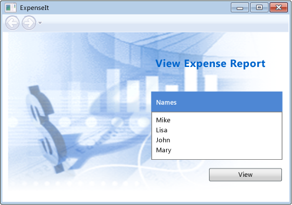
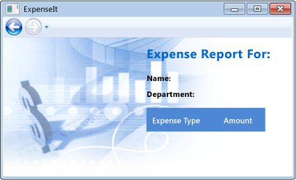
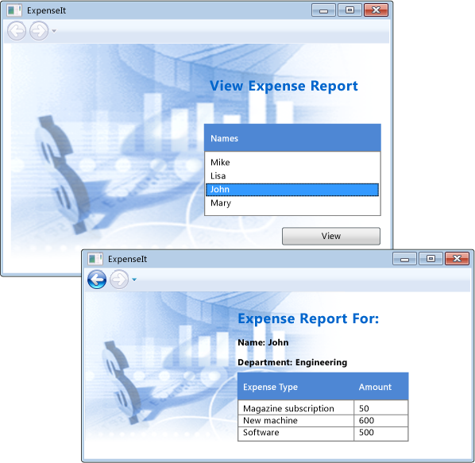

# <a name="walkthrough-my-first-wpf-desktop-application"></a>Tutorial: Mi primera aplicación de escritorio WPF

Este artículo muestra cómo desarrollar una aplicación de Windows Presentation Foundation (WPF) simple que incluye los elementos que son comunes a la mayoría de las aplicaciones de WPF: Extensible Application Markup Language (XAML) marcado, código subyacente, definiciones de aplicación, controles, diseño, enlace de datos y estilos.

En este tutorial incluye los siguientes pasos:

- Usar XAML para diseñar la apariencia de la interfaz de usuario (UI) de la aplicación.

- Escribir código para construir el comportamiento de la aplicación.

- Crear una definición de aplicación para administrar la aplicación.

- Agregar controles y crear el diseño para crear la interfaz de usuario de la aplicación.

- Crear estilos para una apariencia coherente en toda la interfaz de usuario de la aplicación.

- Enlazar la interfaz de usuario a los datos a rellenar la interfaz de usuario de datos y mantener los datos y la interfaz de usuario sincronizada.

Al final del tutorial, habrá creado una aplicación de Windows que permite a los usuarios ver los informes de gastos para personas seleccionadas independiente. La aplicación se compone de varias páginas WPF que se hospedan en una ventana del explorador de estilo.

> [!TIP]
> El código de ejemplo que se usa para crear este tutorial está disponible para Visual Basic y C# en [Introduction to Building WPF Applications](https://go.microsoft.com/fwlink/?LinkID=160008).

## <a name="prerequisites"></a>Requisitos previos

- Visual Studio 2017 o posterior

   Para obtener más información acerca de cómo instalar la versión más reciente de Visual Studio, consulte [instalar Visual Studio](/visualstudio/install/install-visual-studio).

## <a name="create-the-application-project"></a>Crear el proyecto de aplicación

El primer paso es crear la infraestructura de aplicación, que incluye una definición de aplicación, dos páginas y una imagen.

1. Cree un nuevo proyecto de aplicación de WPF en Visual Basic o Visual C# llamado **`ExpenseIt`**:

   1. Abra Visual Studio y seleccione **archivo** > **New** > **proyecto**.

      El **nuevo proyecto** abre el cuadro de diálogo.

   2. En el **instalado** categoría, expanda el **Visual C#**  o **Visual Basic** nodo y, a continuación, seleccione **Windows Desktop**.

   3. Seleccione el **aplicación de WPF (.NET Framework)** plantilla. Escriba el nombre **`ExpenseIt`** y, a continuación, seleccione **Aceptar**.

      

      Visual Studio crea el proyecto y abre el Diseñador de la ventana de aplicación predeterminada denominado **MainWindow.xaml**.

   > [!NOTE]
   > Este tutorial utiliza el <xref:System.Windows.Controls.DataGrid> control que está disponible en .NET Framework 4 y versiones posteriores. Estar seguro de que el proyecto tiene como destino .NET Framework 4 o posterior. Para obtener más información, vea [Cómo: usar una versión de .NET Framework como destino](/visualstudio/ide/how-to-target-a-version-of-the-dotnet-framework).

2. Abra *Application.xaml* (Visual Basic) o *App.xaml* (C#).

    Este archivo XAML define una aplicación de WPF y los recursos de la aplicación. También usa este archivo para especificar la interfaz de usuario que se muestra automáticamente cuando se inicia la aplicación; en este caso, *MainWindow.xaml*.

    En Visual Basic, el XAML debe tener el siguiente aspecto:

    [!code-xaml[ExpenseIt#1_A](~/samples/snippets/visualbasic/VS_Snippets_Wpf/ExpenseIt/VB/ExpenseIt1_A/Application.xaml#1_a)]

    O a este en C#:

    [!code-xaml[ExpenseIt#1](~/samples/snippets/csharp/VS_Snippets_Wpf/ExpenseIt/CSharp/ExpenseIt/App.xaml#1)]

3. Abra *MainWindow.xaml*.

    Este archivo XAML es la ventana principal de la aplicación y muestra contenido creado en páginas. La <xref:System.Windows.Window> clase define las propiedades de una ventana, como su título, tamaño o icono y controla los eventos, como cerrar u ocultar.

4. Cambiar el <xref:System.Windows.Window> elemento a un <xref:System.Windows.Navigation.NavigationWindow>, tal y como se muestra en el XAML siguiente:

   ```xaml
   <NavigationWindow x:Class="ExpenseIt.MainWindow"
        xmlns="http://schemas.microsoft.com/winfx/2006/xaml/presentation"
        xmlns:x="http://schemas.microsoft.com/winfx/2006/xaml"
        ...
   </NavigationWindow>
   ```

   Esta aplicación accede a contenido diferente según la entrada del usuario. Por ello principal <xref:System.Windows.Window> debe cambiarse a un <xref:System.Windows.Navigation.NavigationWindow>. <xref:System.Windows.Navigation.NavigationWindow> hereda todas las propiedades de <xref:System.Windows.Window>. El <xref:System.Windows.Navigation.NavigationWindow> elemento en el archivo XAML crea una instancia de la <xref:System.Windows.Navigation.NavigationWindow> clase. Para obtener más información, consulte [información general sobre navegación](../app-development/navigation-overview.md).

5. Cambie las propiedades siguientes en el <xref:System.Windows.Navigation.NavigationWindow> elemento:

    - Establecer el <xref:System.Windows.Window.Title%2A> propiedad en "`ExpenseIt`".

    - Establecer el <xref:System.Windows.FrameworkElement.Width%2A> propiedad en 500 píxeles.

    - Establecer el <xref:System.Windows.FrameworkElement.Height%2A> propiedad en 350 píxeles.

    - Quitar el <xref:System.Windows.Controls.Grid> elementos situados entre la <xref:System.Windows.Navigation.NavigationWindow> etiquetas.

    En Visual Basic, el XAML debe tener el siguiente aspecto:

    [!code-xaml[ExpenseIt#2_A](~/samples/snippets/visualbasic/VS_Snippets_Wpf/ExpenseIt/VB/ExpenseIt/MainWindow.xaml#2_a)]

    O a este en C#:

    [!code-xaml[ExpenseIt#2](~/samples/snippets/csharp/VS_Snippets_Wpf/ExpenseIt/CSharp/ExpenseIt/MainWindow.xaml#2)]

6. Abra *MainWindow.xaml.vb* o *MainWindow.xaml.cs*.

    Este archivo es un archivo de código subyacente que contiene código para controlar los eventos declarados en *MainWindow.xaml*. Este archivo contiene una clase parcial para la ventana definida en código XAML.

7. Si está utilizando C#, cambie la `MainWindow` clase derive de <xref:System.Windows.Navigation.NavigationWindow>. (En Visual Basic, esto sucede automáticamente cuando se cambia la ventana en XAML.)

   El código debe tener este aspecto:

   [!code-csharp[ExpenseIt#3](~/samples/snippets/csharp/VS_Snippets_Wpf/ExpenseIt/CSharp/ExpenseIt/MainWindow.xaml.cs#3)]
   [!code-vb[ExpenseIt#3](~/samples/snippets/visualbasic/VS_Snippets_Wpf/ExpenseIt/VB/ExpenseIt1_A/MainWindow.xaml.vb#3)]

   > [!TIP]
   > Puede alternar el lenguaje de código del código de ejemplo entre C# y Visual Basic en el **lenguaje** desplegable en la parte superior derecha de este artículo.

## <a name="add-files-to-the-application"></a>Agregar archivos a la aplicación

En esta sección, agregará dos páginas y una imagen a la aplicación.

1. Agregue una nueva página WPF al proyecto y asígnele el nombre *`ExpenseItHome.xaml`*:

   1. En **el Explorador de soluciones**, haga doble clic en el **`ExpenseIt`** nodo de proyecto y elija **agregar** > **página**.

   1. En el **Agregar nuevo elemento** cuadro de diálogo, el **página (WPF)** plantilla ya está seleccionada. Escriba el nombre **`ExpenseItHome`** y, a continuación, seleccione **agregar**.

    Esta página es la primera página que se muestra cuando se inicia la aplicación. Mostrará una lista de personas para seleccionar una, para mostrar un informe de gastos.

2. Abra *`ExpenseItHome.xaml`*.

3. Establecer el <xref:System.Windows.Controls.Page.Title%2A> a "`ExpenseIt - Home`".

    En Visual Basic, el XAML debe tener el siguiente aspecto:

    [!code-xaml[ExpenseIt#6_A](~/samples/snippets/visualbasic/VS_Snippets_Wpf/ExpenseIt/VB/ExpenseIt1_A/ExpenseItHome.xaml#6_a)]

    O a este en C#:

    [!code-xaml[ExpenseIt#6](~/samples/snippets/csharp/VS_Snippets_Wpf/ExpenseIt/CSharp/ExpenseIt2/ExpenseItHome.xaml#6)]

4. Abra *MainWindow.xaml*.

5. Establecer el <xref:System.Windows.Navigation.NavigationWindow.Source%2A> propiedad en el <xref:System.Windows.Navigation.NavigationWindow> a "`ExpenseItHome.xaml`".

    Esto establece *`ExpenseItHome.xaml`* como la primera página se abre cuando se inicia la aplicación. En Visual Basic, el XAML debe tener el siguiente aspecto:

    [!code-xaml[ExpenseIt#7_A](~/samples/snippets/visualbasic/VS_Snippets_Wpf/ExpenseIt/VB/ExpenseIt1_A/MainWindow.xaml#7_a)]

    O a este en C#:

    [!code-xaml[ExpenseIt#7](~/samples/snippets/csharp/VS_Snippets_Wpf/ExpenseIt/CSharp/ExpenseIt2/MainWindow.xaml#7)]

   > [!TIP]
   > También puede establecer el **origen** propiedad en el **varios** categoría de la **propiedades** ventana.
   >
   > 

6. Agregue otra nueva página WPF al proyecto y asígnele el nombre *ExpenseReportPage.xaml*::

   1. En **el Explorador de soluciones**, haga doble clic en el **`ExpenseIt`** nodo de proyecto y elija **agregar** > **página**.

   1. En el **Agregar nuevo elemento** cuadro de diálogo, el **página (WPF)** plantilla ya está seleccionada. Escriba el nombre **ExpenseReportPage**y, a continuación, seleccione **agregar**.

    Esta página mostrará el informe de gastos de la persona que está seleccionada en el **`ExpenseItHome`** página.

7. Abra el archivo *ExpenseReportPage.xaml*.

8. Establecer el <xref:System.Windows.Controls.Page.Title%2A> a "`ExpenseIt - View Expense`".

    En Visual Basic, el XAML debe tener el siguiente aspecto:

    [!code-xaml[ExpenseIt#4_A](~/samples/snippets/visualbasic/VS_Snippets_Wpf/ExpenseIt/VB/ExpenseIt1_A/ExpenseReportPage.xaml#4_a)]

    O a este en C#:

    [!code-xaml[ExpenseIt#4](~/samples/snippets/csharp/VS_Snippets_Wpf/ExpenseIt/CSharp/ExpenseIt/ExpenseReportPage.xaml#4)]

9. Abra *ExpenseItHome.xaml.vb* y *ExpenseReportPage.xaml.vb*, o *ExpenseItHome.xaml.cs* y *ExpenseReportPage.xaml.cs*.

    Cuando se crea un nuevo archivo de paginación, Visual Studio crea automáticamente un *código* archivo. Estos archivos de código subyacente controlan la lógica para responder a la entrada del usuario.

    El código debe ser similar al siguiente para **`ExpenseItHome`**:

    [!code-csharp[ExpenseIt#2_5](~/samples/snippets/csharp/VS_Snippets_Wpf/ExpenseIt/CSharp/ExpenseIt2/ExpenseItHome.xaml.cs#2_5)]
    [!code-vb[ExpenseIt#2_5](~/samples/snippets/visualbasic/VS_Snippets_Wpf/ExpenseIt/VB/ExpenseIt1_A/ExpenseItHome.xaml.vb#2_5)]

    Al igual que con esto para **ExpenseReportPage**:

    [!code-csharp[ExpenseIt#5](~/samples/snippets/csharp/VS_Snippets_Wpf/ExpenseIt/CSharp/ExpenseIt/ExpenseReportPage.xaml.cs#5)]
    [!code-vb[ExpenseIt#5](~/samples/snippets/visualbasic/VS_Snippets_Wpf/ExpenseIt/VB/ExpenseIt1_A/ExpenseReportPage.xaml.vb#5)]

10. Agregue una imagen denominada *watermark.png* al proyecto. Puede crear su propia imagen, copie el archivo desde el código de ejemplo u obtenerlo [aquí](https://github.com/dotnet/docs/blob/master/docs/framework/wpf/getting-started/./media/watermark.png).

    1. Haga doble clic en el nodo del proyecto y seleccione **agregar** > **elemento existente**, o bien presione **MAYÚS**+**Alt** + **A**.

    2. En el **Agregar elemento existente** cuadro de diálogo, busque el archivo de imagen que desea usar y, a continuación, seleccione **agregar**.

## <a name="build-and-run-the-application"></a>Compilar y ejecutar la aplicación

1. Para compilar y ejecutar la aplicación, presione **F5** o seleccione **Iniciar depuración** desde el **depurar** menú.

    La siguiente ilustración muestra la aplicación con el <xref:System.Windows.Navigation.NavigationWindow> botones:

    

2. Cierre la aplicación para volver a Visual Studio.

## <a name="create-the-layout"></a>Crear el diseño

Diseño proporciona una manera ordenada colocar los elementos de interfaz de usuario y también administra el tamaño y posición de dichos elementos cuando se cambia el tamaño de una interfaz de usuario. Normalmente, se crea un diseño con uno de los controles de diseño siguientes:

- <xref:System.Windows.Controls.Canvas>
- <xref:System.Windows.Controls.DockPanel>
- <xref:System.Windows.Controls.Grid>
- <xref:System.Windows.Controls.StackPanel>
- <xref:System.Windows.Controls.VirtualizingStackPanel>
- <xref:System.Windows.Controls.WrapPanel>

Cada uno de estos controles de diseño admite un tipo especial de diseño para sus elementos secundarios. `ExpenseIt` se pueden cambiar el tamaño de las páginas y cada página tiene elementos organizados horizontalmente y verticalmente junto con otros elementos. Por lo tanto, el <xref:System.Windows.Controls.Grid> es el elemento de diseño ideal para la aplicación.

> [!TIP]
> Para obtener más información acerca de <xref:System.Windows.Controls.Panel> elementos, vea [información general sobre](../controls/panels-overview.md). Para obtener más información acerca del diseño, vea [diseño](../advanced/layout.md).

En la sección, creará una tabla de una sola columna con tres filas y un margen de 10 píxeles agregando definiciones de columna y fila a la <xref:System.Windows.Controls.Grid> en *`ExpenseItHome.xaml`*.

1. Abra *`ExpenseItHome.xaml`*.

2. Establecer el <xref:System.Windows.FrameworkElement.Margin%2A> propiedad en el <xref:System.Windows.Controls.Grid> elemento en "10,0,10,10", que corresponde a los márgenes izquierdo, superior, derecho e inferior:

   ```xaml
   <Grid Margin="10,0,10,10">
   ```

   > [!TIP]
   > También puede establecer el **margen** valores en el **propiedades** ventana, en el **diseño** categoría:
   >
   > 

3. Agregue el siguiente XAML entre el <xref:System.Windows.Controls.Grid> etiquetas para crear las definiciones de fila y columna:

    [!code-xaml[ExpenseIt#8](~/samples/snippets/csharp/VS_Snippets_Wpf/ExpenseIt/CSharp/ExpenseIt3/ExpenseItHome.xaml#8)]

    El <xref:System.Windows.Controls.RowDefinition.Height%2A> de dos filas se establece en <xref:System.Windows.GridLength.Auto%2A>, lo que significa que las filas se ajusta el tamaño en función del contenido de las filas. El valor predeterminado <xref:System.Windows.Controls.RowDefinition.Height%2A> es <xref:System.Windows.GridUnitType.Star> ajuste de tamaño, lo que significa que el alto de fila es una proporción ponderada del espacio disponible. Por ejemplo, si dos filas tienen un <xref:System.Windows.Controls.RowDefinition.Height%2A> de "*", cada uno de ellos tiene un alto que sea la mitad del espacio disponible.

    Su <xref:System.Windows.Controls.Grid> debería parecerse ahora el XAML siguiente:

    [!code-xaml[ExpenseIt#9](~/samples/snippets/csharp/VS_Snippets_Wpf/ExpenseIt/CSharp/ExpenseIt3/ExpenseItHome.xaml#9)]

## <a name="add-controls"></a>Agregar controles

En esta sección, actualizará la página principal de la interfaz de usuario para mostrar una lista de personas que un usuario puede seleccionar para mostrar el informe de gastos para. Los controles son objetos de interfaz de usuario que permiten a los usuarios interactuar con su aplicación. Para obtener más información, consulte [Controles](../controls/index.md).

Para crear esta interfaz de usuario, agregará los siguientes elementos para *`ExpenseItHome.xaml`*:

- <xref:System.Windows.Controls.ListBox> (para la lista de personas).
- <xref:System.Windows.Controls.Label> (para el encabezado de lista).
- <xref:System.Windows.Controls.Button> (para hacer clic para ver el informe de gastos de la persona que está seleccionada en la lista).

Cada control se coloca en una fila de la <xref:System.Windows.Controls.Grid> estableciendo el <xref:System.Windows.Controls.Grid.Row%2A?displayProperty=nameWithType> propiedad adjunta. Para obtener más información sobre las propiedades adjuntas, consulte [Attached Properties Overview](../advanced/attached-properties-overview.md).

1. Abra *`ExpenseItHome.xaml`*.

2. Agregue el siguiente XAML en algún lugar entre el <xref:System.Windows.Controls.Grid> etiquetas:

   [!code-xaml[ExpenseIt#10](~/samples/snippets/csharp/VS_Snippets_Wpf/ExpenseIt/CSharp/ExpenseIt4/ExpenseItHome.xaml#10)]

   > [!TIP]
   > También puede crear los controles arrastrándolos desde el **cuadro de herramientas** ventana en la ventana de diseño y, a continuación, establecer sus propiedades en el **propiedades** ventana.

3. Compile y ejecute la aplicación.

La ilustración siguiente muestra los controles que acaba de crear:


## <a name="add-an-image-and-a-title"></a>Agregar un título y una imagen

En esta sección, actualizará la página principal de la interfaz de usuario con una imagen y un título de página.

1. Abra *`ExpenseItHome.xaml`*.

2. Agregue otra columna a la <xref:System.Windows.Controls.Grid.ColumnDefinitions%2A> con fijo <xref:System.Windows.Controls.ColumnDefinition.Width%2A> de 230 píxeles:

    [!code-xaml[ExpenseIt#11](~/samples/snippets/csharp/VS_Snippets_Wpf/ExpenseIt/CSharp/ExpenseIt5/ExpenseItHome.xaml#11)]

3. Agregar otra fila a la <xref:System.Windows.Controls.Grid.RowDefinitions%2A>, para un total de cuatro filas:

    [!code-xaml[ExpenseIt#11b](~/samples/snippets/csharp/VS_Snippets_Wpf/ExpenseIt/CSharp/ExpenseIt5/ExpenseItHome.xaml#11b)]

4. Mueva los controles a la segunda columna estableciendo el <xref:System.Windows.Controls.Grid.Column%2A?displayProperty=nameWithType> propiedad en 1 en cada uno de los tres controles (borde, ListBox y botón).

5. Baje cada control una fila, al incrementar su <xref:System.Windows.Controls.Grid.Row%2A?displayProperty=nameWithType> valor en 1.

   El XAML para los tres controles ahora este aspecto:

    [!code-xaml[ExpenseIt#12](~/samples/snippets/csharp/VS_Snippets_Wpf/ExpenseIt/CSharp/ExpenseIt5/ExpenseItHome.xaml#12)]

6. Establecer el <xref:System.Windows.Controls.Panel.Background%2A> de la <xref:System.Windows.Controls.Grid> sea la *watermark.png* archivo de imagen, agregando el siguiente XAML en algún lugar entre el `<Grid>` y `</Grid>` etiquetas:

    [!code-xaml[ExpenseIt#14](~/samples/snippets/csharp/VS_Snippets_Wpf/ExpenseIt/CSharp/ExpenseIt5/ExpenseItHome.xaml#14)]

7. Antes de la <xref:System.Windows.Controls.Border> elemento, agregue un <xref:System.Windows.Controls.Label> con el contenido "View Expense Report". Este es el título de la página.

    [!code-xaml[ExpenseIt#13](~/samples/snippets/csharp/VS_Snippets_Wpf/ExpenseIt/CSharp/ExpenseIt5/ExpenseItHome.xaml#13)]

8. Compile y ejecute la aplicación.

La ilustración siguiente muestra los resultados de lo que acaba de agregar:



## <a name="add-code-to-handle-events"></a>Agregue código para controlar eventos

1. Abra *`ExpenseItHome.xaml`*.

2. Agregar un <xref:System.Windows.Controls.Primitives.ButtonBase.Click> controlador de eventos para el <xref:System.Windows.Controls.Button> elemento. Para obtener más información, vea [Cómo: Crear un controlador de eventos simple](https://docs.microsoft.com/previous-versions/visualstudio/visual-studio-2010/bb675300(v=vs.100)).

    [!code-xaml[ExpenseIt#15](~/samples/snippets/csharp/VS_Snippets_Wpf/ExpenseIt/CSharp/ExpenseIt6/ExpenseItHome.xaml#15)]

3. Abra *`ExpenseItHome.xaml.vb`* o *`ExpenseItHome.xaml.cs`*.

4. Agregue el código siguiente a la `ExpenseItHome` clase para agregar un botón de controlador de eventos click. El controlador de eventos abre la **ExpenseReportPage** página.

    [!code-csharp[ExpenseIt#16](~/samples/snippets/csharp/VS_Snippets_Wpf/ExpenseIt/CSharp/ExpenseIt6/ExpenseItHome.xaml.cs#16)]
    [!code-vb[ExpenseIt#16](~/samples/snippets/visualbasic/VS_Snippets_Wpf/ExpenseIt/VB/ExpenseIt6/ExpenseItHome.xaml.vb#16)]

## <a name="create-the-ui-for-expensereportpage"></a>Crear la interfaz de usuario para ExpenseReportPage

*ExpenseReportPage.xaml* muestra el informe de gastos de la persona que está seleccionada en el **`ExpenseItHome`** página. En esta sección, creará la interfaz de usuario para **ExpenseReportPage**. También agregará en segundo plano y los colores a los distintos elementos de interfaz de usuario de relleno.

1. Abra el archivo *ExpenseReportPage.xaml*.

2. Agregue el siguiente XAML entre el <xref:System.Windows.Controls.Grid> etiquetas:

    [!code-xaml[ExpenseIt#17](~/samples/snippets/csharp/VS_Snippets_Wpf/ExpenseIt/CSharp/ExpenseIt6/ExpenseReportPage.xaml#17)]

    Esta interfaz de usuario es similar a *`ExpenseItHome.xaml`*, excepto en que los datos del informe se muestran en un <xref:System.Windows.Controls.DataGrid>.

3. Compile y ejecute la aplicación.

    > [!NOTE]
    > Si se produce un error que el <xref:System.Windows.Controls.DataGrid> no se encontró o no existe, asegúrese de que el proyecto tiene como destino .NET Framework 4 o posterior. Para obtener más información, vea [Cómo: usar una versión de .NET Framework como destino](/visualstudio/ide/how-to-target-a-version-of-the-dotnet-framework).

4. Seleccione el **vista** botón.

    Se mostrará la página de informe de gastos Tenga en cuenta que el botón de navegación hacia atrás está habilitado.

La ilustración siguiente muestra los elementos de interfaz de usuario agregados al *ExpenseReportPage.xaml*.



## <a name="style-controls"></a>Aplicar estilo a controles

La apariencia de los diversos elementos a menudo es el mismo para todos los elementos del mismo tipo en una interfaz de usuario. Interfaz de usuario usa [estilos](../controls/styling-and-templating.md) para que las apariencias sean reutilizables en varios elementos. La reutilización de los estilos ayuda a simplificar la administración y creación de XAML. En esta sección se reemplazan los atributos de cada elemento que se definieron en pasos anteriores por estilos.

1. Abra *Application.xaml* o *App.xaml*.

2. Agregue el siguiente XAML entre el <xref:System.Windows.Application.Resources%2A?displayProperty=nameWithType> etiquetas:

    [!code-xaml[ExpenseIt#18](~/samples/snippets/csharp/VS_Snippets_Wpf/ExpenseIt/CSharp/ExpenseIt7/App.xaml#18)]

    Este código XAML agrega los estilos siguientes:

    - `headerTextStyle`: Para dar formato al título de página <xref:System.Windows.Controls.Label>.

    - `labelStyle`: Para dar formato a la <xref:System.Windows.Controls.Label> controles.

    - `columnHeaderStyle`: Para dar formato a la <xref:System.Windows.Controls.Primitives.DataGridColumnHeader>.

    - `listHeaderStyle`: Aplica formato al encabezado de lista <xref:System.Windows.Controls.Border> controles.

    - `listHeaderTextStyle`: Aplica formato al encabezado de lista <xref:System.Windows.Controls.Label>.

    - `buttonStyle`: Para dar formato a la <xref:System.Windows.Controls.Button> en `ExpenseItHome.xaml`.

    Tenga en cuenta que los estilos son recursos y elementos secundarios de la <xref:System.Windows.Application.Resources%2A?displayProperty=nameWithType> property (elemento). En esta ubicación, los estilos se aplican a todos los elementos de una aplicación. Para obtener un ejemplo del uso de recursos en una aplicación de .NET Framework, vea [usar recursos de aplicaciones](../advanced/how-to-use-application-resources.md).

3. Abra *`ExpenseItHome.xaml`*.

4. Reemplace todo entre los <xref:System.Windows.Controls.Grid> elementos con el XAML siguiente:

    [!code-xaml[ExpenseIt#19](~/samples/snippets/csharp/VS_Snippets_Wpf/ExpenseIt/CSharp/ExpenseIt7/ExpenseItHome.xaml#19)]

    Las propiedades como <xref:System.Windows.VerticalAlignment> y <xref:System.Windows.Media.FontFamily> que definen la apariencia de cada control se quitan y reemplazan aplicando los estilos. Por ejemplo, el `headerTextStyle` se aplica a "View Expense Report" <xref:System.Windows.Controls.Label>.

5. Abra el archivo *ExpenseReportPage.xaml*.

6. Reemplace todo entre los <xref:System.Windows.Controls.Grid> elementos con el XAML siguiente:

    [!code-xaml[ExpenseIt#20](~/samples/snippets/csharp/VS_Snippets_Wpf/ExpenseIt/CSharp/ExpenseIt7/ExpenseReportPage.xaml#20)]

    Esto agrega estilos a los elementos <xref:System.Windows.Controls.Label> y <xref:System.Windows.Controls.Border> .

## <a name="bind-data-to-a-control"></a>Enlazar datos a un control

En esta sección, creará los datos XML que se enlazan a diversos controles.

1. Abra *`ExpenseItHome.xaml`*.

2. Después de la apertura <xref:System.Windows.Controls.Grid> elemento, agregue el siguiente XAML para crear un <xref:System.Windows.Data.XmlDataProvider> que contiene los datos para cada persona:

    [!code-xaml[ExpenseIt#21](~/samples/snippets/csharp/VS_Snippets_Wpf/ExpenseIt/CSharp/ExpenseIt8/ExpenseItHome.xaml#21)]
    [!code-xaml[ExpenseIt#23](~/samples/snippets/csharp/VS_Snippets_Wpf/ExpenseIt/CSharp/ExpenseIt8/ExpenseItHome.xaml#23)]
    [!code-xaml[ExpenseIt#22](~/samples/snippets/csharp/VS_Snippets_Wpf/ExpenseIt/CSharp/ExpenseIt8/ExpenseItHome.xaml#22)]

    Los datos se crean como un <xref:System.Windows.Controls.Grid> recursos. Normalmente esto se cargaría como archivo, pero los datos se agregan en línea para simplificar.

3. Dentro de la `<Grid.Resources>` elemento, agregue el siguiente <xref:System.Windows.DataTemplate>, que define cómo mostrar los datos en el <xref:System.Windows.Controls.ListBox>:

    [!code-xaml[ExpenseIt#21](~/samples/snippets/csharp/VS_Snippets_Wpf/ExpenseIt/CSharp/ExpenseIt8/ExpenseItHome.xaml#21)]
    [!code-xaml[ExpenseIt#24](~/samples/snippets/csharp/VS_Snippets_Wpf/ExpenseIt/CSharp/ExpenseIt8/ExpenseItHome.xaml#24)]
    [!code-xaml[ExpenseIt#22](~/samples/snippets/csharp/VS_Snippets_Wpf/ExpenseIt/CSharp/ExpenseIt8/ExpenseItHome.xaml#22)]

    Para obtener más información acerca de las plantillas de datos, vea [información general sobre plantillas de datos](../data/data-templating-overview.md).

4. Reemplazar existente <xref:System.Windows.Controls.ListBox> con el XAML siguiente:

    [!code-xaml[ExpenseIt#25](~/samples/snippets/csharp/VS_Snippets_Wpf/ExpenseIt/CSharp/ExpenseIt8/ExpenseItHome.xaml#25)]

    Este XAML enlaza la <xref:System.Windows.Controls.ItemsControl.ItemsSource%2A> propiedad de la <xref:System.Windows.Controls.ListBox> al origen de datos y aplica la plantilla de datos como el <xref:System.Windows.Controls.ItemsControl.ItemTemplate%2A>.

## <a name="connect-data-to-controls"></a>Conectar datos a controles

A continuación, agregará código para recuperar el nombre que se han seleccionado en el **`ExpenseItHome`** página y pasarlo al constructor de **ExpenseReportPage**. **ExpenseReportPage** establece el contexto de datos con el elemento pasado, que es lo que los controles definidos en *ExpenseReportPage.xaml* enlazar.

1. Abra *ExpenseReportPage.xaml.vb* o *ExpenseReportPage.xaml.cs*.

2. Agregue un constructor que acepte un objeto, para que pueda pasar los datos del informe de gastos de la persona seleccionada.

    [!code-csharp[ExpenseIt#26](~/samples/snippets/csharp/VS_Snippets_Wpf/ExpenseIt/CSharp/ExpenseIt8/ExpenseReportPage.xaml.cs#26)]
    [!code-vb[ExpenseIt#26](~/samples/snippets/visualbasic/VS_Snippets_Wpf/ExpenseIt/VB/ExpenseIt8/ExpenseReportPage.xaml.vb#26)]

3. Abra *`ExpenseItHome.xaml.vb`* o *`ExpenseItHome.xaml.cs`*.

4. Cambiar el <xref:System.Windows.Controls.Primitives.ButtonBase.Click> controlador de eventos para llamar al nuevo constructor y pase los datos de informe de gastos de la persona seleccionada.

    [!code-csharp[ExpenseIt#27](~/samples/snippets/csharp/VS_Snippets_Wpf/ExpenseIt/CSharp/ExpenseIt8/ExpenseItHome.xaml.cs#27)]
    [!code-vb[ExpenseIt#27](~/samples/snippets/visualbasic/VS_Snippets_Wpf/ExpenseIt/VB/ExpenseIt8/ExpenseItHome.xaml.vb#27)]

## <a name="style-data-with-data-templates"></a>Datos de estilo con plantillas de datos

En esta sección, actualizará la interfaz de usuario para cada elemento en las listas de enlazado a datos mediante el uso de plantillas de datos.

1. Abra el archivo *ExpenseReportPage.xaml*.

2. Enlazar el contenido de la "Name" y "Department" <xref:System.Windows.Controls.Label> elementos a los datos apropiados del origen de propiedad. Para obtener más información sobre el enlace de datos, vea [información general sobre el enlace de datos](../data/data-binding-overview.md).

    [!code-xaml[ExpenseIt#31](~/samples/snippets/csharp/VS_Snippets_Wpf/ExpenseIt/CSharp/ExpenseIt9/ExpenseReportPage.xaml#31)]

3. Después de la apertura <xref:System.Windows.Controls.Grid> elemento, agregue las siguientes plantillas de datos, que definen cómo se muestran los datos de informe de gastos:

    [!code-xaml[ExpenseIt#30](~/samples/snippets/csharp/VS_Snippets_Wpf/ExpenseIt/CSharp/ExpenseIt9/ExpenseReportPage.xaml#30)]

4. Reemplace el <xref:System.Windows.Controls.DataGridTextColumn> elementos con <xref:System.Windows.Controls.DataGridTemplateColumn> bajo el <xref:System.Windows.Controls.DataGrid> elemento y aplicar las plantillas.

    [!code-xaml[ExpenseIt#32](~/samples/snippets/csharp/VS_Snippets_Wpf/ExpenseIt/CSharp/ExpenseIt9/ExpenseReportPage.xaml#32)]

5. Compile y ejecute la aplicación.

6. Seleccione una persona y, a continuación, seleccione el **vista** botón.

La ilustración siguiente muestra ambas páginas de la `ExpenseIt` aplicación con controles, diseño, estilos, el enlace de datos y aplicar las plantillas de datos:



> [!NOTE]
> En este ejemplo se muestra una característica específica de WPF y no sigue todos los procedimientos recomendados para cosas como la seguridad, localización y accesibilidad. Para una completa cobertura de WPF y el desarrollo de aplicaciones .NET Framework procedimientos recomendados, consulte los temas siguientes:
>
> - [Accesibilidad](../../ui-automation/accessibility-best-practices.md)
>
> - [Seguridad](../security-wpf.md)
>
> - [Localización y globalización de WPF](../advanced/wpf-globalization-and-localization-overview.md)
>
> - [WPF: rendimiento](../advanced/optimizing-wpf-application-performance.md)

## <a name="next-steps"></a>Pasos siguientes

En este tutorial ha aprendido varias técnicas para crear una interfaz de usuario mediante Windows Presentation Foundation (WPF). Ahora debería tener un conocimiento básico de los bloques de creación de una aplicación de .NET Framework, enlazado a datos. Para más información sobre los modelos de programación y arquitectura de WPF, vea los temas siguientes:

- [Arquitectura de WPF](../advanced/wpf-architecture.md)
- [Información general XAML (WPF)](../advanced/xaml-overview-wpf.md)
- [Información general sobre las propiedades de dependencia](../advanced/dependency-properties-overview.md)
- [Diseño](../advanced/layout.md)

Para más información sobre la creación de aplicaciones, vea los temas siguientes:

- [Desarrollo de aplicaciones](../app-development/index.md)
- [Controles](../controls/index.md)
- [Información general sobre el enlace de datos](../data/data-binding-overview.md)
- [Gráficos y multimedia](../graphics-multimedia/index.md)
- [Documentos en WPF](../advanced/documents-in-wpf.md)

## <a name="see-also"></a>Vea también

- [Información general sobre](../controls/panels-overview.md)
- [Información general sobre plantillas de datos](../data/data-templating-overview.md)
- [Crear una aplicación de WPF](../app-development/building-a-wpf-application-wpf.md)
- [Estilos y plantillas](../controls/styles-and-templates.md)
