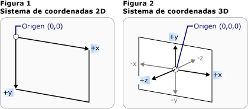
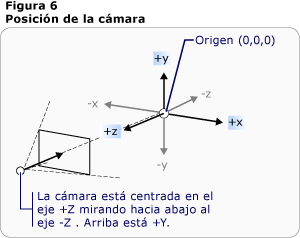

# Información general sobre gráficos 3D3D Graphics Overview
La funcionalidad 3D de [!INCLUDE[TLA#tla_winclient](../../../../includes/tlasharptla-winclient-md.md)] permite a los desarrolladores dibujar, transformar y animar gráficos 3D en el código de marcado y en el de procedimientos.The 3D functionality in [!INCLUDE[TLA#tla_winclient](../../../../includes/tlasharptla-winclient-md.md)] enables developers to draw, transform, and animate 3D graphics in both markup and procedural code. Los desarrolladores pueden combinar gráficos 2D y 3D para crear controles enriquecidos, proporcionar ilustraciones complejas de datos o mejorar la experiencia del usuario de la interfaz de una aplicación.Developers can combine 2D and 3D graphics to create rich controls, provide complex illustrations of data, or enhance the user experience of an application's interface. la compatibilidad con 3D en [!INCLUDE[TLA2#tla_winclient](../../../../includes/tla2sharptla-winclient-md.md)] no está diseñada para proporcionar una plataforma de desarrollo de juegos con todas las características.3D support in [!INCLUDE[TLA2#tla_winclient](../../../../includes/tla2sharptla-winclient-md.md)] is not designed to provide a full-featured game-development platform. En este tema se proporciona información general sobre la funcionalidad 3D en el [!INCLUDE[TLA2#tla_winclient](../../../../includes/tla2sharptla-winclient-md.md)] sistema de gráficos.This topic provides an overview of 3D functionality in the [!INCLUDE[TLA2#tla_winclient](../../../../includes/tla2sharptla-winclient-md.md)] graphics system.  

## 3D en un contenedor 2D3D in a 2D Container  
 el contenido de gráficos 3D de [!INCLUDE[TLA2#tla_winclient](../../../../includes/tla2sharptla-winclient-md.md)] se encapsula en un elemento, <xref:System.Windows.Controls.Viewport3D> , que puede participar en la estructura de elementos bidimensionales.3D graphics content in [!INCLUDE[TLA2#tla_winclient](../../../../includes/tla2sharptla-winclient-md.md)] is encapsulated in an element, <xref:System.Windows.Controls.Viewport3D>, that can participate in the two-dimensional element structure. El sistema de gráficos trata <xref:System.Windows.Controls.Viewport3D> como un elemento visual bidimensional, como muchos otros en [!INCLUDE[TLA2#tla_winclient](../../../../includes/tla2sharptla-winclient-md.md)] .The graphics system treats <xref:System.Windows.Controls.Viewport3D> as a two-dimensional visual element like many others in [!INCLUDE[TLA2#tla_winclient](../../../../includes/tla2sharptla-winclient-md.md)]. <xref:System.Windows.Controls.Viewport3D>funciona como una ventana (una ventanilla) en una escena tridimensional.<xref:System.Windows.Controls.Viewport3D> functions as a window—a viewport—into a three-dimensional scene. Más concretamente, es una superficie en la que se proyecta una escena 3D.More accurately, it is a surface on which a 3D scene is projected.  
  
 En una aplicación 2D convencional, use <xref:System.Windows.Controls.Viewport3D> como lo haría con otro elemento contenedor como Grid o Canvas.In a conventional 2D application, use <xref:System.Windows.Controls.Viewport3D> as you would another container element like Grid or Canvas.  Aunque puede usar <xref:System.Windows.Controls.Viewport3D> con otros objetos de dibujo 2D en el mismo gráfico de escena, no puede interpenetrar objetos 2D y 3D en un <xref:System.Windows.Controls.Viewport3D> .Although you can use <xref:System.Windows.Controls.Viewport3D> with other 2D drawing objects in the same scene graph, you cannot interpenetrate 2D and 3D objects within a <xref:System.Windows.Controls.Viewport3D>.  Este tema se centrará en cómo dibujar gráficos 3D dentro de <xref:System.Windows.Controls.Viewport3D> .This topic will focus on how to draw 3D graphics inside the <xref:System.Windows.Controls.Viewport3D>.  
  

## Espacio de coordenadas 3D3D Coordinate Space  
 El [!INCLUDE[TLA2#tla_winclient](../../../../includes/tla2sharptla-winclient-md.md)] sistema de coordenadas para gráficos 2D localiza el origen en la parte superior izquierda del área de representación (normalmente la pantalla).The [!INCLUDE[TLA2#tla_winclient](../../../../includes/tla2sharptla-winclient-md.md)] coordinate system for 2D graphics locates the origin in the upper left of the rendering area (typically the screen). En el sistema 2D, los valores positivos del eje x se extienden hacia la derecha y los valores positivos del eje y continúan hacia abajo.In the 2D system, positive x-axis values proceed to the right and positive y-axis values proceed downward.  En el sistema de coordenadas 3D, sin embargo, el origen se encuentra en el centro del área de representación, y los valores positivos del eje x se extienden hacia la derecha, pero los valores positivos del eje y continúan hacia arriba, y los valores positivos del eje z continúan fuera del origen, hacia el visor.In the 3D coordinate system, however, the origin is located in the center of the rendering area, with positive x-axis values proceeding to the right but positive y-axis values proceeding upward instead, and positive z-axis values proceeding outward from the origin, toward the viewer.  
  
   
Representaciones convencionales del sistema de coordenadas 2D y 3DConventional 2D and 3D coordinate system representations  
  
 El espacio definido por estos ejes es el marco estacionario de referencia para los objetos 3D en [!INCLUDE[TLA2#tla_winclient](../../../../includes/tla2sharptla-winclient-md.md)] .The space defined by these axes is the stationary frame of reference for 3D objects in [!INCLUDE[TLA2#tla_winclient](../../../../includes/tla2sharptla-winclient-md.md)]. Cuando se generan modelos en este espacio y se crean luces y cámaras para verlos, es útil distinguir este marco estático de referencia, o "espacio universal", del marco de referencia local creado para cada modelo al aplicarle transformaciones.As you build models in this space and create lights and cameras to view them, it's helpful to distinguish this stationary frame of reference, or "world space," from the local frame of reference you create for each model when you apply transformations to it. Recuerde también que los objetos del espacio universal podrían parecer completamente diferentes, o incluso no verse en absoluto, dependiendo de la configuración de las luces y la cámara, pero que la posición de la cámara no cambia la ubicación de los objetos en el espacio universal.Remember also that objects in world space might look entirely different, or not be visible at all, depending on light and camera settings, but the position of the camera does not change the location of objects in world space.  
  

## Cámaras y proyeccionesCameras and Projections  
 Los desarrolladores que trabajan en 2D están acostumbrados a colocar los primitivos de dibujo en una pantalla bidimensional.Developers who work in 2D are accustomed to positioning drawing primitives on a two-dimensional screen. Al crear una escena 3D, es importante recordar que realmente está creando una representación 2D de objetos 3D.When you create a 3D scene, it's important to remember that you are really creating a 2D representation of 3D objects. Dado que una escena 3D es diferente en función del punto de vista del espectador, debe especificar ese punto de vista.Because a 3D scene looks different depending on the onlooker's point of view, you must specify that point of view. La <xref:System.Windows.Media.Media3D.Camera> clase le permite especificar este punto de vista para una escena 3D.The <xref:System.Windows.Media.Media3D.Camera> class allows you to specify this point of view for a 3D scene.  
  
 Otra forma de entender cómo se representa una escena 3D en una superficie 2D es describir la escena como una proyección en la superficie de visualización.Another way to understand how a 3D scene is represented on a 2D surface is by describing the scene as a projection onto the viewing surface. <xref:System.Windows.Media.Media3D.ProjectionCamera>Permite especificar proyecciones diferentes y sus propiedades para cambiar el modo en que espectador ve los modelos 3D.The <xref:System.Windows.Media.Media3D.ProjectionCamera> allows you to specify different projections and their properties to change how the onlooker sees 3D models. Un <xref:System.Windows.Media.Media3D.PerspectiveCamera> especifica una proyección que escorzo la escena.A <xref:System.Windows.Media.Media3D.PerspectiveCamera> specifies a projection that foreshortens the scene.  En otras palabras, el <xref:System.Windows.Media.Media3D.PerspectiveCamera> proporciona una perspectiva de punto de fuga.In other words, the <xref:System.Windows.Media.Media3D.PerspectiveCamera> provides vanishing-point perspective.  Puede especificar la posición de la cámara en el espacio de coordenadas de la escena, la dirección y el campo de visión de la cámara y un vector que define la dirección de "arriba" en la escena.You can specify the position of the camera in the coordinate space of the scene, the direction and field of view for the camera, and a vector that defines the direction of "up" in the scene. En el diagrama siguiente se muestra la <xref:System.Windows.Media.Media3D.PerspectiveCamera> proyección de.The following diagram illustrates the <xref:System.Windows.Media.Media3D.PerspectiveCamera>'s projection.  
  
 Las <xref:System.Windows.Media.Media3D.ProjectionCamera.NearPlaneDistance%2A> <xref:System.Windows.Media.Media3D.ProjectionCamera.FarPlaneDistance%2A> propiedades y de <xref:System.Windows.Media.Media3D.ProjectionCamera> limitan el intervalo de proyección de la cámara.The <xref:System.Windows.Media.Media3D.ProjectionCamera.NearPlaneDistance%2A> and <xref:System.Windows.Media.Media3D.ProjectionCamera.FarPlaneDistance%2A> properties of <xref:System.Windows.Media.Media3D.ProjectionCamera> limit the range of the camera's projection. Dado que las cámaras se pueden ubicar en cualquier parte de la escena, es posible situarlas dentro de un modelo o muy cerca de él, con lo que resultaría difícil distinguir correctamente los objetos.Because cameras can be located anywhere in the scene, it's possible for the camera to be actually positioned inside a model or very near a model, making it hard to distinguish objects properly.  <xref:System.Windows.Media.Media3D.ProjectionCamera.NearPlaneDistance%2A>permite especificar una distancia mínima desde la cámara más allá de la cual no se dibujarán los objetos.<xref:System.Windows.Media.Media3D.ProjectionCamera.NearPlaneDistance%2A> allows you to specify a minimum distance from the camera beyond which objects will not be drawn.  Por el contrario, <xref:System.Windows.Media.Media3D.ProjectionCamera.FarPlaneDistance%2A> permite especificar una distancia desde la cámara más allá de la cual no se dibujarán objetos, lo que garantiza que los objetos que estén demasiado lejos para ser reconocibles no se incluirán en la escena.Conversely, <xref:System.Windows.Media.Media3D.ProjectionCamera.FarPlaneDistance%2A> lets you specify a distance from the camera beyond which objects will not be drawn, which ensures that objects too far away to be recognizable won't be included in the scene.  
  
   
Posición de la cámaraCamera position  
  
 <xref:System.Windows.Media.Media3D.OrthographicCamera>especifica una proyección ortogonal de un modelo 3D en una superficie visual 2D.<xref:System.Windows.Media.Media3D.OrthographicCamera> specifies an orthogonal projection of a 3D model to a 2D visual surface. Al igual que otras cámaras, especifica una posición, dirección de visualización y dirección "hacia arriba".Like other cameras, it specifies a position, viewing direction, and "upward" direction. Sin embargo, a diferencia de, <xref:System.Windows.Media.Media3D.PerspectiveCamera> <xref:System.Windows.Media.Media3D.OrthographicCamera> describe una proyección que no incluye el escorzo de la perspectiva.Unlike <xref:System.Windows.Media.Media3D.PerspectiveCamera>, however, <xref:System.Windows.Media.Media3D.OrthographicCamera> describes a projection that does not include perspective foreshortening. En otras palabras, <xref:System.Windows.Media.Media3D.OrthographicCamera> describe un cuadro de visualización cuyos lados son paralelos, en lugar de uno cuyos lados se encuentran en un punto de la cámara.In other words, <xref:System.Windows.Media.Media3D.OrthographicCamera> describes a viewing box whose sides are parallel, instead of one whose sides meet in a point at the camera. En la imagen siguiente se muestra el mismo modelo que el que se ve mediante <xref:System.Windows.Media.Media3D.PerspectiveCamera> y <xref:System.Windows.Media.Media3D.OrthographicCamera> .The following image shows the same model as viewed using <xref:System.Windows.Media.Media3D.PerspectiveCamera> and <xref:System.Windows.Media.Media3D.OrthographicCamera>.  
  
   
Proyecciones ortográfica y en perspectivaPerspective and Orthographic Projections  
  
 En el código siguiente se muestran algunas configuraciones de cámara típicas.The following code shows some typical camera settings.  
  
 [!code-csharp[3dgallery_procedural_snip#Basic3DShapeCodeExampleInline1](~/samples/snippets/csharp/VS_Snippets_Wpf/3DGallery_procedural_snip/CSharp/Basic3DShapeExample.cs#basic3dshapecodeexampleinline1)]
 [!code-vb[3dgallery_procedural_snip#Basic3DShapeCodeExampleInline1](~/samples/snippets/visualbasic/VS_Snippets_Wpf/3DGallery_procedural_snip/visualbasic/basic3dshapeexample.vb#basic3dshapecodeexampleinline1)]  
  

## Elementos primitivos de modelo y de mallaModel and Mesh Primitives  
  
 <xref:System.Windows.Media.Media3D.Model3D>es la clase base abstracta que representa un objeto 3D genérico.<xref:System.Windows.Media.Media3D.Model3D> is the abstract base class that represents a generic 3D object. Para compilar una escena 3D, necesita algunos objetos para verlos y los objetos que componen el gráfico de escena derivan de <xref:System.Windows.Media.Media3D.Model3D> .To build a 3D scene, you need some objects to view, and the objects that make up the scene graph derive from <xref:System.Windows.Media.Media3D.Model3D>. Actualmente, [!INCLUDE[TLA2#tla_winclient](../../../../includes/tla2sharptla-winclient-md.md)] admite las geometrías de modelado con <xref:System.Windows.Media.Media3D.GeometryModel3D> .Currently, the [!INCLUDE[TLA2#tla_winclient](../../../../includes/tla2sharptla-winclient-md.md)] supports modeling geometries with <xref:System.Windows.Media.Media3D.GeometryModel3D>. La <xref:System.Windows.Media.Media3D.GeometryModel3D.Geometry%2A> propiedad de este modelo toma una primitiva de malla.The <xref:System.Windows.Media.Media3D.GeometryModel3D.Geometry%2A> property of this model takes a mesh primitive.  
  
 Para crear un modelo, comience por crear un elemento primitivo, o malla.To build a model, begin by building a primitive, or mesh. Un primitivo 3D es una colección de vértices que forman una única entidad 3D.A 3D primitive is a collection of vertices that form a single 3D entity. La mayoría de los sistemas 3D proporcionan primitivas modeladas en la figura cerrada más simple: un triángulo definido por tres vértices.Most 3D systems provide primitives modeled on the simplest closed figure: a triangle defined by three vertices.  Dado que los tres puntos de un triángulo son coplanares, puede seguir agregando triángulos para modelar formas más complejas, denominadas mallas.Because the three points of a triangle are coplanar, you can continue adding triangles in order to model more complex shapes, called meshes.  
  
 [!INCLUDE[TLA2#tla_winclient](../../../../includes/tla2sharptla-winclient-md.md)]En la actualidad, el sistema 3D proporciona la <xref:System.Windows.Media.Media3D.MeshGeometry3D> clase, que permite especificar cualquier geometría; actualmente no admite primitivas 3D predefinidas como esferas y formas cúbicas.The [!INCLUDE[TLA2#tla_winclient](../../../../includes/tla2sharptla-winclient-md.md)] 3D system currently provides the <xref:System.Windows.Media.Media3D.MeshGeometry3D> class, which allows you to specify any geometry; it does not currently support predefined 3D primitives like spheres and cubic forms. Comience a crear un <xref:System.Windows.Media.Media3D.MeshGeometry3D> especificando una lista de vértices de triángulo como su <xref:System.Windows.Media.Media3D.MeshGeometry3D.Positions%2A> propiedad.Begin creating a <xref:System.Windows.Media.Media3D.MeshGeometry3D> by specifying a list of triangle vertices as its <xref:System.Windows.Media.Media3D.MeshGeometry3D.Positions%2A> property. Cada vértice se especifica como <xref:System.Windows.Media.Media3D.Point3D> .Each vertex is specified as a <xref:System.Windows.Media.Media3D.Point3D>.  (En [!INCLUDE[TLA#tla_xaml](../../../../includes/tlasharptla-xaml-md.md)] , especifique esta propiedad como una lista de números agrupados en tres que representan las coordenadas de cada vértice). Dependiendo de su geometría, la malla puede estar formada por muchos triángulos, algunos de los cuales comparten las mismas esquinas (vértices).(In [!INCLUDE[TLA#tla_xaml](../../../../includes/tlasharptla-xaml-md.md)], specify this property as a list of numbers grouped in threes that represent the coordinates of each vertex.) Depending on its geometry, your mesh might be composed of many triangles, some of which share the same corners (vertices). [!INCLUDE[TLA2#tla_winclient](../../../../includes/tla2sharptla-winclient-md.md)] necesita información sobre qué triángulos comparten qué vértices para dibujar la malla correctamente.To draw the mesh correctly, the [!INCLUDE[TLA2#tla_winclient](../../../../includes/tla2sharptla-winclient-md.md)] needs information about which vertices are shared by which triangles. Para proporcionar esta información, especifique una lista de índices de triángulo con la <xref:System.Windows.Media.Media3D.MeshGeometry3D.TriangleIndices%2A> propiedad.You provide this information by specifying a list of triangle indices with the <xref:System.Windows.Media.Media3D.MeshGeometry3D.TriangleIndices%2A> property. Esta lista especifica el orden en el que los puntos especificados en la <xref:System.Windows.Media.Media3D.MeshGeometry3D.Positions%2A> lista determinarán un triángulo.This list specifies the order in which the points specified in the <xref:System.Windows.Media.Media3D.MeshGeometry3D.Positions%2A> list will determine a triangle.  
  
 [!code-xaml[basic3d#Basic3DXAML3DN3](~/samples/snippets/xaml/VS_Snippets_Wpf/Basic3D/XAML/Window1.xaml#basic3dxaml3dn3)]  
  
 En el ejemplo anterior, la <xref:System.Windows.Media.Media3D.MeshGeometry3D.Positions%2A> lista especifica ocho vértices para definir una malla en forma de cubo.In the preceding example, the <xref:System.Windows.Media.Media3D.MeshGeometry3D.Positions%2A> list specifies eight vertices to define a cube-shaped mesh. La <xref:System.Windows.Media.Media3D.MeshGeometry3D.TriangleIndices%2A> propiedad especifica una lista de doce grupos de tres índices.The <xref:System.Windows.Media.Media3D.MeshGeometry3D.TriangleIndices%2A> property specifies a list of twelve groups of three indices.  Cada número de la lista hace referencia a un desplazamiento de la <xref:System.Windows.Media.Media3D.MeshGeometry3D.Positions%2A> lista.Each number in the list refers to an offset into the <xref:System.Windows.Media.Media3D.MeshGeometry3D.Positions%2A> list.  Por ejemplo, los tres primeros vértices especificados por la <xref:System.Windows.Media.Media3D.MeshGeometry3D.Positions%2A> lista son (1, 1, 0), (0, 1, 0) y (0, 0, 0).For example, the first three vertices specified by the <xref:System.Windows.Media.Media3D.MeshGeometry3D.Positions%2A> list are (1,1,0), (0,1,0), and (0,0,0). Los tres primeros índices especificados por la <xref:System.Windows.Media.Media3D.MeshGeometry3D.TriangleIndices%2A> lista son 0, 2 y 1, que corresponden a los puntos primero, tercero y segundo de la <xref:System.Windows.Media.Media3D.MeshGeometry3D.Positions%2A> lista.The first three indices specified by the <xref:System.Windows.Media.Media3D.MeshGeometry3D.TriangleIndices%2A> list are 0, 2, and 1, which correspond to the first, third, and second points in the <xref:System.Windows.Media.Media3D.MeshGeometry3D.Positions%2A> list. Como resultado, el primer triángulo que constituye el modelo del cubo se creará de (1,1,0) a (0,1,0) y a (0,0,0), y los once triángulos restantes se determinarán de igual forma.As a result, the first triangle that makes up the cube model will be composed from (1,1,0) to (0,1,0) to  (0,0,0), and the remaining eleven triangles will be determined similarly.  
  
 Puede seguir definiendo el modelo especificando valores para las <xref:System.Windows.Media.Media3D.MeshGeometry3D.Normals%2A> propiedades y <xref:System.Windows.Media.Media3D.MeshGeometry3D.TextureCoordinates%2A> .You can continue defining the model by specifying values for the <xref:System.Windows.Media.Media3D.MeshGeometry3D.Normals%2A> and <xref:System.Windows.Media.Media3D.MeshGeometry3D.TextureCoordinates%2A> properties.  Para representar la superficie del modelo, el sistema de gráficos necesita información sobre en qué dirección mira la superficie de cualquier triángulo dado.To render the surface of the model, the graphics system needs information about which direction the surface is facing at any given triangle. Utiliza esta información para realizar los cálculos de iluminación del modelo: las superficies que miran directamente hacia una fuente de luz parecen más luminosas que las que tienen un ángulo que las oculta de la luz.It uses this information to make lighting calculations for the model: surfaces that face directly towards a light source appear brighter than those angled away from the light. Aunque [!INCLUDE[TLA2#tla_winclient](../../../../includes/tla2sharptla-winclient-md.md)] puede determinar los vectores normales predeterminados utilizando las coordenadas de posición, también es posible especificar vectores normales diferentes para crear un aspecto más aproximado de las superficies curvas.Though the [!INCLUDE[TLA2#tla_winclient](../../../../includes/tla2sharptla-winclient-md.md)] can determine default normal vectors by using the position coordinates, you can also specify different normal vectors to approximate the appearance of curved surfaces.  
  
 La <xref:System.Windows.Media.Media3D.MeshGeometry3D.TextureCoordinates%2A> propiedad especifica una colección de <xref:System.Windows.Point> s que indican al sistema de gráficos cómo asignar las coordenadas que determinan cómo se dibuja una textura en los vértices de la malla.The <xref:System.Windows.Media.Media3D.MeshGeometry3D.TextureCoordinates%2A> property specifies a collection of <xref:System.Windows.Point>s that tell the graphics system how to map the coordinates that determine how a texture is drawn to the vertices of the mesh. <xref:System.Windows.Media.Media3D.MeshGeometry3D.TextureCoordinates%2A>se especifican como un valor entre cero y 1, ambos incluidos.<xref:System.Windows.Media.Media3D.MeshGeometry3D.TextureCoordinates%2A> are specified as a value between zero and 1, inclusive.  Al igual que con la <xref:System.Windows.Media.Media3D.MeshGeometry3D.Normals%2A> propiedad, el sistema de gráficos puede calcular las coordenadas de textura predeterminadas, pero puede optar por establecer distintas coordenadas de textura para controlar la asignación de una textura que incluye parte de un patrón de repetición, por ejemplo.As with the <xref:System.Windows.Media.Media3D.MeshGeometry3D.Normals%2A> property, the graphics system can calculate default texture coordinates, but you might choose to set different texture coordinates to control the mapping of a texture that includes part of a repeating pattern, for example. Encontrará más información sobre coordenadas de textura en los temas siguientes o en el SDK de Managed Direct3D.More information about texture coordinates can be found in subsequent topics or in the Managed Direct3D SDK.  
  
 En el ejemplo siguiente se muestra cómo crear una cara del modelo del cubo en código de procedimiento.The following example shows how to create one face of the cube model in procedural code. Puede dibujar todo el cubo como un único GeometryModel3D; en este ejemplo se dibuja la superficie del cubo como un modelo distinto para aplicar texturas independientes a cada uno de ellos más adelante.You can draw the entire cube as a single GeometryModel3D; this example draws the cube's face as a distinct model in order to apply separate textures to each face later.  
  
 [!code-csharp[3doverview#3DOverview3DN6](~/samples/snippets/csharp/VS_Snippets_Wpf/3DOverview/CSharp/Window1.xaml.cs#3doverview3dn6)]
 [!code-vb[3doverview#3DOverview3DN6](~/samples/snippets/visualbasic/VS_Snippets_Wpf/3DOverview/visualbasic/window1.xaml.vb#3doverview3dn6)]  
  
 [!code-csharp[3doverview#3DOverview3DN7](~/samples/snippets/csharp/VS_Snippets_Wpf/3DOverview/CSharp/Window1.xaml.cs#3doverview3dn7)]
 [!code-vb[3doverview#3DOverview3DN7](~/samples/snippets/visualbasic/VS_Snippets_Wpf/3DOverview/visualbasic/window1.xaml.vb#3doverview3dn7)]  
  
''
## Aplicación de materiales al modeloApplying Materials to the Model  
  
 Para que una malla parezca un objeto tridimensional, debe tener una textura aplicada que cubra la superficie definida por sus vértices y triángulos, de manera que se pueda iluminar y proyectar por la cámara.For a mesh to look like a three-dimensional object, it must have an applied texture to cover the surface defined by its vertices and triangles so it can be lit and projected by the camera. En 2D, se usa la <xref:System.Windows.Media.Brush> clase para aplicar colores, patrones, degradados u otro contenido visual a las áreas de la pantalla.In 2D, you use the <xref:System.Windows.Media.Brush> class to apply colors, patterns, gradients, or other visual content to areas of the screen.  Sin embargo, la apariencia de los objetos 3D es una función del modelo de iluminación, no solo del color o del patrón aplicado.The appearance of 3D objects, however, is a function of the lighting model, not just of the color or pattern applied to them. Los objetos reales reflejan la luz de manera distinta según la calidad de su superficie: las superficies satinadas y brillantes no tienen el mismo aspecto que las superficies ásperas o mates, y algunos objetos parecen absorber la luz, mientras que otros la emiten.Real-world objects reflect light differently depending on the quality of their surfaces: glossy and shiny surfaces don't look the same as rough or matte surfaces, and some objects seem to absorb light while others glow. Puede aplicar los mismos pinceles a objetos 3D que se pueden aplicar a objetos 2D, pero no se pueden aplicar directamente.You can apply all the same brushes to 3D objects that you can apply to 2D objects, but you can't apply them directly.  
  
 Para definir las características de la superficie de un modelo, [!INCLUDE[TLA2#tla_winclient](../../../../includes/tla2sharptla-winclient-md.md)] utiliza la <xref:System.Windows.Media.Media3D.Material> clase abstracta.To define the characteristics of a model's surface, [!INCLUDE[TLA2#tla_winclient](../../../../includes/tla2sharptla-winclient-md.md)] uses the <xref:System.Windows.Media.Media3D.Material> abstract class. Las subclases concretas de Material determinan algunas de las características del aspecto de la superficie del modelo y, además, cada una de ellas proporciona una propiedad Brush a la que puede pasar SolidColorBrush, TileBrush o VisualBrush.The concrete subclasses of Material determine some of the appearance characteristics of the model's surface, and each also provides a Brush property to which you can pass a SolidColorBrush, TileBrush, or VisualBrush.  
  
- <xref:System.Windows.Media.Media3D.DiffuseMaterial>Especifica que el pincel se aplicará al modelo como si dicho modelo estuviese iluminado de forma difusa.<xref:System.Windows.Media.Media3D.DiffuseMaterial> specifies that the brush will be applied to the model as though that model were lit diffusely. El uso de DiffuseMaterial es más parecido al uso de los pinceles directamente en los modelos 2D; las superficies del modelo no reflejan la luz como si fuesen brillantes.Using DiffuseMaterial most resembles using brushes directly on 2D models; model surfaces do not reflect light as though shiny.  
  
- <xref:System.Windows.Media.Media3D.SpecularMaterial>Especifica que el pincel se aplicará al modelo como si la superficie del modelo fuera difícil o brillante, capaz de reflejar los resaltados.<xref:System.Windows.Media.Media3D.SpecularMaterial> specifies that the brush will be applied to the model as though the model's surface were hard or shiny, capable of reflecting highlights. Puede establecer el grado en el que la textura sugerirá esta calidad reflectante o "brilla" especificando un valor para la <xref:System.Windows.Media.Media3D.SpecularMaterial.SpecularPower%2A> propiedad.You can set the degree to which the texture will suggest this reflective quality, or "shine," by specifying a value for the <xref:System.Windows.Media.Media3D.SpecularMaterial.SpecularPower%2A> property.  
  
- <xref:System.Windows.Media.Media3D.EmissiveMaterial>permite especificar que la textura se aplique como si el modelo emitira luz igual al color del pincel.<xref:System.Windows.Media.Media3D.EmissiveMaterial> allows you to specify that the texture will be applied as though the model were emitting light equal to the color of the brush. Esto no convierte el modelo en una luz; sin embargo, participará de manera diferente en el sombreado que si se aplica textura con DiffuseMaterial o SpecularMaterial.This does not make the model a light; however, it will participate differently in shadowing than it would if textured with DiffuseMaterial or SpecularMaterial.  
  
 Para mejorar el rendimiento, las <xref:System.Windows.Media.Media3D.GeometryModel3D> caras opuestas de un (las caras que están fuera de la vista porque están en el lado opuesto del modelo de la cámara) se seleccionan de la escena.For better performance, the backfaces of a <xref:System.Windows.Media.Media3D.GeometryModel3D> (those faces that are out of view because they are on the opposite side of the model from the camera) are culled from the scene.  Para especificar un <xref:System.Windows.Media.Media3D.Material> que se va a aplicar a la parte frontal de un modelo como un plano, establezca la propiedad del modelo <xref:System.Windows.Media.Media3D.GeometryModel3D.BackMaterial%2A> .To specify a <xref:System.Windows.Media.Media3D.Material> to apply to the backface of a model like a plane, set the model's <xref:System.Windows.Media.Media3D.GeometryModel3D.BackMaterial%2A> property.  
  
 Para lograr algunas cualidades de la superficie, como el brillo o los efectos de reflejo, puede ser conveniente aplicar sucesivamente varios pinceles diferentes a un modelo.To achieve some surface qualities, like glowing or reflective effects, you might want to apply several different brushes to a model in succession. Puede aplicar y reutilizar varios materiales mediante la <xref:System.Windows.Media.Media3D.MaterialGroup> clase.You can apply and reuse multiple Materials by using the <xref:System.Windows.Media.Media3D.MaterialGroup> class. Los elementos secundarios de MaterialGroup se aplican del primero al último en varias pasadas de representación.The children of the MaterialGroup are applied first to last in multiple rendering passes.  
  
 En los siguientes ejemplos de código se muestra cómo aplicar un color sólido y un dibujo como pinceles a modelos 3D.The following code examples show how to apply a solid color and a drawing as brushes to 3D models.  
  
 [!code-xaml[basic3d#Basic3DXAML3DN5](~/samples/snippets/xaml/VS_Snippets_Wpf/Basic3D/XAML/Window1.xaml#basic3dxaml3dn5)]  
  ' [!code-xaml[3doverview#3DOverview3DN9](~/samples/snippets/csharp/VS_Snippets_Wpf/3DOverview/CSharp/app.xaml#3doverview3dn9)]' [!code-xaml[3doverview#3DOverview3DN9](~/samples/snippets/csharp/VS_Snippets_Wpf/3DOverview/CSharp/app.xaml#3doverview3dn9)]  
 ' [!code-csharp[3doverview#3DOverview3DN8](~/samples/snippets/csharp/VS_Snippets_Wpf/3DOverview/CSharp/Window1.xaml.cs#3doverview3dn8)]' [!code-csharp[3doverview#3DOverview3DN8](~/samples/snippets/csharp/VS_Snippets_Wpf/3DOverview/CSharp/Window1.xaml.cs#3doverview3dn8)]
  [!code-vb[3doverview#3DOverview3DN8](~/samples/snippets/visualbasic/VS_Snippets_Wpf/3DOverview/visualbasic/window1.xaml.vb#3doverview3dn8)]  
  

## Iluminación de la escenaIlluminating the Scene  
 Las luces de los gráficos 3D hacen lo que hacen las luces en el mundo real: hacen visibles las superficies.Lights in 3D graphics do what lights do in the real world: they make surfaces visible. Más concretamente, las luces determinan qué parte de una escena se incluye en la proyección.More to the point, lights determine what part of a scene will be included in the projection. Los objetos de luz en [!INCLUDE[TLA2#tla_winclient](../../../../includes/tla2sharptla-winclient-md.md)] crean gran variedad de efectos de luz y sombra y siguen el modelo de comportamiento de diversas luces del mundo real.Light objects in [!INCLUDE[TLA2#tla_winclient](../../../../includes/tla2sharptla-winclient-md.md)] create a variety of light and shadow effects and are modeled after the behavior of various real-world lights. Incluya al menos una luz en la escena o no habrá ningún modelo visible.Include at least one light in your scene, or no models will be visible.  
  
 Las luces siguientes se derivan de la clase base <xref:System.Windows.Media.Media3D.Light> :The following lights derive from the base class <xref:System.Windows.Media.Media3D.Light>:  
  
- <xref:System.Windows.Media.Media3D.AmbientLight>: Proporciona iluminación ambiente que ilumina todos los objetos uniformemente, independientemente de su ubicación o orientación.<xref:System.Windows.Media.Media3D.AmbientLight>: Provides ambient lighting that illuminates all objects uniformly regardless of their location or orientation.  
  
- <xref:System.Windows.Media.Media3D.DirectionalLight>: Ilumina como una fuente de luz distanl.<xref:System.Windows.Media.Media3D.DirectionalLight>: Illuminates like a distant light source.  Las luces direccionales tienen un <xref:System.Windows.Media.Media3D.DirectionalLight.Direction%2A> especificado como Vector3D, pero no una ubicación especificada.Directional lights have a <xref:System.Windows.Media.Media3D.DirectionalLight.Direction%2A> specified as a Vector3D, but no specified location.  
  
- <xref:System.Windows.Media.Media3D.PointLight>: Se ilumina como una fuente de luz cercana.<xref:System.Windows.Media.Media3D.PointLight>: Illuminates like a nearby light source. Las luces puntuales tienen posición y emiten la luz desde esa posición.PointLights have a position and cast light from that position. Los objetos de la escena se iluminan dependiendo de su posición y distancia con respecto a la luz.Objects in the scene are illuminated depending on their position and distance with respect to the light. <xref:System.Windows.Media.Media3D.PointLightBase>expone una <xref:System.Windows.Media.Media3D.PointLightBase.Range%2A> propiedad, que determina una distancia más allá de la cual los modelos no se iluminarán por la luz.<xref:System.Windows.Media.Media3D.PointLightBase> exposes a <xref:System.Windows.Media.Media3D.PointLightBase.Range%2A> property, which determines a distance beyond which models will not be illuminated by the light. PointLight también expone propiedades de atenuación, que determinan cómo disminuye la intensidad de la luz con la distancia.PointLight also exposes attenuation properties, which determine how the light's intensity diminishes over distance. Puede especificar interpolaciones constantes, lineales o cuadráticas para la atenuación de la luz.You can specify constant, linear, or quadratic interpolations for the light's attenuation.  
  
- <xref:System.Windows.Media.Media3D.SpotLight>: Hereda de <xref:System.Windows.Media.Media3D.PointLight> .<xref:System.Windows.Media.Media3D.SpotLight>: Inherits from <xref:System.Windows.Media.Media3D.PointLight>. Los focos de luz iluminan como las luces puntuales, y tienen posición y dirección.Spotlights illuminate like PointLight and have both position and direction. Proyectan la luz en un área cónica establecida por <xref:System.Windows.Media.Media3D.SpotLight.InnerConeAngle%2A> <xref:System.Windows.Media.Media3D.SpotLight.OuterConeAngle%2A> las propiedades y, que se especifican en grados.They project light in a cone-shaped area set by <xref:System.Windows.Media.Media3D.SpotLight.InnerConeAngle%2A> and <xref:System.Windows.Media.Media3D.SpotLight.OuterConeAngle%2A> properties, specified in degrees.  
  
 Las luces son <xref:System.Windows.Media.Media3D.Model3D> objetos, por lo que puede transformar y animar propiedades de luz, como la posición, el color, la dirección y el intervalo.Lights are <xref:System.Windows.Media.Media3D.Model3D> objects, so you can transform and animate light properties, including position, color, direction, and range.  
  
 [!code-xaml[hittest3d#HitTest3D3DN6](~/samples/snippets/csharp/VS_Snippets_Wpf/HitTest3D/CSharp/Window1.xaml#hittest3d3dn6)]  
  
 [!code-csharp[basic3d#Basic3D3DN11](~/samples/snippets/csharp/VS_Snippets_Wpf/Basic3D/CSharp/Window1.xaml.cs#basic3d3dn11)]
 [!code-vb[basic3d#Basic3D3DN11](~/samples/snippets/visualbasic/VS_Snippets_Wpf/Basic3D/visualbasic/window1.xaml.vb#basic3d3dn11)]  
  
 [!code-csharp[basic3d#Basic3D3DN12](~/samples/snippets/csharp/VS_Snippets_Wpf/Basic3D/CSharp/Window1.xaml.cs#basic3d3dn12)]
 [!code-vb[basic3d#Basic3D3DN12](~/samples/snippets/visualbasic/VS_Snippets_Wpf/Basic3D/visualbasic/window1.xaml.vb#basic3d3dn12)]  
  
 [!code-csharp[basic3d#Basic3D3DN13](~/samples/snippets/csharp/VS_Snippets_Wpf/Basic3D/CSharp/Window1.xaml.cs#basic3d3dn13)]
 [!code-vb[basic3d#Basic3D3DN13](~/samples/snippets/visualbasic/VS_Snippets_Wpf/Basic3D/visualbasic/window1.xaml.vb#basic3d3dn13)]  
  

## Transformación de modelosTransforming Models  
 Al crear modelos, estos tienen una ubicación determinada en la escena.When you create models, they have a particular location in the scene. Para mover esos modelos por la escena, girarlos o cambiar su tamaño, no es práctico cambiar los vértices que definen los propios modelos.To move those models around in the scene, to rotate them, or to change their size, it's not practical to change the vertices that define the models themselves.  En su lugar, al igual que en 2D, se aplican transformaciones a los modelos.Instead, just as in 2D, you apply transformations to models.  
  
 Cada objeto de modelo tiene una <xref:System.Windows.Media.Media3D.Model3D.Transform%2A> propiedad con la que se puede desplace, Reoriente o cambie el tamaño del modelo.Each model object has a <xref:System.Windows.Media.Media3D.Model3D.Transform%2A> property with which you can move, reorient, or resize the model.  Al aplicar una transformación, en realidad lo que se hace es desplazar todos los puntos del modelo según un vector o valor especificado por la transformación.When you apply a transform, you effectively offset all the points of the model by whatever vector or value specified by the transform. Es decir, se transforma el espacio de coordenadas en el que se ha definido el modelo ("espacio del modelo"), pero no se cambian los valores que constituyen la geometría del modelo en el sistema de coordenadas de la escena completa ("espacio universal").In other words, you've transformed the coordinate space in which the model is defined ("model space"), but you haven't changed the values that make up the model's geometry in the coordinate system of the entire scene ("world space").  
  
 Para obtener más información sobre la transformación de modelos, vea [información general sobre transformaciones 3D](3-d-transformations-overview.md).For more information about transforming models, see [3D Transformations Overview](3-d-transformations-overview.md).  
  

## Animación de modelosAnimating Models  
 La [!INCLUDE[TLA2#tla_winclient](../../../../includes/tla2sharptla-winclient-md.md)] implementación 3D participa en el mismo sistema de control de tiempo y animación que los gráficos 2D.The [!INCLUDE[TLA2#tla_winclient](../../../../includes/tla2sharptla-winclient-md.md)] 3D implementation participates in the same timing and animation system as 2D graphics. En otras palabras, para animar una escena 3D, animar las propiedades de sus modelos.In other words, to animate a 3D scene, animate the properties of its models. Es posible animar directamente las propiedades de los elementos primitivos, pero suele ser más fácil animar las transformaciones que cambian la posición o el aspecto de los modelos.It's possible to animate properties of primitives directly, but it's typically easier to animate transformations that change the position or appearance of models. Dado que las transformaciones se pueden aplicar a los <xref:System.Windows.Media.Media3D.Model3DGroup> objetos, así como a los modelos individuales, es posible aplicar un conjunto de animaciones a un elemento secundario de un Model3DGroup y otro conjunto de animaciones a un grupo de objetos secundarios.Because transformations can be applied to <xref:System.Windows.Media.Media3D.Model3DGroup> objects as well as individual models, it's possible to apply one set of animations to a child of a Model3DGroup and another set of animations to a group of child objects. También puede lograr gran variedad de efectos visuales animando las propiedades de iluminación de la escena.You can also achieve a variety of visual effects by animating the properties of your scene's lighting. Finalmente, si lo desea, puede animar la propia proyección, animando la posición de la cámara o el campo de visión.Finally, you might choose to animate the projection itself by animating the camera position or field of view. Para información general sobre el sistema de control de tiempo y animación de [!INCLUDE[TLA2#tla_winclient](../../../../includes/tla2sharptla-winclient-md.md)], consulte los temas [Información general sobre animaciones](animation-overview.md), [Información general sobre objetos Storyboard](storyboards-overview.md) y [Información general sobre objetos Freezable](../advanced/freezable-objects-overview.md).For background information on the [!INCLUDE[TLA2#tla_winclient](../../../../includes/tla2sharptla-winclient-md.md)] timing and animation system, see the [Animation Overview](animation-overview.md), [Storyboards Overview](storyboards-overview.md), and [Freezable Objects Overview](../advanced/freezable-objects-overview.md) topics.  
  
 Para animar un objeto en [!INCLUDE[TLA2#tla_winclient](../../../../includes/tla2sharptla-winclient-md.md)], se crea una escala de tiempo, se define una animación (que, en realidad, es un cambio de algún valor de propiedad a lo largo del tiempo) y se especifica la propiedad a la que aplicar la animación.To animate an object in [!INCLUDE[TLA2#tla_winclient](../../../../includes/tla2sharptla-winclient-md.md)], you create a timeline, define an animation (which is really a change in some property value over time), and specify the property to which to apply the animation. Dado que todos los objetos de una escena 3D son elementos secundarios de <xref:System.Windows.Controls.Viewport3D> , las propiedades de destino de cualquier animación que desea aplicar a la escena son propiedades de Viewport3D.Because all the objects in a 3D scene are children of <xref:System.Windows.Controls.Viewport3D>, the properties targeted by any animation you want to apply to the scene are properties of Viewport3D.  
  
 Supongamos que desea hacer que un modelo parezca tambalearse en su lugar.Suppose you want to make a model appear to wobble in place. Puede optar por aplicar un <xref:System.Windows.Media.Media3D.RotateTransform3D> al modelo y animar el eje de giro de un vector a otro.You might choose to apply a <xref:System.Windows.Media.Media3D.RotateTransform3D> to the model, and animate the axis of its rotation from one vector to another. En el ejemplo de código siguiente se muestra cómo aplicar Vector3DAnimation a la propiedad Axis de la propiedad Rotation3D de la transformación, suponiendo que RotateTransform3D es una de las diversas transformaciones aplicadas al modelo con TransformGroup.The following code example demonstrates applying a Vector3DAnimation to the Axis property of the transformation's Rotation3D, assuming the RotateTransform3D to be one of several transforms applied to the model with a TransformGroup.  
  
 [!code-csharp[3doverview#3DOverview3DN1](~/samples/snippets/csharp/VS_Snippets_Wpf/3DOverview/CSharp/Window1.xaml.cs#3doverview3dn1)]
 [!code-vb[3doverview#3DOverview3DN1](~/samples/snippets/visualbasic/VS_Snippets_Wpf/3DOverview/visualbasic/window1.xaml.vb#3doverview3dn1)]  
  
 [!code-csharp[3doverview#3DOverview3DN3](~/samples/snippets/csharp/VS_Snippets_Wpf/3DOverview/CSharp/Window1.xaml.cs#3doverview3dn3)]
 [!code-vb[3doverview#3DOverview3DN3](~/samples/snippets/visualbasic/VS_Snippets_Wpf/3DOverview/visualbasic/window1.xaml.vb#3doverview3dn3)]  
  
 [!code-csharp[3doverview#3DOverview3DN4](~/samples/snippets/csharp/VS_Snippets_Wpf/3DOverview/CSharp/Window1.xaml.cs#3doverview3dn4)]
 [!code-vb[3doverview#3DOverview3DN4](~/samples/snippets/visualbasic/VS_Snippets_Wpf/3DOverview/visualbasic/window1.xaml.vb#3doverview3dn4)]  
  
 [!code-csharp[3doverview#3DOverview3DN5](~/samples/snippets/csharp/VS_Snippets_Wpf/3DOverview/CSharp/Window1.xaml.cs#3doverview3dn5)]
 [!code-vb[3doverview#3DOverview3DN5](~/samples/snippets/visualbasic/VS_Snippets_Wpf/3DOverview/visualbasic/window1.xaml.vb#3doverview3dn5)]  
  

## Agregar contenido 3D a la ventanaAdd 3D Content to the Window  
 Para representar la escena, agregue los modelos y las luces a un <xref:System.Windows.Media.Media3D.Model3DGroup> y, a continuación, establezca <xref:System.Windows.Media.Media3D.Model3DGroup> como <xref:System.Windows.Media.Media3D.ModelVisual3D.Content%2A> de <xref:System.Windows.Media.Media3D.ModelVisual3D> .To render the scene, add models and lights to a <xref:System.Windows.Media.Media3D.Model3DGroup>, then set the <xref:System.Windows.Media.Media3D.Model3DGroup> as the <xref:System.Windows.Media.Media3D.ModelVisual3D.Content%2A> of a <xref:System.Windows.Media.Media3D.ModelVisual3D>. Agregue <xref:System.Windows.Media.Media3D.ModelVisual3D> a la <xref:System.Windows.Controls.Viewport3D.Children%2A> colección de <xref:System.Windows.Controls.Viewport3D> .Add the <xref:System.Windows.Media.Media3D.ModelVisual3D> to the <xref:System.Windows.Controls.Viewport3D.Children%2A> collection of the <xref:System.Windows.Controls.Viewport3D>. Agregue cámaras al estableciendo <xref:System.Windows.Controls.Viewport3D> su <xref:System.Windows.Controls.Viewport3D.Camera%2A> propiedad.Add cameras to the <xref:System.Windows.Controls.Viewport3D> by setting its <xref:System.Windows.Controls.Viewport3D.Camera%2A> property.  
  
 Por último, agregue <xref:System.Windows.Controls.Viewport3D> a la ventana.Finally, add the <xref:System.Windows.Controls.Viewport3D> to the window. Cuando <xref:System.Windows.Controls.Viewport3D> se incluye como contenido de un elemento de diseño, como Canvas, especifique el tamaño de Viewport3D estableciendo sus <xref:System.Windows.FrameworkElement.Height%2A> <xref:System.Windows.FrameworkElement.Width%2A> propiedades y (heredadas de <xref:System.Windows.FrameworkElement> ).When the <xref:System.Windows.Controls.Viewport3D> is included as the content of a layout element like Canvas, specify the size of the Viewport3D by setting its <xref:System.Windows.FrameworkElement.Height%2A> and <xref:System.Windows.FrameworkElement.Width%2A> properties (inherited from <xref:System.Windows.FrameworkElement>).  
  
 [!code-xaml[hostingwpfusercontrolinwf#1](~/samples/snippets/csharp/VS_Snippets_Wpf/HostingWpfUserControlInWf/CSharp/HostingWpfUserControlInWf/ConeControl.xaml#1)]  
  
## Vea tambiénSee also

- <xref:System.Windows.Controls.Viewport3D>
- <xref:System.Windows.Media.Media3D.PerspectiveCamera>
- <xref:System.Windows.Media.Media3D.DirectionalLight>
- <xref:System.Windows.Media.Media3D.Material>
- [Información general sobre transformaciones de modelos 3D3D Transformations Overview](3-d-transformations-overview.md)
- [Maximizar el rendimiento de representación 3D en WPFMaximize WPF 3D Performance](maximize-wpf-3d-performance.md)
- [Temas "Cómo..."How-to Topics](3-d-graphics-how-to-topics.md)
- [Información general sobre formas y dibujo básico en WPFShapes and Basic Drawing in WPF Overview](shapes-and-basic-drawing-in-wpf-overview.md)
- [Pintar con imágenes, dibujos y elementos visualesPainting with Images, Drawings, and Visuals](painting-with-images-drawings-and-visuals.md)
