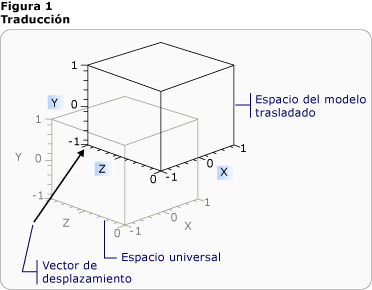
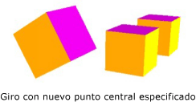
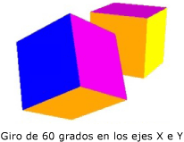

# Información general sobre transformaciones de modelos 3D3-D Transformations Overview
En este tema se describe cómo aplicar las transformaciones a los modelos 3D del sistema de gráficos de [!INCLUDE[TLA#tla_winclient](../../../../includes/tlasharptla-winclient-md.md)].This topic describes how to apply transformations to 3-D models in the [!INCLUDE[TLA#tla_winclient](../../../../includes/tlasharptla-winclient-md.md)] graphics system. Las transformaciones permiten que el desarrollador cambie la posición y el tamaño de los modelos, así como que los vuelva a orientar sin cambiar los valores base que los definen.Transformations allow the developer to reposition, resize, and reorient models without changing the base values that define them.  

## Espacio de coordenadas 3D3-D Coordinate Space  
 el contenido de gráficos 3D de [!INCLUDE[TLA#tla_winclient](../../../../includes/tlasharptla-winclient-md.md)] se encapsula en un elemento, <xref:System.Windows.Controls.Viewport3D>, que puede participar en la estructura de elementos bidimensionales.3-D graphics content in [!INCLUDE[TLA#tla_winclient](../../../../includes/tlasharptla-winclient-md.md)] is encapsulated in an element, <xref:System.Windows.Controls.Viewport3D>, that can participate in the two-dimensional element structure. El sistema de gráficos trata los objetos Viewport3D como elementos visuales bidimensionales, al igual que ocurre con muchos otros elementos de [!INCLUDE[TLA#tla_winclient](../../../../includes/tlasharptla-winclient-md.md)].The graphics system treats Viewport3D as a two-dimensional visual element like many others in [!INCLUDE[TLA#tla_winclient](../../../../includes/tlasharptla-winclient-md.md)]. Viewport3D funciona como ventana (una ventanilla) de una escena tridimensional.Viewport3D functions as a window—a viewport—into a three-dimensional scene. Más concretamente, es una superficie en la que se proyecta una escena 3D.More accurately, it is a surface on which a 3-D scene is projected.  Aunque puede usar Viewport3D con otros objetos de dibujo 2D en el mismo gráfico de escena, no puede interpenetrar objetos 2D y 3D en un Viewport3D.Although you can use Viewport3D with other 2-D drawing objects in the same scene graph, you cannot interpenetrate 2-D and 3-D objects within a Viewport3D. El elemento Viewport3D contiene el espacio de coordenadas descrito en la siguiente descripción.In the following discussion, the coordinate space described is contained by the Viewport3D element.  
  
 El sistema de coordenadas de [!INCLUDE[TLA#tla_winclient](../../../../includes/tlasharptla-winclient-md.md)] para gráficos 2D localiza el origen en la parte superior izquierda de la superficie de representación (que suele ser la pantalla).The [!INCLUDE[TLA#tla_winclient](../../../../includes/tlasharptla-winclient-md.md)] coordinate system for 2-D graphics locates the origin in the upper left of the rendering surface (typically the screen). En el sistema 2D, los valores positivos del eje X se extienden hacia la derecha, y los valores positivos del eje Y se extienden hacia abajo.In the 2-D system, positive x-axis values proceed to the right and positive y-axis values proceed downward. En el sistema de coordenadas 3D, sin embargo, el origen se encuentra en el centro del área de la pantalla, los valores positivos del eje X se extienden hacia la derecha, los del eje Y, hacia arriba (no hacia abajo) y los del eje Z, hacia el exterior partiendo del origen; es decir, hacia el lector.In the 3-D coordinate system, however, the origin is located in the center of the screen, with positive x-axis values proceeding to the right but positive y-axis values proceeding upward instead, and positive z-axis values proceeding outward from the origin, toward the viewer.  
  
   
Coordinación de la comparación de sistemasCoordinate System Comparison  
  
 El espacio definido por estos ejes es el marco estático de referencia para los objetos 3D en [!INCLUDE[TLA#tla_winclient](../../../../includes/tlasharptla-winclient-md.md)].The space defined by these axes is the stationary frame of reference for 3-D objects in [!INCLUDE[TLA#tla_winclient](../../../../includes/tlasharptla-winclient-md.md)]. Cuando se generan modelos en este espacio y se crean luces y cámaras para verlos, es útil distinguir este marco estático de referencia, o "espacio universal", del marco de referencia local creado para cada modelo al aplicarle transformaciones.As you build models in this space and create lights and cameras to view them, it's helpful to distinguish this stationary frame of reference, or "world space," from the local frame of reference you create for each model when you apply transformations to it. Recuerde también que los objetos del espacio universal podrían parecer completamente diferentes, o incluso no verse en absoluto, dependiendo de la configuración de las luces y la cámara, pero que la posición de la cámara no cambia la ubicación de los objetos en el espacio universal.Remember also that objects in world space might look entirely different, or not be visible at all, depending on light and camera settings, but the position of the camera does not change the location of objects in world space.  
  
## Transformación de modelosTransforming Models  
 Al crear modelos, estos tienen una ubicación determinada en la escena.When you create models, they have a particular location in the scene. Para mover esos modelos por la escena, girarlos o cambiar su tamaño, no es práctico cambiar los vértices que definen los propios modelos.To move those models around in the scene, to rotate them, or to change their size, it's not practical to change the vertices that define the models themselves. En lugar de ello, al igual que en 2D, se aplican transformaciones a los modelos.Instead, just as in 2-D, you apply transformations to models.  
  
 Cada objeto de modelo tiene una propiedad <xref:System.Windows.Media.Media3D.Model3D.Transform%2A> con la que puede desplace, vuelva a orientar o cambiar el tamaño del modelo.Each model object has a <xref:System.Windows.Media.Media3D.Model3D.Transform%2A> property with which you can move, re-orient, or resize the model. Al aplicar una transformación, en realidad lo que se hace es desplazar todos los puntos del modelo según un vector o valor especificado por la transformación.When you apply a transform, you effectively offset all the points of the model by whatever vector or value is specified by the transform. Es decir, se transforma el espacio de coordenadas en el que se ha definido el modelo ("espacio del modelo"), pero no se cambian los valores que constituyen la geometría del modelo en el sistema de coordenadas de la escena completa ("espacio universal").In other words, you've transformed the coordinate space in which the model is defined ("model space"), but you haven't changed the values that make up the model's geometry in the coordinate system of the entire scene ("world space").  
  
## Transformaciones de la traslaciónTranslation Transformations  
 las transformaciones 3D heredan de la clase base abstracta <xref:System.Windows.Media.Media3D.Transform3D>; entre ellas se incluyen las clases de transformación afín <xref:System.Windows.Media.Media3D.TranslateTransform3D>, <xref:System.Windows.Media.Media3D.ScaleTransform3D>y <xref:System.Windows.Media.Media3D.RotateTransform3D>.3-D transformations inherit from the abstract base class <xref:System.Windows.Media.Media3D.Transform3D>; these include the affine transform classes <xref:System.Windows.Media.Media3D.TranslateTransform3D>, <xref:System.Windows.Media.Media3D.ScaleTransform3D>, and <xref:System.Windows.Media.Media3D.RotateTransform3D>. El [!INCLUDE[TLA#tla_winclient](../../../../includes/tlasharptla-winclient-md.md)] sistema 3D también proporciona una clase <xref:System.Windows.Media.Media3D.MatrixTransform3D> que le permite especificar las mismas transformaciones en operaciones de matriz más concisas.The [!INCLUDE[TLA#tla_winclient](../../../../includes/tlasharptla-winclient-md.md)] 3-D system also provides a <xref:System.Windows.Media.Media3D.MatrixTransform3D> class that lets you specify the same transformations in more concise matrix operations.  
  
 <xref:System.Windows.Media.Media3D.TranslateTransform3D> mueve todos los puntos del Model3D en la dirección del vector de desplazamiento que especifique con las propiedades <xref:System.Windows.Media.Media3D.TranslateTransform3D.OffsetX%2A>, <xref:System.Windows.Media.Media3D.TranslateTransform3D.OffsetY%2A>y <xref:System.Windows.Media.Media3D.TranslateTransform3D.OffsetZ%2A>.<xref:System.Windows.Media.Media3D.TranslateTransform3D> moves all the points in the Model3D in the direction of the offset vector you specify with the <xref:System.Windows.Media.Media3D.TranslateTransform3D.OffsetX%2A>, <xref:System.Windows.Media.Media3D.TranslateTransform3D.OffsetY%2A>, and <xref:System.Windows.Media.Media3D.TranslateTransform3D.OffsetZ%2A> properties. Por ejemplo, dado un vértice de un cubo en (2,2,2), un vector de desplazamiento de (0,1.6,1) movería el vértice (2,2,2) a (2,3.6,3).For example, given one vertex of a cube at (2,2,2), an offset vector of (0,1.6,1) would move that vertex (2,2,2) to (2,3.6,3). El vértice del cubo sigue siendo (2,2,2) en el espacio del modelo, pero ahora dicho espacio ha cambiado su relación al espacio universal, de tal forma que (2,2,2) en el espacio del modelo es (2,3.6,3) en el espacio universal.The cube's vertex is still (2,2,2) in model space, but now that model space has changed its relationship to world space so that (2,2,2) in model space is (2,3.6,3) in world space.  
  
   
Traslación con desplazamientoTranslation with Offset  
  
 En los ejemplos de código siguientes se muestra cómo aplicar una traslación.The following code examples show how to apply a translation.  
  
 [!code-xaml[animation3dgallery_snip#Translation3DAnimationExampleWholePage](~/samples/snippets/csharp/VS_Snippets_Wpf/Animation3DGallery_snip/CS/Translation3DAnimationExample.xaml#translation3danimationexamplewholepage)]  
  
## Transformaciones de escalaScale Transformations  
 <xref:System.Windows.Media.Media3D.ScaleTransform3D> cambia la escala del modelo en un vector de escala especificado con referencia a un punto central.<xref:System.Windows.Media.Media3D.ScaleTransform3D> changes the model's scale by a specified scale vector with reference to a center point. Especifique una escala uniforme, que escala el modelo mediante el mismo valor en los ejes X, Y y Z, para cambiar proporcionalmente el tamaño del modelo.Specify a uniform scale, which scales the model by the same value in the X, Y, and Z axes, to change the model's size proportionally. Por ejemplo, si se establecen las propiedades <xref:System.Windows.Media.ScaleTransform.ScaleX%2A>, <xref:System.Windows.Media.ScaleTransform.ScaleY%2A>y <xref:System.Windows.Media.Media3D.ScaleTransform3D.ScaleZ%2A> de la transformación en 0,5 a la mitad del tamaño del modelo; al establecer las mismas propiedades en 2, se duplica su escala en los tres ejes.For example, setting the transform's <xref:System.Windows.Media.ScaleTransform.ScaleX%2A>, <xref:System.Windows.Media.ScaleTransform.ScaleY%2A>, and <xref:System.Windows.Media.Media3D.ScaleTransform3D.ScaleZ%2A> properties to 0.5 halves the size of the model; setting the same properties to 2 doubles its scale in all three axes.  
  
   
Ejemplo de ScaleVectorScaleVector Example  
  
 Si se especifica una transformación de escala no uniforme (una transformación de escala cuyos valores X, Y y Z no son iguales), se puede provocar el estiramiento o la contracción del modelo en una o dos dimensiones sin afectar el resto.By specifying a non-uniform scale transformation—a scale transformation whose X, Y, and Z values are not all the same—you can cause a model to stretch or contract in one or two dimensions without affecting the others. Por ejemplo, si se establece <xref:System.Windows.Media.ScaleTransform.ScaleX%2A> en 1, <xref:System.Windows.Media.ScaleTransform.ScaleY%2A> en 2 y <xref:System.Windows.Media.Media3D.ScaleTransform3D.ScaleZ%2A> en 1, el modelo transformado se duplicará en alto, pero permanecerá sin cambios a lo largo de los ejes X y Z.For example, setting <xref:System.Windows.Media.ScaleTransform.ScaleX%2A> to 1, <xref:System.Windows.Media.ScaleTransform.ScaleY%2A> to 2, and <xref:System.Windows.Media.Media3D.ScaleTransform3D.ScaleZ%2A> to 1 would cause the transformed model to double in height but remain unchanged along the X and Z axes.  
  
 De forma predeterminada, ScaleTransform3D provoca la expansión o contracción de los vértices en el origen (0,0,0).By default, ScaleTransform3D causes vertices to expand or contract about the origin (0,0,0). Sin, embargo, si el modelo que desea transformar no se dibuja partiendo del origen, al escalar el modelo a partir del origen, no se escalará el modelo "en contexto".If the model you want to transform is not drawn from the origin, however, scaling the model from the origin will not scale the model "in place." En su lugar, cuando se multiplican los vértices del modelo por el vector de escala, la operación de la escala tendrá el efecto de trasladar y escalar el modelo.Instead, when the model's vertices are multiplied by the scale vector, the scale operation will have the effect of translating the model as well as scaling it.  
  
   
Ejemplo de ScaleCenterScale Center Example  
  
 Para escalar un modelo "en contexto", especifique el centro del modelo mediante el establecimiento de las propiedades ScaleTransform3D's <xref:System.Windows.Media.ScaleTransform.CenterX%2A>, <xref:System.Windows.Media.ScaleTransform.CenterY%2A>y <xref:System.Windows.Media.Media3D.ScaleTransform3D.CenterZ%2A>.To scale a model "in place," specify the center of the model by setting the ScaleTransform3D's <xref:System.Windows.Media.ScaleTransform.CenterX%2A>, <xref:System.Windows.Media.ScaleTransform.CenterY%2A>, and <xref:System.Windows.Media.Media3D.ScaleTransform3D.CenterZ%2A> properties. Esto garantiza que el sistema de gráficos escale el espacio del modelo y, a continuación, lo traduce al centro en el <xref:System.Windows.Media.Media3D.Point3D>especificado.This ensures that the graphics system scales the model space and then translates it to center on the specified <xref:System.Windows.Media.Media3D.Point3D>. A la inversa, si ha creado el modelo en el origen y especifica un punto central diferente, espere ver el modelo trasladado fuera del origen.Conversely, if you've built the model about the origin and specify a different center point, expect to see the model translated away from the origin.  
  
## Transformaciones de giroRotation Transformations  
 Puede girar un modelo 3D de varias maneras diferentes.You can rotate a model in 3-D in several different ways. Una transformación de giro típica especifica un eje y un ángulo de giro alrededor de ese eje.A typical rotation transformation specifies an axis and an angle of rotation around that axis. La clase <xref:System.Windows.Media.Media3D.RotateTransform3D> permite definir un <xref:System.Windows.Media.Media3D.Rotation3D> con su propiedad <xref:System.Windows.Media.Media3D.RotateTransform3D.Rotation%2A>.The <xref:System.Windows.Media.Media3D.RotateTransform3D> class allows you to define a <xref:System.Windows.Media.Media3D.Rotation3D> with its <xref:System.Windows.Media.Media3D.RotateTransform3D.Rotation%2A> property. A continuación, especifique <xref:System.Windows.Media.Media3D.AxisAngleRotation3D.Axis%2A> y <xref:System.Windows.Media.Media3D.AxisAngleRotation3D.Angle%2A> propiedades en el Rotation3D, en este caso un <xref:System.Windows.Media.Media3D.AxisAngleRotation3D>, para definir la transformación.You then specify <xref:System.Windows.Media.Media3D.AxisAngleRotation3D.Axis%2A> and <xref:System.Windows.Media.Media3D.AxisAngleRotation3D.Angle%2A> properties on the Rotation3D, in this case an <xref:System.Windows.Media.Media3D.AxisAngleRotation3D>, to define the transformation. En los ejemplos siguientes se gira un modelo 60 grados sobre el eje Y.The following examples rotate a model by 60 degrees around the Y axis.  
  
 [!code-xaml[animation3dgallery_snip#Rotate3DUsingAxisAngleRotation3DExampleWholePage](~/samples/snippets/csharp/VS_Snippets_Wpf/Animation3DGallery_snip/CS/Rotat3DUsingAxisAngleRotation3DExample.xaml#rotate3dusingaxisanglerotation3dexamplewholepage)]  
  
 Nota: 3D de [!INCLUDE[TLA#tla_winclient](../../../../includes/tlasharptla-winclient-md.md)] es un sistema a la derecha, es decir, un valor angular positivo de un giro tiene como resultado un giro en el sentido contrario a las agujas del reloj sobre el eje.Note:[!INCLUDE[TLA#tla_winclient](../../../../includes/tlasharptla-winclient-md.md)] 3-D is a right-handed system, which means that a positive angle value for a rotation results in a counter-clockwise rotation about the axis.  
  
 Los giros angulares de eje suponen una rotación sobre el origen si no se especifica un valor para las propiedades <xref:System.Windows.Media.Media3D.RotateTransform3D.CenterX%2A>, <xref:System.Windows.Media.Media3D.RotateTransform3D.CenterY%2A>y <xref:System.Windows.Media.Media3D.RotateTransform3D.CenterZ%2A> en RotateTransform3D.Axis-angle rotations assume rotation about the origin if a value is not specified for the <xref:System.Windows.Media.Media3D.RotateTransform3D.CenterX%2A>, <xref:System.Windows.Media.Media3D.RotateTransform3D.CenterY%2A>, and <xref:System.Windows.Media.Media3D.RotateTransform3D.CenterZ%2A> properties on RotateTransform3D. Como ocurre con el escalado, es útil recordar que el giro transforma el espacio de coordenadas de todo el modelo.As with scaling, it's helpful to remember that the rotation transforms the model's entire coordinate space. Si el modelo no se creó sobre el origen, o se ha trasladado previamente, el giro podría "pivotar" sobre el origen en lugar de girar en contexto.If the model was not created about the origin, or has been translated previously, the rotation might "pivot" about the origin instead of rotating in place.  
  
   
Rotation con nuevo centro especificadoRotation with new center specified  
  
 Para girar el modelo "en contexto", especifique el centro real del modelo como el centro de giro.To rotate the model "in place," specify the model's actual center as the center of rotation. Puesto que la geometría se suele modelar en el origen, la mayor parte de las veces puede obtener el resultado esperado de un conjunto de transformaciones si primero ajusta el tamaño del modelo (lo escala), después establece su orientación (lo gira) y, finalmente, lo mueve a la ubicación deseada (lo traslada).Because geometry is typically modeled about the origin, you can most often get the expected result of a set of transformations by first sizing the model (scaling it), then setting its orientation (rotating it), and finally moving it to the desired location (translating it).  
  
   
Ejemplo de giroRotation Example  
  
 Los giros angulares sobre el eje funcionan bien para las transformaciones estáticas y algunas animaciones.Axis-angle rotations work well for static transformations and some animations. Sin embargo, considere girar un modelo de cubo 60 grados sobre el eje X y luego 45 grados sobre el eje Z.However, consider rotating a cube model 60 degrees around the X axis, then 45 degrees around the Z axis. Puede describir esta transformación como dos transformaciones afines discretas o como matriz.You can describe this transformation as two discrete affine transformations, or as a matrix. Sin embargo, quizá sea difícil animar un giro definido así de forma continua.However, it might be difficult to smoothly animate a rotation defined this way. Aunque las posiciones inicial y final del modelo, calculadas mediante cualquiera de los enfoque son las mismas, varía el cálculo de las posiciones intermedias tomadas por el modelo.Although the beginning and ending positions of the model computed by either approach are the same, the intermediate positions taken by the model are computationally uncertain. Los cuaterniones representan una forma alternativa de calcular la interpolación entre el inicio y el fin de un giro.Quaternions represent an alternative way to compute the interpolation between the start and end of a rotation.  
  
 Un cuaternión representa un eje en el espacio 3D y un giro alrededor de ese eje.A quaternion represents an axis in 3-D space and a rotation around that axis. Por ejemplo, un cuaternión podría representar un eje (1,1,2) y un giro de 50 grados.For example, a quaternion might represent a (1,1,2) axis and a rotation of 50 degrees. La capacidad de los cuaterniones al definir los giros procede de las dos operaciones que puede realizar en ellos: composición e interpolación.Quaternions’ power in defining rotations comes from the two operations that you can perform on them: composition and interpolation. La composición de dos cuaterniones aplicada a una geometría significa "girar la geometría sobre el eje2 mediante giro2, después girarla sobre el eje1 mediante giro1".The composition of two quaternions applied to a geometry means "rotate the geometry around axis2 by rotation2, then rotate it around axis1 by rotation1." Utilizando la composición, puede combinar los dos giros en la geometría para obtener un solo cuaternión que representa el resultado.By using composition, you can combine the two rotations on the geometry to get a single quaternion that represents the result. Puesto que la interpolación del cuaternión puede calcular una ruta de acceso continuada y correcta desde un eje y la orientación a otro, puede interpolar desde el cuaternión original al compuesto para lograr una transición continuada de uno a otro, permitiéndole animar la transformación.Because quaternion interpolation can calculate a smooth and reasonable path from one axis and orientation to another, you can interpolate from the original to the composed quaternion to achieve a smooth transition from one to the other, enabling you to animate the transformation. En el caso de los modelos que desea animar, puede especificar un <xref:System.Windows.Media.Media3D.Quaternion> de destino para la rotación mediante el uso de un <xref:System.Windows.Media.Media3D.QuaternionRotation3D> para la propiedad <xref:System.Windows.Media.Media3D.RotateTransform3D.Rotation%2A>.For models that you want to animate, you can specify a destination <xref:System.Windows.Media.Media3D.Quaternion> for the rotation by using a <xref:System.Windows.Media.Media3D.QuaternionRotation3D> for the <xref:System.Windows.Media.Media3D.RotateTransform3D.Rotation%2A> property.  
  
## Uso de colecciones de transformacionesUsing Transformation Collections  
 Al crear una escena, es normal aplicar más de una transformación a un modelo.When building a scene, it's common to apply more than one transformation to a model. Agregue transformaciones a la colección de <xref:System.Windows.Media.Media3D.Transform3DGroup.Children%2A> de la clase <xref:System.Windows.Media.Media3D.Transform3DGroup> para agrupar las transformaciones para que se apliquen a varios modelos de la escena.Add transforms to the <xref:System.Windows.Media.Media3D.Transform3DGroup.Children%2A> collection of the <xref:System.Windows.Media.Media3D.Transform3DGroup> class to group transforms conveniently to apply to various models in the scene. A menudo es conveniente volver a usar una transformación en varios grupos diferentes, de la misma forma que puede volver a usar un modelo aplicando un conjunto diferente de transformaciones a cada instancia.It's often convenient to reuse a transformation in several different groups, in much the way that you can reuse a model by applying a different set of transforms to each instance. Observe que el orden en el que las transformaciones se agregan a la colección es importante: las transformaciones de la colección se aplican de la primera a la última.Note that order in which the transformations are added to the collection is significant: transforms in the collection are applied from first to last.  
  
## Animación de transformacionesAnimating Transformations  
 La implementación 3-D en [!INCLUDE[TLA#tla_winclient](../../../../includes/tlasharptla-winclient-md.md)] utiliza el mismo sistema de control de tiempo y animación que los gráficos 2D.The [!INCLUDE[TLA#tla_winclient](../../../../includes/tlasharptla-winclient-md.md)] 3-D implementation participates in the same timing and animation system as 2-D graphics. En otras palabras, para animar una escena 3D, se animan las propiedades de sus modelos.In other words, to animate a 3-D scene, animate the properties of its models. Es posible animar directamente las propiedades de los elementos primitivos, pero suele ser más fácil animar las transformaciones que cambian la posición o el aspecto de los modelos.It's possible to animate properties of primitives directly, but it's typically easier to animate transformations that change the position or appearance of models. Dado que las transformaciones se pueden aplicar a los objetos de <xref:System.Windows.Media.Media3D.Model3DGroup>, así como a los modelos individuales, es posible aplicar un conjunto de animaciones a los elementos secundarios de un Model3Dgroup y otro conjunto de animaciones a un grupo de objetos.Because transformations can be applied to <xref:System.Windows.Media.Media3D.Model3DGroup> objects as well as individual models, it's possible to apply one set of animations to the children of a Model3Dgroup and another set of animations to a group of objects.  Para información general sobre el sistema de control de tiempo y animación de [!INCLUDE[TLA#tla_winclient](../../../../includes/tlasharptla-winclient-md.md)], consulte los temas [Información general sobre animaciones](animation-overview.md) e [Información general sobre objetos Storyboard](storyboards-overview.md).For background information on the [!INCLUDE[TLA#tla_winclient](../../../../includes/tlasharptla-winclient-md.md)] timing and animation system, see [Animation Overview](animation-overview.md) and [Storyboards Overview](storyboards-overview.md).  
  
 Para animar un objeto en [!INCLUDE[TLA#tla_winclient](../../../../includes/tlasharptla-winclient-md.md)], se crea una escala de tiempo, se define una animación (que, en realidad, es un cambio de algún valor de propiedad a lo largo del tiempo) y se especifica la propiedad a la que aplicar la animación.To animate an object in [!INCLUDE[TLA#tla_winclient](../../../../includes/tlasharptla-winclient-md.md)], create a timeline, define an animation (which is really a change in some property value over time), and specify the property to which to apply the animation. Esta propiedad debe ser una propiedad de FrameworkElement.This property must be a property of a FrameworkElement. Dado que todos los objetos de una escena 3D son elementos secundarios de Viewport3D, las propiedades de destino de cualquier animación que desea aplicar a la escena son propiedades de propiedades de Viewport3D.Because all the objects in a 3-D scene are children of Viewport3D, the properties targeted by any animation you want to apply to the scene are properties of properties of Viewport3D. Es importante obtener la ruta de acceso de la propiedad de la animación correctamente, ya que la sintaxis puede ser prolija.It's important to work out the property path for the animation carefully, because the syntax can be verbose.  
  
 Suponga que desea girar un objeto en contexto, pero también aplicar un movimiento oscilante para que se vean más partes del objeto.Suppose you want to rotate an object in place, but also to apply a swinging motion to expose more of the object to view. Podría aplicar RotateTransform3D al modelo y animar el eje de giro de un vector a otro.You might choose to apply a RotateTransform3D to the model, and animate the axis of its rotation from one vector to another. En el ejemplo de código siguiente se muestra cómo aplicar un <xref:System.Windows.Media.Animation.Vector3DAnimation> a la propiedad AXIS del Rotation3D de la transformación, suponiendo que el RotateTransform3D sea una de las diversas transformaciones aplicadas al modelo con un <xref:System.Windows.Media.TransformGroup>.The following code example demonstrates applying a <xref:System.Windows.Media.Animation.Vector3DAnimation> to the Axis property of the transformation's Rotation3D, assuming the RotateTransform3D to be one of several transforms applied to the model with a <xref:System.Windows.Media.TransformGroup>.  
  
 [!code-csharp[3doverview#3DOverview3DN1](~/samples/snippets/csharp/VS_Snippets_Wpf/3DOverview/CSharp/Window1.xaml.cs#3doverview3dn1)]
 [!code-vb[3doverview#3DOverview3DN1](~/samples/snippets/visualbasic/VS_Snippets_Wpf/3DOverview/visualbasic/window1.xaml.vb#3doverview3dn1)]  
  
 [!code-csharp[3doverview#3DOverview3DN3](~/samples/snippets/csharp/VS_Snippets_Wpf/3DOverview/CSharp/Window1.xaml.cs#3doverview3dn3)]
 [!code-vb[3doverview#3DOverview3DN3](~/samples/snippets/visualbasic/VS_Snippets_Wpf/3DOverview/visualbasic/window1.xaml.vb#3doverview3dn3)]  
  
 Utilice una sintaxis similar para que otras propiedades de la transformación muevan o escalen el objeto.Use a similar syntax to target other transformation properties to move or scale the object.  Por ejemplo, puede aplicar un <xref:System.Windows.Media.Animation.Point3DAnimation> a la propiedad ScaleCenter de una transformación de escala para hacer que un modelo distorsione suavemente su forma.For example, you might apply a <xref:System.Windows.Media.Animation.Point3DAnimation> to the ScaleCenter property on a scale transform to cause a model to smoothly distort its shape.  
  
 Aunque los ejemplos anteriores transforman las propiedades de <xref:System.Windows.Media.Media3D.GeometryModel3D>, también es posible transformar las propiedades de otros modelos de la escena.Although the preceding examples transform the properties of <xref:System.Windows.Media.Media3D.GeometryModel3D>, it’s also possible to transform the properties of other models in the scene.  Animando traslaciones aplicadas a objetos Light, por ejemplo, puede crear luz en movimiento y efectos de sombra que pueden cambiar el aspecto de los modelos espectacularmente.By animating translations applied to Light objects, for example, you can create moving light and shadow effects that can dramatically change the appearance of your models.  
  
 Puesto que las cámaras también son modelos, igualmente se pueden transformar las propiedades de la cámara.Because cameras are also models, it’s possible to transform camera properties as well.  Aunque puede cambiar el aspecto de la escena transformando la ubicación de la cámara o las distancias de los planos (de hecho, transformando toda la proyección de la escena), tenga en cuenta que muchos de los efectos obtenidos de esta forma quizá no tengan tanto "sentido visual" para el lector como las transformaciones aplicadas a la ubicación o posición de los modelos de la escena.While you can certainly change the appearance of the scene by transforming the camera location or plane distances—in effect, transforming the entire scene projection—note that many of the effects you achieve this way may not make as much "visual sense" to the viewer as transformations applied to the location or position of the models in the scene.  
  
## Consulte tambiénSee also

- [Información general sobre gráficos 3D3-D Graphics Overview](3-d-graphics-overview.md)
- [Información general sobre transformacionesTransforms Overview](transforms-overview.md)
- [Ejemplo de transformaciones 2D2-D Transforms Sample](https://github.com/Microsoft/WPF-Samples/tree/master/Graphics/2DTransforms)
