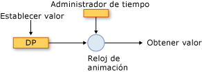
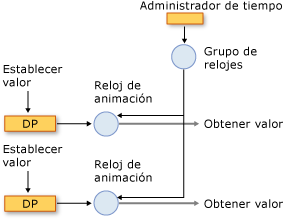
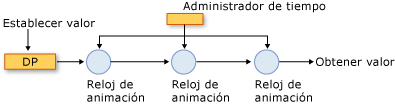

# Información general sobre sistemas de temporización y animación
En este tema se describe cómo <xref:System.Windows.Media.Animation.Timeline>el <xref:System.Windows.Media.Animation.Clock> sistema de temporización utiliza la animación, y las clases para animar propiedades.  
  

## Requisitos previos  
 Para entender este tema, debe poder utilizar animaciones [!INCLUDE[TLA2#tla_winclient](../../../../includes/tla2sharptla-winclient-md.md)] para animar propiedades, como se describe en [Información general sobre animaciones](animation-overview.md). También ayuda conocer las propiedades de dependencia; para más información, vea [Información general sobre las propiedades de dependencia](../advanced/dependency-properties-overview.md).  
  

## Escalas de tiempo y relojes  
 La [información general](animation-overview.md) <xref:System.Windows.Media.Animation.Timeline> sobre animación describe cómo a representa un <xref:System.Windows.Media.Animation.Timeline> segmento de tiempo y una animación es un tipo que produce valores de salida. Por sí <xref:System.Windows.Media.Animation.Timeline>mismo, un , no hace nada más que simplemente describir un segmento de tiempo. Es el objeto de <xref:System.Windows.Media.Animation.Clock> la línea de tiempo el que hace el trabajo real. Del mismo modo, la animación no anima realmente las propiedades: una clase de <xref:System.Windows.Media.Animation.Clock> animación describe cómo se deben calcular los valores de salida, pero es el que se creó para la animación que controla la salida de animación y la aplica a las propiedades.  
  
 A <xref:System.Windows.Media.Animation.Clock> es un tipo especial de objeto que mantiene el <xref:System.Windows.Media.Animation.Timeline>estado de tiempo de ejecución relacionado con la sincronización para el archivo . Proporciona tres bits de información que son esenciales <xref:System.Windows.Media.Animation.Clock.CurrentTime%2A> <xref:System.Windows.Media.Animation.Clock.CurrentProgress%2A>para <xref:System.Windows.Media.Animation.Clock.CurrentState%2A>el sistema de animación y sincronización: , , y . A <xref:System.Windows.Media.Animation.Clock> determina su hora actual, progreso y estado mediante los <xref:System.Windows.Media.Animation.Timeline> <xref:System.Windows.Media.Animation.Timeline.Duration%2A>comportamientos de temporización descritos por su : , <xref:System.Windows.Media.Animation.Timeline.RepeatBehavior%2A>, <xref:System.Windows.Media.Animation.Timeline.AutoReverse%2A>, , etc.  
  
 En la mayoría <xref:System.Windows.Media.Animation.Clock> de los casos, se crea automáticamente un para la línea de tiempo. Al animar mediante <xref:System.Windows.Media.Animation.Storyboard> un <xref:System.Windows.Media.Animation.Animatable.BeginAnimation%2A> método o mediante un método, los relojes se crean automáticamente para las escalas de tiempo y animaciones y se aplican a sus propiedades de destino. También puede crear <xref:System.Windows.Media.Animation.Clock> un explícitamente <xref:System.Windows.Media.Animation.Timeline.CreateClock%2A> mediante <xref:System.Windows.Media.Animation.Timeline>el método de su archivo . El <xref:System.Windows.Media.MediaTimeline.CreateClock%2A?displayProperty=nameWithType> método crea un reloj del <xref:System.Windows.Media.Animation.Timeline> tipo adecuado para el tipo en el que se llama. Si <xref:System.Windows.Media.Animation.Timeline> contiene líneas de tiempo <xref:System.Windows.Media.Animation.Clock> secundarias, también crea objetos para ellos. Los <xref:System.Windows.Media.Animation.Clock> objetos resultantes se organizan en <xref:System.Windows.Media.Animation.Timeline> árboles que coinciden con la estructura del árbol de objetos a partir del cual se crean.  
  
 Hay diferentes tipos de relojes para diferentes tipos de escalas de tiempo. En la tabla <xref:System.Windows.Media.Animation.Clock> siguiente se muestran <xref:System.Windows.Media.Animation.Timeline> los tipos que corresponden a algunos de los diferentes tipos.  
  
|Tipos de objetos Timeline|Tipo de reloj|Propósito del reloj|  
|-------------------|----------------|-------------------|  
|Animación (hereda de <xref:System.Windows.Media.Animation.AnimationTimeline>)|<xref:System.Windows.Media.Animation.AnimationClock>|Genera valores de salida para una propiedad de dependencia.|  
|<xref:System.Windows.Media.MediaTimeline>|<xref:System.Windows.Media.MediaClock>|Procesa un archivo multimedia.|  
|<xref:System.Windows.Media.Animation.ParallelTimeline>|<xref:System.Windows.Media.Animation.ClockGroup>|Agrupa y controla sus objetos secundarios <xref:System.Windows.Media.Animation.Clock>|  
|<xref:System.Windows.Media.Animation.Storyboard>|<xref:System.Windows.Media.Animation.ClockGroup>|Agrupa y controla sus objetos secundarios <xref:System.Windows.Media.Animation.Clock>|  
  
 Puede aplicar <xref:System.Windows.Media.Animation.AnimationClock> cualquier objeto que cree a <xref:System.Windows.Media.Animation.IAnimatable.ApplyAnimationClock%2A> propiedades de dependencia compatibles mediante el método.  
  
 En escenarios de rendimiento intensivo, como la animación de <xref:System.Windows.Media.Animation.Clock> un gran número de objetos similares, la administración de su propio uso puede proporcionar ventajas de rendimiento.  
  

## Los relojes y el administrador de tiempo  
 Al animar objetos en [!INCLUDE[TLA2#tla_winclient](../../../../includes/tla2sharptla-winclient-md.md)], es el <xref:System.Windows.Media.MediaPlayer.Clock%2A> administrador de tiempo que administra los objetos creados para las escalas de tiempo. El administrador de tiempo es la raíz de un árbol de objetos <xref:System.Windows.Media.MediaPlayer.Clock%2A> y controla el flujo de tiempo en ese árbol.  El administrador de tiempo se crea automáticamente para cada aplicación [!INCLUDE[TLA2#tla_winclient](../../../../includes/tla2sharptla-winclient-md.md)] y no es visible para el desarrollador de aplicaciones. El administrador de tiempo "marca pasos" muchas veces por segundo; el número real de pasos que se producen cada segundo varía, en función de los recursos disponibles en el sistema. Durante cada uno de estos ticks, el administrador <xref:System.Windows.Media.Animation.ClockState.Active> <xref:System.Windows.Media.Animation.Clock> de tiempo calcula el estado de todos los objetos del árbol de tiempo.  
  
 En la ilustración siguiente se muestra <xref:System.Windows.Media.Animation.AnimationClock>la relación entre el administrador de tiempo y , y una propiedad de dependencia animada.  
  
   
Animación de una propiedad  
  
 Cuando el administrador de tiempo marca, <xref:System.Windows.Media.Animation.ClockState.Active> <xref:System.Windows.Media.Animation.Clock> actualiza el tiempo de cada uno en la aplicación. Si <xref:System.Windows.Media.Animation.Clock> es <xref:System.Windows.Media.Animation.AnimationClock>un , <xref:System.Windows.Media.Animation.AnimationTimeline.GetCurrentValue%2A> utiliza el <xref:System.Windows.Media.Animation.AnimationTimeline> método de la a partir de la cual se creó para calcular su valor de salida actual. El <xref:System.Windows.Media.Animation.AnimationClock> proporciona <xref:System.Windows.Media.Animation.AnimationTimeline> la hora local actual, un valor de entrada, que suele ser el valor base de la propiedad y un valor de destino predeterminado. Cuando se recupera el valor de <xref:System.Windows.DependencyObject.GetValue%2A> una propiedad animada por el método <xref:System.Windows.Media.Animation.AnimationClock>o su descriptor de acceso CLR, se obtiene la salida de su archivo .  
  
#### Grupos de relojes  
 En la sección anterior se describe <xref:System.Windows.Media.Animation.Clock> cómo hay diferentes tipos de objetos para diferentes tipos de escalas de tiempo. En la ilustración siguiente se muestra <xref:System.Windows.Media.Animation.ClockGroup>la <xref:System.Windows.Media.Animation.AnimationClock>relación entre el administrador de tiempo, un , un , y una propiedad de dependencia animada. A <xref:System.Windows.Media.Animation.ClockGroup> se crea para las escalas de <xref:System.Windows.Media.Animation.Storyboard> tiempo que agrupan otras escalas de tiempo, como la clase, que agrupa animaciones y otras escalas de tiempo.  
  
   
Un objeto ClockGroup  
  
#### Composición  
 Es posible asociar varios relojes a una única propiedad, en cuyo caso cada reloj utiliza el valor de salida del reloj anterior como su valor base. En la ilustración siguiente se muestran tres <xref:System.Windows.Media.Animation.AnimationClock> objetos aplicados a la misma propiedad. El reloj1 utiliza el valor base de la propiedad animada como entrada y lo utiliza para generar la salida. El reloj2 toma la salida del reloj1 como entrada y lo utiliza para generar la salida. El reloj3 toma la salida del reloj2 como entrada y lo utiliza para generar la salida. Cuando varios relojes afectan simultáneamente a la misma propiedad, se dice que están en una cadena de composición.  
  
   
Una cadena de composición  
  
 Tenga en cuenta que aunque se crea <xref:System.Windows.Media.Animation.AnimationClock> una relación entre la entrada y salida de los objetos de la cadena de composición, sus comportamientos de temporización no se ven afectados; <xref:System.Windows.Media.Animation.Clock> los objetos (incluidos <xref:System.Windows.Media.Animation.AnimationClock> los objetos) tienen una dependencia jerárquica de sus objetos primarios. <xref:System.Windows.Media.Animation.Clock>  
  
 Para aplicar varios relojes a la <xref:System.Windows.Media.Animation.HandoffBehavior.Compose> <xref:System.Windows.Media.Animation.HandoffBehavior> misma propiedad, <xref:System.Windows.Media.Animation.Storyboard>utilice la <xref:System.Windows.Media.Animation.AnimationClock>opción al aplicar un , animación o .  
  
#### Pasos y consolidación de eventos  
 Además de calcular valores de salida, el administrador de tiempo hace otras cosas a cada paso que marca: determina el estado de cada reloj y genera los eventos adecuados.  
  
 Aunque los ciclos se producen con frecuencia, pueden ocurrir muchas cosas entre ellos. Por ejemplo, <xref:System.Windows.Media.Animation.Clock> un podría detenerse, iniciarse y detenerse <xref:System.Windows.Media.Animation.Clock.CurrentState%2A> de nuevo, en cuyo caso su valor habrá cambiado tres veces. En teoría, <xref:System.Windows.Media.Animation.Clock.CurrentStateInvalidated> el evento podría generarse varias veces en un solo tick; sin embargo, el motor de <xref:System.Windows.Media.Animation.Clock.CurrentStateInvalidated> sincronización consolida los eventos, de modo que el evento se puede generar como máximo una vez por tick. Esto es cierto para todos los eventos de sincronización: como <xref:System.Windows.Media.Animation.Clock> máximo, se genera un evento de cada tipo para un objeto determinado.  
  
 Cuando <xref:System.Windows.Media.Animation.Clock> un modificador indica y vuelve a su estado original <xref:System.Windows.Media.Animation.ClockState.Active> entre <xref:System.Windows.Media.Animation.ClockState.Stopped> ticks <xref:System.Windows.Media.Animation.ClockState.Active>(por ejemplo, cambiar de a y de vuelta a ), el evento asociado sigue apareciendo.  
  
 Para más información acerca de los eventos de control de tiempo, vea [Información general sobre eventos de control de tiempo](timing-events-overview.md).  
  

## Valores actuales y valores base de propiedades  
 Una propiedad que se pueda animar puede tener dos valores: un valor base y un valor actual. Cuando se establece la propiedad <xref:System.Windows.DependencyObject.SetValue%2A> mediante su descriptor de acceso CLR o el método, se establece su valor base. Cuando no se anima una propiedad, su valor base y su valor actual son el mismo.  
  
 Al animar una propiedad, establece el <xref:System.Windows.Media.Animation.AnimationClock> valor *actual* de la propiedad. Recuperar el valor de la propiedad a <xref:System.Windows.DependencyObject.GetValue%2A> través de <xref:System.Windows.Media.Animation.AnimationClock> su <xref:System.Windows.Media.Animation.AnimationClock> descriptor <xref:System.Windows.Media.Animation.ClockState.Active> de acceso CLR o el método devuelve la salida de la cuando es o <xref:System.Windows.Media.Animation.ClockState.Filling>. Puede recuperar el valor base de <xref:System.Windows.Media.Animation.IAnimatable.GetAnimationBaseValue%2A> la propiedad mediante el método.  
  
## Consulte también

- [Información general sobre animaciones](animation-overview.md)
- [Información general sobre eventos de control de tiempo](timing-events-overview.md)
- [Información general sobre comportamientos de control de tiempo](timing-behaviors-overview.md)
