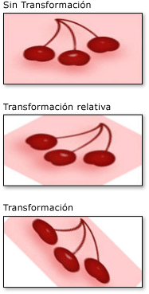

# Información general sobre la transformación de pincelesBrush Transformation Overview
La clase Brush proporciona dos propiedades de transformación: <xref:System.Windows.Media.Brush.Transform%2A> y <xref:System.Windows.Media.Brush.RelativeTransform%2A>.The Brush class provides two transformation properties: <xref:System.Windows.Media.Brush.Transform%2A> and <xref:System.Windows.Media.Brush.RelativeTransform%2A>. Las propiedades permiten girar, escalar, sesgar y trasladar el contenido de un pincel.The properties enable you to rotate, scale, skew, and translate a brush's contents. En este tema se describen las diferencias entre estas dos propiedades y proporciona ejemplos de su uso.This topic describes the differences between these two properties and provides examples of their usage.  
  
   
## PrerequisitesPrerequisites  
 Para entender este tema, debe entender las características del pincel que se va a transformar.To understand this topic, you should understand the features of the brush that you are transforming. Para obtener <xref:System.Windows.Media.LinearGradientBrush> y <xref:System.Windows.Media.RadialGradientBrush>, consulte la [información general sobre el dibujo con colores sólidos y degradados](painting-with-solid-colors-and-gradients-overview.md).For <xref:System.Windows.Media.LinearGradientBrush> and <xref:System.Windows.Media.RadialGradientBrush>, see the [Painting with Solid Colors and Gradients Overview](painting-with-solid-colors-and-gradients-overview.md). Por <xref:System.Windows.Media.ImageBrush>, <xref:System.Windows.Media.DrawingBrush>o <xref:System.Windows.Media.VisualBrush>, vea [pintar con imágenes, dibujos y objetos visuales](painting-with-images-drawings-and-visuals.md).For <xref:System.Windows.Media.ImageBrush>, <xref:System.Windows.Media.DrawingBrush>, or <xref:System.Windows.Media.VisualBrush>, see  [Painting with Images, Drawings, and Visuals](painting-with-images-drawings-and-visuals.md). También debe estar familiarizado con las transformaciones 2D descritas en [Información general sobre transformaciones](transforms-overview.md).You should also be familiar with the 2D transforms described in the  [Transforms Overview](transforms-overview.md).  
  
   
## Diferencias entre las propiedades Transform y RelativeTransformDifferences between the Transform and RelativeTransform Properties  
 Al aplicar una transformación a la propiedad <xref:System.Windows.Media.Brush.Transform%2A> de un pincel, debe conocer el tamaño del área pintada si desea transformar el contenido del pincel sobre su centro.When you apply a transform to a brush's <xref:System.Windows.Media.Brush.Transform%2A> property, you need to know the size of the painted area if you want to transform the brush contents about its center. Supongamos que el área pintada tiene 200 píxeles independientes del dispositivo de ancho y 150 de alto.Suppose the painted area is 200 device independent pixels wide and 150 tall.  Si ha usado una <xref:System.Windows.Media.RotateTransform> para rotar la salida del pincel 45 grados sobre su centro, deberá asignar a la <xref:System.Windows.Media.RotateTransform> un <xref:System.Windows.Media.RotateTransform.CenterX%2A> de 100 y un <xref:System.Windows.Media.RotateTransform.CenterY%2A> de 75.If you used a <xref:System.Windows.Media.RotateTransform> to rotate the brush's output 45 degrees about its center, you'd give the <xref:System.Windows.Media.RotateTransform> a <xref:System.Windows.Media.RotateTransform.CenterX%2A> of 100 and a <xref:System.Windows.Media.RotateTransform.CenterY%2A> of 75.  
  
 Al aplicar una transformación a la propiedad <xref:System.Windows.Media.Brush.RelativeTransform%2A> de un pincel, esa transformación se aplica al pincel antes de que su salida se asigne al área pintada.When you apply a transform to a brush's <xref:System.Windows.Media.Brush.RelativeTransform%2A> property, that transform is applied to the brush before its output is mapped to the painted area. En la lista siguiente se describe el orden en el que se procesan y transforman los contenidos de un pincel.The following list describes the order in which a brush’s contents are processed and transformed.  
  
1. Procese el contenido del pincel.Process the brush’s contents. Para un <xref:System.Windows.Media.GradientBrush>, esto significa determinar el área de degradado.For a <xref:System.Windows.Media.GradientBrush>, this means determining the gradient area. Para un <xref:System.Windows.Media.TileBrush>, el <xref:System.Windows.Media.TileBrush.Viewbox%2A> se asigna a la <xref:System.Windows.Media.TileBrush.Viewport%2A>.For a <xref:System.Windows.Media.TileBrush>, the <xref:System.Windows.Media.TileBrush.Viewbox%2A> is mapped to the <xref:System.Windows.Media.TileBrush.Viewport%2A>. Esto se convierte en la salida del pincel.This becomes the brush’s output.  
  
2. Proyecte la salida del pincel en el rectángulo de transformación de 1 x 1.Project the brush’s output onto the 1 x 1 transformation rectangle.  
  
3. Aplique el <xref:System.Windows.Media.Brush.RelativeTransform%2A>del pincel, si lo tiene.Apply the brush’s <xref:System.Windows.Media.Brush.RelativeTransform%2A>, if it has one.  
  
4. Proyecte la salida transformada en el área que se va a pintar.Project the transformed output onto the area to paint.  
  
5. Aplique el <xref:System.Windows.Media.Transform>del pincel, si lo tiene.Apply the brush’s <xref:System.Windows.Media.Transform>, if it has one.  
  
 Dado que el <xref:System.Windows.Media.Brush.RelativeTransform%2A> se aplica mientras la salida del pincel está asignada a un rectángulo de 1 x 1, los valores del centro de transformación y del desplazamiento parecen ser relativos.Because the <xref:System.Windows.Media.Brush.RelativeTransform%2A> is applied while the brush’s output is mapped to a 1 x 1 rectangle, transform center and offset values appear to be relative. Por ejemplo, si ha usado una <xref:System.Windows.Media.RotateTransform> para girar la salida del pincel 45 grados sobre su centro, deberá asignar a la <xref:System.Windows.Media.RotateTransform> un <xref:System.Windows.Media.RotateTransform.CenterX%2A> de 0,5 y un <xref:System.Windows.Media.RotateTransform.CenterY%2A> de 0,5.For example, if you used a <xref:System.Windows.Media.RotateTransform> to rotate the brush's output 45 degrees about its center, you'd give the <xref:System.Windows.Media.RotateTransform> a <xref:System.Windows.Media.RotateTransform.CenterX%2A> of 0.5 and a <xref:System.Windows.Media.RotateTransform.CenterY%2A> of 0.5.  
  
 En la ilustración siguiente se muestra la salida de varios pinceles que se han girado en 45 grados mediante las propiedades <xref:System.Windows.Media.Brush.RelativeTransform%2A> y <xref:System.Windows.Media.Brush.Transform%2A>.The following illustration shows the output of several brushes that have been rotated by 45 degrees using the <xref:System.Windows.Media.Brush.RelativeTransform%2A> and <xref:System.Windows.Media.Brush.Transform%2A> properties.  
  
   
  
   
## Utilizar RelativeTransform con un objeto TileBrushUsing RelativeTransform with a TileBrush  
 Dado que los pinceles de mosaico son más complejos que otros pinceles, aplicar un <xref:System.Windows.Media.Brush.RelativeTransform%2A> a uno podría producir resultados inesperados.Because tile brushes are more complex than other brushes, applying a <xref:System.Windows.Media.Brush.RelativeTransform%2A> to one might produce unexpected results. Por ejemplo, veamos la imagen siguiente.For example, take the following image.  
  
   
  
 En el ejemplo siguiente se usa un <xref:System.Windows.Media.ImageBrush> para pintar un área rectangular con la imagen anterior.The following example uses an <xref:System.Windows.Media.ImageBrush> to paint a rectangular area with the preceding image. Aplica un <xref:System.Windows.Media.RotateTransform> a la propiedad <xref:System.Windows.Media.Brush.RelativeTransform%2A> del objeto <xref:System.Windows.Media.ImageBrush> y establece su propiedad <xref:System.Windows.Media.TileBrush.Stretch%2A> en <xref:System.Windows.Media.Stretch.UniformToFill>, que debe conservar la relación de aspecto de la imagen cuando se ajusta para rellenar completamente el rectángulo.It applies a <xref:System.Windows.Media.RotateTransform> to the <xref:System.Windows.Media.ImageBrush> object's <xref:System.Windows.Media.Brush.RelativeTransform%2A> property, and sets its <xref:System.Windows.Media.TileBrush.Stretch%2A> property to <xref:System.Windows.Media.Stretch.UniformToFill>, which should preserve the image's aspect ratio when it is stretched to completely fill the rectangle.  
  
 [!code-xaml[BrushOverviewExamples_snip#GraphicsMMRelativeTransformExample2Inline](~/samples/snippets/xaml/VS_Snippets_Wpf/BrushOverviewExamples_snip/XAML/RelativeTransformIllustration.xaml#graphicsmmrelativetransformexample2inline)]  
  
 En este ejemplo se produce la siguiente salida:This example produces the following output:  
  
   
  
 Observe que la imagen está distorsionada, aunque el <xref:System.Windows.Media.TileBrush.Stretch%2A> del pincel se haya establecido en <xref:System.Windows.Media.Stretch.UniformToFill>.Notice that the image is distorted, even though the brush's <xref:System.Windows.Media.TileBrush.Stretch%2A> was set to <xref:System.Windows.Media.Stretch.UniformToFill>. Esto se debe a que la transformación relativa se aplica después de que la <xref:System.Windows.Media.TileBrush.Viewbox%2A> del pincel se asigna a su <xref:System.Windows.Media.TileBrush.Viewport%2A>.That's because the relative transform is applied after the brush's <xref:System.Windows.Media.TileBrush.Viewbox%2A> is mapped to its <xref:System.Windows.Media.TileBrush.Viewport%2A>. La lista siguiente describe cada paso del proceso:The following list describes each step of the process:  
  
1. Proyectar el contenido del pincel (<xref:System.Windows.Media.TileBrush.Viewbox%2A>) en su mosaico base (<xref:System.Windows.Media.TileBrush.Viewport%2A>) mediante el valor <xref:System.Windows.Media.TileBrush.Stretch%2A> del pincel.Project the brush's contents (<xref:System.Windows.Media.TileBrush.Viewbox%2A>) onto its base tile (<xref:System.Windows.Media.TileBrush.Viewport%2A>) using the brush's <xref:System.Windows.Media.TileBrush.Stretch%2A> setting.  
  
       
  
2. Proyecte el icono base del rectángulo de transformación de 1 x 1.Project the base tile onto the 1 x 1 transformation rectangle.  
  
       
  
3. Aplique el <xref:System.Windows.Media.RotateTransform>.Apply the <xref:System.Windows.Media.RotateTransform>.  
  
       
  
4. Proyecte el icono base transformado en el área que se va a pintar.Project the transformed base tile onto the area to paint.  
  
       
  
   
## Ejemplo: Girar un objeto ImageBrush 45 gradosExample: Rotate an ImageBrush 45 Degrees  
 En el ejemplo siguiente se aplica un <xref:System.Windows.Media.RotateTransform> a la propiedad <xref:System.Windows.Media.Brush.RelativeTransform%2A> de una <xref:System.Windows.Media.ImageBrush>.The following example applies a <xref:System.Windows.Media.RotateTransform> to the <xref:System.Windows.Media.Brush.RelativeTransform%2A> property of an <xref:System.Windows.Media.ImageBrush>. Las propiedades <xref:System.Windows.Media.RotateTransform.CenterX%2A> y <xref:System.Windows.Media.RotateTransform.CenterY%2A> del objeto <xref:System.Windows.Media.RotateTransform> se establecen en 0,5, las coordenadas relativas del punto central del contenido.The <xref:System.Windows.Media.RotateTransform> object's <xref:System.Windows.Media.RotateTransform.CenterX%2A> and <xref:System.Windows.Media.RotateTransform.CenterY%2A> properties are both set to 0.5, the relative coordinates of the content's center point. Como resultado, el contenido del pincel se gira sobre su centro.As a result, the brush's contents are rotated about its center.  
  
 [!code-csharp[BrushesIntroduction_snip#ImageBrushRelativeTransformExample](~/samples/snippets/csharp/VS_Snippets_Wpf/BrushesIntroduction_snip/CSharp/BrushTransformExample.cs#imagebrushrelativetransformexample)]
 [!code-vb[BrushesIntroduction_snip#ImageBrushRelativeTransformExample](~/samples/snippets/visualbasic/VS_Snippets_Wpf/BrushesIntroduction_snip/visualbasic/brushtransformexample.vb#imagebrushrelativetransformexample)]
 [!code-xaml[BrushesIntroduction_snip#ImageBrushRelativeTransformExample](~/samples/snippets/xaml/VS_Snippets_Wpf/BrushesIntroduction_snip/XAML/BrushTransformExample.xaml#imagebrushrelativetransformexample)]  
  
 En el ejemplo siguiente también se aplica un <xref:System.Windows.Media.RotateTransform> a un <xref:System.Windows.Media.ImageBrush>, pero se usa la propiedad <xref:System.Windows.Media.Brush.Transform%2A> en lugar de la propiedad <xref:System.Windows.Media.Brush.RelativeTransform%2A>.The next example also applies a <xref:System.Windows.Media.RotateTransform> to an <xref:System.Windows.Media.ImageBrush>, but uses the <xref:System.Windows.Media.Brush.Transform%2A> property instead of the <xref:System.Windows.Media.Brush.RelativeTransform%2A> property. Para girar el pincel sobre su centro, los <xref:System.Windows.Media.RotateTransform.CenterX%2A> y <xref:System.Windows.Media.RotateTransform.CenterY%2A> del objeto de la <xref:System.Windows.Media.RotateTransform> deben establecerse en coordenadas absolutas.To rotate the brush about its center, the <xref:System.Windows.Media.RotateTransform> object's <xref:System.Windows.Media.RotateTransform.CenterX%2A> and <xref:System.Windows.Media.RotateTransform.CenterY%2A> must be set to absolute coordinates. Como el rectángulo pintado por el pincel es 175 por 90 píxeles, su punto central es (87,5, 45).Because the rectangle being painted by the brush is 175 by 90 pixels, its center point is (87.5, 45).  
  
 [!code-csharp[BrushesIntroduction_snip#ImageBrushTransformExample](~/samples/snippets/csharp/VS_Snippets_Wpf/BrushesIntroduction_snip/CSharp/BrushTransformExample.cs#imagebrushtransformexample)]
 [!code-vb[BrushesIntroduction_snip#ImageBrushTransformExample](~/samples/snippets/visualbasic/VS_Snippets_Wpf/BrushesIntroduction_snip/visualbasic/brushtransformexample.vb#imagebrushtransformexample)]
 [!code-xaml[BrushesIntroduction_snip#ImageBrushTransformExample](~/samples/snippets/xaml/VS_Snippets_Wpf/BrushesIntroduction_snip/XAML/BrushTransformExample.xaml#imagebrushtransformexample)]  
  
 En la ilustración siguiente se muestra el pincel sin una transformación, con la transformación aplicada a la propiedad <xref:System.Windows.Media.Brush.RelativeTransform%2A> y con la transformación aplicada a la propiedad <xref:System.Windows.Media.Brush.Transform%2A>.The following illustration shows the brush without a transform, with the transform applied to the <xref:System.Windows.Media.Brush.RelativeTransform%2A> property, and with the transform applied to the <xref:System.Windows.Media.Brush.Transform%2A> property.  
  
   
  
 Este ejemplo forma parte de un ejemplo mayor.This example is part of a larger sample. Para ver el ejemplo completo, consulte el [ejemplo de pinceles](https://github.com/Microsoft/WPF-Samples/tree/master/Graphics/Brushes).For the complete sample, see the [Brushes Sample](https://github.com/Microsoft/WPF-Samples/tree/master/Graphics/Brushes). Para más información, consulte [Información general sobre pinceles de WPF](wpf-brushes-overview.md).For more information about brushes, see the  [WPF Brushes Overview](wpf-brushes-overview.md).  
  
## Consulte tambiénSee also

- <xref:System.Windows.Media.Brush.Transform%2A>
- <xref:System.Windows.Media.Brush.RelativeTransform%2A>
- <xref:System.Windows.Media.Transform>
- <xref:System.Windows.Media.Brush>
- [Información general sobre el dibujo con colores sólidos y degradadosPainting with Solid Colors and Gradients Overview](painting-with-solid-colors-and-gradients-overview.md)
- [Pintar con imágenes, dibujos y elementos visualesPainting with Images, Drawings, and Visuals](painting-with-images-drawings-and-visuals.md)
- [Información general sobre transformacionesTransforms Overview](transforms-overview.md)
