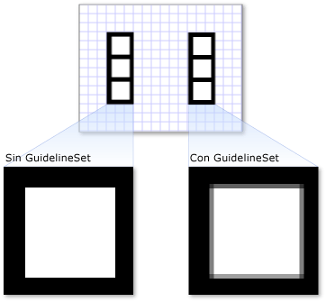

# Información general sobre objetos DrawingDrawing Objects Overview
En este <xref:System.Windows.Media.Drawing> tema se presentan objetos y se describe cómo usarlos para dibujar formas, mapas de bits, texto y medios de forma eficaz.This topic introduces <xref:System.Windows.Media.Drawing> objects and describes how to use them to efficiently draw shapes, bitmaps, text, and media. Utilice <xref:System.Windows.Media.Drawing> objetos al crear imágenes prediseñadas, pintar con un <xref:System.Windows.Media.DrawingBrush>objeto o utilizarobjetos. <xref:System.Windows.Media.Visual>Use <xref:System.Windows.Media.Drawing> objects when you create clip art, paint with a <xref:System.Windows.Media.DrawingBrush>, or use <xref:System.Windows.Media.Visual> objects.  

## ¿Qué es un objeto Drawing?What Is a Drawing Object?  
 Un <xref:System.Windows.Media.Drawing> objeto describe contenido visible, como una forma, un mapa de bits, un vídeo o una línea de texto.A <xref:System.Windows.Media.Drawing> object describes visible content, such as a shape, bitmap, video, or a line of text. Distintos tipos de dibujo describen tipos de contenido diferentes.Different types of drawings describe different types of content. La siguiente lista muestra los distintos tipos de objetos de dibujo.The following is a list of the different types of drawing objects.  
  
- <xref:System.Windows.Media.GeometryDrawing>– Dibuja una forma.<xref:System.Windows.Media.GeometryDrawing> – Draws a shape.  
  
- <xref:System.Windows.Media.ImageDrawing>– Dibuja una imagen.<xref:System.Windows.Media.ImageDrawing> – Draws an image.  
  
- <xref:System.Windows.Media.GlyphRunDrawing>– Dibuja texto.<xref:System.Windows.Media.GlyphRunDrawing> – Draws text.  
  
- <xref:System.Windows.Media.VideoDrawing>– Reproduce un archivo de audio o vídeo.<xref:System.Windows.Media.VideoDrawing> – Plays an audio or video file.  
  
- <xref:System.Windows.Media.DrawingGroup>– Dibuja otros dibujos.<xref:System.Windows.Media.DrawingGroup> – Draws other drawings. Use un grupo de dibujo para combinar otros dibujos en un solo dibujo compuesto.Use a drawing group to combine other drawings into a single composite drawing.  
  
 <xref:System.Windows.Media.Drawing>los objetos son versátiles; hay muchas maneras de <xref:System.Windows.Media.Drawing> usar un objeto.<xref:System.Windows.Media.Drawing> objects are versatile; there are many ways you can use a <xref:System.Windows.Media.Drawing> object.  
  
- Puede mostrarla como una imagen <xref:System.Windows.Media.DrawingImage> mediante <xref:System.Windows.Controls.Image> un control y un control.You can display it as an image by using a <xref:System.Windows.Media.DrawingImage> and an <xref:System.Windows.Controls.Image> control.  
  
- Puede usarlo con <xref:System.Windows.Media.DrawingBrush> a para pintar un <xref:System.Windows.Controls.Page.Background%2A> objeto, <xref:System.Windows.Controls.Page>como el de un archivo .You can use it with a <xref:System.Windows.Media.DrawingBrush> to paint an object, such as the <xref:System.Windows.Controls.Page.Background%2A> of a <xref:System.Windows.Controls.Page>.  
  
- Puede usarlo para describir la <xref:System.Windows.Media.DrawingVisual>apariencia de un archivo .You can use it to describe the appearance of a <xref:System.Windows.Media.DrawingVisual>.  
  
- Puede usarlo para enumerar el contenido <xref:System.Windows.Media.Visual>de un archivo .You can use it to enumerate the contents of a <xref:System.Windows.Media.Visual>.  
  
 WPF ofrece otros tipos de objetos capaces de dibujar formas, mapas de bits, texto y elementos multimedia.WPF provides other types of objects that are capable of drawing shapes, bitmaps, text, and media. Por ejemplo, también <xref:System.Windows.Shapes.Shape> puede usar objetos <xref:System.Windows.Controls.MediaElement> para dibujar formas y el control proporciona otra forma de agregar vídeo a la aplicación.For example, you can also use <xref:System.Windows.Shapes.Shape> objects to draw shapes, and the <xref:System.Windows.Controls.MediaElement> control provides another way to add video to your application. Entonces, ¿cuándo debe usar <xref:System.Windows.Media.Drawing> objetos?So when should you use <xref:System.Windows.Media.Drawing> objects? Cuando puede sacrificar características de nivel de marco <xref:System.Windows.Freezable> de trabajo para obtener beneficios de rendimiento o cuando necesite características.When you can sacrifice framework level features to gain performance benefits or when you need <xref:System.Windows.Freezable> features. Dado <xref:System.Windows.Media.Drawing> que los objetos carecen de compatibilidad con [Layout](../advanced/layout.md), input y focus, proporcionan ventajas de <xref:System.Windows.Media.Visual> rendimiento que los hacen ideales para describir fondos, imágenes prediseñadas y para dibujos de bajo nivel con objetos.Because <xref:System.Windows.Media.Drawing> objects lack support for [Layout](../advanced/layout.md), input, and focus, they provide performance benefits that make them ideal for describing backgrounds, clip art, and for low-level drawing with <xref:System.Windows.Media.Visual> objects.  
  
 Dado que son <xref:System.Windows.Freezable> un <xref:System.Windows.Media.Drawing> objeto de tipo, los objetos obtienen varias características especiales, que incluyen lo siguiente: se pueden declarar como [recursos,](../../../desktop-wpf/fundamentals/xaml-resources-define.md)compartirse entre varios objetos, hacer que sea de solo lectura para mejorar el rendimiento, clonar y proteger los subprocesos.Because they are a type <xref:System.Windows.Freezable> object, <xref:System.Windows.Media.Drawing> objects gain several special features, which include the following: they can be declared as [resources](../../../desktop-wpf/fundamentals/xaml-resources-define.md), shared among multiple objects, made read-only to improve performance, cloned, and made thread-safe. Para obtener más información sobre <xref:System.Windows.Freezable> las diferentes características proporcionadas por los objetos, consulte Información general sobre [objetos freezable](../advanced/freezable-objects-overview.md).For more information about the different features provided by <xref:System.Windows.Freezable> objects, see the [Freezable Objects Overview](../advanced/freezable-objects-overview.md).  
  

## Dibujar una formaDraw a Shape  
 Para dibujar una forma, <xref:System.Windows.Media.GeometryDrawing>utilice un archivo .To draw a shape, you use a <xref:System.Windows.Media.GeometryDrawing>. La propiedad de <xref:System.Windows.Media.GeometryDrawing.Geometry%2A> un dibujo de geometría <xref:System.Windows.Media.GeometryDrawing.Brush%2A> describe la forma que se va a dibujar, su propiedad describe cómo se debe pintar el interior de la forma y su <xref:System.Windows.Media.GeometryDrawing.Pen%2A> propiedad describe cómo se debe dibujar su contorno.A geometry drawing's <xref:System.Windows.Media.GeometryDrawing.Geometry%2A> property describes the shape to draw, its <xref:System.Windows.Media.GeometryDrawing.Brush%2A> property describes how the interior of the shape should be painted, and its <xref:System.Windows.Media.GeometryDrawing.Pen%2A> property describes how its outline should be drawn.  
  
 En el ejemplo <xref:System.Windows.Media.GeometryDrawing> siguiente se usa a para dibujar una forma.The following example uses a <xref:System.Windows.Media.GeometryDrawing> to draw a shape. La forma se <xref:System.Windows.Media.GeometryGroup> describe <xref:System.Windows.Media.EllipseGeometry> mediante un y dos objetos.The shape is described by a <xref:System.Windows.Media.GeometryGroup> and two <xref:System.Windows.Media.EllipseGeometry> objects. El interior de la forma <xref:System.Windows.Media.LinearGradientBrush> está pintado con <xref:System.Windows.Media.Brushes.Black%2A> <xref:System.Windows.Media.Pen>un y su contorno se dibuja con un .The shape's interior is painted with a <xref:System.Windows.Media.LinearGradientBrush> and its outline is drawn with a <xref:System.Windows.Media.Brushes.Black%2A> <xref:System.Windows.Media.Pen>.  
  
 En este ejemplo <xref:System.Windows.Media.GeometryDrawing>se crea el siguiente archivo .This example creates the following <xref:System.Windows.Media.GeometryDrawing>.  
  
   
GeometryDrawingA GeometryDrawing  
  
 [!code-csharp[DrawingMiscSnippets_snip#GeometryDrawingExampleInline](~/samples/snippets/csharp/VS_Snippets_Wpf/DrawingMiscSnippets_snip/CSharp/GeometryDrawingExample.cs#geometrydrawingexampleinline)]
 [!code-xaml[DrawingMiscSnippets_snip#GeometryDrawingExampleInline](~/samples/snippets/xaml/VS_Snippets_Wpf/DrawingMiscSnippets_snip/XAML/GeometryDrawingExample.xaml#geometrydrawingexampleinline)]  
  
 Para obtener el ejemplo completo, vea [Create a GeometryDrawing](how-to-create-a-geometrydrawing.md) (Cómo: Crear un objeto GeometryDrawing).For the complete example, see [Create a GeometryDrawing](how-to-create-a-geometrydrawing.md).  
  
 Otras <xref:System.Windows.Media.Geometry> clases, <xref:System.Windows.Media.PathGeometry> como permitirle crear formas más complejas mediante la creación de curvas y arcos.Other <xref:System.Windows.Media.Geometry> classes, such as <xref:System.Windows.Media.PathGeometry> enable you to create more complex shapes by creating curves and arcs. Para obtener <xref:System.Windows.Media.Geometry> más información acerca de los objetos, consulte [Información general sobre geometría](geometry-overview.md).For more information about <xref:System.Windows.Media.Geometry> objects, see the [Geometry Overview](geometry-overview.md).  
  
 Para obtener más información acerca de otras <xref:System.Windows.Media.Drawing> formas de dibujar formas que no usan objetos, vea [Formas y dibujo básico en Información general de WPF](shapes-and-basic-drawing-in-wpf-overview.md).For more information about other ways to draw shapes that don't use <xref:System.Windows.Media.Drawing> objects, see [Shapes and Basic Drawing in WPF Overview](shapes-and-basic-drawing-in-wpf-overview.md).  
  

## Dibujar un objeto ImageDraw an Image  
 Para dibujar una imagen, <xref:System.Windows.Media.ImageDrawing>utilice un archivo .To draw an image, you use an <xref:System.Windows.Media.ImageDrawing>. La <xref:System.Windows.Media.ImageDrawing> propiedad <xref:System.Windows.Media.ImageDrawing.ImageSource%2A> de un objeto describe la <xref:System.Windows.Media.ImageDrawing.Rect%2A> imagen que se va a dibujar y su propiedad define la región donde se dibuja la imagen.An <xref:System.Windows.Media.ImageDrawing> object's  <xref:System.Windows.Media.ImageDrawing.ImageSource%2A> property describes the image to draw, and its <xref:System.Windows.Media.ImageDrawing.Rect%2A> property defines the region where the image is drawn.  
  
 En el ejemplo siguiente se dibuja una imagen en un rectángulo situado en (75,75) que ocupa 100 por 100 píxeles.The following example draws an image into a rectangle located at (75,75) that is 100 by 100 pixel. En la ilustración siguiente se muestra el <xref:System.Windows.Media.ImageDrawing> creado por el ejemplo.The following illustration shows the <xref:System.Windows.Media.ImageDrawing> created by the example. Se ha añadido un borde gris <xref:System.Windows.Media.ImageDrawing>para mostrar los límites del archivo .A gray border was added to show the bounds of the <xref:System.Windows.Media.ImageDrawing>.  
  
   
ImageDrawing de 100 por 100A 100 by 100 ImageDrawing  
  
 [!code-csharp[DrawingMiscSnippets_snip#ImageDrawing100by100Inline](~/samples/snippets/csharp/VS_Snippets_Wpf/DrawingMiscSnippets_snip/CSharp/ImageDrawingExample.cs#imagedrawing100by100inline)]
 [!code-xaml[DrawingMiscSnippets_snip#ImageDrawing100by100Inline](~/samples/snippets/xaml/VS_Snippets_Wpf/DrawingMiscSnippets_snip/XAML/ImageDrawingExample.xaml#imagedrawing100by100inline)]  
  
 Para más información sobre las imágenes, [Información general sobre imágenes](imaging-overview.md).For more information about images, see the [Imaging Overview](imaging-overview.md).  
  

## Reproducir elementos multimedia (solo código)Play Media (Code Only)  
  
> [!NOTE]
> Aunque puede declarar <xref:System.Windows.Media.VideoDrawing> [!INCLUDE[TLA#tla_xaml](../../../../includes/tlasharptla-xaml-md.md)]un in , solo puede cargar y reproducir sus medios mediante código.Although you can declare a <xref:System.Windows.Media.VideoDrawing> in [!INCLUDE[TLA#tla_xaml](../../../../includes/tlasharptla-xaml-md.md)], you can only load and play its media using code. Para reproducir [!INCLUDE[TLA#tla_xaml](../../../../includes/tlasharptla-xaml-md.md)]vídeo en <xref:System.Windows.Controls.MediaElement> , utilice a en su lugar.To play video in [!INCLUDE[TLA#tla_xaml](../../../../includes/tlasharptla-xaml-md.md)], use a <xref:System.Windows.Controls.MediaElement> instead.  
  
 Para reproducir un archivo de audio <xref:System.Windows.Media.VideoDrawing> o <xref:System.Windows.Media.MediaPlayer>vídeo, utilice a y a .To play an audio or video file, you use a <xref:System.Windows.Media.VideoDrawing> and a <xref:System.Windows.Media.MediaPlayer>. Hay dos maneras de cargar y reproducir elementos multimedia.There are two ways to load and play media. La primera es <xref:System.Windows.Media.MediaPlayer> usar <xref:System.Windows.Media.VideoDrawing> a y a por sí mismos, y la segunda manera es crear el suyo propio <xref:System.Windows.Media.MediaTimeline> para usar con el <xref:System.Windows.Media.MediaPlayer> y <xref:System.Windows.Media.VideoDrawing>.The first is to use a <xref:System.Windows.Media.MediaPlayer> and a <xref:System.Windows.Media.VideoDrawing> by themselves, and the second way is to create your own <xref:System.Windows.Media.MediaTimeline> to use with the <xref:System.Windows.Media.MediaPlayer> and <xref:System.Windows.Media.VideoDrawing>.  
  
> [!NOTE]
> Al distribuir elementos multimedia con la aplicación, no puede utilizar un archivo multimedia como recurso del proyecto, como haría con una imagen.When distributing media with your application, you cannot use a media file as a project resource, like you would an image. En el archivo de proyecto, debe establecer en su lugar el tipo de elemento multimedia en `Content` y establecer `CopyToOutputDirectory` en `PreserveNewest` o `Always`.In your project file, you must instead set the media type to `Content` and set `CopyToOutputDirectory` to `PreserveNewest` or `Always`.  
  
 Para reproducir contenido multimedia <xref:System.Windows.Media.MediaTimeline>sin crear los suyos propios, realice los pasos siguientes.To play media without creating your own <xref:System.Windows.Media.MediaTimeline>, you perform the following steps.  
  
1. Crear un objeto <xref:System.Windows.Media.MediaPlayer>.Create a <xref:System.Windows.Media.MediaPlayer> object.  
  
     [!code-csharp[DrawingMiscSnippets_snip#VideoDrawingExampleInline1](~/samples/snippets/csharp/VS_Snippets_Wpf/DrawingMiscSnippets_snip/CSharp/VideoDrawingExample.cs#videodrawingexampleinline1)]  
  
2. Utilice <xref:System.Windows.Media.MediaPlayer.Open%2A> el método para cargar el archivo multimedia.Use the <xref:System.Windows.Media.MediaPlayer.Open%2A> method to load the media file.  
  
     [!code-csharp[DrawingMiscSnippets_snip#VideoDrawingExampleInline2](~/samples/snippets/csharp/VS_Snippets_Wpf/DrawingMiscSnippets_snip/CSharp/VideoDrawingExample.cs#videodrawingexampleinline2)]  
  
3. Creará un control <xref:System.Windows.Media.VideoDrawing>.Create a <xref:System.Windows.Media.VideoDrawing>.  
  
     [!code-csharp[DrawingMiscSnippets_snip#VideoDrawingExampleInline3](~/samples/snippets/csharp/VS_Snippets_Wpf/DrawingMiscSnippets_snip/CSharp/VideoDrawingExample.cs#videodrawingexampleinline3)]  
  
4. Especifique el tamaño y la ubicación <xref:System.Windows.Media.VideoDrawing.Rect%2A> para dibujar <xref:System.Windows.Media.VideoDrawing>el medio estableciendo la propiedad del archivo .Specify the size and location to draw the media by setting the <xref:System.Windows.Media.VideoDrawing.Rect%2A> property of the <xref:System.Windows.Media.VideoDrawing>.  
  
     [!code-csharp[DrawingMiscSnippets_snip#VideoDrawingExampleInline4](~/samples/snippets/csharp/VS_Snippets_Wpf/DrawingMiscSnippets_snip/CSharp/VideoDrawingExample.cs#videodrawingexampleinline4)]  
  
5. Establezca <xref:System.Windows.Media.VideoDrawing.Player%2A> la propiedad <xref:System.Windows.Media.VideoDrawing> de <xref:System.Windows.Media.MediaPlayer> la con la que creó.Set the <xref:System.Windows.Media.VideoDrawing.Player%2A> property of the <xref:System.Windows.Media.VideoDrawing> with the <xref:System.Windows.Media.MediaPlayer> you created.  
  
     [!code-csharp[DrawingMiscSnippets_snip#VideoDrawingExampleInline5](~/samples/snippets/csharp/VS_Snippets_Wpf/DrawingMiscSnippets_snip/CSharp/VideoDrawingExample.cs#videodrawingexampleinline5)]  
  
6. Utilice <xref:System.Windows.Media.MediaPlayer.Play%2A> el método <xref:System.Windows.Media.MediaPlayer> de la para empezar a reproducir el medio.Use the <xref:System.Windows.Media.MediaPlayer.Play%2A> method of the <xref:System.Windows.Media.MediaPlayer> to start playing the media.  
  
     [!code-csharp[DrawingMiscSnippets_snip#VideoDrawingExampleInline6](~/samples/snippets/csharp/VS_Snippets_Wpf/DrawingMiscSnippets_snip/CSharp/VideoDrawingExample.cs#videodrawingexampleinline6)]  
  
 En el ejemplo <xref:System.Windows.Media.VideoDrawing> siguiente <xref:System.Windows.Media.MediaPlayer> se utiliza a y a para reproducir un archivo de vídeo una vez.The following example uses a <xref:System.Windows.Media.VideoDrawing> and a <xref:System.Windows.Media.MediaPlayer> to play a video file once.  
  
 [!code-csharp[DrawingMiscSnippets_snip#VideoDrawingExampleInline](~/samples/snippets/csharp/VS_Snippets_Wpf/DrawingMiscSnippets_snip/CSharp/VideoDrawingExample.cs#videodrawingexampleinline)]  
  
 Para obtener un control de temporización <xref:System.Windows.Media.MediaPlayer> <xref:System.Windows.Media.VideoDrawing> adicional sobre el medio, utilice a <xref:System.Windows.Media.MediaTimeline> con los objetos y.To gain additional timing control over the media, use a <xref:System.Windows.Media.MediaTimeline> with the <xref:System.Windows.Media.MediaPlayer> and <xref:System.Windows.Media.VideoDrawing> objects. Le <xref:System.Windows.Media.MediaTimeline> permite especificar si el vídeo debe repetirse.The <xref:System.Windows.Media.MediaTimeline> enables you to specify whether the video should repeat. Para utilizar <xref:System.Windows.Media.MediaTimeline> a <xref:System.Windows.Media.VideoDrawing>con un , realice los pasos siguientes:To use a <xref:System.Windows.Media.MediaTimeline> with a <xref:System.Windows.Media.VideoDrawing>, you perform the following steps:  
  
1. Declare <xref:System.Windows.Media.MediaTimeline> el y establezca sus comportamientos de sincronización.Declare the <xref:System.Windows.Media.MediaTimeline> and set its timing behaviors.  
  
     [!code-csharp[DrawingMiscSnippets_snip#RepeatingVideoDrawingExampleInline1](~/samples/snippets/csharp/VS_Snippets_Wpf/DrawingMiscSnippets_snip/CSharp/VideoDrawingExample.cs#repeatingvideodrawingexampleinline1)]  
  
2. Cree <xref:System.Windows.Media.MediaClock> un <xref:System.Windows.Media.MediaTimeline>desde el archivo .Create a <xref:System.Windows.Media.MediaClock> from the <xref:System.Windows.Media.MediaTimeline>.  
  
     [!code-csharp[DrawingMiscSnippets_snip#RepeatingVideoDrawingExampleInline2](~/samples/snippets/csharp/VS_Snippets_Wpf/DrawingMiscSnippets_snip/CSharp/VideoDrawingExample.cs#repeatingvideodrawingexampleinline2)]  
  
3. Cree <xref:System.Windows.Media.MediaPlayer> un y <xref:System.Windows.Media.MediaClock> use <xref:System.Windows.Media.MediaPlayer.Clock%2A> el para establecer su propiedad.Create a <xref:System.Windows.Media.MediaPlayer> and use the <xref:System.Windows.Media.MediaClock> to set its <xref:System.Windows.Media.MediaPlayer.Clock%2A> property.  
  
     [!code-csharp[DrawingMiscSnippets_snip#RepeatingVideoDrawingExampleInline3](~/samples/snippets/csharp/VS_Snippets_Wpf/DrawingMiscSnippets_snip/CSharp/VideoDrawingExample.cs#repeatingvideodrawingexampleinline3)]  
  
4. Cree <xref:System.Windows.Media.VideoDrawing> a y <xref:System.Windows.Media.MediaPlayer> asigne <xref:System.Windows.Media.VideoDrawing.Player%2A> el <xref:System.Windows.Media.VideoDrawing>a la propiedad del archivo .Create a <xref:System.Windows.Media.VideoDrawing> and assign the <xref:System.Windows.Media.MediaPlayer> to the <xref:System.Windows.Media.VideoDrawing.Player%2A> property of the <xref:System.Windows.Media.VideoDrawing>.  
  
     [!code-csharp[DrawingMiscSnippets_snip#RepeatingVideoDrawingExampleInline4](~/samples/snippets/csharp/VS_Snippets_Wpf/DrawingMiscSnippets_snip/CSharp/VideoDrawingExample.cs#repeatingvideodrawingexampleinline4)]  
  
 En el ejemplo <xref:System.Windows.Media.MediaTimeline> siguiente <xref:System.Windows.Media.MediaPlayer> se <xref:System.Windows.Media.VideoDrawing> utiliza a con a y a para reproducir un vídeo repetidamente.The following example uses a <xref:System.Windows.Media.MediaTimeline> with a <xref:System.Windows.Media.MediaPlayer> and a <xref:System.Windows.Media.VideoDrawing> to play a video repeatedly.  
  
 [!code-csharp[DrawingMiscSnippets_snip#RepeatingVideoDrawingExampleInline](~/samples/snippets/csharp/VS_Snippets_Wpf/DrawingMiscSnippets_snip/CSharp/VideoDrawingExample.cs#repeatingvideodrawingexampleinline)]  
  
 Tenga en cuenta que, cuando <xref:System.Windows.Media.MediaTimeline>se <xref:System.Windows.Media.Animation.ClockController> utiliza <xref:System.Windows.Media.Animation.Clock.Controller%2A> un , <xref:System.Windows.Media.MediaClock> se utiliza el interactivo devuelto <xref:System.Windows.Media.MediaPlayer>desde la propiedad de la para controlar la reproducción multimedia en lugar de los métodos interactivos de .Note that, when you use a <xref:System.Windows.Media.MediaTimeline>, you use the interactive <xref:System.Windows.Media.Animation.ClockController> returned from the <xref:System.Windows.Media.Animation.Clock.Controller%2A> property of the <xref:System.Windows.Media.MediaClock> to control media playback instead of the interactive methods of <xref:System.Windows.Media.MediaPlayer>.  
  

## Dibujar textoDraw Text  
 Para dibujar texto, <xref:System.Windows.Media.GlyphRunDrawing> utilice <xref:System.Windows.Media.GlyphRun>a y a .To draw text, you use a <xref:System.Windows.Media.GlyphRunDrawing> and a <xref:System.Windows.Media.GlyphRun>. En el ejemplo <xref:System.Windows.Media.GlyphRunDrawing> siguiente se usa a para dibujar el texto "Hello World".The following example uses a <xref:System.Windows.Media.GlyphRunDrawing> to draw the text "Hello World".  
  
 [!code-csharp[DrawingMiscSnippets_snip#GlyphRunDrawingExampleInline](~/samples/snippets/csharp/VS_Snippets_Wpf/DrawingMiscSnippets_snip/CSharp/GlyphRunDrawingExample.cs#glyphrundrawingexampleinline)]
 [!code-xaml[DrawingMiscSnippets_snip#GlyphRunDrawingExampleInline](~/samples/snippets/xaml/VS_Snippets_Wpf/DrawingMiscSnippets_snip/XAML/GlyphRunExample.xaml#glyphrundrawingexampleinline)]  
  
 A <xref:System.Windows.Media.GlyphRun> es un objeto de bajo nivel destinado a su uso con escenarios de impresión y presentación de documentos de formato fijo.A <xref:System.Windows.Media.GlyphRun> is a low-level object intended for use with fixed-format document presentation and print scenarios. Una forma más sencilla de dibujar texto <xref:System.Windows.Controls.Label> en <xref:System.Windows.Controls.TextBlock>la pantalla es usar un archivo .A simpler way to draw text to the screen is to use a <xref:System.Windows.Controls.Label> or a <xref:System.Windows.Controls.TextBlock>. Para obtener <xref:System.Windows.Media.GlyphRun>más información acerca de , vea la [Introducción a la GlyphRun objeto y pictogramas elemento](../advanced/introduction-to-the-glyphrun-object-and-glyphs-element.md) información general.For more information about <xref:System.Windows.Media.GlyphRun>, see the [Introduction to the GlyphRun Object and Glyphs Element](../advanced/introduction-to-the-glyphrun-object-and-glyphs-element.md) overview.  
  

## Dibujos compuestosComposite Drawings  
 A <xref:System.Windows.Media.DrawingGroup> permite combinar varios dibujos en un único dibujo compuesto.A <xref:System.Windows.Media.DrawingGroup> enables you to combine multiple drawings into a single composite drawing. Mediante un <xref:System.Windows.Media.DrawingGroup>, puede combinar formas, imágenes <xref:System.Windows.Media.Drawing> y texto en un solo objeto.By using a <xref:System.Windows.Media.DrawingGroup>, you can combine shapes, images, and text into a single <xref:System.Windows.Media.Drawing> object.  
  
 En el ejemplo <xref:System.Windows.Media.DrawingGroup> siguiente <xref:System.Windows.Media.GeometryDrawing> se utiliza <xref:System.Windows.Media.ImageDrawing> a para combinar dos objetos y un objeto.The following example uses a <xref:System.Windows.Media.DrawingGroup> to combine two <xref:System.Windows.Media.GeometryDrawing> objects and an <xref:System.Windows.Media.ImageDrawing> object. Este ejemplo produce el siguiente resultado:This example produces the following output.  
  
   
Un dibujo compuestoA composite drawing  
  
 [!code-csharp[DrawingMiscSnippets_snip#GraphicsMMSimpleDrawingGroupExample](~/samples/snippets/csharp/VS_Snippets_Wpf/DrawingMiscSnippets_snip/CSharp/DrawingGroupExample.cs#graphicsmmsimpledrawinggroupexample)]
 [!code-xaml[DrawingMiscSnippets_snip#GraphicsMMSimpleDrawingGroupExample](~/samples/snippets/xaml/VS_Snippets_Wpf/DrawingMiscSnippets_snip/XAML/DrawingGroupExample.xaml#graphicsmmsimpledrawinggroupexample)]  
  
 A <xref:System.Windows.Media.DrawingGroup> también le permite aplicar máscaras de opacidad, transformaciones, efectos de mapa de bits y otras operaciones a su contenido.A <xref:System.Windows.Media.DrawingGroup> also enables you to apply opacity masks, transforms, bitmap effects, and other operations to its contents. <xref:System.Windows.Media.DrawingGroup>las operaciones se aplican <xref:System.Windows.Media.DrawingGroup.OpacityMask%2A> <xref:System.Windows.Media.DrawingGroup.Opacity%2A>en <xref:System.Windows.Media.DrawingGroup.BitmapEffect%2A> <xref:System.Windows.Media.DrawingGroup.ClipGeometry%2A>el <xref:System.Windows.Media.DrawingGroup.GuidelineSet%2A>siguiente <xref:System.Windows.Media.DrawingGroup.Transform%2A>orden: , , , , , , y, a continuación, .<xref:System.Windows.Media.DrawingGroup> operations are applied in the following order: <xref:System.Windows.Media.DrawingGroup.OpacityMask%2A>, <xref:System.Windows.Media.DrawingGroup.Opacity%2A>, <xref:System.Windows.Media.DrawingGroup.BitmapEffect%2A>, <xref:System.Windows.Media.DrawingGroup.ClipGeometry%2A>, <xref:System.Windows.Media.DrawingGroup.GuidelineSet%2A>, and then <xref:System.Windows.Media.DrawingGroup.Transform%2A>.  
  
 En la ilustración siguiente <xref:System.Windows.Media.DrawingGroup> se muestra el orden en el que se aplican las operaciones.The following illustration shows the order in which <xref:System.Windows.Media.DrawingGroup> operations are applied.  
  
   
Orden de las operaciones de DrawingGroupOrder of DrawingGroup operations  
  
 En la tabla siguiente se describen <xref:System.Windows.Media.DrawingGroup> las propiedades que puede utilizar para manipular el contenido de un objeto.The following table describes the properties you can use to manipulate a <xref:System.Windows.Media.DrawingGroup> object's contents.  
  
|PropiedadProperty|DescripciónDescription|IlustraciónIllustration|  
|--------------|-----------------|------------------|  
|<xref:System.Windows.Media.DrawingGroup.OpacityMask%2A>|Altera la opacidad de las partes <xref:System.Windows.Media.DrawingGroup> seleccionadas del contenido.Alters the opacity of selected portions of the <xref:System.Windows.Media.DrawingGroup> contents. Para obtener un ejemplo, vea [How to: Control the Opacity of a Drawing](https://docs.microsoft.com/previous-versions/dotnet/netframework-3.5/ms748242(v=vs.90)) (Cómo: Controlar la opacidad de un dibujo).For an example, see [How to: Control the Opacity of a Drawing](https://docs.microsoft.com/previous-versions/dotnet/netframework-3.5/ms748242(v=vs.90)).||  
|<xref:System.Windows.Media.DrawingGroup.Opacity%2A>|Cambia uniformemente la opacidad <xref:System.Windows.Media.DrawingGroup> del contenido.Uniformly changes the opacity of the <xref:System.Windows.Media.DrawingGroup> contents. Utilice esta propiedad <xref:System.Windows.Media.Drawing> para hacer un transparente o parcialmente transparente.Use this property to make a <xref:System.Windows.Media.Drawing> transparent or partially transparent. Para obtener un ejemplo, vea [How to: Apply an Opacity Mask to a Drawing](https://docs.microsoft.com/previous-versions/dotnet/netframework-3.5/ms753195(v=vs.90)) (Cómo: Aplicar una máscara de opacidad a un dibujo).For an example, see [How to: Apply an Opacity Mask to a Drawing](https://docs.microsoft.com/previous-versions/dotnet/netframework-3.5/ms753195(v=vs.90)).||  
|<xref:System.Windows.Media.DrawingGroup.BitmapEffect%2A>|Aplica <xref:System.Windows.Media.Effects.BitmapEffect> a <xref:System.Windows.Media.DrawingGroup> al contenido.Applies a <xref:System.Windows.Media.Effects.BitmapEffect> to the <xref:System.Windows.Media.DrawingGroup> contents. Para obtener un ejemplo, vea [How to: Apply a BitmapEffect to a Drawing](https://docs.microsoft.com/previous-versions/dotnet/netframework-3.5/ms752341(v=vs.90)) (Cómo: Aplicar un objeto BitmapEffect a un dibujo).For an example, see [How to: Apply a BitmapEffect to a Drawing](https://docs.microsoft.com/previous-versions/dotnet/netframework-3.5/ms752341(v=vs.90)).||  
|<xref:System.Windows.Media.DrawingGroup.ClipGeometry%2A>|Recorta <xref:System.Windows.Media.DrawingGroup> el contenido a una <xref:System.Windows.Media.Geometry>región que se describe mediante un archivo .Clips the <xref:System.Windows.Media.DrawingGroup> contents to a region you describe using a <xref:System.Windows.Media.Geometry>. Para obtener un ejemplo, vea [How to: Clip a Drawing](https://docs.microsoft.com/previous-versions/dotnet/netframework-3.5/ms743068(v=vs.90)) (Cómo: Recortar un dibujo).For an example, see [How to: Clip a Drawing](https://docs.microsoft.com/previous-versions/dotnet/netframework-3.5/ms743068(v=vs.90)) .||  
|<xref:System.Windows.Media.DrawingGroup.GuidelineSet%2A>|Ajusta los píxeles independientes del dispositivo a los píxeles del dispositivo según las directrices especificadas.Snaps device independent pixels to device pixels along the specified guidelines. Esta propiedad resulta útil para garantizar que los gráficos muy detallados se representan nítidamente en pantallas de baja resolución.This property is useful for ensuring that finely detailed graphics render sharply on low-DPI displays. Para obtener un ejemplo, vea [Apply a GuidelineSet to a Drawing](how-to-apply-a-guidelineset-to-a-drawing.md) (Aplicar un objeto GuidelineSet a un dibujo).For an example, see [Apply a GuidelineSet to a Drawing](how-to-apply-a-guidelineset-to-a-drawing.md).||  
|<xref:System.Windows.Media.DrawingGroup.Transform%2A>|Transforma el <xref:System.Windows.Media.DrawingGroup> contenido.Transforms the <xref:System.Windows.Media.DrawingGroup> contents. Para obtener un ejemplo, vea [How to: Apply a Transform to a Drawing](https://docs.microsoft.com/previous-versions/dotnet/netframework-3.5/ms742304(v=vs.90)) (Cómo: Aplicar una transformación a un dibujo).For an example, see [How to: Apply a Transform to a Drawing](https://docs.microsoft.com/previous-versions/dotnet/netframework-3.5/ms742304(v=vs.90)).||  
  

## Mostrar un dibujo como imagenDisplay a Drawing as an Image  
 Para mostrar <xref:System.Windows.Media.Drawing> un <xref:System.Windows.Controls.Image> control con <xref:System.Windows.Media.DrawingImage> un <xref:System.Windows.Controls.Image> control, <xref:System.Windows.Controls.Image.Source%2A> utilice <xref:System.Windows.Media.DrawingImage> a como <xref:System.Windows.Media.DrawingImage.Drawing%2A?displayProperty=nameWithType> el control y establezca la propiedad del objeto en el dibujo que desea mostrar.To display a <xref:System.Windows.Media.Drawing> with an <xref:System.Windows.Controls.Image> control, use a <xref:System.Windows.Media.DrawingImage> as the <xref:System.Windows.Controls.Image> control's <xref:System.Windows.Controls.Image.Source%2A> and set the <xref:System.Windows.Media.DrawingImage> object's <xref:System.Windows.Media.DrawingImage.Drawing%2A?displayProperty=nameWithType> property to the drawing you want to display.  
  
 En el ejemplo <xref:System.Windows.Media.DrawingImage> siguiente <xref:System.Windows.Controls.Image> se utiliza <xref:System.Windows.Media.GeometryDrawing>un control a y un control para mostrar un archivo .The following example uses a <xref:System.Windows.Media.DrawingImage> and an <xref:System.Windows.Controls.Image> control to display a <xref:System.Windows.Media.GeometryDrawing>. Este ejemplo produce el siguiente resultado:This example produces the following output.  
  
   
DrawingImageA DrawingImage  
  
 [!code-csharp[DrawingMiscSnippets_snip#DrawingImageExampleWholePage](~/samples/snippets/csharp/VS_Snippets_Wpf/DrawingMiscSnippets_snip/CSharp/DrawingImageExample.cs#drawingimageexamplewholepage)]
 [!code-xaml[DrawingMiscSnippets_snip#DrawingImageExampleWholePage](~/samples/snippets/xaml/VS_Snippets_Wpf/DrawingMiscSnippets_snip/XAML/DrawingImageExample.xaml#drawingimageexamplewholepage)]  
  

## Pintar un objeto con un dibujoPaint an Object with a Drawing  
 A <xref:System.Windows.Media.DrawingBrush> es un tipo de pincel que pinta un área con un objeto de dibujo.A <xref:System.Windows.Media.DrawingBrush> is a type of brush that paints an area with a drawing object. Puede usarlo para pintar casi cualquier objeto gráfico con un dibujo.You can use it to paint just about any graphical object with a drawing. La <xref:System.Windows.Media.Drawing> propiedad <xref:System.Windows.Media.DrawingBrush> de un <xref:System.Windows.Media.DrawingBrush.Drawing%2A>describe su .The <xref:System.Windows.Media.Drawing> property of a <xref:System.Windows.Media.DrawingBrush> describes its <xref:System.Windows.Media.DrawingBrush.Drawing%2A>. Para renderizar <xref:System.Windows.Media.Drawing> <xref:System.Windows.Media.DrawingBrush>un con un , agréguelo al pincel usando la propiedad del <xref:System.Windows.Media.Drawing> pincel y utilice el pincel para pintar un objeto gráfico, como un control o un panel.To render a <xref:System.Windows.Media.Drawing> with a <xref:System.Windows.Media.DrawingBrush>, add it to the brush using the brush's <xref:System.Windows.Media.Drawing> property and use the brush to paint a graphical object, such as a control or panel.  
  
 En los ejemplos <xref:System.Windows.Media.DrawingBrush> siguientes <xref:System.Windows.Shapes.Shape.Fill%2A> se <xref:System.Windows.Shapes.Rectangle> utiliza a para <xref:System.Windows.Media.GeometryDrawing>pintar la de a con un patrón creado a partir de un archivo .The following examples uses a <xref:System.Windows.Media.DrawingBrush> to paint the <xref:System.Windows.Shapes.Shape.Fill%2A> of a <xref:System.Windows.Shapes.Rectangle> with a pattern created from a <xref:System.Windows.Media.GeometryDrawing>. Este ejemplo produce el siguiente resultado:This example produces the following output.  
  
   
Uso de GeometryDrawing con un objeto DrawingBrushA GeometryDrawing used with a DrawingBrush  
  
 [!code-csharp[DrawingMiscSnippets_snip#DrawingBrushExampleWholePage](~/samples/snippets/csharp/VS_Snippets_Wpf/DrawingMiscSnippets_snip/CSharp/DrawingBrushExample.cs#drawingbrushexamplewholepage)]
 [!code-xaml[DrawingMiscSnippets_snip#DrawingBrushExampleWholePage](~/samples/snippets/xaml/VS_Snippets_Wpf/DrawingMiscSnippets_snip/XAML/DrawingBrushExample.xaml#drawingbrushexamplewholepage)]  
  
 La <xref:System.Windows.Media.DrawingBrush> clase proporciona una variedad de opciones para estirar y enmosaicor su contenido.The <xref:System.Windows.Media.DrawingBrush> class provides a variety of options for stretching and tiling its content. Para obtener <xref:System.Windows.Media.DrawingBrush>más información acerca de , vea la información general [de pintura con imágenes, dibujos y objetos visuales.](painting-with-images-drawings-and-visuals.md)For more information about <xref:System.Windows.Media.DrawingBrush>, see the [Painting with Images, Drawings, and Visuals](painting-with-images-drawings-and-visuals.md) overview.  
  

## Representar un dibujo con un objeto VisualRender a Drawing with a Visual  
 A <xref:System.Windows.Media.DrawingVisual> es un tipo de objeto visual diseñado para representar un dibujo.A <xref:System.Windows.Media.DrawingVisual> is a type of visual object designed to render a drawing. Una posibilidad para los desarrolladores que quieran crear un entorno gráfico muy personalizado es trabajar directamente en la capa visual, que no se describe en esta información general.Working directly at the visual layer is an option for developers who want to build a highly customized graphical environment, and is not described in this overview. Para más información, consulte la página de información general [Usar objetos DrawingVisual](using-drawingvisual-objects.md).For more information, see the [Using DrawingVisual Objects](using-drawingvisual-objects.md) overview.  
  

## Objetos DrawingContextDrawingContext Objects  
 La <xref:System.Windows.Media.DrawingContext> clase le permite <xref:System.Windows.Media.Visual> rellenar <xref:System.Windows.Media.Drawing> a o a con contenido visual.The <xref:System.Windows.Media.DrawingContext> class enables you to populate a <xref:System.Windows.Media.Visual> or a <xref:System.Windows.Media.Drawing> with visual content. Muchos de estos objetos <xref:System.Windows.Media.DrawingContext> gráficos de nivel inferior utilizan a porque describe el contenido gráfico de forma muy eficiente.Many such lower-level graphics objects use a <xref:System.Windows.Media.DrawingContext> because it describes graphical content very efficiently.  
  
 Aunque <xref:System.Windows.Media.DrawingContext> los métodos de dibujo parecen <xref:System.Drawing.Graphics?displayProperty=nameWithType> similares a los métodos de dibujo del tipo, en realidad son muy diferentes.Although the <xref:System.Windows.Media.DrawingContext> draw methods appear similar to the draw methods of the <xref:System.Drawing.Graphics?displayProperty=nameWithType> type, they are actually very different. <xref:System.Windows.Media.DrawingContext>se utiliza con un sistema de <xref:System.Drawing.Graphics?displayProperty=nameWithType> gráficos en modo retenido, mientras que el tipo se utiliza con un sistema de gráficos en modo inmediato.<xref:System.Windows.Media.DrawingContext> is used with a retained mode graphics system, while the <xref:System.Drawing.Graphics?displayProperty=nameWithType> type is used with an immediate mode graphics system. Cuando se <xref:System.Windows.Media.DrawingContext> utilizan los comandos de dibujo de un objeto, en realidad se almacena un conjunto de <xref:System.Windows.Media.DrawingContext>instrucciones de representación (aunque el mecanismo de almacenamiento exacto depende del tipo de objeto que proporciona el ) que utilizará más adelante el sistema de gráficos; no está dibujando a la pantalla en tiempo real.When you use a <xref:System.Windows.Media.DrawingContext> object's draw commands, you are actually storing a set of rendering instructions (although the exact storage mechanism depends on the type of object that supplies the <xref:System.Windows.Media.DrawingContext>) that will later be used by the graphics system; you are not drawing to the screen in real-time. Para obtener más información sobre cómo funciona el sistema de gráficos de Windows Presentation Foundation (WPF), vea [WPF Graphics Rendering Overview](wpf-graphics-rendering-overview.md).For more information about how the Windows Presentation Foundation (WPF) graphics system works, see the [WPF Graphics Rendering Overview](wpf-graphics-rendering-overview.md).  
  
 Nunca se <xref:System.Windows.Media.DrawingContext>crea una instancia directa de un ; sin embargo, puede adquirir un contexto de <xref:System.Windows.Media.DrawingGroup.Open%2A?displayProperty=nameWithType> <xref:System.Windows.Media.DrawingVisual.RenderOpen%2A?displayProperty=nameWithType>dibujo a partir de ciertos métodos, como y .You never directly instantiate a <xref:System.Windows.Media.DrawingContext>; you can, however, acquire a drawing context from certain methods, such as <xref:System.Windows.Media.DrawingGroup.Open%2A?displayProperty=nameWithType> and <xref:System.Windows.Media.DrawingVisual.RenderOpen%2A?displayProperty=nameWithType>.  
  

## Enumerar el contenido de un objeto VisualEnumerate the Contents of a Visual  
 Además de sus <xref:System.Windows.Media.Drawing> otros usos, los objetos también <xref:System.Windows.Media.Visual>proporcionan un modelo de objetos para enumerar el contenido de un archivo .In addition to their other uses, <xref:System.Windows.Media.Drawing> objects also provide an object model for enumerating the contents of a <xref:System.Windows.Media.Visual>.  
  
 En el ejemplo <xref:System.Windows.Media.VisualTreeHelper.GetDrawing%2A> siguiente se <xref:System.Windows.Media.DrawingGroup> utiliza <xref:System.Windows.Media.Visual> el método para recuperar el valor de a y enumerarlo.The following example uses the <xref:System.Windows.Media.VisualTreeHelper.GetDrawing%2A> method to retrieve the <xref:System.Windows.Media.DrawingGroup> value of a <xref:System.Windows.Media.Visual> and enumerate it.  
  
 [!code-csharp[DrawingMiscSnippets_snip#GraphicsMMRetrieveDrawings](~/samples/snippets/csharp/VS_Snippets_Wpf/DrawingMiscSnippets_snip/CSharp/EnumerateDrawingsExample.xaml.cs#graphicsmmretrievedrawings)]  
  
## Consulte tambiénSee also

- <xref:System.Windows.Media.Drawing>
- <xref:System.Windows.Media.DrawingGroup>
- [Imágenes y gráficos 2D2D Graphics and Imaging](../advanced/optimizing-performance-2d-graphics-and-imaging.md)
- [Pintar con imágenes, dibujos y elementos visualesPainting with Images, Drawings, and Visuals](painting-with-images-drawings-and-visuals.md)
- [Información general sobre geometríaGeometry Overview](geometry-overview.md)
- [Información general sobre formas y dibujo básico en WPFShapes and Basic Drawing in WPF Overview](shapes-and-basic-drawing-in-wpf-overview.md)
- [Información general sobre la representación de gráficos en WPFWPF Graphics Rendering Overview](wpf-graphics-rendering-overview.md)
- [Freezable Objects Overview](../advanced/freezable-objects-overview.md) (Información general sobre objetos Freezable)[Freezable Objects Overview](../advanced/freezable-objects-overview.md)
- [Temas de informaciónHow-to Topics](drawings-how-to-topics.md)
