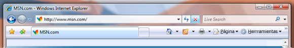

# Ampliar el marco de vidrio en una aplicaci&#243;n de WPF
En este tema se muestra cómo extender el marco del estilo visual Glass \(de vidrio\) de [!INCLUDE[TLA#tla_winvista](../../../../includes/tlasharptla-winvista-md.md)] en el área cliente de una aplicación de [!INCLUDE[TLA#tla_wpf](../../../../includes/tlasharptla-wpf-md.md)].  
  
> [!NOTE]
>  Este ejemplo únicamente funcionará en un equipo de [!INCLUDE[TLA2#tla_winvista](../../../../includes/tla2sharptla-winvista-md.md)] que ejecute el Administrador de ventanas de escritorio \(DWM\) con Glass habilitado.  [!INCLUDE[TLA2#tla_winvista](../../../../includes/tla2sharptla-winvista-md.md)] Home Basic Edition no admite el efecto de estilo visual Glass transparente.  Las áreas que se representarían normalmente con el efecto de estilo visual Glass transparente en otras ediciones de [!INCLUDE[TLA2#tla_winvista](../../../../includes/tla2sharptla-winvista-md.md)], se representan opacas.  
  
## Ejemplo  
 En la ilustración siguiente se muestra el marco Glass extendido hasta la barra de direcciones de Internet Explorer 7.  
  
 **Internet Explorer con marco Glass extendido detrás de la barra de direcciones.**  
  
   
  
 Para extender el marco Glass en una aplicación de [!INCLUDE[TLA2#tla_wpf](../../../../includes/tla2sharptla-wpf-md.md)], se necesita acceso a las [!INCLUDE[TLA#tla_api](../../../../includes/tlasharptla-api-md.md)] no administradas.  En el ejemplo de código siguiente se invoca una plataforma \(pinvoke\) para las dos [!INCLUDE[TLA2#tla_api](../../../../includes/tla2sharptla-api-md.md)] necesarias para extender el marco al área cliente.  Cada una de estas [!INCLUDE[TLA2#tla_api](../../../../includes/tla2sharptla-api-md.md)] se declara en una clase denominada **NonClientRegionAPI**.  
  
<!-- TODO: review snippet reference  [!CODE [AvalonClientGlass#DWMExtendFramePInvokeAPI](AvalonClientGlass#DWMExtendFramePInvokeAPI)]  -->  
  
 [DwmExtendFrameIntoClientArea](_udwm_dwmextendframeintoclientarea)  es la función de DWM que extiende el marco al área de cliente.  Toma dos parámetros; un identificador de ventana y una estructura [MARGINS](inet_MARGINS).  [MARGINS](inet_MARGINS) se utiliza para indicar a DWM la extensión adicional requerida del marco al área de cliente.  
  
## Ejemplo  
 Para utilizar la función [DwmExtendFrameIntoClientArea](_udwm_dwmextendframeintoclientarea), se debe obtener un identificador de ventana.  En [!INCLUDE[TLA2#tla_wpf](../../../../includes/tla2sharptla-wpf-md.md)], el identificador de ventana se puede obtener de la propiedad <xref:System.Windows.Interop.HwndSource.Handle%2A> de un objeto <xref:System.Windows.Interop.HwndSource>.  En el ejemplo siguiente, el marco se extiende al área cliente cuando se produce el evento <xref:System.Windows.FrameworkElement.Loaded> de la ventana.  
  
<!-- TODO: review snippet reference  [!CODE [AvalonClientGlass#AvalonGlassOnLoadedCSharp](AvalonClientGlass#AvalonGlassOnLoadedCSharp)]  -->  
  
## Ejemplo  
 En el ejemplo siguiente se muestra una ventana simple en la que el marco se extiende al área cliente.  El marco se extiende detrás del borde superior que contiene los dos objetos <xref:System.Windows.Controls.TextBox>.  
  
<!-- TODO: review snippet reference  [!CODE [AvalonClientGlass#AvalonGlassFullWindowXAML](AvalonClientGlass#AvalonGlassFullWindowXAML)]  -->  
  
 En la ilustración siguiente se muestra el marco Glass extendido en una aplicación de [!INCLUDE[TLA2#tla_wpf](../../../../includes/tla2sharptla-wpf-md.md)].  
  
 **Marco Glass extendido en una**   **aplicación** [!INCLUDE[TLA2#tla_wpf](../../../../includes/tla2sharptla-wpf-md.md)].  
  
   
  
## Vea también  
 [Desktop Window Manager Overview](_udwm_overview)   
 [Desktop Window Manager Blur Overview](_udwm_blur_ovw)   
 [DwmExtendFrameIntoClientArea](_udwm_dwmextendframeintoclientarea)