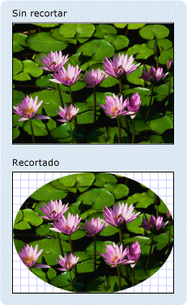

# Información general sobre geometríaGeometry Overview
Esta información general describe [!INCLUDE[TLA#tla_winclient](../../../../includes/tlasharptla-winclient-md.md)] <xref:System.Windows.Media.Geometry> cómo utilizar las clases para describir formas.This overview describes how to use the [!INCLUDE[TLA#tla_winclient](../../../../includes/tlasharptla-winclient-md.md)] <xref:System.Windows.Media.Geometry> classes to describe shapes. En este tema también se <xref:System.Windows.Media.Geometry> contrastan las diferencias entre objetos y <xref:System.Windows.Shapes.Shape> elementos.This topic also contrasts the differences between <xref:System.Windows.Media.Geometry> objects and <xref:System.Windows.Shapes.Shape> elements.  

## ¿Qué es una geometría?What Is a Geometry?  
 La <xref:System.Windows.Media.Geometry> clase y las clases que <xref:System.Windows.Media.EllipseGeometry> <xref:System.Windows.Media.PathGeometry>derivan <xref:System.Windows.Media.CombinedGeometry>de ella, como , , y , permiten describir la geometría de una forma 2D.The <xref:System.Windows.Media.Geometry> class and the classes which derive from it, such as <xref:System.Windows.Media.EllipseGeometry>, <xref:System.Windows.Media.PathGeometry>, and <xref:System.Windows.Media.CombinedGeometry>, enable you to describe the geometry of a 2D shape. Estas descripciones geométricas tiene muchos usos, como definir una forma para pintarla en la pantalla o definir regiones de recorte y pruebas de posicionamiento.These geometric descriptions have many uses, such defining a shape to paint to the screen or defining hit-test and clip regions. Incluso se puede usar una geometría para definir un trazado de animación.You can even use a geometry to define an animation path.  
  
 <xref:System.Windows.Media.Geometry>los objetos pueden ser simples, como rectángulos y círculos, o compuestos, creados a partir de dos o más objetos de geometría.<xref:System.Windows.Media.Geometry> objects can be simple, such as rectangles and circles, or composite, created from two or more geometry objects.  Se pueden crear geometrías más <xref:System.Windows.Media.PathGeometry> complejas mediante las clases y, <xref:System.Windows.Media.StreamGeometry> que permiten describir arcos y curvas.More complex geometries can be created by using the <xref:System.Windows.Media.PathGeometry> and <xref:System.Windows.Media.StreamGeometry> classes, which enable you to describe arcs and curves.  
  
 Dado <xref:System.Windows.Media.Geometry> que a <xref:System.Windows.Freezable>es <xref:System.Windows.Media.Geometry> un tipo de , objetos proporcionan varias características especiales: se pueden declarar como [recursos,](../../../desktop-wpf/fundamentals/xaml-resources-define.md)compartir entre varios objetos, hecho de solo lectura para mejorar el rendimiento, clonado y hecho seguro para subprocesos.Because a <xref:System.Windows.Media.Geometry> is a type of <xref:System.Windows.Freezable>, <xref:System.Windows.Media.Geometry> objects provide several special features: they can be declared as [resources](../../../desktop-wpf/fundamentals/xaml-resources-define.md), shared among multiple objects, made read-only to improve performance, cloned, and made thread-safe. Para obtener más información sobre <xref:System.Windows.Freezable> las diferentes características proporcionadas por los objetos, consulte Información general sobre [objetos freezable](../advanced/freezable-objects-overview.md).For more information about the different features provided by <xref:System.Windows.Freezable> objects, see the [Freezable Objects Overview](../advanced/freezable-objects-overview.md).  
  

## Geometrías frente a formasGeometries vs. Shapes  
 Las <xref:System.Windows.Media.Geometry> <xref:System.Windows.Shapes.Shape> clases y parecen similares en que <xref:System.Windows.Media.EllipseGeometry> <xref:System.Windows.Shapes.Ellipse> ambas describen formas 2D (comparar y por ejemplo), pero hay diferencias importantes.The <xref:System.Windows.Media.Geometry> and <xref:System.Windows.Shapes.Shape> classes seem similar in that they both describe 2D shapes (compare <xref:System.Windows.Media.EllipseGeometry> and <xref:System.Windows.Shapes.Ellipse> for example), but there are important differences.  
  
 Por un <xref:System.Windows.Media.Geometry> momento, la <xref:System.Windows.Freezable> clase hereda de la clase mientras que la <xref:System.Windows.Shapes.Shape> clase hereda de <xref:System.Windows.FrameworkElement>.For one, the <xref:System.Windows.Media.Geometry> class inherits from the <xref:System.Windows.Freezable> class while the <xref:System.Windows.Shapes.Shape> class inherits from <xref:System.Windows.FrameworkElement>. Dado que son <xref:System.Windows.Shapes.Shape> elementos, los objetos pueden <xref:System.Windows.Media.Geometry> representarse a sí mismos y participar en el sistema de diseño, mientras que los objetos no.Because they are elements, <xref:System.Windows.Shapes.Shape> objects can render themselves and participate in the layout system, while <xref:System.Windows.Media.Geometry> objects cannot.  
  
 Aunque <xref:System.Windows.Shapes.Shape> los objetos son <xref:System.Windows.Media.Geometry> más <xref:System.Windows.Media.Geometry> fácilmente utilizables que los objetos, los objetos son más versátiles.Although <xref:System.Windows.Shapes.Shape> objects are more readily usable than <xref:System.Windows.Media.Geometry> objects, <xref:System.Windows.Media.Geometry> objects are more versatile. Mientras <xref:System.Windows.Shapes.Shape> que un objeto se utiliza <xref:System.Windows.Media.Geometry> para representar gráficos 2D, un objeto se puede utilizar para definir la región geométrica para gráficos 2D, definir una región para el recorte o definir una región para pruebas de posicionación, por ejemplo.While a <xref:System.Windows.Shapes.Shape> object is used to render 2D graphics, a <xref:System.Windows.Media.Geometry> object can be used to define the geometric region for 2D graphics, define a region for clipping, or define a region for hit testing, for example.  
  
### La forma del trazadoThe Path Shape  
 Uno <xref:System.Windows.Shapes.Shape>, <xref:System.Windows.Shapes.Path> la clase, <xref:System.Windows.Media.Geometry> en realidad utiliza a para describir su contenido.One <xref:System.Windows.Shapes.Shape>, the <xref:System.Windows.Shapes.Path> class, actually uses a <xref:System.Windows.Media.Geometry> to describe its contents. Al establecer <xref:System.Windows.Shapes.Path.Data%2A> la <xref:System.Windows.Shapes.Path> propiedad <xref:System.Windows.Media.Geometry> de la <xref:System.Windows.Shapes.Shape.Fill%2A> <xref:System.Windows.Shapes.Shape.Stroke%2A> with y establecer <xref:System.Windows.Media.Geometry>sus propiedades y, puede representar un archivo .By setting the <xref:System.Windows.Shapes.Path.Data%2A> property of the <xref:System.Windows.Shapes.Path> with a <xref:System.Windows.Media.Geometry> and setting its <xref:System.Windows.Shapes.Shape.Fill%2A> and <xref:System.Windows.Shapes.Shape.Stroke%2A> properties, you can render a <xref:System.Windows.Media.Geometry>.  
  

## Propiedades comunes que aceptan un objeto GeometryCommon Properties That Take a Geometry  
 En las secciones anteriores se menciona que se pueden usar objetos Geometry con otros objetos con diversos fines, como dibujar formas, crear animaciones y efectuar recortes.The preceding sections mentioned that Geometry objects can be used with other objects for a variety of purposes, such as drawing shapes, animating, and clipping. En la tabla siguiente se enumeran <xref:System.Windows.Media.Geometry> varias clases que tienen propiedades que toman un objeto.The following table lists several classes that have properties that take a <xref:System.Windows.Media.Geometry> object.  
  
|TipoType|PropiedadProperty|  
|----------|--------------|  
|<xref:System.Windows.Media.Animation.DoubleAnimationUsingPath>|<xref:System.Windows.Media.Animation.DoubleAnimationUsingPath.PathGeometry%2A>|  
|<xref:System.Windows.Media.DrawingGroup>|<xref:System.Windows.Media.DrawingGroup.ClipGeometry%2A>|  
|<xref:System.Windows.Media.GeometryDrawing>|<xref:System.Windows.Media.GeometryDrawing.Geometry%2A>|  
|<xref:System.Windows.Shapes.Path>|<xref:System.Windows.Shapes.Path.Data%2A>|  
|<xref:System.Windows.UIElement>|<xref:System.Windows.UIElement.Clip%2A>|  
  

## Tipos de objeto Geometry simplesSimple Geometry Types  
 La clase base para todas las <xref:System.Windows.Media.Geometry>geometrías es la clase abstracta.The base class for all geometries is the abstract class <xref:System.Windows.Media.Geometry>.  Las clases que <xref:System.Windows.Media.Geometry> derivan de la clase se pueden agrupar aproximadamente en tres categorías: geometrías simples, geometrías de ruta y geometrías compuestas.The classes which derive from the <xref:System.Windows.Media.Geometry> class can be roughly grouped into three categories: simple geometries, path geometries, and composite geometries.  
  
 Las clases <xref:System.Windows.Media.LineGeometry> <xref:System.Windows.Media.RectangleGeometry>de <xref:System.Windows.Media.EllipseGeometry> geometría simples incluyen , y se utilizan para crear formas geométricas básicas, como líneas, rectángulos y círculos.Simple geometry classes include <xref:System.Windows.Media.LineGeometry>, <xref:System.Windows.Media.RectangleGeometry>, and <xref:System.Windows.Media.EllipseGeometry> and are used to create basic geometric shapes, such as lines, rectangles, and circles.  
  
- A <xref:System.Windows.Media.LineGeometry> se define especificando el punto inicial de la línea y el punto final.A <xref:System.Windows.Media.LineGeometry> is defined by specifying the start point of the line and the end point.  
  
- A <xref:System.Windows.Media.RectangleGeometry> se define <xref:System.Windows.Rect> con una estructura que especifica su posición relativa y su altura y anchura.A <xref:System.Windows.Media.RectangleGeometry> is defined with a <xref:System.Windows.Rect> structure which specifies its relative position and its height and width. Puede crear un rectángulo redondeado <xref:System.Windows.Media.RectangleGeometry.RadiusX%2A> <xref:System.Windows.Media.RectangleGeometry.RadiusY%2A> estableciendo las propiedades y.You can create a rounded rectangle by setting the <xref:System.Windows.Media.RectangleGeometry.RadiusX%2A> and <xref:System.Windows.Media.RectangleGeometry.RadiusY%2A> properties.  
  
- Un <xref:System.Windows.Media.EllipseGeometry> se define por un punto central, un radio X y un radio Y.An <xref:System.Windows.Media.EllipseGeometry> is defined by a center point, an x-radius and a y-radius.  En los ejemplos siguientes se muestra cómo crear geometrías simples de representación y recorte.The following examples show how to create simple geometries for rendering and for clipping.  
  
 Estas mismas formas, así como formas más complejas, se pueden crear utilizando a o mediante la <xref:System.Windows.Media.PathGeometry> combinación de objetos de geometría juntos, pero estas clases proporcionan un medio más simple para producir estas formas geométricas básicas.These same shapes, as well as more complex shapes, can be created using a <xref:System.Windows.Media.PathGeometry> or by combining geometry objects together, but these classes provide a simpler means for producing these basic geometric shapes.  
  
 En el ejemplo siguiente se <xref:System.Windows.Media.LineGeometry>muestra cómo crear y representar un archivo .The following example shows how to create and render a <xref:System.Windows.Media.LineGeometry>.  Como se indicó anteriormente, un <xref:System.Windows.Media.Geometry> objeto no <xref:System.Windows.Shapes.Path> puede dibujarse a sí mismo, por lo que en el ejemplo se utiliza una forma para representar la línea.As noted previously, a <xref:System.Windows.Media.Geometry> object is unable to draw itself, so the example uses a <xref:System.Windows.Shapes.Path> shape to render the line.  Dado que una línea no <xref:System.Windows.Shapes.Shape.Fill%2A> tiene <xref:System.Windows.Shapes.Path> ningún área, establecer la propiedad de la no tendría ningún efecto; en su <xref:System.Windows.Shapes.Shape.Stroke%2A> lugar, solo se especifican las propiedades y. <xref:System.Windows.Shapes.Shape.StrokeThickness%2A>Because a line has no area, setting the <xref:System.Windows.Shapes.Shape.Fill%2A> property of the <xref:System.Windows.Shapes.Path> would have no effect; instead, only the <xref:System.Windows.Shapes.Shape.Stroke%2A> and <xref:System.Windows.Shapes.Shape.StrokeThickness%2A> properties are specified. En la siguiente ilustración se muestra el resultado del ejemplo.The following illustration shows the output from the example.  
  
   
Objeto LineGeometry dibujado desde (10,20) hasta (100,130)A LineGeometry drawn from (10,20) to (100,130)  
  
 [!code-xaml[GeometryOverviewSamples_snip#GraphicsMMLineGeometryExample](~/samples/snippets/csharp/VS_Snippets_Wpf/GeometryOverviewSamples_snip/CS/GeometryExamples.xaml#graphicsmmlinegeometryexample)]  
  
 [!code-csharp[GeometryOverviewSamples_procedural_snip#GraphicsMMLineGeometryExample](~/samples/snippets/csharp/VS_Snippets_Wpf/GeometryOverviewSamples_procedural_snip/CSharp/GeometryExamples.cs#graphicsmmlinegeometryexample)]
 [!code-vb[GeometryOverviewSamples_procedural_snip#GraphicsMMLineGeometryExample](~/samples/snippets/visualbasic/VS_Snippets_Wpf/GeometryOverviewSamples_procedural_snip/visualbasic/geometryexamples.vb#graphicsmmlinegeometryexample)]  
  
 En el ejemplo siguiente se <xref:System.Windows.Media.EllipseGeometry>muestra cómo crear y representar un archivo .The next example shows how to create and render an <xref:System.Windows.Media.EllipseGeometry>.  Los ejemplos <xref:System.Windows.Media.EllipseGeometry.Center%2A> establecen <xref:System.Windows.Media.EllipseGeometry> el se `50,50` establece en el punto y el radio `50`x y el radio Y se establecen en , lo que crea un círculo con un diámetro de 100.The examples sets the <xref:System.Windows.Media.EllipseGeometry.Center%2A> of the <xref:System.Windows.Media.EllipseGeometry> is set to the point `50,50` and the x-radius and the y-radius are both set to `50`, which creates a circle with a diameter of 100.  El interior de la elipse se pinta asignando un valor <xref:System.Windows.Media.Brushes.Gold%2A>a la propiedad Fill del elemento Path, en este caso.The interior of the ellipse is painted by assigning a value to the Path element's Fill property, in this case <xref:System.Windows.Media.Brushes.Gold%2A>. En la siguiente ilustración se muestra el resultado del ejemplo.The following illustration shows the output from the example.  
  
   
Objeto EllipseGeometry dibujado en (50,50)An EllipseGeometry drawn at (50,50)  
  
 [!code-xaml[GeometryOverviewSamples_snip#GraphicsMMEllipseGeometryExample](~/samples/snippets/csharp/VS_Snippets_Wpf/GeometryOverviewSamples_snip/CS/GeometryExamples.xaml#graphicsmmellipsegeometryexample)]  
  
 [!code-csharp[GeometryOverviewSamples_procedural_snip#GraphicsMMEllipseGeometryExample](~/samples/snippets/csharp/VS_Snippets_Wpf/GeometryOverviewSamples_procedural_snip/CSharp/GeometryExamples.cs#graphicsmmellipsegeometryexample)]
 [!code-vb[GeometryOverviewSamples_procedural_snip#GraphicsMMEllipseGeometryExample](~/samples/snippets/visualbasic/VS_Snippets_Wpf/GeometryOverviewSamples_procedural_snip/visualbasic/geometryexamples.vb#graphicsmmellipsegeometryexample)]  
  
 En el ejemplo siguiente se <xref:System.Windows.Media.RectangleGeometry>muestra cómo crear y representar un archivo .The following example shows how to create and render a <xref:System.Windows.Media.RectangleGeometry>.  La posición y las dimensiones del <xref:System.Windows.Rect> rectángulo se definen mediante una estructura.The position and the dimensions of the rectangle are defined by a <xref:System.Windows.Rect> structure. La posición es `50,50` y el alto y ancho son ambos `25`, lo que crea un cuadrado.The position is `50,50` and the height and width are both `25`, which creates a square. En la siguiente ilustración se muestra el resultado del ejemplo.The following illustration shows the output from the example.  
  
   
Objeto RectangleGeometry dibujado en 50,50A RectangleGeometry drawn at 50,50  
  
 [!code-xaml[GeometryOverviewSamples_snip#GraphicsMMRectangleGeometryExample](~/samples/snippets/csharp/VS_Snippets_Wpf/GeometryOverviewSamples_snip/CS/GeometryExamples.xaml#graphicsmmrectanglegeometryexample)]  
  
 [!code-csharp[GeometryOverviewSamples_procedural_snip#GraphicsMMRectangleGeometryExample](~/samples/snippets/csharp/VS_Snippets_Wpf/GeometryOverviewSamples_procedural_snip/CSharp/GeometryExamples.cs#graphicsmmrectanglegeometryexample)]
 [!code-vb[GeometryOverviewSamples_procedural_snip#GraphicsMMRectangleGeometryExample](~/samples/snippets/visualbasic/VS_Snippets_Wpf/GeometryOverviewSamples_procedural_snip/visualbasic/geometryexamples.vb#graphicsmmrectanglegeometryexample)]  
  
 En el ejemplo siguiente <xref:System.Windows.Media.EllipseGeometry> se muestra cómo utilizar una región de clip para una imagen.The following example shows how to use an <xref:System.Windows.Media.EllipseGeometry> as the clip region for an image.  Un <xref:System.Windows.Controls.Image> objeto se <xref:System.Windows.FrameworkElement.Width%2A> define con un <xref:System.Windows.FrameworkElement.Height%2A> de 200 y uno de 150.An <xref:System.Windows.Controls.Image> object is defined with a <xref:System.Windows.FrameworkElement.Width%2A> of 200 and a <xref:System.Windows.FrameworkElement.Height%2A> of 150.  Un <xref:System.Windows.Media.EllipseGeometry> con <xref:System.Windows.Media.EllipseGeometry.RadiusX%2A> un valor de <xref:System.Windows.Media.EllipseGeometry.RadiusY%2A> 100, un <xref:System.Windows.Media.EllipseGeometry.Center%2A> valor de 75 y un valor <xref:System.Windows.UIElement.Clip%2A> de 100,75 se establece en la propiedad de la imagen.An <xref:System.Windows.Media.EllipseGeometry> with a <xref:System.Windows.Media.EllipseGeometry.RadiusX%2A> value of 100, a <xref:System.Windows.Media.EllipseGeometry.RadiusY%2A> value of 75, and a <xref:System.Windows.Media.EllipseGeometry.Center%2A> value of 100,75 is set to the <xref:System.Windows.UIElement.Clip%2A> property of the image.  Solo se mostrará la parte de la imagen que queda dentro del área de la elipse.Only the part of the image that is within the area of the ellipse will be displayed. En la siguiente ilustración se muestra el resultado del ejemplo.The following illustration shows the output from the example.  
  
   
Objeto EllipseGeometry usado para recortar un control ImageAn EllipseGeometry used to clip an Image control  
  
 [!code-xaml[GeometryOverviewSamples_snip#GraphicsMMImageClipGeometryExample](~/samples/snippets/csharp/VS_Snippets_Wpf/GeometryOverviewSamples_snip/CS/GeometryExamples.xaml#graphicsmmimageclipgeometryexample)]  
  
 [!code-csharp[GeometryOverviewSamples_procedural_snip#GraphicsMMImageClipGeometryExample](~/samples/snippets/csharp/VS_Snippets_Wpf/GeometryOverviewSamples_procedural_snip/CSharp/GeometryExamples.cs#graphicsmmimageclipgeometryexample)]
 [!code-vb[GeometryOverviewSamples_procedural_snip#GraphicsMMImageClipGeometryExample](~/samples/snippets/visualbasic/VS_Snippets_Wpf/GeometryOverviewSamples_procedural_snip/visualbasic/geometryexamples.vb#graphicsmmimageclipgeometryexample)]  
  

## Geometrías de trazadoPath Geometries  
 La <xref:System.Windows.Media.PathGeometry> clase y su <xref:System.Windows.Media.StreamGeometry> equivalente ligero, la clase, proporcionan los medios para describir varias figuras complejas compuestas de arcos, curvas y líneas.The <xref:System.Windows.Media.PathGeometry> class and its lightweight equivalent, the <xref:System.Windows.Media.StreamGeometry> class, provide the means to describe multiple complex figures composed of arcs, curves, and lines.  
  
 En el corazón <xref:System.Windows.Media.PathGeometry> de a <xref:System.Windows.Media.PathFigure> hay una colección de objetos, <xref:System.Windows.Media.PathGeometry>así denominada porque cada figura describe una forma discreta en el archivo .At the heart of a <xref:System.Windows.Media.PathGeometry> is a collection of <xref:System.Windows.Media.PathFigure> objects, so named because each figure describes a discrete shape in the <xref:System.Windows.Media.PathGeometry>. Cada <xref:System.Windows.Media.PathFigure> uno se compone de <xref:System.Windows.Media.PathSegment> uno o más objetos, cada uno de los cuales describe un segmento de la figura.Each <xref:System.Windows.Media.PathFigure> is itself comprised of one or more <xref:System.Windows.Media.PathSegment> objects, each of which describes a segment of the figure.  
  
 Hay muchos tipos de segmentos.There are many types of segments.  
  
|Tipo de segmentoSegment Type|DescripciónDescription|EjemploExample|  
|------------------|-----------------|-------------|  
|<xref:System.Windows.Media.ArcSegment>|Crea un arco elíptico entre dos puntos.Creates an elliptical arc between two points.|[Cree un arco elíptico](how-to-create-an-elliptical-arc.md).[Create an Elliptical Arc](how-to-create-an-elliptical-arc.md).|  
|<xref:System.Windows.Media.BezierSegment>|Crea una curva Bézier cúbica entre dos puntos.Creates a cubic Bezier curve between two points.|[Cree una curva de Bézier cúbica](how-to-create-a-cubic-bezier-curve.md).[Create a Cubic Bezier Curve](how-to-create-a-cubic-bezier-curve.md).|  
|<xref:System.Windows.Media.LineSegment>|Crea una línea entre dos puntos.Creates a line between two points.|[Crear un LineSegment en una clase PathGeometryCreate a LineSegment in a PathGeometry](how-to-create-a-linesegment-in-a-pathgeometry.md)|  
|<xref:System.Windows.Media.PolyBezierSegment>|Crea una serie de curvas Bézier cúbicas.Creates a series of cubic Bezier curves.|Consulte <xref:System.Windows.Media.PolyBezierSegment> la página de tipos.See the <xref:System.Windows.Media.PolyBezierSegment> type page.|  
|<xref:System.Windows.Media.PolyLineSegment>|Crea una serie de líneas.Creates a series of lines.|Consulte <xref:System.Windows.Media.PolyLineSegment> la página de tipos.See the <xref:System.Windows.Media.PolyLineSegment> type page.|  
|<xref:System.Windows.Media.PolyQuadraticBezierSegment>|Crea una serie de curvas Bézier cuadráticas.Creates a series of quadratic Bezier curves.|Consulte <xref:System.Windows.Media.PolyQuadraticBezierSegment> la página.See the <xref:System.Windows.Media.PolyQuadraticBezierSegment> page.|  
|<xref:System.Windows.Media.QuadraticBezierSegment>|Crea una curva Bézier cuadrática.Creates a quadratic Bezier curve.|[Cree una curva Bézier cuadrática.](how-to-create-a-quadratic-bezier-curve.md)[Create a Quadratic Bezier Curve](how-to-create-a-quadratic-bezier-curve.md).|  
  
 Los segmentos <xref:System.Windows.Media.PathFigure> dentro de a se combinan en una sola forma geométrica con el punto final de cada segmento como el punto inicial del siguiente segmento.The segments within a <xref:System.Windows.Media.PathFigure> are combined into a single geometric shape with the end point of each segment being the start point of the next segment. La <xref:System.Windows.Media.PathFigure.StartPoint%2A> propiedad <xref:System.Windows.Media.PathFigure> de a especifica el punto desde el que se dibuja el primer segmento.The <xref:System.Windows.Media.PathFigure.StartPoint%2A> property of a <xref:System.Windows.Media.PathFigure> specifies the point from which the first segment is drawn. Cada segmento posterior comienza en el punto final del segmento anterior.Each subsequent segment starts at the end point of the previous segment. Por ejemplo, se `10,50` puede `10,150` definir una línea <xref:System.Windows.Media.PathFigure.StartPoint%2A> vertical `10,50` desde <xref:System.Windows.Media.LineSegment> to <xref:System.Windows.Media.LineSegment.Point%2A> estableciendo `10,150`la propiedad en y creando un valor de propiedad de .For example, a vertical line from `10,50` to `10,150` can be defined by setting the <xref:System.Windows.Media.PathFigure.StartPoint%2A> property to `10,50` and creating a <xref:System.Windows.Media.LineSegment> with a <xref:System.Windows.Media.LineSegment.Point%2A> property setting of `10,150`.  
  
 En el ejemplo <xref:System.Windows.Media.PathGeometry> siguiente se crea <xref:System.Windows.Media.PathFigure> una <xref:System.Windows.Media.LineSegment> simple compuesta <xref:System.Windows.Shapes.Path> de una única con una y se muestra mediante un elemento.The following example creates a simple <xref:System.Windows.Media.PathGeometry> comprised of a single <xref:System.Windows.Media.PathFigure> with a <xref:System.Windows.Media.LineSegment> and displays it using a <xref:System.Windows.Shapes.Path> element. El <xref:System.Windows.Media.PathFigure> objeto <xref:System.Windows.Media.PathFigure.StartPoint%2A> se establece `10,20` en <xref:System.Windows.Media.LineSegment> y a se `100,130`define con un punto final de .The <xref:System.Windows.Media.PathFigure> object's <xref:System.Windows.Media.PathFigure.StartPoint%2A> is set to `10,20` and a <xref:System.Windows.Media.LineSegment> is defined with an end point of `100,130`. En la ilustración siguiente se muestra lo <xref:System.Windows.Media.PathGeometry> creado por este ejemplo.The following illustration shows the <xref:System.Windows.Media.PathGeometry> created by this example.  
  
   
Objeto PathGeometry que contiene un solo LineSegmentA PathGeometry that contains a single LineSegment  
  
 [!code-xaml[GeometryOverviewSamples_snip#GraphicsMMPathGeometryLineExample](~/samples/snippets/csharp/VS_Snippets_Wpf/GeometryOverviewSamples_snip/CS/GeometryExamples.xaml#graphicsmmpathgeometrylineexample)]  
  
 [!code-csharp[GeometryOverviewSamples_procedural_snip#GraphicsMMPathGeometryLineExample](~/samples/snippets/csharp/VS_Snippets_Wpf/GeometryOverviewSamples_procedural_snip/CSharp/GeometryExamples.cs#graphicsmmpathgeometrylineexample)]
 [!code-vb[GeometryOverviewSamples_procedural_snip#GraphicsMMPathGeometryLineExample](~/samples/snippets/visualbasic/VS_Snippets_Wpf/GeometryOverviewSamples_procedural_snip/visualbasic/geometryexamples.vb#graphicsmmpathgeometrylineexample)]  
  
 Vale la pena contrastar este <xref:System.Windows.Media.LineGeometry> ejemplo con el ejemplo anterior.It is worth contrasting this example with the preceding <xref:System.Windows.Media.LineGeometry> example.  La sintaxis <xref:System.Windows.Media.PathGeometry> utilizada para a es mucho más <xref:System.Windows.Media.LineGeometry>detallada que la utilizada para <xref:System.Windows.Media.LineGeometry> un simple , y puede tener <xref:System.Windows.Media.PathGeometry> más sentido utilizar la clase en este caso, pero la sintaxis detallada de la permite regiones geométricas extremadamente complejas y complejas.The syntax used for a <xref:System.Windows.Media.PathGeometry> is much more verbose than that used for a simple <xref:System.Windows.Media.LineGeometry>, and it may make more sense to use the <xref:System.Windows.Media.LineGeometry> class in this case, but the verbose syntax of the <xref:System.Windows.Media.PathGeometry> allows for extremely intricate and complex geometric regions.  
  
 Se pueden crear geometrías más complejas <xref:System.Windows.Media.PathSegment> mediante una combinación de objetos.More complex geometries can be created by using a combination of <xref:System.Windows.Media.PathSegment> objects.  
  
 En el ejemplo <xref:System.Windows.Media.BezierSegment>siguiente <xref:System.Windows.Media.LineSegment>se <xref:System.Windows.Media.ArcSegment> usa un , a , y un para crear una forma.The next example uses a <xref:System.Windows.Media.BezierSegment>, a <xref:System.Windows.Media.LineSegment>, and an <xref:System.Windows.Media.ArcSegment> to create shape. El ejemplo crea primero una curva Bézier cúbica es definiendo cuatro puntos: un punto inicial, que es el punto final del segmento anterior, un punto final (<xref:System.Windows.Media.BezierSegment.Point3%2A>) y dos puntos de control (<xref:System.Windows.Media.BezierSegment.Point1%2A> y <xref:System.Windows.Media.BezierSegment.Point2%2A>).The example first creates a cubic Bezier curve is by defining four points: a start point, which is the end point of the previous segment, an end point (<xref:System.Windows.Media.BezierSegment.Point3%2A>), and two control points (<xref:System.Windows.Media.BezierSegment.Point1%2A> and <xref:System.Windows.Media.BezierSegment.Point2%2A>).  Los dos puntos de control de una curva Bézier cúbica se comportan como imanes, atraen hacia ellos partes de lo que de otra manera sería una línea recta y generan una curva.The two control points of a cubic Bezier curve behave like magnets, attracting portions of what would otherwise be a straight line towards themselves, producing a curve. El primer punto <xref:System.Windows.Media.BezierSegment.Point1%2A>de control, , afecta a la parte inicial de la curva; el segundo punto <xref:System.Windows.Media.BezierSegment.Point2%2A>de control, , afecta a la parte final de la curva.The first control point, <xref:System.Windows.Media.BezierSegment.Point1%2A>, affects the beginning portion of the curve; the second control point, <xref:System.Windows.Media.BezierSegment.Point2%2A>, affects the ending portion of the curve.  
  
 A continuación, el <xref:System.Windows.Media.LineSegment>ejemplo agrega un , que se <xref:System.Windows.Media.BezierSegment> dibuja entre el punto final <xref:System.Windows.Media.LineSegment> del anterior que le precedió al punto especificado por su propiedad.The example then adds a <xref:System.Windows.Media.LineSegment>, which is drawn between the end point of the preceding <xref:System.Windows.Media.BezierSegment> that preceded it to the point specified by its <xref:System.Windows.Media.LineSegment> property.  
  
 A continuación, el <xref:System.Windows.Media.ArcSegment>ejemplo agrega un , que se <xref:System.Windows.Media.LineSegment> dibuja desde el <xref:System.Windows.Media.ArcSegment.Point%2A> punto final del anterior al punto especificado por su propiedad.The example then adds an <xref:System.Windows.Media.ArcSegment>, which is drawn from the end point of the preceding <xref:System.Windows.Media.LineSegment> to the point specified by its <xref:System.Windows.Media.ArcSegment.Point%2A> property. El ejemplo también especifica el radio x e<xref:System.Windows.Media.ArcSegment.Size%2A>y del arco<xref:System.Windows.Media.ArcSegment.RotationAngle%2A>( ), un ángulo de rotación (<xref:System.Windows.Media.ArcSegment.IsLargeArc%2A>), un indicador que indica el tamaño<xref:System.Windows.Media.ArcSegment.SweepDirection%2A>del ángulo del arco resultante ( ) y un valor que indica en qué dirección se dibuja el arco ( ).The example also specifies the arc's x- and y-radius (<xref:System.Windows.Media.ArcSegment.Size%2A>), a rotation angle (<xref:System.Windows.Media.ArcSegment.RotationAngle%2A>), a flag indicating how large the angle of the resulting arc should be (<xref:System.Windows.Media.ArcSegment.IsLargeArc%2A>), and a value indicating in which direction the arc is drawn (<xref:System.Windows.Media.ArcSegment.SweepDirection%2A>). En la ilustración siguiente se muestra cómo se representa este ejemplo.The following illustration shows the shape created by this example.  
  
   
PathGeometryA PathGeometry  
  
 [!code-xaml[GeometryOverviewSamples_snip#GraphicsMMPathGeometryComplexExample](~/samples/snippets/csharp/VS_Snippets_Wpf/GeometryOverviewSamples_snip/CS/GeometryExamples.xaml#graphicsmmpathgeometrycomplexexample)]  
  
 [!code-csharp[GeometryOverviewSamples_procedural_snip#GraphicsMMPathGeometryComplexExample](~/samples/snippets/csharp/VS_Snippets_Wpf/GeometryOverviewSamples_procedural_snip/CSharp/GeometryExamples.cs#graphicsmmpathgeometrycomplexexample)]
 [!code-vb[GeometryOverviewSamples_procedural_snip#GraphicsMMPathGeometryComplexExample](~/samples/snippets/visualbasic/VS_Snippets_Wpf/GeometryOverviewSamples_procedural_snip/visualbasic/geometryexamples.vb#graphicsmmpathgeometrycomplexexample)]  
  
 Se pueden crear geometrías aún más <xref:System.Windows.Media.PathFigure> complejas <xref:System.Windows.Media.PathGeometry>mediante el uso de varios objetos dentro de un archivo .Even more complex geometries can be created by using multiple <xref:System.Windows.Media.PathFigure> objects within a <xref:System.Windows.Media.PathGeometry>.  
  
 En el ejemplo <xref:System.Windows.Media.PathGeometry> siguiente <xref:System.Windows.Media.PathFigure> se crea un <xref:System.Windows.Media.PathSegment> con dos objetos, cada uno de los cuales contiene varios objetos.The following example creates a <xref:System.Windows.Media.PathGeometry> with two <xref:System.Windows.Media.PathFigure> objects, each of which contains multiple <xref:System.Windows.Media.PathSegment> objects.  El <xref:System.Windows.Media.PathFigure> ejemplo anterior y <xref:System.Windows.Media.PathFigure> a <xref:System.Windows.Media.PolyLineSegment> con <xref:System.Windows.Media.QuadraticBezierSegment> a y a se utilizan.The <xref:System.Windows.Media.PathFigure> from the above example and a <xref:System.Windows.Media.PathFigure> with a <xref:System.Windows.Media.PolyLineSegment> and a <xref:System.Windows.Media.QuadraticBezierSegment> are used.  A <xref:System.Windows.Media.PolyLineSegment> se define con una <xref:System.Windows.Media.QuadraticBezierSegment> matriz de puntos y el se define con un punto de control y un punto final.A <xref:System.Windows.Media.PolyLineSegment> is defined with an array of points and the <xref:System.Windows.Media.QuadraticBezierSegment> is defined with a control point and an end point. En la ilustración siguiente se muestra cómo se representa este ejemplo.The following illustration shows the shape created by this example.  
  
   
Objeto PathGeometry con varias figurasA PathGeometry with multiple figures  
  
 [!code-xaml[GeometryOverviewSamples_snip#GraphicsMMPathGeometryComplexMultiExample](~/samples/snippets/csharp/VS_Snippets_Wpf/GeometryOverviewSamples_snip/CS/GeometryExamples.xaml#graphicsmmpathgeometrycomplexmultiexample)]  
  
 [!code-csharp[GeometryOverviewSamples_procedural_snip#GraphicsMMPathGeometryComplexMultiExample](~/samples/snippets/csharp/VS_Snippets_Wpf/GeometryOverviewSamples_procedural_snip/CSharp/GeometryExamples.cs#graphicsmmpathgeometrycomplexmultiexample)]
 [!code-vb[GeometryOverviewSamples_procedural_snip#GraphicsMMPathGeometryComplexMultiExample](~/samples/snippets/visualbasic/VS_Snippets_Wpf/GeometryOverviewSamples_procedural_snip/visualbasic/geometryexamples.vb#graphicsmmpathgeometrycomplexmultiexample)]  
  
### StreamGeometryStreamGeometry  
 Al <xref:System.Windows.Media.PathGeometry> igual que <xref:System.Windows.Media.StreamGeometry> la clase, una define una forma geométrica compleja que puede contener curvas, arcos y líneas.Like the <xref:System.Windows.Media.PathGeometry> class, a <xref:System.Windows.Media.StreamGeometry> defines a complex geometric shape that may contain curves, arcs, and lines. A <xref:System.Windows.Media.PathGeometry>diferencia de un <xref:System.Windows.Media.StreamGeometry> , el contenido de un no admite el enlace de datos, animación o modificación.Unlike a <xref:System.Windows.Media.PathGeometry>, the contents of a  <xref:System.Windows.Media.StreamGeometry> do not support data binding, animation, or modification. Utilice <xref:System.Windows.Media.StreamGeometry> a cuando necesite describir una geometría compleja, pero no desee la sobrecarga de admitir el enlace de datos, la animación o la modificación.Use a <xref:System.Windows.Media.StreamGeometry> when you need to describe a complex geometry but do not want the overhead of supporting data binding, animation, or modification. Debido a su eficiencia, la <xref:System.Windows.Media.StreamGeometry> clase es una buena opción para describir adornos.Because of its efficiency, the <xref:System.Windows.Media.StreamGeometry> class is a good choice for describing adorners.  
  
 Para obtener un ejemplo, vea [Create a Shape Using a StreamGeometry](how-to-create-a-shape-using-a-streamgeometry.md) (Cómo: Crear una forma con un objeto StreamGeometry).For an example, see [Create a Shape Using a StreamGeometry](how-to-create-a-shape-using-a-streamgeometry.md).  
  
### Sintaxis de marcado de trazadosPath Markup Syntax  
 Los <xref:System.Windows.Media.PathGeometry> <xref:System.Windows.Media.StreamGeometry> tipos y [!INCLUDE[TLA#tla_xaml](../../../../includes/tlasharptla-xaml-md.md)] admiten una sintaxis de atributo mediante una serie especial de comandos move y draw.The <xref:System.Windows.Media.PathGeometry> and <xref:System.Windows.Media.StreamGeometry> types support a [!INCLUDE[TLA#tla_xaml](../../../../includes/tlasharptla-xaml-md.md)] attribute syntax using a special series of move and draw commands. Para más información, consulte [Sintaxis de marcado de trazados](path-markup-syntax.md).For more information, see [Path Markup Syntax](path-markup-syntax.md).  
  

## Geometrías compuestasComposite Geometries  
 Los objetos de geometría <xref:System.Windows.Media.GeometryGroup>compuesta <xref:System.Windows.Media.CombinedGeometry>se pueden crear <xref:System.Windows.Media.Geometry> <xref:System.Windows.Media.Geometry.Combine%2A>mediante un , a , o llamando al método estático .Composite geometry objects can be created using a <xref:System.Windows.Media.GeometryGroup>, a <xref:System.Windows.Media.CombinedGeometry>, or by calling the static <xref:System.Windows.Media.Geometry> method <xref:System.Windows.Media.Geometry.Combine%2A>.  
  
- El <xref:System.Windows.Media.CombinedGeometry> objeto <xref:System.Windows.Media.Geometry.Combine%2A> y el método realizan una operación booleana para combinar el área definida por dos geometrías.The <xref:System.Windows.Media.CombinedGeometry> object and the <xref:System.Windows.Media.Geometry.Combine%2A> method performs a Boolean operation to combine the area defined by two geometries. <xref:System.Windows.Media.Geometry>los objetos que no tienen área se descartan.<xref:System.Windows.Media.Geometry> objects that have no area are discarded. Solo <xref:System.Windows.Media.Geometry> se pueden combinar dos objetos (aunque estas dos geometrías también pueden ser geometrías compuestas).Only two <xref:System.Windows.Media.Geometry> objects can be combined (although these two geometries may also be composite geometries).  
  
- La <xref:System.Windows.Media.GeometryGroup> clase crea una amalgama de los <xref:System.Windows.Media.Geometry> objetos que contiene sin combinar su área.The <xref:System.Windows.Media.GeometryGroup> class creates an amalgamation of the <xref:System.Windows.Media.Geometry> objects it contains without combining their area. Cualquier número <xref:System.Windows.Media.Geometry> de objetos <xref:System.Windows.Media.GeometryGroup>se puede agregar a un archivo .Any number of <xref:System.Windows.Media.Geometry> objects can be added to a <xref:System.Windows.Media.GeometryGroup>. Para obtener un ejemplo, vea [Create a Composite Shape](how-to-create-a-composite-shape.md) (Cómo: Crear una forma compuesta).For an example, see [Create a Composite Shape](how-to-create-a-composite-shape.md).  
  
 Dado que no realizan una <xref:System.Windows.Media.GeometryGroup> operación de combinación, el uso de objetos proporciona ventajas de rendimiento sobre el uso <xref:System.Windows.Media.CombinedGeometry> de objetos o el <xref:System.Windows.Media.Geometry.Combine%2A> método.Because they do not perform a combine operation, using <xref:System.Windows.Media.GeometryGroup> objects provides performance benefits over using <xref:System.Windows.Media.CombinedGeometry> objects or the <xref:System.Windows.Media.Geometry.Combine%2A> method.  
  

## Geometrías combinadasCombined Geometries  
 En la sección <xref:System.Windows.Media.CombinedGeometry> anterior se <xref:System.Windows.Media.Geometry.Combine%2A> menciona el objeto y el método combinan el área definida por las geometrías que contienen.The preceding section mentioned the <xref:System.Windows.Media.CombinedGeometry> object and the <xref:System.Windows.Media.Geometry.Combine%2A> method combine the area defined by the geometries they contain. La <xref:System.Windows.Media.GeometryCombineMode> enumeración especifica cómo se combinan las geometrías.The <xref:System.Windows.Media.GeometryCombineMode> enumeration specifies how the geometries are combined. Los valores posibles <xref:System.Windows.Media.CombinedGeometry.GeometryCombineMode%2A> para <xref:System.Windows.Media.GeometryCombineMode.Union>la <xref:System.Windows.Media.GeometryCombineMode.Intersect> <xref:System.Windows.Media.GeometryCombineMode.Exclude>propiedad <xref:System.Windows.Media.GeometryCombineMode.Xor>son: , , , y .The possible values for the <xref:System.Windows.Media.CombinedGeometry.GeometryCombineMode%2A> property are: <xref:System.Windows.Media.GeometryCombineMode.Union>, <xref:System.Windows.Media.GeometryCombineMode.Intersect>, <xref:System.Windows.Media.GeometryCombineMode.Exclude>, and <xref:System.Windows.Media.GeometryCombineMode.Xor>.  
  
 En el ejemplo <xref:System.Windows.Media.CombinedGeometry> siguiente, a se define con un modo combinado de Union.In the following example, a <xref:System.Windows.Media.CombinedGeometry> is defined with a combine mode of Union.  Tanto <xref:System.Windows.Media.CombinedGeometry.Geometry1%2A> el <xref:System.Windows.Media.CombinedGeometry.Geometry2%2A> como el se definen como círculos del mismo radio, pero con los centros desfasados por 50.Both <xref:System.Windows.Media.CombinedGeometry.Geometry1%2A> and the <xref:System.Windows.Media.CombinedGeometry.Geometry2%2A> are defined as circles of the same radius, but with centers offset by 50.  
  
 [!code-xaml[GeometrySample#23](~/samples/snippets/csharp/VS_Snippets_Wpf/GeometrySample/CS/combininggeometriesexample.xaml#23)]  
  
   
  
 En el ejemplo <xref:System.Windows.Media.CombinedGeometry> siguiente, a se <xref:System.Windows.Media.GeometryCombineMode.Xor>define con un modo de combinación de .In the following example, a <xref:System.Windows.Media.CombinedGeometry> is defined with a combine mode of <xref:System.Windows.Media.GeometryCombineMode.Xor>.  Tanto <xref:System.Windows.Media.CombinedGeometry.Geometry1%2A> el <xref:System.Windows.Media.CombinedGeometry.Geometry2%2A> como el se definen como círculos del mismo radio, pero con los centros desfasados por 50.Both <xref:System.Windows.Media.CombinedGeometry.Geometry1%2A> and the <xref:System.Windows.Media.CombinedGeometry.Geometry2%2A> are defined as circles of the same radius, but with centers offset by 50.  
  
 [!code-xaml[GeometrySample#24](~/samples/snippets/csharp/VS_Snippets_Wpf/GeometrySample/CS/combininggeometriesexample.xaml#24)]  
  
   
  
 Para obtener otros ejemplos, vea [Create a Composite Shape](how-to-create-a-composite-shape.md) (Cómo: Crear una forma compuesta) y [Create a Combined Geometry](how-to-create-a-combined-geometry.md) (Cómo: Crear una geometría combinada).For additional examples, see [Create a Composite Shape](how-to-create-a-composite-shape.md) and [Create a Combined Geometry](how-to-create-a-combined-geometry.md).  
  

## Características de objeto FreezableFreezable Features  
 Dado que hereda <xref:System.Windows.Freezable> de <xref:System.Windows.Media.Geometry> la clase, la <xref:System.Windows.Media.Geometry> clase proporciona varias características especiales: los objetos se pueden declarar como [recursos XAML,](../../../desktop-wpf/fundamentals/xaml-resources-define.md)se pueden compartir entre varios objetos, hacer de solo lectura para mejorar el rendimiento, clonado y seguro para subprocesos.Because it inherits from the <xref:System.Windows.Freezable> class, the <xref:System.Windows.Media.Geometry> class  provide several special features: <xref:System.Windows.Media.Geometry> objects can be declared as [XAML Resources](../../../desktop-wpf/fundamentals/xaml-resources-define.md), shared among multiple objects, made read-only to improve performance, cloned, and made thread-safe. Para obtener más información sobre <xref:System.Windows.Freezable> las diferentes características proporcionadas por los objetos, consulte Información general sobre [objetos freezable](../advanced/freezable-objects-overview.md).For more information about the different features provided by <xref:System.Windows.Freezable> objects, see the [Freezable Objects Overview](../advanced/freezable-objects-overview.md).  
  

## Otras características de objeto GeometryOther Geometry Features  
 La <xref:System.Windows.Media.Geometry> clase también proporciona métodos de utilidad útiles, como los siguientes:The <xref:System.Windows.Media.Geometry> class also provides useful utility methods, such as the following:  
  
- <xref:System.Windows.Media.Geometry.GetArea%2A>- Obtiene el área <xref:System.Windows.Media.Geometry>del archivo .<xref:System.Windows.Media.Geometry.GetArea%2A> - Gets the area of the <xref:System.Windows.Media.Geometry>.  
  
- <xref:System.Windows.Media.Geometry.FillContains%2A>- Determina si la <xref:System.Windows.Media.Geometry>geometría contiene otro archivo .<xref:System.Windows.Media.Geometry.FillContains%2A> - Determines whether the Geometry contains another <xref:System.Windows.Media.Geometry>.  
  
- <xref:System.Windows.Media.Geometry.StrokeContains%2A>- Determina si el <xref:System.Windows.Media.Geometry> trazo de a contiene un punto especificado.<xref:System.Windows.Media.Geometry.StrokeContains%2A> - Determines whether the stroke of a <xref:System.Windows.Media.Geometry> contains a specified point.  
  
 Consulte <xref:System.Windows.Media.Geometry> la clase para obtener una lista completa de sus métodos.See the <xref:System.Windows.Media.Geometry> class for a complete listing of its methods.  
  
## Consulte tambiénSee also

- <xref:System.Windows.Media.Geometry>
- <xref:System.Windows.Media.PathGeometry>
- <xref:System.Windows.Shapes.Path>
- <xref:System.Windows.Media.GeometryDrawing>
- [Imágenes y gráficos 2D2D Graphics and Imaging](../advanced/optimizing-performance-2d-graphics-and-imaging.md)
- [Sintaxis de marcado de trazadosPath Markup Syntax](path-markup-syntax.md)
- [Temas de informaciónHow-to Topics](geometries-how-to-topics.md)
- [Información general sobre animacionesAnimation Overview](animation-overview.md)
- [Información general sobre formas y dibujo básico en WPFShapes and Basic Drawing in WPF Overview](shapes-and-basic-drawing-in-wpf-overview.md)
- [Información general sobre objetos DrawingDrawing Objects Overview](drawing-objects-overview.md)
