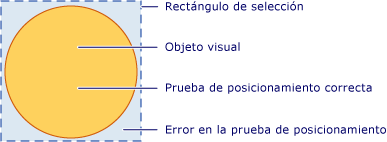
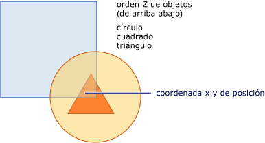

# Realizar pruebas de posicionamiento en la capa visualHit Testing in the Visual Layer
En este tema se proporciona información general sobre la funcionalidad de prueba de posicionamiento que proporciona la capa visual.This topic provides an overview of hit testing functionality provided by the visual layer. La compatibilidad con la prueba de posicionamiento le permite determinar si un valor de geometría o punto se encuentra dentro del contenido representado de un <xref:System.Windows.Media.Visual>, lo que le permite implementar el comportamiento de la interfaz de usuario, como un rectángulo de selección para seleccionar varios objetos.Hit testing support allows you to determine whether a geometry or point value falls within the rendered content of a <xref:System.Windows.Media.Visual>, allowing you to implement user interface behavior such as a selection rectangle to select multiple objects.  

   
## Escenarios de pruebas de posicionamientoHit Testing Scenarios  
 La clase <xref:System.Windows.UIElement> proporciona el método <xref:System.Windows.UIElement.InputHitTest%2A>, que permite realizar una prueba de posicionamiento con un elemento mediante un valor de coordenadas determinado.The <xref:System.Windows.UIElement> class provides the <xref:System.Windows.UIElement.InputHitTest%2A> method, which allows you to hit test against an element using a given coordinate value. En muchos casos, el método <xref:System.Windows.UIElement.InputHitTest%2A> proporciona la funcionalidad deseada para implementar la prueba de posicionamiento de los elementos.In many cases, the <xref:System.Windows.UIElement.InputHitTest%2A> method provides the desired functionality for implementing hit testing of elements. Sin embargo, hay varios escenarios en los que puede necesitar implementar pruebas de posicionamiento en la capa visual.However, there are several scenarios in which you may need to implement hit testing at the visual layer.  
  
- Pruebas de posicionamiento en objetos que no son de<xref:System.Windows.UIElement>: esto se aplica si se realiza la prueba de posicionamiento de objetos no<xref:System.Windows.UIElement>, como objetos de <xref:System.Windows.Media.DrawingVisual> o de gráficos.Hit testing against non-<xref:System.Windows.UIElement> objects: This applies if you are hit testing non-<xref:System.Windows.UIElement> objects, such as <xref:System.Windows.Media.DrawingVisual> or graphics objects.  
  
- Pruebas de posicionamiento con la utilización de una geometría: esto se aplica si necesita realizar una prueba de posicionamiento con un objeto de geometría en lugar usar el valor de coordenadas de un punto.Hit testing using a geometry: This applies if you need to hit test using a geometry object rather than the coordinate value of a point.  
  
- Pruebas de posicionamiento frente a varios objetos: esto se aplica cuando es necesario realizar pruebas de posicionamiento frente a varios objetos, tales como objetos superpuestos.Hit testing against multiple objects: This applies when you need to hit test against multiple objects, such as overlapping objects. Puede obtener resultados para todos los elementos visuales que corten una geometría o un punto, no solamente para el primero.You can get results for all visuals intersecting a geometry or point, not just the first one.  
  
- Omitir <xref:System.Windows.UIElement> Directiva de prueba de posicionamiento: esto se aplica cuando es necesario pasar por alto la Directiva de prueba de posicionamiento <xref:System.Windows.UIElement>, que tiene en cuenta tales factores como si un elemento está deshabilitado o invisible.Ignoring <xref:System.Windows.UIElement> hit testing policy: This applies when you need to ignore the <xref:System.Windows.UIElement> hit testing policy, which takes into consideration such factors as whether an element is disabled or invisible.  
  
> [!NOTE]
> Para obtener un ejemplo de código completo que muestra la prueba de posicionamiento en la capa visual, vea [Ejemplo de prueba de posicionamiento con DrawingVisuals](https://github.com/Microsoft/WPF-Samples/tree/master/Visual%20Layer/DrawingVisual) y [Ejemplo de prueba de posicionamiento de interoperabilidad con Win32](https://github.com/microsoft/WPF-Samples/tree/master/Visual%20Layer/VisualsHitTesting).For a complete code sample illustrating hit testing at the visual layer, see [Hit Test Using DrawingVisuals Sample](https://github.com/Microsoft/WPF-Samples/tree/master/Visual%20Layer/DrawingVisual) and [Hit Test with Win32 Interoperation Sample](https://github.com/microsoft/WPF-Samples/tree/master/Visual%20Layer/VisualsHitTesting).  
  
   
## Compatibilidad con la prueba de posicionamientoHit Testing Support  
 El propósito de los métodos de <xref:System.Windows.Media.VisualTreeHelper.HitTest%2A> en la clase <xref:System.Windows.Media.VisualTreeHelper> es determinar si un valor de coordenadas de geometría o de punto está dentro del contenido representado de un objeto determinado, como un control o un elemento gráfico.The purpose of the <xref:System.Windows.Media.VisualTreeHelper.HitTest%2A> methods in the <xref:System.Windows.Media.VisualTreeHelper> class is to determine whether a geometry or point coordinate value is within the rendered content of a given object, such as a control or graphic element. Por ejemplo, podría utilizar la prueba de posicionamiento para determinar si un clic del mouse dentro del rectángulo delimitador de un objeto pertenece a la geometría de un círculo.For example, you could use hit testing to determine whether a mouse click within the bounding rectangle of an object falls within the geometry of a circle. También puede optar por invalidar la implementación predeterminada de la prueba de posicionamiento, para realizar cálculos propios en las pruebas de posicionamiento.You can also choose to override the default implementation of hit testing to perform your own custom hit test calculations.  
  
 La ilustración siguiente muestra la relación entre la región de un objeto no rectangular y su rectángulo delimitador.The following illustration shows the relationship between a non-rectangular object's region and its bounding rectangle.  
  
   
Diagrama de región de prueba de posicionamiento válidaDiagram of valid hit test region  
  
   
## Prueba de posicionamiento y orden zHit Testing and Z-Order  
 La capa visual de [!INCLUDE[TLA#tla_winclient](../../../../includes/tlasharptla-winclient-md.md)] admite la prueba de posicionamiento frente a todos los objetos situados bajo un punto o una geometría, no solamente para el objeto de nivel superior.The [!INCLUDE[TLA#tla_winclient](../../../../includes/tlasharptla-winclient-md.md)] visual layer supports hit testing against all objects under a point or geometry, not just the top-most object. Los resultados se devuelven en un orden z.Results are returned in z-order. Sin embargo, el objeto visual que se pasa como parámetro al método <xref:System.Windows.Media.VisualTreeHelper.HitTest%2A> determina qué parte del árbol visual será la prueba de posicionamiento.However, the visual object that you pass as the parameter to the <xref:System.Windows.Media.VisualTreeHelper.HitTest%2A> method determines which portion of the visual tree that will be hit test. Puede realizar la prueba de posicionamiento frente al árbol visual completo o frente a cualquier parte de él.You can hit test against the entire visual tree, or any portion of it.  
  
 En la ilustración siguiente, el objeto de círculo está encima del objeto cuadrado y del triangular.In the following illustration, the circle object is on top of both the square and triangle objects. Si solo está interesado en la prueba de posicionamiento del objeto visual cuyo valor de orden z es el más alto, puede establecer la enumeración de la prueba de posicionamiento visual para que devuelva <xref:System.Windows.Media.HitTestResultBehavior.Stop> del <xref:System.Windows.Media.HitTestResultCallback> para detener el recorrido de la prueba de posicionamiento después del primer elemento.If you are only interested in hit testing the visual object whose z-order value is top-most, you can set the visual hit test enumeration to return <xref:System.Windows.Media.HitTestResultBehavior.Stop> from the <xref:System.Windows.Media.HitTestResultCallback> to stop the hit test traversal after the first item.  
  
   
Diagrama del orden z de un árbol visualDiagram of the z-order of a visual tree  
  
 Si desea enumerar todos los objetos visuales bajo un punto o geometría específicos, devuelva <xref:System.Windows.Media.HitTestResultBehavior.Continue> del <xref:System.Windows.Media.HitTestResultCallback>.If you want to enumerate all visual objects under a specific point or geometry, return <xref:System.Windows.Media.HitTestResultBehavior.Continue> from the <xref:System.Windows.Media.HitTestResultCallback>. Esto significa que puede realizar pruebas de posicionamiento para objetos visuales que estén bajo otros objetos, aunque estén completamente ocultos.This means you can hit test for visual objects that are beneath other objects, even if they are wholly obscured. Vea el ejemplo de código en la sección "Utilizar una devolución de llamada de resultados de pruebas de posicionamiento" para obtener más información.See the sample code in the section "Using a Hit Test Results Callback" for more information.  
  
> [!NOTE]
> Un objeto visual transparente también se puede someter a una prueba de posicionamiento.A visual object that is transparent can also be hit test.  
  
   
## Uso de la prueba de posicionamiento predeterminadaUsing Default Hit Testing  
 Puede identificar si un punto está dentro de la geometría de un objeto visual, utilizando el método <xref:System.Windows.Media.VisualTreeHelper.HitTest%2A> para especificar un objeto visual y un valor de coordenadas de punto con el que se va a realizar la prueba.You can identify whether a point is within the geometry of a visual object, by using the <xref:System.Windows.Media.VisualTreeHelper.HitTest%2A> method to specify a visual object and a point coordinate value to test against. El parámetro de objeto visual identifica el punto inicial en el árbol visual para la búsqueda de la prueba de posicionamiento.The visual object parameter identifies the starting point in the visual tree for the hit test search. Si se encuentra un objeto visual en el árbol visual cuya geometría contiene la coordenada, se establece en la propiedad <xref:System.Windows.Media.HitTestResult.VisualHit%2A> de un objeto <xref:System.Windows.Media.HitTestResult>.If a visual object is found in the visual tree whose geometry contains the coordinate, it is set to the <xref:System.Windows.Media.HitTestResult.VisualHit%2A> property of a <xref:System.Windows.Media.HitTestResult> object. A continuación, el <xref:System.Windows.Media.HitTestResult> se devuelve desde el método <xref:System.Windows.Media.VisualTreeHelper.HitTest%2A>.The <xref:System.Windows.Media.HitTestResult> is then returned from the <xref:System.Windows.Media.VisualTreeHelper.HitTest%2A> method. Si el punto no está incluido en el subárbol visual en el que se está realizando la prueba de posicionamiento, <xref:System.Windows.Media.VisualTreeHelper.HitTest%2A> devuelve `null`.If the point is not contained with the visual sub-tree you are hit testing, <xref:System.Windows.Media.VisualTreeHelper.HitTest%2A> returns `null`.  
  
> [!NOTE]
> La prueba de posicionamiento predeterminada devuelve el objeto de nivel superior en el orden z.Default hit testing always returns the top-most object in the z-order. Para identificar todos los objetos visuales, incluso aquellos que puedan estar ocultos, de forma total o parcial, utilice una devolución de llamada de resultado de prueba de posicionamiento.In order to identify all visual objects, even those that may be partly or wholly obscured, use a hit test result callback.  
  
 El valor de la coordenada que se pasa como parámetro de punto para el método <xref:System.Windows.Media.VisualTreeHelper.HitTest%2A> tiene que ser relativo al espacio de coordenadas del objeto visual con el que se realiza la prueba de posicionamiento.The coordinate value you pass as the point parameter for the <xref:System.Windows.Media.VisualTreeHelper.HitTest%2A> method has to be relative to the coordinate space of the visual object you are hit testing against. Por ejemplo, si ha anidado objetos visuales definidos en (100, 100) en el espacio de coordenadas del elemento primario, la prueba de posicionamiento de un elemento secundario visual en (0, 0) es equivalente a la prueba de posicionamiento en (100, 100) en el espacio de coordenadas del elemento primario.For example, if you have nested visual objects defined at (100, 100) in the parent's coordinate space, then hit testing a child visual at (0, 0) is equivalent to hit testing at (100, 100) in the parent's coordinate space.  
  
 En el código siguiente se muestra cómo configurar controladores de eventos de mouse para un <xref:System.Windows.UIElement> objeto que se usa para capturar eventos utilizados para la prueba de posicionamiento.The following code shows how to set up mouse event handlers for a <xref:System.Windows.UIElement> object that is used to capture events used for hit testing.  
  
 [!code-csharp[HitTestingOverview#100](~/samples/snippets/csharp/VS_Snippets_Wpf/HitTestingOverview/CSharp/Window1.xaml.cs#100)]
 [!code-vb[HitTestingOverview#100](~/samples/snippets/visualbasic/VS_Snippets_Wpf/HitTestingOverview/visualbasic/window1.xaml.vb#100)]  
  
### Cómo afecta el árbol visual a la prueba de posicionamientoHow the Visual Tree Affects Hit Testing  
 El punto inicial en el árbol visual determina qué objetos se devuelven durante la enumeración de objetos de la prueba de posicionamiento.The starting point in the visual tree determines which objects are returned during the hit test enumeration of objects. Si tiene varios objetos que desea someter a la prueba de posicionamiento, el objeto visual utilizado como punto inicial en el árbol visual debe ser el antecesor común de todos los objetos de interés.If you have multiple objects you want to hit test, the visual object used as the starting point in the visual tree must be the common ancestor of all objects of interest. Por ejemplo, si estuviera interesado en la prueba de posicionamiento tanto del elemento de botón como del elemento visual de dibujo del diagrama siguiente, tendría que establecer el punto inicial del árbol visual en el antecesor común de ambos.For example, if you were interested in hit testing both the button element and drawing visual in the following diagram, you would have to set the starting point in the visual tree to the common ancestor of both. En este caso, el elemento de lienzo es el antecesor común del elemento de botón y del elemento visual de dibujo.In this case, the canvas element is the common ancestor of both the button element and the drawing visual.  
  
   
Diagrama de una jerarquía de árbol visualDiagram of a visual tree hierarchy  
  
> [!NOTE]
> La propiedad <xref:System.Windows.UIElement.IsHitTestVisible%2A> obtiene o establece un valor que declara si un objeto derivado de <xref:System.Windows.UIElement>se puede devolver como resultado de una prueba de posicionamiento de alguna parte de su contenido representado.The <xref:System.Windows.UIElement.IsHitTestVisible%2A> property gets or sets a value that declares whether a <xref:System.Windows.UIElement>-derived object can possibly be returned as a hit test result from some portion of its rendered content. Esto permite modificar de manera selectiva el árbol visual para determinar qué objetos visuales están implicados en una prueba de posicionamiento.This allows you to selectively alter the visual tree to determine which visual objects are involved in a hit test.  
  
   
## Uso de una devolución de llamada de resultados de prueba de posicionamientoUsing a Hit Test Result Callback  
 Puede enumerar todos los objetos visuales de un árbol visual cuya geometría contenga un valor de coordenadas especificado.You can enumerate all visual objects in a visual tree whose geometry contains a specified coordinate value. Esto permite identificar todos los objetos visuales, incluso aquellos que puedan estar ocultos, de forma parcial o total, por otros objetos visuales.This allows you to identify all visual objects, even those that may be partly or wholly obscured by other visual objects. Para enumerar los objetos visuales de un árbol visual, use el método <xref:System.Windows.Media.VisualTreeHelper.HitTest%2A> con una función de devolución de llamada de la prueba de posicionamiento.To enumerate visual objects in a visual tree use the <xref:System.Windows.Media.VisualTreeHelper.HitTest%2A> method with a hit test callback function. El sistema llama a la función de devolución de llamada de la prueba de posicionamiento cuando el valor de coordenadas especificado esté contenido en un objeto visual.The hit test callback function is called by the system when the coordinate value you specify is contained in a visual object.  
  
 Durante la enumeración de resultados de pruebas de posicionamiento no se debe realizar ninguna operación que modifique el árbol visual.During the hit test results enumeration, you should not perform any operation that modifies the visual tree. Agregar o quitar un objeto del árbol visual mientras se recorre puede producir un comportamiento imprevisible.Adding or removing an object from the visual tree while it is being traversed can result in unpredictable behavior. Puede modificar de forma segura el árbol visual después de que el método <xref:System.Windows.Media.VisualTreeHelper.HitTest%2A> devuelva.You can safely modify the visual tree after the <xref:System.Windows.Media.VisualTreeHelper.HitTest%2A> method returns. Es posible que desee proporcionar una estructura de datos, como un <xref:System.Collections.ArrayList>, para almacenar valores durante la enumeración de resultados de pruebas de posicionamiento.You may want to provide a data structure, such as an <xref:System.Collections.ArrayList>, to store values during the hit test results enumeration.  
  
 [!code-csharp[HitTestingOverview#101](~/samples/snippets/csharp/VS_Snippets_Wpf/HitTestingOverview/CSharp/Window1.xaml.cs#101)]
 [!code-vb[HitTestingOverview#101](~/samples/snippets/visualbasic/VS_Snippets_Wpf/HitTestingOverview/visualbasic/window1.xaml.vb#101)]  
  
 El método de devolución de llamada de la prueba de posicionamiento define las acciones que se realizan cuando se identifica una prueba de posicionamiento en un objeto visual determinado del árbol visual.The hit test callback method defines the actions you perform when a hit test is identified on a particular visual object in the visual tree. Después de realizar las acciones, se devuelve un valor <xref:System.Windows.Media.HitTestResultBehavior> que determina si se debe continuar la enumeración de otros objetos visuales o no.After you perform the actions, you return a <xref:System.Windows.Media.HitTestResultBehavior> value that determines whether to continue the enumeration of any other visual objects or not.  
  
 [!code-csharp[HitTestingOverview#102](~/samples/snippets/csharp/VS_Snippets_Wpf/HitTestingOverview/CSharp/Window1.xaml.cs#102)]
 [!code-vb[HitTestingOverview#102](~/samples/snippets/visualbasic/VS_Snippets_Wpf/HitTestingOverview/visualbasic/window1.xaml.vb#102)]  
  
> [!NOTE]
> El orden de enumeración de los objetos visuales de la posición es el orden z.The order of enumeration of hit visual objects is by z-order. El objeto visual de orden z de nivel superior es el primer objeto enumerado.The visual object at the top-most z-order level is the first object enumerated. Los demás objetos visuales enumerados están en orden z decreciente.Any other visual objects enumerated are at decreasing z-order level. Este orden de enumeración corresponde al orden de representación de elementos visuales.This order of enumeration corresponds to the rendering order of the visuals.  
  
 Puede detener la enumeración de objetos visuales en cualquier momento en la función de devolución de llamada de la prueba de posicionamiento devolviendo <xref:System.Windows.Media.HitTestResultBehavior.Stop>.You can stop the enumeration of visual objects at any time in the hit test callback function by returning <xref:System.Windows.Media.HitTestResultBehavior.Stop>.  
  
 [!code-csharp[HitTestingOverview#103](~/samples/snippets/csharp/VS_Snippets_Wpf/HitTestingOverview/CSharp/Window1.xaml.cs#103)]
 [!code-vb[HitTestingOverview#103](~/samples/snippets/visualbasic/VS_Snippets_Wpf/HitTestingOverview/visualbasic/window1.xaml.vb#103)]  
  
   
## Uso de una devolución de llamada de filtro de prueba de posicionamientoUsing a Hit Test Filter Callback  
 Puede utilizar un filtro opcional de la prueba de posicionamiento para restringir los objetos que se pasan en los resultados de pruebas de posicionamiento.You can use an optional hit test filter to restrict the objects that are passed on to the hit test results. Esto permite omitir, en los resultados de pruebas de posicionamiento, las partes del árbol visual que no desee procesar.This allows you to ignore parts of the visual tree that you are not interested in processing in your hit test results. Para implementar un filtro de prueba de posicionamiento, se define una función de devolución de llamada de filtro de prueba de posicionamiento y se pasa como un valor de parámetro al llamar al método <xref:System.Windows.Media.VisualTreeHelper.HitTest%2A>.To implement a hit test filter, you define a hit test filter callback function and pass it as a parameter value when you call the <xref:System.Windows.Media.VisualTreeHelper.HitTest%2A> method.  
  
 [!code-csharp[HitTestingOverview#104](~/samples/snippets/csharp/VS_Snippets_Wpf/HitTestingOverview/CSharp/Window1.xaml.cs#104)]
 [!code-vb[HitTestingOverview#104](~/samples/snippets/visualbasic/VS_Snippets_Wpf/HitTestingOverview/visualbasic/window1.xaml.vb#104)]  
  
 Si no desea proporcionar la función de devolución de llamada de filtro de prueba de posicionamiento opcional, pase un valor `null` como su parámetro para el método <xref:System.Windows.Media.VisualTreeHelper.HitTest%2A>.If you do not want to supply the optional hit test filter callback function, pass a `null` value as its parameter for the <xref:System.Windows.Media.VisualTreeHelper.HitTest%2A> method.  
  
 [!code-csharp[HitTestingOverview#105](~/samples/snippets/csharp/VS_Snippets_Wpf/HitTestingOverview/CSharp/Window1.xaml.cs#105)]
 [!code-vb[HitTestingOverview#105](~/samples/snippets/visualbasic/VS_Snippets_Wpf/HitTestingOverview/visualbasic/window1.xaml.vb#105)]  
  
   
Eliminar un árbol visualPruning a visual tree  
  
 La función de devolución de llamada de filtro de prueba de posicionamiento permite enumerar todos los objetos visuales cuyo contenido representado contenga las coordenadas que especifique.The hit test filter callback function allows you to enumerate through all the visuals whose rendered content contains the coordinates you specify. No obstante, es posible que desee omitir determinadas ramas del árbol visual, porque no le interese procesarlas en la función de devolución de llamada de los resultados de pruebas de posicionamiento.However, you may want to ignore certain branches of the visual tree that you are not interested in processing in your hit test results callback function. El valor devuelto de la función de devolución de llamada del filtro de la prueba de posicionamiento determina el tipo de acción que debe realizar la enumeración de los objetos visuales.The return value of the hit test filter callback function determines what type of action the enumeration of the visual objects should take. Por ejemplo, si devuelve el valor, <xref:System.Windows.Media.HitTestFilterBehavior.ContinueSkipSelfAndChildren>, puede quitar el objeto visual actual y sus elementos secundarios de la enumeración de resultados de pruebas de posicionamiento.For example, if you return the value, <xref:System.Windows.Media.HitTestFilterBehavior.ContinueSkipSelfAndChildren>, you can remove the current visual object and its children from the hit test results enumeration. Esto significa que la función de devolución de llamada de los resultados de pruebas de posicionamiento no verá estos objetos en su enumeración.This means that the hit test results callback function will not see these objects in its enumeration. Cuando se eliminan objetos del árbol visual, se reduce el número de procesos durante el paso de enumeración de resultados de pruebas de posicionamiento.Pruning the visual tree of objects decreases the amount of processing during the hit test results enumeration pass. En el ejemplo de código siguiente, el filtro omite las etiquetas y sus descendientes y realiza pruebas de posicionamiento con todos los demás objetos.In the following code example, the filter skips labels and their descendants and hit tests everything else.  
  
 [!code-csharp[HitTestingOverview#106](~/samples/snippets/csharp/VS_Snippets_Wpf/HitTestingOverview/CSharp/Window1.xaml.cs#106)]
 [!code-vb[HitTestingOverview#106](~/samples/snippets/visualbasic/VS_Snippets_Wpf/HitTestingOverview/visualbasic/window1.xaml.vb#106)]  
  
> [!NOTE]
> Se llamará a la devolución de llamada de filtro de la prueba de posicionamiento en aquellos casos en que no se llame a la devolución de llamada de resultados de pruebas de posicionamiento.The hit test filter callback will sometimes be called in cases where the hit test results callback is not called.  
  
   
## Invalidación de la prueba de posicionamiento predeterminadaOverriding Default Hit Testing  
 Puede invalidar la compatibilidad con la prueba de posicionamiento predeterminada de un objeto visual invalidando el método de <xref:System.Windows.Media.Visual.HitTestCore%2A>.You can override a visual object’s default hit testing support by overriding the <xref:System.Windows.Media.Visual.HitTestCore%2A> method. Esto significa que cuando se invoca el método <xref:System.Windows.Media.VisualTreeHelper.HitTest%2A>, se llama a la implementación invalidada de <xref:System.Windows.Media.Visual.HitTestCore%2A>.This means that when you invoke the <xref:System.Windows.Media.VisualTreeHelper.HitTest%2A> method, your overridden implementation of <xref:System.Windows.Media.Visual.HitTestCore%2A> is called. Se llama al método de invalidación cuando una prueba de posicionamiento está dentro del rectángulo delimitador del objeto visual, aunque las coordenadas estén fuera del contenido representado de dicho objeto.Your overridden method is called when a hit test falls within the bounding rectangle of the visual object, even if the coordinate falls outside the rendered content of the visual object.  
  
 [!code-csharp[HitTestingOverview#107](~/samples/snippets/csharp/VS_Snippets_Wpf/HitTestingOverview/CSharp/Window1.xaml.cs#107)]
 [!code-vb[HitTestingOverview#107](~/samples/snippets/visualbasic/VS_Snippets_Wpf/HitTestingOverview/visualbasic/window1.xaml.vb#107)]  
  
 Pueden darse ocasiones en que desee realizar la prueba de posicionamiento tanto respecto al rectángulo delimitador como respecto al contenido representado de un objeto visual.There may be times when you want to hit test against both the bounding rectangle and the rendered content of a visual object. Al usar el valor del parámetro `PointHitTestParameters` en el método <xref:System.Windows.Media.Visual.HitTestCore%2A> invalidado como el parámetro para el <xref:System.Windows.Media.Visual.HitTestCore%2A>del método base, puede realizar acciones basadas en un acierto del rectángulo delimitador de un objeto visual y, a continuación, realizar una segunda prueba de posicionamiento con el contenido representado del objeto visual.By using the `PointHitTestParameters` parameter value in your overridden <xref:System.Windows.Media.Visual.HitTestCore%2A> method as the parameter to the base method <xref:System.Windows.Media.Visual.HitTestCore%2A>, you can perform actions based on a hit of the bounding rectangle of a visual object, and then perform a second hit test against the rendered content of the visual object.  
  
 [!code-csharp[HitTestingOverview#108](~/samples/snippets/csharp/VS_Snippets_Wpf/HitTestingOverview/CSharp/Window1.xaml.cs#108)]
 [!code-vb[HitTestingOverview#108](~/samples/snippets/visualbasic/VS_Snippets_Wpf/HitTestingOverview/visualbasic/window1.xaml.vb#108)]  
  
## Consulte tambiénSee also

- <xref:System.Windows.Media.VisualTreeHelper.HitTest%2A>
- <xref:System.Windows.Media.HitTestResult>
- <xref:System.Windows.Media.HitTestResultCallback>
- <xref:System.Windows.Media.HitTestFilterCallback>
- <xref:System.Windows.UIElement.IsHitTestVisible%2A>
- [Prueba de posicionamiento mediante el ejemplo DrawingVisualsHit Test Using DrawingVisuals Sample](https://github.com/Microsoft/WPF-Samples/tree/master/Visual%20Layer/DrawingVisual)
- [Prueba de posicionamiento con el ejemplo de interoperación de Win32Hit Test with Win32 Interoperation Sample](https://github.com/microsoft/WPF-Samples/tree/master/Visual%20Layer/VisualsHitTesting)
- [Geometría de una prueba de posicionamiento en un objeto VisualHit Test Geometry in a Visual](how-to-hit-test-geometry-in-a-visual.md)
- [Realizar pruebas de posicionamiento mediante un contenedor host Win32Hit Test Using a Win32 Host Container](how-to-hit-test-using-a-win32-host-container.md)
