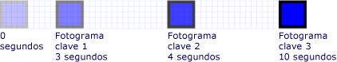
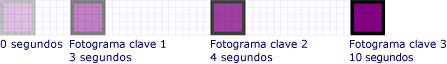
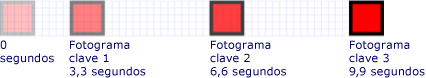
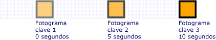

# Cómo: Controlar la temporización de animaciones y fotogramas clave

En este ejemplo se muestra cómo controlar la sincronización de fotogramas clave dentro de una animación de fotograma clave. Al igual que otras animaciones, <xref:System.Windows.Media.Animation.Timeline.Duration%2A> las animaciones de fotogramas clave tienen una propiedad. Además de especificar la duración de una animación, debe especificar qué parte de esa duración se asigna a cada uno de sus fotogramas clave. Para indicar el tiempo, <xref:System.Windows.Media.Animation.KeyTime> especifique a para cada fotograma clave de la animación.

El <xref:System.Windows.Media.Animation.KeyTime> para cada fotograma clave especifica cuándo finaliza un fotograma clave (no especifica el tiempo que se reproduce un fotograma clave). Puede especificar <xref:System.Windows.Media.Animation.KeyTime> como <xref:System.TimeSpan> un valor, como un <xref:System.Windows.Media.Animation.KeyTime.Uniform%2A> porcentaje <xref:System.Windows.Media.Animation.KeyTime.Paced%2A> o como el valor especial.

## Ejemplo

En el ejemplo <xref:System.Windows.Media.Animation.DoubleAnimationUsingKeyFrames> siguiente se usa a para animar un rectángulo a través de la pantalla. Los tiempos clave de <xref:System.TimeSpan> los fotogramas clave se establecen con valores.

[!code-csharp[keyframes_snip#KeyTimesTimeSpanExample](~/samples/snippets/csharp/VS_Snippets_Wpf/keyframes_snip/CSharp/KeyTimesExample.cs#keytimestimespanexample)]
[!code-vb[keyframes_snip#KeyTimesTimeSpanExample](~/samples/snippets/visualbasic/VS_Snippets_Wpf/keyframes_snip/visualbasic/keytimesexample.vb#keytimestimespanexample)]
[!code-xaml[keyframes_snip#KeyTimesTimeSpanExample](~/samples/snippets/xaml/VS_Snippets_Wpf/keyframes_snip/XAML/KeyTimesExample.xaml#keytimestimespanexample)]

La siguiente ilustración muestra cuándo se alcanza el valor de cada fotograma clave.

En el ejemplo siguiente se muestra una animación idéntica, excepto que los tiempos clave de los fotogramas clave se establecen con valores de porcentaje.

[!code-csharp[keyframes_snip#KeyTimesPercentageExample](~/samples/snippets/csharp/VS_Snippets_Wpf/keyframes_snip/CSharp/KeyTimesExample.cs#keytimespercentageexample)]
[!code-vb[keyframes_snip#KeyTimesPercentageExample](~/samples/snippets/visualbasic/VS_Snippets_Wpf/keyframes_snip/visualbasic/keytimesexample.vb#keytimespercentageexample)]
[!code-xaml[keyframes_snip#KeyTimesPercentageExample](~/samples/snippets/xaml/VS_Snippets_Wpf/keyframes_snip/XAML/KeyTimesExample.xaml#keytimespercentageexample)]

La siguiente ilustración muestra cuándo se alcanza el valor de cada fotograma clave.

En el <xref:System.Windows.Media.Animation.KeyTime.Uniform%2A> ejemplo siguiente se utilizan valores de tiempo clave.

[!code-csharp[keyframes_snip#KeyTimesUniformExample](~/samples/snippets/csharp/VS_Snippets_Wpf/keyframes_snip/CSharp/KeyTimesExample.cs#keytimesuniformexample)]
[!code-vb[keyframes_snip#KeyTimesUniformExample](~/samples/snippets/visualbasic/VS_Snippets_Wpf/keyframes_snip/visualbasic/keytimesexample.vb#keytimesuniformexample)]
[!code-xaml[keyframes_snip#KeyTimesUniformExample](~/samples/snippets/xaml/VS_Snippets_Wpf/keyframes_snip/XAML/KeyTimesExample.xaml#keytimesuniformexample)]

La siguiente ilustración muestra cuándo se alcanza el valor de cada fotograma clave.

El ejemplo <xref:System.Windows.Media.Animation.KeyTime.Paced%2A> final utiliza valores de tiempo clave.

[!code-csharp[keyframes_snip#KeyTimesPacedExample](~/samples/snippets/csharp/VS_Snippets_Wpf/keyframes_snip/CSharp/KeyTimesExample.cs#keytimespacedexample)]
[!code-vb[keyframes_snip#KeyTimesPacedExample](~/samples/snippets/visualbasic/VS_Snippets_Wpf/keyframes_snip/visualbasic/keytimesexample.vb#keytimespacedexample)]
[!code-xaml[keyframes_snip#KeyTimesPacedExample](~/samples/snippets/xaml/VS_Snippets_Wpf/keyframes_snip/XAML/KeyTimesExample.xaml#keytimespacedexample)]

La siguiente ilustración muestra cuándo se alcanza el valor de cada fotograma clave.

Para simplificar, las versiones de código de este ejemplo usan animaciones locales, no guiones gráficos, porque solo se aplica una sola animación a una sola propiedad, pero los ejemplos se pueden modificar para usar guiones gráficos en su lugar. Para obtener un ejemplo que muestra cómo declarar un guión gráfico en el código, vea [Animar una propiedad mediante un guión gráfico](how-to-animate-a-property-by-using-a-storyboard.md).

Para consultar el ejemplo completo, vea [Ejemplo de animación mediante fotogramas clave](https://github.com/microsoft/WPF-Samples/tree/master/Animation/KeyFrameAnimation). Para obtener más información acerca de las animaciones de fotogramas clave, vea Información general sobre [animaciones de fotogramas](key-frame-animations-overview.md)clave .

## Vea también

- [Información general sobre animaciones de fotogramas clave](key-frame-animations-overview.md)
- [Información general sobre animaciones](animation-overview.md)
- [Temas "Cómo..."](animation-and-timing-how-to-topics.md)
