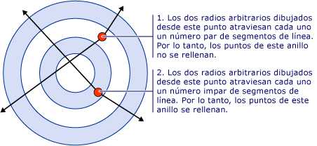
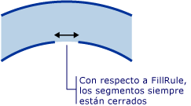

# Cómo: Controlar el relleno de una forma compuesta
El <xref:System.Windows.Media.GeometryGroup.FillRule%2A> propiedad de un <xref:System.Windows.Media.GeometryGroup> o <xref:System.Windows.Media.PathGeometry>, especifica una regla de"" que la forma compuesta utiliza para determinar si un punto determinado forma parte de la geometría. Hay dos valores posibles para <xref:System.Windows.Media.FillRule>: <xref:System.Windows.Media.FillRule.EvenOdd> y <xref:System.Windows.Media.FillRule.Nonzero>. En las secciones siguientes se describe cómo usar estas dos reglas.  
  
 **EvenOdd:** esta regla determina si un punto se encuentra en la región de relleno dibujando un radio desde ese punto hasta el infinito en cualquier dirección y contando el número de segmentos de trazado dentro la forma especificada que cruza el radio. Si este número es impar, el punto está dentro; si es par, el punto está fuera.  
  
 Por ejemplo, el siguiente código XAML crea una forma compuesta formada por una serie de anillos concéntricos (destino) con un <xref:System.Windows.Media.GeometryGroup.FillRule%2A> establecido en <xref:System.Windows.Media.FillRule.EvenOdd>.  
  
 [!code-xaml[GeometriesMiscSnippets_snip#FillRuleEvenOddValue](../../../../samples/snippets/xaml/VS_Snippets_Wpf/GeometriesMiscSnippets_snip/XAML/FillRuleExample.xaml#fillruleevenoddvalue)]  
  
 La siguiente ilustración muestra la forma creada en el ejemplo anterior.  
  
   
  
 En la ilustración anterior, observe el centro y el tercer anillo no se rellenan. Esto se debe a que un radio dibujado desde cualquier punto dentro de esos dos anillos pasa a través de un número par de segmentos. Vea la ilustración siguiente:  
  
   
  
 **NonZero:** esta regla determina si un punto se encuentra dentro de la región de relleno del trazado dibujando un radio desde ese punto hasta el infinito en cualquier dirección y examinando después los lugares donde un segmento de la forma cruza el radio. Partiendo de cero, sume una ubicación cada vez que un segmento cruce el radio de izquierda a derecha y reste una ubicación cada vez que un segmento de trazado cruce el radio de derecha a izquierda. Después de contar el número de veces que cruza, si el resultado es cero, el punto está fuera del trazado. De lo contrario, está dentro.  
  
 [!code-xaml[GeometriesMiscSnippets_snip#FillRuleNonZeroValueEllipseGeometry](../../../../samples/snippets/xaml/VS_Snippets_Wpf/GeometriesMiscSnippets_snip/XAML/FillRuleExample.xaml#fillrulenonzerovalueellipsegeometry)]  
  
 En el ejemplo anterior, un valor de <xref:System.Windows.Media.FillRule.Nonzero> para <xref:System.Windows.Media.GeometryGroup.FillRule%2A> da como resultado la siguiente ilustración:  
  
   
  
 Como puede ver, se rellenan todos los anillos. Esto es porque todos los segmentos se ejecutan en la misma dirección de modo que un radio dibujado desde cualquier punto cruzará uno o más segmentos y la suma de las veces que cruza no será igual a cero. Por ejemplo, en la ilustración siguiente, las flechas rojas representan la dirección en que se dibujan los segmentos y la flecha blanca representa un radio arbitrario trazado desde un punto en el anillo más profundo. A partir de un valor de cero, para cada segmento que cruza el radio, se agrega un valor de uno porque el segmento cruza el radio de izquierda a derecha.  
  
   
  
 Para mostrar mejor el comportamiento de <xref:System.Windows.Media.FillRule.Nonzero> se requiere una forma más compleja con segmentos que se ejecutan en diferentes direcciones de la regla. El código XAML siguiente crea una forma similar que el ejemplo anterior, excepto en que se crea con un <xref:System.Windows.Media.PathGeometry> en lugar de tener un <xref:System.Windows.Media.EllipseGeometry> en su lugar, a continuación, lo que crea cuatro arcos concéntricos cerrado completamente círculos concéntricos.  
  
 [!code-xaml[GeometriesMiscSnippets_snip#FillRuleNonZeroValuePathGeometry](../../../../samples/snippets/xaml/VS_Snippets_Wpf/GeometriesMiscSnippets_snip/XAML/FillRuleExample.xaml#fillrulenonzerovaluepathgeometry)]  
  
 La siguiente ilustración muestra la forma creada en el ejemplo anterior.  
  
   
  
 Observe que no se rellena el tercer arco contando desde el centro. En la siguiente ilustración se muestra el motivo. En la ilustración, las flechas rojas representan la dirección en que se dibujan los segmentos. Las dos flechas blancas representan dos radios arbitrarios que parten desde un punto en la región "no rellena". Como puede observarse en la ilustración, la suma de los valores de un radio determinado que cruza los segmentos en su trazado es cero. Como se ha definido anteriormente, una suma de cero significa que el punto no forma parte de la geometría (no es parte del relleno), mientras que la suma que *no* es igual a cero, incluido un valor negativo, sí forma parte de la geometría.  
  
   
  
 **Nota:** para los fines de <xref:System.Windows.Media.FillRule>, todas las formas se consideran cerradas. Si hay un hueco en un segmento, dibuje una línea imaginaria para cerrarlo. En el ejemplo anterior, hay huecos pequeños en los anillos. Por tanto, se podría esperar que un radio que atraviesa el hueco ofrezca un resultado distinto al de un radio que se ejecuta en otra dirección. A continuación se muestra una ilustración ampliada de uno de estos espacios en blanco y el "segmento imaginario" (segmento que se dibuja con fines de aplicar el <xref:System.Windows.Media.FillRule>) que lo cierra.  
  
   
  
## Ejemplo  
  
## Vea también  
 [Crear una forma compuesta](../../../../docs/framework/wpf/graphics-multimedia/how-to-create-a-composite-shape.md)  
 [Información general sobre geometría](../../../../docs/framework/wpf/graphics-multimedia/geometry-overview.md)
