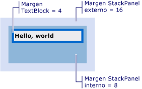

# C&#243;mo: Obtener el desplazamiento de un objeto Visual
En estos ejemplos se muestra cómo recuperar el valor de desplazamiento de un objeto visual relativo a su elemento primario o a cualquier antecesor o descendiente.  
  
## Ejemplo  
 En el ejemplo de marcado siguiente se muestra un control <xref:System.Windows.Controls.TextBlock> que se define con un valor de <xref:System.Windows.FrameworkElement.Margin%2A> de 4.  
  
 [!code-xml[VisualSnippets#VisualSnippet1](../../../../samples/snippets/csharp/VS_Snippets_Wpf/VisualSnippets/CSharp/Window1.xaml#visualsnippet1)]  
  
 En el siguiente ejemplo de código se muestra cómo utilizar el método <xref:System.Windows.Media.VisualTreeHelper.GetOffset%2A> para recuperar el desplazamiento del control <xref:System.Windows.Controls.TextBlock>.  Los valores de desplazamiento se encuentran en el valor de <xref:System.Windows.Vector> devuelto.  
  
 [!code-csharp[VisualSnippets#VisualSnippet2](../../../../samples/snippets/csharp/VS_Snippets_Wpf/VisualSnippets/CSharp/Window1.xaml.cs#visualsnippet2)]
 [!code-vb[VisualSnippets#VisualSnippet2](../../../../samples/snippets/visualbasic/VS_Snippets_Wpf/VisualSnippets/visualbasic/window1.xaml.vb#visualsnippet2)]  
  
 El desplazamiento tiene en cuenta el valor de <xref:System.Windows.FrameworkElement.Margin%2A>.  En este caso, el valor de <xref:System.Windows.Vector.X%2A> es 4 y el valor de <xref:System.Windows.Vector.Y%2A> es 4.  
  
 El valor de desplazamiento devuelto es relativo al elemento primario del objeto <xref:System.Windows.Media.Visual>.  Si desea devolver un valor de desplazamiento que no sea relativo al elemento primario de un objeto <xref:System.Windows.Media.Visual>, utilice el método <xref:System.Windows.Media.Visual.TransformToAncestor%2A>.  
  
## Obtener el desplazamiento relativo a un antecesor  
 En el ejemplo de marcado siguiente se muestra un objeto <xref:System.Windows.Controls.TextBlock> anidado en dos objetos <xref:System.Windows.Controls.StackPanel>.  
  
 [!code-xml[VisualSnippets#VisualSnippet7](../../../../samples/snippets/csharp/VS_Snippets_Wpf/VisualSnippets/CSharp/Window2.xaml#visualsnippet7)]  
  
 En la ilustración siguiente se muestra el resultado del marcado.  
  
   
Objeto TextBlock anidado dentro de dos objetos StackPanel  
  
 En el siguiente ejemplo de código se muestra cómo utilizar el método <xref:System.Windows.Media.Visual.TransformToAncestor%2A> para recuperar el desplazamiento del objeto <xref:System.Windows.Controls.TextBlock> respecto al objeto <xref:System.Windows.Window> contenedor.  Los valores de desplazamiento se encuentran en el valor de <xref:System.Windows.Media.GeneralTransform> devuelto.  
  
 [!code-csharp[VisualSnippets#VisualSnippet5](../../../../samples/snippets/csharp/VS_Snippets_Wpf/VisualSnippets/CSharp/Window1.xaml.cs#visualsnippet5)]
 [!code-vb[VisualSnippets#VisualSnippet5](../../../../samples/snippets/visualbasic/VS_Snippets_Wpf/VisualSnippets/visualbasic/window1.xaml.vb#visualsnippet5)]  
  
 El desplazamiento tiene en cuenta los valores de la propiedad <xref:System.Windows.FrameworkElement.Margin%2A> de todos los objetos del objeto <xref:System.Windows.Window> contendor.  En este caso, el valor de <xref:System.Windows.Vector.X%2A> es 28 \(16 \+ 8 \+ 4\) y el valor de <xref:System.Windows.Vector.Y%2A> es 28.  
  
 El valor de desplazamiento devuelto es relativo al antecesor del objeto <xref:System.Windows.Media.Visual>.  Si desea devolver un valor de desplazamiento que sea relativo al descendiente de un objeto <xref:System.Windows.Media.Visual>, utilice el método <xref:System.Windows.Media.Visual.TransformToDescendant%2A>.  
  
## Obtener el desplazamiento relativo a un descendiente  
 En el ejemplo de marcado siguiente se muestra un objeto <xref:System.Windows.Controls.TextBlock> contenido en un objeto <xref:System.Windows.Controls.StackPanel>.  
  
 [!code-xml[VisualSnippets#VisualSnippet4](../../../../samples/snippets/csharp/VS_Snippets_Wpf/VisualSnippets/CSharp/Window1.xaml#visualsnippet4)]  
  
 En el siguiente ejemplo de código se muestra cómo utilizar el método <xref:System.Windows.Media.Visual.TransformToDescendant%2A> para recuperar el desplazamiento del objeto <xref:System.Windows.Controls.StackPanel> respecto a su objeto <xref:System.Windows.Controls.TextBlock> secundario.  Los valores de desplazamiento se encuentran en el valor de <xref:System.Windows.Media.GeneralTransform> devuelto.  
  
 [!code-csharp[VisualSnippets#VisualSnippet9](../../../../samples/snippets/csharp/VS_Snippets_Wpf/VisualSnippets/CSharp/Window1.xaml.cs#visualsnippet9)]
 [!code-vb[VisualSnippets#VisualSnippet9](../../../../samples/snippets/visualbasic/VS_Snippets_Wpf/VisualSnippets/visualbasic/window1.xaml.vb#visualsnippet9)]  
  
 El desplazamiento tiene en cuenta los valores de la propiedad <xref:System.Windows.FrameworkElement.Margin%2A> de todos los objetos.  En este caso, el valor de <xref:System.Windows.Vector.X%2A> es \-4 y el valor de <xref:System.Windows.Vector.Y%2A> es \-4.  Los valores de desplazamiento son valores negativos porque el objeto primario tiene un desplazamiento negativo respecto a su objeto secundario.  
  
## Vea también  
 <xref:System.Windows.Media.Visual>   
 <xref:System.Windows.Media.VisualTreeHelper>   
 [Información general sobre la representación de gráficos en WPF](../../../../docs/framework/wpf/graphics-multimedia/wpf-graphics-rendering-overview.md)