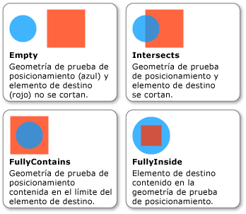

# Cómo: Realizar una prueba de posicionamiento usando Geometry como parámetroHow to: Hit Test Using Geometry as a Parameter
Este ejemplo muestra cómo realizar una prueba de posicionamiento en un objeto visual mediante un <xref:System.Windows.Media.Geometry> como un impacto en el parámetro de la prueba.This example shows how to perform a hit test on a visual object using a <xref:System.Windows.Media.Geometry> as a hit test parameter.  
  
## EjemploExample  
 En el ejemplo siguiente se muestra cómo configurar una prueba de posicionamiento usando <xref:System.Windows.Media.GeometryHitTestParameters> para el <xref:System.Windows.Media.VisualTreeHelper.HitTest%2A> método.The following example shows how to set up a hit test using <xref:System.Windows.Media.GeometryHitTestParameters> for the <xref:System.Windows.Media.VisualTreeHelper.HitTest%2A> method. El <xref:System.Windows.Point> valor que se pasa a la `OnMouseDown` método se utiliza para crear un <xref:System.Windows.Media.Geometry> objeto con el fin de ampliar el intervalo de la prueba de posicionamiento.The <xref:System.Windows.Point> value that is passed to the `OnMouseDown` method is used to create a <xref:System.Windows.Media.Geometry> object in order to expand the range of the hit test.  
  
 [!code-csharp[HitTestingOverview#HitTestingOverviewSnippet10](../../../../samples/snippets/csharp/VS_Snippets_Wpf/HitTestingOverview/CSharp/GeometryHitTest.cs#hittestingoverviewsnippet10)]
 [!code-vb[HitTestingOverview#HitTestingOverviewSnippet10](../../../../samples/snippets/visualbasic/VS_Snippets_Wpf/HitTestingOverview/visualbasic/geometryhittest.vb#hittestingoverviewsnippet10)]  
  
 El <xref:System.Windows.Media.GeometryHitTestResult.IntersectionDetail%2A> propiedad de <xref:System.Windows.Media.GeometryHitTestResult> proporciona información acerca de los resultados de una prueba de posicionamiento que utiliza un <xref:System.Windows.Media.Geometry> como un impacto en el parámetro de la prueba.The <xref:System.Windows.Media.GeometryHitTestResult.IntersectionDetail%2A> property of <xref:System.Windows.Media.GeometryHitTestResult> provides information about the results of a hit test that uses a <xref:System.Windows.Media.Geometry> as a hit test parameter. La siguiente ilustración muestra la relación entre la geometría de la prueba de posicionamiento (círculo azul) y el contenido representado del objeto visual de destino (cuadrado rojo).The following illustration shows the relationship between the hit test geometry (the blue circle) and the rendered content of the target visual object (the red square).  
  
   
Intersección entre la geometría de la prueba de posicionamiento y el objeto visual de destinoIntersection between hit test geometry and target visual object  
  
 En el ejemplo siguiente se muestra cómo implementar una devolución de llamada de la prueba de posicionamiento cuando un <xref:System.Windows.Media.Geometry> se utiliza como un parámetro de la prueba de posicionamiento.The following example shows how to implement a hit test callback when a <xref:System.Windows.Media.Geometry> is used as a hit test parameter. El `result` parámetro se convierte en una <xref:System.Windows.Media.GeometryHitTestResult> con el fin de recuperar el valor de la <xref:System.Windows.Media.GeometryHitTestResult.IntersectionDetail%2A> propiedad.The `result` parameter is cast to a <xref:System.Windows.Media.GeometryHitTestResult> in order to retrieve the value of the <xref:System.Windows.Media.GeometryHitTestResult.IntersectionDetail%2A> property. El valor de propiedad le permite determinar si el <xref:System.Windows.Media.Geometry> parámetro de prueba de posicionamiento está total o parcialmente dentro del contenido representado de la prueba de posicionamiento de destino.The property value allows you to determine if the <xref:System.Windows.Media.Geometry> hit test parameter is fully or partially contained within the rendered content of the hit test target. En este caso, el código de ejemplo solo está agregando los resultados de la prueba de posicionamiento a la lista para elementos visuales que estén totalmente entro del límite de destino.In this case, the sample code is only adding hit test results to the list for visuals that are fully contained within the target boundary.  
  
 [!code-csharp[HitTestingOverview#HitTestingOverviewSnippet11](../../../../samples/snippets/csharp/VS_Snippets_Wpf/HitTestingOverview/CSharp/GeometryHitTest.cs#hittestingoverviewsnippet11)]
 [!code-vb[HitTestingOverview#HitTestingOverviewSnippet11](../../../../samples/snippets/visualbasic/VS_Snippets_Wpf/HitTestingOverview/visualbasic/geometryhittest.vb#hittestingoverviewsnippet11)]  
  
> [!NOTE]
>  El <xref:System.Windows.Media.HitTestResult> devolución de llamada no debe llamarse una vez el detalle de la intersección <xref:System.Windows.Media.IntersectionDetail.Empty>.The <xref:System.Windows.Media.HitTestResult> callback should not be called when the intersection detail is <xref:System.Windows.Media.IntersectionDetail.Empty>.  
  
## Vea tambiénSee Also  
 [Realizar pruebas de posicionamiento en la capa visualHit Testing in the Visual Layer](../../../../docs/framework/wpf/graphics-multimedia/hit-testing-in-the-visual-layer.md)  
 [Geometría de una prueba de posicionamiento en un objeto VisualHit Test Geometry in a Visual](../../../../docs/framework/wpf/graphics-multimedia/how-to-hit-test-geometry-in-a-visual.md)
