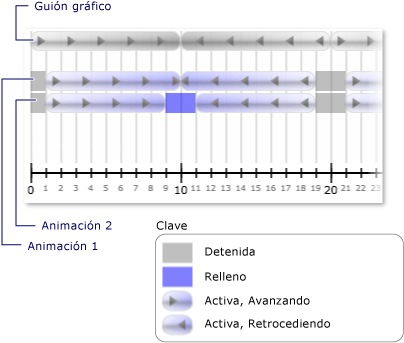

# Procedimiento Recibir una notificación cuando cambia el estado de un relojHow to: Receive Notification When a Clock's State Changes
Un reloj <xref:System.Windows.Media.Animation.Clock.CurrentStateInvalidated> evento tiene lugar cuando su <xref:System.Windows.Media.Animation.Clock.CurrentState%2A> deja de ser válido, por ejemplo, cuando se inicia o detiene el reloj.A clock's <xref:System.Windows.Media.Animation.Clock.CurrentStateInvalidated> event occurs when its <xref:System.Windows.Media.Animation.Clock.CurrentState%2A> becomes invalid, such as when the clock starts or stops. Puede registrarse para este evento con directamente mediante un <xref:System.Windows.Media.Animation.Clock>, o bien puede registrar con un <xref:System.Windows.Media.Animation.Timeline>.You can register for this event with directly using a <xref:System.Windows.Media.Animation.Clock>, or you can register using a <xref:System.Windows.Media.Animation.Timeline>.  
  
 En el ejemplo siguiente, un <xref:System.Windows.Media.Animation.Storyboard> y dos <xref:System.Windows.Media.Animation.DoubleAnimation> objetos se utilizan para animar el ancho de dos rectángulos.In the following example, a <xref:System.Windows.Media.Animation.Storyboard> and two <xref:System.Windows.Media.Animation.DoubleAnimation> objects are used to animate the width of two rectangles. El <xref:System.Windows.Media.Animation.Timeline.CurrentStateInvalidated> eventos se usan para realizar escuchas de los cambios de estado de reloj.The <xref:System.Windows.Media.Animation.Timeline.CurrentStateInvalidated> event is used to listen for clock state changes.  
  
## EjemploExample  
 [!code-xaml[timingbehaviors_snip#_graphicsmm_StateExampleMarkupWholePage](../../../../samples/snippets/csharp/VS_Snippets_Wpf/timingbehaviors_snip/CSharp/StateExample.xaml#_graphicsmm_stateexamplemarkupwholepage)]  
  
 [!code-csharp[timingbehaviors_snip#_graphicsmm_StateEventHandlers](../../../../samples/snippets/csharp/VS_Snippets_Wpf/timingbehaviors_snip/CSharp/StateExample.xaml.cs#_graphicsmm_stateeventhandlers)]
 [!code-vb[timingbehaviors_snip#_graphicsmm_StateEventHandlers](../../../../samples/snippets/visualbasic/VS_Snippets_Wpf/timingbehaviors_snip/visualbasic/stateexample.xaml.vb#_graphicsmm_stateeventhandlers)]  
  
 En la siguiente ilustración muestra los distintos Estados de las animaciones se especifica como la escala de tiempo primaria (*guión gráfico*) progresa.The following illustration shows the different states the animations enter as the parent timeline (*Storyboard*) progresses.  
  
   
  
 La siguiente tabla muestra las horas en que *Animation1*del <xref:System.Windows.Media.Animation.Timeline.CurrentStateInvalidated> desencadena el evento:The following table shows the times at which *Animation1*'s <xref:System.Windows.Media.Animation.Timeline.CurrentStateInvalidated> event fires:  
  
||||||||  
|-|-|-|-|-|-|-|  
|Tiempo (segundos)Time (Seconds)|11|1010|1919|2121|3030|3939|  
|EstadoState|ActivoActive|ActivoActive|DetenidoStopped|ActivoActive|ActivoActive|DetenidoStopped|  
  
 La siguiente tabla muestra las horas en que *Animation2*del <xref:System.Windows.Media.Animation.Timeline.CurrentStateInvalidated> desencadena el evento:The following table shows the times at which *Animation2*'s <xref:System.Windows.Media.Animation.Timeline.CurrentStateInvalidated> event fires:  
  
||||||||||  
|-|-|-|-|-|-|-|-|-|  
|Tiempo (segundos)Time (Seconds)|11|99|1111|1919|2121|2929|3131|3939|  
|EstadoState|ActivoActive|RellenarFilling|ActivoActive|DetenidoStopped|ActivoActive|RellenarFilling|ActivoActive|DetenidoStopped|  
  
 Tenga en cuenta que *Animation1*del <xref:System.Windows.Media.Animation.Timeline.CurrentStateInvalidated> evento se desencadena en 10 segundos, aunque su estado sigue siendo <xref:System.Windows.Media.Animation.ClockState.Active>.Notice that *Animation1*'s  <xref:System.Windows.Media.Animation.Timeline.CurrentStateInvalidated> event fires at 10 seconds, even though its state remains <xref:System.Windows.Media.Animation.ClockState.Active>. Eso es porque su estado cambia a 10 segundos, pero puede cambiar de <xref:System.Windows.Media.Animation.ClockState.Active> a <xref:System.Windows.Media.Animation.ClockState.Filling> y luego volver a <xref:System.Windows.Media.Animation.ClockState.Active> en el mismo paso.That's because its state changed at 10 seconds, but it changed from <xref:System.Windows.Media.Animation.ClockState.Active> to <xref:System.Windows.Media.Animation.ClockState.Filling> and then back to <xref:System.Windows.Media.Animation.ClockState.Active> in the same tick.
