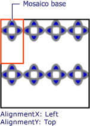
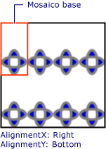

# Procedimiento Establecer la alineación horizontal y vertical de un TileBrushHow to: Set the Horizontal and Vertical Alignment of a TileBrush
En este ejemplo se muestra cómo controlar la alineación horizontal y vertical del contenido en un mosaico.This example shows how to control the horizontal and vertical alignment of content in a tile. Para controlar la alineación horizontal y vertical de un <xref:System.Windows.Media.TileBrush>, use su <xref:System.Windows.Media.TileBrush.AlignmentX%2A> y <xref:System.Windows.Media.TileBrush.AlignmentY%2A> propiedades.To control the horizontal and vertical alignment of a <xref:System.Windows.Media.TileBrush>, use its <xref:System.Windows.Media.TileBrush.AlignmentX%2A> and <xref:System.Windows.Media.TileBrush.AlignmentY%2A> properties.  
  
 El <xref:System.Windows.Media.TileBrush.AlignmentX%2A> y <xref:System.Windows.Media.TileBrush.AlignmentY%2A> las propiedades de un <xref:System.Windows.Media.TileBrush> se usan cuando cualquiera de las siguientes condiciones es verdadera:The <xref:System.Windows.Media.TileBrush.AlignmentX%2A> and <xref:System.Windows.Media.TileBrush.AlignmentY%2A> properties of a <xref:System.Windows.Media.TileBrush> are used when either of the following conditions is true:  
  
-   El <xref:System.Windows.Media.TileBrush.Stretch%2A> propiedad es <xref:System.Windows.Media.Stretch.Uniform> o <xref:System.Windows.Media.Stretch.UniformToFill> y <xref:System.Windows.Media.TileBrush.Viewbox%2A> y <xref:System.Windows.Media.TileBrush.Viewport%2A> tienen relaciones de aspecto diferentes.The <xref:System.Windows.Media.TileBrush.Stretch%2A> property is <xref:System.Windows.Media.Stretch.Uniform> or <xref:System.Windows.Media.Stretch.UniformToFill> and the <xref:System.Windows.Media.TileBrush.Viewbox%2A> and <xref:System.Windows.Media.TileBrush.Viewport%2A> have different aspect ratios.  
  
-   El <xref:System.Windows.Media.TileBrush.Stretch%2A> propiedad es <xref:System.Windows.Media.Stretch.None> y <xref:System.Windows.Media.TileBrush.Viewbox%2A> y <xref:System.Windows.Media.TileBrush.Viewport%2A> tienen tamaños diferentes.The <xref:System.Windows.Media.TileBrush.Stretch%2A> property is <xref:System.Windows.Media.Stretch.None> and the <xref:System.Windows.Media.TileBrush.Viewbox%2A> and <xref:System.Windows.Media.TileBrush.Viewport%2A> are different sizes.  
  
## EjemploExample  
 El ejemplo siguiente alinea el contenido de un <xref:System.Windows.Media.DrawingBrush>, que es un tipo de <xref:System.Windows.Media.TileBrush>, a la esquina superior izquierda de su mosaico.The following example aligns the content of a <xref:System.Windows.Media.DrawingBrush>, which is a type of <xref:System.Windows.Media.TileBrush>, to the upper-left corner of its tile. Para alinear el contenido, el ejemplo establece la <xref:System.Windows.Media.TileBrush.AlignmentX%2A> propiedad de la <xref:System.Windows.Media.DrawingBrush> a <xref:System.Windows.Media.AlignmentX.Left> y el <xref:System.Windows.Media.TileBrush.AlignmentY%2A> propiedad <xref:System.Windows.Media.AlignmentY.Top>.To align the content, the example sets the <xref:System.Windows.Media.TileBrush.AlignmentX%2A> property of the <xref:System.Windows.Media.DrawingBrush> to <xref:System.Windows.Media.AlignmentX.Left> and the <xref:System.Windows.Media.TileBrush.AlignmentY%2A> property to <xref:System.Windows.Media.AlignmentY.Top>. Este ejemplo produce el siguiente resultado:This example produces the following output.  
  
   
TileBrush con alineación de contenido en la esquina superior izquierdaTileBrush with content aligned to the upper-left corner  
  
 [!code-csharp[brushoverviewexamples_snip#TileBrushTopLeftAlignmentInline](~/samples/snippets/csharp/VS_Snippets_Wpf/BrushOverviewExamples_snip/CSharp/TileBrushAlignmentExample.cs#tilebrushtopleftalignmentinline)]
 [!code-vb[brushoverviewexamples_snip#TileBrushTopLeftAlignmentInline](~/samples/snippets/visualbasic/VS_Snippets_Wpf/BrushOverviewExamples_snip/visualbasic/tilebrushalignmentexample.vb#tilebrushtopleftalignmentinline)]
 [!code-xaml[brushoverviewexamples_snip#TileBrushTopLeftAlignmentInline](~/samples/snippets/xaml/VS_Snippets_Wpf/BrushOverviewExamples_snip/XAML/TileBrushAlignmentExample.xaml#tilebrushtopleftalignmentinline)]  
  
## EjemploExample  
 En el ejemplo siguiente se alinea el contenido de un <xref:System.Windows.Media.DrawingBrush> a la esquina inferior derecha de su mosaico estableciendo la <xref:System.Windows.Media.TileBrush.AlignmentX%2A> propiedad <xref:System.Windows.Media.AlignmentX.Right> y el <xref:System.Windows.Media.TileBrush.AlignmentY%2A> propiedad <xref:System.Windows.Media.AlignmentY.Bottom>.The next example aligns the content of a <xref:System.Windows.Media.DrawingBrush> to the lower-right corner of its tile by setting the <xref:System.Windows.Media.TileBrush.AlignmentX%2A> property to <xref:System.Windows.Media.AlignmentX.Right> and the <xref:System.Windows.Media.TileBrush.AlignmentY%2A> property to <xref:System.Windows.Media.AlignmentY.Bottom>. El ejemplo genera el siguiente resultado.The example produces the following output.  
  
   
TileBrush con alineación de contenido en la esquina inferior derechaTileBrush with content aligned to the lower-right corner  
  
 [!code-csharp[brushoverviewexamples_snip#TileBrushBottomRightAlignmentInline](~/samples/snippets/csharp/VS_Snippets_Wpf/BrushOverviewExamples_snip/CSharp/TileBrushAlignmentExample.cs#tilebrushbottomrightalignmentinline)]
 [!code-vb[brushoverviewexamples_snip#TileBrushBottomRightAlignmentInline](~/samples/snippets/visualbasic/VS_Snippets_Wpf/BrushOverviewExamples_snip/visualbasic/tilebrushalignmentexample.vb#tilebrushbottomrightalignmentinline)]
 [!code-xaml[brushoverviewexamples_snip#TileBrushBottomRightAlignmentInline](~/samples/snippets/xaml/VS_Snippets_Wpf/BrushOverviewExamples_snip/XAML/TileBrushAlignmentExample.xaml#tilebrushbottomrightalignmentinline)]  
  
## EjemploExample  
 En el ejemplo siguiente se alinea el contenido de un <xref:System.Windows.Media.DrawingBrush> a la esquina superior izquierda de su mosaico estableciendo la <xref:System.Windows.Media.TileBrush.AlignmentX%2A> propiedad <xref:System.Windows.Media.AlignmentX.Left> y el <xref:System.Windows.Media.TileBrush.AlignmentY%2A> propiedad <xref:System.Windows.Media.AlignmentY.Top>.The next example aligns the content of a <xref:System.Windows.Media.DrawingBrush> to the upper-left corner of its tile by setting the <xref:System.Windows.Media.TileBrush.AlignmentX%2A> property to <xref:System.Windows.Media.AlignmentX.Left> and the <xref:System.Windows.Media.TileBrush.AlignmentY%2A> property to <xref:System.Windows.Media.AlignmentY.Top>. También establece la <xref:System.Windows.Media.TileBrush.Viewport%2A> y <xref:System.Windows.Media.TileBrush.TileMode%2A> de la <xref:System.Windows.Media.DrawingBrush> para generar un modelo de mosaico.It also sets the <xref:System.Windows.Media.TileBrush.Viewport%2A> and <xref:System.Windows.Media.TileBrush.TileMode%2A> of the <xref:System.Windows.Media.DrawingBrush> to produce a tile pattern. El ejemplo genera el siguiente resultado.The example produces the following output.  
  
   
Patrón de mosaico con el contenido alineado en la parte superior izquierda en el mosaico baseTile pattern with content aligned to upper-left in base tile  
  
 La ilustración destaca el mosaico base, por lo que puede ver cómo se alinea el contenido.The illustration highlights abase tile so that you can see how its content is aligned. Tenga en cuenta que el <xref:System.Windows.Media.TileBrush.AlignmentX%2A> configuración no tiene ningún efecto porque el contenido de la <xref:System.Windows.Media.DrawingBrush> rellena al completo el mosaico base horizontalmente.Notice that the <xref:System.Windows.Media.TileBrush.AlignmentX%2A> setting has no effect because the content of the <xref:System.Windows.Media.DrawingBrush> completely fills the base tile horizontally.  
  
 [!code-csharp[brushoverviewexamples_snip#TileBrushTopLeftAlignmentTiledInline](~/samples/snippets/csharp/VS_Snippets_Wpf/BrushOverviewExamples_snip/CSharp/TileBrushAlignmentExample.cs#tilebrushtopleftalignmenttiledinline)]
 [!code-vb[brushoverviewexamples_snip#TileBrushTopLeftAlignmentTiledInline](~/samples/snippets/visualbasic/VS_Snippets_Wpf/BrushOverviewExamples_snip/visualbasic/tilebrushalignmentexample.vb#tilebrushtopleftalignmenttiledinline)]
 [!code-xaml[brushoverviewexamples_snip#TileBrushTopLeftAlignmentTiledInline](~/samples/snippets/xaml/VS_Snippets_Wpf/BrushOverviewExamples_snip/XAML/TileBrushAlignmentExample.xaml#tilebrushtopleftalignmenttiledinline)]  
  
## EjemploExample  
 En el ejemplo final se alinea el contenido de un mosaico <xref:System.Windows.Media.DrawingBrush> a la esquina inferior derecha de su mosaico base estableciendo la <xref:System.Windows.Media.TileBrush.AlignmentX%2A> propiedad <xref:System.Windows.Media.AlignmentX.Right> y el <xref:System.Windows.Media.TileBrush.AlignmentY%2A> propiedad <xref:System.Windows.Media.AlignmentY.Bottom>.The final example aligns the content of a tiled <xref:System.Windows.Media.DrawingBrush> to the lower-right of its base tile by setting the <xref:System.Windows.Media.TileBrush.AlignmentX%2A> property to <xref:System.Windows.Media.AlignmentX.Right> and the <xref:System.Windows.Media.TileBrush.AlignmentY%2A> property to <xref:System.Windows.Media.AlignmentY.Bottom>. El ejemplo genera el siguiente resultado.The example produces the following output.  
  
   
Patrón de mosaico con el contenido alineado en la parte inferior derecha en el mosaico baseTile pattern with content aligned to lower-right in base tile  
  
 Nuevamente, el <xref:System.Windows.Media.TileBrush.AlignmentX%2A> configuración no tiene ningún efecto porque el contenido de la <xref:System.Windows.Media.DrawingBrush> rellena al completo el mosaico base horizontalmente.Again, the <xref:System.Windows.Media.TileBrush.AlignmentX%2A> setting has no effect because the content of the <xref:System.Windows.Media.DrawingBrush> completely fills the base tile horizontally.  
  
 [!code-csharp[brushoverviewexamples_snip#TileBrushBottomRightAlignmentInline](~/samples/snippets/csharp/VS_Snippets_Wpf/BrushOverviewExamples_snip/CSharp/TileBrushAlignmentExample.cs#tilebrushbottomrightalignmentinline)]
 [!code-vb[brushoverviewexamples_snip#TileBrushBottomRightAlignmentInline](~/samples/snippets/visualbasic/VS_Snippets_Wpf/BrushOverviewExamples_snip/visualbasic/tilebrushalignmentexample.vb#tilebrushbottomrightalignmentinline)]
 [!code-xaml[brushoverviewexamples_snip#TileBrushBottomRightAlignmentInline](~/samples/snippets/xaml/VS_Snippets_Wpf/BrushOverviewExamples_snip/XAML/TileBrushAlignmentExample.xaml#tilebrushbottomrightalignmentinline)]  
  
 Los ejemplos usan <xref:System.Windows.Media.DrawingBrush> objetos para demostrar cómo el <xref:System.Windows.Media.TileBrush.AlignmentX%2A> y <xref:System.Windows.Media.TileBrush.AlignmentY%2A> se usan las propiedades.The examples use <xref:System.Windows.Media.DrawingBrush> objects to demonstrate how the <xref:System.Windows.Media.TileBrush.AlignmentX%2A> and <xref:System.Windows.Media.TileBrush.AlignmentY%2A> properties are used. Estas propiedades se comportan exactamente igual para todos los pinceles en mosaicos: <xref:System.Windows.Media.DrawingBrush>, <xref:System.Windows.Media.ImageBrush>, y <xref:System.Windows.Media.VisualBrush>.These properties behave identically for all the tile brushes: <xref:System.Windows.Media.DrawingBrush>, <xref:System.Windows.Media.ImageBrush>, and <xref:System.Windows.Media.VisualBrush>. Para más información sobre los pinceles en mosaicos, vea [Pintar con imágenes, dibujos y elementos visuales](painting-with-images-drawings-and-visuals.md).For more information about tile brushes, see [Painting with Images, Drawings, and Visuals](painting-with-images-drawings-and-visuals.md).  
  
## Vea tambiénSee also

- <xref:System.Windows.Media.DrawingBrush>
- <xref:System.Windows.Media.ImageBrush>
- <xref:System.Windows.Media.VisualBrush>
- [Pintar con imágenes, dibujos y elementos visualesPainting with Images, Drawings, and Visuals](painting-with-images-drawings-and-visuals.md)
