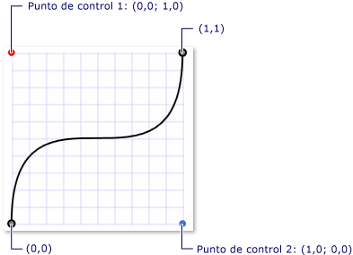
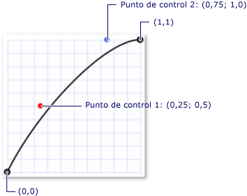

# Información general sobre animaciones de fotogramas clave
Este tema es una introducción a las animaciones de fotogramas clave. Las animaciones de fotogramas clave le permiten realizar animaciones con más de dos valores de destino y controlan el método de interpolación de una animación.  
  

## Requisitos previos  
 Para entender esta introducción, debe conocer las animaciones y escalas de tiempo de [!INCLUDE[TLA#tla_winclient](../../../../includes/tlasharptla-winclient-md.md)]. Consulte [Información general sobre animaciones](animation-overview.md) para ver una introducción a las animaciones. También resulta útil conocer las animaciones From/To/By. Para más información, consulte la información general sobre animaciones From/To/By.  
  

## ¿Qué es una animación de fotogramas clave?  
 Al igual que una animación From/To/By, una animación de fotogramas clave anima el valor de una propiedad de destino. Crea una transición entre sus <xref:System.Windows.Media.Animation.Timeline.Duration%2A>valores de destino sobre su archivo . Sin embargo, mientras que una animación From/To/By crea una transición entre dos valores, una animación de fotogramas clave única puede crear transiciones entre cualquier número de valores de destino. A diferencia de una animación From/To/By, una animación de fotogramas clave no tiene propiedades From, To o By con las cuales establecer sus valores de destino. Los valores de destino de una animación de fotogramas clave se describen con objetos de fotogramas clave (de ahí surge el término "animación de fotogramas clave"). Para especificar los valores de destino de la animación, cree <xref:System.Windows.Media.Animation.DoubleAnimationUsingKeyFrames.KeyFrames%2A> objetos de fotograma clave y agréguelos a la colección de la animación. Cuando se ejecuta la animación, transiciona entre los fotogramas que especificó.  
  
 Además de admitir varios valores de destino, algunos métodos de fotogramas clave incluso admiten varios métodos de interpolación. El método de interpolación de una animación define cómo transiciona de un valor al siguiente. Hay tres tipos de interpolaciones: discreta, lineal y spline.  
  
 Para animar con una animación de fotogramas clave, debe completar los pasos siguientes.  
  
- Declare la animación <xref:System.Windows.Media.Animation.Timeline.Duration%2A>y especifique su , al igual que lo haría para una animación de /a/por.  
  
- Para cada valor de destino, cree un fotograma clave <xref:System.Windows.Media.Animation.KeyTime>del tipo adecuado, establezca <xref:System.Windows.Media.Animation.DoubleAnimationUsingKeyFrames.KeyFrames%2A> su valor y , y agréguelo a la colección de la animación.  
  
- Asocie la animación a una propiedad, tal como lo haría con una animación From/To/By. Para más información sobre cómo aplicar una animación a una propiedad a través de un guión gráfico, consulte [Información sobre objetos Storyboard](storyboards-overview.md).  
  
 En el ejemplo <xref:System.Windows.Media.Animation.DoubleAnimationUsingKeyFrames> siguiente <xref:System.Windows.Shapes.Rectangle> se usa a para animar un elemento a cuatro ubicaciones diferentes.  
  
 [!code-xaml[keyframes_ovw_snippet#BasicKeyFrameExampleWholePage](~/samples/snippets/csharp/VS_Snippets_Wpf/keyframes_ovw_snippet/CS/KeyFramesIntroduction.xaml#basickeyframeexamplewholepage)]  
  
 Al igual que una animación From/To/By, se puede aplicar <xref:System.Windows.Media.Animation.Storyboard> una animación de <xref:System.Windows.Media.Animation.Animatable.BeginAnimation%2A> fotograma clave a una propiedad mediante un código y un marcado en arometida o mediante el método en el código. También puede utilizar una animación de <xref:System.Windows.Media.Animation.AnimationClock> fotograma clave para crear una y aplicarla a una o varias propiedades. Para más información sobre los distintos métodos para aplicar animaciones, consulte la [Información general sobre técnicas de animación de propiedades](property-animation-techniques-overview.md).  
  

## Tipos de animación de fotogramas clave  
 Dado que las animaciones generan valores de propiedad, existen distintos tipos de animaciones para los diversos tipos de propiedades. Para animar una propiedad <xref:System.Double> que toma un <xref:System.Windows.FrameworkElement.Width%2A> (por ejemplo, la propiedad <xref:System.Double> de un elemento), utilice una animación que produce valores. Para animar una propiedad <xref:System.Windows.Point>que toma un , <xref:System.Windows.Point> utilice una animación que produce valores, etc.  
  
 Las clases de animación <xref:System.Windows.Media.Animation> de fotogramas clave pertenecen al espacio de nombres y se adhieren a la siguiente convención de nomenclatura:  
  
 * \<Tipo>*`AnimationUsingKeyFrames`  
  
 Donde * \<Type>* es el tipo de valor que anima la clase.  
  
 [!INCLUDE[TLA2#tla_winclient](../../../../includes/tla2sharptla-winclient-md.md)] proporciona las siguientes clases de animación de fotogramas clave.  
  
|Tipo de propiedad|Clase de animación From/To/By correspondiente|Métodos de interpolación admitidos|  
|-------------------|------------------------------------------------|-------------------------------------|  
|<xref:System.Boolean>|<xref:System.Windows.Media.Animation.BooleanAnimationUsingKeyFrames>|Discrete|  
|<xref:System.Byte>|<xref:System.Windows.Media.Animation.ByteAnimationUsingKeyFrames>|Discreta, lineal, spline|  
|<xref:System.Windows.Media.Color>|<xref:System.Windows.Media.Animation.ColorAnimationUsingKeyFrames>|Discreta, lineal, spline|  
|<xref:System.Decimal>|<xref:System.Windows.Media.Animation.DecimalAnimationUsingKeyFrames>|Discreta, lineal, spline|  
|<xref:System.Double>|<xref:System.Windows.Media.Animation.DoubleAnimationUsingKeyFrames>|Discreta, lineal, spline|  
|<xref:System.Int16>|<xref:System.Windows.Media.Animation.Int16AnimationUsingKeyFrames>|Discreta, lineal, spline|  
|<xref:System.Int32>|<xref:System.Windows.Media.Animation.Int32AnimationUsingKeyFrames>|Discreta, lineal, spline|  
|<xref:System.Int64>|<xref:System.Windows.Media.Animation.Int64AnimationUsingKeyFrames>|Discreta, lineal, spline|  
|<xref:System.Windows.Media.Matrix>|<xref:System.Windows.Media.Animation.MatrixAnimationUsingKeyFrames>|Discrete|  
|<xref:System.Object>|<xref:System.Windows.Media.Animation.ObjectAnimationUsingKeyFrames>|Discrete|  
|<xref:System.Windows.Point>|<xref:System.Windows.Media.Animation.PointAnimationUsingKeyFrames>|Discreta, lineal, spline|  
|<xref:System.Windows.Media.Media3D.Quaternion>|<xref:System.Windows.Media.Animation.QuaternionAnimationUsingKeyFrames>|Discreta, lineal, spline|  
|<xref:System.Windows.Rect>|<xref:System.Windows.Media.Animation.RectAnimationUsingKeyFrames>|Discreta, lineal, spline|  
|<xref:System.Windows.Media.Media3D.Rotation3D>|<xref:System.Windows.Media.Animation.Rotation3DAnimationUsingKeyFrames>|Discreta, lineal, spline|  
|<xref:System.Single>|<xref:System.Windows.Media.Animation.SingleAnimationUsingKeyFrames>|Discreta, lineal, spline|  
|<xref:System.String>|<xref:System.Windows.Media.Animation.StringAnimationUsingKeyFrames>|Discrete|  
|<xref:System.Windows.Size>|<xref:System.Windows.Media.Animation.SizeAnimationUsingKeyFrames>|Discreta, lineal, spline|  
|<xref:System.Windows.Thickness>|<xref:System.Windows.Media.Animation.ThicknessAnimationUsingKeyFrames>|Discreta, lineal, spline|  
|<xref:System.Windows.Media.Media3D.Vector3D>|<xref:System.Windows.Media.Animation.Vector3DAnimationUsingKeyFrames>|Discreta, lineal, spline|  
|<xref:System.Windows.Vector>|<xref:System.Windows.Media.Animation.VectorAnimationUsingKeyFrames>|Discreta, lineal, spline|  
  

## Valores de destino (fotogramas clave) y valores KeyTime  
 Del mismo modo que hay distintos tipos de animaciones de fotogramas clave para animar diferentes tipos de propiedades, también hay distintos tipos de objetos de fotogramas clave: uno para cada tipo de valor animado y método de interpolación admitido. Los tipos de fotogramas clave cumplen con la convención de nomenclatura siguiente:  
  
 *InterpolationMethod \<>Type>\<*`KeyFrame`  
  
 Donde * \<InterpolationMethod>* es el método de interpolación que utiliza el fotograma clave y * \<Type>* es el tipo de valor que la clase anima. Una animación de fotogramas clave que admite los tres métodos de interpolación tendrá tres tipos de fotogramas clave que se pueden usar. Por ejemplo, puede utilizar tres tipos <xref:System.Windows.Media.Animation.DoubleAnimationUsingKeyFrames> <xref:System.Windows.Media.Animation.DiscreteDoubleKeyFrame>de <xref:System.Windows.Media.Animation.LinearDoubleKeyFrame>fotogramas clave con : , , y <xref:System.Windows.Media.Animation.SplineDoubleKeyFrame>. (Los métodos de interpolación se describen detalladamente en una sección posterior).  
  
 El propósito principal de un fotograma <xref:System.Windows.Media.Animation.IKeyFrame.KeyTime%2A> clave <xref:System.Windows.Media.Animation.IKeyFrame.Value%2A>es especificar a y un archivo . Cada tipo de fotograma clave proporciona estas dos propiedades.  
  
- La <xref:System.Windows.Media.Animation.IKeyFrame.Value%2A> propiedad especifica el valor de destino para ese fotograma clave.  
  
- La <xref:System.Windows.Media.Animation.IKeyFrame.KeyTime%2A> propiedad especifica cuándo (dentro <xref:System.Windows.Media.Animation.Timeline.Duration%2A>de la animación <xref:System.Windows.Media.Animation.IKeyFrame.Value%2A> ) se alcanza un fotograma clave.  
  
 Cuando comienza una animación de fotogramas clave, recorre en <xref:System.Windows.Media.Animation.IKeyFrame.KeyTime%2A> iteración sus fotogramas clave en el orden definido por sus propiedades.  
  
- Si no hay ningún fotograma clave en el momento 0, la animación <xref:System.Windows.Media.Animation.IKeyFrame.Value%2A> crea una transición entre el valor actual de la propiedad de destino y el del primer fotograma clave; de lo contrario, el valor de salida de la animación se convierte en el valor del primer fotograma clave.  
  
- La animación crea <xref:System.Windows.Media.Animation.IKeyFrame.Value%2A> una transición entre el primer y el segundo fotograma clave mediante el método de interpolación especificado por el segundo fotograma clave. La transición comienza en el <xref:System.Windows.Media.Animation.IKeyFrame.KeyTime%2A> primer fotograma clave y <xref:System.Windows.Media.Animation.IKeyFrame.KeyTime%2A> finaliza cuando se alcanza el segundo fotograma clave.  
  
- La animación continúa y crea transiciones entre cada fotograma clave subsiguiente y el fotograma clave precedente.  
  
- Por último, la animación pasa al valor del fotograma clave con el mayor tiempo <xref:System.Windows.Media.Animation.Timeline.Duration%2A>clave que es igual o menor que el de la animación.  
  
 Si la <xref:System.Windows.Media.Animation.Timeline.Duration%2A> animación <xref:System.Windows.Duration.Automatic%2A> es <xref:System.Windows.Media.Animation.Timeline.Duration%2A> o es igual a la hora del último fotograma clave, la animación finaliza. De lo contrario, <xref:System.Windows.Duration> si la animación es mayor que el tiempo clave del último fotograma clave, <xref:System.Windows.Duration>la animación contiene el valor del fotograma clave hasta que llega al final de su archivo . Al igual que todas las animaciones, una animación de fotograma clave utiliza su <xref:System.Windows.Media.Animation.Timeline.FillBehavior%2A> propiedad para determinar si contiene su valor final cuando llega al final de su período activo. Para más información, consulte [Información general sobre comportamientos de control de tiempo](timing-behaviors-overview.md).  
  
 En el ejemplo <xref:System.Windows.Media.Animation.DoubleAnimationUsingKeyFrames> siguiente se utiliza el objeto <xref:System.Windows.Media.Animation.IKeyFrame.Value%2A> definido <xref:System.Windows.Media.Animation.IKeyFrame.KeyTime%2A> en el ejemplo anterior para demostrar cómo funcionan las propiedades.  
  
- El primer fotograma clave establece inmediatamente el valor de salida de la animación en 0.  
  
- El segundo fotograma clave anima desde 0 a 350. Se inicia cuando finaliza el primer fotograma clave (a los 0 segundos) y se reproduce durante 2 segundos, finalizando en 0:0:2.  
  
- El tercer fotograma clave anima desde 350 a 50. Se inicia cuando finaliza el segundo fotograma clave (a los 2 segundos) y se reproduce durante 5 segundos, finalizando en 0:0:7.  
  
- El cuarto fotograma clave anima desde 50 a 200. Se inicia cuando finaliza el tercer fotograma clave (a los 7 segundos) y se reproduce durante 1 segundo, finalizando en 0:0:8.  
  
- Dado <xref:System.Windows.Media.Animation.Timeline.Duration%2A> que la propiedad de la animación se estableció en 10 segundos, la animación contiene su valor final durante dos segundos antes de finalizar en el momento de 0:0:10.  
  
 [!code-xaml[keyframes_ovw_snippet#BasicKeyFrameExampleWholePage](~/samples/snippets/csharp/VS_Snippets_Wpf/keyframes_ovw_snippet/CS/KeyFramesIntroduction.xaml#basickeyframeexamplewholepage)]  
  

## Métodos de interpolación  
 En las secciones anteriores se mencionó que algunas animaciones de fotogramas clave admiten varios métodos de interpolación. La interpolación de una animación describe cómo una animación transiciona entre los valores a lo largo de su duración. Si selecciona el tipo de fotograma clave usar con la animación, puede definir el método de interpolación para ese segmento de fotogramas clave. Hay tres tipos de métodos de interpolación distintos: lineal, discreta y spline.  
  
### Interpolación lineal  
 Con la interpolación lineal, la animación avanza a una velocidad constante de la duración del segmento. Por ejemplo, si un segmento de fotogramas clave transiciona desde 0 a 10 durante 5 segundos, la animación generará los valores siguientes en los momentos especificados:  
  
|Time|Valor de salida|  
|----------|------------------|  
|0|0|  
|1|2|  
|2|4|  
|3|6|  
|4|8|  
|4.25|8.5|  
|4.5.|9|  
|5|10|  
  
### Interpolación discreta  
 Con la interpolación discreta, la función de animación pasa de un valor al siguiente sin interpolación. Si un segmento de fotogramas clave transiciona desde 0 a 10 durante 5 segundos, la animación generará los valores siguientes en los momentos especificados:  
  
|Time|Valor de salida|  
|----------|------------------|  
|0|0|  
|1|0|  
|2|0|  
|3|0|  
|4|0|  
|4.25|0|  
|4.5.|0|  
|5|10|  
  
 Tenga en cuenta que la animación no cambia su valor de salida hasta el final mismo de la duración del segmento.  
  
 La interpolación spline es más compleja. Esta interpolación se describe en la sección siguiente.  
  

### Interpolación spline  
 La interpolación spline se puede usar para lograr efectos de control de tiempo más realistas. Debido a que las animaciones se usan a menudo para imitar los efectos que ocurren en el mundo real, es posible que los desarrolladores necesiten un control detallado de la aceleración y la desaceleración de objetos y una manipulación cercana de los segmentos de tiempo. Los fotogramas clave de spline le permiten animar con la interpolación spline. Con otros fotogramas clave, especifique a <xref:System.Windows.Media.Animation.IKeyFrame.Value%2A> y <xref:System.Windows.Media.Animation.IKeyFrame.KeyTime%2A>. Con un fotograma clave de <xref:System.Windows.Media.Animation.SplineDoubleKeyFrame.KeySpline%2A>spline, también se especifica un . En el ejemplo siguiente se muestra <xref:System.Windows.Media.Animation.DoubleAnimationUsingKeyFrames>un único fotograma clave de spline para un archivo . Observe <xref:System.Windows.Media.Animation.KeySpline> la propiedad; eso es lo que hace que un fotograma clave spline sea diferente de los otros tipos de fotogramas clave.  
  
 [!code-xaml[keyframes_ovw_snippet#SingleSplineKeyFrameExample](~/samples/snippets/csharp/VS_Snippets_Wpf/keyframes_ovw_snippet/CS/InterpolationMethodsExample.xaml#singlesplinekeyframeexample)]  
  
 Un punto inicial, un punto final y dos puntos de control definen una curva Bézier cúbica. La <xref:System.Windows.Media.Animation.KeySpline> propiedad de un fotograma clave de spline define los dos puntos de control de una curva de Bézier que se extiende desde (0,0) hasta (1,1). El primer punto de control controla el factor de curva de la primera mitad de la curva Bézier, mientras que el segundo punto de control, el factor de curva de la segunda mitad. La curva resultante describe la tasa de cambio de ese fotograma clave de spline. Cuanto más inclinada sea la curva, el fotograma clave cambia sus valores más rápidamente. A medida que la curva es cada vez más plana, el fotograma clave cambia sus valores más lentamente.  
  
 Puede utilizar <xref:System.Windows.Media.Animation.KeySpline> para simular trayectorias físicas como caer agua o bolas rebotantes, o aplicar otros efectos de "facilidad de entrada" y "facilidad hacia fuera" a las animaciones de movimiento. Para obtener efectos de interacción con el usuario, como el fundido en el fondo o el rebote del botón de control, podría aplicar la interpolación spline para acelerar o ralentizar la tasa de cambio de una animación de una forma específica.  
  
 En el ejemplo <xref:System.Windows.Media.Animation.KeySpline> siguiente se especifica un de 0,1 1,0, que crea la siguiente curva de Bézier.  
  
   
Una curva spline clave con los puntos de control (0.0, 1.0) y (1.0, 0.0)  
  
 [!code-xaml[keyframes_ovw_snippet#SingleSplineKeyFrameExample](~/samples/snippets/csharp/VS_Snippets_Wpf/keyframes_ovw_snippet/CS/InterpolationMethodsExample.xaml#singlesplinekeyframeexample)]  
  
 Este fotograma clave se anima rápidamente cuando comienza, disminuye la velocidad y vuelve a acelerarla antes de finalizar.  
  
 En el ejemplo <xref:System.Windows.Media.Animation.KeySpline> siguiente se especifica un de 0.5,0.25 0.75,1.0, que crea la siguiente curva de Bézier.  
  
   
Una curva spline clave con los puntos de control (0.25, 0.5) y (0.75, 1.0)  
  
 [!code-xaml[keyframes_ovw_snippet#SingleSplineKeyFrameExampleInline3](~/samples/snippets/csharp/VS_Snippets_Wpf/keyframes_ovw_snippet/CS/InterpolationMethodsExample.xaml#singlesplinekeyframeexampleinline3)]  
  
 Debido a que la curvatura de la curva Bézier cambia muy poco, este fotograma clave se anima a una velocidad casi constante; disminuye la velocidad cerca del final.  
  
 En el ejemplo <xref:System.Windows.Media.Animation.DoubleAnimationUsingKeyFrames> siguiente se utiliza a para animar la posición del rectángulo. Dado <xref:System.Windows.Media.Animation.DoubleAnimationUsingKeyFrames> que <xref:System.Windows.Media.Animation.SplineDoubleKeyFrame> utiliza objetos, la transición entre cada valor de fotograma clave utiliza interpolación splined.  
  
 [!code-xaml[keyframes_ovw_snippet#SplinedInterpolationExample](~/samples/snippets/csharp/VS_Snippets_Wpf/keyframes_ovw_snippet/CS/InterpolationMethodsExample.xaml#splinedinterpolationexample)]  
  
 La interpolación spline puede ser difícil de entender, por lo que puede resultar útil experimentar distintas configuraciones. El [ejemplo de animación de curva spline clave](https://github.com/Microsoft/WPF-Samples/tree/master/Animation/KeySplineAnimations) le permite cambiar los valores de curva spline clave y ver el resultado que esto tiene en una animación.  
  

### Combinación de métodos de interpolación  
 Puede usar fotogramas clave con distintos tipos de interpolación en una animación de fotogramas clave única. Cuando se encuentran dos animaciones de fotogramas clave con distintas interpolaciones, el método de interpolación del segundo fotograma clave se usa para crear la transición desde el primer valor al segundo.  
  
 En el ejemplo <xref:System.Windows.Media.Animation.DoubleAnimationUsingKeyFrames> siguiente, se crea un que utiliza interpolación lineal, splined y discreta.  
  
 [!code-xaml[keyframes_ovw_snippet#ComboInterpolationExample](~/samples/snippets/csharp/VS_Snippets_Wpf/keyframes_ovw_snippet/CS/InterpolationMethodsExample.xaml#combointerpolationexample)]  
  

## Más información sobre Duration y KeyTimes  
 Al igual que otras animaciones, <xref:System.Windows.Duration> las animaciones de fotogramas clave tienen una propiedad. Además de especificar la <xref:System.Windows.Duration>animación, debe especificar qué parte de esa duración se da a cada fotograma clave. Para ello, describa <xref:System.Windows.Media.Animation.IKeyFrame.KeyTime%2A> a para cada uno de los fotogramas clave de la animación. Cada fotograma clave <xref:System.Windows.Media.Animation.IKeyFrame.KeyTime%2A> especifica cuándo finaliza ese fotograma clave.  
  
 La <xref:System.Windows.Media.Animation.IKeyFrame.KeyTime%2A> propiedad no especifica cuánto tiempo se reproduce el tiempo de clave. La cantidad de tiempo durante el cual se reproduce un fotograma clave se determina en virtud del momento en que finaliza el fotograma clave, cuándo finaliza el fotograma clave anterior y la duración de la animación. Los tiempos clave se pueden especificar como un valor <xref:System.Windows.Media.Animation.KeyTime.Uniform%2A> de <xref:System.Windows.Media.Animation.KeyTime.Paced%2A>tiempo, un porcentaje o como valores especiales o .  
  
 En la lista siguiente se describen las distintas formas de especificar los tiempos clave.  
  
### Valores TimeSpan  
 Puede utilizar <xref:System.TimeSpan> valores para <xref:System.Windows.Media.Animation.KeyTime>especificar un archivo . El valor debe ser mayor o igual que 0 y menor o igual que la duración de la animación. En el ejemplo siguiente se muestra una animación con una duración de 10 segundos y 4 fotogramas clave cuyos tiempos clave están especificados como valores de tiempo.  
  
- El primer fotograma clave anima desde el valor base a 100 durante los primeros 3 segundos y finaliza en 0:0:03.  
  
- El segundo fotograma clave anima desde 100 a 200. Se inicia cuando finaliza el primer fotograma clave (a los 3 segundos) y se reproduce durante 5 segundos, finalizando en 0:0:8.  
  
- El tercer fotograma clave anima desde 200 a 500. Se inicia cuando finaliza el segundo fotograma clave (a los 8 segundos) y se reproduce durante 1 segundo, finalizando en 0:0:9.  
  
- El cuarto fotograma clave anima desde 500 a 600. Se inicia cuando finaliza el tercer fotograma clave (a los 9 segundos) y se reproduce durante 1 segundo, finalizando en 0:0:10.  
  
 [!code-xaml[keyframes_ovw_snippet#TimeSpanKeyTimeExample](~/samples/snippets/csharp/VS_Snippets_Wpf/keyframes_ovw_snippet/CS/KeyTimesExample.xaml#timespankeytimeexample)]  
  
### Valores de porcentaje  
 Un valor de porcentaje especifica que el fotograma clave <xref:System.Windows.Media.Animation.Timeline.Duration%2A>termina en algún porcentaje de la animación. En [!INCLUDE[TLA2#tla_xaml](../../../../includes/tla2sharptla-xaml-md.md)], especifica el porcentaje como un número, seguido del símbolo `%`. En el código, <xref:System.Windows.Media.Animation.KeyTime.FromPercent%2A> se usa <xref:System.Double> el método y se le pasa un indicador del porcentaje. El valor debe ser mayor o igual que 0 y menor o igual que 100 por ciento. En el ejemplo siguiente se muestra una animación con una duración de 10 segundos y 4 fotogramas clave cuyos tiempos clave están especificados como porcentajes.  
  
- El primer fotograma clave anima desde el valor base a 100 durante los primeros 3 segundos y finaliza en 0:0:3.  
  
- El segundo fotograma clave anima desde 100 a 200. Se inicia cuando finaliza el primer fotograma clave (a los 3 segundos) y se reproduce durante 5 segundos, finalizando en 0:0:8 (0.8 * 10 = 8).  
  
- El tercer fotograma clave anima desde 200 a 500. Se inicia cuando finaliza el segundo fotograma clave (a los 8 segundos) y se reproduce durante 1 segundo, finalizando en 0:0:9 (0.9 * 10 = 9).  
  
- El cuarto fotograma clave anima desde 500 a 600. Se inicia cuando finaliza el tercer fotograma clave (a los 9 segundos) y se reproduce durante 1 segundo, finalizando en 0:0:10 (1 * 10 = 10).  
  
 [!code-xaml[keyframes_ovw_snippet#PercentageKeyTimeExample](~/samples/snippets/csharp/VS_Snippets_Wpf/keyframes_ovw_snippet/CS/KeyTimesExample.xaml#percentagekeytimeexample)]  
  
### Valor especial, Uniform  
 Utilice <xref:System.Windows.Media.Animation.KeyTime.Uniform%2A> el tiempo cuando desee que cada fotograma clave tome la misma cantidad de tiempo.  
  
 Un <xref:System.Windows.Media.Animation.KeyTime.Uniform%2A> tiempo clave divide el tiempo disponible por igual por el número de fotogramas clave para determinar la hora de finalización de cada fotograma clave. En el ejemplo siguiente se muestra una animación con una duración de <xref:System.Windows.Media.Animation.KeyTime.Uniform%2A>10 segundos y cuatro fotogramas clave cuyos tiempos clave se especifican como .  
  
- El primer fotograma clave anima desde el valor base a 100 durante los primeros 2.5 segundos y finaliza en 0:0:2.5.  
  
- El segundo fotograma clave anima desde 100 a 200. Se inicia cuando finaliza el primer fotograma clave (a los 2.5 segundos) y se reproduce aproximadamente durante 2.5 segundos, finalizando en 0:0:5.  
  
- El tercer fotograma clave anima desde 200 a 500. Se inicia cuando finaliza el segundo fotograma clave (a los 5 segundos) y se reproduce durante 2.5 segundos, finalizando en 0:0:7.5.  
  
- El cuarto fotograma clave anima desde 500 a 600. Se inicia cuando finaliza el segundo fotograma clave (a los 7.5 segundos) y se reproduce durante 2.5 segundos, finalizando en 0:0:1.  
  
 [!code-xaml[keyframes_ovw_snippet#UniformKeyTimeExample](~/samples/snippets/csharp/VS_Snippets_Wpf/keyframes_ovw_snippet/CS/KeyTimesExample.xaml#uniformkeytimeexample)]  
  
### Valor especial, Paced  
 Utilice <xref:System.Windows.Media.Animation.KeyTime.Paced%2A> el tiempo cuando desee animar a una velocidad constante.  
  
 Un <xref:System.Windows.Media.Animation.KeyTime.Paced%2A> tiempo clave asigna el tiempo disponible según la longitud de cada uno de los fotogramas clave para determinar la duración de cada fotograma.  Esto proporcionará el comportamiento de que la velocidad o el ritmo de la animación siga constante.  En el ejemplo siguiente se muestra una animación con una duración de <xref:System.Windows.Media.Animation.KeyTime.Paced%2A>10 segundos y tres fotogramas clave cuyos tiempos clave se especifican como .  
  
 [!code-xaml[keyframes_ovw_snippet#PacedKeyTimeExample](~/samples/snippets/csharp/VS_Snippets_Wpf/keyframes_ovw_snippet/CS/KeyTimesExample.xaml#pacedkeytimeexample)]  
  
 Tenga en cuenta que, si el <xref:System.Windows.Media.Animation.KeyTime.Paced%2A> tiempo <xref:System.Windows.Media.Animation.KeyTime.Uniform%2A>clave del último fotograma clave es o , su tiempo de clave resuelto se establecerá en 100 por ciento. Si el primer fotograma clave de una animación de varios fotogramas es Paced, el tiempo clave resuelto se establecerá en 0. (Si la colección de fotogramas clave solo contiene un fotograma clave y es un fotograma clave Paced, el tiempo clave resuelto se establecerá en 100 por ciento).  
  
 Los distintos fotogramas clave dentro de una animación de fotogramas clave pueden usar distintos tipos de tiempo clave.  
  

## Combinación de tiempos clave y fotogramas clave desordenados  
 Puede utilizar fotogramas <xref:System.Windows.Media.Animation.KeyTime> clave con diferentes tipos de valor en la misma animación. Además, si bien se recomienda agregar fotogramas clave en el orden en que se deben reproducir, no es necesario hacerlo. El sistema de control de tiempo y animación es capaz de resolver los fotogramas clave desordenados. Se omiten los fotogramas con tiempos clave no válidos.  
  
 En la lista siguiente se describe el procedimiento mediante el cual se resuelven los tiempos clave para los fotogramas clave de una animación de fotogramas clave.  
  
1. Resolver <xref:System.TimeSpan> <xref:System.Windows.Media.Animation.KeyTime> valores.  
  
2. Determine el *tiempo de interpolación total*, que es el tiempo total que la animación de fotogramas clave tarda en completar una iteración de avance.  
  
    1. Si la animación <xref:System.Windows.Duration.Automatic%2A> no <xref:System.Windows.Duration.Forever%2A> <xref:System.Windows.Media.Animation.Timeline.Duration%2A> es o , el tiempo total de <xref:System.Windows.Media.Animation.Timeline.Duration%2A> interpolación es el valor de la propiedad de la animación.  
  
    2. De lo contrario, el tiempo <xref:System.TimeSpan> <xref:System.Windows.Media.Animation.KeyTime> total de interpolación es el valor más grande especificado entre sus fotogramas clave, si existe alguno.  
  
    3. De lo contrario, el tiempo de interpolación total es de 1 segundo.  
  
3. Utilice el valor de tiempo <xref:System.Windows.Media.Animation.KeyTimeType.Percent> <xref:System.Windows.Media.Animation.KeyTime> de interpolación total para resolver valores.  
  
4. Resuelva el último fotograma clave, si no se resolvió ya en los pasos anteriores. Si <xref:System.Windows.Media.Animation.KeyTime> el último fotograma <xref:System.Windows.Media.Animation.KeyTime.Uniform%2A> clave <xref:System.Windows.Media.Animation.KeyTime.Paced%2A>es o , su tiempo resuelto será igual al tiempo de interpolación total.  
  
     Si <xref:System.Windows.Media.Animation.KeyTime> el primer fotograma <xref:System.Windows.Media.Animation.KeyTime.Paced%2A> clave es y esta animación tiene <xref:System.Windows.Media.Animation.KeyTime> más que en fotogramas clave, resuelva su valor a cero; si solo hay un fotograma <xref:System.Windows.Media.Animation.KeyTime> clave <xref:System.Windows.Media.Animation.KeyTime.Paced%2A>y su valor es , se resuelve en el tiempo de interpolación total, como se describe en el paso anterior.  
  
5. Resolver los <xref:System.Windows.Media.Animation.KeyTime.Uniform%2A> <xref:System.Windows.Media.Animation.KeyTime> valores restantes: cada uno de ellos recibe una parte igual del tiempo disponible.  Durante este proceso, <xref:System.Windows.Media.Animation.KeyTime.Paced%2A> <xref:System.Windows.Media.Animation.KeyTime> los valores no <xref:System.Windows.Media.Animation.KeyTime.Uniform%2A> <xref:System.Windows.Media.Animation.KeyTime> resueltos se tratan temporalmente como valores y obtienen un tiempo de resuelto temporal.  
  
6. Resuelva <xref:System.Windows.Media.Animation.KeyTime> los valores de fotogramas clave con tiempos clave no especificados <xref:System.Windows.Media.Animation.KeyTime> utilizando los fotogramas clave declarados más cercanos que han resuelto valores.  
  
7. Resuelva los <xref:System.Windows.Media.Animation.KeyTime.Paced%2A> <xref:System.Windows.Media.Animation.KeyTime> valores restantes. <xref:System.Windows.Media.Animation.KeyTime.Paced%2A><xref:System.Windows.Media.Animation.KeyTime> utilizar <xref:System.Windows.Media.Animation.KeyTime> los valores de los fotogramas clave vecinos para determinar su tiempo resuelto.  El objetivo es garantizar que la velocidad de la animación sea constante alrededor del tiempo de resolución de este fotograma clave.  
  
8. Ordene los fotogramas clave en orden de tiempo resuelto (clave principal) y orden de declaración <xref:System.Windows.Media.Animation.KeyTime> (clave secundaria), es decir, utilice una ordenación estable basada en los valores de fotograma clave resueltos.  
  
## Consulte también

- <xref:System.Windows.Media.Animation.KeyTime>
- <xref:System.Windows.Media.Animation.KeySpline>
- <xref:System.Windows.Media.Animation.Timeline>
- [Ejemplo de animación de curva spline clave](https://github.com/Microsoft/WPF-Samples/tree/master/Animation/KeySplineAnimations)
- [Ejemplo de animación de fotograma clave](https://go.microsoft.com/fwlink/?LinkID=160012)
- [Información general sobre animaciones](animation-overview.md)
- [Información general sobre objetos Storyboard ](storyboards-overview.md)
- [Temas de procedimientos de fotogramas clave](key-frame-animation-how-to-topics.md)
- [Información general sobre comportamientos de control de tiempo](timing-behaviors-overview.md)
