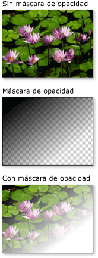
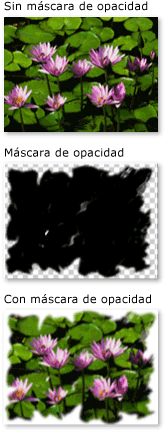
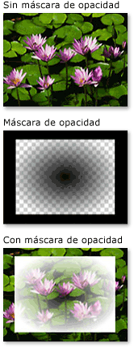

# Información general sobre las máscaras de opacidadOpacity Masks Overview
Las máscaras de opacidad permiten hacer que partes de un elemento o un objeto visual sea total o parcialmente transparentes.Opacity masks enable you to make portions of an element or visual either transparent or partially transparent. Para crear una máscara de <xref:System.Windows.Media.Brush> opacidad, <xref:System.Windows.UIElement.OpacityMask%2A> aplique a <xref:System.Windows.Media.Visual>a la propiedad de un elemento o .To create an opacity mask, you apply a <xref:System.Windows.Media.Brush> to the <xref:System.Windows.UIElement.OpacityMask%2A> property of an element or <xref:System.Windows.Media.Visual>.  El pincel se asigna al elemento o al objeto visual, y el valor de opacidad de cada píxel del pincel se usa para determinar la opacidad resultante de cada píxel correspondiente del elemento o objeto visual.The brush is mapped to the element or visual, and the opacity value of each brush pixel is used to determine the resulting opacity of each corresponding pixel of the element or visual.  
  

## Requisitos previosPrerequisites  
 En este resumen se supone <xref:System.Windows.Media.Brush> que está familiarizado con los objetos.This overview assumes that you are familiar with <xref:System.Windows.Media.Brush> objects. Para una introducción sobre el uso de los pinceles, consulte [Información general sobre el dibujo con colores sólidos y degradados](painting-with-solid-colors-and-gradients-overview.md).For an introduction to using brushes, see [Painting with Solid Colors and Gradients Overview](painting-with-solid-colors-and-gradients-overview.md). Para obtener <xref:System.Windows.Media.ImageBrush> <xref:System.Windows.Media.DrawingBrush>información sobre y , consulte [Pintura con imágenes, dibujos y objetos visuales](painting-with-images-drawings-and-visuals.md).For information about <xref:System.Windows.Media.ImageBrush> and <xref:System.Windows.Media.DrawingBrush>, see [Painting with Images, Drawings, and Visuals](painting-with-images-drawings-and-visuals.md).  
  

## Creación de efectos visuales con máscaras de opacidadCreating Visual Effects with Opacity Masks  
 Una máscara de opacidad funciona asignado su contenido al elemento o al objeto visual.An opacity mask works by mapping its contents to the element or visual. Luego, el canal alfa de cada uno de los píxeles del pincel se usa para determinar la opacidad resultante de los píxeles correspondientes del elemento o el objeto visual y se omite el color real del pincel.The alpha channel of each of the brush's pixels are then used to determine the resulting opacity of the element or visual's corresponding pixels; the actual color of the brush is ignored. Si una parte determinada del pincel es transparente, la parte correspondiente del elemento o del objeto visual se vuelve transparente.If a given portion of the brush is transparent, the corresponding portion of the element or visual becomes transparent. Si una parte determinada del pincel es opaca, no se modifica la parte correspondiente del elemento o del objeto visual.If a given portion of the brush is opaque, the opacity of the corresponding portion of the element or visual is unchanged. La opacidad que la máscara de opacidad especifica se combina con cualquier ajuste de opacidad existente en el elemento o el objeto visual.The opacity specified by the opacity mask is combined with any opacity settings present in the element or visual. Por ejemplo, si un elemento es opaco en un 25 por ciento y se le aplica una máscara de opacidad que realiza la transición desde totalmente opaco a totalmente transparente, el resultado es un elemento que hace una transición desde el 25 por ciento de opacidad a totalmente transparente.For example, if an element is 25 percent opaque and an opacity mask is applied that transitions from fully opaque to fully transparent, the result is an element that transitions from 25 percent opacity to fully transparent.  
  
> [!NOTE]
> Aunque los ejemplos de esta información general muestran el uso de máscaras de opacidad <xref:System.Windows.Media.Visual>en elementos de imagen, se puede aplicar una máscara de opacidad a cualquier elemento o , incluidos los paneles y controles.Although the examples in this overview demonstrate the use of opacity masks on image elements, an opacity mask may be applied to any element or <xref:System.Windows.Media.Visual>, including panels and controls.  
  
 Las máscaras de opacidad se usan para crear efectos visuales interesantes, como crear imágenes o botones que se desvanecen mediante un fundido, agregar texturas a los elementos o combinar degradados para generar superficies cristalinas.Opacity masks are used to create interesting visual effects, such as to create images or buttons that fade from view, to add textures to elements, or to combine gradients to produce glass-like surfaces. En la ilustración siguiente se muestra el uso de una máscara de opacidad.The following illustration demonstrates the use of an opacity mask. Se usa un fondo de cuadros para mostrar los elementos transparentes de la máscara.A checkered background is used to show the transparent portions of the mask.  
  
   
Ejemplo de máscara de opacidadOpacity masking example  
  

## Creación de una máscara de opacidadCreating an Opacity Mask  
 Para crear una máscara de <xref:System.Windows.Media.Brush> opacidad, cree <xref:System.Windows.UIElement.OpacityMask%2A> una y aplíquela a la propiedad de un elemento o objeto visual.To create an opacity mask, you create a <xref:System.Windows.Media.Brush> and apply it to the <xref:System.Windows.UIElement.OpacityMask%2A> property of an element or visual. Puede utilizar cualquier <xref:System.Windows.Media.Brush> tipo de máscara de opacidad.You can use any type of <xref:System.Windows.Media.Brush> as an opacity mask.  
  
- <xref:System.Windows.Media.LinearGradientBrush>, <xref:System.Windows.Media.RadialGradientBrush>: Se utiliza para hacer que un elemento o visual se desvanezca de la vista.<xref:System.Windows.Media.LinearGradientBrush>, <xref:System.Windows.Media.RadialGradientBrush>: Used to make an element or visual fade from view.  
  
     La siguiente imagen <xref:System.Windows.Media.LinearGradientBrush> muestra un usado como máscara de opacidad.The following image shows a <xref:System.Windows.Media.LinearGradientBrush> used as an opacity mask.  
  
       
Ejemplo de máscara de opacidad LinearGradientBrushLinearGradientBrush Opacity Masking Example  
  
- <xref:System.Windows.Media.ImageBrush>: Se utiliza para crear textura y efectos de borde suaves o desgarrados.<xref:System.Windows.Media.ImageBrush>: Used to create texture and soft or torn edge effects.  
  
     La siguiente imagen <xref:System.Windows.Media.ImageBrush> muestra un uso como máscara de opacidad.The following image shows an <xref:System.Windows.Media.ImageBrush> used as an opacity mask.  
  
       
Ejemplo de máscara de opacidad LinearGradientBrushLinearGradientBrush opacity masking example  
  
- <xref:System.Windows.Media.DrawingBrush>: Se utiliza para crear máscaras de opacidad complejas a partir de patrones de formas, imágenes y degradados.<xref:System.Windows.Media.DrawingBrush>: Used to create complex opacity masks from patterns of shapes, images, and gradients.  
  
     La siguiente imagen <xref:System.Windows.Media.DrawingBrush> muestra un usado como máscara de opacidad.The following image shows a <xref:System.Windows.Media.DrawingBrush> used as an opacity mask.  
  
       
Ejemplo de máscara de opacidad DrawingBrushDrawingBrush opacity masking example  
  
 Los pinceles<xref:System.Windows.Media.LinearGradientBrush> de <xref:System.Windows.Media.RadialGradientBrush>degradado ( y ) son especialmente adecuados para su uso como máscara de opacidad.The gradient brushes (<xref:System.Windows.Media.LinearGradientBrush> and <xref:System.Windows.Media.RadialGradientBrush>) are particularly well-suited for use as an opacity mask. Debido <xref:System.Windows.Media.SolidColorBrush> a que un rellena un área con un color uniforme, hacen máscaras de opacidad deficientes; usar <xref:System.Windows.Media.SolidColorBrush> a equivale a establecer la propiedad <xref:System.Windows.UIElement.OpacityMask%2A> del elemento o del objeto visual.Because a <xref:System.Windows.Media.SolidColorBrush> fills an area with a uniform color, they make poor opacity masks; using a <xref:System.Windows.Media.SolidColorBrush> is equivalent to setting the element's or visual's <xref:System.Windows.UIElement.OpacityMask%2A> property.  
  

## Uso de degradado como máscara de opacidadUsing a Gradient as an Opacity Mask  
 Para crear un relleno de degradado, se especifican dos o más delimitadores de degradado.To create a gradient fill, you specify two or more gradient stops. Cada delimitador de degradado contiene un color y una posición (consulte [Información general sobre el dibujo con colores sólidos y degradados](painting-with-solid-colors-and-gradients-overview.md) para más información sobre cómo crear y usar degradados).Each gradient stop contains describes a color and a position (see [Painting with Solid Colors and Gradients Overview](painting-with-solid-colors-and-gradients-overview.md) for more information about creating and using gradients). El proceso es el mismo cuando se usa un degradado como máscara de opacidad, con la excepción de que, en lugar de combinar los colores, el degradado de la máscara de opacidad combina los valores del canal alfa.The process is the same when using a gradient as an opacity mask, except that, instead of blending colors, the opacity mask gradient blends alpha channel values. Por lo tanto, no importa el color real del contenido del degradado; solo importa el canal alfa, u opacidad, de cada color.So the actual color of the gradient's contents do not matter; only the alpha channel, or opacity, of each color matters. A continuación se muestra un ejemplo.The following is an example.  
  
 [!code-xaml[OpacityMasksSnippet#LinearGradientOpacityMaskonImage](~/samples/snippets/csharp/VS_Snippets_Wpf/OpacityMasksSnippet/CS/GradientBrushExample.xaml#lineargradientopacitymaskonimage)]  
  

## Especificación de delimitadores de degradado para una máscara de opacidadSpecifying Gradient Stops for an Opacity Mask  
 En el ejemplo anterior, el <xref:System.Windows.Media.Colors.Black%2A> color definido por el sistema se utiliza como el color inicial del degradado.In the previous example, the system-defined color <xref:System.Windows.Media.Colors.Black%2A> is used as the starting color of the gradient. Dado que todos los <xref:System.Windows.Media.Colors> colores <xref:System.Windows.Media.Colors.Transparent%2A>de la clase, excepto , son totalmente opacos, se pueden utilizar para definir simplemente un color inicial para una máscara de opacidad de degradado.Because all of the colors in the <xref:System.Windows.Media.Colors> class, except <xref:System.Windows.Media.Colors.Transparent%2A>, are fully opaque, they can be used to simply define a starting color for a gradient opacity mask.  
  
 Para obtener un control adicional sobre los valores alfa al definir una máscara de opacidad, puede <xref:System.Windows.Media.Color.FromScRgb%2A?displayProperty=nameWithType> especificar el canal alfa de colores mediante la notación hexadecimal ARGB en el marcado o mediante el método.For additional control over alpha values when defining an opacity mask, you can specify the alpha channel of colors using ARGB hexadecimal notation in markup or using the <xref:System.Windows.Media.Color.FromScRgb%2A?displayProperty=nameWithType> method.  
  

### Especificación de la opacidad del color en "XAML"Specifying Color Opacity in "XAML"  
 En [!INCLUDE[TLA#tla_xaml](../../../../includes/tlasharptla-xaml-md.md)], se utiliza la notación hexadecimal ARGB para especificar la opacidad de colores individuales.In [!INCLUDE[TLA#tla_xaml](../../../../includes/tlasharptla-xaml-md.md)], you use  ARGB hexadecimal notation to specify the opacity of individual colors. La notación hexadecimal ARGB utiliza la sintaxis siguiente:ARGB hexadecimal notation uses the following syntax:  
  
 `#` **aa** *rrggbb*`#` **aa** *rrggbb*  
  
 El valor *aa* de la línea anterior representa un valor hexadecimal de dos dígitos que se usa para especificar la opacidad del color.The *aa* in the previous line represents a two-digit hexadecimal value used to specify the opacity of the color. Cada uno de los valores *rr*, *gg* y *bb* representa un valor hexadecimal de dos dígitos que se usa para especificar la cantidad de rojo, verde y azul en el color.The *rr*, *gg*, and *bb* each represent a two digit hexadecimal value used to specify the amount of red, green, and blue in the color. Cada dígito hexadecimal debe tener un valor entre 0 t 9 y entre A y F.Each hexadecimal digit may have a value from 0-9 or A-F. 0 es el valor menor y F, el mayor.0 is the smallest value, and F is the greatest. Un valor alfa de 00 especifica un color completamente transparente, mientras que un valor alfa de FF crea un color completamente opaco.An alpha value of 00 specifies a color that is completely transparent, while an alpha value of FF creates a color that is fully opaque.  En el ejemplo siguiente, la notación ARGB hexadecimal se utiliza para especificar dos colores.In the following example, hexadecimal ARGB notation is used to specify two colors. El primero es completamente opaco, mientras que el segundo, completamente transparente.The first is fully opaque, while the second is completely transparent.  
  
 [!code-xaml[OpacityMasksSnippet#AARRGGBBValueonOpacityMask](~/samples/snippets/csharp/VS_Snippets_Wpf/OpacityMasksSnippet/CS/GradientBrushExample.xaml#aarrggbbvalueonopacitymask)]  
  

## Uso de imagen como máscara de opacidadUsing an Image as an Opacity Mask  
 También se pueden usar imágenes como máscara de opacidad.Images can also be used as an opacity mask. En la imagen siguiente se muestra un ejemplo:The following image shows an example. Se usa un fondo de cuadros para mostrar los elementos transparentes de la máscara.A checkered background is used to show the transparent portions of the mask.  
  
   
Ejemplo de máscara de opacidadOpacity masking example  
  
 Para utilizar una imagen como máscara <xref:System.Windows.Media.ImageBrush> de opacidad, utilice un para contener la imagen.To use an image as an opacity mask, use an <xref:System.Windows.Media.ImageBrush> to contain the image. Al crear una imagen que se utilizará como máscara de opacidad, guarde la imagen en un formato que admita varios niveles de transparencia, como gráficos de red portátiles (PNG).When creating an image to be used as an opacity mask, save the image in a format that supports multiple levels of transparency, such as Portable Network Graphics (PNG). En el ejemplo siguiente se muestra el código que se usó para crear la ilustración anterior.The following example shows the code used to create the previous illustration.  
  
 [!code-xaml[OpacityMasksSnippet#UIElementOpacityMask](~/samples/snippets/csharp/VS_Snippets_Wpf/OpacityMasksSnippet/CS/ImageBrushExample.xaml#uielementopacitymask)]  
  

### Uso de imagen en mosaico como máscara de opacidadUsing a Tiled Image as an Opacity Mask  
 En el ejemplo siguiente, la misma <xref:System.Windows.Media.ImageBrush>imagen se utiliza con otra , pero las entidades de mosaico del pincel se utilizan para producir mosaicos de la imagen de 50 píxeles cuadrados.In the following example, the same image is used with another <xref:System.Windows.Media.ImageBrush>, but the brush's tiling features are used to produce tiles of the image 50 pixels square.  
  
 [!code-xaml[OpacityMasksSnippet#TiledImageasOpacityMask](~/samples/snippets/csharp/VS_Snippets_Wpf/OpacityMasksSnippet/CS/ImageBrushExample.xaml#tiledimageasopacitymask)]  
  

## Creación de una máscara de opacidad a partir de un dibujoCreating an Opacity Mask from a Drawing  
 Se pueden usar dibujos como máscara de opacidad.Drawings can be used an opacity mask. Las formas contenidas en el dibujo se pueden rellenar con degradados, colores sólidos, imágenes e, incluso, otros dibujos.The shapes contained within the drawing can themselves be filled with gradients, solid colors, images, or even other drawings. La imagen siguiente muestra un ejemplo de un dibujo que se usa como máscara de opacidad.The following image shows an example of a drawing used as an opacity mask. Se usa un fondo de cuadros para mostrar los elementos transparentes de la máscara.A checkered background is used to show the transparent portions of the mask.  
  
   
Ejemplo de máscara de opacidad DrawingBrushDrawingBrush opacity masking example  
  
 Para utilizar un dibujo como máscara <xref:System.Windows.Media.DrawingBrush> de opacidad, utilice a para contener el dibujo.To use a drawing as an opacity mask, use a <xref:System.Windows.Media.DrawingBrush> to contain the drawing. En el ejemplo siguiente se muestra el código que se usó para crear la ilustración anterior:The following example shows the code used to create the previous illustration:  
  
 [!code-xaml[OpacityMasksSnippet#OpacityMaskfromDrawing](~/samples/snippets/csharp/VS_Snippets_Wpf/OpacityMasksSnippet/CS/DrawingBrushExample.xaml#opacitymaskfromdrawing)]  
  

### Uso de dibujo en mosaico como máscara de opacidadUsing a Tiled Drawing as an Opacity Mask  
 Al <xref:System.Windows.Media.ImageBrush>igual <xref:System.Windows.Media.DrawingBrush> que el , el se puede hacer para teselar su dibujo.Like the <xref:System.Windows.Media.ImageBrush>, the <xref:System.Windows.Media.DrawingBrush> can be made to tile its drawing. En el ejemplo siguiente, se usa un pincel con dibujo para crear una máscara de opacidad en mosaico.In the following example, a drawing brush is used to create a tiled opacity mask.  
  
 [!code-xaml[OpacityMasksSnippet#TiledDrawingasOpacityMask](~/samples/snippets/csharp/VS_Snippets_Wpf/OpacityMasksSnippet/CS/DrawingBrushExample.xaml#tileddrawingasopacitymask)]  
  
## Consulte tambiénSee also

- [Pintar con imágenes, dibujos y elementos visualesPainting with Images, Drawings, and Visuals](painting-with-images-drawings-and-visuals.md)
- [Información general sobre el dibujo con colores sólidos y degradadosPainting with Solid Colors and Gradients Overview](painting-with-solid-colors-and-gradients-overview.md)
