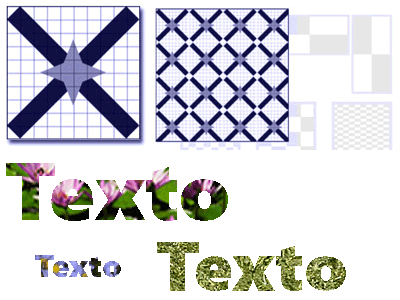
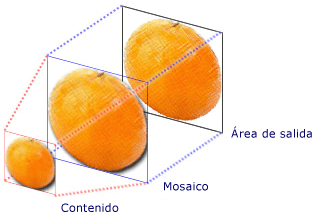
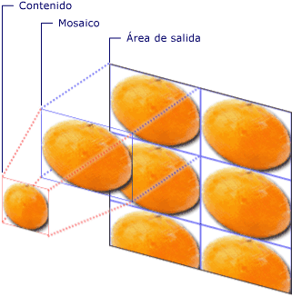

# Pintar con imágenes, dibujos y elementos visuales
En este tema se <xref:System.Windows.Media.ImageBrush> <xref:System.Windows.Media.DrawingBrush>describe <xref:System.Windows.Media.VisualBrush> cómo utilizar , , y <xref:System.Windows.Media.Drawing>objetos <xref:System.Windows.Media.Visual>para pintar un área con una imagen, un , o un archivo .  

## Requisitos previos  
 Para entender este tema, debe estar familiarizado con los distintos tipos de pinceles que [!INCLUDE[TLA#tla_winclient](../../../../includes/tlasharptla-winclient-md.md)] proporciona y sus características básicas. Para una introducción, consulte [Información general sobre pinceles de WPF](wpf-brushes-overview.md).  
  

## Pintar un área con una imagen  
 Un <xref:System.Windows.Media.ImageBrush> pinta un área <xref:System.Windows.Media.ImageSource>con un archivo . El tipo más <xref:System.Windows.Media.ImageSource> común de <xref:System.Windows.Media.ImageBrush> uso <xref:System.Windows.Media.Imaging.BitmapImage>con un es un , que describe un gráfico de mapa de bits. Puede usar <xref:System.Windows.Media.DrawingImage> a para <xref:System.Windows.Media.Drawing> pintar con un objeto, pero <xref:System.Windows.Media.DrawingBrush> es más sencillo usar un en su lugar. Para obtener <xref:System.Windows.Media.ImageSource> más información acerca de los objetos, consulte [Información general sobre imágenes](imaging-overview.md).  
  
 Para pintar <xref:System.Windows.Media.ImageBrush>con un <xref:System.Windows.Media.Imaging.BitmapImage> , cree un y utilícelo para cargar el contenido del mapa de bits. A continuación, <xref:System.Windows.Media.Imaging.BitmapImage> utilice <xref:System.Windows.Media.ImageBrush.ImageSource%2A> el para <xref:System.Windows.Media.ImageBrush>establecer la propiedad de la . Por último, <xref:System.Windows.Media.ImageBrush> aplique el objeto que desea pintar.  En [!INCLUDE[TLA#tla_xaml](../../../../includes/tlasharptla-xaml-md.md)], también puede <xref:System.Windows.Media.ImageBrush.ImageSource%2A> establecer la <xref:System.Windows.Media.ImageBrush> propiedad de la con la ruta de acceso de la imagen para cargar.  
  
 Al <xref:System.Windows.Media.Brush> igual que <xref:System.Windows.Media.ImageBrush> todos los objetos, se puede utilizar para pintar objetos como formas, paneles, controles y texto. La siguiente ilustración muestra algunos efectos <xref:System.Windows.Media.ImageBrush>que se pueden lograr con un archivo .  
  
   
Objetos pintados mediante ImageBrush  
  
 De forma <xref:System.Windows.Media.ImageBrush> predeterminada, se extiende su imagen para rellenar completamente el área que se está pintando, lo que puede distorsionar la imagen si el área pintada tiene una relación de aspecto diferente a la de la imagen. Puede cambiar este comportamiento <xref:System.Windows.Media.TileBrush.Stretch%2A> cambiando la propiedad <xref:System.Windows.Media.Stretch.Fill> <xref:System.Windows.Media.Stretch.None>de <xref:System.Windows.Media.Stretch.Uniform>su <xref:System.Windows.Media.Stretch.UniformToFill>valor predeterminado de a , , o . Dado <xref:System.Windows.Media.ImageBrush> que es <xref:System.Windows.Media.TileBrush>un tipo de , puede especificar exactamente cómo un pincel de imagen llena el área de salida e incluso crear patrones. Para obtener más <xref:System.Windows.Media.TileBrush> información acerca de las características avanzadas, vea [TileBrush Overview](tilebrush-overview.md).  
  

## Ejemplo: Pintar un objeto con una imagen de mapa de bits  
 En el ejemplo <xref:System.Windows.Media.ImageBrush> siguiente <xref:System.Windows.Controls.Panel.Background%2A> se <xref:System.Windows.Controls.Canvas>utiliza un para pintar el de un archivo .  
  
 [!code-xaml[BrushOverviewExamples_snip#GraphicsMMImageBrushAsCanvasBackgroundExampleWholePage](~/samples/snippets/xaml/VS_Snippets_Wpf/BrushOverviewExamples_snip/XAML/ImageBrushExample.xaml#graphicsmmimagebrushascanvasbackgroundexamplewholepage)]  
  
 [!code-csharp[BrushOverviewExamples_procedural_snip#GraphicsMMImageBrushAsCanvasBackgroundExampleWholePage](~/samples/snippets/csharp/VS_Snippets_Wpf/BrushOverviewExamples_procedural_snip/CSharp/ImageBrushExample.cs#graphicsmmimagebrushascanvasbackgroundexamplewholepage)]
 [!code-vb[BrushOverviewExamples_procedural_snip#GraphicsMMImageBrushAsCanvasBackgroundExampleWholePage](~/samples/snippets/visualbasic/VS_Snippets_Wpf/BrushOverviewExamples_procedural_snip/visualbasic/imagebrushexample.vb#graphicsmmimagebrushascanvasbackgroundexamplewholepage)]  
  

## Pintar un área con un dibujo  
 A <xref:System.Windows.Media.DrawingBrush> le permite pintar un área con formas, texto, imágenes y vídeo. Las formas dentro de un pincel de dibujo pueden pintarse <xref:System.Windows.Media.DrawingBrush>con un color sólido, degradado, imagen o incluso otro. En la siguiente ilustración <xref:System.Windows.Media.DrawingBrush>se muestran algunos usos de un archivo .  
  
   
Objetos pintados mediante DrawingBrush  
  
 Un <xref:System.Windows.Media.DrawingBrush> pinta un área <xref:System.Windows.Media.Drawing> con un objeto. Un <xref:System.Windows.Media.Drawing> objeto describe contenido visible, como una forma, un mapa de bits, un vídeo o una línea de texto. Distintos tipos de dibujo describen tipos de contenido diferentes. La siguiente lista muestra los distintos tipos de objetos de dibujo.  
  
- <xref:System.Windows.Media.GeometryDrawing>– Dibuja una forma.  
  
- <xref:System.Windows.Media.ImageDrawing>– Dibuja una imagen.  
  
- <xref:System.Windows.Media.GlyphRunDrawing>– Dibuja texto.  
  
- <xref:System.Windows.Media.VideoDrawing>– Reproduce un archivo de audio o vídeo.  
  
- <xref:System.Windows.Media.DrawingGroup>– Dibuja otros dibujos. Use un grupo de dibujo para combinar otros dibujos en un solo dibujo compuesto.  
  
 Para obtener <xref:System.Windows.Media.Drawing> más información acerca de los objetos, consulte Información general sobre [objetos](drawing-objects-overview.md)de dibujo .  
  
 Al <xref:System.Windows.Media.ImageBrush>igual <xref:System.Windows.Media.DrawingBrush> que un <xref:System.Windows.Media.DrawingBrush.Drawing%2A> , un la estira para llenar su área de salida. Puede invalidar este comportamiento <xref:System.Windows.Media.TileBrush.Stretch%2A> cambiando la propiedad <xref:System.Windows.Media.Stretch.Fill>de su valor predeterminado de . Para obtener más información, vea la propiedad <xref:System.Windows.Media.TileBrush.Stretch%2A>.  
  

## Ejemplo: Pintar un objeto con un dibujo  
 En el ejemplo siguiente se muestra cómo pintar un objeto con un dibujo de tres elipses. A <xref:System.Windows.Media.GeometryDrawing> se utiliza para describir las elipses.  
  
 [!code-xaml[BrushOverviewExamples_snip#GraphicsMMDrawingBrushAsButtonBackgroundExample](~/samples/snippets/xaml/VS_Snippets_Wpf/BrushOverviewExamples_snip/XAML/DrawingBrushExample.xaml#graphicsmmdrawingbrushasbuttonbackgroundexample)]  
  
 [!code-csharp[BrushOverviewExamples_procedural_snip#GraphicsMMDrawingBrushAsButtonBackgroundExample1](~/samples/snippets/csharp/VS_Snippets_Wpf/BrushOverviewExamples_procedural_snip/CSharp/DrawingBrushExample.cs#graphicsmmdrawingbrushasbuttonbackgroundexample1)]
 [!code-vb[BrushOverviewExamples_procedural_snip#GraphicsMMDrawingBrushAsButtonBackgroundExample1](~/samples/snippets/visualbasic/VS_Snippets_Wpf/BrushOverviewExamples_procedural_snip/visualbasic/drawingbrushexample.vb#graphicsmmdrawingbrushasbuttonbackgroundexample1)]  
  

## Pintar un área con un objeto visual  
 El más versátil y potente de todos <xref:System.Windows.Media.VisualBrush> los pinceles, <xref:System.Windows.Media.Visual>el pinta un área con un . A <xref:System.Windows.Media.Visual> es un tipo gráfico de bajo nivel que sirve como antepasado de muchos componentes gráficos útiles. Por ejemplo, <xref:System.Windows.Window> <xref:System.Windows.FrameworkElement>las <xref:System.Windows.Controls.Control> clases , <xref:System.Windows.Media.Visual> , y son todos tipos de objetos. Usando <xref:System.Windows.Media.VisualBrush>un , puede pintar [!INCLUDE[TLA#tla_winclient](../../../../includes/tlasharptla-winclient-md.md)] áreas con casi cualquier objeto gráfico.  
  
> [!NOTE]
> Aunque <xref:System.Windows.Media.VisualBrush> es un <xref:System.Windows.Freezable> tipo de objeto, no se puede <xref:System.Windows.Media.VisualBrush.Visual%2A> inmovilizar (hecho de `null`solo lectura) cuando su propiedad se establece en un valor distinto de .  
  
 Hay dos maneras <xref:System.Windows.Media.VisualBrush.Visual%2A> de especificar <xref:System.Windows.Media.VisualBrush>el contenido de un archivo .  
  
- Cree un <xref:System.Windows.Media.Visual> nuevo y utilícelo <xref:System.Windows.Media.VisualBrush.Visual%2A> para <xref:System.Windows.Media.VisualBrush>establecer la propiedad del archivo . Si desea ver un ejemplo, consulte la sección [Ejemplo: Pintar un objeto con un objeto visual](#examplevisualbrush1) a continuación.  
  
- Utilice un <xref:System.Windows.Media.Visual>, existente, que crea <xref:System.Windows.Media.Visual>una imagen duplicada del destino. A continuación, <xref:System.Windows.Media.VisualBrush> puede utilizar el para crear efectos interesantes, como la reflexión y la ampliación. Si desea ver un ejemplo, consulte la sección [Ejemplo: Crear un reflejo](#examplevisualbrush2).  
  
 Cuando se define <xref:System.Windows.Media.VisualBrush.Visual%2A> un <xref:System.Windows.Media.VisualBrush> nuevo <xref:System.Windows.Media.Visual> para <xref:System.Windows.UIElement> y que es un (como un <xref:System.Windows.UIElement> panel o un <xref:System.Windows.Media.VisualBrush.AutoLayoutContent%2A> control), el `true`sistema de diseño se ejecuta en los elementos secundarios y sus secundarios cuando la propiedad se establece en . Sin embargo, la raíz <xref:System.Windows.UIElement> está esencialmente aislada del resto del sistema: los estilos y el diseño externo no pueden impregnar este límite. Por lo tanto, debe especificar explícitamente el tamaño de la raíz, <xref:System.Windows.UIElement>porque su único elemento primario es el <xref:System.Windows.Media.VisualBrush> y, por lo tanto, no puede cambiar su tamaño automáticamente al área que se está pintando. Para más información sobre el diseño en [!INCLUDE[TLA#tla_winclient](../../../../includes/tlasharptla-winclient-md.md)], consulte [Diseño](../advanced/layout.md).  
  
 Like <xref:System.Windows.Media.ImageBrush> <xref:System.Windows.Media.DrawingBrush>y <xref:System.Windows.Media.VisualBrush> , a estira su contenido para rellenar su área de salida. Puede invalidar este comportamiento <xref:System.Windows.Media.TileBrush.Stretch%2A> cambiando la propiedad <xref:System.Windows.Media.Stretch.Fill>de su valor predeterminado de . Para obtener más información, vea la propiedad <xref:System.Windows.Media.TileBrush.Stretch%2A>.  
  

## Ejemplo: Pintar un objeto con un objeto visual  
 En el ejemplo siguiente, se usan varios controles y un panel para pintar un rectángulo.  
  
 [!code-xaml[BrushOverviewExamples_snip#GraphicsMMVisualBrushAsRectangleBackgroundExample](~/samples/snippets/xaml/VS_Snippets_Wpf/BrushOverviewExamples_snip/XAML/VisualBrushExample.xaml#graphicsmmvisualbrushasrectanglebackgroundexample)]  
  
 [!code-csharp[BrushOverviewExamples_procedural_snip#GraphicsMMVisualBrushAsRectangleBackgroundExample1](~/samples/snippets/csharp/VS_Snippets_Wpf/BrushOverviewExamples_procedural_snip/CSharp/VisualBrushExample.cs#graphicsmmvisualbrushasrectanglebackgroundexample1)]
 [!code-vb[BrushOverviewExamples_procedural_snip#GraphicsMMVisualBrushAsRectangleBackgroundExample1](~/samples/snippets/visualbasic/VS_Snippets_Wpf/BrushOverviewExamples_procedural_snip/visualbasic/visualbrushexample.vb#graphicsmmvisualbrushasrectanglebackgroundexample1)]  
  

## Ejemplo: Crear un reflejo  
 En el ejemplo anterior se <xref:System.Windows.Media.Visual> muestra cómo crear un nuevo para su uso como fondo. También puede utilizar <xref:System.Windows.Media.VisualBrush> a para mostrar un objeto visual existente; esta capacidad le permite producir efectos visuales interesantes, como reflejos y aumento. En el ejemplo <xref:System.Windows.Media.VisualBrush> siguiente se utiliza <xref:System.Windows.Controls.Border> a para crear un reflejo de a que contiene varios elementos. En la ilustración siguiente se muestra el resultado que genera el ejemplo.  
  
   
Objeto Visual reflejado  
  
 [!code-csharp[visualbrush_markup_snip#GraphicsMMVisualBrushReflectionExampleWholePage](~/samples/snippets/csharp/VS_Snippets_Wpf/visualbrush_markup_snip/CSharp/ReflectionExample.cs#graphicsmmvisualbrushreflectionexamplewholepage)]
 [!code-vb[visualbrush_markup_snip#GraphicsMMVisualBrushReflectionExampleWholePage](~/samples/snippets/visualbasic/VS_Snippets_Wpf/visualbrush_markup_snip/visualbasic/reflectionexample.vb#graphicsmmvisualbrushreflectionexamplewholepage)]
 [!code-xaml[visualbrush_markup_snip#GraphicsMMVisualBrushReflectionExampleWholePage](~/samples/snippets/xaml/VS_Snippets_Wpf/visualbrush_markup_snip/XAML/ReflectionExample.xaml#graphicsmmvisualbrushreflectionexamplewholepage)]  
  
 Si quiere ver ejemplos adicionales que muestren cómo aumentar partes de la pantalla y cómo crear reflejos, consulte [Ejemplo de VisualBrush](https://github.com/Microsoft/WPF-Samples/tree/master/Graphics/VisualBrush).  
  

## Características de TileBrush  
 <xref:System.Windows.Media.ImageBrush>, <xref:System.Windows.Media.DrawingBrush>, <xref:System.Windows.Media.VisualBrush> y <xref:System.Windows.Media.TileBrush> son tipos de objetos. <xref:System.Windows.Media.TileBrush>los objetos proporcionan un gran control sobre cómo se pinta un área con una imagen, dibujo o visual. Por ejemplo, en lugar de limitarse a pintar un área con una sola imagen estirada, puede pintar un área con una serie de mosaicos de imagen que crean un patrón.  
  
 A <xref:System.Windows.Media.TileBrush> tiene tres componentes principales: contenido, teselas y el área de salida.  
  
   
Componentes de TileBrush con un solo mosaico  
  
   
Componentes de TileBrush con varios mosaicos  
  
 Para obtener más información acerca <xref:System.Windows.Media.TileBrush> de las características de ordenamiento en teselas de los objetos, vea La información general de [TileBrush](tilebrush-overview.md).  
  
## Consulte también

- <xref:System.Windows.Media.ImageBrush>
- <xref:System.Windows.Media.DrawingBrush>
- <xref:System.Windows.Media.VisualBrush>
- <xref:System.Windows.Media.TileBrush>
- [Información general sobre objetos TileBrush](tilebrush-overview.md)
- [Información general sobre pinceles de WPF](wpf-brushes-overview.md)
- [Información general sobre imágenes](imaging-overview.md)
- [Información general sobre objetos Drawing](drawing-objects-overview.md)
- [Información general sobre las máscaras de opacidad](opacity-masks-overview.md)
- [Información general sobre la representación de gráficos en WPF](wpf-graphics-rendering-overview.md)
- [Ejemplo de ImageBrush](https://github.com/Microsoft/WPF-Samples/tree/master/Graphics/ImageBrush)
- [Ejemplo de VisualBrush](https://github.com/Microsoft/WPF-Samples/tree/master/Graphics/VisualBrush)
