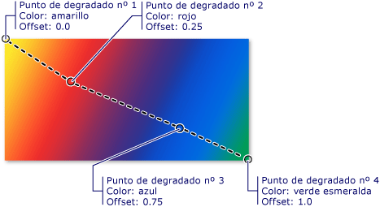
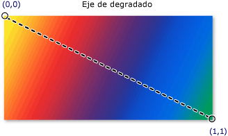
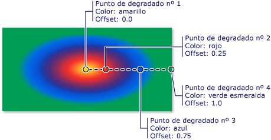

# Información general sobre el dibujo con colores sólidos y degradadosPainting with Solid Colors and Gradients Overview

En este tema se describe cómo usar los <xref:System.Windows.Media.SolidColorBrush> <xref:System.Windows.Media.LinearGradientBrush> objetos, y <xref:System.Windows.Media.RadialGradientBrush> para pintar con colores sólidos, degradados lineales y degradados radiales.This topic describes how to use <xref:System.Windows.Media.SolidColorBrush>, <xref:System.Windows.Media.LinearGradientBrush>, and <xref:System.Windows.Media.RadialGradientBrush> objects to paint with solid colors, linear gradients, and radial gradients.

## Pintar un área con un color sólidoPainting an Area with a Solid Color

Una de las operaciones más comunes en cualquier plataforma es pintar un área con un sólido <xref:System.Windows.Media.Color> .One of the most common operations in any platform is to paint an area with a solid <xref:System.Windows.Media.Color>. Para realizar esta tarea, [!INCLUDE[TLA#tla_winclient](../../../../includes/tlasharptla-winclient-md.md)] proporciona la <xref:System.Windows.Media.SolidColorBrush> clase.To accomplish this task, [!INCLUDE[TLA#tla_winclient](../../../../includes/tlasharptla-winclient-md.md)] provides the <xref:System.Windows.Media.SolidColorBrush> class. En las secciones siguientes se describen las distintas formas de pintar con un <xref:System.Windows.Media.SolidColorBrush> .The following sections describe the different ways to paint with a <xref:System.Windows.Media.SolidColorBrush>.

### Usar SolidColorBrush en "XAML"Using a SolidColorBrush in "XAML"

Para pintar un área con un color sólido en [!INCLUDE[TLA2#tla_xaml](../../../../includes/tla2sharptla-xaml-md.md)], use una de las opciones siguientes.To paint an area with a solid color in [!INCLUDE[TLA2#tla_xaml](../../../../includes/tla2sharptla-xaml-md.md)], use one of the following options.

- Seleccione un pincel de color sólido predefinido por su nombre.Select a predefined solid color brush by name.  Por ejemplo, puede establecer un botón <xref:System.Windows.Controls.Control.Background%2A> en "red" o "MediumBlue".For example, you can set a button's <xref:System.Windows.Controls.Control.Background%2A> to "Red" or "MediumBlue".  Para obtener una lista de otros pinceles de color sólido predefinidos, vea las propiedades estáticas de la <xref:System.Windows.Media.Brushes> clase.For a list of other predefined solid color brushes, see the static properties of the <xref:System.Windows.Media.Brushes> class. A continuación se muestra un ejemplo.The following is an example.

  [!code-xaml[BrushOverviewExamples_snip#SolidColorBrushNamedColor1XAML](~/samples/snippets/xaml/VS_Snippets_Wpf/BrushOverviewExamples_snip/XAML/SolidColorBrushExample.xaml#solidcolorbrushnamedcolor1xaml)]

- Elija un color en la paleta de colores de 32 bits; para ello, especifique las cantidades de rojo, verde y azul que se combinarán en un color sólido.Choose a color from the 32-bit color palette by specifying the amounts of red, green, and blue to combine into a single solid color.  El formato para especificar un color de la paleta de 32 bits es "*#rrggbb*", donde *rr* es un número hexadecimal de dos dígitos que especifica la cantidad relativa de rojo, *gg* especifica la cantidad de verde y *bb* especifica la cantidad de azul.The format for specifying a color from the 32-bit palette is "*#rrggbb*", where *rr* is a two digit hexadecimal number specifying the relative amount of red, *gg* specifies the amount of green, and *bb* specifies the amount of blue.  Además, el color se puede especificar como "#*aarrggbb*", donde *aa* especifica el valor *alfa*, o la transparencia, del color.Additionally, the color can be specified as "#*aarrggbb*" where *aa* specifies the *alpha* value, or transparency, of the color. Este enfoque le permite crear colores que sean parcialmente transparentes.This approach enables you to create colors that are partially transparent.  En el ejemplo siguiente, el <xref:System.Windows.Controls.Control.Background%2A> de <xref:System.Windows.Controls.Button> se establece en rojo totalmente opaco mediante la notación hexadecimal.In the following example, the <xref:System.Windows.Controls.Control.Background%2A> of a <xref:System.Windows.Controls.Button> is set to fully-opaque red using hexadecimal notation.

  [!code-xaml[BrushOverviewExamples_snip#SolidColorBrushHex1XAML](~/samples/snippets/xaml/VS_Snippets_Wpf/BrushOverviewExamples_snip/XAML/SolidColorBrushExample.xaml#solidcolorbrushhex1xaml)]

- Use la sintaxis de etiquetas de propiedad para describir un <xref:System.Windows.Media.SolidColorBrush> .Use property tag syntax to describe a <xref:System.Windows.Media.SolidColorBrush>. Esta sintaxis es más detallada y le permite especificar una configuración adicional, como la opacidad del pincel.This syntax is more verbose but enables you to specify additional settings, such as the brush's opacity. En el ejemplo siguiente, las <xref:System.Windows.Controls.Control.Background%2A> propiedades de dos <xref:System.Windows.Controls.Button> elementos se establecen en rojo completamente opaco.In the following example, the <xref:System.Windows.Controls.Control.Background%2A> properties of two <xref:System.Windows.Controls.Button> elements are set to fully-opaque red. El color del primer pincel se describe con un nombre de color predefinido.The first brush's color is described using a predefined color name. El color del segundo pincel se describe con una notación hexadecimal.The second brush's color is described using hexadecimal notation.

  [!code-xaml[BrushOverviewExamples_snip#SolidColorBrushPropertyTag1XAML](~/samples/snippets/xaml/VS_Snippets_Wpf/BrushOverviewExamples_snip/XAML/SolidColorBrushExample.xaml#solidcolorbrushpropertytag1xaml)]

### Pintar con SolidColorBrush en el códigoPainting with a SolidColorBrush in Code

Para pintar un área con un color sólido en el código, use una de las opciones siguientes.To paint an area with a solid color in code, use one of the following options.

- Use uno de los pinceles predefinidos proporcionados por la <xref:System.Windows.Media.Brushes> clase.Use one of the predefined brushes provided by the <xref:System.Windows.Media.Brushes> class. En el ejemplo siguiente, <xref:System.Windows.Controls.Control.Background%2A> de <xref:System.Windows.Controls.Button> se establece en <xref:System.Windows.Media.Brushes.Red%2A> .In the following example, the <xref:System.Windows.Controls.Control.Background%2A> of a <xref:System.Windows.Controls.Button> is set to <xref:System.Windows.Media.Brushes.Red%2A>.

  [!code-csharp[BrushOverviewExamples_snip#SolidColorBrushPredefinedBrush1CSharp](~/samples/snippets/csharp/VS_Snippets_Wpf/BrushOverviewExamples_snip/CSharp/SolidColorBrushExample.cs#solidcolorbrushpredefinedbrush1csharp)]

- Cree un <xref:System.Windows.Media.SolidColorBrush> y establezca su <xref:System.Windows.Media.SolidColorBrush.Color%2A> propiedad mediante una <xref:System.Windows.Media.Color> estructura.Create a <xref:System.Windows.Media.SolidColorBrush> and set its <xref:System.Windows.Media.SolidColorBrush.Color%2A> property using a <xref:System.Windows.Media.Color> structure. Puede usar un color predefinido de la <xref:System.Windows.Media.Colors> clase o puede crear <xref:System.Windows.Media.Color> con el <xref:System.Windows.Media.Color.FromArgb%2A> método estático.You can use a predefined color from the <xref:System.Windows.Media.Colors> class or you can create a <xref:System.Windows.Media.Color> using the static <xref:System.Windows.Media.Color.FromArgb%2A> method.

  En el ejemplo siguiente se muestra cómo establecer la <xref:System.Windows.Media.SolidColorBrush.Color%2A> propiedad de <xref:System.Windows.Media.SolidColorBrush> con un color predefinido.The following example shows how to set the <xref:System.Windows.Media.SolidColorBrush.Color%2A> property of a <xref:System.Windows.Media.SolidColorBrush> using a predefined color.

  [!code-csharp[BrushOverviewExamples_snip#SolidColorBrushPredefinedColor1CSharp](~/samples/snippets/csharp/VS_Snippets_Wpf/BrushOverviewExamples_snip/CSharp/SolidColorBrushExample.cs#solidcolorbrushpredefinedcolor1csharp)]

El estático <xref:System.Windows.Media.Color.FromArgb%2A> permite especificar los valores alfa, rojo, verde y azul del color.The static <xref:System.Windows.Media.Color.FromArgb%2A> enables you to specify the color's alpha, red, green, and blue values. El intervalo habitual de cada uno de estos valores es 0 a 255.The typical range for each of these values is 0-255. Por ejemplo, un valor alfa de 0 indica que un color es completamente transparente, mientras que un valor de 255 indica que es completamente opaco.For example, an alpha value of 0 indicates that a color is completely transparent, while a value of 255 indicates the color is completely opaque. Del mismo modo, un valor rojo de 0 indica que un color no tiene rojo, mientras que un valor de 255 indica que un color tiene la cantidad máxima posible de rojo.Likewise, a red value of 0 indicates that a color has no red in it, while a value of 255 indicates a color has the maximum amount of red possible.  En el ejemplo siguiente, el color de un pincel se describe al especificar los valores alfa, rojo, verde y azul.In the following example, a brush's color is described by specifying alpha, red, green, and blue values.

[!code-csharp[BrushOverviewExamples_snip#SolidColorBrushfromArgbExample1CSharp](~/samples/snippets/csharp/VS_Snippets_Wpf/BrushOverviewExamples_snip/CSharp/SolidColorBrushExample.cs#solidcolorbrushfromargbexample1csharp)]

Para más formas de especificar el color, vea el <xref:System.Windows.Media.Color> tema de referencia.For additional ways to specify color, see the <xref:System.Windows.Media.Color> reference topic.

## Pintar un área con un degradadoPainting an Area with a Gradient

Un pincel de degradado pinta un área con varios colores que se mezclan entre sí a lo largo de un eje.A gradient brush paints an area with multiple colors that blend into each other along an axis. Puede usarlos para crear impresiones de luz y sombra, lo da a los controles una sensación tridimensional.You can use them to create impressions of light and shadow, giving your controls a three-dimensional feel. También puede usarlos para simular vidrio, cromo, agua y otras superficies lisas.You can also use them to simulate glass, chrome, water, and other smooth surfaces.  [!INCLUDE[TLA2#tla_winclient](../../../../includes/tla2sharptla-winclient-md.md)]proporciona dos tipos de pinceles de degradado: <xref:System.Windows.Media.LinearGradientBrush> y <xref:System.Windows.Media.RadialGradientBrush> .provides two types of gradient brushes: <xref:System.Windows.Media.LinearGradientBrush> and <xref:System.Windows.Media.RadialGradientBrush>.

## Degradados linealesLinear Gradients

<xref:System.Windows.Media.LinearGradientBrush>Dibuja un área con un degradado definido a lo largo de una línea, el *eje de degradado*.A <xref:System.Windows.Media.LinearGradientBrush> paints an area with a gradient defined along a line, the *gradient axis*.  Los colores del degradado y su ubicación se especifican a lo largo del eje de degradado mediante <xref:System.Windows.Media.GradientStop> objetos.You specify the gradient's colors and their location along the gradient axis using <xref:System.Windows.Media.GradientStop> objects.  También puede modificar el eje de degradado, lo que le permite crear degradados horizontales y verticales e invertir la dirección de degradado.You may also modify the gradient axis, which enables you to create horizontal and vertical gradients and to reverse the gradient direction. El eje de degradado se describe en la sección siguiente.The gradient axis is described in the next section. De manera predeterminada, se crea un degradado diagonal.By default, a diagonal gradient is created.

En el ejemplo siguiente se muestra el código que crea un degradado lineal con cuatro colores.The following example shows the code that creates a linear gradient with four colors.

[!code-xaml[GradientBrushExamples_snip#DiagonalGradient1XAML](~/samples/snippets/xaml/VS_Snippets_Wpf/GradientBrushExamples_snip/XAML/LinearGradientBrushExample.xaml#diagonalgradient1xaml)]

[!code-csharp[GradientBrushExamples_snip#DiagonalGradient1CSharp](~/samples/snippets/csharp/VS_Snippets_Wpf/GradientBrushExamples_snip/CSharp/LinearGradientBrushExample.cs#diagonalgradient1csharp)]

Este código genera el degradado siguiente:This code produces the following gradient:

> [!NOTE]
> En los ejemplos de degradado de este tema se usa el sistema de coordenadas predeterminado para establecer puntos de inicio y extremos.The gradient examples in this topic use the default coordinate system for setting start points and end points. El sistema de coordenadas predeterminado está relacionado con un rectángulo de selección: 0 indica 0 por ciento del rectángulo de selección, mientras que 1 indica el 100 por ciento del mismo.The default coordinate system is relative to a bounding box: 0 indicates 0 percent of the bounding box and 1 indicates 100 percent of the bounding box. Puede cambiar este sistema de coordenadas estableciendo la <xref:System.Windows.Media.GradientBrush.MappingMode%2A> propiedad en el valor <xref:System.Windows.Media.BrushMappingMode.Absolute> .You can change this coordinate system by setting the <xref:System.Windows.Media.GradientBrush.MappingMode%2A> property to the value <xref:System.Windows.Media.BrushMappingMode.Absolute>. Un sistema de coordenadas absoluto no está relacionado con un rectángulo de selección.An absolute coordinate system is not relative to a bounding box. Los valores se interpretan directamente en el espacio local.Values are interpreted directly in local space.

<xref:System.Windows.Media.GradientStop>Es el bloque de creación básico de un pincel de degradado.The <xref:System.Windows.Media.GradientStop> is the basic building block of a gradient brush.  Un delimitador de degradado especifica un <xref:System.Windows.Media.GradientStop.Color%2A> a <xref:System.Windows.Media.GradientStop.Offset%2A> lo largo del eje de degradado.A gradient stop specifies a <xref:System.Windows.Media.GradientStop.Color%2A> at an <xref:System.Windows.Media.GradientStop.Offset%2A> along the gradient axis.

- La propiedad del delimitador de degradado <xref:System.Windows.Media.GradientStop.Color%2A> especifica el color del delimitador de degradado.The gradient stop's <xref:System.Windows.Media.GradientStop.Color%2A> property specifies the color of the gradient stop. Puede establecer el color mediante el uso de un color predefinido (proporcionado por la <xref:System.Windows.Media.Colors> clase) o especificando valores ScRGB o ARGB.You may set the color by using a predefined color (provided by the <xref:System.Windows.Media.Colors> class) or by specifying ScRGB or ARGB values. En [!INCLUDE[TLA2#tla_xaml](../../../../includes/tla2sharptla-xaml-md.md)], también puede usar la notación hexadecimal para describir un color.In [!INCLUDE[TLA2#tla_xaml](../../../../includes/tla2sharptla-xaml-md.md)], you may also use hexadecimal notation to describe a color. Para obtener más información, vea la <xref:System.Windows.Media.Color> estructura.For more information, see the <xref:System.Windows.Media.Color> structure.

- La propiedad del delimitador de degradado <xref:System.Windows.Media.GradientStop.Offset%2A> especifica la posición del color del delimitador de degradado en el eje de degradado.The gradient stop's <xref:System.Windows.Media.GradientStop.Offset%2A> property specifies the position of the gradient stop's color on the gradient axis. El desplazamiento es un <xref:System.Double> que va de 0 a 1.The offset is a <xref:System.Double> that ranges from 0 to 1. Cuanto más se acerque a 0 el valor de desplazamiento de un delimitador de degradado, más cerca del inicio del degradado está el color.The closer a gradient stop's offset value is to 0, the closer the color is to the start of the gradient. Cuanto más se acerque a 1 el valor de desplazamiento del degradado, más cerca del final del degradado está el color.The closer the gradient's offset value is to 1, the closer the color is to the end of the gradient.

El color de cada punto entre los delimitadores de degradado se interpola linealmente como una combinación del color especificado por los dos delimitadores de degradado limítrofes.The color of each point between gradient stops is linearly interpolated as a combination of the color specified by the two bounding gradient stops. En la ilustración siguiente se resaltan los delimitadores de degradado del ejemplo anterior.The following illustration highlights the gradient stops in the previous example. Los círculos marcan la posición de los delimitadores de degradado y una línea discontinua muestra el eje de degradado.The circles mark the position of gradient stops and a dashed line shows the gradient axis.

El primer delimitador de degradado especifica el color amarillo con un desplazamiento de `0.0`.The first gradient stop specifies the color yellow at an offset of `0.0`.  El segundo delimitador de degradado especifica el color rojo con un desplazamiento de `0.25`.The second gradient stop specifies the color red at an offset of `0.25`.  Los puntos entre estos dos delimitadores cambian gradualmente de amarillo a rojo a medida que se mueve de izquierda a derecha a lo largo del eje de degradado.The points between these two stops gradually change from yellow to red as you move from left to right along the gradient axis.  El tercer delimitador de degradado especifica el color azul con un desplazamiento de `0.75`.The third gradient stop specifies the color blue at an offset of `0.75`.  Los puntos entre el segundo y el tercer delimitador de degradado cambian gradualmente de rojo a azul.The points between the second and third gradient stops gradually change from red to blue. El cuarto delimitador de degradado especifica el color verde lima con un desplazamiento de `1.0`.The fourth gradient stop specifies the color lime green at an offset of `1.0`. Los puntos entre el tercer y el cuarto delimitador de degradado cambian gradualmente de azul a verde lima.The points between the third and fourth gradient stops gradually change from blue to lime green.

### El eje de degradadoThe Gradient Axis

Tal como se mencionó anteriormente, los delimitadores de degradado de un pincel de degradado lineal están ubicados a lo largo de una línea, el eje de degradado.As previously mentioned, a linear gradient brush's gradient stops are positioned along a line, the gradient axis. Puede cambiar la orientación y el tamaño de la línea mediante las <xref:System.Windows.Media.LinearGradientBrush.StartPoint%2A> propiedades y del pincel <xref:System.Windows.Media.LinearGradientBrush.EndPoint%2A> .You may change the orientation and size of the line using the brush's <xref:System.Windows.Media.LinearGradientBrush.StartPoint%2A> and <xref:System.Windows.Media.LinearGradientBrush.EndPoint%2A> properties. Manipulando el y el pincel <xref:System.Windows.Media.LinearGradientBrush.StartPoint%2A> <xref:System.Windows.Media.LinearGradientBrush.EndPoint%2A> , puede crear degradados horizontales y verticales, invertir la dirección del degradado, condensar la distribución del degradado, etc.By manipulating the brush's <xref:System.Windows.Media.LinearGradientBrush.StartPoint%2A> and <xref:System.Windows.Media.LinearGradientBrush.EndPoint%2A>, you can create horizontal and vertical gradients, reverse the gradient direction, condense the gradient spread, and more.

De forma predeterminada, los pinceles de degradado lineal <xref:System.Windows.Media.LinearGradientBrush.StartPoint%2A> y <xref:System.Windows.Media.LinearGradientBrush.EndPoint%2A> son relativos al área que se está pintando.By default, the linear gradient brush's <xref:System.Windows.Media.LinearGradientBrush.StartPoint%2A> and <xref:System.Windows.Media.LinearGradientBrush.EndPoint%2A> are relative to the area being painted. El punto (0,0) representa la esquina superior izquierda del área que se pinta, mientras que (1,1) representa la esquina inferior derecha de la misma.The point (0,0) represents the upper-left corner of the area being painted, and (1,1) represents the lower-right corner of the area being painted. El valor predeterminado <xref:System.Windows.Media.LinearGradientBrush.StartPoint%2A> de <xref:System.Windows.Media.LinearGradientBrush> es (0,0) y su valor predeterminado <xref:System.Windows.Media.LinearGradientBrush.EndPoint%2A> es (1,1), que crea un degradado diagonal que comienza en la esquina superior izquierda y se extiende hasta la esquina inferior derecha del área que se está pintando.The default <xref:System.Windows.Media.LinearGradientBrush.StartPoint%2A> of a <xref:System.Windows.Media.LinearGradientBrush> is (0,0), and its default <xref:System.Windows.Media.LinearGradientBrush.EndPoint%2A> is (1,1), which creates a diagonal gradient starting at the upper-left corner and extending to the lower-right corner of the area being painted. En la ilustración siguiente se muestra el eje de degradado de un pincel de degradado lineal con default <xref:System.Windows.Media.LinearGradientBrush.StartPoint%2A> y <xref:System.Windows.Media.LinearGradientBrush.EndPoint%2A> .The following illustration shows the gradient axis of a linear gradient brush with default <xref:System.Windows.Media.LinearGradientBrush.StartPoint%2A> and <xref:System.Windows.Media.LinearGradientBrush.EndPoint%2A>.

En el ejemplo siguiente se muestra cómo crear un degradado horizontal especificando el y el del pincel <xref:System.Windows.Media.LinearGradientBrush.StartPoint%2A> <xref:System.Windows.Media.LinearGradientBrush.EndPoint%2A> .The following example shows how to create a horizontal gradient by specifying the brush's <xref:System.Windows.Media.LinearGradientBrush.StartPoint%2A> and <xref:System.Windows.Media.LinearGradientBrush.EndPoint%2A>. Observe que los delimitadores de degradado son los mismos que en los ejemplos anteriores. con solo cambiar <xref:System.Windows.Media.LinearGradientBrush.StartPoint%2A> y <xref:System.Windows.Media.LinearGradientBrush.EndPoint%2A> , el degradado se ha cambiado de diagonal a horizontal.Notice that the gradient stops are the same as in the previous examples; by simply changing the <xref:System.Windows.Media.LinearGradientBrush.StartPoint%2A> and <xref:System.Windows.Media.LinearGradientBrush.EndPoint%2A>, the gradient has been changed from diagonal to horizontal.

[!code-xaml[GradientBrushExamples_snip#HorizontalGradient1XAML](~/samples/snippets/xaml/VS_Snippets_Wpf/GradientBrushExamples_snip/XAML/LinearGradientBrushExample.xaml#horizontalgradient1xaml)]

[!code-csharp[GradientBrushExamples_snip#HorizontalGradient1CSharp](~/samples/snippets/csharp/VS_Snippets_Wpf/GradientBrushExamples_snip/CSharp/LinearGradientBrushExample.cs#horizontalgradient1csharp)]

En la ilustración siguiente se muestra el degradado que se creó.The following illustration shows the gradient that is created. El eje de degradado está marcado con una línea discontinua, mientras que los delimitadores de degradado están marcados con círculos.The gradient axis is marked with a dashed line, and the gradient stops are marked with circles.

En el ejemplo siguiente se muestra cómo crear un degradado vertical.The next example shows how to create a vertical gradient.

[!code-xaml[GradientBrushExamples_snip#VerticalGradient1XAML](~/samples/snippets/xaml/VS_Snippets_Wpf/GradientBrushExamples_snip/XAML/LinearGradientBrushExample.xaml#verticalgradient1xaml)]

[!code-csharp[GradientBrushExamples_snip#VerticalGradient1CSharp](~/samples/snippets/csharp/VS_Snippets_Wpf/GradientBrushExamples_snip/CSharp/LinearGradientBrushExample.cs#verticalgradient1csharp)]

En la ilustración siguiente se muestra el degradado que se creó.The following illustration shows the gradient that is created. El eje de degradado está marcado con una línea discontinua, mientras que los delimitadores de degradado están marcados con círculos.The gradient axis is marked with a dashed line, and the gradient stops are marked with circles.

## Degradados radialesRadial Gradients

Como <xref:System.Windows.Media.LinearGradientBrush> , pinta un <xref:System.Windows.Media.RadialGradientBrush> área con colores que se combinan a lo largo de un eje.Like a <xref:System.Windows.Media.LinearGradientBrush>, a <xref:System.Windows.Media.RadialGradientBrush> paints an area with colors that blend together along an axis. En los ejemplos anteriores se mostró que el eje de un pincel de degradado lineal es una línea recta.The previous examples showed how a linear gradient brush's axis is a straight line. El eje de un pincel de degradado radial está definido con un círculo; sus colores "se irradian" hacia afuera desde su origen.A radial gradient brush's axis is defined by a circle; its colors "radiate" outward from its origin.

En el ejemplo siguiente, se usa un pincel de degradado radial para pintar el interior de un rectángulo.In the following example, a radial gradient brush is used to paint the interior of a rectangle.

[!code-xaml[GradientBrushExamples_snip#RadialGradient1XAML](~/samples/snippets/xaml/VS_Snippets_Wpf/GradientBrushExamples_snip/XAML/RadialGradientBrushExample.xaml#radialgradient1xaml)]

[!code-csharp[GradientBrushExamples_snip#RadialGradient1CSharp](~/samples/snippets/csharp/VS_Snippets_Wpf/GradientBrushExamples_snip/CSharp/RadialGradientBrushExample.cs#radialgradient1csharp)]

En la ilustración siguiente se muestra el degradado que se creó en el ejemplo anterior.The following illustration shows the gradient created in the previous example. Se resaltan los delimitadores de degradado del pincel.The brush's gradient stops have been highlighted. Tenga en cuenta que, a pesar de que los resultados son distintos, los delimitadores de degradado de este ejemplo son idénticos a los de los ejemplos de pincel de degradado lineal anteriores.Notice that, even though the results are different, the gradient stops in this example are identical to the gradient stops in the previous linear gradient brush examples.

<xref:System.Windows.Media.RadialGradientBrush.GradientOrigin%2A>Especifica el punto inicial del eje de degradado de un pincel de degradado radial.The <xref:System.Windows.Media.RadialGradientBrush.GradientOrigin%2A> specifies the start point of a radial gradient brush's gradient axis. El eje de degradado irradia desde el origen del degradado al círculo del degradado.The gradient axis radiates from the gradient origin to the gradient circle. El círculo de degradado de un pincel se define mediante sus <xref:System.Windows.Media.RadialGradientBrush.Center%2A> <xref:System.Windows.Media.RadialGradientBrush.RadiusX%2A> propiedades, y <xref:System.Windows.Media.RadialGradientBrush.RadiusY%2A> .A brush's gradient circle is defined by its <xref:System.Windows.Media.RadialGradientBrush.Center%2A>, <xref:System.Windows.Media.RadialGradientBrush.RadiusX%2A>, and <xref:System.Windows.Media.RadialGradientBrush.RadiusY%2A> properties.

En la ilustración siguiente se muestran varios degradados radiales con <xref:System.Windows.Media.RadialGradientBrush.GradientOrigin%2A> valores diferentes,, <xref:System.Windows.Media.RadialGradientBrush.Center%2A> <xref:System.Windows.Media.RadialGradientBrush.RadiusX%2A> y <xref:System.Windows.Media.RadialGradientBrush.RadiusY%2A> .The following illustration shows several radial gradients with different <xref:System.Windows.Media.RadialGradientBrush.GradientOrigin%2A>, <xref:System.Windows.Media.RadialGradientBrush.Center%2A>, <xref:System.Windows.Media.RadialGradientBrush.RadiusX%2A>, and <xref:System.Windows.Media.RadialGradientBrush.RadiusY%2A> settings.

 RadialGradientBrushes con distintos valores de GradientOrigin, Center, RadiusX y RADIUS. RadialGradientBrushes with different GradientOrigin, Center, RadiusX, and RadiusY settings.

## Especificación de delimitadores de degradado transparentes o parcialmente transparentesSpecifying Transparent or Partially-Transparent Gradient Stops

Dado que los delimitadores de degradado no proporcionan una propiedad Opacity, debe especificar el canal alfa de los colores mediante la notación hexadecimal ARGB en el marcado o utilizar el <xref:System.Windows.Media.Color.FromScRgb%2A?displayProperty=nameWithType> método para crear delimitadores de degradado que son transparentes o parcialmente transparentes.Because gradient stops do not provide an opacity property, you must specify the alpha channel of colors using  ARGB hexadecimal notation in markup or use the <xref:System.Windows.Media.Color.FromScRgb%2A?displayProperty=nameWithType> method to create gradient stops that are transparent or partially transparent. En las secciones siguientes se explica cómo crear delimitadores de degradado parcialmente transparentes en [!INCLUDE[TLA2#tla_xaml](../../../../includes/tla2sharptla-xaml-md.md)] y en el código.The following sections explain how to create partially transparent gradient stops in [!INCLUDE[TLA2#tla_xaml](../../../../includes/tla2sharptla-xaml-md.md)] and code.

### Especificación de la opacidad del color en "XAML"Specifying Color Opacity in "XAML"

En [!INCLUDE[TLA2#tla_xaml](../../../../includes/tla2sharptla-xaml-md.md)] , se usa la notación hexadecimal ARGB para especificar la opacidad de los colores individuales.In [!INCLUDE[TLA2#tla_xaml](../../../../includes/tla2sharptla-xaml-md.md)], you use  ARGB hexadecimal notation to specify the opacity of individual colors. La notación hexadecimal ARGB utiliza la sintaxis siguiente:ARGB hexadecimal notation uses the following syntax:

`#` **aa** *rrggbb*`#` **aa** *rrggbb*

El valor *aa* de la línea anterior representa un valor hexadecimal de dos dígitos que se usa para especificar la opacidad del color.The *aa* in the previous line represents a two-digit hexadecimal value used to specify the opacity of the color. Cada uno de los valores *rr*, *gg* y *bb* representa un valor hexadecimal de dos dígitos que se usa para especificar la cantidad de rojo, verde y azul en el color.The *rr*, *gg*, and *bb* each represent a two digit hexadecimal value used to specify the amount of red, green, and blue in the color. Cada dígito hexadecimal debe tener un valor entre 0 t 9 y entre A y F.Each hexadecimal digit may have a value from 0-9 or A-F. 0 es el valor menor y F, el mayor.0 is the smallest value, and F is the greatest. Un valor alfa de 00 especifica un color completamente transparente, mientras que un valor alfa de FF crea un color completamente opaco.An alpha value of 00 specifies a color that is completely transparent, while an alpha value of FF creates a color that is fully opaque.  En el ejemplo siguiente, la notación ARGB hexadecimal se usa para especificar dos colores.In the following example, hexadecimal ARGB notation is used to specify two colors. El primero es parcialmente transparente (tiene un valor alfa de x20), mientras que el segundo es completamente opaco.The first is partially transparent (it has an alpha value of x20), while the second is completely opaque.

[!code-xaml[GradientBrushExamples_snip#TransparentGradientStopExample1XAML](~/samples/snippets/xaml/VS_Snippets_Wpf/GradientBrushExamples_snip/XAML/GradientStopsExample.xaml#transparentgradientstopexample1xaml)]

### Especificación de la opacidad del color en el códigoSpecifying Color Opacity in Code

Cuando se usa código, el <xref:System.Windows.Media.Color.FromArgb%2A> método estático permite especificar un valor alfa al crear un color.When using code, the static <xref:System.Windows.Media.Color.FromArgb%2A> method enables you to specify an alpha value when you create a color. El método toma cuatro parámetros de tipo <xref:System.Byte> .The method takes four parameters of type <xref:System.Byte>. El primer parámetro especifica el canal alfa del color, mientras que los otros tres especifican los valores rojo, verde y azul del color.The first parameter specifies the alpha channel of the color; the other three parameters specify the red, green, and blue values of the color. Cada valor debe estar comprendido entre 0 y 255, ambos inclusive.Each value should be between 0 to 255, inclusive. Un valor alfa de 0 especifica que el color es completamente transparente, mientras que un valor alfa de 255 especifica que el color es completamente opaco.An alpha value of 0 specifies that the color is completely transparent, while an alpha value of 255 specifies that the color is completely opaque. En el ejemplo siguiente, el <xref:System.Windows.Media.Color.FromArgb%2A> método se utiliza para generar dos colores.In the following example, the <xref:System.Windows.Media.Color.FromArgb%2A> method is used to produce two colors. El primer color es parcialmente transparente (tiene un valor alfa de 32), mientras que el segundo es completamente opaco.The first color is partially transparent (it has an alpha value of 32), while the second is fully opaque.

[!code-csharp[GradientBrushExamples_snip#TransparentGradientStopExample1CSharp](~/samples/snippets/csharp/VS_Snippets_Wpf/GradientBrushExamples_snip/CSharp/GradientStopsExample.cs#transparentgradientstopexample1csharp)]

Como alternativa, puede utilizar el <xref:System.Windows.Media.Color.FromScRgb%2A> método, que le permite usar valores ScRGB para crear un color.Alternatively, you may use the <xref:System.Windows.Media.Color.FromScRgb%2A> method, which enables you to use ScRGB values to create a color.

## Pintar con imágenes, dibujos, elementos visuales y patronesPainting with Images, Drawings, Visuals, and Patterns

<xref:System.Windows.Media.ImageBrush><xref:System.Windows.Media.DrawingBrush> <xref:System.Windows.Media.VisualBrush> las clases, y permiten pintar un área con imágenes, dibujos u objetos visuales.<xref:System.Windows.Media.ImageBrush>, <xref:System.Windows.Media.DrawingBrush>, and <xref:System.Windows.Media.VisualBrush> classes enable you to paint an area with images, drawings, or visuals. Para información sobre cómo pintar con imágenes, dibujos y patrones, consulte el artículo [Pintar con imágenes, dibujos y elementos visuales](painting-with-images-drawings-and-visuals.md).For information about painting with images, drawings, and patterns, see [Painting with Images, Drawings, and Visuals](painting-with-images-drawings-and-visuals.md).

## Vea tambiénSee also

- <xref:System.Windows.Media.Brush>
- <xref:System.Windows.Media.SolidColorBrush>
- <xref:System.Windows.Media.LinearGradientBrush>
- <xref:System.Windows.Media.RadialGradientBrush>
- [Pintar con imágenes, dibujos y elementos visualesPainting with Images, Drawings, and Visuals](painting-with-images-drawings-and-visuals.md)
- [Información general sobre la transformación de pincelesBrush Transformation Overview](brush-transformation-overview.md)
- [Niveles de representación de gráficosGraphics Rendering Tiers](../advanced/graphics-rendering-tiers.md)
