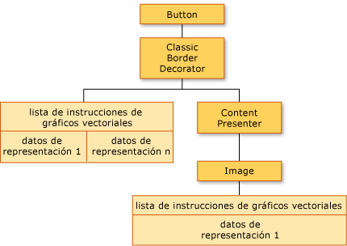
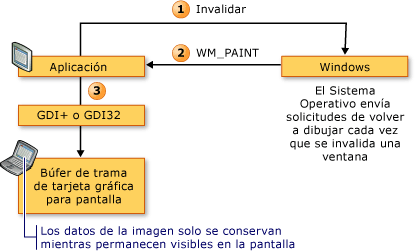
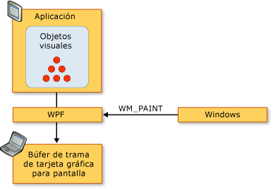
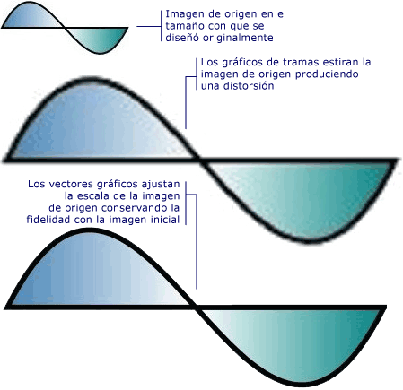

# Información general sobre la representación de gráficos en WPFWPF Graphics Rendering Overview
En este tema se ofrece información de la capa de objeto visual de [!INCLUDE[TLA2#tla_winclient](../../../../includes/tla2sharptla-winclient-md.md)].This topic provides an overview of the [!INCLUDE[TLA2#tla_winclient](../../../../includes/tla2sharptla-winclient-md.md)] visual layer. Se centra en el rol de la <xref:System.Windows.Media.Visual> clase para representar la compatibilidad en el [!INCLUDE[TLA2#tla_winclient](../../../../includes/tla2sharptla-winclient-md.md)] modelo.It focuses on the role of the <xref:System.Windows.Media.Visual> class for rendering support in the [!INCLUDE[TLA2#tla_winclient](../../../../includes/tla2sharptla-winclient-md.md)] model.  
  
  
   
## Rol del objeto visualRole of the Visual Object  
 El <xref:System.Windows.Media.Visual> clase es la abstracción básica desde la que cada <xref:System.Windows.FrameworkElement> se deriva el objeto.The <xref:System.Windows.Media.Visual> class is the basic abstraction from which every <xref:System.Windows.FrameworkElement> object derives. También sirve como punto de entrada para escribir controles nuevos en [!INCLUDE[TLA2#tla_winclient](../../../../includes/tla2sharptla-winclient-md.md)], y en muchos sentidos se puede considerar el identificador de ventana (HWND) del modelo de aplicación de Win32.It also serves as the entry point for writing new controls in [!INCLUDE[TLA2#tla_winclient](../../../../includes/tla2sharptla-winclient-md.md)], and in many ways can be thought of as the window handle (HWND) in the Win32 application model.  
  
 El <xref:System.Windows.Media.Visual> objeto es un núcleo [!INCLUDE[TLA2#tla_winclient](../../../../includes/tla2sharptla-winclient-md.md)] objeto, cuyo rol principal es proporcionar compatibilidad con la representación.The <xref:System.Windows.Media.Visual> object is a core [!INCLUDE[TLA2#tla_winclient](../../../../includes/tla2sharptla-winclient-md.md)] object, whose primary role is to provide rendering support. Controles de interfaz de usuario, como <xref:System.Windows.Controls.Button> y <xref:System.Windows.Controls.TextBox>, derivan de la <xref:System.Windows.Media.Visual> clase y usarla para conservar sus datos de representación.User interface controls, such as <xref:System.Windows.Controls.Button> and <xref:System.Windows.Controls.TextBox>, derive from the <xref:System.Windows.Media.Visual> class, and use it for persisting their rendering data. La <xref:System.Windows.Media.Visual> objeto proporciona compatibilidad para:The <xref:System.Windows.Media.Visual> object provides support for:  
  
-   Presentación de salida: representación persistente, serializa el contenido de dibujo de un objeto visual.Output display: Rendering the persisted, serialized drawing content of a visual.  
  
-   Transformaciones: realizar transformaciones en un objeto visual.Transformations: Performing transformations on a visual.  
  
-   Recorte: proporcionar soporte para una zona de recorte de un objeto visual.Clipping: Providing clipping region support for a visual.  
  
-   Pruebas de posicionamiento: determinar si una coordenada o geometría está dentro de los límites de un objeto visual.Hit testing: Determining whether a coordinate or geometry is contained within the bounds of a visual.  
  
-   Cálculos de rectángulo de selección: determinar el rectángulo delimitador de un objeto visual.Bounding box calculations: Determining the bounding rectangle of a visual.  
  
 Sin embargo, la <xref:System.Windows.Media.Visual> objeto no incluye compatibilidad con características no son de representación, como:However, the <xref:System.Windows.Media.Visual> object does not include support for non-rendering features, such as:  
  
-   Control de eventosEvent handling  
  
-   DiseñoLayout  
  
-   EstilosStyles  
  
-   Enlace de datosData binding  
  
-   GlobalizaciónGlobalization  
  
 <xref:System.Windows.Media.Visual> se expone como una clase abstracta pública desde el que se deben derivar clases secundarias.<xref:System.Windows.Media.Visual> is exposed as a public abstract class from which child classes must be derived. La siguiente ilustración muestra la jerarquía de los objetos visuales que se exponen en [!INCLUDE[TLA2#tla_winclient](../../../../includes/tla2sharptla-winclient-md.md)].The following illustration shows the hierarchy of the visual objects that are exposed in [!INCLUDE[TLA2#tla_winclient](../../../../includes/tla2sharptla-winclient-md.md)].  
  
   
Jerarquía de clase VisualVisual class hierarchy  
  
### Clase DrawingVisualDrawingVisual Class  
 El <xref:System.Windows.Media.DrawingVisual> es una clase que se utiliza para representar formas, imágenes o texto de dibujo de ligera.The <xref:System.Windows.Media.DrawingVisual> is a lightweight drawing class that is used to render shapes, images, or text. Esta clase se considera ligera porque no proporciona control de diseño ni control de eventos, lo que mejora su rendimiento en tiempo de ejecución.This class is considered lightweight because it does not provide layout or event handling, which improves its runtime performance. Por esta razón, los dibujos son ideales para fondos e imágenes prediseñadas.For this reason, drawings are ideal for backgrounds and clip art. El <xref:System.Windows.Media.DrawingVisual> puede usarse para crear un objeto visual personalizado.The <xref:System.Windows.Media.DrawingVisual> can be used to create a custom visual object. Para más información, consulte [Usar objetos DrawingVisual](../../../../docs/framework/wpf/graphics-multimedia/using-drawingvisual-objects.md).For more information, see [Using DrawingVisual Objects](../../../../docs/framework/wpf/graphics-multimedia/using-drawingvisual-objects.md).  
  
### Clase Viewport3DVisualViewport3DVisual Class  
 El <xref:System.Windows.Media.Media3D.Viewport3DVisual> proporciona un puente entre 2D <xref:System.Windows.Media.Visual> y <xref:System.Windows.Media.Media3D.Visual3D> objetos.The <xref:System.Windows.Media.Media3D.Viewport3DVisual> provides a bridge between 2D <xref:System.Windows.Media.Visual> and <xref:System.Windows.Media.Media3D.Visual3D> objects. La <xref:System.Windows.Media.Media3D.Visual3D> clase es la clase base para todos los elementos visuales 3D.The <xref:System.Windows.Media.Media3D.Visual3D> class is the base class for all 3D visual elements. El <xref:System.Windows.Media.Media3D.Viewport3DVisual> requiere que se defina un <xref:System.Windows.Media.Media3D.Viewport3DVisual.Camera%2A> valor y un <xref:System.Windows.Media.Media3D.Viewport3DVisual.Viewport%2A> valor.The <xref:System.Windows.Media.Media3D.Viewport3DVisual> requires that you define a <xref:System.Windows.Media.Media3D.Viewport3DVisual.Camera%2A> value and a <xref:System.Windows.Media.Media3D.Viewport3DVisual.Viewport%2A> value. La cámara permite ver la escena.The camera allows you to view the scene. La ventanilla establece el lugar en que se asigna la proyección a la superficie 2D.The viewport establishes where the projection maps onto the 2D surface. Para más información acerca de 3D en [!INCLUDE[TLA2#tla_winclient](../../../../includes/tla2sharptla-winclient-md.md)], consulte [Información general sobre gráficos 3D](../../../../docs/framework/wpf/graphics-multimedia/3-d-graphics-overview.md).For more information on 3D in [!INCLUDE[TLA2#tla_winclient](../../../../includes/tla2sharptla-winclient-md.md)], see [3-D Graphics Overview](../../../../docs/framework/wpf/graphics-multimedia/3-d-graphics-overview.md).  
  
### Clase ContainerVisualContainerVisual Class  
 El <xref:System.Windows.Media.ContainerVisual> clase se utiliza como un contenedor para una colección de <xref:System.Windows.Media.Visual> objetos.The <xref:System.Windows.Media.ContainerVisual> class is used as a container for a collection of <xref:System.Windows.Media.Visual> objects. El <xref:System.Windows.Media.DrawingVisual> clase se deriva de la <xref:System.Windows.Media.ContainerVisual> (clase), lo que le permite contener una colección de objetos visuales.The <xref:System.Windows.Media.DrawingVisual> class derives from the <xref:System.Windows.Media.ContainerVisual> class, allowing it to contain a collection of visual objects.  
  
### Dibujo de contenido en objetos visualesDrawing Content in Visual Objects  
 Un <xref:System.Windows.Media.Visual> objeto almacena sus datos de representación como una **lista de instrucciones de gráficos vectoriales**.A <xref:System.Windows.Media.Visual> object stores its render data as a **vector graphics instruction list**. Cada elemento de la lista de instrucciones representa un conjunto de bajo nivel de datos gráficos y recursos asociados en un formato serializado.Each item in the instruction list represents a low-level set of graphics data and associated resources in a serialized format. Hay cuatro tipos diferentes de datos de representación que pueden incluir contenido de dibujo.There are four different types of render data that can contain drawing content.  
  
|Tipo de contenido de dibujoDrawing content type|DescripciónDescription|  
|--------------------------|-----------------|  
|Gráficos vectorialesVector graphics|Representa datos de gráficos y los asociados de vector <xref:System.Windows.Media.Brush> y <xref:System.Windows.Media.Pen> información.Represents vector graphics data, and any associated <xref:System.Windows.Media.Brush> and <xref:System.Windows.Media.Pen> information.|  
|ImagenImage|Representa una imagen dentro de una región definida por un <xref:System.Windows.Rect>.Represents an image within a region defined by a <xref:System.Windows.Rect>.|  
|GlifoGlyph|Representa un dibujo que representa un <xref:System.Windows.Media.GlyphRun>, que es una secuencia de glifos de un recurso de fuente especificado.Represents a drawing that renders a <xref:System.Windows.Media.GlyphRun>, which is a sequence of glyphs from a specified font resource. Así es como se representa el texto.This is how text is represented.|  
|VídeoVideo|Representa un dibujo que representa vídeo.Represents a drawing that renders video.|  
  
 El <xref:System.Windows.Media.DrawingContext> permite llenar un <xref:System.Windows.Media.Visual> con contenido visual.The <xref:System.Windows.Media.DrawingContext> allows you to populate a <xref:System.Windows.Media.Visual> with visual content. Cuando se usa un <xref:System.Windows.Media.DrawingContext> los comandos de dibujo del objeto, en realidad se almacena un conjunto de datos de representación que se usará más adelante en el sistema de gráficos; no se dibuja en la pantalla en tiempo real.When you use a <xref:System.Windows.Media.DrawingContext> object's draw commands, you are actually storing a set of render data that will later be used by the graphics system; you are not drawing to the screen in real-time.  
  
 Cuando creas un [!INCLUDE[TLA2#tla_winclient](../../../../includes/tla2sharptla-winclient-md.md)] de control, como un <xref:System.Windows.Controls.Button>, el control genera implícitamente datos de representación para dibujarse a sí mismo.When you create a [!INCLUDE[TLA2#tla_winclient](../../../../includes/tla2sharptla-winclient-md.md)] control, such as a <xref:System.Windows.Controls.Button>, the control implicitly generates render data for drawing itself. Por ejemplo, si se establece la <xref:System.Windows.Controls.ContentControl.Content%2A> propiedad de la <xref:System.Windows.Controls.Button> hace que el control almacene una representación de un glifo.For example, setting the <xref:System.Windows.Controls.ContentControl.Content%2A> property of the <xref:System.Windows.Controls.Button> causes the control to store a rendering representation of a glyph.  
  
 Un <xref:System.Windows.Media.Visual> describe su contenido como uno o más <xref:System.Windows.Media.Drawing> objetos contenidos dentro de un <xref:System.Windows.Media.DrawingGroup>.A <xref:System.Windows.Media.Visual> describes its content as one or more <xref:System.Windows.Media.Drawing> objects contained within a <xref:System.Windows.Media.DrawingGroup>. Un <xref:System.Windows.Media.DrawingGroup> también describe las máscaras de opacidad, transformaciones, efectos de imagen y otras operaciones que se aplican a su contenido.A <xref:System.Windows.Media.DrawingGroup> also describes opacity masks, transforms, bitmap effects, and other operations that are applied to its contents. <xref:System.Windows.Media.DrawingGroup> las operaciones se aplican en el orden siguiente al representa contenido: <xref:System.Windows.Media.DrawingGroup.OpacityMask%2A>, <xref:System.Windows.Media.DrawingGroup.Opacity%2A>, <xref:System.Windows.Media.DrawingGroup.BitmapEffect%2A>, <xref:System.Windows.Media.DrawingGroup.ClipGeometry%2A>, <xref:System.Windows.Media.DrawingGroup.GuidelineSet%2A>y, a continuación, <xref:System.Windows.Media.DrawingGroup.Transform%2A>.<xref:System.Windows.Media.DrawingGroup> operations are applied in the following order when content is rendered: <xref:System.Windows.Media.DrawingGroup.OpacityMask%2A>, <xref:System.Windows.Media.DrawingGroup.Opacity%2A>, <xref:System.Windows.Media.DrawingGroup.BitmapEffect%2A>, <xref:System.Windows.Media.DrawingGroup.ClipGeometry%2A>, <xref:System.Windows.Media.DrawingGroup.GuidelineSet%2A>, and then <xref:System.Windows.Media.DrawingGroup.Transform%2A>.  
  
 La siguiente ilustración muestra el orden en que <xref:System.Windows.Media.DrawingGroup> las operaciones se aplican durante la secuencia de representación.The following illustration shows the order in which <xref:System.Windows.Media.DrawingGroup> operations are applied during the rendering sequence.  
  
   
Orden de las operaciones de DrawingGroupOrder of DrawingGroup operations  
  
 Para más información, consulte [Información general sobre objetos Drawing](../../../../docs/framework/wpf/graphics-multimedia/drawing-objects-overview.md).For more information, see [Drawing Objects Overview](../../../../docs/framework/wpf/graphics-multimedia/drawing-objects-overview.md).  
  
#### Contenido de dibujo en la capa de VisualDrawing Content at the Visual Layer  
 Nunca crear instancias directamente un <xref:System.Windows.Media.DrawingContext>; sin embargo, puede adquirir un contexto de dibujo de determinados métodos, como <xref:System.Windows.Media.DrawingGroup.Open%2A?displayProperty=nameWithType> y <xref:System.Windows.Media.DrawingVisual.RenderOpen%2A?displayProperty=nameWithType>.You never directly instantiate a <xref:System.Windows.Media.DrawingContext>; you can, however, acquire a drawing context from certain methods, such as <xref:System.Windows.Media.DrawingGroup.Open%2A?displayProperty=nameWithType> and <xref:System.Windows.Media.DrawingVisual.RenderOpen%2A?displayProperty=nameWithType>. En el ejemplo siguiente se recupera un <xref:System.Windows.Media.DrawingContext> desde un <xref:System.Windows.Media.DrawingVisual> y lo usa para dibujar un rectángulo.The following example retrieves a <xref:System.Windows.Media.DrawingContext> from a <xref:System.Windows.Media.DrawingVisual> and uses it to draw a rectangle.  
  
 [!code-csharp[drawingvisualsample#101](../../../../samples/snippets/csharp/VS_Snippets_Wpf/DrawingVisualSample/CSharp/Window1.xaml.cs#101)]
 [!code-vb[drawingvisualsample#101](../../../../samples/snippets/visualbasic/VS_Snippets_Wpf/DrawingVisualSample/visualbasic/window1.xaml.vb#101)]  
  
#### Enumeración de contenido de dibujo en la capa de VisualEnumerating Drawing Content at the Visual Layer  
 Además de sus otros usos, <xref:System.Windows.Media.Drawing> objetos también proporcionan un modelo de objetos para enumerar el contenido de un <xref:System.Windows.Media.Visual>.In addition to their other uses, <xref:System.Windows.Media.Drawing> objects also provide an object model for enumerating the contents of a <xref:System.Windows.Media.Visual>.  
  
> [!NOTE]
>  Cuando se enumera el contenido del objeto visual, que se están recuperando <xref:System.Windows.Media.Drawing> objetos y no la representación subyacente de los datos de representación como una lista de instrucciones de gráficos vectoriales.When you are enumerating the contents of the visual, you are retrieving <xref:System.Windows.Media.Drawing> objects, and not the underlying representation of the render data as a vector graphics instruction list.  
  
 En el ejemplo siguiente se usa el <xref:System.Windows.Media.VisualTreeHelper.GetDrawing%2A> método para recuperar el <xref:System.Windows.Media.DrawingGroup> valor de un <xref:System.Windows.Media.Visual> y enumerarlo.The following example uses the <xref:System.Windows.Media.VisualTreeHelper.GetDrawing%2A> method to retrieve the <xref:System.Windows.Media.DrawingGroup> value of a <xref:System.Windows.Media.Visual> and enumerate it.  
  
 [!code-csharp[DrawingMiscSnippets_snip#GraphicsMMRetrieveDrawings](../../../../samples/snippets/csharp/VS_Snippets_Wpf/DrawingMiscSnippets_snip/CSharp/EnumerateDrawingsExample.xaml.cs#graphicsmmretrievedrawings)]  
  
   
## Uso de los objetos visuales para compilar controlesHow Visual Objects are Used to Build Controls  
 Muchos de los objetos de [!INCLUDE[TLA2#tla_winclient](../../../../includes/tla2sharptla-winclient-md.md)] están formados por otros objetos visuales, lo que significa que pueden contener diversas jerarquías de objetos descendientes.Many of the objects in [!INCLUDE[TLA2#tla_winclient](../../../../includes/tla2sharptla-winclient-md.md)] are composed of other visual objects, meaning they can contain varying hierarchies of descendant objects. Muchos de los elementos de la interfaz de usuario de [!INCLUDE[TLA2#tla_winclient](../../../../includes/tla2sharptla-winclient-md.md)], como los controles, constan de varios objetos visuales, que representan diferentes tipos de representación de elementos.Many of the user interface elements in [!INCLUDE[TLA2#tla_winclient](../../../../includes/tla2sharptla-winclient-md.md)], such as controls, are composed of multiple visual objects, representing different types of rendering elements. Por ejemplo, el <xref:System.Windows.Controls.Button> control puede contener un número de otros objetos, incluidos <xref:Microsoft.Windows.Themes.ClassicBorderDecorator>, <xref:System.Windows.Controls.ContentPresenter>, y <xref:System.Windows.Controls.TextBlock>.For example, the <xref:System.Windows.Controls.Button> control can contain a number of other objects, including <xref:Microsoft.Windows.Themes.ClassicBorderDecorator>, <xref:System.Windows.Controls.ContentPresenter>, and <xref:System.Windows.Controls.TextBlock>.  
  
 El código siguiente muestra un <xref:System.Windows.Controls.Button> definido en el marcado del control.The following code shows a <xref:System.Windows.Controls.Button> control defined in markup.  
  
 [!code-xaml[VisualsOverview#VisualsOverviewSnippet1](../../../../samples/snippets/csharp/VS_Snippets_Wpf/VisualsOverview/CSharp/Window1.xaml#visualsoverviewsnippet1)]  
  
 Si tuviera que enumerar los objetos visuales que constituyen el valor predeterminado <xref:System.Windows.Controls.Button> control, encontraría la jerarquía de objetos visuales se muestra a continuación:If you were to enumerate the visual objects that comprise the default <xref:System.Windows.Controls.Button> control, you would find the hierarchy of visual objects illustrated below:  
  
   
Diagrama de jerarquía de árbol visualDiagram of visual tree hierarchy  
  
 El <xref:System.Windows.Controls.Button> control contiene un <xref:Microsoft.Windows.Themes.ClassicBorderDecorator> elemento, que a su vez, contiene un <xref:System.Windows.Controls.ContentPresenter> elemento.The <xref:System.Windows.Controls.Button> control contains a <xref:Microsoft.Windows.Themes.ClassicBorderDecorator> element, which in turn, contains a <xref:System.Windows.Controls.ContentPresenter> element. El <xref:Microsoft.Windows.Themes.ClassicBorderDecorator> elemento es responsable de dibujar un borde y un fondo para el <xref:System.Windows.Controls.Button>.The <xref:Microsoft.Windows.Themes.ClassicBorderDecorator> element is responsible for drawing a border and a background for the <xref:System.Windows.Controls.Button>. El <xref:System.Windows.Controls.ContentPresenter> es responsable de mostrar el contenido del elemento de la <xref:System.Windows.Controls.Button>.The <xref:System.Windows.Controls.ContentPresenter> element is responsible for displaying the contents of the <xref:System.Windows.Controls.Button>. En este caso, ya que se va a mostrar texto, el <xref:System.Windows.Controls.ContentPresenter> elemento contiene un <xref:System.Windows.Controls.TextBlock> elemento.In this case, since you are displaying text, the <xref:System.Windows.Controls.ContentPresenter> element contains a <xref:System.Windows.Controls.TextBlock> element. El hecho de que el <xref:System.Windows.Controls.Button> control utiliza un <xref:System.Windows.Controls.ContentPresenter> significa que el contenido podría representarse por otros elementos, como un <xref:System.Windows.Controls.Image> o una geometría, como un <xref:System.Windows.Media.EllipseGeometry>.The fact that the <xref:System.Windows.Controls.Button> control uses a <xref:System.Windows.Controls.ContentPresenter> means that the content could be represented by other elements, such as an <xref:System.Windows.Controls.Image> or a geometry, such as an <xref:System.Windows.Media.EllipseGeometry>.  
  
### Plantillas de controlControl Templates  
 La clave para la expansión de un control en una jerarquía de controles es el <xref:System.Windows.Controls.ControlTemplate>.The key to the expansion of a control into a hierarchy of controls is the <xref:System.Windows.Controls.ControlTemplate>. Una plantilla de control especifica la jerarquía visual predeterminada de un control.A control template specifies the default visual hierarchy for a control. Al hacer referencia explícitamente a un control, implícitamente también se hace referencia a su jerarquía visual.When you explicitly reference a control, you implicitly reference its visual hierarchy. Puede reemplazar los valores predeterminados de una plantilla de control para crear una apariencia visual personalizada para un control.You can override the default values for a control template to create a customized visual appearance for a control. Por ejemplo, podría modificar el valor de color de fondo de la <xref:System.Windows.Controls.Button> controlar para que utilice un valor de color de degradado lineal en lugar de un valor de color sólido.For example, you could modify the background color value of the <xref:System.Windows.Controls.Button> control so that it uses a linear gradient color value instead of a solid color value. Para más información, consulte [Button ControlTemplate Example](../../../../docs/framework/wpf/controls/button-styles-and-templates.md) (Ejemplo de ControlTemplate de Button).For more information, see [Button Styles and Templates](../../../../docs/framework/wpf/controls/button-styles-and-templates.md).  
  
 Interfaz de usuario de un elemento, como un <xref:System.Windows.Controls.Button> de control, contiene varias listas de instrucciones de gráficos vectoriales que describen la definición de la representación completa de un control.A user interface element, such as a <xref:System.Windows.Controls.Button> control, contains several vector graphics instruction lists that describe the entire rendering definition of a control. El código siguiente muestra un <xref:System.Windows.Controls.Button> definido en el marcado del control.The following code shows a <xref:System.Windows.Controls.Button> control defined in markup.  
  
 [!code-xaml[VisualsOverview#VisualsOverviewSnippet2](../../../../samples/snippets/csharp/VS_Snippets_Wpf/VisualsOverview/CSharp/Window1.xaml#visualsoverviewsnippet2)]  
  
 Si tuviera que enumerar los objetos visuales y vectoriales listas de instrucciones de gráficos que componen el <xref:System.Windows.Controls.Button> control, encontraría la jerarquía de objetos que se muestra a continuación:If you were to enumerate the visual objects and vector graphics instruction lists that comprise the <xref:System.Windows.Controls.Button> control, you would find the hierarchy of objects illustrated below:  
  
   
Diagrama de árbol visual y datos de representaciónDiagram of visual tree and rendering data  
  
 El <xref:System.Windows.Controls.Button> control contiene un <xref:Microsoft.Windows.Themes.ClassicBorderDecorator> elemento, que a su vez, contiene un <xref:System.Windows.Controls.ContentPresenter> elemento.The <xref:System.Windows.Controls.Button> control contains a <xref:Microsoft.Windows.Themes.ClassicBorderDecorator> element, which in turn, contains a <xref:System.Windows.Controls.ContentPresenter> element. El <xref:Microsoft.Windows.Themes.ClassicBorderDecorator> elemento es responsable de dibujar todos los elementos gráficos discretos que constituyen el borde y fondo de un botón.The <xref:Microsoft.Windows.Themes.ClassicBorderDecorator> element is responsible for drawing all the discrete graphic elements that make up the border and background of a button. El <xref:System.Windows.Controls.ContentPresenter> es responsable de mostrar el contenido del elemento de la <xref:System.Windows.Controls.Button>.The <xref:System.Windows.Controls.ContentPresenter> element is responsible for displaying the contents of the <xref:System.Windows.Controls.Button>. En este caso, ya que se va a mostrar una imagen, el <xref:System.Windows.Controls.ContentPresenter> elemento contiene un <xref:System.Windows.Controls.Image> elemento.In this case, since you are displaying an image, the <xref:System.Windows.Controls.ContentPresenter> element contains a <xref:System.Windows.Controls.Image> element.  
  
 Hay que tener en cuenta varios aspectos de la jerarquía de objetos visuales y las listas de instrucciones de gráficos vectoriales:There are a number of points to note about the hierarchy of visual objects and vector graphics instruction lists:  
  
-   El orden de la jerarquía representa el orden de procesamiento de la información de dibujo.The ordering in the hierarchy represents the rendering order of the drawing information. Desde el elemento del objeto visual raíz, se atraviesa a los elementos secundarios de izquierda a derecha y de arriba a abajo.From the root visual element, child elements are traversed, left to right, top to bottom. Si un elemento tiene elementos visuales secundarios, se atraviesan antes que los relacionados del elemento.If an element has visual child elements, they are traversed before the element’s siblings.  
  
-   Elementos de nodo no hoja de la jerarquía, tales como <xref:System.Windows.Controls.ContentPresenter>, se utilizan para contener elementos secundarios, no contienen listas de instrucciones.Non-leaf node elements in the hierarchy, such as <xref:System.Windows.Controls.ContentPresenter>, are used to contain child elements—they do not contain instruction lists.  
  
-   Si un elemento visual contiene una lista de instrucciones de gráficos vectoriales y elementos secundarios visuales, la lista de instrucciones del elemento visual primario se representa antes que los dibujos en cualquiera de los objetos visuales secundarios.If a visual element contains both a vector graphics instruction list and visual children, the instruction list in the parent visual element is rendered before drawings in any of the visual child objects.  
  
-   Los elementos de la lista de instrucciones de gráficos vectoriales se representan de izquierda a derecha.The items in the vector graphics instruction list are rendered left to right.  
  
   
## Árbol visualVisual Tree  
 El árbol visual contiene todos los elementos visuales que se usan en la interfaz de usuario de una aplicación.The visual tree contains all visual elements used in an application's user interface. Puesto que un elemento visual contiene información guardada del dibujo, el árbol visual se puede considerar un gráfico de la escena, que contiene toda la información de representación necesaria para componer la salida de la pantalla.Since a visual element contains persisted drawing information, you can think of the visual tree as a scene graph, containing all the rendering information needed to compose the output to the display device. Este árbol es la acumulación de todos los elementos visuales creados directamente por la aplicación, ya sea a través de código o de marcación.This tree is the accumulation of all visual elements created directly by the application, whether in code or in markup. El árbol visual también contiene todos los elementos visuales que ha creado la expansión de la plantilla de elementos, como controles y objetos de datos.The visual tree also contains all visual elements created by the template expansion of elements such as controls and data objects.  
  
 El código siguiente muestra un <xref:System.Windows.Controls.StackPanel> elemento definido en el marcado.The following code shows a <xref:System.Windows.Controls.StackPanel> element defined in markup.  
  
 [!code-xaml[VisualsOverview#VisualsOverviewSnippet3](../../../../samples/snippets/csharp/VS_Snippets_Wpf/VisualsOverview/CSharp/Window1.xaml#visualsoverviewsnippet3)]  
  
 Si tuviera que enumerar los objetos visuales que constituyen el <xref:System.Windows.Controls.StackPanel> elemento del ejemplo de marcación, encontraría la jerarquía de objetos visuales se muestra a continuación:If you were to enumerate the visual objects that comprise the <xref:System.Windows.Controls.StackPanel> element in the markup example, you would find the hierarchy of visual objects illustrated below:  
  
   
Diagrama de jerarquía de árbol visualDiagram of visual tree hierarchy  
  
### Orden de representaciónRendering Order  
 El árbol visual determina el orden de representación de objetos visuales y de dibujo de [!INCLUDE[TLA2#tla_winclient](../../../../includes/tla2sharptla-winclient-md.md)].The visual tree determines the rendering order of [!INCLUDE[TLA2#tla_winclient](../../../../includes/tla2sharptla-winclient-md.md)] visual and drawing objects. El orden del recorrido comienza con el objeto visual raíz, que es el nodo de nivel superior del árbol visual.The order of traversal starts with the root visual, which is the top-most node in the visual tree. A continuación, se atraviesan los elementos secundarios del objeto visual raíz, de izquierda a derecha.The root visual’s children are then traversed, left to right. Si un objeto visual tiene elementos secundarios, estos se atraviesan antes que los elementos del mismo nivel del objeto visual.If a visual has children, its children are traversed before the visual’s siblings. Esto significa que el contenido de un objeto visual secundario se representa delante del contenido propio del objeto visual.This means that the content of a child visual is rendered in front of the visual's own content.  
  
   
Diagrama de orden de representación de árbol visualDiagram of visual tree rendering order  
  
### Objeto visual raízRoot Visual  
 El **objeto visual raíz** es el elemento de nivel superior de una jerarquía de árbol visual.The **root visual** is the top-most element in a visual tree hierarchy. En la mayoría de las aplicaciones, la clase base del objeto visual raíz es <xref:System.Windows.Window> o <xref:System.Windows.Navigation.NavigationWindow>.In most applications, the base class of the root visual is either <xref:System.Windows.Window> or <xref:System.Windows.Navigation.NavigationWindow>. Sin embargo, si se hospedaran objetos visuales en una aplicación Win32, el objeto visual raíz sería el objeto visual de nivel superior que se hospeda en la ventana de Win32.However, if you were hosting visual objects in a Win32 application, the root visual would be the top-most visual you were hosting in the Win32 window. Para más información, consulte [Tutorial: Hosting Visual Objects in a Win32 Application](../../../../docs/framework/wpf/graphics-multimedia/tutorial-hosting-visual-objects-in-a-win32-application.md) (Tutorial: hospedar objetos visuales en una aplicación Win32).For more information, see [Tutorial: Hosting Visual Objects in a Win32 Application](../../../../docs/framework/wpf/graphics-multimedia/tutorial-hosting-visual-objects-in-a-win32-application.md).  
  
### Relación con el árbol lógicoRelationship to the Logical Tree  
 El árbol lógico de [!INCLUDE[TLA2#tla_winclient](../../../../includes/tla2sharptla-winclient-md.md)] representa los elementos de una aplicación en tiempo de ejecución.The logical tree in [!INCLUDE[TLA2#tla_winclient](../../../../includes/tla2sharptla-winclient-md.md)] represents the elements of an application at run time. Aunque no manipula directamente este árbol, esta vista de la aplicación es útil para entender la herencia de propiedades y el enrutamiento de eventos.Although you do not manipulate this tree directly, this view of the application is useful for understanding property inheritance and event routing. A diferencia del árbol visual, el árbol lógico puede representar objetos de datos no visuales, tales como <xref:System.Windows.Documents.ListItem>.Unlike the visual tree, the logical tree can represent non-visual data objects, such as <xref:System.Windows.Documents.ListItem>. En muchos casos, el árbol lógico se asigna muy estrechamente con las definiciones de marcación de una aplicación.In many cases, the logical tree maps very closely to an application's markup definitions. El código siguiente muestra un <xref:System.Windows.Controls.DockPanel> elemento definido en el marcado.The following code shows a <xref:System.Windows.Controls.DockPanel> element defined in markup.  
  
 [!code-xaml[VisualsOverview#VisualsOverviewSnippet5](../../../../samples/snippets/csharp/VS_Snippets_Wpf/VisualsOverview/CSharp/Window1.xaml#visualsoverviewsnippet5)]  
  
 Si tuviera que enumerar los objetos lógicos que constituyen el <xref:System.Windows.Controls.DockPanel> elemento del ejemplo de marcación, encontraría la jerarquía de objetos lógicos que se muestra a continuación:If you were to enumerate the logical objects that comprise the <xref:System.Windows.Controls.DockPanel> element in the markup example, you would find the hierarchy of logical objects illustrated below:  
  
   
Diagrama de árbol lógicoDiagram of logical tree  
  
 El árbol visual y el árbol lógico se sincronizan con el conjunto actual de elementos de la aplicación, que refleja cualquier adición, eliminación o modificación de elementos.Both the visual tree and logical tree are synchronized with the current set of application elements, reflecting any addition, deletion, or modification of elements. Sin embargo, los árboles presentan distintas vistas de la aplicación.However, the trees present different views of the application. A diferencia del árbol visual, el árbol lógico no expande un control <xref:System.Windows.Controls.ContentPresenter> elemento.Unlike the visual tree, the logical tree does not expand a control's <xref:System.Windows.Controls.ContentPresenter> element. Esto significa que no hay una correspondencia uno a uno directa entre un árbol lógico y un árbol visual del mismo conjunto de objetos.This means there is not a direct one-to-one correspondence between a logical tree and a visual tree for the same set of objects. De hecho, invocar el **LogicalTreeHelper** del objeto <xref:System.Windows.LogicalTreeHelper.GetChildren%2A> método y el **VisualTreeHelper** del objeto <xref:System.Windows.Media.VisualTreeHelper.GetChild%2A> método con el mismo elemento como un parámetro arroja resultados diferentes .In fact, invoking the **LogicalTreeHelper** object's <xref:System.Windows.LogicalTreeHelper.GetChildren%2A> method and the **VisualTreeHelper** object's <xref:System.Windows.Media.VisualTreeHelper.GetChild%2A> method using the same element as a parameter yields differing results.  
  
 Para más información acerca del árbol lógico, consulte [Árboles en WPF](../../../../docs/framework/wpf/advanced/trees-in-wpf.md).For more information on the logical tree, see [Trees in WPF](../../../../docs/framework/wpf/advanced/trees-in-wpf.md).  
  
### Visualización del árbol visual con XamlPadViewing the Visual Tree with XamlPad  
 La herramienta de [!INCLUDE[TLA2#tla_winclient](../../../../includes/tla2sharptla-winclient-md.md)], XamlPad, proporciona una opción para ver y explorar el árbol visual que corresponde al contenido de [!INCLUDE[TLA#tla_titlexaml](../../../../includes/tlasharptla-titlexaml-md.md)] definido actualmente.The [!INCLUDE[TLA2#tla_winclient](../../../../includes/tla2sharptla-winclient-md.md)] tool, XamlPad, provides an option for viewing and exploring the visual tree that corresponds to the currently defined [!INCLUDE[TLA#tla_titlexaml](../../../../includes/tlasharptla-titlexaml-md.md)] content. Haga clic en el botón **Show Visual Tree** (Mostrar árbol visual) de la barra de menús para mostrar el árbol visual.Click the **Show Visual Tree** button on the menu bar to display the visual tree. A continuación se muestra la expansión del contenido de [!INCLUDE[TLA#tla_titlexaml](../../../../includes/tlasharptla-titlexaml-md.md)] en nodos de árbol visual en el panel **Visual Tree Explorer** (Explorador de árbol visual) de XamlPad:The following illustrates the expansion of [!INCLUDE[TLA#tla_titlexaml](../../../../includes/tlasharptla-titlexaml-md.md)] content into visual tree nodes in the **Visual Tree Explorer** panel of XamlPad:  
  
   
Panel del explorador de árbol visual en XamlPadVisual Tree Explorer panel in XamlPad  
  
 Observe cómo el <xref:System.Windows.Controls.Label>, <xref:System.Windows.Controls.TextBox>, y <xref:System.Windows.Controls.Button> todos los controles de mostrar una jerarquía de objetos visuales independiente en el **Visual Tree Explorer** panel de XamlPad.Notice how the <xref:System.Windows.Controls.Label>, <xref:System.Windows.Controls.TextBox>, and <xref:System.Windows.Controls.Button> controls each display a separate visual object hierarchy in the **Visual Tree Explorer** panel of XamlPad. Esto es porque [!INCLUDE[TLA2#tla_winclient](../../../../includes/tla2sharptla-winclient-md.md)] controles tienen un <xref:System.Windows.Controls.ControlTemplate> que contiene el árbol visual de ese control.This is because [!INCLUDE[TLA2#tla_winclient](../../../../includes/tla2sharptla-winclient-md.md)] controls have a <xref:System.Windows.Controls.ControlTemplate> that contains the visual tree of that control. Al hacer referencia explícitamente a un control, implícitamente también se hace referencia a su jerarquía visual.When you explicitly reference a control, you implicitly reference its visual hierarchy.  
  
### Generación de perfiles de rendimiento visualProfiling Visual Performance  
 [!INCLUDE[TLA2#tla_winclient](../../../../includes/tla2sharptla-winclient-md.md)] ofrece un conjunto de herramientas de generación de perfiles de rendimiento que le permiten analizar el comportamiento en tiempo de ejecución de la aplicación y determinar los tipos de optimizaciones de rendimiento que puede aplicar.provides a suite of performance profiling tools that allow you to analyze the run-time behavior of your application and determine the types of performance optimizations you can apply. La herramienta Generador de perfiles visuales proporciona una vista gráfica completa de los datos de rendimiento mediante la asignación al árbol visual de la aplicación.The Visual Profiler tool provides a rich, graphical view of performance data by mapping directly to the application's visual tree. En esta captura de pantalla, la sección **Uso de CPU** del generador de perfiles visuales proporciona un desglose preciso del uso que un objeto realiza de los servicios de [!INCLUDE[TLA2#tla_winclient](../../../../includes/tla2sharptla-winclient-md.md)], como la representación y el diseño.In this screenshot, the **CPU Usage** section of the Visual Profiler gives you a precise breakdown of an object's use of [!INCLUDE[TLA2#tla_winclient](../../../../includes/tla2sharptla-winclient-md.md)] services, such as rendering and layout.  
  
   
Resultados del generador de perfiles visualesVisual Profiler display output  
  
   
## Comportamiento de la representación visualVisual Rendering Behavior  
 [!INCLUDE[TLA2#tla_winclient](../../../../includes/tla2sharptla-winclient-md.md)] presenta varias características que afectan al comportamiento de la representación de los objetos visuales: gráficos en modo retenido, gráficos vectoriales y gráficos independientes del dispositivo.introduces several features that affect the rendering behavior of visual objects: retained mode graphics, vector graphics, and device independent graphics.  
  
### Gráficos en modo retenidoRetained Mode Graphics  
 Una de las claves para conocer el rol del objeto visual es conocer la diferencia entre los sistemas de gráficos del **modo inmediato** y del **modo retenido**.One of the keys to understanding the role of the Visual object is to understand the difference between **immediate mode** and **retained mode** graphics systems. Una aplicación Win32 estándar basada en GDI o GDI + utiliza un sistema de gráficos de modo inmediato.A standard Win32 application based on GDI or GDI+ uses an immediate mode graphics system. Esto significa que la aplicación es responsable de volver a dibujar la parte del área de cliente que se ha invalidado, debido a una acción, como el cambio de tamaño de una ventana o al cambio de la apariencia visual de un objeto.This means that the application is responsible for repainting the portion of the client area that is invalidated, due to an action such as a window being resized, or an object changing its visual appearance.  
  
   
Diagrama de secuencia de representación de Win32Diagram of Win32 rendering sequence  
  
 En cambio, [!INCLUDE[TLA2#tla_winclient](../../../../includes/tla2sharptla-winclient-md.md)] utiliza un sistema de modo retenido.In contrast, [!INCLUDE[TLA2#tla_winclient](../../../../includes/tla2sharptla-winclient-md.md)] uses a retained mode system. Esto significa que los objetos de la aplicación que tienen una apariencia visual definen un conjunto de datos de dibujo serializados.This means application objects that have a visual appearance define a set of serialized drawing data. Una vez que se definen los datos de dibujo, el sistema es responsable de responder a todas las solicitudes de repetición del dibujo para representar los objetos de la aplicación.Once the drawing data is defined, the system is responsible thereafter for responding to all repaint requests for rendering the application objects. Incluso en tiempo de ejecución, puede modificar o crear objetos de la aplicación y seguir confiando en que el sistema responderá a las solicitudes de dibujo.Even at run time, you can modify or create application objects, and still rely on the system for responding to paint requests. La eficacia de un sistema de gráficos en modo retenido es que la aplicación guarda siempre la información de dibujo en un estado serializado, pero la responsabilidad de la representación se deja al sistema.The power in a retained mode graphics system is that drawing information is always persisted in a serialized state by the application, but rendering responsibility left to the system. El siguiente diagrama muestra la forma en que la aplicación usa [!INCLUDE[TLA2#tla_winclient](../../../../includes/tla2sharptla-winclient-md.md)] para responder a las solicitudes de dibujo.The following diagram shows how the application relies on [!INCLUDE[TLA2#tla_winclient](../../../../includes/tla2sharptla-winclient-md.md)] for responding to paint requests.  
  
   
Diagrama de secuencia de representación de WPFDiagram of WPF rendering sequence  
  
#### Volver a dibujar de forma inteligenteIntelligent Redrawing  
 Una de las mayores ventajas de utilizar gráficos en modo retenido es que [!INCLUDE[TLA2#tla_winclient](../../../../includes/tla2sharptla-winclient-md.md)] puede optimizar eficazmente lo que hay que volver a dibujar en la aplicación.One of the biggest benefits in using retained mode graphics is that [!INCLUDE[TLA2#tla_winclient](../../../../includes/tla2sharptla-winclient-md.md)] can efficiently optimize what needs to be redrawn in the application. Aunque tenga una escena compleja con diferentes niveles de opacidad, por lo general no es preciso escribir código especial para optimizar el redibujado.Even if you have a complex scene with varying levels of opacity, you generally do not need to write special-purpose code to optimize redrawing. Compárelo esto con la programación de Win32, en la que se puede dedicar mucho esfuerzo a optimizar la aplicación mediante la minimización de la cantidad de redibujado que se realiza en la región de actualización.Compare this with Win32 programming in which you can spend a great deal of effort in optimizing your application by minimizing the amount of redrawing in the update region. Consulte [Redrawing in the Update Region](/windows/desktop/gdi/redrawing-in-the-update-region) (Redibujado en la región de actualización) para obtener un ejemplo del tipo de complejidad implicado en la optimización del redibujado en las aplicaciones de Win32.See [Redrawing in the Update Region](/windows/desktop/gdi/redrawing-in-the-update-region) for an example of the type of complexity involved in optimizing redrawing in Win32 applications.  
  
### Gráficos vectorialesVector Graphics  
 [!INCLUDE[TLA2#tla_winclient](../../../../includes/tla2sharptla-winclient-md.md)] usa **gráficos vectoriales** como formato de los datos de representación.uses **vector graphics** as its rendering data format. Los gráficos vectoriales, que incluyen Scalable Vector Graphics (SVG), metarchivos de Windows (.wmf) y fuentes TrueType, almacenan datos de representación y los transmiten como una lista de instrucciones que describen cómo volver a crear una imagen mediante primitivas de gráficos.Vector graphics—which include Scalable Vector Graphics (SVG), Windows metafiles (.wmf), and TrueType fonts—store rendering data and transmit it as a list of instructions that describe how to recreate an image using graphics primitives. Por ejemplo, las fuentes TrueType son fuentes de esquema que describen un conjunto de líneas, curvas y comandos, en lugar de una matriz de píxeles.For example, TrueType fonts are outline fonts that describe a set of lines, curves, and commands, rather than an array of pixels. Una de las ventajas principales de los gráficos vectoriales es su capacidad para escalar a cualquier tamaño y resolución.One of the key benefits of vector graphics is the ability to scale to any size and resolution.  
  
 A diferencia de los gráficos vectoriales, los gráficos de mapa de bits almacenan los datos de representación como una representación píxel a píxel de una imagen, previamente representada para una resolución específica.Unlike vector graphics, bitmap graphics store rendering data as a pixel-by-pixel representation of an image, pre-rendered for a specific resolution. Una de las principales diferencias entre los formatos de gráficos vectoriales y de mapa de bits es la fidelidad con la imagen original.One of the key differences between bitmap and vector graphic formats is fidelity to the original source image. Por ejemplo, cuando se modifica el tamaño de una imagen de origen, los sistemas de gráficos de mapa de bits ajustan la imagen, mientras que los sistemas de gráficos vectoriales la escalan, lo que mantiene su fidelidad.For example, when the size of a source image is modified, bitmap graphics systems stretch the image, whereas vector graphics systems scale the image, preserving the image fidelity.  
  
 La ilustración siguiente muestra una imagen de origen cuyo tamaño se ha cambiado en un 300 %.The following illustration shows a source image that has been resized by 300%. Observe las distorsiones que aparecen cuando la imagen de origen es un gráfico de mapa de bits y se ajusta, en lugar de escalarse como imagen de gráfico vectorial.Notice the distortions that appear when the source image is stretched as a bitmap graphics image rather than scaled as a vector graphics image.  
  
   
Diferencias entre gráficos de trama y vectorialesDifferences between raster and vector graphics  
  
 El marcado siguiente muestra dos <xref:System.Windows.Shapes.Path> elementos definidos.The following markup shows two <xref:System.Windows.Shapes.Path> elements defined. El segundo elemento utiliza un <xref:System.Windows.Media.ScaleTransform> para cambiar el tamaño de las instrucciones de dibujo del primer elemento en un 300%.The second element uses a <xref:System.Windows.Media.ScaleTransform> to resize the drawing instructions of the first element by 300%. Tenga en cuenta que las instrucciones de dibujo en el <xref:System.Windows.Shapes.Path> elementos permanecen sin cambios.Notice that the drawing instructions in the <xref:System.Windows.Shapes.Path> elements remain unchanged.  
  
 [!code-xaml[VectorGraphicsSnippets#VectorGraphicsSnippet1](../../../../samples/snippets/csharp/VS_Snippets_Wpf/VectorGraphicsSnippets/CS/PageOne.xaml#vectorgraphicssnippet1)]  
  
### Acerca de los gráficos independientes de la resolución y del dispositivoAbout Resolution and Device-Independent Graphics  
 Hay dos factores del sistema que determinan el tamaño tanto del texto como de los gráficos en la pantalla: la resolución y los puntos por pulgada.There are two system factors that determine the size of text and graphics on your screen: resolution and DPI. La resolución describe el número de píxeles que aparecen en la pantalla.Resolution describes the number of pixels that appear on the screen. A medida que aumenta la resolución, disminuye el tamaño de los píxeles, lo que provoca que tanto los gráficos como el texto parezcan menores.As the resolution gets higher, pixels get smaller, causing graphics and text to appear smaller. Un gráfico que se muestre en un monitor cuya resolución se haya configurado en 1024 x 768 píxeles parecerá mucho más pequeño cuando dicha resolución se cambie a 1600 x 1200.A graphic displayed on a monitor set to 1024 x 768 will appear much smaller when the resolution is changed to 1600 x 1200.  
  
 La otra configuración del sistema, los puntos por pulgada (ppp), describe el tamaño de una pulgada de pantalla, en píxeles.The other system setting, DPI, describes the size of a screen inch in pixels. La mayoría de los sistemas [!INCLUDE[TLA#tla_mswin](../../../../includes/tlasharptla-mswin-md.md)] tienen un valor de PPP de 96, lo que significa que una pulgada de la pantalla tiene 96 píxeles.Most [!INCLUDE[TLA#tla_mswin](../../../../includes/tlasharptla-mswin-md.md)] systems have a DPI of 96, which means a screen inch is 96 pixels. El aumento de la configuración de PPP aumenta el tamaño de la pulgada de la pantalla; mientras que su disminución lo reduce,Increasing the DPI setting makes the screen inch larger; decreasing the DPI makes the screen inch smaller. lo que significa que una pulgada de la pantalla no es el mismo tamaño que una pulgada real; en la mayoría de los sistemas, es probable que no lo sea.This means that a screen inch isn't the same size as a real-world inch; on most systems, it's probably not. A medida que se aumente el valor de PPP, tanto el texto como los gráficos con reconocimiento de PPP serán mayores, ya que se ha incrementado el tamaño de la pulgada de pantalla.As you increase the DPI, DPI-aware graphics and text become larger because you've increased the size of the screen inch. El aumento del valor de PPP puede facilitar la lectura del texto, especialmente en resoluciones altas.Increasing the DPI can make text easier to read, especially at high resolutions.  
  
 No todas las aplicaciones reconocen el PPP: algunas utilizan los píxeles de hardware como unidad de medida principal; por consiguiente, el cambio de los PPP del sistema no tiene ningún efecto en dichas aplicaciones.Not all applications are DPI-aware: some use hardware pixels as the primary unit of measurement; changing the system DPI has no effect on these applications. Muchas otras aplicaciones utilizan unidades con reconocimiento de PPP para describir los tamaños de fuente, pero usan píxeles para describir todo lo demás.Many other applications use DPI-aware units to describe font sizes, but use pixels to describe everything else. Un valor de PPP es demasiado pequeño o demasiado grande puede provocar problemas de diseño en estas aplicaciones, ya que el texto de las aplicaciones se escala con la configuración de PPP del sistema, mientras que su interfaz de usuario no lo hace.Making the DPI too small or too large can cause layout problems for these applications, because the applications' text scales with the system's DPI setting, but the applications' UI does not. Este problema se ha eliminado en las aplicaciones desarrolladas mediante [!INCLUDE[TLA2#tla_winclient](../../../../includes/tla2sharptla-winclient-md.md)].This problem has been eliminated for applications developed using [!INCLUDE[TLA2#tla_winclient](../../../../includes/tla2sharptla-winclient-md.md)].  
  
 [!INCLUDE[TLA2#tla_winclient](../../../../includes/tla2sharptla-winclient-md.md)] admite el escalado automático mediante el uso del píxel independiente del dispositivo como unidad de medida principal, en lugar de los píxeles de hardware; tanto el texto como los gráficos se escalan correctamente sin que el desarrollador de la aplicación tenga que realizar ningún trabajo adicional.supports automatic scaling by using the device independent pixel as its primary unit of measurement, instead of hardware pixels; graphics and text scale properly without any extra work from the application developer. La siguiente ilustración muestra un ejemplo de cómo aparecen tanto el texto como los gráficos de [!INCLUDE[TLA2#tla_winclient](../../../../includes/tla2sharptla-winclient-md.md)] con diferentes configuraciones de PPP.The following illustration shows an example of how [!INCLUDE[TLA2#tla_winclient](../../../../includes/tla2sharptla-winclient-md.md)] text and graphics are appear at different DPI settings.  
  
   
Gráficos y texto con diferentes configuraciones de PPPGraphics and text at different DPI settings  
  
   
## Clase VisualTreeHelperVisualTreeHelper Class  
 La <xref:System.Windows.Media.VisualTreeHelper> clase es una clase auxiliar estática que proporciona funcionalidad de bajo nivel para la programación en el nivel de objeto visual, lo que resulta útil en escenarios muy concretos, como el desarrollo de controles personalizados de alto rendimiento.The <xref:System.Windows.Media.VisualTreeHelper> class is a static helper class that provides low-level functionality for programming at the visual object level, which is useful in very specific scenarios, such as developing high-performance custom controls. En la mayoría de los casos, el nivel más alto [!INCLUDE[TLA2#tla_winclient](../../../../includes/tla2sharptla-winclient-md.md)] objetos de framework, como <xref:System.Windows.Controls.Canvas> y <xref:System.Windows.Controls.TextBlock>, proporcionan más flexibilidad y facilidad de uso.In most case, the higher-level [!INCLUDE[TLA2#tla_winclient](../../../../includes/tla2sharptla-winclient-md.md)] framework objects, such as <xref:System.Windows.Controls.Canvas> and <xref:System.Windows.Controls.TextBlock>, offer greater flexibility and ease of use.  
  
### Pruebas de posicionamientoHit Testing  
 La <xref:System.Windows.Media.VisualTreeHelper> clase proporciona métodos para la prueba en objetos visuales cuando el valor predeterminado alcanza el soporte técnico de la prueba de posicionamiento no satisfacen sus necesidades.The <xref:System.Windows.Media.VisualTreeHelper> class provides methods for hit testing on visual objects when the default hit test support does not meet your needs. Puede usar el <xref:System.Windows.Media.VisualTreeHelper.HitTest%2A> métodos en el <xref:System.Windows.Media.VisualTreeHelper> clase para determinar si un valor de coordenadas de geometría o un punto está dentro del límite de un objeto determinado, como un control o elemento gráfico.You can use the <xref:System.Windows.Media.VisualTreeHelper.HitTest%2A> methods in the <xref:System.Windows.Media.VisualTreeHelper> class to determine whether a geometry or point coordinate value is within the boundary of a given object, such as a control or graphic element. Por ejemplo, las pruebas de posicionamiento se pueden utilizar para determinar si un clic del mouse dentro del rectángulo delimitador de un objeto pertenece a la geometría de un círculo. También puede elegir invalidar la implementación predeterminada de las pruebas de posicionamiento para realizar sus propios cálculos de las pruebas de posicionamiento.For example, you could use hit testing to determine whether a mouse click within the bounding rectangle of an object falls within the geometry of a circle You can also choose to override the default implementation of hit testing to perform your own custom hit test calculations.  
  
 Para más información acerca de las pruebas de posicionamiento, consulte [Hit Testing in the Visual Layer](../../../../docs/framework/wpf/graphics-multimedia/hit-testing-in-the-visual-layer.md) (Pruebas de posicionamiento en la capa visual).For more information on hit testing, see [Hit Testing in the Visual Layer](../../../../docs/framework/wpf/graphics-multimedia/hit-testing-in-the-visual-layer.md).  
  
### Enumeración del árbol visualEnumerating the Visual Tree  
 La <xref:System.Windows.Media.VisualTreeHelper> clase proporciona funcionalidad para enumerar los miembros de un árbol visual.The <xref:System.Windows.Media.VisualTreeHelper> class provides functionality for enumerating the members of a visual tree. Para recuperar un elemento primario, llame el <xref:System.Windows.Media.VisualTreeHelper.GetParent%2A> método.To retrieve a parent, call the <xref:System.Windows.Media.VisualTreeHelper.GetParent%2A> method. Para recuperar un elemento secundario o un descendiente directo de un objeto visual, llame a la <xref:System.Windows.Media.VisualTreeHelper.GetChild%2A> método.To retrieve a child, or direct descendant, of a visual object, call the <xref:System.Windows.Media.VisualTreeHelper.GetChild%2A> method. Este método devuelve un elemento secundario <xref:System.Windows.Media.Visual> del elemento primario en el índice especificado.This method returns a child <xref:System.Windows.Media.Visual> of the parent at the specified index.  
  
 En el ejemplo siguiente se muestra cómo enumerar todos los descendientes de un objeto visual, que es una técnica que se puede utilizar si se desea serializar toda la información de representación de una jerarquía de objetos visuales.The following example shows how to enumerate all the descendants of a visual object, which is a technique you might want to use if you were interested in serializing all the rendering information of a visual object hierarchy.  
  
 [!code-csharp[VisualsOverview#101](../../../../samples/snippets/csharp/VS_Snippets_Wpf/VisualsOverview/CSharp/Window1.xaml.cs#101)]
 [!code-vb[VisualsOverview#101](../../../../samples/snippets/visualbasic/VS_Snippets_Wpf/VisualsOverview/visualbasic/window1.xaml.vb#101)]  
  
 En la mayoría de los casos, el árbol lógico es una representación más útil de los elementos de una aplicación de [!INCLUDE[TLA2#tla_winclient](../../../../includes/tla2sharptla-winclient-md.md)].In most cases, the logical tree is a more useful representation of the elements in a [!INCLUDE[TLA2#tla_winclient](../../../../includes/tla2sharptla-winclient-md.md)] application. Aunque no se modifique directamente el árbol lógico, esta vista de la aplicación es útil para entender la herencia de propiedades y el enrutamiento de eventos.Although you do not modify the logical tree directly, this view of the application is useful for understanding property inheritance and event routing. A diferencia del árbol visual, el árbol lógico puede representar objetos de datos no visuales, tales como <xref:System.Windows.Documents.ListItem>.Unlike the visual tree, the logical tree can represent non-visual data objects, such as <xref:System.Windows.Documents.ListItem>. Para más información acerca del árbol lógico, consulte [Árboles en WPF](../../../../docs/framework/wpf/advanced/trees-in-wpf.md).For more information on the logical tree, see [Trees in WPF](../../../../docs/framework/wpf/advanced/trees-in-wpf.md).  
  
 La <xref:System.Windows.Media.VisualTreeHelper> clase proporciona métodos para devolver el rectángulo delimitador de objetos visuales.The <xref:System.Windows.Media.VisualTreeHelper> class provides methods for returning the bounding rectangle of visual objects. Puede devolver el rectángulo delimitador de un objeto visual mediante una llamada a <xref:System.Windows.Media.VisualTreeHelper.GetContentBounds%2A>.You can return the bounding rectangle of a visual object by calling <xref:System.Windows.Media.VisualTreeHelper.GetContentBounds%2A>. Puede devolver el rectángulo delimitador de todos los descendientes de un objeto visual, incluido el propio objeto visual, mediante una llamada a <xref:System.Windows.Media.VisualTreeHelper.GetDescendantBounds%2A>.You can return the bounding rectangle of all the descendants of a visual object, including the visual object itself, by calling <xref:System.Windows.Media.VisualTreeHelper.GetDescendantBounds%2A>. El código siguiente muestra cómo se calcularía el rectángulo delimitador de un objeto visual y todos sus descendientes.The following code shows how you would calculate the bounding rectangle of a visual object and all its descendants.  
  
 [!code-csharp[VisualsOverview#102](../../../../samples/snippets/csharp/VS_Snippets_Wpf/VisualsOverview/CSharp/Window1.xaml.cs#102)]
 [!code-vb[VisualsOverview#102](../../../../samples/snippets/visualbasic/VS_Snippets_Wpf/VisualsOverview/visualbasic/window1.xaml.vb#102)]  
  
## Vea tambiénSee Also  
 <xref:System.Windows.Media.Visual>  
 <xref:System.Windows.Media.VisualTreeHelper>  
 <xref:System.Windows.Media.DrawingVisual>  
 [Imágenes y gráficos 2D2D Graphics and Imaging](../../../../docs/framework/wpf/advanced/optimizing-performance-2d-graphics-and-imaging.md)  
 [Realizar pruebas de posicionamiento en la capa visualHit Testing in the Visual Layer](../../../../docs/framework/wpf/graphics-multimedia/hit-testing-in-the-visual-layer.md)  
 [Usar objetos DrawingVisualUsing DrawingVisual Objects](../../../../docs/framework/wpf/graphics-multimedia/using-drawingvisual-objects.md)  
 [Tutorial: Hospedar objetos visuales en una aplicación Win32Tutorial: Hosting Visual Objects in a Win32 Application](../../../../docs/framework/wpf/graphics-multimedia/tutorial-hosting-visual-objects-in-a-win32-application.md)  
 [Optimizar WPF: Rendimiento de aplicacionesOptimizing WPF Application Performance](../../../../docs/framework/wpf/advanced/optimizing-wpf-application-performance.md)
