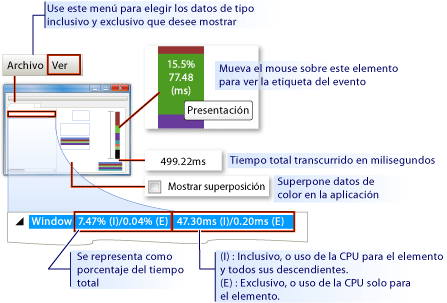
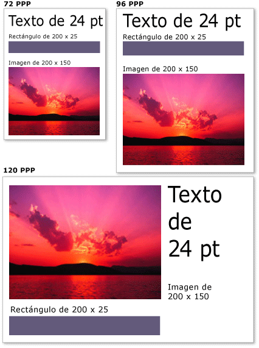

# Información general sobre la representación de gráficos en WPF
En este tema se ofrece información de la capa de objeto visual de [!INCLUDE[TLA2#tla_winclient](../../../../includes/tla2sharptla-winclient-md.md)]. Se centra en el <xref:System.Windows.Media.Visual> rol de la [!INCLUDE[TLA2#tla_winclient](../../../../includes/tla2sharptla-winclient-md.md)] clase para la compatibilidad de representación en el modelo.  

## Rol del objeto visual  
 La <xref:System.Windows.Media.Visual> clase es la abstracción <xref:System.Windows.FrameworkElement> básica de la que deriva cada objeto. También sirve como punto de entrada para escribir controles nuevos en [!INCLUDE[TLA2#tla_winclient](../../../../includes/tla2sharptla-winclient-md.md)], y en muchos sentidos se puede considerar el identificador de ventana (HWND) del modelo de aplicación de Win32.  
  
 El <xref:System.Windows.Media.Visual> objeto es [!INCLUDE[TLA2#tla_winclient](../../../../includes/tla2sharptla-winclient-md.md)] un objeto principal, cuyo rol principal es proporcionar compatibilidad con la representación. Los controles de <xref:System.Windows.Controls.Button> interfaz de usuario, como y <xref:System.Windows.Controls.TextBox>, derivan de la <xref:System.Windows.Media.Visual> clase y lo usan para conservar sus datos de representación. El <xref:System.Windows.Media.Visual> objeto proporciona compatibilidad con:  
  
- Presentación de salida: representación persistente, serializa el contenido de dibujo de un objeto visual.  
  
- Transformaciones: realizar transformaciones en un objeto visual.  
  
- Recorte: proporcionar soporte para una zona de recorte de un objeto visual.  
  
- Pruebas de posicionamiento: determinar si una coordenada o geometría está dentro de los límites de un objeto visual.  
  
- Cálculos de rectángulo de selección: determinar el rectángulo delimitador de un objeto visual.  
  
 Sin <xref:System.Windows.Media.Visual> embargo, el objeto no incluye compatibilidad con características que no son de representación, como:  
  
- Control de eventos  
  
- Diseño  
  
- Estilos  
  
- Enlace de datos  
  
- Globalización  
  
 <xref:System.Windows.Media.Visual>se expone como una clase abstracta pública de la que se deben derivar las clases secundarias. La siguiente ilustración muestra la jerarquía de los objetos visuales que se exponen en [!INCLUDE[TLA2#tla_winclient](../../../../includes/tla2sharptla-winclient-md.md)].  
  
 
  
### Clase DrawingVisual  
 Es <xref:System.Windows.Media.DrawingVisual> una clase de dibujo ligera que se utiliza para representar formas, imágenes o texto. Esta clase se considera ligera porque no proporciona control de diseño ni control de eventos, lo que mejora su rendimiento en tiempo de ejecución. Por esta razón, los dibujos son ideales para fondos e imágenes prediseñadas. Se <xref:System.Windows.Media.DrawingVisual> puede utilizar para crear un objeto visual personalizado. Para más información, consulte [Usar objetos DrawingVisual](using-drawingvisual-objects.md).  
  
### Clase Viewport3DVisual  
 El <xref:System.Windows.Media.Media3D.Viewport3DVisual> proporciona un puente <xref:System.Windows.Media.Visual> <xref:System.Windows.Media.Media3D.Visual3D> entre 2D y objetos. La <xref:System.Windows.Media.Media3D.Visual3D> clase es la clase base para todos los elementos visuales 3D. Requiere <xref:System.Windows.Media.Media3D.Viewport3DVisual> que defina un <xref:System.Windows.Media.Media3D.Viewport3DVisual.Camera%2A> valor <xref:System.Windows.Media.Media3D.Viewport3DVisual.Viewport%2A> y un valor. La cámara permite ver la escena. La ventanilla establece el lugar en que se asigna la proyección a la superficie 2D. Para obtener más información [!INCLUDE[TLA2#tla_winclient](../../../../includes/tla2sharptla-winclient-md.md)]sobre 3D en , consulte [Información general sobre gráficos 3D](3-d-graphics-overview.md).  
  
### Clase ContainerVisual  
 La <xref:System.Windows.Media.ContainerVisual> clase se utiliza como contenedor <xref:System.Windows.Media.Visual> para una colección de objetos. La <xref:System.Windows.Media.DrawingVisual> clase deriva <xref:System.Windows.Media.ContainerVisual> de la clase, lo que le permite contener una colección de objetos visuales.  
  
### Dibujo de contenido en objetos visuales  
 Un <xref:System.Windows.Media.Visual> objeto almacena sus datos de representación como una lista de instrucciones de **gráficos vectoriales.** Cada elemento de la lista de instrucciones representa un conjunto de bajo nivel de datos gráficos y recursos asociados en un formato serializado. Hay cuatro tipos diferentes de datos de representación que pueden incluir contenido de dibujo.  
  
|Tipo de contenido de dibujo|Descripción|  
|--------------------------|-----------------|  
|Gráficos vectoriales|Representa los datos de gráficos vectoriales y cualquier información <xref:System.Windows.Media.Brush> asociada. <xref:System.Windows.Media.Pen>|  
|Imagen|Representa una imagen dentro de <xref:System.Windows.Rect>una región definida por un archivo .|  
|Glifo|Representa un dibujo que <xref:System.Windows.Media.GlyphRun>representa un , que es una secuencia de glifos de un recurso de fuente especificado. Así es como se representa el texto.|  
|Vídeo|Representa un dibujo que representa vídeo.|  
  
 El <xref:System.Windows.Media.DrawingContext> le permite <xref:System.Windows.Media.Visual> rellenar a con contenido visual. Cuando se <xref:System.Windows.Media.DrawingContext> utilizan los comandos de dibujo de un objeto, en realidad se almacena un conjunto de datos de representación que el sistema de gráficos utilizará más adelante; no está dibujando a la pantalla en tiempo real.  
  
 Cuando se [!INCLUDE[TLA2#tla_winclient](../../../../includes/tla2sharptla-winclient-md.md)] crea un control, como un <xref:System.Windows.Controls.Button>, el control genera implícitamente datos de representación para dibujarse a sí mismo. Por ejemplo, <xref:System.Windows.Controls.ContentControl.Content%2A> establecer la <xref:System.Windows.Controls.Button> propiedad de la hace que el control para almacenar una representación de representación de un glifo.  
  
 A <xref:System.Windows.Media.Visual> describe su contenido como <xref:System.Windows.Media.Drawing> uno o <xref:System.Windows.Media.DrawingGroup>varios objetos contenidos en un archivo . A <xref:System.Windows.Media.DrawingGroup> también describe máscaras de opacidad, transformaciones, efectos de mapa de bits y otras operaciones que se aplican a su contenido. <xref:System.Windows.Media.DrawingGroup>las operaciones se aplican en el <xref:System.Windows.Media.DrawingGroup.OpacityMask%2A>siguiente <xref:System.Windows.Media.DrawingGroup.Opacity%2A> <xref:System.Windows.Media.DrawingGroup.BitmapEffect%2A>orden <xref:System.Windows.Media.DrawingGroup.ClipGeometry%2A>cuando se representa el contenido: , , , , <xref:System.Windows.Media.DrawingGroup.GuidelineSet%2A>, , y, a continuación, <xref:System.Windows.Media.DrawingGroup.Transform%2A>.  
  
 En la ilustración siguiente <xref:System.Windows.Media.DrawingGroup> se muestra el orden en el que se aplican las operaciones durante la secuencia de representación.  
  
   
Orden de las operaciones de DrawingGroup  
  
 Para más información, consulte [Información general sobre objetos Drawing](drawing-objects-overview.md).  
  
#### Contenido de dibujo en la capa de Visual  
 Nunca se <xref:System.Windows.Media.DrawingContext>crea una instancia directa de un ; sin embargo, puede adquirir un contexto de <xref:System.Windows.Media.DrawingGroup.Open%2A?displayProperty=nameWithType> <xref:System.Windows.Media.DrawingVisual.RenderOpen%2A?displayProperty=nameWithType>dibujo a partir de ciertos métodos, como y . En el ejemplo <xref:System.Windows.Media.DrawingContext> siguiente <xref:System.Windows.Media.DrawingVisual> se recupera a de a y se utiliza para dibujar un rectángulo.  
  
 [!code-csharp[drawingvisualsample#101](~/samples/snippets/csharp/VS_Snippets_Wpf/DrawingVisualSample/CSharp/Window1.xaml.cs#101)]
 [!code-vb[drawingvisualsample#101](~/samples/snippets/visualbasic/VS_Snippets_Wpf/DrawingVisualSample/visualbasic/window1.xaml.vb#101)]  
  
#### Enumeración de contenido de dibujo en la capa de Visual  
 Además de sus <xref:System.Windows.Media.Drawing> otros usos, los objetos también <xref:System.Windows.Media.Visual>proporcionan un modelo de objetos para enumerar el contenido de un archivo .  
  
> [!NOTE]
> Al enumerar el contenido del objeto visual, <xref:System.Windows.Media.Drawing> se recuperan objetos y no la representación subyacente de los datos de representación como una lista de instrucciones de gráficos vectoriales.  
  
 En el ejemplo <xref:System.Windows.Media.VisualTreeHelper.GetDrawing%2A> siguiente se <xref:System.Windows.Media.DrawingGroup> utiliza <xref:System.Windows.Media.Visual> el método para recuperar el valor de a y enumerarlo.  
  
 [!code-csharp[DrawingMiscSnippets_snip#GraphicsMMRetrieveDrawings](~/samples/snippets/csharp/VS_Snippets_Wpf/DrawingMiscSnippets_snip/CSharp/EnumerateDrawingsExample.xaml.cs#graphicsmmretrievedrawings)]  
  

## Uso de los objetos visuales para compilar controles  
 Muchos de los objetos de [!INCLUDE[TLA2#tla_winclient](../../../../includes/tla2sharptla-winclient-md.md)] están formados por otros objetos visuales, lo que significa que pueden contener diversas jerarquías de objetos descendientes. Muchos de los elementos de la interfaz de usuario de [!INCLUDE[TLA2#tla_winclient](../../../../includes/tla2sharptla-winclient-md.md)], como los controles, constan de varios objetos visuales, que representan diferentes tipos de representación de elementos. Por ejemplo, <xref:System.Windows.Controls.Button> el control puede contener otros <xref:Microsoft.Windows.Themes.ClassicBorderDecorator> <xref:System.Windows.Controls.ContentPresenter>objetos, incluidos , , y <xref:System.Windows.Controls.TextBlock>.  
  
 El código siguiente <xref:System.Windows.Controls.Button> muestra un control definido en el marcado.  
  
 [!code-xaml[VisualsOverview#VisualsOverviewSnippet1](~/samples/snippets/csharp/VS_Snippets_Wpf/VisualsOverview/CSharp/Window1.xaml#visualsoverviewsnippet1)]  
  
 Si enumerara los objetos visuales <xref:System.Windows.Controls.Button> que componen el control predeterminado, encontraría la jerarquía de objetos visuales que se ilustra a continuación:  
  
 
  
 El <xref:System.Windows.Controls.Button> control <xref:Microsoft.Windows.Themes.ClassicBorderDecorator> contiene un elemento, que <xref:System.Windows.Controls.ContentPresenter> a su vez, contiene un elemento. El <xref:Microsoft.Windows.Themes.ClassicBorderDecorator> elemento es responsable de dibujar un <xref:System.Windows.Controls.Button>borde y un fondo para el archivo . El <xref:System.Windows.Controls.ContentPresenter> elemento es responsable de <xref:System.Windows.Controls.Button>mostrar el contenido del archivo . En este caso, dado que <xref:System.Windows.Controls.ContentPresenter> se muestra <xref:System.Windows.Controls.TextBlock> texto, el elemento contiene un elemento. El hecho <xref:System.Windows.Controls.Button> de que <xref:System.Windows.Controls.ContentPresenter> el control utiliza un medio de que <xref:System.Windows.Controls.Image> el contenido podría ser <xref:System.Windows.Media.EllipseGeometry>representado por otros elementos, como una o una geometría, como un .  
  
### Plantillas de control  
 La clave para la expansión de un <xref:System.Windows.Controls.ControlTemplate>control en una jerarquía de controles es el archivo . Una plantilla de control especifica la jerarquía visual predeterminada de un control. Al hacer referencia explícitamente a un control, implícitamente también se hace referencia a su jerarquía visual. Puede reemplazar los valores predeterminados de una plantilla de control para crear una apariencia visual personalizada para un control. Por ejemplo, puede modificar el valor <xref:System.Windows.Controls.Button> de color de fondo del control para que utilice un valor de color de degradado lineal en lugar de un valor de color sólido. Para más información, consulte [Button ControlTemplate Example](../controls/button-styles-and-templates.md) (Ejemplo de ControlTemplate de Button).  
  
 Un elemento de interfaz <xref:System.Windows.Controls.Button> de usuario, como un control, contiene varias listas de instrucciones de gráficos vectoriales que describen toda la definición de representación de un control. El código siguiente <xref:System.Windows.Controls.Button> muestra un control definido en el marcado.  
  
 [!code-xaml[VisualsOverview#VisualsOverviewSnippet2](~/samples/snippets/csharp/VS_Snippets_Wpf/VisualsOverview/CSharp/Window1.xaml#visualsoverviewsnippet2)]  
  
 Si enumerara los objetos visuales y las <xref:System.Windows.Controls.Button> listas de instrucciones de gráficos vectoriales que componen el control, encontraría la jerarquía de objetos que se ilustra a continuación:  
  
   
  
 El <xref:System.Windows.Controls.Button> control <xref:Microsoft.Windows.Themes.ClassicBorderDecorator> contiene un elemento, que <xref:System.Windows.Controls.ContentPresenter> a su vez, contiene un elemento. El <xref:Microsoft.Windows.Themes.ClassicBorderDecorator> elemento es responsable de dibujar todos los elementos gráficos discretos que componen el borde y el fondo de un botón. El <xref:System.Windows.Controls.ContentPresenter> elemento es responsable de <xref:System.Windows.Controls.Button>mostrar el contenido del archivo . En este caso, dado que se <xref:System.Windows.Controls.ContentPresenter> muestra <xref:System.Windows.Controls.Image> una imagen, el elemento contiene un elemento.  
  
 Hay que tener en cuenta varios aspectos de la jerarquía de objetos visuales y las listas de instrucciones de gráficos vectoriales:  
  
- El orden de la jerarquía representa el orden de procesamiento de la información de dibujo. Desde el elemento del objeto visual raíz, se atraviesa a los elementos secundarios de izquierda a derecha y de arriba a abajo. Si un elemento tiene elementos visuales secundarios, se atraviesan antes que los relacionados del elemento.  
  
- Los elementos de nodo no hoja <xref:System.Windows.Controls.ContentPresenter>de la jerarquía, como , se utilizan para contener elementos secundarios: no contienen listas de instrucciones.  
  
- Si un elemento visual contiene una lista de instrucciones de gráficos vectoriales y elementos secundarios visuales, la lista de instrucciones del elemento visual primario se representa antes que los dibujos en cualquiera de los objetos visuales secundarios.  
  
- Los elementos de la lista de instrucciones de gráficos vectoriales se representan de izquierda a derecha.  
  

## Árbol visual  
 El árbol visual contiene todos los elementos visuales que se usan en la interfaz de usuario de una aplicación. Puesto que un elemento visual contiene información guardada del dibujo, el árbol visual se puede considerar un gráfico de la escena, que contiene toda la información de representación necesaria para componer la salida de la pantalla. Este árbol es la acumulación de todos los elementos visuales creados directamente por la aplicación, ya sea a través de código o de marcación. El árbol visual también contiene todos los elementos visuales que ha creado la expansión de la plantilla de elementos, como controles y objetos de datos.  
  
 El código siguiente <xref:System.Windows.Controls.StackPanel> muestra un elemento definido en el marcado.  
  
 [!code-xaml[VisualsOverview#VisualsOverviewSnippet3](~/samples/snippets/csharp/VS_Snippets_Wpf/VisualsOverview/CSharp/Window1.xaml#visualsoverviewsnippet3)]  
  
 Si enumerara los objetos visuales <xref:System.Windows.Controls.StackPanel> que componen el elemento en el ejemplo de marcado, encontraría la jerarquía de objetos visuales que se ilustra a continuación:  
  
   
  
### Orden de representación  
 El árbol visual determina el orden de representación de objetos visuales y de dibujo de [!INCLUDE[TLA2#tla_winclient](../../../../includes/tla2sharptla-winclient-md.md)]. El orden del recorrido comienza con el objeto visual raíz, que es el nodo de nivel superior del árbol visual. A continuación, se atraviesan los elementos secundarios del objeto visual raíz, de izquierda a derecha. Si un objeto visual tiene elementos secundarios, estos se atraviesan antes que los elementos del mismo nivel del objeto visual. Esto significa que el contenido de un objeto visual secundario se representa delante del contenido propio del objeto visual.  
  
 
  
### Objeto visual raíz  
 El **objeto visual raíz** es el elemento de nivel superior de una jerarquía de árbol visual. En la mayoría de las aplicaciones, <xref:System.Windows.Window> la <xref:System.Windows.Navigation.NavigationWindow>clase base del objeto visual raíz es o . Sin embargo, si se hospedaran objetos visuales en una aplicación Win32, el objeto visual raíz sería el objeto visual de nivel superior que se hospeda en la ventana de Win32. Para más información, consulte [Tutorial: Hosting Visual Objects in a Win32 Application](tutorial-hosting-visual-objects-in-a-win32-application.md) (Tutorial: hospedar objetos visuales en una aplicación Win32).  
  
### Relación con el árbol lógico  
 El árbol lógico de [!INCLUDE[TLA2#tla_winclient](../../../../includes/tla2sharptla-winclient-md.md)] representa los elementos de una aplicación en tiempo de ejecución. Aunque no manipula directamente este árbol, esta vista de la aplicación es útil para entender la herencia de propiedades y el enrutamiento de eventos. A diferencia del árbol visual, el árbol lógico puede <xref:System.Windows.Documents.ListItem>representar objetos de datos no visuales, como . En muchos casos, el árbol lógico se asigna muy estrechamente con las definiciones de marcación de una aplicación. El código siguiente <xref:System.Windows.Controls.DockPanel> muestra un elemento definido en el marcado.  
  
 [!code-xaml[VisualsOverview#VisualsOverviewSnippet5](~/samples/snippets/csharp/VS_Snippets_Wpf/VisualsOverview/CSharp/Window1.xaml#visualsoverviewsnippet5)]  
  
 Si enumerara los objetos lógicos <xref:System.Windows.Controls.DockPanel> que componen el elemento en el ejemplo de marcado, encontraría la jerarquía de objetos lógicos que se ilustra a continuación:  
  
   
Diagrama de árbol lógico  
  
 El árbol visual y el árbol lógico se sincronizan con el conjunto actual de elementos de la aplicación, que refleja cualquier adición, eliminación o modificación de elementos. Sin embargo, los árboles presentan distintas vistas de la aplicación. A diferencia del árbol visual, el árbol <xref:System.Windows.Controls.ContentPresenter> lógico no expande el elemento de un control. Esto significa que no hay una correspondencia uno a uno directa entre un árbol lógico y un árbol visual del mismo conjunto de objetos. De hecho, invocar el método del <xref:System.Windows.LogicalTreeHelper.GetChildren%2A> objeto **LogicalTreeHelper** y <xref:System.Windows.Media.VisualTreeHelper.GetChild%2A> el método del objeto **VisualTreeHelper** con el mismo elemento que un parámetro produce resultados diferentes.  
  
 Para obtener más información sobre el árbol lógico, consulte [Árboles en WPF](../advanced/trees-in-wpf.md).  
  
### Visualización del árbol visual con XamlPad  
 La [!INCLUDE[TLA2#tla_winclient](../../../../includes/tla2sharptla-winclient-md.md)] herramienta, XamlPad, proporciona una opción para ver y explorar el árbol visual que corresponde al contenido XAML definido actualmente. Haga clic en el botón **Show Visual Tree** (Mostrar árbol visual) de la barra de menús para mostrar el árbol visual. A continuación se muestra la expansión del contenido XAML en nodos de árbol visual en el panel Explorador de **árbol** visuales de XamlPad:  
  
   

 Observe cómo <xref:System.Windows.Controls.Label> <xref:System.Windows.Controls.TextBox>el <xref:System.Windows.Controls.Button> , , y los controles muestran cada uno una jerarquía de objetos visuales independiente en el panel Explorador de **árbol** visual es de XamlPad. Esto se [!INCLUDE[TLA2#tla_winclient](../../../../includes/tla2sharptla-winclient-md.md)] debe <xref:System.Windows.Controls.ControlTemplate> a que los controles tienen un que contiene el árbol visual de ese control. Al hacer referencia explícitamente a un control, implícitamente también se hace referencia a su jerarquía visual.  
  
### Generación de perfiles de rendimiento visual  
 [!INCLUDE[TLA2#tla_winclient](../../../../includes/tla2sharptla-winclient-md.md)] ofrece un conjunto de herramientas de generación de perfiles de rendimiento que le permiten analizar el comportamiento en tiempo de ejecución de la aplicación y determinar los tipos de optimizaciones de rendimiento que puede aplicar. La herramienta Generador de perfiles visuales proporciona una vista gráfica completa de los datos de rendimiento mediante la asignación al árbol visual de la aplicación. En esta captura de pantalla, la sección **Uso de CPU** del generador de perfiles visuales proporciona un desglose preciso del uso que un objeto realiza de los servicios de [!INCLUDE[TLA2#tla_winclient](../../../../includes/tla2sharptla-winclient-md.md)], como la representación y el diseño.  
  
   
Resultados del generador de perfiles visuales  
  

## Comportamiento de la representación visual  
 [!INCLUDE[TLA2#tla_winclient](../../../../includes/tla2sharptla-winclient-md.md)] presenta varias características que afectan al comportamiento de la representación de los objetos visuales: gráficos en modo retenido, gráficos vectoriales y gráficos independientes del dispositivo.  
  
### Gráficos en modo retenido  
 Una de las claves para conocer el rol del objeto visual es conocer la diferencia entre los sistemas de gráficos del **modo inmediato** y del **modo retenido**. Una aplicación Win32 estándar basada en GDI o GDI + utiliza un sistema de gráficos de modo inmediato. Esto significa que la aplicación es responsable de volver a dibujar la parte del área de cliente que se ha invalidado, debido a una acción, como el cambio de tamaño de una ventana o al cambio de la apariencia visual de un objeto.  
  
   
  
 En cambio, [!INCLUDE[TLA2#tla_winclient](../../../../includes/tla2sharptla-winclient-md.md)] utiliza un sistema de modo retenido. Esto significa que los objetos de la aplicación que tienen una apariencia visual definen un conjunto de datos de dibujo serializados. Una vez que se definen los datos de dibujo, el sistema es responsable de responder a todas las solicitudes de repetición del dibujo para representar los objetos de la aplicación. Incluso en tiempo de ejecución, puede modificar o crear objetos de la aplicación y seguir confiando en que el sistema responderá a las solicitudes de dibujo. La eficacia de un sistema de gráficos en modo retenido es que la aplicación guarda siempre la información de dibujo en un estado serializado, pero la responsabilidad de la representación se deja al sistema. El siguiente diagrama muestra la forma en que la aplicación usa [!INCLUDE[TLA2#tla_winclient](../../../../includes/tla2sharptla-winclient-md.md)] para responder a las solicitudes de dibujo.  
  
   

#### Volver a dibujar de forma inteligente  
 Una de las mayores ventajas de utilizar gráficos en modo retenido es que [!INCLUDE[TLA2#tla_winclient](../../../../includes/tla2sharptla-winclient-md.md)] puede optimizar eficazmente lo que hay que volver a dibujar en la aplicación. Aunque tenga una escena compleja con diferentes niveles de opacidad, por lo general no es preciso escribir código especial para optimizar el redibujado. Compárelo esto con la programación de Win32, en la que se puede dedicar mucho esfuerzo a optimizar la aplicación mediante la minimización de la cantidad de redibujado que se realiza en la región de actualización. Consulte [Redrawing in the Update Region](/windows/desktop/gdi/redrawing-in-the-update-region) (Redibujado en la región de actualización) para obtener un ejemplo del tipo de complejidad implicado en la optimización del redibujado en las aplicaciones de Win32.  
  
### Gráficos vectoriales  
 [!INCLUDE[TLA2#tla_winclient](../../../../includes/tla2sharptla-winclient-md.md)] usa **gráficos vectoriales** como formato de los datos de representación. Los gráficos vectoriales, que incluyen Scalable Vector Graphics (SVG), metarchivos de Windows (.wmf) y fuentes TrueType, almacenan datos de representación y los transmiten como una lista de instrucciones que describen cómo volver a crear una imagen mediante primitivas de gráficos. Por ejemplo, las fuentes TrueType son fuentes de esquema que describen un conjunto de líneas, curvas y comandos, en lugar de una matriz de píxeles. Una de las ventajas principales de los gráficos vectoriales es su capacidad para escalar a cualquier tamaño y resolución.  
  
 A diferencia de los gráficos vectoriales, los gráficos de mapa de bits almacenan los datos de representación como una representación píxel a píxel de una imagen, previamente representada para una resolución específica. Una de las principales diferencias entre los formatos de gráficos vectoriales y de mapa de bits es la fidelidad con la imagen original. Por ejemplo, cuando se modifica el tamaño de una imagen de origen, los sistemas de gráficos de mapa de bits ajustan la imagen, mientras que los sistemas de gráficos vectoriales la escalan, lo que mantiene su fidelidad.  
  
 La ilustración siguiente muestra una imagen de origen cuyo tamaño se ha cambiado en un 300 %. Observe las distorsiones que aparecen cuando la imagen de origen es un gráfico de mapa de bits y se ajusta, en lugar de escalarse como imagen de gráfico vectorial.  
  
   
  
 El marcado siguiente <xref:System.Windows.Shapes.Path> muestra dos elementos definidos. El segundo elemento <xref:System.Windows.Media.ScaleTransform> utiliza a para cambiar el tamaño de las instrucciones de dibujo del primer elemento en un 300%. Observe que las instrucciones <xref:System.Windows.Shapes.Path> de dibujo de los elementos permanecen sin cambios.  
  
 [!code-xaml[VectorGraphicsSnippets#VectorGraphicsSnippet1](~/samples/snippets/csharp/VS_Snippets_Wpf/VectorGraphicsSnippets/CS/PageOne.xaml#vectorgraphicssnippet1)]  
  
### Acerca de los gráficos independientes de la resolución y del dispositivo  
 Hay dos factores del sistema que determinan el tamaño tanto del texto como de los gráficos en la pantalla: la resolución y los puntos por pulgada. La resolución describe el número de píxeles que aparecen en la pantalla. A medida que aumenta la resolución, disminuye el tamaño de los píxeles, lo que provoca que tanto los gráficos como el texto parezcan menores. Un gráfico que se muestre en un monitor cuya resolución se haya configurado en 1024 x 768 píxeles parecerá mucho más pequeño cuando dicha resolución se cambie a 1600 x 1200.  
  
 La otra configuración del sistema, los puntos por pulgada (ppp), describe el tamaño de una pulgada de pantalla, en píxeles. La mayoría de los sistemas Windows tienen un DPI de 96, lo que significa que una pulgada de pantalla es de 96 píxeles. El aumento de la configuración de PPP aumenta el tamaño de la pulgada de la pantalla; mientras que su disminución lo reduce, lo que significa que una pulgada de la pantalla no es el mismo tamaño que una pulgada real; en la mayoría de los sistemas, es probable que no lo sea. A medida que se aumente el valor de PPP, tanto el texto como los gráficos con reconocimiento de PPP serán mayores, ya que se ha incrementado el tamaño de la pulgada de pantalla. El aumento del valor de PPP puede facilitar la lectura del texto, especialmente en resoluciones altas.  
  
 No todas las aplicaciones reconocen el PPP: algunas utilizan los píxeles de hardware como unidad de medida principal; por consiguiente, el cambio de los PPP del sistema no tiene ningún efecto en dichas aplicaciones. Muchas otras aplicaciones utilizan unidades con reconocimiento de PPP para describir los tamaños de fuente, pero usan píxeles para describir todo lo demás. Un valor de PPP es demasiado pequeño o demasiado grande puede provocar problemas de diseño en estas aplicaciones, ya que el texto de las aplicaciones se escala con la configuración de PPP del sistema, mientras que su interfaz de usuario no lo hace. Este problema se ha eliminado en las aplicaciones desarrolladas mediante [!INCLUDE[TLA2#tla_winclient](../../../../includes/tla2sharptla-winclient-md.md)].  
  
 [!INCLUDE[TLA2#tla_winclient](../../../../includes/tla2sharptla-winclient-md.md)] admite el escalado automático mediante el uso del píxel independiente del dispositivo como unidad de medida principal, en lugar de los píxeles de hardware; tanto el texto como los gráficos se escalan correctamente sin que el desarrollador de la aplicación tenga que realizar ningún trabajo adicional. La siguiente ilustración muestra un ejemplo de cómo aparecen tanto el texto como los gráficos de [!INCLUDE[TLA2#tla_winclient](../../../../includes/tla2sharptla-winclient-md.md)] con diferentes configuraciones de PPP.  
  
   
Gráficos y texto con diferentes configuraciones de PPP  
  

## Clase VisualTreeHelper  
 La <xref:System.Windows.Media.VisualTreeHelper> clase es una clase auxiliar estática que proporciona funcionalidad de bajo nivel para la programación en el nivel de objeto visual, lo que resulta útil en escenarios muy específicos, como el desarrollo de controles personalizados de alto rendimiento. En la mayoría de [!INCLUDE[TLA2#tla_winclient](../../../../includes/tla2sharptla-winclient-md.md)] los casos, <xref:System.Windows.Controls.Canvas> los <xref:System.Windows.Controls.TextBlock>objetos de marco de nivel superior, como y , ofrecen una mayor flexibilidad y facilidad de uso.  
  
### Pruebas de posicionamiento  
 La <xref:System.Windows.Media.VisualTreeHelper> clase proporciona métodos para la prueba de posicionación en objetos visuales cuando la compatibilidad de prueba de posicionación predeterminada no satisface sus necesidades. Puede utilizar <xref:System.Windows.Media.VisualTreeHelper.HitTest%2A> los métodos de la <xref:System.Windows.Media.VisualTreeHelper> clase para determinar si un valor de geometría o de coordenadas de punto está dentro del límite de un objeto determinado, como un control o un elemento gráfico. Por ejemplo, las pruebas de posicionamiento se pueden utilizar para determinar si un clic del mouse dentro del rectángulo delimitador de un objeto pertenece a la geometría de un círculo. También puede elegir invalidar la implementación predeterminada de las pruebas de posicionamiento para realizar sus propios cálculos de las pruebas de posicionamiento.  
  
 Para más información acerca de las pruebas de posicionamiento, consulte [Hit Testing in the Visual Layer](hit-testing-in-the-visual-layer.md) (Pruebas de posicionamiento en la capa visual).  
  
### Enumeración del árbol visual  
 La <xref:System.Windows.Media.VisualTreeHelper> clase proporciona funcionalidad para enumerar los miembros de un árbol visual. Para recuperar un elemento <xref:System.Windows.Media.VisualTreeHelper.GetParent%2A> primario, llame al método. Para recuperar un descendiente secundario, o directo, <xref:System.Windows.Media.VisualTreeHelper.GetChild%2A> de un objeto visual, llame al método. Este método devuelve <xref:System.Windows.Media.Visual> un elemento secundario del elemento primario en el índice especificado.  
  
 En el ejemplo siguiente se muestra cómo enumerar todos los descendientes de un objeto visual, que es una técnica que se puede utilizar si se desea serializar toda la información de representación de una jerarquía de objetos visuales.  
  
 [!code-csharp[VisualsOverview#101](~/samples/snippets/csharp/VS_Snippets_Wpf/VisualsOverview/CSharp/Window1.xaml.cs#101)]
 [!code-vb[VisualsOverview#101](~/samples/snippets/visualbasic/VS_Snippets_Wpf/VisualsOverview/visualbasic/window1.xaml.vb#101)]  
  
 En la mayoría de los casos, el árbol lógico es una representación más útil de los elementos de una aplicación de [!INCLUDE[TLA2#tla_winclient](../../../../includes/tla2sharptla-winclient-md.md)]. Aunque no se modifique directamente el árbol lógico, esta vista de la aplicación es útil para entender la herencia de propiedades y el enrutamiento de eventos. A diferencia del árbol visual, el árbol lógico puede <xref:System.Windows.Documents.ListItem>representar objetos de datos no visuales, como . Para obtener más información sobre el árbol lógico, consulte [Árboles en WPF](../advanced/trees-in-wpf.md).  
  
 La <xref:System.Windows.Media.VisualTreeHelper> clase proporciona métodos para devolver el rectángulo delimitador de objetos visuales. Puede devolver el rectángulo delimitador de un <xref:System.Windows.Media.VisualTreeHelper.GetContentBounds%2A>objeto visual llamando a . Puede devolver el rectángulo delimitador de todos los descendientes de un objeto <xref:System.Windows.Media.VisualTreeHelper.GetDescendantBounds%2A>visual, incluido el propio objeto visual, llamando a . El código siguiente muestra cómo se calcularía el rectángulo delimitador de un objeto visual y todos sus descendientes.  
  
 [!code-csharp[VisualsOverview#102](~/samples/snippets/csharp/VS_Snippets_Wpf/VisualsOverview/CSharp/Window1.xaml.cs#102)]
 [!code-vb[VisualsOverview#102](~/samples/snippets/visualbasic/VS_Snippets_Wpf/VisualsOverview/visualbasic/window1.xaml.vb#102)]  
  
## Consulte también

- <xref:System.Windows.Media.Visual>
- <xref:System.Windows.Media.VisualTreeHelper>
- <xref:System.Windows.Media.DrawingVisual>
- [Imágenes y gráficos 2D](../advanced/optimizing-performance-2d-graphics-and-imaging.md)
- [Realizar pruebas de posicionamiento en la capa visual](hit-testing-in-the-visual-layer.md)
- [Usar objetos DrawingVisual](using-drawingvisual-objects.md)
- [Tutorial: Hospedar objetos visuales en una aplicación Win32](tutorial-hosting-visual-objects-in-a-win32-application.md)
- [Optimizar WPF: Rendimiento de aplicaciones](../advanced/optimizing-wpf-application-performance.md)
