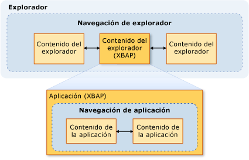
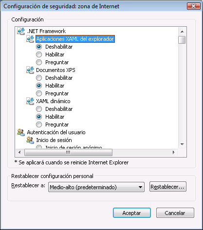

# Seguridad (WPF)
 Al desarrollar aplicaciones hospedadas en explorador y Windows Presentation Foundation (WPF) independiente, debe tener en cuenta el modelo de seguridad. [!INCLUDE[TLA2#tla_wpf](../../../includes/tla2sharptla-wpf-md.md)] las aplicaciones independientes que se ejecutan con permisos restringidos ( [!INCLUDE[TLA2#tla_cas](../../../includes/tla2sharptla-cas-md.md)] **FullTrust** conjunto de permisos), si se implementa mediante Windows Installer (.msi), como con XCopy o [!INCLUDE[TLA2#tla_clickonce](../../../includes/tla2sharptla-clickonce-md.md)]. No se admite la implementación de aplicaciones de WPF independientes y de confianza parcial con ClickOnce. Sin embargo, una aplicación host de plena confianza puede crear una confianza parcial <xref:System.AppDomain> mediante el modelo de complementos de .NET Framework. Para obtener más información, consulte [información general sobre complementos de WPF](./app-development/wpf-add-ins-overview.md).  
  
 [!INCLUDE[TLA2#tla_wpf](../../../includes/tla2sharptla-wpf-md.md)] aplicaciones hospedadas en explorador se hospedan en [!INCLUDE[TLA#tla_iegeneric](../../../includes/tlasharptla-iegeneric-md.md)] o Firefox, y puede ser [!INCLUDE[TLA#tla_xbap#plural](../../../includes/tlasharptla-xbapsharpplural-md.md)] o sueltos [!INCLUDE[TLA#tla_xaml](../../../includes/tlasharptla-xaml-md.md)] documentos para obtener más información, consulte [Introducción a las aplicaciones de explorador de XAML de WPF](./app-development/wpf-xaml-browser-applications-overview.md).  
  
 [!INCLUDE[TLA2#tla_wpf](../../../includes/tla2sharptla-wpf-md.md)] aplicaciones hospedadas en explorador se ejecutan dentro de un recinto de seguridad de confianza parcial, de forma predeterminada, que está limitado en el valor predeterminado [!INCLUDE[TLA2#tla_cas](../../../includes/tla2sharptla-cas-md.md)] **Internet** conjunto de permisos de zona. Esto aísla de forma eficaz [!INCLUDE[TLA2#tla_wpf](../../../includes/tla2sharptla-wpf-md.md)] aplicaciones hospedadas en explorador desde el equipo cliente de la misma manera que se esperaría para aislar las aplicaciones Web típicas. XBAP puede elevar los privilegios hasta Plena confianza en función de la zona de seguridad de la dirección URL de implementación y la configuración de seguridad del cliente. Para obtener más información, vea [Seguridad de confianza parcial de WPF](wpf-partial-trust-security.md).  
  
 En este tema se describe el modelo de seguridad para Windows Presentation Foundation (WPF) independiente y las aplicaciones hospedadas en explorador.  
  
 Este tema contiene las siguientes secciones:  
  
-   [Navegación segura](#SafeTopLevelNavigation)  
  
-   [Configuración de seguridad de software de exploración web](#InternetExplorerSecuritySettings)  
  
-   [Control WebBrowser y controles de características](#webbrowser_control_and_feature_controls)  
  
-   [Deshabilitar ensamblados APTCA para aplicaciones cliente de confianza parcial](#APTCA)  
  
-   [Comportamiento de espacio aislado para archivos XAML dinámicos](#LooseContentSandboxing)  
  
-   [Recursos para desarrollar aplicaciones de WPF que promueven la seguridad](#BestPractices)  
  
   
## Navegación segura  
 Para [!INCLUDE[TLA2#tla_xbap#plural](../../../includes/tla2sharptla-xbapsharpplural-md.md)], [!INCLUDE[TLA2#tla_wpf](../../../includes/tla2sharptla-wpf-md.md)] distingue entre dos tipos de navegación: aplicación y el explorador.  
  
 *Navegación de aplicación* es la navegación entre los elementos de contenido dentro de una aplicación hospedada en un explorador. *Navegación de explorador* es la navegación que cambia el contenido y la dirección URL del explorador. La relación entre la navegación de aplicación (normalmente XAML) y la navegación del explorador (normalmente HTML) se muestra en la ilustración siguiente:
  
   
  
 El tipo de contenido que se considera seguro para un [!INCLUDE[TLA2#tla_xbap](../../../includes/tla2sharptla-xbap-md.md)] navegar a se determina principalmente por si se utiliza la navegación de aplicación o de navegación del explorador.  
  
   
### Seguridad de navegación de aplicación  
 Navegación por la aplicación se considera segura si se puede identificarse con un módulo [!INCLUDE[TLA2#tla_uri](../../../includes/tla2sharptla-uri-md.md)], que admite cuatro tipos de contenido:  
  
|Tipo de contenido|Descripción|Ejemplo de URI|  
|------------------|-----------------|-----------------|  
|Recurso|Los archivos que se agregan a un proyecto con un tipo de compilación de **recursos**.|`pack://application:,,,/MyResourceFile.xaml`|  
|Contenido|Los archivos que se agregan a un proyecto con un tipo de compilación de **contenido**.|`pack://application:,,,/MyContentFile.xaml`|  
|Sitio de origen|Los archivos que se agregan a un proyecto con un tipo de compilación de **ninguno**.|`pack://siteoforigin:,,,/MySiteOfOriginFile.xaml`|  
|Código de aplicación|Recursos XAML que tienen un código compilado subyacente.   O bien   Archivos XAML que se agregan a un proyecto con un tipo de compilación de **página**.|`pack://application:,,,/MyResourceFile` `.xaml`|  
  
> [!NOTE]
>  Para obtener más información acerca de los archivos de datos de aplicación y el módulo [!INCLUDE[TLA2#tla_uri#plural](../../../includes/tla2sharptla-urisharpplural-md.md)], consulte [WPF Application Resource, contenido y los archivos de datos](./app-development/wpf-application-resource-content-and-data-files.md).  
  
 El usuario puede navegar por los archivos de estos tipos de contenido, aunque también se pueden navegar mediante programación:  
  
-   **Navegación de usuario**. El usuario navega haciendo clic en un <xref:System.Windows.Documents.Hyperlink> elemento.  
  
-   **Navegación mediante programación**. La aplicación navega sin involucrar al usuario, por ejemplo, estableciendo el <xref:System.Windows.Navigation.NavigationWindow.Source%2A?displayProperty=nameWithType> propiedad.  
  
   
### Seguridad de navegación de explorador  
 La navegación de explorador se considera segura solo en las siguientes condiciones:  
  
-   **Navegación de usuario**. El usuario navega haciendo clic en un <xref:System.Windows.Documents.Hyperlink> elemento que está dentro de los principales <xref:System.Windows.Navigation.NavigationWindow>, no en un anidada <xref:System.Windows.Controls.Frame>.  
  
-   **Zona**. El contenido al que se navega se encuentra en Internet o en la intranet local.  
  
-   **Protocolo**. El protocolo utilizado es **http**, **https**, **archivo**, o **mailto**.  
  
 Si un [!INCLUDE[TLA2#tla_xbap](../../../includes/tla2sharptla-xbap-md.md)] intenta navegar a contenido de un modo que no cumpla estas condiciones, un <xref:System.Security.SecurityException> se produce.  
  
   
## Configuración de seguridad de software de exploración web  
 La configuración de seguridad en el equipo determina el acceso que se concede a cualquier software de navegación web. Software de exploración Web incluye cualquier aplicación o componente que utiliza el [WinINet](https://go.microsoft.com/fwlink/?LinkId=179379) o [UrlMon](https://go.microsoft.com/fwlink/?LinkId=179383) API, como Internet Explorer y PresentationHost.exe.  
  
 [!INCLUDE[TLA2#tla_iegeneric](../../../includes/tla2sharptla-iegeneric-md.md)] Proporciona un mecanismo por el que puede configurar la funcionalidad que se puede ejecutar en o desde [!INCLUDE[TLA2#tla_iegeneric](../../../includes/tla2sharptla-iegeneric-md.md)], incluido lo siguiente:  
  
-   Componentes que dependen de framework .NET  
  
-   Controles y complementos de ActiveX  
  
-   Descargas  
  
-   Scripting  
  
-   Autenticación de usuario  
  
 La colección de funciones que se pueden proteger de este modo se configura en una base por zona para el **Internet**, **Intranet**, **sitios de confianza**, y  **Sitios restringidos** zonas. En los siguientes pasos se describe cómo establecer la configuración de seguridad:  
  
1.  Abra **Panel de Control**.  
  
2.  Haga clic en **red e Internet** y, a continuación, haga clic en **opciones de Internet**.  
  
     Aparecerá el cuadro de diálogo Opciones de Internet.  
  
3.  En el **seguridad** pestaña, seleccione la zona para configurar la configuración de seguridad.  
  
4.  Haga clic en el **nivel personalizado** botón.  
  
     El **configuración de seguridad** aparece el cuadro de diálogo y se puede configurar la configuración de seguridad para la zona seleccionada.  
  
       
  
> [!NOTE]
>  También puede abrir el cuadro de diálogo Opciones de Internet desde Internet Explorer. Haga clic en **herramientas** y, a continuación, haga clic en **opciones de Internet**.  
  
 A partir de [!INCLUDE[TLA#tla_ie7](../../../includes/tlasharptla-ie7-md.md)], la siguiente configuración de seguridad específicamente para .NET Framework se incluyen:  
  
-   **XAML dinámico**. Controles si [!INCLUDE[TLA2#tla_iegeneric](../../../includes/tla2sharptla-iegeneric-md.md)] puede navegar a y se pierden [!INCLUDE[TLA2#tla_xaml](../../../includes/tla2sharptla-xaml-md.md)] archivos. (Opciones Habilitar, Deshabilitar y Preguntar).  
  
-   **Aplicaciones de explorador XAML**. Controles si [!INCLUDE[TLA2#tla_iegeneric](../../../includes/tla2sharptla-iegeneric-md.md)] puede navegar a y ejecute [!INCLUDE[TLA2#tla_xbap#plural](../../../includes/tla2sharptla-xbapsharpplural-md.md)]. (Opciones Habilitar, Deshabilitar y Preguntar).  
  
 De forma predeterminada, esta configuración está habilitada para el **Internet**, **intranet Local**, y **sitios de confianza** zonas y deshabilitado para el **sitios restringidos**  zona.  
  
   
### Configuración del Registro de WPF relacionada con la seguridad  
 Además de la configuración de seguridad disponible mediante Opciones de Internet, los valores del Registro siguientes están disponibles para bloquear selectivamente varias características de WPF de seguridad. Los valores se definen con la siguiente clave:  
  
 `HKEY_LOCAL_MACHINE\SOFTWARE\Microsoft\.NETFramework\Windows Presentation Foundation\Features`  
  
 En la tabla siguiente se muestran los valores que se pueden establecer.  
  
|Nombre del valor|Tipo de valor|Datos del valor|  
|----------------|----------------|----------------|  
|XBAPDisallow|REG_DWORD|1 para no permitir; 0 para permitir.|  
|LooseXamlDisallow|REG_DWORD|1 para no permitir; 0 para permitir.|  
|WebBrowserDisallow|REG_DWORD|1 para no permitir; 0 para permitir.|  
|MediaAudioDisallow|REG_DWORD|1 para no permitir; 0 para permitir.|  
|MediaImageDisallow|REG_DWORD|1 para no permitir; 0 para permitir.|  
|MediaVideoDisallow|REG_DWORD|1 para no permitir; 0 para permitir.|  
|ScriptInteropDisallow|REG_DWORD|1 para no permitir; 0 para permitir.|  
  
   
## Control WebBrowser y controles de características  
 WPF <xref:System.Windows.Controls.WebBrowser> control puede usarse para hospedar contenido Web. WPF <xref:System.Windows.Controls.WebBrowser> control encapsula el control WebBrowser ActiveX subyacente. WPF proporciona compatibilidad para proteger la aplicación cuando se usa WPF <xref:System.Windows.Controls.WebBrowser> control para hospedar contenido Web no es de confianza. Sin embargo, deben aplicar algunas características de seguridad directamente en las aplicaciones que usan el <xref:System.Windows.Controls.WebBrowser> control. Para obtener más información sobre el control WebBrowser ActiveX, consulte [información general de Control WebBrowser y tutoriales](https://go.microsoft.com/fwlink/?LinkId=179388).  
  
> [!NOTE]
>  En esta sección también se aplica a la <xref:System.Windows.Controls.Frame> controlar, ya que utiliza el <xref:System.Windows.Controls.WebBrowser> para navegar a contenido HTML.  
  
 Si el WPF <xref:System.Windows.Controls.WebBrowser> control se usa para hospedar contenido Web que no se confía, la aplicación debe usar una confianza parcial <xref:System.AppDomain> para ayudar a aislar el código de aplicación desde el código de script HTML potencialmente malintencionado. Esto es especialmente cierto si la aplicación está interactuando con el script hospedado mediante el uso de la <xref:System.Windows.Controls.WebBrowser.InvokeScript%2A> método y el <xref:System.Windows.Controls.WebBrowser.ObjectForScripting%2A> propiedad. Para obtener más información, consulte [información general sobre complementos de WPF](./app-development/wpf-add-ins-overview.md).  
  
 Si la aplicación usa WPF <xref:System.Windows.Controls.WebBrowser> control, otra manera de aumentar la seguridad y mitigar los ataques es habilitar controles de característica de Internet Explorer. Controles de característica son adiciones a Internet Explorer que permiten a los administradores y programadores configurar las características de Internet Explorer y las aplicaciones que hospedan el control WebBrowser ActiveX, que WPF <xref:System.Windows.Controls.WebBrowser> controlar el ajusta. Controles de característica se pueden configurar mediante el [CoInternetSetFeatureEnabled](https://go.microsoft.com/fwlink/?LinkId=179394) función o cambiando los valores del registro. Para obtener más información acerca de los controles de característica, consulte [Introducción a los controles de característica](https://go.microsoft.com/fwlink/?LinkId=179390) y [controles de característica de Internet](https://go.microsoft.com/fwlink/?LinkId=179392).  
  
 Si está desarrollando una aplicación de WPF independiente que usa WPF <xref:System.Windows.Controls.WebBrowser> (control), WPF habilita automáticamente los siguientes controles de característica para la aplicación.  
  
|Control de característica|  
|---------------------|  
|FEATURE_MIME_HANDLING|  
|FEATURE_MIME_SNIFFING|  
|FEATURE_OBJECT_CACHING|  
|FEATURE_SAFE_BINDTOOBJECT|  
|FEATURE_WINDOW_RESTRICTIONS|  
|FEATURE_ZONE_ELEVATION|  
|FEATURE_RESTRICT_FILEDOWNLOAD|  
|FEATURE_RESTRICT_ACTIVEXINSTALL|  
|FEATURE_ADDON_MANAGEMENT|  
|FEATURE_HTTP_USERNAME_PASSWORD_DISABLE|  
|FEATURE_SECURITYBAND|  
|FEATURE_UNC_SAVEDFILECHECK|  
|FEATURE_VALIDATE_NAVIGATE_URL|  
|FEATURE_DISABLE_TELNET_PROTOCOL|  
|FEATURE_WEBOC_POPUPMANAGEMENT|  
|FEATURE_DISABLE_LEGACY_COMPRESSION|  
|FEATURE_SSLUX|  
  
 Puesto que estos controles de característica están habilitados incondicionalmente, podrían afectar a una aplicación de plena confianza. En este caso, si no hay ningún riesgo de seguridad para la aplicación específica y el contenido que se hospeda, se puede deshabilitar el control de característica correspondiente.  
  
 El proceso de crear instancias del objeto WebBrowser ActiveX aplica los controles de característica. Por lo tanto, si está creando una aplicación independiente que puede navegar a contenido que no es de confianza, debe considerar seriamente la posibilidad de habilitar controles de característica adicionales.  
  
> [!NOTE]
>  Esta recomendación se basa en las recomendaciones generales para la seguridad de host MSHTML y SHDOCVW. Para obtener más información, consulte [la p+f acerca de seguridad de Host MSHTML: Parte I de II](https://go.microsoft.com/fwlink/?LinkId=179396) y [la preguntas más frecuentes sobre la seguridad de Host MSHTML: Parte II de II](https://go.microsoft.com/fwlink/?LinkId=179415).  
  
 Para el archivo ejecutable, considere la posibilidad de habilitar los siguientes controles de característica. Para ello, establezca el valor del Registro en 1.  
  
|Control de característica|  
|---------------------|  
|FEATURE_ACTIVEX_REPURPOSEDETECTION|  
|FEATURE_BLOCK_LMZ_IMG|  
|FEATURE_BLOCK_LMZ_OBJECT|  
|FEATURE_BLOCK_LMZ_SCRIPT|  
|FEATURE_RESTRICT_RES_TO_LMZ|  
|FEATURE_RESTRICT_ABOUT_PROTOCOL_IE7|  
|FEATURE_SHOW_APP_PROTOCOL_WARN_DIALOG|  
|FEATURE_LOCALMACHINE_LOCKDOWN|  
|FEATURE_FORCE_ADDR_AND_STATUS|  
|FEATURE_RESTRICTED_ZONE_WHEN_FILE_NOT_FOUND|  
  
 Para el archivo ejecutable, considere la posibilidad de deshabilitar el siguiente control de característica. Para ello, establezca el valor del Registro en 0.  
  
|Control de característica|  
|---------------------|  
|FEATURE_ENABLE_SCRIPT_PASTE_URLACTION_IF_PROMPT|  
  
 Si ejecuta una confianza parcial [!INCLUDE[TLA#tla_xbap](../../../includes/tlasharptla-xbap-md.md)] que incluye un WPF <xref:System.Windows.Controls.WebBrowser> en controlar [!INCLUDE[TLA#tla_iegeneric](../../../includes/tlasharptla-iegeneric-md.md)], WPF hospeda el control WebBrowser ActiveX en el espacio de direcciones del proceso de Internet Explorer. Puesto que el control WebBrowser ActiveX se hospeda en el [!INCLUDE[TLA2#tla_iegeneric](../../../includes/tla2sharptla-iegeneric-md.md)] procesos, todos los controles de característica para Internet Explorer también están habilitados para el control WebBrowser ActiveX.  
  
 Los objetos XBAP que se ejecutan en Internet Explorer también obtienen un nivel adicional de seguridad en comparación con las aplicaciones independientes normales. Esta seguridad adicional es porque Internet Explorer y, por lo tanto, el control WebBrowser ActiveX, se ejecuta en protegido de forma predeterminada en el modo [!INCLUDE[TLA#tla_winvista](../../../includes/tlasharptla-winvista-md.md)] y [!INCLUDE[win7](../../../includes/win7-md.md)]. Para obtener más información sobre el modo protegido, consulte [entender y trabajar en modo protegido, Internet Explorer](https://go.microsoft.com/fwlink/?LinkId=179393).  
  
> [!NOTE]
>  Si intenta ejecutar un XBAP que incluye un WPF <xref:System.Windows.Controls.WebBrowser> control en Firefox, mientras que en la zona de Internet, un <xref:System.Security.SecurityException> se iniciará. Esto se debe a la directiva de seguridad de WPF.  
  
   
## Deshabilitar ensamblados APTCA para aplicaciones cliente de confianza parcial  
 Cuando se instalan ensamblados administrados en el [!INCLUDE[TLA#tla_gac](../../../includes/tlasharptla-gac-md.md)], que se conviertan en plena confianza porque el usuario debe proporcionar permiso explícito para instalarlos. Dado que son de plena confianza, solo las aplicaciones cliente administradas de plena confianza pueden usarlos. Para permitir que las aplicaciones de confianza parcial usarlas, debe marcarse con el <xref:System.Security.AllowPartiallyTrustedCallersAttribute> (APTCA). Solo los ensamblados probados como seguros para la ejecución en confianza parcial se deben marcar con este atributo.  
  
 Sin embargo, es posible que un ensamblado APTCA muestre un error de seguridad después de instalarlo en el [!INCLUDE[TLA2#tla_gac](../../../includes/tla2sharptla-gac-md.md)]. Cuando se detecta un error de seguridad, los publicadores de ensamblados pueden producir una actualización de seguridad para corregir el problema en las instalaciones existentes y proteger las instalaciones que se produzcan después de detectar el problema. Una opción para la actualización es desinstalar el ensamblado, aunque eso podría causar que otras aplicaciones cliente de plena confianza que usan el ensamblado dejen de funcionar correctamente.  
  
 [!INCLUDE[TLA2#tla_wpf](../../../includes/tla2sharptla-wpf-md.md)] Proporciona un mecanismo por el que se puede deshabilitar un ensamblado APTCA para confianza parcial [!INCLUDE[TLA2#tla_xbap#plural](../../../includes/tla2sharptla-xbapsharpplural-md.md)] sin desinstalar el ensamblado APTCA.  
  
 Para deshabilitar un ensamblado APTCA, tiene que crear una clave del Registro especial:  
  
 `HKEY_LOCAL_MACHINE\SOFTWARE\Microsoft\.NETFramework\policy\APTCA\<AssemblyFullName>, FileVersion=<AssemblyFileVersion>`  
  
 Se muestra un ejemplo a continuación:  
  
 `HKEY_LOCAL_MACHINE\SOFTWARE\Microsoft\.NETFramework\policy\APTCA\aptcagac, Version=1.0.0.0, Culture=neutral, PublicKeyToken=215e3ac809a0fea7, FileVersion=1.0.0.0`  
  
 Esta clave establece una entrada para el ensamblado APTCA. También debe crear un valor en esta clave que habilite o deshabilite el ensamblado. Los siguientes son los detalles del valor:  
  
-   Nombre del valor: **APTCA_FLAG**.  
  
-   Tipo de valor: **REG_DWORD**.  
  
-   Datos del valor: **1** para deshabilitar; **0** a habilitar.  
  
 Si un ensamblado se debe deshabilitar para las aplicaciones cliente de confianza parcial, puede escribir una actualización que cree la clave y el valor del Registro.  
  
> [!NOTE]
>  No afecta a los ensamblados de .NET Framework Core mediante la deshabilitación de esta manera porque son necesarios para ejecutar aplicaciones administradas. La compatibilidad para deshabilitar ensamblados APTCA está destinada principalmente a aplicaciones de terceros.  
  
   
## Comportamiento de espacio aislado para archivos XAML dinámicos  
 Flexible [!INCLUDE[TLA2#tla_xaml](../../../includes/tla2sharptla-xaml-md.md)] archivos son archivos XAML solo de marcado que no dependen de ningún código subyacente, controlador de eventos o ensamblado específico de la aplicación. Cuando se pierden [!INCLUDE[TLA2#tla_xaml](../../../includes/tla2sharptla-xaml-md.md)] navegar a archivos directamente desde el explorador, se cargan en un recinto de seguridad basado en el conjunto de permisos de zona de Internet predeterminado.  
  
 Sin embargo, el comportamiento de seguridad es diferente cuando [!INCLUDE[TLA2#tla_xaml](../../../includes/tla2sharptla-xaml-md.md)] navegar a archivos desde un <xref:System.Windows.Navigation.NavigationWindow> o <xref:System.Windows.Controls.Frame> en una aplicación independiente.  
  
 En ambos casos, el flexible [!INCLUDE[TLA2#tla_xaml](../../../includes/tla2sharptla-xaml-md.md)] archivo que se navega hereda los permisos de su aplicación host. Sin embargo, este comportamiento puede no ser deseable desde una perspectiva de seguridad, en especial si [!INCLUDE[TLA2#tla_xaml](../../../includes/tla2sharptla-xaml-md.md)] archivo se generó mediante una entidad que sea de no confianza o desconocido. Este tipo de contenido se conoce como *contenido externo*y ambos <xref:System.Windows.Controls.Frame> y <xref:System.Windows.Navigation.NavigationWindow> se pueden configurar para aislarlo cuando se navega. Aislamiento se consigue estableciendo la **SandboxExternalContent** la propiedad en true, tal como se muestra en los ejemplos siguientes para <xref:System.Windows.Controls.Frame> y <xref:System.Windows.Navigation.NavigationWindow>:  
  
 [!code-xaml[SecurityOverviewSnippets#FrameMARKUP](~/samples/snippets/csharp/VS_Snippets_Wpf/SecurityOverviewSnippets/CS/Window2.xaml#framemarkup)]  
  
 [!code-xaml[SecurityOverviewSnippets#NavigationWindowMARKUP](~/samples/snippets/csharp/VS_Snippets_Wpf/SecurityOverviewSnippets/CS/Window1.xaml#navigationwindowmarkup)]  
  
 Con esta configuración, el contenido externo se carga en un proceso independiente del proceso que hospeda la aplicación. Este proceso está restringido al conjunto de permisos predeterminado de la zona de Internet y lo aísla de forma eficaz desde la aplicación host y el equipo cliente.  
  
> [!NOTE]
>  Aunque navegación perder [!INCLUDE[TLA2#tla_xaml](../../../includes/tla2sharptla-xaml-md.md)] archivos desde un <xref:System.Windows.Navigation.NavigationWindow> o <xref:System.Windows.Controls.Frame> en una independiente se implementa la aplicación basándose en el explorador WPF hospeda la infraestructura, que implica el proceso PresentationHost, es el nivel de seguridad ligeramente menor que cuando se carga el contenido directamente en Internet Explorer en [!INCLUDE[wiprlhext](../../../includes/wiprlhext-md.md)] y [!INCLUDE[win7](../../../includes/win7-md.md)] (que todavía sería mediante PresentationHost). Esto se debe a que una aplicación de WPF independiente que usa un navegador web no proporciona la característica de seguridad adicional de modo protegido de Internet Explorer.  
  
   
## Recursos para desarrollar aplicaciones de WPF que promueven la seguridad  
 Los siguientes son algunos recursos adicionales para ayudar a desarrollar [!INCLUDE[TLA2#tla_wpf](../../../includes/tla2sharptla-wpf-md.md)] las aplicaciones que promueven la seguridad:  
  
|Área|Recurso|  
|----------|--------------|  
|Código administrado|[Modelos y prácticas Guía de seguridad para aplicaciones](https://go.microsoft.com/fwlink/?LinkId=117426)|  
|[!INCLUDE[TLA2#tla_cas](../../../includes/tla2sharptla-cas-md.md)]|[Seguridad de acceso del código](../misc/code-access-security.md)|  
|[!INCLUDE[TLA2#tla_clickonce](../../../includes/tla2sharptla-clickonce-md.md)]|[Seguridad e implementación ClickOnce](/visualstudio/deployment/clickonce-security-and-deployment)|  
|[!INCLUDE[TLA2#tla_wpf](../../../includes/tla2sharptla-wpf-md.md)]|[Seguridad de confianza parcial de WPF](wpf-partial-trust-security.md)|  
  
## Vea también
- [Seguridad de confianza parcial de WPF](wpf-partial-trust-security.md)
- [Estrategia de seguridad de WPF: Seguridad de plataforma](wpf-security-strategy-platform-security.md)
- [Estrategia de seguridad de WPF: Ingeniería de seguridad](wpf-security-strategy-security-engineering.md)
- [Modelos y prácticas Guía de seguridad para aplicaciones](https://go.microsoft.com/fwlink/?LinkId=117426)
- [Seguridad de acceso del código](../misc/code-access-security.md)
- [Seguridad e implementación ClickOnce](/visualstudio/deployment/clickonce-security-and-deployment)
- [Información general sobre XAML (WPF)](./advanced/xaml-overview-wpf.md)
