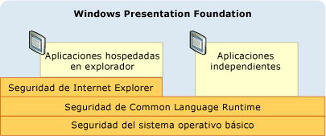
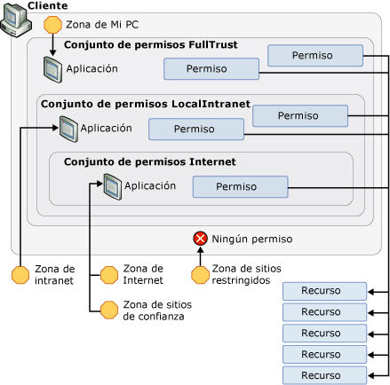

# Estrategia de seguridad de WPF: Seguridad de plataformaWPF Security Strategy - Platform Security
Aunque Windows Presentation Foundation (WPF) ofrece una variedad de servicios de seguridad, también aprovecha las características de seguridad de la plataforma subyacente, que incluye el sistema operativo, el [!INCLUDE[TLA2#tla_clr](../../../includes/tla2sharptla-clr-md.md)], y [!INCLUDE[TLA2#tla_ie](../../../includes/tla2sharptla-ie-md.md)].While Windows Presentation Foundation (WPF) provides a variety of security services, it also leverages the security features of the underlying platform, which includes the operating system, the [!INCLUDE[TLA2#tla_clr](../../../includes/tla2sharptla-clr-md.md)], and [!INCLUDE[TLA2#tla_ie](../../../includes/tla2sharptla-ie-md.md)]. Estas capas se combinan para proporcionar a [!INCLUDE[TLA2#tla_wpf](../../../includes/tla2sharptla-wpf-md.md)] un modelo de seguridad sólido y profundo que intenta evitar todos los puntos flacos, como se muestra en la ilustración siguiente:These layers combine to provide [!INCLUDE[TLA2#tla_wpf](../../../includes/tla2sharptla-wpf-md.md)] a strong, defense-in-depth security model that attempts to avoid any single point of failure, as shown in the following figure:  
  
   
  
 En el resto de este tema se describen las características de cada una de estas capas que pertenecen específicamente a [!INCLUDE[TLA2#tla_wpf](../../../includes/tla2sharptla-wpf-md.md)].The remainder of this topic discusses the features in each of these layers that pertain to [!INCLUDE[TLA2#tla_wpf](../../../includes/tla2sharptla-wpf-md.md)] specifically.  
  

  
   
## Seguridad del sistema operativoOperating System Security  
 El nivel mínimo de sistema operativo requerido por [!INCLUDE[TLA2#tla_wpf](../../../includes/tla2sharptla-wpf-md.md)] es [!INCLUDE[TLA2#tla_winxpsp2](../../../includes/tla2sharptla-winxpsp2-md.md)].The minimum level of operating system that is required by [!INCLUDE[TLA2#tla_wpf](../../../includes/tla2sharptla-wpf-md.md)] is [!INCLUDE[TLA2#tla_winxpsp2](../../../includes/tla2sharptla-winxpsp2-md.md)]. El núcleo de [!INCLUDE[TLA2#tla_winxpsp2](../../../includes/tla2sharptla-winxpsp2-md.md)] proporciona varias características de seguridad que forman la base de seguridad para todas las aplicaciones de Windows, incluidas aquellas creadas con [!INCLUDE[TLA2#tla_wpf](../../../includes/tla2sharptla-wpf-md.md)].The core of [!INCLUDE[TLA2#tla_winxpsp2](../../../includes/tla2sharptla-winxpsp2-md.md)] provides several security features that form the security foundation for all Windows applications, including those built with [!INCLUDE[TLA2#tla_wpf](../../../includes/tla2sharptla-wpf-md.md)]. [!INCLUDE[TLA#tla_longhorn](../../../includes/tlasharptla-longhorn-md.md)] incorpora las características de seguridad de [!INCLUDE[TLA2#tla_wpf](../../../includes/tla2sharptla-wpf-md.md)] y las amplía.incorporates the security features of [!INCLUDE[TLA2#tla_wpf](../../../includes/tla2sharptla-wpf-md.md)] and extends them further. En este tema se aborda el alcance de estas características de seguridad que son importantes para [!INCLUDE[TLA2#tla_wpf](../../../includes/tla2sharptla-wpf-md.md)], así como la integración de [!INCLUDE[TLA2#tla_wpf](../../../includes/tla2sharptla-wpf-md.md)] con ellas para ofrecer una mayor defensa en profundidad.This topic discusses the breadth of these security features that are important to [!INCLUDE[TLA2#tla_wpf](../../../includes/tla2sharptla-wpf-md.md)], as well as how [!INCLUDE[TLA2#tla_wpf](../../../includes/tla2sharptla-wpf-md.md)] integrates with them to provide further defense-in-depth.  
  
   
### Microsoft Windows XP Service Pack 2 (SP2)Microsoft Windows XP Service Pack 2 (SP2)  
 Además de una revisión general y refuerzo de Windows, hay tres características clave de [!INCLUDE[TLA2#tla_winxpsp2](../../../includes/tla2sharptla-winxpsp2-md.md)] que trataremos en este tema:In addition to a general review and strengthening of Windows, there are three key features from [!INCLUDE[TLA2#tla_winxpsp2](../../../includes/tla2sharptla-winxpsp2-md.md)] that we will discuss in this topic:  
  
-   Compilación /GS/GS compilation  
  
-   [!INCLUDE[TLA#tla_win_update](../../../includes/tlasharptla-win-update-md.md)]..  
  
#### Compilación /GS/GS Compilation  
 [!INCLUDE[TLA2#tla_winxpsp2](../../../includes/tla2sharptla-winxpsp2-md.md)] proporciona protección mediante la recopilación de muchas bibliotecas de sistema principales, incluidas todas las dependencias de [!INCLUDE[TLA2#tla_wpf](../../../includes/tla2sharptla-wpf-md.md)] como el [!INCLUDE[TLA2#tla_clr](../../../includes/tla2sharptla-clr-md.md)], para ayudar a mitigar las saturaciones del búfer.provides protection by recompiling many core system libraries, including all of the [!INCLUDE[TLA2#tla_wpf](../../../includes/tla2sharptla-wpf-md.md)] dependencies such as the [!INCLUDE[TLA2#tla_clr](../../../includes/tla2sharptla-clr-md.md)], to help mitigate buffer overruns. Esto se logra usando el parámetro /GS con el compilador de línea de comandos de C o C++.This is achieved by using the /GS parameter with the C/C++ command-line compiler. Aunque las saturaciones del búfer se deben evitar de manera explícita, la compilación /GS proporciona un ejemplo de una defensa en profundidad contra posibles vulnerabilidades creadas por dichas saturaciones de forma accidental o malintencionada.Although buffer overruns should be explicitly avoided, /GS compilation provides an example of a defense-in-depth against potential vulnerabilities that are inadvertently or maliciously created by them.  
  
 Históricamente, las saturaciones del búfer han sido la causa de muchas vulnerabilidades de seguridad de gran impacto.Historically, buffer overruns have been the cause of many high-impact security exploits. Una saturación del búfer se produce cuando un atacante aprovecha una vulnerabilidad de código que permite la inserción de código malintencionado que escribe más allá de los límites de un búfer.A buffer overrun occurs when an attacker takes advantage of a code vulnerability that allows the injection of malicious code that writes past the boundaries of a buffer. Esto permite a un atacante secuestrar el proceso en el que se ejecuta el código; para ello, se sobrescribe la dirección de retorno de una función para que se ejecute el código del atacante.This then allows an attacker to hijack the process in which the code is executing by overwriting the return address of a function to cause the execution of the attacker's code. El resultado es un código malintencionado que ejecuta código arbitrario con los mismos privilegios que el proceso atacado.The result is malicious code that executes arbitrary code with the same privileges as the hijacked process.  
  
 En un nivel alto, la marca del compilador /GS protege contra algunas saturaciones del búfer potenciales mediante la inserción de una cookie de seguridad especial que protege la dirección de retorno de una función que tiene búferes de cadena locales.At a high level, the /GS compiler flag protects against some potential buffer overruns by injecting a special security cookie to protect the return address of a function that has local string buffers. Una vez que se devuelve una función, la cookie de seguridad se compara con su valor anterior.After a function returns, the security cookie is compared with its previous value. Si el valor cambia, puede deberse a una saturación del búfer y el proceso se detiene con una condición de error.If the value has changed, a buffer overrun may have occurred and the process is stopped with an error condition. Detener el proceso impide la ejecución de código potencialmente malintencionado.Stopping the process prevents the execution of potentially malicious code. Consulte [/GS (comprobación de seguridad del búfer)](/cpp/build/reference/gs-buffer-security-check) para obtener más detalles.See [/GS (Buffer Security Check)](/cpp/build/reference/gs-buffer-security-check) for more details.  
  
 [!INCLUDE[TLA2#tla_wpf](../../../includes/tla2sharptla-wpf-md.md)] se compila con la marca /GS para agregar una capa más de defensa a las aplicaciones de [!INCLUDE[TLA2#tla_wpf](../../../includes/tla2sharptla-wpf-md.md)].is compiled with the /GS flag to add yet another layer of defense to [!INCLUDE[TLA2#tla_wpf](../../../includes/tla2sharptla-wpf-md.md)] applications.  
  
#### Mejoras de Microsoft Windows UpdateMicrosoft Windows Update Enhancements  
 [!INCLUDE[TLA#tla_win_update](../../../includes/tlasharptla-win-update-md.md)] también se mejoró en [!INCLUDE[TLA2#tla_winxpsp2](../../../includes/tla2sharptla-winxpsp2-md.md)] para simplificar el proceso de descarga e instalación de actualizaciones.was also improved in [!INCLUDE[TLA2#tla_winxpsp2](../../../includes/tla2sharptla-winxpsp2-md.md)] to simplify the process for downloading and installing updates. Estos cambios mejoran significativamente la seguridad de clientes de [!INCLUDE[TLA2#tla_wpf](../../../includes/tla2sharptla-wpf-md.md)], ya que sirven para asegurar que sus sistemas están actualizados, especialmente en lo que se refiere a las actualizaciones de seguridad.These changes significantly enhance security for [!INCLUDE[TLA2#tla_wpf](../../../includes/tla2sharptla-wpf-md.md)] customers by helping to ensure that their systems are up-to-date, particularly with respect to security updates.  
  
   
### Windows VistaWindows Vista  
 Los usuarios de [!INCLUDE[TLA2#tla_wpf](../../../includes/tla2sharptla-wpf-md.md)] en [!INCLUDE[TLA#tla_longhorn](../../../includes/tlasharptla-longhorn-md.md)] se beneficiarán de las mejoras de seguridad adicionales del sistema operativo, incluidos “Acceso de usuario con privilegios mínimos”, comprobaciones de integridad de código y aislamiento de privilegios.[!INCLUDE[TLA2#tla_wpf](../../../includes/tla2sharptla-wpf-md.md)] users on [!INCLUDE[TLA#tla_longhorn](../../../includes/tlasharptla-longhorn-md.md)] will benefit from the operating system's additional security enhancements, including "Least-Privilege User Access", code integrity checks, and privilege isolation.  
  
#### Control de cuentas de usuario [UAC]User Account Control (UAC)  
 Hoy en día, los usuarios de Windows tienden a ejecutar con privilegios de administrador porque muchas aplicaciones requieren para la instalación o ejecución o ambos.Today, Windows users tend to run with administrator privileges because many applications require them for either installation or execution, or both. Ser capaz de escribir la configuración predeterminada de una aplicación en el Registro es un ejemplo.Being able to write default application settings to the Registry is one example.  
  
 La ejecución con privilegios de administrador en realidad significa que las aplicaciones se ejecutan a partir de procesos que tienen concedidos privilegios de administrador.Running with administrator privileges really means that applications execute from processes that are granted administrator privileges. El efecto de esto en la seguridad es que cualquier código malintencionado que secuestre un proceso que se ejecuta con privilegios de administrador heredará automáticamente esos privilegios, incluido el acceso a recursos críticos del sistema.The security impact of this is that any malicious code that hijacks a process running with administrator privileges will automatically inherit those privileges, including access to critical system resources.  
  
 Una manera de protegerse frente a esta amenaza de seguridad es ejecutar las aplicaciones con los privilegios mínimos necesarios.One way to protect against this security threat is to run applications with the least amount of privileges that are required. Esto se conoce como el principio de privilegios mínimos y es una característica fundamental del sistema operativo [!INCLUDE[TLA#tla_longhorn](../../../includes/tlasharptla-longhorn-md.md)].This is known as the principle of least privilege, and is a core feature of the [!INCLUDE[TLA#tla_longhorn](../../../includes/tlasharptla-longhorn-md.md)] operating system. Esta característica se denomina Control de cuentas de usuario (UAC) y [!INCLUDE[TLA#tla_longhorn](../../../includes/tlasharptla-longhorn-md.md)] la usa de dos maneras distintas:This feature is called User Account Control (UAC), and is used by [!INCLUDE[TLA#tla_longhorn](../../../includes/tlasharptla-longhorn-md.md)] UAC in two key ways:  
  
-   Para ejecutar la mayoría de las aplicaciones con privilegios UAC de forma predeterminada, incluso si el usuario es un administrador; solo las aplicaciones que necesitan privilegios de administrador se ejecutarán con privilegios de administrador.To run most applications with UAC privileges by default, even if the user is an administrator; only applications that need administrator privileges will run with administrator privileges. Para ejecutarse con privilegios de administrador, las aplicaciones deben marcarse explícitamente en su manifiesto de aplicación o como entrada en la directiva de seguridad.To run with administrative privileges, applications must be explicitly marked in either their application manifest or as an entry in security policy.  
  
-   Para proporcionar soluciones de compatibilidad como la virtualización.To provide compatibility solutions like virtualization. Por ejemplo, muchas aplicaciones intentan escribir en ubicaciones restringidas, como C:\Archivos de programa.For example, many applications try to write to restricted locations like C:\Program Files. Para las aplicaciones que se ejecutan con UAC, existe una ubicación por usuario alternativa que no requiere privilegios de administrador para escribir en ella.For applications executing under UAC, an alternative per-user location exists that does not require administrator privileges to write to. Para las aplicaciones que se ejecutan en UAC, UAC virtualiza C:\Archivos de programa para que las aplicaciones que crean estar escribiendo en esa ubicación, en realidad lo estén haciendo en la ubicación por usuario alternativa.For applications running under UAC, UAC virtualizes C:\Program Files so that applications who think they are writing to it are actually writing to the alternative, per-user location. Este tipo de trabajo de compatibilidad permite al sistema operativo ejecutar muchas aplicaciones que anteriormente no se podían ejecutar en UAC.This kind of compatibility work enables the operating system to run many applications that couldn't previously run in UAC.  
  
#### Comprobaciones de integridad de códigoCode Integrity Checks  
 [!INCLUDE[TLA#tla_longhorn](../../../includes/tlasharptla-longhorn-md.md)] incorpora comprobaciones más severas de integridad de código para evitar la inserción de código malintencionado en los archivos del sistema o en el kernel en tiempo de carga o de ejecución.incorporates deeper code integrity checks to help prevent malicious code from being injected into system files or into the kernel at load/run time. Esto va más allá de la protección de archivos de sistema.This goes beyond system file protection.  
  
   
### Proceso de derechos limitados para las aplicaciones hospedadas en exploradorLimited Rights Process for Browser-Hosted Applications  
 Las aplicaciones de [!INCLUDE[TLA2#tla_wpf](../../../includes/tla2sharptla-wpf-md.md)] hospedadas en explorador se ejecutan en el espacio aislado de la zona de Internet.Browser-hosted [!INCLUDE[TLA2#tla_wpf](../../../includes/tla2sharptla-wpf-md.md)] applications execute within the Internet zone sandbox. La integración de [!INCLUDE[TLA2#tla_wpf](../../../includes/tla2sharptla-wpf-md.md)] con [!INCLUDE[TLA#tla_ie](../../../includes/tlasharptla-ie-md.md)] amplía esta protección con compatibilidad adicional.[!INCLUDE[TLA2#tla_wpf](../../../includes/tla2sharptla-wpf-md.md)] integration with [!INCLUDE[TLA#tla_ie](../../../includes/tlasharptla-ie-md.md)] extends this protection with additional support.  
  
#### Internet Explorer 6 Service Pack 2 e Internet Explorer 7 para XPInternet Explorer 6 Service Pack 2 and Internet Explorer 7 for XP  
 [!INCLUDE[TLA2#tla_wpf](../../../includes/tla2sharptla-wpf-md.md)] aprovecha la seguridad del sistema operativo mediante la limitación de privilegios de procesos para [!INCLUDE[TLA#tla_winfxwebapp#plural](../../../includes/tlasharptla-winfxwebappsharpplural-md.md)] a fin de lograr una mayor protección.leverages operating system security by limiting process privileges for [!INCLUDE[TLA#tla_winfxwebapp#plural](../../../includes/tlasharptla-winfxwebappsharpplural-md.md)] for further protection. Antes de que se inicie una aplicación de [!INCLUDE[TLA2#tla_wpf](../../../includes/tla2sharptla-wpf-md.md)] hospedada en explorador, el sistema operativo crea un proceso de host que quita los privilegios innecesarios del token del proceso.Before a browser-hosted [!INCLUDE[TLA2#tla_wpf](../../../includes/tla2sharptla-wpf-md.md)] application is launched, the operating system creates a host process that removes unnecessary privileges from the process token. Entre los privilegios que se quitan están la capacidad de apagar el equipo del usuario, la carga de controladores y el acceso de lectura a todos los archivos del equipo.Some examples of privileges that are removed include the ability to shut down the user's machine, load drivers, and read access to all files on the machine.  
  
#### Internet Explorer 7 para VistaInternet Explorer 7 for Vista  
 En [!INCLUDE[TLA#tla_ie7](../../../includes/tlasharptla-ie7-md.md)], las aplicaciones de [!INCLUDE[TLA2#tla_wpf](../../../includes/tla2sharptla-wpf-md.md)] se ejecutan en modo protegido.In [!INCLUDE[TLA#tla_ie7](../../../includes/tlasharptla-ie7-md.md)], [!INCLUDE[TLA2#tla_wpf](../../../includes/tla2sharptla-wpf-md.md)] applications run in protected mode. En concreto, las [!INCLUDE[TLA#tla_xbap#plural](../../../includes/tlasharptla-xbapsharpplural-md.md)] se ejecutan con integridad de nivel intermedio.Specifically, [!INCLUDE[TLA#tla_xbap#plural](../../../includes/tlasharptla-xbapsharpplural-md.md)] run with medium-level integrity.  
  
#### Capa de defensa en profundidadDefense-In-Depth Layer  
 Puesto que las [!INCLUDE[TLA#tla_winfxwebapp#plural](../../../includes/tlasharptla-winfxwebappsharpplural-md.md)] suelen limitarse al espacio aislado establecido por el conjunto de permisos de zona de Internet, quitar estos privilegios no daña las [!INCLUDE[TLA#tla_winfxwebapp#plural](../../../includes/tlasharptla-winfxwebappsharpplural-md.md)] desde una perspectiva de compatibilidad.Since [!INCLUDE[TLA#tla_winfxwebapp#plural](../../../includes/tlasharptla-winfxwebappsharpplural-md.md)] are generally sandboxed by the Internet zone permission set, removing these privileges does not harm [!INCLUDE[TLA#tla_winfxwebapp#plural](../../../includes/tlasharptla-winfxwebappsharpplural-md.md)] from a compatibility perspective. En su lugar, se crea una capa adicional de defensa en profundidad; aunque una aplicación en espacio aislado sea capaz de vulnerar otras capas y secuestrar el proceso, el proceso solo tendrá privilegios limitados.Instead, an additional defense-in-depth layer is created; if a sandboxed application is able to exploit other layers and hijack the process, the process will still only have limited privileges.  
  
 Consulte [mediante una cuenta de usuario con privilegios mínimos](https://docs.microsoft.com/previous-versions/tn-archive/cc700846%28v=technet.10%29).See [Using a Least-Privileged User Account](https://docs.microsoft.com/previous-versions/tn-archive/cc700846%28v=technet.10%29).  
  
   
## Seguridad de Common Language RuntimeCommon Language Runtime Security  
 [!INCLUDE[TLA#tla_clr](../../../includes/tlasharptla-clr-md.md)] ofrece varias ventajas clave de seguridad que incluyen validación y comprobación, [!INCLUDE[TLA#tla_cas](../../../includes/tlasharptla-cas-md.md)] y la metodología de seguridad crítica.The [!INCLUDE[TLA#tla_clr](../../../includes/tlasharptla-clr-md.md)] offers a number of key security benefits that include validation and verification, [!INCLUDE[TLA#tla_cas](../../../includes/tlasharptla-cas-md.md)], and the Security Critical Methodology.  
  
   
### Validación y comprobaciónValidation and Verification  
 Para proporcionar aislamiento de ensamblados e integridad, [!INCLUDE[TLA2#tla_clr](../../../includes/tla2sharptla-clr-md.md)] usa un proceso de validación.To provide assembly isolation and integrity, the [!INCLUDE[TLA2#tla_clr](../../../includes/tla2sharptla-clr-md.md)] uses a process of validation. La validación de [!INCLUDE[TLA2#tla_clr](../../../includes/tla2sharptla-clr-md.md)] garantiza que los ensamblados se aíslen mediante la validación de su formato de archivo portable ejecutable (PE) para las direcciones que apuntan fuera del ensamblado.[!INCLUDE[TLA2#tla_clr](../../../includes/tla2sharptla-clr-md.md)] validation ensures that assemblies are isolated by validating their Portable Executable (PE) file format for addresses that point outside the assembly. La validación de [!INCLUDE[TLA2#tla_clr](../../../includes/tla2sharptla-clr-md.md)] también corrobora la integridad de los metadatos que se insertan en un ensamblado.[!INCLUDE[TLA2#tla_clr](../../../includes/tla2sharptla-clr-md.md)] validation also validates the integrity of the metadata that is embedded within an assembly.  
  
 Para garantizar la seguridad de tipos, evitar problemas de seguridad comunes (por ejemplo, las saturaciones del búfer) y habilitar el espacio aislado a través de aislamiento de subprocesos, [!INCLUDE[TLA2#tla_clr](../../../includes/tla2sharptla-clr-md.md)] seguridad usa el concepto de comprobación.To ensure type safety, help prevent common security issues (e.g. buffer overruns), and enable sandboxing through sub-process isolation, [!INCLUDE[TLA2#tla_clr](../../../includes/tla2sharptla-clr-md.md)] security uses the concept of verification.  
  
 Las aplicaciones administradas se compilan en Lenguaje Intermedio de Microsoft (MSIL).Managed applications are compiled into Microsoft Intermediate Language (MSIL). Cuando se ejecutan métodos en una aplicación administrada, su MSIL se compila en código nativo a través de la compilación Just-In-Time (JIT).When methods in a managed application are executed, its MSIL is compiled into native code through Just-In-Time (JIT) compilation. La compilación JIT incluye un proceso de comprobación que aplica numerosas reglas de seguridad y solidez para impedir que el código realice las siguientes acciones:JIT compilation includes a verification process that applies many safety and robustness rules that ensure code does not:  
  
-   Infringir contratos de tipoViolate type contracts  
  
-   Introducir saturaciones del búferIntroduce buffer overruns  
  
-   Tener acceso descontrolado a la memoriaWildly access memory.  
  
 El código administrado que no cumple las reglas de comprobación no tiene permiso para ejecutarse, a menos que se considere código de confianza.Managed code that does not conform to verification rules is not allowed to execute, unless it is considered trusted code.  
  
 La ventaja de código comprobable es una razón de por qué [!INCLUDE[TLA2#tla_wpf](../../../includes/tla2sharptla-wpf-md.md)] se basa en .NET Framework.The advantage of verifiable code is a key reason why [!INCLUDE[TLA2#tla_wpf](../../../includes/tla2sharptla-wpf-md.md)] builds on the .NET Framework. En la medida en que se usa el código comprobable, se reduce en gran medida la posibilidad de aprovecharse de las posibles vulnerabilidades.To the extent that verifiable code is used, the possibility of exploiting possible vulnerabilities is greatly lowered.  
  
   
### Seguridad de acceso del códigoCode Access Security  
 Una máquina cliente exhibe una amplia variedad de recursos a los que puede tener acceso una aplicación administrada, incluido el sistema de archivos, el Registro, los servicios de impresión, la interfaz de usuario, la reflexión y las variables de entorno.A client machine exposes a wide variety of resources that a managed application can have access to, including the file system, the Registry, printing services, the user interface, reflection, and environment variables. Antes de que una aplicación administrada puede tener acceso a cualquiera de los recursos en un equipo cliente, debe tener permiso de .NET Framework para hacerlo.Before a managed application can access any of the resources on a client machine, it must have .NET Framework permission to do so. Un permiso en [!INCLUDE[TLA2#tla_cas](../../../includes/tla2sharptla-cas-md.md)] es una subclase de la <xref:System.Security.CodeAccessPermission>; [!INCLUDE[TLA2#tla_cas](../../../includes/tla2sharptla-cas-md.md)] implementa una subclase para cada recurso al que pueden tener acceso las aplicaciones administradas.A permission in [!INCLUDE[TLA2#tla_cas](../../../includes/tla2sharptla-cas-md.md)] is a subclass of the <xref:System.Security.CodeAccessPermission>; [!INCLUDE[TLA2#tla_cas](../../../includes/tla2sharptla-cas-md.md)] implements one subclass for each resource that managed applications can access.  
  
 Los permisos que [!INCLUDE[TLA2#tla_cas](../../../includes/tla2sharptla-cas-md.md)] concede a una aplicación administrada cuando comienza a ejecutarse se conocen como conjunto de permisos y están determinados por la evidencia proporcionada por la aplicación.The set of permissions that a managed application is granted by [!INCLUDE[TLA2#tla_cas](../../../includes/tla2sharptla-cas-md.md)] when it starts executing is known as a permission set and is determined by evidence provided by the application. Para las aplicaciones de [!INCLUDE[TLA2#tla_wpf](../../../includes/tla2sharptla-wpf-md.md)], la evidencia proporcionada es la ubicación —o zona— desde la que se inician las aplicaciones.For [!INCLUDE[TLA2#tla_wpf](../../../includes/tla2sharptla-wpf-md.md)] applications, the evidence that is provided is the location, or zone, from which the applications are launched. [!INCLUDE[TLA2#tla_cas](../../../includes/tla2sharptla-cas-md.md)] identifica las zonas siguientes:identifies the following zones:  
  
-   **Mi PC**.**My Computer**. Aplicaciones iniciadas desde la máquina cliente (de plena confianza).Applications launched from the client machine (Fully Trusted).  
  
-   **Intranet local**.**Local Intranet**. Aplicaciones iniciadas desde la intranetApplications launched from the intranet. (de confianza parcial).(Somewhat Trusted).  
  
-   **Internet**.**Internet**. Aplicaciones iniciadas desde InternetApplications launched from the Internet. (de confianza mínima).(Least Trusted).  
  
-   **Sitios de confianza**.**Trusted Sites**. Aplicaciones identificadas por un usuario como de confianzaApplications identified by a user as being trusted. (de confianza mínima).(Least Trusted).  
  
-   **Sitios que no son de confianza**.**Untrusted Sites**. Aplicaciones identificadas por un usuario como no confiablesApplications identified by a user as being untrusted. (no confiables).(Untrusted).  
  
 Para cada una de estas zonas, [!INCLUDE[TLA2#tla_cas](../../../includes/tla2sharptla-cas-md.md)] proporciona un conjunto de permisos predefinidos que incluye los permisos que coinciden con el nivel de confianza asociado a cada una.For each of these zones, [!INCLUDE[TLA2#tla_cas](../../../includes/tla2sharptla-cas-md.md)] provides a predefined permission set that includes the permissions which matches the level of trust associated with each. Se incluyen los siguientes:These include:  
  
-   **FullTrust**.**FullTrust**. Para las aplicaciones iniciadas desde la **Mi PC** zona.For applications launched from the **My Computer** zone. Se conceden todos los permisos posibles.All possible permissions are granted.  
  
-   **LocalIntranet**.**LocalIntranet**. Para las aplicaciones iniciadas desde la **Intranet Local** zona.For applications launched from the **Local Intranet** zone. Un subconjunto de los permisos se concede para proporcionar acceso moderado a los recursos de una máquina cliente, incluido almacenamiento aislado, acceso sin restricciones a la interfaz de usuario, cuadros de diálogo de archivos sin restricciones, reflexión limitada y acceso limitado a las variables de entorno.A subset of permissions are granted to provide moderate access to a client machine’s resources, including isolated storage, unrestricted UI access, unrestricted file dialogs, limited reflection, limited access to environment variables. No se proporcionan permisos para los recursos críticos, como el Registro.Permissions for critical resources like the Registry are not provided.  
  
-   **Internet**.**Internet**. Para las aplicaciones iniciadas desde la **Internet** o **sitios de confianza** zona.For applications launched from the **Internet** or **Trusted Sites** zone. Un subconjunto de los permisos se concede para proporcionar acceso limitado a los recursos de una máquina cliente, incluido almacenamiento aislado, apertura exclusiva de archivos e interfaz de usuario limitada.A subset of permissions are granted to provided limited access to a client machine’s resources, including isolated storage, file open only, and limited UI. En esencia, este conjunto de permisos aísla las aplicaciones de la máquina cliente.Essentially, this permission sets isolates applications from the client machine.  
  
 Aplicaciones identificadas como pertenecientes a la **sitios de confianza** zona les concede ningún permiso por [!INCLUDE[TLA2#tla_cas](../../../includes/tla2sharptla-cas-md.md)] en absoluto.Applications identified as being from the **Untrusted Sites** zone are granted no permissions by [!INCLUDE[TLA2#tla_cas](../../../includes/tla2sharptla-cas-md.md)] at all. Por lo tanto, no existe un conjunto de permisos predefinidos para ellas.Consequently, a predefined permission set does not exist for them.  
  
 La siguiente ilustración muestra la relación entre zonas, conjuntos de permisos, permisos y recursos.The following figure illustrates the relationship between zones, permission sets, permissions, and resources.  
  
   
  
 Las restricciones del espacio aislado de seguridad de la zona de Internet se aplican igualmente a cualquier código que un [!INCLUDE[TLA2#tla_winfxwebapp](../../../includes/tla2sharptla-winfxwebapp-md.md)] importe desde una biblioteca del sistema, incluido [!INCLUDE[TLA2#tla_wpf](../../../includes/tla2sharptla-wpf-md.md)].The restrictions of the Internet zone security sandbox apply equally to any code that a [!INCLUDE[TLA2#tla_winfxwebapp](../../../includes/tla2sharptla-winfxwebapp-md.md)] imports from a system library, including [!INCLUDE[TLA2#tla_wpf](../../../includes/tla2sharptla-wpf-md.md)]. Esto garantiza que cada bit del código está bloqueado, incluso [!INCLUDE[TLA2#tla_wpf](../../../includes/tla2sharptla-wpf-md.md)].This ensures that every bit of the code is locked down, even [!INCLUDE[TLA2#tla_wpf](../../../includes/tla2sharptla-wpf-md.md)]. Desgraciadamente, para poder ejecutarse, un [!INCLUDE[TLA2#tla_winfxwebapp](../../../includes/tla2sharptla-winfxwebapp-md.md)] necesita ejecutar funcionalidades que requieren más permisos que los habilitados por el espacio aislado de seguridad de la zona de Internet.Unfortunately, to be able to execute, a [!INCLUDE[TLA2#tla_winfxwebapp](../../../includes/tla2sharptla-winfxwebapp-md.md)] needs to execute functionality that requires more permissions than those enabled by the Internet zone security sandbox.  
  
 Imagine una aplicación [!INCLUDE[TLA2#tla_winfxwebapp](../../../includes/tla2sharptla-winfxwebapp-md.md)] que incluya la página siguiente:Consider a [!INCLUDE[TLA2#tla_winfxwebapp](../../../includes/tla2sharptla-winfxwebapp-md.md)] application that includes the following page:  
  
 [!code-csharp[WPFPlatformSecuritySnippets#Permission](../../../samples/snippets/csharp/VS_Snippets_Wpf/WPFPlatformSecuritySnippets/CSharp/Page1.xaml.cs#permission)]
 [!code-vb[WPFPlatformSecuritySnippets#Permission](../../../samples/snippets/visualbasic/VS_Snippets_Wpf/WPFPlatformSecuritySnippets/VisualBasic/Page1.xaml.vb#permission)]  
  
 Para ejecutar este [!INCLUDE[TLA2#tla_winfxwebapp](../../../includes/tla2sharptla-winfxwebapp-md.md)], el código [!INCLUDE[TLA2#tla_wpf](../../../includes/tla2sharptla-wpf-md.md)] subyacente debe ejecutar más funcionalidad de la disponible para el [!INCLUDE[TLA2#tla_winfxwebapp](../../../includes/tla2sharptla-winfxwebapp-md.md)] de llamada, lo que incluye:To execute this [!INCLUDE[TLA2#tla_winfxwebapp](../../../includes/tla2sharptla-winfxwebapp-md.md)], the underlying [!INCLUDE[TLA2#tla_wpf](../../../includes/tla2sharptla-wpf-md.md)] code must execute more functionality than is available to the calling [!INCLUDE[TLA2#tla_winfxwebapp](../../../includes/tla2sharptla-winfxwebapp-md.md)], including:  
  
-   Creación de un identificador de ventana (hWnd) para la representaciónCreating a window handle (hWnd) for rendering  
  
-   Envío de mensajesDispatching messages  
  
-   Carga de la fuente TahomaLoading the Tahoma font  
  
 Desde el un punto de vista de la seguridad, permitir el acceso directo a cualquiera de estas operaciones desde la aplicación en espacio aislado resultaría catastrófico.From a security point of view, allowing direct access to any of these operations from the sandboxed application would be catastrophic.  
  
 Afortunadamente, [!INCLUDE[TLA2#tla_wpf](../../../includes/tla2sharptla-wpf-md.md)] se encarga de esta situación ya que permite que estas operaciones se ejecuten con privilegios elevados en nombre de la aplicación en espacio aislado.Fortunately, [!INCLUDE[TLA2#tla_wpf](../../../includes/tla2sharptla-wpf-md.md)] caters to this situation by allowing these operations to execute with elevated privileges on behalf of the sandboxed application. Mientras que todas las operaciones de [!INCLUDE[TLA2#tla_wpf](../../../includes/tla2sharptla-wpf-md.md)] se comprueban con los permisos limitados de seguridad de la zona de Internet del dominio de [!INCLUDE[TLA2#tla_winfxwebapp](../../../includes/tla2sharptla-winfxwebapp-md.md)], a [!INCLUDE[TLA2#tla_wpf](../../../includes/tla2sharptla-wpf-md.md)] (al igual que a otras bibliotecas de sistema) se le concede un conjunto de permisos que incluye todos los permisos posibles.While all [!INCLUDE[TLA2#tla_wpf](../../../includes/tla2sharptla-wpf-md.md)] operations are checked against the limited Internet zone security permissions of the application domain of the [!INCLUDE[TLA2#tla_winfxwebapp](../../../includes/tla2sharptla-winfxwebapp-md.md)], [!INCLUDE[TLA2#tla_wpf](../../../includes/tla2sharptla-wpf-md.md)] (as with other system libraries) is granted a permission set that includes all possible permissions  
  
 Esto requiere que [!INCLUDE[TLA2#tla_wpf](../../../includes/tla2sharptla-wpf-md.md)] reciba privilegios elevados al tiempo que se evita que esos privilegios se rijan por el conjunto de permisos de zona de Internet del dominio de la aplicación host.This requires that [!INCLUDE[TLA2#tla_wpf](../../../includes/tla2sharptla-wpf-md.md)] receives elevated privileges while preventing those privileges from being governed by the Internet zone permission set of the host application domain.  
  
 [!INCLUDE[TLA2#tla_wpf](../../../includes/tla2sharptla-wpf-md.md)] lo consigue mediante la **Assert** método de un permiso.does this by using the **Assert** method of a permission. El siguiente código muestra cómo se produce esto:The following code shows how this happens.  
  
 [!code-csharp[WPFPlatformSecuritySnippets#Permission](../../../samples/snippets/csharp/VS_Snippets_Wpf/WPFPlatformSecuritySnippets/CSharp/Page1.xaml.cs#permission)]
 [!code-vb[WPFPlatformSecuritySnippets#Permission](../../../samples/snippets/visualbasic/VS_Snippets_Wpf/WPFPlatformSecuritySnippets/VisualBasic/Page1.xaml.vb#permission)]  
  
 El **Assert** esencialmente impide que los permisos ilimitados requeridos por [!INCLUDE[TLA2#tla_wpf](../../../includes/tla2sharptla-wpf-md.md)] estén restringidos por Internet de los permisos de la zona del [!INCLUDE[TLA2#tla_winfxwebapp](../../../includes/tla2sharptla-winfxwebapp-md.md)].The **Assert** essentially prevents the unlimited permissions required by [!INCLUDE[TLA2#tla_wpf](../../../includes/tla2sharptla-wpf-md.md)] from being restricted by the Internet zone permissions of the [!INCLUDE[TLA2#tla_winfxwebapp](../../../includes/tla2sharptla-winfxwebapp-md.md)].  
  
 Desde una perspectiva de plataforma, [!INCLUDE[TLA2#tla_wpf](../../../includes/tla2sharptla-wpf-md.md)] es responsable de usar **Assert** correctamente; un uso incorrecto de **Assert** podría permitir que el código malintencionado elevase los privilegios.From a platform perspective, [!INCLUDE[TLA2#tla_wpf](../../../includes/tla2sharptla-wpf-md.md)] is responsible for using **Assert** correctly; an incorrect use of **Assert** could enable malicious code to elevate privileges. Por lo tanto, es importante sólo llamar a **Assert** cuando sea necesario, y para asegurarse de que sandbox restricciones permanecen intactas.Consequently, it is important then to only call **Assert** when needed, and to ensure that sandbox restrictions remain intact. Por ejemplo, el código en espacio aislado no tiene permiso para abrir archivos aleatorios, pero sí para usar fuentes.For example, sandboxed code is not allowed to open random files, but it is allowed to use fonts. [!INCLUDE[TLA2#tla_wpf](../../../includes/tla2sharptla-wpf-md.md)] permite que las aplicaciones en espacio aislado usar la funcionalidad de fuentes mediante una llamada a **Assert**y para [!INCLUDE[TLA2#tla_wpf](../../../includes/tla2sharptla-wpf-md.md)] para leer los archivos que contienen estas fuentes en nombre de la aplicación en espacio aislado.enables sandboxed applications to use font functionality by calling **Assert**, and for [!INCLUDE[TLA2#tla_wpf](../../../includes/tla2sharptla-wpf-md.md)] to read files known to contain those fonts on behalf of the sandboxed application.  
  
   
### implementación de ClickOnceClickOnce Deployment  
 [!INCLUDE[TLA#tla_clickonce](../../../includes/tlasharptla-clickonce-md.md)] es una tecnología de implementación completa que se incluye con .NET Framework y se integra con [!INCLUDE[TLA#tla_visualstu](../../../includes/tlasharptla-visualstu-md.md)] (consulte [ClickOnce seguridad e implementación](/visualstudio/deployment/clickonce-security-and-deployment) para obtener información detallada).is a comprehensive deployment technology that is included with .NET Framework, and integrates with [!INCLUDE[TLA#tla_visualstu](../../../includes/tlasharptla-visualstu-md.md)] (see [ClickOnce security and deployment](/visualstudio/deployment/clickonce-security-and-deployment) for detailed information). Mientras que las aplicaciones independientes de [!INCLUDE[TLA2#tla_wpf](../../../includes/tla2sharptla-wpf-md.md)] pueden implementarse de forma optativa con [!INCLUDE[TLA#tla_clickonce](../../../includes/tlasharptla-clickonce-md.md)], las aplicaciones hospedadas en explorador deben implementarse obligatoriamente con [!INCLUDE[TLA2#tla_clickonce](../../../includes/tla2sharptla-clickonce-md.md)].Standalone [!INCLUDE[TLA2#tla_wpf](../../../includes/tla2sharptla-wpf-md.md)] applications can be deployed using [!INCLUDE[TLA#tla_clickonce](../../../includes/tlasharptla-clickonce-md.md)], while browser-hosted applications must be deployed with [!INCLUDE[TLA2#tla_clickonce](../../../includes/tla2sharptla-clickonce-md.md)].  
  
 Las aplicaciones implementadas mediante [!INCLUDE[TLA2#tla_clickonce](../../../includes/tla2sharptla-clickonce-md.md)] tienen una capa de seguridad adicional sobre [!INCLUDE[TLA#tla_cas](../../../includes/tlasharptla-cas-md.md)]; básicamente, las aplicaciones implementadas de [!INCLUDE[TLA#tla_clickonce](../../../includes/tlasharptla-clickonce-md.md)] solicitan los permisos que necesitan.Applications deployed using [!INCLUDE[TLA2#tla_clickonce](../../../includes/tla2sharptla-clickonce-md.md)] are given an additional security layer over [!INCLUDE[TLA#tla_cas](../../../includes/tlasharptla-cas-md.md)]; essentially, [!INCLUDE[TLA#tla_clickonce](../../../includes/tlasharptla-clickonce-md.md)] deployed applications request the permissions that they need. Esos permisos se les conceden únicamente si no exceden el conjunto de permisos para la zona desde la que se implementa la aplicación.They are granted only those permissions if they do not exceed the set of permissions for the zone from which the application is deployed. Al reducir el conjunto de permisos exclusivamente a los necesarios, incluso si son menores que los proporcionados por el conjunto de permisos de la zona de inicio, el número de recursos a los que tiene acceso la aplicación se reduce al mínimo necesario.By reducing the set of permissions to only those that are needed, even if they are less than those provided by the launch zone's permission set, the number of resources that the application has access to is reduce to a bare minimum. Por lo tanto, si se secuestra la aplicación, se reduce la posibilidad de daños en la máquina cliente.Consequently, if the application is hijacked, the potential for damage to the client machine is reduced.  
  
   
### Metodología crítica para la seguridadSecurity-Critical Methodology  
 El código [!INCLUDE[TLA2#tla_wpf](../../../includes/tla2sharptla-wpf-md.md)] que usa permisos para habilitar el espacio aislado de zona de Internet para las aplicaciones [!INCLUDE[TLA2#tla_winfxwebapp](../../../includes/tla2sharptla-winfxwebapp-md.md)] debe mantenerse en el máximo nivel de control y auditoría de seguridad.The [!INCLUDE[TLA2#tla_wpf](../../../includes/tla2sharptla-wpf-md.md)] code that uses permissions to enable the Internet zone sandbox for [!INCLUDE[TLA2#tla_winfxwebapp](../../../includes/tla2sharptla-winfxwebapp-md.md)] applications must be held to highest possible degree of security audit and control. Para facilitar este requisito, .NET Framework proporciona nueva compatibilidad para administrar el código que eleva los privilegios.To facilitate this requirement, .NET Framework provides new support for managing code that elevates privilege. En concreto, el [!INCLUDE[TLA2#tla_clr](../../../includes/tla2sharptla-clr-md.md)] le permite identificar el código que eleva los privilegios y marcarlo con el <xref:System.Security.SecurityCriticalAttribute>; cualquier código no marcado con <xref:System.Security.SecurityCriticalAttribute> se convierte en *transparente* mediante esta metodología.Specifically, the [!INCLUDE[TLA2#tla_clr](../../../includes/tla2sharptla-clr-md.md)] enables you to identify code that elevates privilege and mark it with the <xref:System.Security.SecurityCriticalAttribute>; any code not marked with <xref:System.Security.SecurityCriticalAttribute> becomes *transparent* using this methodology. Por el contrario, se impide que el código administrado que no está marcado con <xref:System.Security.SecurityCriticalAttribute> eleve sus privilegios.Conversely, managed code that is not marked with <xref:System.Security.SecurityCriticalAttribute> is prevented from elevating privilege.  
  
 La metodología de seguridad crítica permite la organización de [!INCLUDE[TLA2#tla_wpf](../../../includes/tla2sharptla-wpf-md.md)] código que eleva los privilegios en *kernel crítico para la seguridad*, con el resto sean transparente.The Security-Critical Methodology allows the organization of [!INCLUDE[TLA2#tla_wpf](../../../includes/tla2sharptla-wpf-md.md)] code that elevates privilege into *security-critical kernel*, with the remainder being transparent. Aislar el código crítico para la seguridad permite la [!INCLUDE[TLA2#tla_wpf](../../../includes/tla2sharptla-wpf-md.md)] equipo de ingeniería centrar un control de origen y análisis de seguridad adicional en el kernel crítico para la seguridad más allá de las prácticas de seguridad estándar (vea [estrategia de seguridad de WPF -Ingeniería de seguridad](../../../docs/framework/wpf/wpf-security-strategy-security-engineering.md)).Isolating the security-critical code enables the [!INCLUDE[TLA2#tla_wpf](../../../includes/tla2sharptla-wpf-md.md)] engineering team focus an additional security analysis and source control on the security-critical kernel above and beyond standard security practices (see [WPF Security Strategy - Security Engineering](../../../docs/framework/wpf/wpf-security-strategy-security-engineering.md)).  
  
 Tenga en cuenta que .NET Framework permite que el código de confianza para ampliar la [!INCLUDE[TLA2#tla_winfxwebapp](../../../includes/tla2sharptla-winfxwebapp-md.md)] espacio aislado de zona de Internet, ya que permite a los desarrolladores escribir ensamblados administrados marcados con <xref:System.Security.AllowPartiallyTrustedCallersAttribute> (APTCA) e implementado del caché de ensamblados Global (GAC) para el usuario.Note that .NET Framework permits trusted code to extend the [!INCLUDE[TLA2#tla_winfxwebapp](../../../includes/tla2sharptla-winfxwebapp-md.md)] Internet zone sandbox by allowing developers to write managed assemblies that are marked with <xref:System.Security.AllowPartiallyTrustedCallersAttribute> (APTCA) and deployed to the user's Global Assembly Cache (GAC). Marcar un ensamblado con APTCA es una operación de seguridad muy sensible ya que permite que cualquier código llame a ese ensamblado, incluso el código malintencionado procedente de Internet.Marking an assembly with APTCA is a highly sensitive security operation as it allows any code to call that assembly, including malicious code from the Internet. Cuando lo haga, extreme las precauciones y siga los procedimientos recomendados; asimismo, los usuarios deben confiar en el software para que pueda instalarse.Extreme caution and best practices must be used when doing this and users must choose to trust that software in order for it to be installed.  
  
   
## Seguridad de Microsoft Internet ExplorerMicrosoft Internet Explorer Security  
 Más allá de reducir los problemas de seguridad y simplificar la configuración de seguridad, [!INCLUDE[TLA#tla_ie6sp2](../../../includes/tlasharptla-ie6sp2-md.md)] contiene varias características que mejoran la seguridad para los usuarios de [!INCLUDE[TLA#tla_winfxwebapp#plural](../../../includes/tlasharptla-winfxwebappsharpplural-md.md)].Beyond reducing security issues and simplifying security configuration, [!INCLUDE[TLA#tla_ie6sp2](../../../includes/tlasharptla-ie6sp2-md.md)] contains several features that security improvements that enhance security for users of [!INCLUDE[TLA#tla_winfxwebapp#plural](../../../includes/tlasharptla-winfxwebappsharpplural-md.md)]. Estas características intentan ofrecer a los usuarios un mayor control sobre su experiencia de exploración.The thrust of these features attempts to allow users greater control over their browsing experience.  
  
 En versiones previas a [!INCLUDE[TLA2#tla_ie6sp2](../../../includes/tla2sharptla-ie6sp2-md.md)], los usuarios podían experimentar lo siguiente:Prior to [!INCLUDE[TLA2#tla_ie6sp2](../../../includes/tla2sharptla-ie6sp2-md.md)], users could be subject to any of the following:  
  
-   Ventanas emergentes aleatorias.Random popup windows.  
  
-   Redirección de script confusa.Confusing script redirection.  
  
-   Numerosos cuadros de diálogo de seguridad en algunos sitios web.Numerous security dialogs on some Web sites.  
  
 En algunos casos, sitios web de poca confianza trataban de engañar a los usuarios mediante la suplantación de la instalación de [!INCLUDE[TLA#tla_ui](../../../includes/tlasharptla-ui-md.md)] o mostrando repetidamente un cuadro de diálogo de instalación de [!INCLUDE[TLA#tla_actx](../../../includes/tlasharptla-actx-md.md)], incluso después de que el usuario lo cancelase.In some cases, untrustworthy Web sites would try to trick users by spoofing installation [!INCLUDE[TLA#tla_ui](../../../includes/tlasharptla-ui-md.md)] or repeatedly showing a [!INCLUDE[TLA#tla_actx](../../../includes/tlasharptla-actx-md.md)] installation dialog box, even though the user may have canceled it. Es posible que estas técnicas indujeran a un número significativo de usuarios a tomar malas decisiones que hayan dado lugar a la instalación de aplicaciones de spyware.Using these techniques, it is possible that a significant number of users have been tricked into making poor decisions that resulted with the installation of spyware applications.  
  
 [!INCLUDE[TLA2#tla_ie6sp2](../../../includes/tla2sharptla-ie6sp2-md.md)] incluye varias características para mitigar este tipo de problemas centradas en el concepto de inicio por usuario.includes several features to mitigate these types of issues, which revolve around the concept of user initiation. [!INCLUDE[TLA2#tla_ie6sp2](../../../includes/tla2sharptla-ie6sp2-md.md)] detecta cuándo un usuario hace clic en un vínculo o elemento de página antes de una acción, que se conoce como *inicio por usuario*, tratándolo de manera diferente a cuando una acción parecida se activa por la secuencia de comandos en una página.detects when a user has clicked on a link or page element prior to an action, which is known as *user initiation*, and treats it differently than when a similar action is instead triggered by the script on a page. Por ejemplo, [!INCLUDE[TLA2#tla_ie6sp2](../../../includes/tla2sharptla-ie6sp2-md.md)] incorpora un **Bloqueador de elementos emergentes** que detecta si un usuario hace clic en un botón antes de la página de creación de una ventana emergente.As an example, [!INCLUDE[TLA2#tla_ie6sp2](../../../includes/tla2sharptla-ie6sp2-md.md)] incorporates a **Pop-Up Blocker** that detects when a user clicks a button prior to the page creating a pop-up. De este modo, [!INCLUDE[TLA2#tla_ie6sp2](../../../includes/tla2sharptla-ie6sp2-md.md)] permite la mayoría de los elementos emergentes inocuos y evita los elementos emergentes que los usuarios no solicitan ni desean.This enables [!INCLUDE[TLA2#tla_ie6sp2](../../../includes/tla2sharptla-ie6sp2-md.md)] to allow most innocuous pop-ups while preventing pop-ups that users neither ask for nor want. Los elementos emergentes bloqueados se capturan en la nueva **barra de información**, que permite al usuario invalidar manualmente el bloqueo y ver la ventana emergente.Blocked pop-ups are trapped under the new **Information Bar**, which allows the user to manually override the block and view the pop-up.  
  
 También se aplica la misma lógica de iniciación por usuario a **abierto**/**guardar** las advertencias de seguridad.The same user-initiation logic is also applied to **Open**/**Save** security prompts. Los cuadros de diálogo de instalación de [!INCLUDE[TLA2#tla_actx](../../../includes/tla2sharptla-actx-md.md)] siempre se capturan en la Barra de información, a menos que representen una actualización de un control previamente instalado.[!INCLUDE[TLA2#tla_actx](../../../includes/tla2sharptla-actx-md.md)] installation dialog boxes are always trapped under the Information Bar unless they represent an upgrade from a previously installed control. Estas medidas se combinan para brindar a los usuarios una experiencia de usuario más segura y controlada, puesto que están protegidos contra los sitios que les importunan para instalar software malintencionado o no deseado.These measures combine to give users a safer, more controlled user experience since they are protected against sites which harass them to install either unwanted or malicious software.  
  
 Estas características también protegen a los clientes que usan [!INCLUDE[TLA2#tla_ie6sp2](../../../includes/tla2sharptla-ie6sp2-md.md)] para ir a sitios web donde pueden descargar e instalar las aplicaciones de [!INCLUDE[TLA2#tla_wpf](../../../includes/tla2sharptla-wpf-md.md)].These features also protect customers who use [!INCLUDE[TLA2#tla_ie6sp2](../../../includes/tla2sharptla-ie6sp2-md.md)] to browse to web sites that allow them to download and install [!INCLUDE[TLA2#tla_wpf](../../../includes/tla2sharptla-wpf-md.md)] applications. En concreto, esto se debe a que [!INCLUDE[TLA2#tla_ie6sp2](../../../includes/tla2sharptla-ie6sp2-md.md)] ofrece una mejor experiencia de usuario que reduce la posibilidad de que los usuarios instalen aplicaciones malintencionadas o dañinas independientemente de qué tecnología se utilizó para crearlas, incluido [!INCLUDE[TLA2#tla_wpf](../../../includes/tla2sharptla-wpf-md.md)].In particular, this is because [!INCLUDE[TLA2#tla_ie6sp2](../../../includes/tla2sharptla-ie6sp2-md.md)] offers a better user experience that reduces the chance for users to install malicious or devious applications irrespective of what technology was used to build it, including [!INCLUDE[TLA2#tla_wpf](../../../includes/tla2sharptla-wpf-md.md)]. [!INCLUDE[TLA2#tla_wpf](../../../includes/tla2sharptla-wpf-md.md)] se suma a estas protecciones usando [!INCLUDE[TLA#tla_clickonce](../../../includes/tlasharptla-clickonce-md.md)] para facilitar la descarga de sus aplicaciones a través de Internet.adds to these protections by using [!INCLUDE[TLA#tla_clickonce](../../../includes/tlasharptla-clickonce-md.md)] to facilitate downloading of its applications over the Internet. Puesto que las [!INCLUDE[TLA#tla_winfxwebapp#plural](../../../includes/tlasharptla-winfxwebappsharpplural-md.md)] se ejecutan dentro de un espacio aislado de seguridad de la zona de Internet, pueden iniciarse sin problemas.Since [!INCLUDE[TLA#tla_winfxwebapp#plural](../../../includes/tlasharptla-winfxwebappsharpplural-md.md)] execute within an Internet zone security sandbox, they can be seamlessly launched. Por otro lado, las aplicaciones de [!INCLUDE[TLA2#tla_wpf](../../../includes/tla2sharptla-wpf-md.md)] independientes requieren plena confianza para ejecutarse.On the other hand, standalone [!INCLUDE[TLA2#tla_wpf](../../../includes/tla2sharptla-wpf-md.md)] applications require full trust to execute. Para estas aplicaciones, [!INCLUDE[TLA#tla_clickonce](../../../includes/tlasharptla-clickonce-md.md)] mostrará un cuadro de diálogo de seguridad durante el proceso de inicio a fin de notificar el uso de los requisitos de seguridad adicionales de la aplicación.For these applications, [!INCLUDE[TLA#tla_clickonce](../../../includes/tlasharptla-clickonce-md.md)] will display a security dialog box during the launch process to notify the use of the application's additional security requirements. Sin embargo, esto debe ser iniciado por el usuario, se regirá por la lógica iniciada por el usuario y se puede cancelar.However, this must be user-initiated, will also be governed by user initiated logic, and can be canceled.  
  
 [!INCLUDE[TLA2#tla_ie7](../../../includes/tla2sharptla-ie7-md.md)] incorpora y amplía las capacidades de seguridad de [!INCLUDE[TLA2#tla_ie6sp2](../../../includes/tla2sharptla-ie6sp2-md.md)] como parte de un compromiso continuo con la seguridad.incorporates and extends the security capabilities of [!INCLUDE[TLA2#tla_ie6sp2](../../../includes/tla2sharptla-ie6sp2-md.md)] as part of an ongoing commitment to security.  
  
## Vea tambiénSee also
- [Descripción de la seguridad en Microsoft Internet Explorer 6 en Windows XP SP2Understanding Security in Microsoft Internet Explorer 6 in Windows XP SP2](https://www.microsoft.com/downloads/details.aspx?FamilyId=E550F940-37A0-4541-B5E2-704AB386C3ED&displaylang=en)
- [Seguridad de acceso del códigoCode Access Security](../../../docs/framework/misc/code-access-security.md)
- [SeguridadSecurity](../../../docs/framework/wpf/security-wpf.md)
- [Seguridad de confianza parcial de WPFWPF Partial Trust Security](../../../docs/framework/wpf/wpf-partial-trust-security.md)
- [Estrategia de seguridad de WPF: Ingeniería de seguridadWPF Security Strategy - Security Engineering](../../../docs/framework/wpf/wpf-security-strategy-security-engineering.md)
